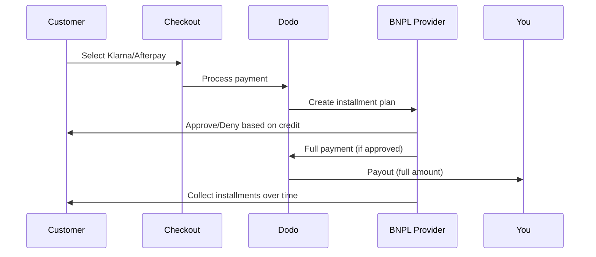

Buy Now Pay Later (BNPL) lets customers split purchases into interest-free installments, increasing average order value by 20-50% and conversion rates by 10-30% for eligible transactions.

## Why Offer BNPL?

<CardGroup cols={3}>
<Card title="Higher AOV" icon="chart-line">
Customers spend more when they can spread payments over time. Average order value increases 20-50%.
</Card>

<Card title="Better Conversion" icon="percent">
Removing payment friction at checkout. Conversion rates improve 10-30% for high-ticket items.
</Card>

<Card title="Zero Risk" icon="shield-check">
BNPL providers handle credit risk and collections. You receive full payment upfront.
</Card>
</CardGroup>

## Supported Providers

### Klarna

| Recurso | Detalhes |
| :------ | :------ |
| **Disponibilidade** | EUA + 19 países europeus |
| **Moedas** | USD, EUR, GBP, DKK, NOK, SEK, CZK, RON, PLN, CHF |
| **Mínimo** | $50,01 (ou equivalente) |
| **Assinaturas** | Sim |

**Supported Countries:** Austria, Belgium, Czech Republic, Denmark, Finland, France, Germany, Greece, Ireland, Italy, Netherlands, Norway, Poland, Portugal, Romania, Spain, Sweden, Switzerland, United Kingdom, United States

**Payment Options:**
- **Pay in 4** — Split into 4 interest-free payments
- **Pay in 30 days** — Full payment due in 30 days
- **Financing** — Longer-term installment plans

### Afterpay (Clearpay)

| Feature | Details |
| :------ | :------ |
| **Availability** | US, UK |
| **Currencies** | USD, GBP |
| **Minimum** | $50.01 (or equivalent) |
| **Subscriptions** | No |

**Payment Options:**
- **Pay in 4** — 4 interest-free payments every 2 weeks

<Note>
In the UK, Afterpay operates as "Clearpay" but uses the same API type (`afterpay_clearpay`).
</Note>

### Billie

| Feature | Details |
| :------ | :------ |
| **Availability** | Global |
| **Currencies** | GBP |
| **Minimum** | None |
| **Subscriptions** | No |

**About Billie:**
Billie is a B2B Buy Now Pay Later solution that enables businesses to offer flexible payment terms to their customers. It's designed for business-to-business transactions where buyers need invoice-based payment options.

**Payment Options:**
- **Invoice Payment** — Pay within agreed payment terms
- **Flexible Terms** — Business-friendly payment schedules

## Configuração

### Tipos de métodos da API

| Tipo | Provedor |
| :--- | :------- |
| `klarna` | Klarna |
| `afterpay_clearpay` | Afterpay / Clearpay |
| `billie` | Billie (B2B) |

### Exemplo

```javascript
const session = await client.checkoutSessions.create({
  product_cart: [{ product_id: 'prod_123', quantity: 1 }],
  allowed_payment_method_types: [
    'klarna',
    'afterpay_clearpay',
    'credit',
    'debit'
  ],
  customer: {
    email: 'customer@example.com',
    name: 'Jane Smith'
  },
  billing_address: {
    country: 'US',
    zipcode: '10001'
  },
  return_url: 'https://example.com/success'
});
```

<Warning>
Sempre inclua `credit` e `debit` como alternativas. Nem todos os clientes são elegíveis para BNPL, e transações abaixo do mínimo do provedor não serão qualificadas.
</Warning>

## Limites de valor das transações

Cada provedor de BNPL tem seu próprio valor mínimo (e, às vezes, máximo) de transação:

| Provedor | Mínimo | Máximo |
| :------- | :------ | :------ |
| Klarna | $50.01 | — |
| Afterpay | $50.01 | — |

Transações fora desses limites:
- As opções de BNPL não aparecerão no checkout
- Nenhum erro será lançado — as opções simplesmente não serão exibidas
- Os pagamentos com cartão continuarão disponíveis

Esse é o comportamento esperado. Não inclua um método de BNPL em `allowed_payment_method_types` se for improvável que o preço do seu produto esteja dentro do intervalo aceito por esse provedor.

## Como funcionam os parcelamentos



**Pontos principais:**
- Você recebe o **pagamento integral antecipadamente** do provedor de BNPL
- O provedor de BNPL gerencia o **risco de crédito e as cobranças**
- O cliente paga diretamente ao provedor em **4 parcelas** (normalmente)
- **Não há chargebacks** por falhas nas parcelas — esse é o risco do provedor

## Testes

### Dados de teste da Klarna

Use estes dados no modo de teste:

| Campo | Aprovado | Negado |
| :---- | :------- | :----- |
| **Data de nascimento** | 07-10-1970 | 07-10-1970 |
| **Nome** | Test | Test |
| **Sobrenome** | Person-us | Person-us |
| **E-mail** | customer@email.us | customer+denied@email.us |
| **Rua** | Amsterdam Ave | Amsterdam Ave |
| **Número** | 509 | 509 |
| **Cidade** | New York | New York |
| **Estado** | New York | New York |
| **Código postal** | 10024-3941 | 10024-3941 |
| **Telefone** | +13106683312 | +13106354386 |

<Note>
A transação deve ser de pelo menos $50 para que a Klarna apareça como opção.
</Note>

### Testes do Afterpay

<Steps>
<Step title="Select Afterpay">
Selecione Afterpay no checkout e clique em Pay.
</Step>

<Step title="Successful payment">
Use qualquer e-mail e endereço de entrega válidos.
</Step>

<Step title="Failed authentication">
Para testar uma falha: feche o modal do Afterpay na página de redirecionamento. O status do pagamento muda para `requires_payment_method`.
</Step>
</Steps>

## Práticas recomendadas

<AccordionGroup>
<Accordion title="Target high-ticket items">
O BNPL funciona melhor para produtos de $100 a $1000. A proposta de valor de "pagar ao longo do tempo" é mais atraente nessa faixa.
</Accordion>

<Accordion title="Show installment amounts">
"4 pagamentos de $25" é mais atraente do que "$100 com Klarna". Exiba o valor de cada pagamento sempre que possível.
</Accordion>

<Accordion title="Don't force BNPL for low-value products">
Abaixo de $50, o BNPL não aparecerá de qualquer forma. Abaixo de $100, a maioria dos clientes prefere cartões. Concentre a promoção de BNPL em itens de maior valor.
</Accordion>

<Accordion title="Collect billing address">
Os provedores de BNPL exigem informações de cobrança para verificações de crédito. Certifique-se de que seu checkout colete todos os dados do endereço.
</Accordion>

<Accordion title="Set clear expectations">
Os clientes devem entender que estão firmando um contrato de crédito com Klarna/Afterpay, e não com você.
</Accordion>
</AccordionGroup>

## Limitações

### Sem assinaturas
Os métodos de pagamento BNPL **não são compatíveis com pagamentos recorrentes**. Para produtos de assinatura, use cartões ou outros métodos compatíveis com pagamentos recorrentes.

### Aprovação baseada em crédito
Os provedores de BNPL realizam verificações instantâneas de crédito. Nem todos os clientes serão aprovados. As taxas de aprovação variam de acordo com:
- Histórico de crédito do cliente com o provedor
- Valor da transação
- Localização do cliente

### Mapeamento de moeda e país

Cada moeda é restrita à sua região correspondente:

| Moeda | Países compatíveis |
| :------- | :------------------ |
| **USD** | Somente Estados Unidos |
| **EUR** | Todos os países europeus compatíveis (Áustria, Bélgica, República Tcheca, Dinamarca, Finlândia, França, Alemanha, Grécia, Irlanda, Itália, Países Baixos, Noruega, Polônia, Portugal, Romênia, Espanha, Suécia, Suíça) |
| **GBP** | Reino Unido e todos os países europeus compatíveis |

Outras moedas compatíveis com a Klarna (DKK, NOK, SEK, CZK, RON, PLN, CHF) funcionam em seus respectivos países.

<Info>
Por exemplo, uma transação em USD exibirá opções de BNPL apenas para clientes nos EUA. Uma transação em EUR exibirá opções de BNPL em todos os países europeus compatíveis. Uma transação em GBP exibirá opções de BNPL para clientes no Reino Unido e em todos os países europeus compatíveis.
</Info>

| Provedor | Moedas compatíveis |
| :------- | :------------------- |
| Klarna | USD, EUR, GBP, DKK, NOK, SEK, CZK, RON, PLN, CHF |
| Afterpay | USD (EUA), GBP (Reino Unido) |

## Solução de problemas

<AccordionGroup>
<Accordion title="BNPL not appearing at checkout">
**Verifique:**
1. O valor da transação está dentro do intervalo compatível com o provedor? (Klarna/Afterpay: mínimo de $50.01)
2. A localização do cliente está em um país compatível?
3. A moeda é compatível com o provedor de BNPL?
4. O método de BNPL está incluído em `allowed_payment_method_types`?

**Solução:** Na maioria dos casos, a transação está abaixo do mínimo ou acima do máximo. Verifique se o valor está dentro do intervalo compatível com o provedor.
</Accordion>

<Accordion title="Customer denied by BNPL provider">
**Causas:**
- Histórico de crédito insuficiente com o provedor
- Muitos planos de parcelamento ativos
- Falha na verificação de identidade

**Solução:** Isso é esperado para alguns clientes. Certifique-se de que alternativas com cartão estejam disponíveis. Não exponha motivos específicos para a recusa.
</Accordion>

<Accordion title="Payment stuck in pending">
**Causa:** O cliente não concluiu o fluxo de autenticação com o provedor de BNPL.

**Solução:** O pagamento atingirá o tempo limite e falhará. O cliente poderá tentar novamente ou usar um método diferente.
</Accordion>
</AccordionGroup>

## Páginas relacionadas

<CardGroup cols={2}>
<Card title="Payment Methods Overview" icon="credit-card" href="/features/payment-methods">
Veja todos os métodos de pagamento compatíveis.
</Card>

<Card title="Checkout Guide" icon="book" href="/developer-resources/checkout-session">
Guia completo de implementação do checkout.
</Card>

<Card title="Testing Process" icon="flask" href="/miscellaneous/testing-process">
Todos os dados de teste dos métodos de pagamento.
</Card>

<Card title="Adaptive Currency" icon="globe" href="/features/adaptive-currency">
Suporte e conversão de moedas.
</Card>
</CardGroup>