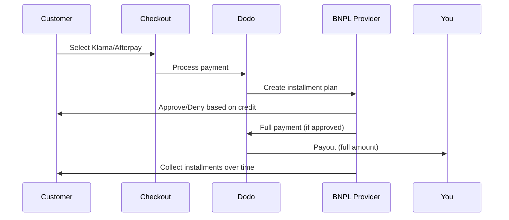

Compre Agora, Pague Depois (BNPL) permite que os clientes dividam compras em parcelas sem juros, aumentando o valor médio do pedido em 20-50% e as taxas de conversão em 10-30% para transações elegíveis.

## Por que oferecer BNPL?

<CardGroup cols={3}>
<Card title="Maior AOV" icon="chart-line">
Os clientes gastam mais quando podem parcelar os pagamentos ao longo do tempo. O valor médio do pedido aumenta 20-50%.
</Card>

<Card title="Melhor Conversão" icon="percent">
Removendo a fricção no pagamento na finalização da compra. As taxas de conversão melhoram em 10-30% para itens de alto valor.
</Card>

<Card title="Zero Risco" icon="shield-check">
Os provedores de BNPL gerenciam o risco de crédito e a cobrança. Você recebe o pagamento total antecipadamente.
</Card>
</CardGroup>

## Provedores Suportados

### Klarna

| Recurso | Detalhes |
| :------ | :------ |
| **Disponibilidade** | EUA + 19 países europeus |
| **Moedas** | USD, EUR, GBP, DKK, NOK, SEK, CZK, RON, PLN, CHF |
| **Mínimo** | $50.01 (ou equivalente) |
| **Assinaturas** | Não |

**Países Suportados:** Áustria, Bélgica, República Tcheca, Dinamarca, Finlândia, França, Alemanha, Grécia, Irlanda, Itália, Países Baixos, Noruega, Polônia, Portugal, Romênia, Espanha, Suécia, Suíça, Reino Unido, Estados Unidos

**Opções de Pagamento:**
- **Pague em 4** — Divida em 4 pagamentos sem juros
- **Pague em 30 dias** — Pagamento total devido em 30 dias
- **Financiamento** — Planos de parcelas de longo prazo

### Afterpay (Clearpay)

| Recurso | Detalhes |
| :------ | :------ |
| **Disponibilidade** | EUA, Reino Unido |
| **Moedas** | USD, GBP |
| **Mínimo** | $50.01 (ou equivalente) |
| **Assinaturas** | Não |

**Opções de Pagamento:**
- **Pague em 4** — 4 pagamentos sem juros a cada 2 semanas

<Note>
No Reino Unido, Afterpay opera como "Clearpay", mas utiliza o mesmo tipo de API (`afterpay_clearpay`).
</Note>

### Billie

| Recurso | Detalhes |
| :------ | :------ |
| **Disponibilidade** | Global |
| **Moedas** | GBP |
| **Mínimo** | Nenhum |
| **Assinaturas** | Não |

**Sobre Billie:**
Billie é uma solução B2B de Compre Agora, Pague Depois que permite que as empresas ofereçam termos de pagamento flexíveis aos seus clientes. É projetada para transações entre empresas onde os compradores precisam de opções de pagamento com fatura.

**Opções de Pagamento:**
- **Pagamento de Fatura** — Pague dentro dos termos de pagamento acordados
- **Termos Flexíveis** — Cronogramas de pagamento amigáveis para empresas

## Configuração

### Tipos de Métodos de API

| Tipo | Provedor |
| :--- | :------- |
| `klarna` | Klarna |
| `afterpay_clearpay` | Afterpay / Clearpay |
| `billie` | Billie (B2B) |

### Exemplo

```javascript
const session = await client.checkoutSessions.create({
  product_cart: [{ product_id: 'prod_123', quantity: 1 }],
  allowed_payment_method_types: [
    'klarna',
    'afterpay_clearpay',
    'credit',
    'debit'
  ],
  customer: {
    email: 'customer@example.com',
    name: 'Jane Smith'
  },
  billing_address: {
    country: 'US',
    zipcode: '10001'
  },
  return_url: 'https://example.com/success'
});
```

<Warning>
Sempre inclua `credit` e `debit` como alternativas. Nem todos os clientes são elegíveis para BNPL e transações abaixo de $50.01 não se qualificam.
</Warning>

## Valor Mínimo da Transação

**Tanto a Klarna quanto a Afterpay exigem um mínimo de $50.01 USD** (ou equivalente nas moedas suportadas).

Transações abaixo deste limite:
- As opções BNPL não aparecerão na finalização da compra
- Nenhum erro é lançado — as opções simplesmente não aparecem
- Os pagamentos com cartão continuam disponíveis

Isso é um comportamento esperado. Não inclua BNPL em `allowed_payment_method_types` para produtos abaixo de $50.

## Como Funcionam as Parcelas



**Pontos-chave:**
- Você recebe o **pagamento total antecipadamente** do provedor de BNPL
- O provedor de BNPL cuida do **risco de crédito e da cobrança**
- O cliente paga diretamente ao provedor em **4 parcelas** (normalmente)
- **Sem estornos** devido a falhas nas parcelas — isso é risco do provedor

## Teste

### Dados de Teste da Klarna

Use estes detalhes no modo de teste:

| Campo | Aprovado | Negado |
| :---- | :------- | :----- |
| **Data de Nascimento** | 07-10-1970 | 07-10-1970 |
| **Nome** | Teste | Teste |
| **Sobrenome** | Pessoa-us | Pessoa-us |
| **Email** | customer@email.us | customer+denied@email.us |
| **Rua** | Amsterdam Ave | Amsterdam Ave |
| **Número da Casa** | 509 | 509 |
| **Cidade** | Nova Iorque | Nova Iorque |
| **Estado** | Nova Iorque | Nova Iorque |
| **Código Postal** | 10024-3941 | 10024-3941 |
| **Telefone** | +13106683312 | +13106354386 |

<Note>
A transação deve ser de pelo menos $50 para que a Klarna apareça como uma opção.
</Note>

### Teste da Afterpay

<Steps>
<Step title="Selecione Afterpay">
Escolha Afterpay na finalização da compra e clique em Pagar.
</Step>

<Step title="Pagamento bem-sucedido">
Use qualquer e-mail e endereço de entrega válidos.
</Step>

<Step title="Falha na autenticação">
Para testar a falha: feche o modal da Afterpay na página de redirecionamento. O status do pagamento muda para `requires_payment_method`.
</Step>
</Steps>

## Melhores Práticas

<AccordionGroup>
<Accordion title="Direcione itens de alto valor">
BNPL funciona melhor para produtos de $100 a $1000. A proposta de valor de "pague ao longo do tempo" é mais convincente nesta faixa.
</Accordion>

<Accordion title="Mostre os valores das parcelas">
"4 pagamentos de $25" é mais cativante do que "$100 com a Klarna". Exiba o valor por pagamento sempre que possível.
</Accordion>

<Accordion title="Não force BNPL para produtos de baixo valor">
Abaixo de $50, o BNPL não aparecerá de qualquer forma. Abaixo de $100, a maioria dos clientes prefere cartões. Concentre a promoção do BNPL em itens de maior valor.
</Accordion>

<Accordion title="Colete endereço de cobrança">
Os provedores de BNPL exigem informações de cobrança para verificações de crédito. Certifique-se de que sua finalização de compra colete todos os detalhes do endereço.
</Accordion>

<Accordion title="Defina expectativas claras">
Os clientes devem entender que estão entrando em um acordo de crédito com a Klarna/Afterpay, não com você.
</Accordion>
</AccordionGroup>

## Limitações

### Sem Assinaturas
Os métodos de pagamento BNPL **não suportam pagamentos recorrentes**. Para produtos de assinatura, use cartões ou outros métodos compatíveis com recorrência.

### Aprovação Baseada em Crédito
Os provedores de BNPL realizam verificações de crédito instantâneas. Nem todos os clientes serão aprovados. As taxas de aprovação variam conforme:
- O histórico de crédito do cliente com o provedor
- O valor da transação
- A localização do cliente

### Mapeamento de Moedas e Países
Cada moeda está restrita à sua respectiva região:

| Moeda | Países Suportados |
| :------- | :------------------ |
| **USD** | Apenas Estados Unidos |
| **EUR** | Todos os países europeus suportados (Áustria, Bélgica, República Tcheca, Dinamarca, Finlândia, França, Alemanha, Grécia, Irlanda, Itália, Países Baixos, Noruega, Polônia, Portugal, Romênia, Espanha, Suécia, Suíça) |
| **GBP** | Reino Unido e todos os países europeus suportados |

Outras moedas suportadas pela Klarna (DKK, NOK, SEK, CZK, RON, PLN, CHF) funcionam em seus respectivos países.

<Info>
Por exemplo, uma transação em USD mostrará opções de BNPL apenas para clientes nos EUA. Uma transação em EUR mostrará opções de BNPL em todos os países europeus suportados. Uma transação em GBP mostrará opções de BNPL para clientes no Reino Unido e em todos os países europeus suportados.
</Info>

| Provedor | Moedas Suportadas |
| :------- | :------------------- |
| Klarna | USD, EUR, GBP, DKK, NOK, SEK, CZK, RON, PLN, CHF |
| Afterpay | USD (EUA), GBP (Reino Unido) |

## Solução de Problemas

<AccordionGroup>
<Accordion title="BNPL não aparecendo na finalização da compra">
**Verifique:**
1. O valor da transação é pelo menos $50.01?
2. A localização do cliente está em um país suportado?
3. A moeda é suportada pelo provedor de BNPL?
4. O método de BNPL está incluído em `allowed_payment_method_types`?

**Solução:** Na maioria das vezes, a transação está abaixo do mínimo. Verifique se o valor atende ao limite de $50.01.
</Accordion>

<Accordion title="Cliente negado pelo provedor de BNPL">
**Causas:**
- Histórico de crédito insuficiente com o provedor
- Muitos planos de parcelas ativos
- Falha na verificação de identidade

**Solução:** Isso é esperado para alguns clientes. Certifique-se de que as alternativas de cartão estejam disponíveis. Não exponha motivos específicos de negação.
</Accordion>

<Accordion title="Pagamento preso em pendente">
**Causa:** O cliente não completou o fluxo de autenticação com o provedor de BNPL.

**Solução:** O pagamento irá expirar e falhar. O cliente pode tentar novamente ou usar um método diferente.
</Accordion>
</AccordionGroup>

## Páginas Relacionadas

<CardGroup cols={2}>
<Card title="Visão Geral dos Métodos de Pagamento" icon="credit-card" href="/features/payment-methods">
Veja todos os métodos de pagamento suportados.
</Card>

<Card title="Guia de Finalização de Compra" icon="book" href="/developer-resources/checkout-session">
Guia completo de implementação da finalização de compra.
</Card>

<Card title="Processo de Teste" icon="flask" href="/miscellaneous/testing-process">
Todos os dados de teste para os métodos de pagamento.
</Card>

<Card title="Moeda Adaptativa" icon="globe" href="/features/adaptive-currency">
Suporte e conversão de moeda.
</Card>
</CardGroup>

<Card title="Adaptive Currency" icon="globe" href="/features/adaptive-currency">
Currency support and conversion.
</Card>
</CardGroup>