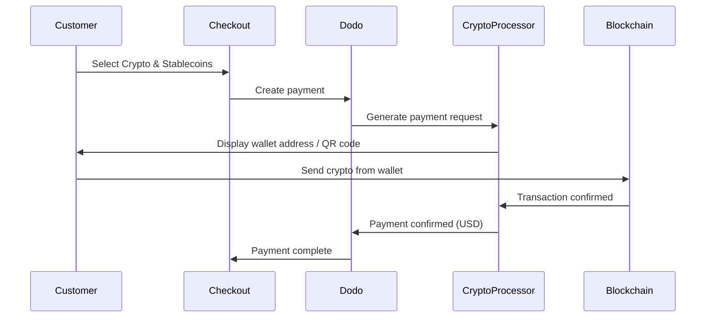

Pagamentos em Cripto & Stablecoins permitem que os clientes paguem usando criptomoedas e stablecoins de qualquer lugar do mundo (excluindo Índia). As transações são faturadas em USD, então você recebe moeda fiduciária enquanto os clientes pagam com sua carteira cripto preferida.

## Por que Oferecer Cripto & Stablecoins?

<CardGroup cols={3}>
<Card title="Global Reach" icon="globe">
Aceite pagamentos de qualquer país — sem necessidade de infraestrutura bancária do lado do cliente.
</Card>

<Card title="No Chargebacks" icon="shield-check">
As transações em cripto são irreversíveis, eliminando completamente fraudes de estorno.
</Card>

<Card title="USD Settlement" icon="dollar-sign">
Você recebe em USD — sem necessidade de gerenciar volatilidade de cripto ou carteiras.
</Card>
</CardGroup>

## Visão Geral

| Detalhe | Valor |
| :----- | :---- |
| **Moeda de Faturamento** | USD |
| **Países Suportados** | Global (Excl. IN) |
| **Assinaturas** | Não |
| **Valor Mínimo** | $0.50 |
| **Liquidação** | USD |

## Como Funciona



## Experiência do Cliente

1. O cliente seleciona Cripto & Stablecoins no checkout
2. Um endereço de carteira e um código QR são exibidos com o valor em cripto
3. O cliente envia o valor exato de sua carteira cripto
4. A transação é confirmada no blockchain
5. O cliente é redirecionado para a página de sucesso

<Info>
Pagamentos em cripto são faturados em USD. O valor em cripto exibido no checkout reflete a taxa de câmbio em tempo real no momento do pagamento.
</Info>

## Moedas e Redes Suportadas

| Moeda | Redes |
| :------- | :------- |
| **USDC** | Ethereum, Solana, Polygon, Base |
| **USDP** | Ethereum, Solana |
| **USDG** | Ethereum |

## Configuração

```javascript
const session = await client.checkoutSessions.create({
  product_cart: [{ product_id: 'prod_123', quantity: 1 }],
  allowed_payment_method_types: ['crypto', 'credit', 'debit'],
  return_url: 'https://example.com/success'
});
```

## Tipo de Método da API

| Tipo | Método | País |
| :--- | :----- | :------ |
| `crypto` | Cripto & Stablecoins | Global (Excl. IN) |

## Testes

<Steps>
<Step title="Enable test mode">
Use suas chaves de API de teste do Dodo Payments.
</Step>

<Step title="Create a test checkout">
Crie uma sessão de checkout com `crypto` nos métodos de pagamento permitidos.
</Step>

<Step title="Complete the test flow">
Siga o fluxo de pagamento cripto simulado no ambiente de teste.
</Step>
</Steps>

## Melhores Práticas

<AccordionGroup>
<Accordion title="Always include card fallbacks">
Nem todos os clientes possuem carteiras cripto. Sempre inclua `credit` e `debit` como métodos de pagamento alternativos.
</Accordion>

<Accordion title="Set clear expectations on confirmation time">
Confirmações de blockchain podem levar minutos dependendo da rede. Certifique-se de que seu checkout comunique isso aos clientes.
</Accordion>

<Accordion title="Handle underpayments and overpayments">
Pagamentos em cripto podem ocasionalmente diferir ligeiramente do valor exato devido às taxas de rede. Monitore webhooks para atualizações de status de pagamento.
</Accordion>
</AccordionGroup>

## Solução de Problemas

<AccordionGroup>
<Accordion title="Crypto not appearing at checkout">
**Checar:**
1. `crypto` incluído em `allowed_payment_method_types`?
2. O valor da transação atende ao mínimo ($0,50)?

**Solução:** Verifique se o tipo de método de pagamento está corretamente passado na sua solicitação de API.
</Accordion>

<Accordion title="Payment not confirming">
**Causa:** Os tempos de confirmação do blockchain variam. Algumas redes demoram mais que outras.

**Solução:** Aguarde a confirmação do webhook. Não trate o pagamento como falhado até que a janela de confirmação tenha passado.
</Accordion>

<Accordion title="Amount mismatch">
**Causa:** As taxas de câmbio de cripto flutuam entre o início do pagamento e o envio.

**Solução:** Monitore webhooks para o valor final confirmado. Pequenas discrepâncias são tratadas automaticamente.
</Accordion>
</AccordionGroup>

## Páginas Relacionadas

<CardGroup cols={2}>
<Card title="Payment Methods Overview" icon="credit-card" href="/features/payment-methods">
Veja todos os métodos de pagamento suportados.
</Card>

<Card title="Checkout Guide" icon="book" href="/developer-resources/checkout-session">
Guia completo de implementação de checkout.
</Card>

<Card title="Webhooks" icon="webhook" href="/developer-resources/webhooks">
Lide com confirmações de pagamento de forma assíncrona.
</Card>

<Card title="Testing Process" icon="flask" href="/miscellaneous/testing-process">
Guia completo de testes para todos os métodos de pagamento.
</Card>
</CardGroup>
