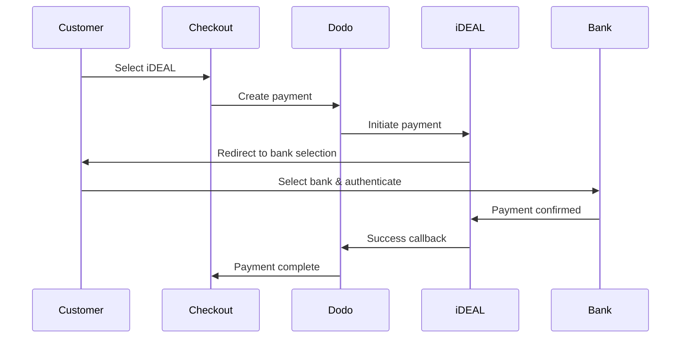
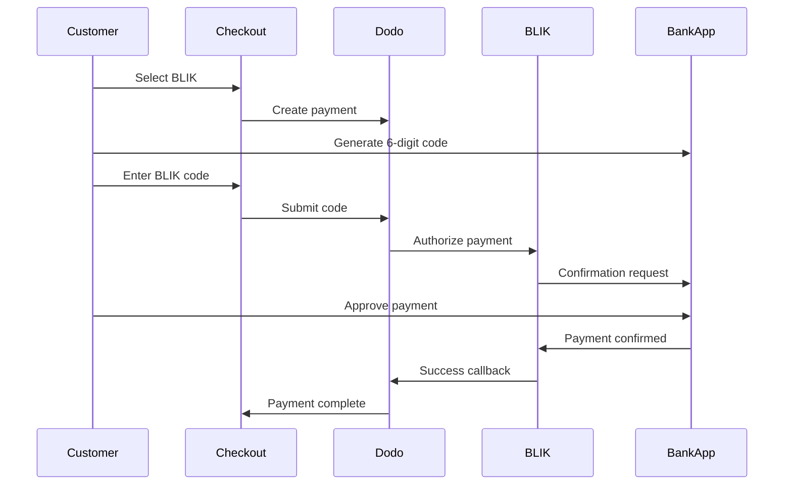
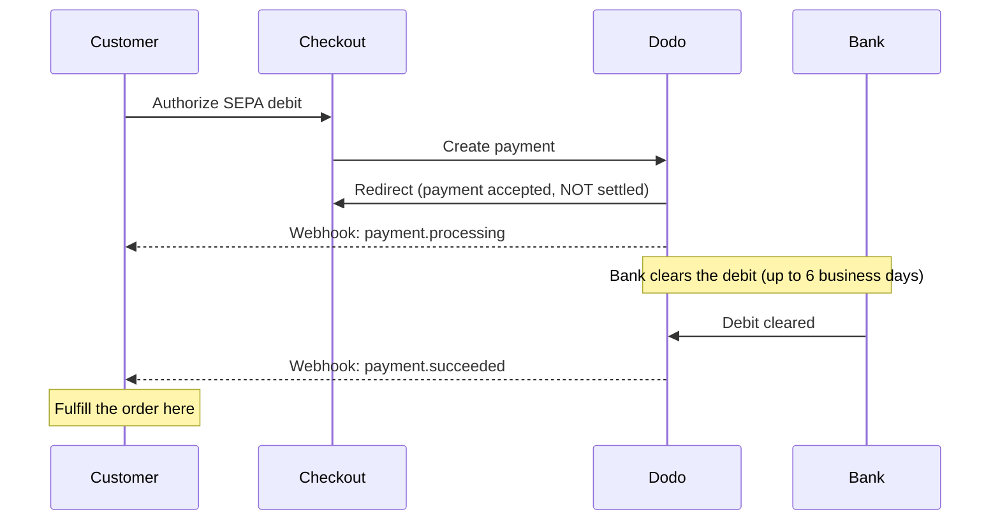

Os clientes europeus preferem fortemente métodos de pagamento locais que se integram aos seus sistemas bancários. Oferecer esses métodos pode aumentar as taxas de conversão em 20-40% nos mercados-alvo.

## Por Que Métodos de Pagamento Locais Europeus?

<CardGroup cols={3}>
<Card title="Higher Conversion" icon="chart-line">
O iDEAL captura ~60% dos pagamentos online holandeses. Não oferecê-lo significa perder clientes.
</Card>

<Card title="Lower Fraud" icon="shield-check">
Pagamentos autenticados pelo banco têm taxas de fraude quase zero e não geram estornos.
</Card>

<Card title="Real-Time Settlement" icon="bolt">
A maioria dos métodos europeus fornece confirmação de pagamento instantânea.
</Card>
</CardGroup>

## Métodos Suportados

| Método | País | Participação de mercado | Moeda | Assinaturas |
| :----- | :------ | :----------- | :------- | :-----------: |
| **iDEAL** | Países Baixos | ~60% | EUR | Não |
| **Bancontact** | Bélgica | ~50% | EUR | Não |
| **EPS** | Áustria | ~30% | EUR | Não |
| **Multibanco** | Portugal | ~40% | EUR | Não |
| **BLIK** | Polônia | ~60% | PLN | Não |
| **SEPA Direct Debit** | Zona do euro | Amplamente utilizado | EUR | Não |
| **Satispay** | Europa (Itália) | Em crescimento | EUR | Sim |

## iDEAL (Países Baixos)

iDEAL é o método de pagamento online dominante nos Países Baixos, conectando-se diretamente a todos os principais bancos holandeses.

### Como Funciona



### Bancos Suportados

Todos os principais bancos holandeses são suportados:
- ABN AMRO
- ASN Bank
- Bunq
- ING
- Knab
- Rabobank
- RegioBank
- Revolut
- SNS
- Triodos Bank
- Van Lanschot

### Configuração

```javascript
const session = await client.checkoutSessions.create({
  product_cart: [{ product_id: 'pdt_123', quantity: 1 }],
  allowed_payment_method_types: ['ideal', 'credit', 'debit'],
  billing_currency: 'EUR',
  billing_address: {
    country: 'NL',
    zipcode: '1012JS'
  },
  return_url: 'https://example.com/success'
});
```

## Bancontact (Bélgica)

Bancontact é o esquema de pagamento nacional da Bélgica, usado por virtualmente todos os bancos belgas para pagamentos online.

### Recursos
- Funciona com cartões de débito belgas existentes
- Suporte a aplicativos móveis (Payconiq by Bancontact)
- Confirmação de pagamento instantânea
- Nenhuma inscrição adicional necessária para clientes

### Configuração

```javascript
const session = await client.checkoutSessions.create({
  product_cart: [{ product_id: 'pdt_123', quantity: 1 }],
  allowed_payment_method_types: ['bancontact_card', 'credit', 'debit'],
  billing_currency: 'EUR',
  billing_address: {
    country: 'BE',
    zipcode: '1000'
  },
  return_url: 'https://example.com/success'
});
```

## EPS (Áustria)

EPS (Padrão de Pagamento Eletrônico) habilita transferências bancárias online diretas para clientes austríacos.

### Recursos
- Integração direta com bancos austríacos
- Confirmação de pagamento em tempo real
- Alta confiança entre os consumidores austríacos
- Sem chargebacks

### Bancos Suportados

Principais bancos austríacos incluindo:
- Erste Bank
- Bank Austria
- Raiffeisen
- BAWAG
- Volksbank

### Configuração

```javascript
const session = await client.checkoutSessions.create({
  product_cart: [{ product_id: 'pdt_123', quantity: 1 }],
  allowed_payment_method_types: ['eps', 'credit', 'debit'],
  billing_currency: 'EUR',
  billing_address: {
    country: 'AT',
    zipcode: '1010'
  },
  return_url: 'https://example.com/success'
});
```

## Multibanco (Portugal)

Multibanco é a rede interbancária de Portugal, oferecendo tanto pagamentos online quanto pagamentos em caixa eletrônica.

### Opções de Pagamento

1. **Internet Banking** — Transferência bancária direta via internet banking
2. **Pagamento em Caixa Eletrônica** — O cliente recebe uma referência para pagar em qualquer caixa Multibanco
3. **Mobile Banking** — Pagamento via aplicativos móveis do banco

### Como Funciona o Pagamento em Caixa Eletrônica

Para pagamentos em caixas eletrônicas, os clientes recebem uma referência de pagamento:

```
Entity: 12345
Reference: 123 456 789
Amount: €50.00
Expiry: 24 hours
```

O cliente pode pagar em qualquer caixa eletrônica portuguesa ou via internet banking usando esta referência.

### Configuração

```javascript
const session = await client.checkoutSessions.create({
  product_cart: [{ product_id: 'pdt_123', quantity: 1 }],
  allowed_payment_method_types: ['multibanco', 'credit', 'debit'],
  billing_currency: 'EUR',
  billing_address: {
    country: 'PT',
    zipcode: '1000-001'
  },
  return_url: 'https://example.com/success'
});
```

<Note>
Pagamentos via Multibanco em caixas eletrônicos podem ter atraso entre a finalização da compra e o pagamento real. Monitore os webhooks para confirmação de pagamento.
</Note>

## BLIK (Polônia)

BLIK é o método de pagamento móvel mais popular da Polônia, permitindo que os clientes paguem usando um código único de 6 dígitos gerado no aplicativo do banco. BLIK faz a liquidação em **PLN** (złoti polonês), não em EUR.

### Como Funciona



### Disponibilidade

- **Moeda de cobrança:** somente PLN
- **Tipo de transação:** somente pagamentos únicos (não disponível para assinaturas)
- **Cobertura:** todos os principais bancos poloneses compatíveis com BLIK

### Configuração

```javascript
const session = await client.checkoutSessions.create({
  product_cart: [{ product_id: 'pdt_123', quantity: 1 }],
  allowed_payment_method_types: ['blik', 'credit', 'debit'],
  billing_currency: 'PLN',
  billing_address: {
    country: 'PL',
    zipcode: '00-001'
  },
  return_url: 'https://example.com/success'
});
```

<Note>
BLIK exige uma moeda de cobrança em **PLN**. Se você informar seus preços em EUR, ative [Adaptive Currency](/features/adaptive-currency) para que os clientes poloneses sejam cobrados em PLN e o BLIK fique disponível.
</Note>

## SEPA Direct Debit (Zona do euro)

SEPA Direct Debit permite que clientes em toda a Zona do euro paguem diretamente de suas contas bancárias, em vez de usar um cartão. Ele é oferecido em checkouts em EUR para pagamentos únicos.

<Warning>
**SEPA Direct Debit não é instantâneo — um pagamento pode levar até 6 dias úteis para ser confirmado.** Diferentemente de todos os outros métodos nesta página, o cliente autorizar o débito no checkout **não** significa que o dinheiro foi compensado. Nunca conclua o pedido no redirecionamento do checkout nem em `payment.processing`; aguarde o webhook `payment.succeeded`.
</Warning>

### Como funciona

O cliente autoriza o débito durante o checkout, e o Dodo Payments então coleta os fundos da conta bancária dele. Como o banco compensa o débito de forma assíncrona, o pagamento passa por um estado `processing` antes de chegar a um resultado final:



### Linha do tempo do pagamento

| Etapa | Quando | Status do pagamento | O que significa |
| :---- | :--- | :------------- | :------------ |
| **Autorização** | No checkout | `processing` | O cliente aprovou o débito e foi redirecionado de volta. O dinheiro **ainda não** foi movimentado — não conclua o pedido. |
| **Confirmação** | Até **6 dias úteis** depois | `succeeded` | O banco compensou o débito. Conclua o pedido agora. |
| **Falha** | Até **6 dias úteis** depois | `failed` | Não foi possível coletar o débito (por exemplo, fundos insuficientes). Não conclua o pedido; notifique o cliente. |

Como a confirmação chega dias depois que o cliente sai do seu site, o seu handler de webhook — e não o redirecionamento do checkout — deve ser responsável por conceder acesso. Consulte [Como lidar com o atraso na confirmação](#handling-the-confirmation-delay) abaixo.

### Disponibilidade

- **Moeda de cobrança:** EUR
- **Tipo de transação:** Apenas pagamentos únicos (não disponível para assinaturas)

### Configuração

```javascript
const session = await client.checkoutSessions.create({
  product_cart: [{ product_id: 'pdt_123', quantity: 1 }],
  allowed_payment_method_types: ['sepa', 'credit', 'debit'],
  billing_currency: 'EUR',
  billing_address: {
    country: 'DE',
    zipcode: '10115'
  },
  return_url: 'https://example.com/success'
});
```

### IBANs de teste do SEPA

No modo de teste, insira um dos IBANs abaixo no checkout para forçar um resultado específico.

| IBAN de teste | Comportamento |
| :-------- | :------- |
| `DE89370400440532013000` | O pagamento é bem-sucedido. |
| `DE08370400440532013003` | O pagamento é bem-sucedido após um atraso de pelo menos três minutos. |
| `DE62370400440532013001` | O pagamento falha. |
| `DE78370400440532013004` | O pagamento falha após um atraso de pelo menos três minutos. |
| `DE35370400440532013002` | O pagamento é bem-sucedido e imediatamente contestado. |
| `DE65370400440002222227` | O pagamento falha devido a fundos insuficientes. |
| `DE18370400440000066666` | A conta bancária não pode ser usada, portanto o método de pagamento não pode ser criado. |

Para testar o comportamento específico de cada país, use o IBAN de sucesso equivalente de outro país da zona do euro:

| País | IBAN de sucesso |
| :------ | :----------- |
| Áustria | `AT611904300234573201` |
| Bélgica | `BE62510007547061` |
| Estônia | `EE382200221020145685` |
| Finlândia | `FI2112345600000785` |
| França | `FR1420041010050500013M02606` |
| Irlanda | `IE29AIBK93115212345678` |
| Luxemburgo | `LU280019400644750000` |

<Note>
Os IBANs de teste com atraso são úteis para confirmar que o seu handler de webhook — e não o redirecionamento do checkout — é responsável por conceder acesso, pois os pagamentos SEPA são confirmados muito depois que o cliente sai do checkout.
</Note>

### Como lidar com o atraso na confirmação

Como o SEPA é liquidado até 6 dias úteis após o checkout, você não pode depender do redirecionamento do navegador para saber se um pagamento foi compensado. Em vez disso, conduza a conclusão do pedido com base nos eventos do webhook. Ative `payload.type` e trate cada etapa:

| Tipo de evento | Quando é disparado | O que fazer |
| :--------- | :------------ | :--------- |
| `payment.processing` | O cliente autorizou o débito no checkout e foi redirecionado de volta. | **Não conclua o pedido.** Marque o pedido como pendente e, opcionalmente, informe ao cliente que o pagamento está sendo processado. |
| `payment.succeeded` | O banco compensou o débito (até 6 dias úteis depois). | Conclua o pedido — conceda acesso, disponibilize o produto e envie o recibo. |
| `payment.failed` | Não foi possível coletar o débito. | Notifique o cliente e solicite uma nova tentativa; não conclua o pedido. |

```javascript Handling SEPA payment events expandable
app.post('/webhooks/dodo', async (req, res) => {
  const event = req.body;

  switch (event.type) {
    case 'payment.processing': {
      // SEPA debit authorized but NOT settled — this can last up to 6 business days.
      // Record the order as pending; do not grant access yet.
      await markOrderPending(event.data.payment_id);
      break;
    }
    case 'payment.succeeded': {
      // The debit cleared — safe to fulfill now.
      await fulfillOrder(event.data.payment_id);
      break;
    }
    case 'payment.failed': {
      // The debit could not be collected (e.g. insufficient funds).
      await markOrderFailed(event.data.payment_id);
      // Notify the customer and prompt a retry.
      break;
    }
  }

  res.json({ received: true });
});
```

<Tip>
Sempre **conclua o pedido com base em `payment.succeeded` recebido pelo webhook**, nunca no redirecionamento do checkout nem em `payment.processing`. O redirecionamento ocorre no momento em que o cliente autoriza o débito — dias antes de o dinheiro ser efetivamente compensado. Verifique a assinatura do webhook antes de processá-lo; consulte o [guia de Webhooks](/developer-resources/webhooks) para configurar, e o [Guia de eventos de Webhook](/developer-resources/webhooks/intents/webhook-events-guide) para ver a lista completa de eventos.
</Tip>

<Warning>
Defina as expectativas do cliente no checkout. Como o acesso só é concedido depois que o débito é compensado, informe aos clientes do SEPA que o pedido está sendo processado e que eles serão notificados quando o pagamento for confirmado — caso contrário, podem esperar acesso instantâneo, como em um pagamento com cartão.
</Warning>

## Satispay (Europa)

Satispay é uma rede europeia popular de pagamentos móveis, especialmente na Itália, que permite aos clientes pagar diretamente pelo aplicativo Satispay sem compartilhar dados do cartão ou da conta bancária. O Satispay liquida os pagamentos em **EUR**.

### Recursos

- Pagamentos baseados em aplicativo, independentes das redes de cartão
- Forte adoção em toda a Itália e crescimento em outros mercados europeus
- Compatível com pagamentos únicos e assinaturas

### Disponibilidade

- **Moeda de cobrança:** EUR
- **Tipo de transação:** Pagamentos únicos e assinaturas

### Configuração

```javascript
const session = await client.checkoutSessions.create({
  product_cart: [{ product_id: 'pdt_123', quantity: 1 }],
  allowed_payment_method_types: ['satispay', 'credit', 'debit'],
  billing_currency: 'EUR',
  billing_address: {
    country: 'IT',
    zipcode: '00100'
  },
  return_url: 'https://example.com/success'
});
```

## Tipos de método da API

| Tipo | Método | País |
| :--- | :----- | :------ |
| `ideal` | iDEAL | Países Baixos |
| `bancontact_card` | Bancontact | Bélgica |
| `eps` | EPS | Áustria |
| `multibanco` | Multibanco | Portugal |
| `blik` | BLIK | Polônia |
| `sepa` | SEPA Direct Debit | Zona do euro |
| `satispay` | Satispay | Europa (Itália) |

## Checkout europeu para vários países

Para empresas que atendem a vários países europeus, inclua todos os métodos regionais:

```javascript
const session = await client.checkoutSessions.create({
  product_cart: [{ product_id: 'pdt_123', quantity: 1 }],
  allowed_payment_method_types: [
    'ideal',           // Netherlands
    'bancontact_card', // Belgium
    'eps',             // Austria
    'multibanco',      // Portugal
    'blik',            // Poland (requires PLN billing currency)
    'sepa',            // Eurozone (one-time payments only)
    'satispay',        // Europe / Italy
    'credit',          // Fallback
    'debit'            // Fallback
  ],
  billing_currency: 'EUR',
  return_url: 'https://example.com/success'
});
```

O Dodo mostra automaticamente apenas os métodos relevantes com base na localização do cliente. Um cliente neerlandês verá iDEAL; um cliente belga verá Bancontact.

## Testes

Os métodos de pagamento europeus podem ser testados no Test Mode. O fluxo de teste simula o processo de autenticação bancária.

<Note>
O SEPA Direct Debit é testado de forma diferente — em vez de um fluxo bancário simulado, você insere um IBAN de teste diretamente. Consulte [IBANs de teste do SEPA](#sepa-test-ibans).
</Note>

<Steps>
<Step title="Enable test mode">
Use suas chaves de API de teste do Dodo Payments.
</Step>

<Step title="Set appropriate billing address">
Defina o país do endereço de cobrança de acordo com o método de pagamento:
- `NL` para iDEAL
- `BE` para Bancontact
- `AT` para EPS
- `PT` para Multibanco
- `PL` para BLIK (com moeda de cobrança PLN)
- `IT` para Satispay
</Step>

<Step title="Complete the test flow">
Siga o fluxo simulado de autenticação bancária no ambiente de teste.
</Step>
</Steps>

## Práticas recomendadas

<AccordionGroup>
<Accordion title="Always include regional methods for target markets">
Se você vende para clientes neerlandeses, inclua o iDEAL. Não fazer isso é como não aceitar Visa nos EUA — você perderá uma parcela significativa das vendas.
</Accordion>

<Accordion title="Match currency to region">
A maioria dos métodos de pagamento europeus exige EUR — certifique-se de que seus preços são compatíveis com transações em euro. A única exceção é o BLIK, oferecido somente em **PLN** (złoty polonês).
</Accordion>

<Accordion title="Handle redirects gracefully">
Todos os métodos europeus envolvem redirecionamentos para sites bancários. Certifique-se de que o tratamento da URL de retorno seja robusto e considere usuários que abandonam o fluxo no meio.
</Accordion>

<Accordion title="Provide card fallbacks">
Nem todos os clientes europeus têm acesso a esses métodos regionais (turistas, expatriados etc.). Sempre inclua `credit` e `debit` como alternativas.
</Accordion>

<Accordion title="Consider Multibanco timing">
Os pagamentos em caixas eletrônicos do Multibanco podem levar horas para serem concluídos. Não bloqueie a conclusão do pedido aguardando um pagamento imediato — use webhooks para a confirmação assíncrona.
</Accordion>

<Accordion title="Account for the SEPA 6-day delay">
O SEPA Direct Debit leva até **6 dias úteis** para ser confirmado. Nunca conclua o pedido no redirecionamento do checkout nem em `payment.processing` — conceda acesso somente a partir do webhook `payment.succeeded` e defina as expectativas no checkout para que os clientes saibam que o pedido está pendente. Consulte [Como lidar com o atraso na confirmação](#handling-the-confirmation-delay).
</Accordion>
</AccordionGroup>

## Solução de problemas

<AccordionGroup>
<Accordion title="European method not appearing">
**Verifique:**
1. O país de cobrança do cliente corresponde ao país do método?
2. A moeda está definida como EUR?
3. O método está incluído em `allowed_payment_method_types`?

**Solução:** Os métodos europeus são estritamente regionais. Um cliente cujo país de cobrança seja `DE` (Alemanha) não verá o iDEAL, que está disponível somente nos Países Baixos.
</Accordion>

<Accordion title="Bank authentication failed">
**Causas:**
- O cliente cancelou durante a autenticação bancária
- O sistema de autenticação do banco está temporariamente indisponível
- O cliente inseriu credenciais incorretas

**Solução:** O cliente deve tentar novamente. Se o problema persistir, sugira tentar um método de pagamento diferente.
</Accordion>

<Accordion title="Redirect not completing">
**Causas:**
- O cliente fechou o navegador durante o redirecionamento bancário
- Problemas de rede durante a autenticação
- URL de retorno configurada incorretamente

**Solução:** Verifique se a URL de retorno está correta e acessível. Certifique-se de que ela trate os estados de sucesso e falha.
</Accordion>

<Accordion title="Multibanco payment pending">
**Causa:** O cliente recebeu a referência do pagamento, mas ainda não pagou.

**Solução:** Isso é esperado para pagamentos baseados em caixas eletrônicos. Aguarde a confirmação do webhook. A referência normalmente expira em 24 a 72 horas.
</Accordion>

<Accordion title="SEPA payment stuck in processing">
**Causa:** O SEPA Direct Debit é compensado de forma assíncrona pelo banco do cliente.

**Solução:** Isso é esperado. Um estado `payment.processing` pode durar até **6 dias úteis** antes de o débito ser compensado. Aguarde o webhook terminal `payment.succeeded` (concluir pedido) ou `payment.failed` (não concluir pedido) — não trate o redirecionamento do checkout como confirmação. Consulte [Como lidar com o atraso na confirmação](#handling-the-confirmation-delay).
</Accordion>
</AccordionGroup>

## Conformidade com a PSD2

Todos os métodos de pagamento europeus estão em conformidade com as regulamentações da PSD2 (Payment Services Directive 2):

- **Strong Customer Authentication (SCA)** — Integrada ao fluxo de autenticação bancária
- **Comunicação segura** — Todos os dados são transmitidos por canais seguros
- **Proteção do consumidor** — Conformidade total com os direitos dos consumidores da UE

## Páginas relacionadas

<CardGroup cols={2}>
<Card title="Payment Methods Overview" icon="credit-card" href="/features/payment-methods">
Veja todos os métodos de pagamento compatíveis.
</Card>

<Card title="Adaptive Currency" icon="globe" href="/features/adaptive-currency">
Suporte a moedas e conversão automática.
</Card>

<Card title="Checkout Guide" icon="book" href="/developer-resources/checkout-session">
Guia completo de implementação do checkout.
</Card>

<Card title="Webhooks" icon="webhook" href="/developer-resources/webhooks">
Trate as confirmações de pagamento de forma assíncrona.
</Card>
</CardGroup>