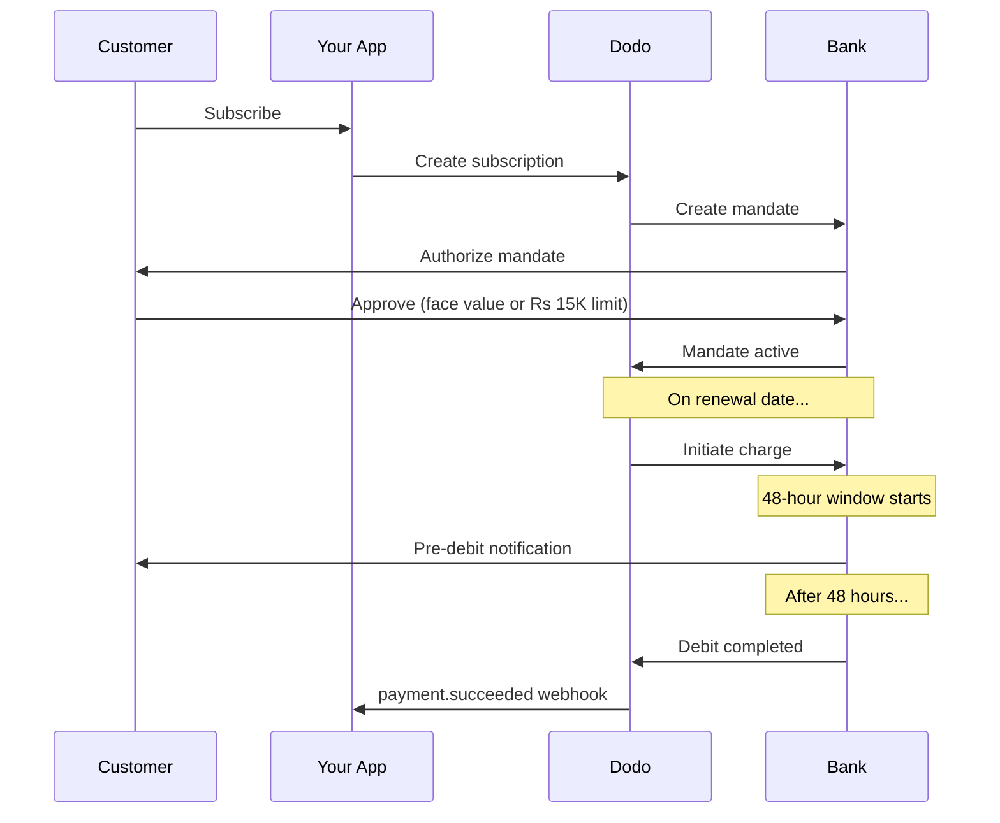

A Índia possui uma infraestrutura de pagamento única dominada por UPI (mais de 60% das transações digitais) e cartões Rupay. A Dodo Payments suporta ambos com total conformidade com o RBI para mandatos de assinatura.

## Por que os Métodos de Pagamento na Índia São Importantes

<CardGroup cols={3}>
<Card title="Dominância do UPI" icon="mobile">
O UPI processa mais de 10 bilhões de transações por mês. Muitos clientes indianos não possuem cartões internacionais.
</Card>

<Card title="Baixos Custos de Transação" icon="indian-rupee-sign">
O UPI tem taxas de transação quase inexistentes. Excelente para transações de baixo valor e alto volume.
</Card>

<Card title="Suporte para Assinaturas" icon="repeat">
Diferente da maioria dos métodos de pagamento alternativos, o UPI e Rupay suportam pagamentos recorrentes via mandatos do RBI.
</Card>
</CardGroup>

## Métodos Suportados

| Método          | Tipo                     | Assinaturas   | Valor Mínimo |
| :-------------- | :---------------------- | :------------: | :----------- |
| **UPI Collect** | QR code / VPA          | Sim*          | ₹1           |
| **Rupay Credit** | Cartão                | Sim*          | ₹1           |
| **Rupay Debit**  | Cartão                | Sim*          | ₹1           |

*Assinaturas requerem mandatos compatíveis com o RBI com regras de processamento especiais.

## Configuração

### Tipos de Métodos da API

| Tipo                                   | Descrição                                     |
| :------------------------------------- | :------------------------------------------- |
| `upi_collect` | UPI via QR code ou entrada de VPA         |
| `credit` | Cartões de crédito incluindo Rupay         |
| `debit` | Cartões de débito incluindo Rupay          |

### Exemplo: Checkout Focado na Índia

```javascript
const session = await client.checkoutSessions.create({
  product_cart: [{ product_id: 'prod_123', quantity: 1 }],
  allowed_payment_method_types: [
    'upi_collect',
    'credit',
    'debit'
  ],
  billing_currency: 'INR',
  customer: {
    email: 'customer@example.in',
    name: 'Priya Sharma',
    phone_number: '+919876543210'
  },
  billing_address: {
    country: 'IN',
    zipcode: '560001'
  },
  return_url: 'https://example.com/success'
});
```

### Requisitos para UPI

Para que o UPI apareça no checkout:
1. **País de cobrança** deve ser Índia (`IN`)
2. **Moeda** deve ser INR
3. Para comerciantes não indianos: **Moeda Adaptativa** deve estar habilitada

<Warning>
Se você é um comerciante não indiano e a Moeda Adaptativa não está habilitada, o UPI não estará disponível para seus clientes.
</Warning>

## Assinaturas com Mandatos do RBI

As assinaturas de métodos de pagamento indianos operam sob as regulamentações do RBI (Banco Reserva da Índia) com requisitos exclusivos.

### Como Funcionam os Mandatos do RBI



### Tipos de Mandato

| Valor da Assinatura | Tipo de Mandato       | Limite  |
| :------------------ | :------------------- | :----- |
| **Abaixo de Rs 15.000**  | Mandato sob demanda  | Rs 15.000 |
| **Rs 15.000 ou mais**    | Mandato de valor fixo | Valor exato da assinatura |

**Importante para mudanças de plano:** Se uma atualização resultar em uma cobrança que exceda o limite do mandato existente, a cobrança falhará e o cliente deve reautorizar.

### O Atraso de Processamento de 48 Horas

Esta é a diferença mais importante em relação aos pagamentos com cartões internacionais:

<Steps>
<Step title="Cobrança Iniciada (Dia 0)">
Na data agendada para renovação, a Dodo inicia a cobrança com o banco.
</Step>

<Step title="Notificação de Pré-Débito">
O cliente recebe notificação de seu banco sobre o próximo débito.
</Step>

<Step title="Janela de 48 Horas">
O cliente pode cancelar o mandato durante este período via seu aplicativo bancário.
</Step>

<Step title="Débito Concluído (~48-51 horas)">
Após 48 horas (mais até 3 horas adicionais para processamento bancário), os fundos são debitados.
</Step>

<Step title="Webhook Enviado">
`payment.succeeded` webhook é enviado após o débito real, e não na iniciação.
</Step>
</Steps>

<Warning>
**Não conceda benefícios na iniciação da cobrança.** Aguarde o webhook `payment.succeeded`, que chega ~48-51 horas após a data agendada para a cobrança.
</Warning>

### Manuseio da Janela de 48 Horas

```javascript
// DON'T do this:
async function handleSubscriptionRenewal(subscription) {
  // ❌ Bad: Granting access immediately when charge is initiated
  grantPremiumAccess(subscription.customer_id);
}

// DO this:
async function handlePaymentWebhook(event) {
  if (event.type === 'payment.succeeded') {
    // ✅ Good: Only grant access after payment is confirmed
    grantPremiumAccess(event.data.customer_id);
  }
  
  if (event.type === 'payment.failed') {
    // Handle failed payment (mandate cancelled, insufficient funds)
    revokePremiumAccess(event.data.customer_id);
  }
}
```

### Eventos de Webhook para Assinaturas Indianas

| Evento                                   | Quando                                | Ação                       |
| :----                                   | :---                                 | :-----                     |
| `subscription.created` | Mandato autorizado                      | Registrar início da assinatura |
| `payment.succeeded` | ~48h após a data da cobrança          | Conceder/continuar acesso    |
| `payment.failed` | Débito falhou                         | Notificar cliente, pausar acesso |
| `subscription.on_hold` | Pagamento falhou                      | Solicitar atualização do método de pagamento |
| `subscription.active` | Reativado após o pagamento             | Restaurar acesso             |

## Testes

### IDs de Teste do UPI

| Status | ID do UPI                         |
| :----- | :-----                            |
| Sucesso | `success@upi` |
| Falha    | `failure@upi` |

### Números de Teste de Cartões Indianos

| Marca      | Cenário   | Número do Cartão           | Validade | CVV |
| :----      | :-------  | :------------------------  | :-----  | :-- |
| Visa       | Sucesso   | `4576238912771450` | 06/32 | 123 |
| Visa       | Recusado   | `4706131211212123` | 06/32 | 123 |
| Mastercard | Sucesso   | `5409162669381034` | 06/32 | 123 |
| Mastercard | Recusado   | `5105105105105100` | 06/32 | 123 |

## Melhores Práticas

<AccordionGroup>
<Accordion title="Planeje para o atraso de 48 horas">
Construa seu aplicativo para lidar com a lacuna entre a iniciação da cobrança e o pagamento real. Considere:
- Períodos de graça para acesso à assinatura
- Comunicação clara aos clientes sobre o tempo de processamento
- Cumprimento baseado em webhook, não em data
</Accordion>

<Accordion title="Gerencie cancelamentos de mandato">
Os clientes podem cancelar mandatos via seus aplicativos bancários a qualquer momento. Monitore os webhooks `subscription.on_hold` e solicite que os clientes re-assinem ou atualizem os métodos de pagamento.
</Accordion>

<Accordion title="Defina valores apropriados para os mandatos">
Para preços variáveis (por exemplo, baseados em uso), considere se um mandato sob demanda de Rs 15.000 é suficiente. Se as cobranças puderem exceder isso, os clientes precisarão reautorizar.
</Accordion>

<Accordion title="Ofereça UPI de forma proeminente">
Para clientes indianos, o UPI deve ser a principal opção de pagamento. Muitos usuários preferem isso em vez de cartões devido à familiaridade e menor fricção.
</Accordion>
</AccordionGroup>

## Resolução de Problemas

<AccordionGroup>
<Accordion title="UPI não aparece no checkout">
**Verifique:**
1. País de cobrança definido como `IN`?
2. Moeda definida como `INR`?
3. Se comerciante não indiano: Moeda Adaptativa habilitada?
4. `upi_collect` incluído em `allowed_payment_method_types`?

**Solução:** Verifique se o endereço de cobrança possui `country: "IN"` e `billing_currency: "INR"`.
</Accordion>

<Accordion title="Cobrança de assinatura falhou após atualização">
**Causa:** Novo valor de cobrança excede limite de mandato existente (limite de Rs 15.000).

**Solução:** O cliente deve atualizar o método de pagamento para estabelecer um novo mandato com o limite correto.
</Accordion>

<Accordion title="Assinatura em espera, mas o cliente afirma que não cancelou">
**Causa:** O cliente pode ter cancelado o mandato durante a janela de 48 horas, ou seu banco recusou o débito.

**Solução:** O cliente precisa reautorizar o mandato ou atualizar seu método de pagamento.
</Accordion>

<Accordion title="Dedução de pagamento atrasada além de 48 horas">
**Causa:** Atrasos na API do banco podem estender o processamento em 2-3 horas adicionais.

**Solução:** Isso é esperado. Construa seu sistema para lidar com atrasos variáveis de até ~51 horas no total.
</Accordion>

<Accordion title="Mandato cancelado, mas assinatura ainda ativa">
**Causa:** Caso limite nas regulamentações do RBI — o cancelamento do mandato durante a janela de processamento não cancela imediatamente a assinatura.

**Solução:** A próxima cobrança falhará e a assinatura se moverá para `on_hold`. Monitore os webhooks para `payment.failed`.
</Accordion>
</AccordionGroup>

## Páginas Relacionadas

<CardGroup cols={2}>
<Card title="Visão Geral dos Métodos de Pagamento" icon="credit-card" href="/features/payment-methods">
Veja todos os métodos de pagamento suportados.
</Card>

<Card title="Assinaturas" icon="repeat" href="/features/subscription">
Documentação completa sobre assinaturas, incluindo mandatos do RBI.
</Card>

<Card title="Webhooks" icon="webhook" href="/developer-resources/webhooks">
Manipulação de webhook para eventos de pagamento.
</Card>

<Card title="Processo de Teste" icon="flask" href="/miscellaneous/testing-process">
Todos os dados de teste, incluindo IDs UPI e cartões indianos.
</Card>
</CardGroup>