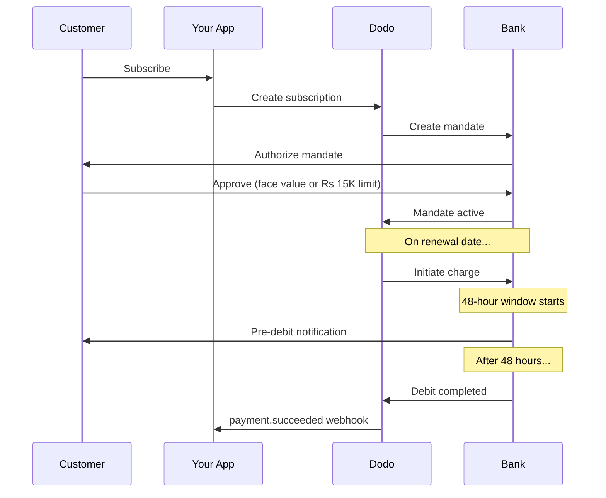

A Índia tem uma infraestrutura de pagamentos única, dominada pelo UPI (mais de 60% das transações digitais) e por cartões emitidos na Índia (Visa, Mastercard, Rupay etc.). Dodo Payments oferece suporte a todos esses métodos com total conformidade com as normas do RBI para mandatos de assinatura.

## Por que os métodos de pagamento da Índia são importantes

<CardGroup cols={3}>
<Card title="UPI Dominance" icon="mobile">
O UPI processa mais de 10 bilhões de transações por mês. Muitos clientes indianos não têm cartões internacionais.
</Card>

<Card title="Low Transaction Costs" icon="indian-rupee-sign">
O UPI tem taxas de transação próximas de zero. É excelente para transações de alto volume e menor valor.
</Card>

<Card title="Subscription Support" icon="repeat">
Ao contrário da maioria dos métodos de pagamento alternativos, o UPI e todos os cartões emitidos na Índia (Visa, Mastercard, Rupay etc.) oferecem suporte a pagamentos recorrentes por meio de mandatos do RBI.
</Card>
</CardGroup>

## Métodos compatíveis

| Método | Tipo | Assinaturas | Valor mínimo |
| :----- | :--- | :-----------: | :--------- |
| **UPI Collect** | Código QR / VPA | Sim* | ₹1 |
| **Crédito Rupay** | Cartão | Sim* | ₹1 |
| **Débito Rupay** | Cartão | Sim* | ₹1 |

*As assinaturas exigem mandatos em conformidade com as normas do RBI e regras especiais de processamento. O atraso de processamento de 48 horas se aplica a todos os cartões emitidos na Índia e ao UPI.

## Configuração

### Tipos de método da API

| Tipo | Descrição |
| :--- | :---------- |
| `upi_collect` | UPI por código QR ou inserção de VPA |
| `credit` | Cartões de crédito, incluindo Rupay |
| `debit` | Cartões de débito, incluindo Rupay |

### Exemplo: Checkout focado na Índia

```javascript
const session = await client.checkoutSessions.create({
  product_cart: [{ product_id: 'prod_123', quantity: 1 }],
  allowed_payment_method_types: [
    'upi_collect',
    'credit',
    'debit'
  ],
  billing_currency: 'INR',
  customer: {
    email: 'customer@example.in',
    name: 'Priya Sharma',
    phone_number: '+919876543210'
  },
  billing_address: {
    country: 'IN',
    zipcode: '560001'
  },
  return_url: 'https://example.com/success'
});
```

### Requisitos para UPI

Para que o UPI apareça no checkout:
1. O **país de cobrança** deve ser a Índia (`IN`)
2. A **moeda** deve ser INR
3. Para comerciantes não indianos: **Adaptive Currency** deve estar habilitado

<Warning>
Se você for um comerciante não indiano e Adaptive Currency não estiver habilitado, o UPI não estará disponível para seus clientes.
</Warning>

## Assinaturas com mandatos do RBI

As assinaturas com métodos de pagamento indianos operam sob as regulamentações do RBI (Reserve Bank of India) e têm requisitos específicos.

### Como funcionam os mandatos do RBI



### Tipos de mandato

| Valor da assinatura | Tipo de mandato | Limite |
| :------------------ | :----------- | :---- |
| **Abaixo do piso do mandato** | Mandato sob demanda | Piso do mandato (₹15.000 por padrão) |
| **Igual ou acima do piso do mandato** | Mandato de valor fixo | Valor exato da assinatura |

O valor registrado no banco do cliente é `max(mandate_floor, billing_amount)`. Portanto, o piso funciona efetivamente como o **teto de autorização** exibido ao cliente sempre que a cobrança for inferior ao piso.

**Importante para alterações de plano:** se um upgrade resultar em uma cobrança que exceda o limite do mandato existente, a cobrança falhará e o cliente deverá autorizar novamente.

### Piso de mandato configurável

O piso de mandato para e-mandates em INR pode ser configurado por meio do campo `mandate_min_amount_inr_paise` (em **paise de INR** — 1 INR = 100 paise). Você pode substituir o padrão do sistema de ₹15.000 em três níveis:

| Nível | Onde definir | Escopo |
|-------|--------------|-------|
| **Por solicitação** | `mandate_min_amount_inr_paise` em uma sessão de checkout, pagamento ou assinatura | Uma transação |
| **Comerciante** | Configurações da empresa | Todas as suas assinaturas em INR |
| **Sistema** | — | Padrão de ₹15.000 |

Prioridade de resolução: substituição por solicitação → configuração do comerciante → padrão do sistema.

```typescript
// Per-checkout override
const session = await client.checkoutSessions.create({
  product_cart: [{ product_id: 'prod_inr_monthly', quantity: 1 }],
  mandate_min_amount_inr_paise: 2_000_000, // ₹20,000 ceiling
  return_url: 'https://yoursite.com/return'
});

// Per-subscription override
const subscription = await client.subscriptions.create({
  product_id: 'prod_inr_monthly',
  customer: { email: 'customer@example.in' },
  billing: { country: 'IN', /* ... */ },
  mandate_min_amount_inr_paise: 2_000_000
});
```

| Campo | Tipo | Validação | Aplica-se a |
|-------|------|------------|------------|
| `mandate_min_amount_inr_paise` | `integer` (paise de INR) | `>= 1` | Assinaturas em INR com cartões indianos em conectores que não sejam Airwallex |

<Info>
Definir um piso mais alto permite oferecer suporte a cobranças únicas maiores posteriormente (por exemplo, upgrades de plano ou excedentes baseados no uso) sem obrigar os clientes a autorizar novamente. Definir um piso mais baixo aproxima a autorização do cliente do valor real da cobrança, mas limita a margem para futuras cobranças variáveis.
</Info>

<Warning>
Esta configuração afeta apenas e-mandates registrados para cartões emitidos na Índia (Visa, Mastercard, RuPay) em assinaturas em INR. As assinaturas UPI seguem seu próprio fluxo AutoPay e não são afetadas.
</Warning>

### O atraso de processamento de 48 horas

Esta é a diferença mais importante em relação aos pagamentos com cartões internacionais:

<Steps>
<Step title="Charge Initiated (Day 0)">
Na data de renovação programada, Dodo inicia a cobrança com o banco.
</Step>

<Step title="Pre-Debit Notification">
O cliente recebe uma notificação do banco sobre o próximo débito.
</Step>

<Step title="48-Hour Window">
O cliente pode cancelar o mandato durante esse período pelo aplicativo do banco.
</Step>

<Step title="Debit Completed (~48-51 hours)">
Após 48 horas (mais até 3 horas adicionais para o processamento bancário), os fundos são debitados.
</Step>

<Step title="Webhook Sent">
O webhook `payment.succeeded` é enviado após o débito efetivo, não no início.
</Step>
</Steps>

<Warning>
**Não conceda benefícios no início da cobrança.** Aguarde o webhook `payment.succeeded`, que chega aproximadamente 48 a 51 horas após a data programada da cobrança.
</Warning>

### Como lidar com a janela de 48 horas

```javascript
// DON'T do this:
async function handleSubscriptionRenewal(subscription) {
  // ❌ Bad: Granting access immediately when charge is initiated
  grantPremiumAccess(subscription.customer_id);
}

// DO this:
async function handlePaymentWebhook(event) {
  if (event.type === 'payment.succeeded') {
    // ✅ Good: Only grant access after payment is confirmed
    grantPremiumAccess(event.data.customer_id);
  }
  
  if (event.type === 'payment.failed') {
    // Handle failed payment (mandate cancelled, insufficient funds)
    revokePremiumAccess(event.data.customer_id);
  }
}
```

### Eventos de webhook para assinaturas indianas

| Evento | Quando | Ação |
| :---- | :--- | :----- |
| `subscription.active` | Mandato autorizado | Registrar o início da assinatura |
| `payment.succeeded` | Aproximadamente 48 horas após a data da cobrança | Conceder/continuar o acesso |
| `payment.failed` | Débito falhou | Notificar o cliente e pausar o acesso |
| `subscription.on_hold` | Pagamento falhou | Solicitar a atualização do método de pagamento |
| `subscription.active` | Reativado após o pagamento | Restaurar o acesso |

## Testes

### IDs de teste do UPI

| Status | ID do UPI |
| :----- | :----- |
| Sucesso | `success@upi` |
| Falha | `failure@upi` |

### Números de teste de cartões indianos

| Bandeira | Cenário | Número do cartão | Validade | CVV |
| :---- | :------- | :---------- | :----- | :-- |
| Visa | Sucesso | `4576238912771450` | 06/32 | 123 |
| Visa | Recusado | `4706131211212123` | 06/32 | 123 |
| Mastercard | Sucesso | `5409162669381034` | 06/32 | 123 |
| Mastercard | Recusado | `5105105105105100` | 06/32 | 123 |

## Práticas recomendadas

<AccordionGroup>
<Accordion title="Plan for the 48-hour delay">
Desenvolva sua aplicação para lidar com o intervalo entre o início da cobrança e o pagamento efetivo. Considere:
- Períodos de carência para acesso à assinatura
- Comunicação clara com os clientes sobre o tempo de processamento
- Cumprimento orientado por webhooks, não por datas
</Accordion>

<Accordion title="Handle mandate cancellations">
Os clientes podem cancelar mandatos pelos aplicativos dos bancos a qualquer momento. Monitore os webhooks `subscription.on_hold` e solicite que os clientes assinem novamente ou atualizem os métodos de pagamento.
</Accordion>

<Accordion title="Set appropriate mandate amounts">
Para preços variáveis (por exemplo, baseados no uso), avalie se um mandato sob demanda de Rs 15.000 é suficiente. Se as cobranças puderem exceder esse valor, os clientes precisarão autorizar novamente.
</Accordion>

<Accordion title="Offer UPI prominently">
Para clientes indianos, o UPI deve ser a principal opção de pagamento. Muitos usuários o preferem aos cartões devido à familiaridade e à menor fricção.
</Accordion>
</AccordionGroup>

## Solução de problemas

<AccordionGroup>
<Accordion title="UPI not appearing at checkout">
**Verifique:**
1. O país de cobrança está definido como `IN`?
2. A moeda está definida como `INR`?
3. Se for um comerciante não indiano: Adaptive Currency está habilitado?
4. `upi_collect` está incluído em `allowed_payment_method_types`?

**Solução:** verifique se o endereço de cobrança contém `country: "IN"` e `billing_currency: "INR"`.
</Accordion>

<Accordion title="Subscription charge failed after upgrade">
**Causa:** o valor da nova cobrança excede o limite do mandato existente (limite de Rs 15.000).

**Solução:** o cliente deve atualizar o método de pagamento para estabelecer um novo mandato com o limite correto.
</Accordion>

<Accordion title="Subscription on hold but customer claims they didn't cancel">
**Causa:** o cliente pode ter cancelado o mandato durante a janela de 48 horas, ou o banco pode ter recusado o débito.

**Solução:** o cliente precisa autorizar novamente o mandato ou atualizar o método de pagamento.
</Accordion>

<Accordion title="Payment deduction delayed beyond 48 hours">
**Causa:** atrasos na API do banco podem estender o processamento em mais 2 a 3 horas.

**Solução:** isso é esperado. Desenvolva seu sistema para lidar com atrasos variáveis de até aproximadamente 51 horas no total.
</Accordion>

<Accordion title="Mandate cancelled but subscription still active">
**Causa:** caso específico das regulamentações do RBI — o cancelamento do mandato durante a janela de processamento não cancela imediatamente a assinatura.

**Solução:** a próxima cobrança falhará e a assinatura passará para `on_hold`. Monitore os webhooks para `payment.failed`.
</Accordion>
</AccordionGroup>

## Páginas relacionadas

<CardGroup cols={2}>
<Card title="Payment Methods Overview" icon="credit-card" href="/features/payment-methods">
Veja todos os métodos de pagamento compatíveis.
</Card>

<Card title="Subscriptions" icon="repeat" href="/features/subscription">
Documentação completa sobre assinaturas, incluindo mandatos do RBI.
</Card>

<Card title="Webhooks" icon="webhook" href="/developer-resources/webhooks">
Tratamento de webhooks para eventos de pagamento.
</Card>

<Card title="Testing Process" icon="flask" href="/miscellaneous/testing-process">
Todos os dados de teste, incluindo IDs do UPI e cartões indianos.
</Card>
</CardGroup>