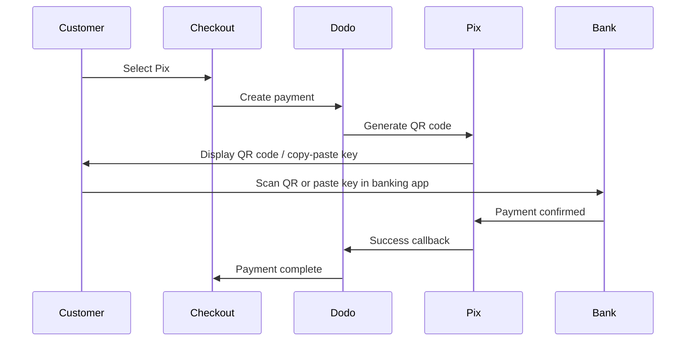

Pix é o sistema de pagamento instantâneo brasileiro criado pelo Banco Central do Brasil. Ele permite transferências em tempo real 24/7, incluindo fins de semana e feriados, e se tornou o método de pagamento mais popular no Brasil.

## Por que Oferecer Pix?

<CardGroup cols={3}>
<Card title="Dominant in Brazil" icon="chart-line">
Pix é o método de pagamento mais usado no Brasil, superando cartões de crédito e boleto.
</Card>

<Card title="Instant Settlement" icon="bolt">
Os pagamentos são confirmados em segundos, 24/7/365 — sem esperar pela janela de processamento bancário.
</Card>

<Card title="Low Friction" icon="mobile">
Os clientes pagam via QR code ou chave de copiar e colar — não é necessário número de cartão ou dados bancários.
</Card>
</CardGroup>

## Visão Geral

| Detalhe | Valor |
| :----- | :---- |
| **Moeda de Cobrança** | BRL |
| **Países Suportados** | Brasil |
| **Assinaturas** | Não |
| **Valor Mínimo** | $0,50 |
| **Liquidação** | Instantânea |

## Como Funciona



## Experiência do Cliente

1. Cliente seleciona Pix no checkout
2. Um QR code e chave de copiar e colar são exibidos
3. Cliente abre seu aplicativo bancário e escaneia o QR code ou cola a chave
4. Pagamento é confirmado instantaneamente
5. Cliente é redirecionado para a página de sucesso

<Info>
Os QR codes do Pix normalmente expiram após um período determinado. Se o cliente não concluir o pagamento a tempo, precisará reiniciar o checkout.
</Info>

## Configuração

```javascript
const session = await client.checkoutSessions.create({
  product_cart: [{ product_id: 'prod_123', quantity: 1 }],
  allowed_payment_method_types: ['pix', 'credit', 'debit'],
  billing_currency: 'BRL',
  return_url: 'https://example.com/success'
});
```

## Tipo de Método da API

| Tipo | Método | País |
| :--- | :----- | :------ |
| `pix` | Pix | Brasil |

## Testes

<Steps>
<Step title="Enable test mode">
Use suas chaves de teste da Dodo Payments.
</Step>

<Step title="Set billing currency to BRL">
Certifique-se de que a moeda de cobrança esteja definida como `BRL` em sua solicitação de checkout.
</Step>

<Step title="Enter test CPF and scan the QR code">
Quando solicitado um CPF Pix, digite `1234567890`. Um QR code de teste será gerado — escaneie com a câmera normal do seu celular (não é necessário app do Pix). Você será redirecionado para uma página de teste do Stripe onde poderá simular a transação como sucesso ou falha.
</Step>
</Steps>

## Melhores Práticas

<AccordionGroup>
<Accordion title="Set billing currency to BRL">
Pix funciona apenas com BRL. Garanta que seus preços suportem transações em Real Brasileiro para o mercado brasileiro.
</Accordion>

<Accordion title="Provide card fallbacks">
Nem todos os clientes brasileiros podem preferir Pix. Sempre inclua `credit` e `debit` como opções alternativas.
</Accordion>

<Accordion title="Handle QR code expiration">
Os QR codes do Pix expiram após um período determinado. Certifique-se de que seu checkout lide com a expiração de forma adequada e permita que os clientes regenerem o código.
</Accordion>
</AccordionGroup>

## Solução de Problemas

<AccordionGroup>
<Accordion title="Pix not appearing at checkout">
**Verificação:**
1. Moeda de cobrança definida como `BRL`?
2. `pix` incluído em `allowed_payment_method_types`?
3. País de cobrança do cliente é Brasil?

**Solução:** Pix está disponível apenas para transações em BRL. Verifique a moeda e o endereço de cobrança em sua solicitação de API.
</Accordion>

<Accordion title="QR code expired">
**Causa:** Cliente não completou o pagamento dentro do prazo de expiração.

**Solução:** Cliente precisa reiniciar o checkout para gerar um novo QR code.
</Accordion>

<Accordion title="Payment pending">
**Causa:** Pagamentos Pix são confirmados instantaneamente na maioria dos casos, mas atrasos ocasionais do lado do banco podem ocorrer.

**Solução:** Monitore os webhooks para confirmação do pagamento. Se o pagamento não for confirmado em alguns minutos, trate como falha.
</Accordion>
</AccordionGroup>

## Páginas Relacionadas

<CardGroup cols={2}>
<Card title="Payment Methods Overview" icon="credit-card" href="/features/payment-methods">
Veja todos os métodos de pagamento suportados.
</Card>

<Card title="Adaptive Currency" icon="globe" href="/features/adaptive-currency">
Suporte a moedas e conversão automática.
</Card>

<Card title="Checkout Guide" icon="book" href="/developer-resources/checkout-session">
Guia completo de implementação de checkout.
</Card>

<Card title="Webhooks" icon="webhook" href="/developer-resources/webhooks">
Lide com as confirmações de pagamento de forma assíncrona.
</Card>
</CardGroup>
