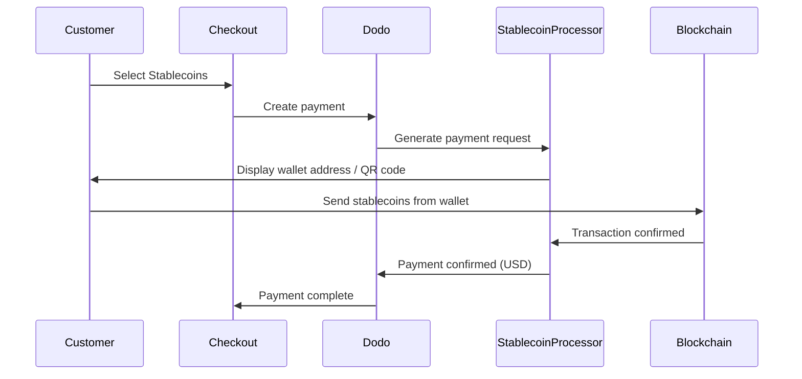

Pagamentos em stablecoin permitem que os clientes paguem usando stablecoins de qualquer lugar do mundo (exceto Índia). As transações são faturadas em USD, então você recebe moeda fiduciária enquanto os clientes pagam com sua carteira de stablecoins preferida.

## Por que Oferecer Stablecoins?

<CardGroup cols={3}>
<Card title="Global Reach" icon="globe">
Aceite pagamentos de qualquer país — nenhuma infraestrutura bancária é necessária do lado do cliente.
</Card>

<Card title="No Chargebacks" icon="shield-check">
Transações com stablecoin são irreversíveis, eliminando completamente fraudes de chargeback.
</Card>

<Card title="USD Settlement" icon="dollar-sign">
Você recebe USD — sem necessidade de gerenciar volatilidade ou carteiras.
</Card>
</CardGroup>

## Visão Geral

| Detalhe | Valor |
| :----- | :---- |
| **Moeda de Faturamento** | USD |
| **Países Suportados** | Global (Excl. IN) |
| **Assinaturas** | Não |
| **Valor Mínimo** | $0.50 |
| **Liquidação** | USD |

## Como Funciona



## Experiência do Cliente

1. O cliente seleciona Stablecoins no checkout
2. Um endereço de carteira e um código QR são exibidos com o valor em stablecoins
3. O cliente envia o valor exato de sua carteira de stablecoins
4. A transação é confirmada na blockchain
5. O cliente é redirecionado para a página de sucesso

<Info>
Os pagamentos em stablecoin são faturados em USD. O valor em stablecoin exibido no checkout reflete a taxa de câmbio em tempo real no momento do pagamento.
</Info>

## Moedas e Redes Suportadas

| Moeda | Redes |
| :------- | :------- |
| **USDC** | Ethereum, Solana, Polygon, Base |
| **USDP** | Ethereum, Solana |
| **USDG** | Ethereum |

## Configuração

```javascript
const session = await client.checkoutSessions.create({
  product_cart: [{ product_id: 'pdt_123', quantity: 1 }],
  allowed_payment_method_types: ['crypto_currency', 'credit', 'debit'],
  return_url: 'https://example.com/success'
});
```

## Tipo de Método de API

| Tipo | Método | País |
| :--- | :----- | :------ |
| `crypto_currency` | Stablecoins | Global (Exceto IN) |

## Teste

<Steps>
<Step title="Enable test mode">
Use suas chaves de API de teste do Dodo Payments.
</Step>

<Step title="Create a test checkout">
Crie uma sessão de checkout com `crypto_currency` nos métodos de pagamento permitidos.
</Step>

<Step title="Complete the test flow">
Siga o fluxo de pagamento simulado em stablecoin no ambiente de teste.
</Step>
</Steps>

## Melhores Práticas

<AccordionGroup>
<Accordion title="Always include card fallbacks">
Nem todos os clientes têm carteiras de stablecoin. Sempre inclua `credit` e `debit` como métodos de pagamento de fallback.
</Accordion>

<Accordion title="Set clear expectations on confirmation time">
Confirmações de blockchain podem levar minutos dependendo da rede. Certifique-se de que seu checkout comunique isso aos clientes.
</Accordion>

<Accordion title="Handle underpayments and overpayments">
Os pagamentos em stablecoin podem ocasionalmente diferir ligeiramente do valor exato devido a taxas de rede. Monitore os webhooks para atualizações de status de pagamento.
</Accordion>
</AccordionGroup>

## Solução de Problemas

<AccordionGroup>
<Accordion title="Stablecoins not appearing at checkout">
**Verifique:**
1. `crypto_currency` incluído em `allowed_payment_method_types`?
2. O valor da transação atende ao mínimo (US$0.50)?

**Solução:** Verifique se o tipo de método de pagamento está corretamente passado na sua solicitação de API.
</Accordion>

<Accordion title="Payment not confirming">
**Causa:** Os tempos de confirmação de blockchain variam. Algumas redes demoram mais do que outras.

**Solução:** Aguarde a confirmação do webhook. Não trate o pagamento como falho até que a janela de confirmação tenha passado.
</Accordion>

<Accordion title="Amount mismatch">
**Causa:** As taxas de rede podem fazer com que o valor recebido difira ligeiramente do valor solicitado.

**Solução:** Monitore os webhooks para o valor final confirmado. Pequenas discrepâncias são tratadas automaticamente.
</Accordion>
</AccordionGroup>

## Páginas Relacionadas

<CardGroup cols={2}>
<Card title="Payment Methods Overview" icon="credit-card" href="/features/payment-methods">
Veja todos os métodos de pagamento suportados.
</Card>

<Card title="Checkout Guide" icon="book" href="/developer-resources/checkout-session">
Guia completo de implementação de checkout.
</Card>

<Card title="Webhooks" icon="webhook" href="/developer-resources/webhooks">
Trate as confirmações de pagamento de forma assíncrona.
</Card>

<Card title="Testing Process" icon="flask" href="/miscellaneous/testing-process">
Guia completo de teste para todos os métodos de pagamento.
</Card>
</CardGroup>
