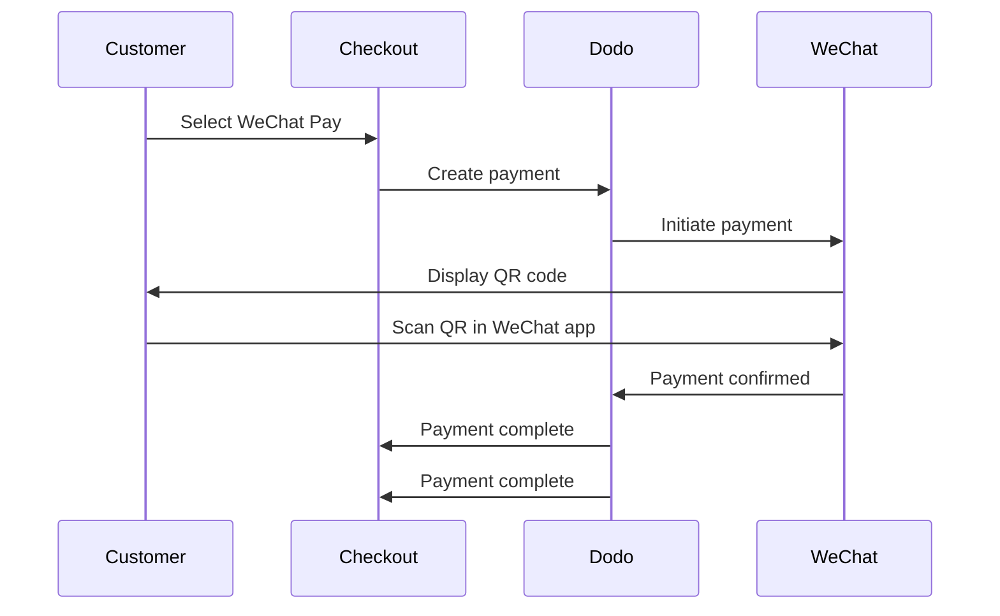

WeChat Pay é uma das duas plataformas dominantes de pagamento móvel na China, utilizada por mais de um bilhão de pessoas. Permite pagamentos via códigos QR dentro do aplicativo WeChat, tornando-se essencial para empresas que têm como alvo consumidores chineses.

## Por que Oferecer WeChat Pay?

<CardGroup cols={3}>
<Card title="1B+ Users" icon="users">
WeChat Pay é utilizado por mais de um bilhão de pessoas, tornando-se uma das maiores plataformas de pagamento do mundo.
</Card>

<Card title="Mobile-First" icon="mobile">
Os pagamentos são concluídos inteiramente no aplicativo WeChat — rápido, familiar e sem fricção para os clientes chineses.
</Card>

<Card title="Dual Currency" icon="money-bill-transfer">
Aceite pagamentos em USD e CNY, proporcionando flexibilidade para transações internacionais e domésticas.
</Card>
</CardGroup>

## Visão Geral

| Detalhe | Valor |
| :----- | :---- |
| **Moeda de Faturamento** | USD, CNY |
| **Assinaturas** | Não |
| **Valor Mínimo** | $0.50 / ¥1.00 |
| **Liquidação** | USD |

## Como Funciona



## Experiência do Cliente

1. O cliente seleciona WeChat Pay no checkout
2. Um código QR é exibido na página de checkout
3. O cliente abre o WeChat no celular e escaneia o código QR
4. O cliente confirma o pagamento no aplicativo WeChat
5. O pagamento é confirmado instantaneamente e o cliente é redirecionado para a página de sucesso

<Info>
Clientes pagam em USD ou CNY, e você recebe a liquidação em USD.
</Info>

## Configuração

```javascript
const session = await client.checkoutSessions.create({
  product_cart: [{ product_id: 'prod_123', quantity: 1 }],
  allowed_payment_method_types: ['wechat_pay', 'credit', 'debit'],
  return_url: 'https://example.com/success'
});
```

## Tipo de Método de API

| Tipo | Método | Moedas |
| :--- | :----- | :--------- |
| `wechat_pay` | WeChat Pay | USD, CNY |

## Testes

<Steps>
<Step title="Enable test mode">
Use suas chaves de API de teste Dodo Payments.
</Step>

<Step title="Create a test checkout">
Crie uma sessão de checkout com `wechat_pay` nos métodos de pagamento permitidos.
</Step>

<Step title="Scan the QR code">
Um código QR de teste será gerado — escaneie-o com a câmera normal do telefone (não é necessário o aplicativo WeChat). Você será redirecionado para uma página de teste onde poderá simular a transação como sucesso ou falha.
</Step>
</Steps>

## Melhores Práticas

<AccordionGroup>
<Accordion title="Target Chinese customers">
WeChat Pay é usado principalmente por consumidores chineses. Inclua-o quando sua base de clientes incluir compradores chineses ou quando você estiver direcionando ao mercado chinês.
</Accordion>

<Accordion title="Always include card fallbacks">
Nem todos os clientes têm WeChat. Sempre inclua `credit` e `debit` como métodos de pagamento alternativos.
</Accordion>

<Accordion title="Optimize for mobile">
Muitos usuários do WeChat Pay navegam no celular. Certifique-se de que sua página de checkout seja responsiva — a leitura de QR code funciona melhor quando o checkout é exibido em um desktop ou tablet enquanto o cliente escaneia com o celular.
</Accordion>

<Accordion title="Consider both currencies">
WeChat Pay suporta tanto USD quanto CNY. Escolha a moeda de faturamento que melhor se adapte ao seu mercado-alvo — USD para transações internacionais, CNY para transações domésticas chinesas.
</Accordion>
</AccordionGroup>

## Solução de Problemas

<AccordionGroup>
<Accordion title="WeChat Pay not appearing at checkout">
**Verifique:**
1. `wechat_pay` incluído em `allowed_payment_method_types`?
2. Moeda de faturamento definida para USD ou CNY?
3. Valor da transação atende ao mínimo?

**Solução:** Verifique se o tipo de método de pagamento e a moeda estão corretos em sua solicitação de API.
</Accordion>

<Accordion title="QR code not scanning">
**Causa:** O código QR pode ter expirado, ou a versão do WeChat do cliente está desatualizada.

**Solução:** Atualize a página de checkout para gerar um novo código QR. Certifique-se de que o cliente está utilizando uma versão atual do WeChat.
</Accordion>

<Accordion title="Payment not confirming">
**Causa:** O WeChat Pay geralmente confirma instantaneamente, mas atrasos na rede podem ocorrer.

**Solução:** Monitore os webhooks para confirmação do pagamento. Se o pagamento não for confirmado em poucos minutos, o cliente pode precisar tentar novamente.
</Accordion>
</AccordionGroup>

## Páginas Relacionadas

<CardGroup cols={2}>
<Card title="Payment Methods Overview" icon="credit-card" href="/features/payment-methods">
Veja todos os métodos de pagamento suportados.
</Card>

<Card title="Checkout Guide" icon="book" href="/developer-resources/checkout-session">
Guia de implementação completa do checkout.
</Card>

<Card title="Webhooks" icon="webhook" href="/developer-resources/webhooks">
Trate as confirmações de pagamento de forma assíncrona.
</Card>

<Card title="Testing Process" icon="flask" href="/miscellaneous/testing-process">
Guia de teste completa para todos os métodos de pagamento.
</Card>
</CardGroup>
