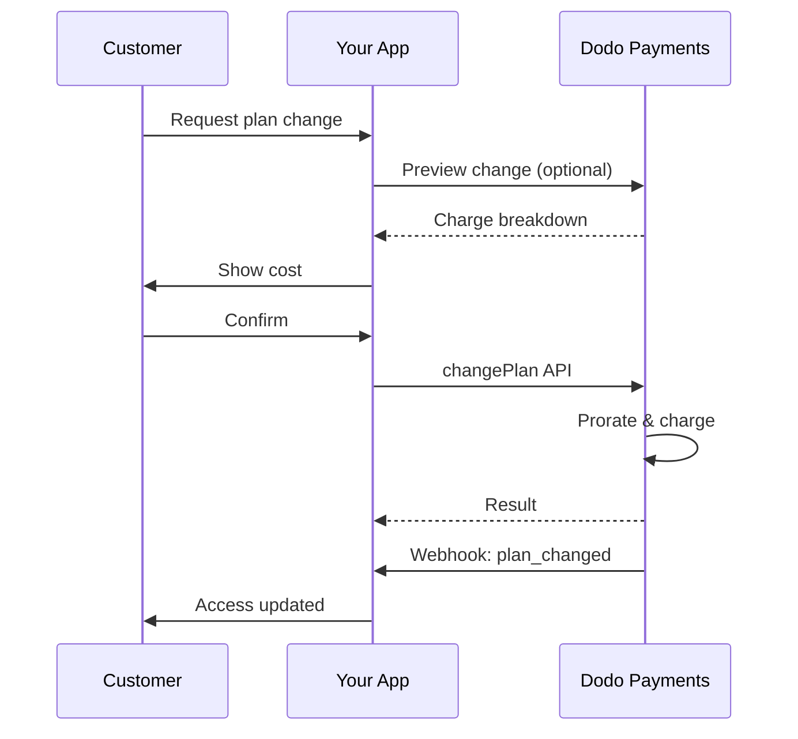
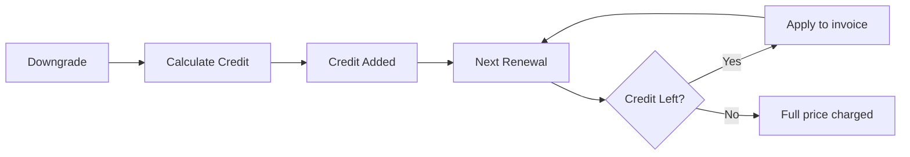

<Info>
Subscriptions let you sell ongoing access with automated renewals. Use flexible billing cycles, free trials, plan changes, and add‑ons to tailor pricing for each customer.
</Info>

<CardGroup cols={2}>
<Card title="Upgrade & Downgrade" icon="repeat" href="/developer-resources/subscription-upgrade-downgrade">
Control plan changes with proration and quantity updates.
</Card>

<Card title="On‑Demand Subscriptions" icon="bolt" href="/developer-resources/ondemand-subscriptions">
Authorize a mandate now and charge later with custom amounts.
</Card>

<Card title="Customer Portal" icon="id-card" href="/features/customer-portal">
Let customers manage plans, billing, and cancellations.
</Card>

<Card title="Subscription Webhooks" icon="code" href="/developer-resources/webhooks/intents/subscription">
React to lifecycle events like created, renewed, and canceled.
</Card>
</CardGroup>

## What Are Subscriptions?

Subscriptions are recurring products customers purchase on a schedule. They’re ideal for:

- **SaaS licenses**: Apps, APIs, or platform access
- **Memberships**: Communities, programs, or clubs
- **Digital content**: Courses, media, or premium content
- **Support plans**: SLAs, success packages, or maintenance

## Key Benefits

- **Predictable revenue**: Recurring billing with automated renewals
- **Flexible cycles**: Monthly, annual, custom intervals, and trials
- **Plan agility**: Proration for upgrades and downgrades
- **Add‑ons and seats**: Attach optional, quantifiable upgrades
- **Seamless checkout**: Hosted checkout and customer portal
- **Developer-first**: Clear APIs for creation, changes, and usage tracking

## Creating Subscriptions

Create subscription products in your Dodo Payments dashboard, then sell them through checkout or your API. Separating products from active subscriptions lets you version pricing, attach add‑ons, and track performance independently.

### Subscription product creation

Configure the fields in the dashboard to define how your subscription sells, renews, and bills. The sections below map directly to what you see in the creation form.

#### Product details

- **Product Name** (required): The display name shown in checkout, customer portal, and invoices.
- **Product Description** (required): A clear value statement that appears in checkout and invoices.
- **Product Image** (required): PNG/JPG/WebP up to 3 MB. Used on checkout and invoices.
- **Brand**: Associate the product with a specific brand for theming and emails.
- **Tax Category** (required): Choose the category (for example, SaaS) to determine tax rules.

<Tip>
Pick the most accurate tax category to ensure correct tax collection per region.
</Tip>

#### Pricing

- **Pricing Type**: Choose <b>Subscription</b> (this guide). Alternatives are Single Payment and Usage Based Billing.
- **Price** (required): Base recurring price with currency.
- **Discount Applicable (%)**: Optional percentage discount applied to the base price; reflected in checkout and invoices.
- **Repeat payment every** (required): Interval for renewals, e.g., every 1 Month. Select the cadence (months or years) and quantity.
- **Subscription Period** (required): Total term for which the subscription remains active (e.g., 10 Years). After this period ends, renewals stop unless extended.
- **Trial Period Days** (required): Set trial length in days. Use 0 to disable trials. The first charge occurs automatically when the trial ends.
- **Select add‑on**: Attach up to 10 add‑ons that customers can purchase alongside the base plan.

<Warning>
Changing pricing on an active product affects new purchases. Existing subscriptions follow your plan‑change and proration settings.
</Warning>

<Info>
Add‑ons are ideal for quantifiable extras such as seats or storage. You can control allowed quantities and proration behavior when customers change them.
</Info>

#### Advanced settings

- **Tax Inclusive Pricing**: Display prices inclusive of applicable taxes. Final tax calculation still varies by customer location.
- **Generate license keys**: Issue a unique key to each customer after purchase. See the <a href="/features/license-keys">License Keys</a> guide.
- **Digital Product Delivery**: Deliver files or content automatically after purchase. Learn more in <a href="/features/digital-product-delivery">Digital Product Delivery</a>.
- **Metadata**: Attach custom key–value pairs for internal tagging or client integrations. See <a href="/api-reference/metadata">Metadata</a>.

<Tip>
Use metadata to store identifiers from your system (e.g., accountId) so you can reconcile events and invoices later.
</Tip>

## Subscription Trials

Trials let customers access subscriptions without immediate payment. The first charge occurs automatically when the trial ends.

### Configuring Trials

Set **Trial Period Days** in the product pricing section (use `0` to disable). You can override this when creating subscriptions:

```typescript
// Via subscription creation
const subscription = await client.subscriptions.create({
  customer_id: 'cus_123',
  product_id: 'prod_monthly',
  trial_period_days: 14  // Overrides product's trial period
});

// Via checkout session
const session = await client.checkoutSessions.create({
  product_cart: [{ product_id: 'prod_monthly', quantity: 1 }],
  subscription_data: { trial_period_days: 14 }
});
```

<Warning>
The `trial_period_days` value must be between 0 and 10,000 days.
</Warning>

### Detecting Trial Status

<Warning>
Currently, there is no direct field to detect trial status. The following is a workaround that requires querying payments, which is inefficient. We are working on a more efficient solution.
</Warning>

To determine if a subscription is in trial, retrieve the list of payments for the subscription. If there is exactly one payment with amount 0, the subscription is in trial period:

```typescript
const subscription = await client.subscriptions.retrieve('sub_123');
const payments = await client.payments.list({
  subscription_id: subscription.subscription_id
});

// Check if subscription is in trial
const isInTrial = payments.items.length === 1 && 
                  payments.items[0].total_amount === 0;
```

### Updating Trial Period

Extend the trial by updating `next_billing_date`:

```typescript
await client.subscriptions.update('sub_123', {
  next_billing_date: '2025-02-15T00:00:00Z'  // New trial end date
});
```

<Warning>
You cannot set `next_billing_date` to a past time. The date must be in the future.
</Warning>

## Subscription Plan Changes

Alterações de plano permitem que você faça upgrade ou downgrade de assinaturas, ajuste quantidades ou migre para diferentes produtos. Dependendo do modo de rateio que você seleciona, uma alteração pode acionar uma cobrança imediata, gerar crédito ou aplicarse sem ajuste de cobrança.

<Tip>
You can change subscription plans and update the next billing date directly from the Dodo Payments dashboard. This provides a quick way to adjust subscriptions for customer support requests, promotional upgrades, or plan migrations without making API calls.
</Tip>

<Tip>
**Enable self-service plan changes:** Want customers to upgrade or downgrade their own subscriptions via the Customer Portal? Add your subscription products to a Product Collection and enable "Allow Subscription Updates" in your Subscription Settings.
</Tip>



<Card title="Product Collections" icon="layer-group" href="/features/product-collections">
  Group related products into collections to enable seamless upgrade/downgrade paths in the Customer Portal.
</Card>

### Proration Modes

Choose how customers are billed when changing plans:

<Info>
**Comparação rápida dos quatro modos de rateio:**

| | `prorated_immediately` | `difference_immediately` | `full_immediately` | `do_not_bill` |
|---|---|---|---|---|
| **Upgrade** | Cobrança rateada para os dias restantes | Diferença de preço total cobrada | Preço total do novo plano cobrado | Sem cobrança — troca imediata |
| **Downgrade** | Crédito rateado para os dias restantes | Diferença de preço total como crédito | Sem crédito, cobrança total | Sem crédito — troca imediata |
| **Ciclo de cobrança** | Permanece o mesmo | Permanece o mesmo | Reinicia hoje | Permanece o mesmo |
| **Melhor para** | Cobrança justa baseada no tempo | Alterações simples de nível | Reinícios de ciclo de cobrança | Migrações gratuitas ou trocas por cortesia | 
</Info>

#### `prorated_immediately`
Charges prorated amount based on remaining time in the current billing cycle. Best for fair billing that accounts for unused time.

```typescript
await client.subscriptions.changePlan('sub_123', {
  product_id: 'prod_pro',
  quantity: 1,
  proration_billing_mode: 'prorated_immediately'
});
```

#### `difference_immediately`
Charges the price difference immediately (upgrade) or adds credit for future renewals (downgrade). Best for simple upgrade/downgrade scenarios.

```typescript
// Upgrade: charges $50 (difference between $30 and $80)
// Downgrade: credits remaining value, auto-applied to renewals
await client.subscriptions.changePlan('sub_123', {
  product_id: 'prod_pro',
  quantity: 1,
  proration_billing_mode: 'difference_immediately'
});
```

<Info>
Créditos por rebaixamentos usando `difference_immediately` são vinculados à assinatura e aplicados automaticamente às renovações futuras. Eles são distintos das concessões de <a href="/features/credit-based-billing">Credit-Based Billing</a>.
</Info>

When a customer downgrades with `difference_immediately`, the unused value becomes a subscription-scoped credit that automatically offsets future renewals:



#### `full_immediately`
Charges full new plan amount immediately, ignoring remaining time. Best for resetting billing cycles.

```typescript
await client.subscriptions.changePlan('sub_123', {
  product_id: 'prod_monthly',
  quantity: 1,
  proration_billing_mode: 'full_immediately'
});
```

#### `do_not_bill`
Troca para o novo plano sem ajuste de cobrança. Sem cobranças de rateio, sem créditos — o cliente simplesmente muda para o novo plano. Melhor para migrações por cortesia, trocas de plano gratuitas ou cenários onde você quer absorver a diferença de custo.

```typescript
await client.subscriptions.changePlan('sub_123', {
  product_id: 'prod_new_plan',
  quantity: 1,
  proration_billing_mode: 'do_not_bill'
});
```

<AccordionGroup>
<Accordion title="Example: Prorated upgrade calculation">

**Cenário**: Cliente no Básico ($30/mês) faz upgrade para Pro ($80/mês) no dia 16 de um ciclo de 30 dias usando `prorated_immediately`.

```
Unused credit from Basic = $30 × (15 remaining / 30 total) = $15.00
Prorated cost of Pro     = $80 × (15 remaining / 30 total) = $40.00
────────────────────────────────────────────────────────────────────
Immediate charge         = $40.00 − $15.00 = $25.00
```

Próxima renovação na data de cobrança original: **$80.00/mês**.

<Tip>
Para mais exemplos de cálculos detalhados e casos extremos, consulte nosso guia completo [Guia de Upgrade & Downgrade](/developer-resources/subscription-upgrade-downgrade).
</Tip>

</Accordion>
<Accordion title="Example: Downgrade credit calculation">

**Cenário**: Cliente no Pro ($80/mês) faz downgrade para Starter ($20/mês) usando `difference_immediately`.

```
Credit = Old plan − New plan = $80 − $20 = $60.00
```

O crédito de $60 é aplicado automaticamente em futuras renovações:
- Renovação 1: $20 − $20 (crédito) = **$0.00** ($40 crédito restante)
- Renovação 2: $20 − $20 (crédito) = **$0.00** ($20 crédito restante)  
- Renovação 3: $20 − $20 (crédito) = **$0.00** (crédito esgotado)
- Renovação 4: **$20.00** (preço total)

<Info>
Saiba mais sobre como os créditos são geridos no [Guia de Upgrade & Downgrade](/developer-resources/subscription-upgrade-downgrade).
</Info>

</Accordion>
</AccordionGroup>

### Alterando Planos com Complementos

Modifique complementos ao alterar planos. Complementos são incluídos nos cálculos de rateio:

```typescript
await client.subscriptions.changePlan('sub_123', {
  product_id: 'prod_pro',
  quantity: 1,
  proration_billing_mode: 'difference_immediately',
  addons: [{ addon_id: 'addon_extra_seats', quantity: 2 }]  // Add add-ons
  // addons: []  // Empty array removes all existing add-ons
});
```

<Info>
As mudanças de plano acionam cobranças imediatas. Cobranças falhas podem mover a assinatura para o status `on_hold`. Acompanhe as alterações via eventos de webhook `subscription.plan_changed`.
</Info>

### Pré-visualizando Alterações de Plano

Antes de se comprometer com uma alteração de plano, pré-visualize a exata cobrança e assinatura resultante:

```typescript
const preview = await client.subscriptions.previewChangePlan('sub_123', {
  product_id: 'prod_pro',
  quantity: 1,
  proration_billing_mode: 'prorated_immediately'
});

// Show customer the charge before confirming
console.log('You will be charged:', preview.immediate_charge.summary);
```

<Card title="Preview Change Plan API" icon="eye" href="/api-reference/subscriptions/preview-change-plan">
  Pré-visualize alterações de plano antes de se comprometer com elas.
</Card>

## Estados de Assinatura

As assinaturas podem estar em diferentes estados ao longo de seu ciclo de vida:

- **`active`**: Assinatura está ativa e renovará automaticamente
- **`on_hold`**: Assinatura está pausada devido a falha no pagamento. Atualização do método de pagamento necessária para reativar
- **`cancelled`**: Assinatura foi cancelada e não renovará
- **`expired`**: Assinatura atingiu sua data final
- **`pending`**: Assinatura está sendo criada ou processada

### Estado de Espera

Uma assinatura entra no estado `on_hold` quando:

- Um pagamento de renovação falha (fundos insuficientes, cartão expirado, etc.)
- Uma cobrança de alteração de plano falha
- Autorização do método de pagamento falha

<Warning>
Quando uma assinatura está no estado `on_hold`, ela não renovará automaticamente. Você deve atualizar o método de pagamento para reativar a assinatura.
</Warning>

### Reativando de Espera

Para reativar uma assinatura do estado `on_hold`, atualize o método de pagamento. Isso automaticamente:

1. Cria uma cobrança para dívidas pendentes
2. Gera uma nota fiscal
3. Processa o pagamento usando o novo método de pagamento
4. Reativa a assinatura para o estado `active` ao concluir o pagamento com sucesso

```typescript
// Reactivate subscription from on_hold
const response = await client.subscriptions.updatePaymentMethod('sub_123', {
  type: 'new',
  return_url: 'https://example.com/return'
});

// For on_hold subscriptions, a charge is automatically created
if (response.payment_id) {
  console.log('Charge created:', response.payment_id);
  // Redirect customer to response.payment_link to complete payment
  // Monitor webhooks for payment.succeeded and subscription.active
}
```

<Info>
Após atualizar com sucesso o método de pagamento para uma assinatura `on_hold`, você receberá `payment.succeeded` seguido pelos eventos de webhook `subscription.active`.
{/* LOCKED_PATTERN_07427f62e4e59df6149a8a60508baae30ae */}

## Gestão de API

<AccordionGroup>
<Accordion title="Create subscriptions">
Use `POST /subscriptions` para criar assinaturas programaticamente a partir de produtos, com testes opcionais e complementos.

<Card title="API Reference" icon="code" href="/api-reference/subscriptions/post-subscriptions">
Veja a API de criação de assinatura.
</Card>
</Accordion>

<Accordion title="Update subscriptions">
Use `PATCH /subscriptions/{id}` para atualizar quantidades, cancelar na próxima data de cobrança ou modificar metadados.

<Card title="API Reference" icon="code" href="/api-reference/subscriptions/patch-subscriptions">
Saiba como atualizar detalhes de assinatura.
</Card>
</Accordion>

<Accordion title="Change plans (proration)">
Altere o produto ativo e as quantidades com controles de rateio.

<Card title="API Reference" icon="code" href="/api-reference/subscriptions/change-plan">
Revise as opções de alteração de plano.
</Card>
</Accordion>

<Accordion title="On‑demand charges">
Para assinaturas sob demanda, cobre valores específicos conforme necessário.

<Card title="API Reference" icon="code" href="/api-reference/subscriptions/create-charge">
Cobre uma assinatura sob demanda.
</Card>
</Accordion>

<Accordion title="List and retrieve">
Use `GET /subscriptions` para listar todas as assinaturas e `GET /subscriptions/{id}` para recuperar uma.

<Card title="API Reference" icon="code" href="/api-reference/subscriptions/get-subscriptions">
Navegue pelas APIs de listagem e recuperação.
</Card>
</Accordion>

<Accordion title="Usage history">
Recupere o uso registrado para modelos de preço medido ou híbrido.

<Card title="API Reference" icon="code" href="/api-reference/subscriptions/get-usage-history">
Veja a API de histórico de uso.
</Card>
</Accordion>

<Accordion title="Update payment method">
Atualize o método de pagamento de uma assinatura. Para assinaturas ativas, isso atualiza o método de pagamento para futuras renovações. Para assinaturas no estado `on_hold`, isso reativa a assinatura criando uma cobrança para dívidas pendentes.

<Card title="API Reference" icon="code" href="/api-reference/subscriptions/update-payment-method">
Aprenda como atualizar métodos de pagamento e reativar assinaturas.
</Card>
</Accordion>
</AccordionGroup>

## Casos de Uso Comuns

- **SaaS e APIs**: Acesso em camadas com complementos para assentos ou uso
- **Conteúdo e mídia**: Acesso mensal com testes introdutórios
- **Planos de suporte B2B**: Contratos anuais com complementos de suporte premium
- **Ferramentas e plugins**: Chaves de licença e lançamentos versionados

## Exemplos de Integração

### Sessões de Checkout (assinaturas)
Ao criar sessões de checkout, inclua seu produto de assinatura e complementos opcionais:

```typescript
const session = await client.checkoutSessions.create({
  product_cart: [
    {
      product_id: 'prod_subscription',
      quantity: 1
    }
  ]
});
```

### Alterações de plano com rateio
Faça upgrade ou downgrade de uma assinatura e controle o comportamento do rateio:

```typescript
await client.subscriptions.changePlan('sub_123', {
  product_id: 'prod_new',
  quantity: 1,
  proration_billing_mode: 'difference_immediately'
});
```

### Cancelar na próxima data de cobrança
Agende um cancelamento que entre em vigor no final do período de cobrança atual:

```typescript
await client.subscriptions.update('sub_123', {
  cancel_at_next_billing_date: true
});
```

### Assinaturas sob demanda
Crie uma assinatura sob demanda e cobre mais tarde conforme necessário:

```typescript
const onDemand = await client.subscriptions.create({
  customer_id: 'cus_123',
  product_id: 'prod_on_demand',
  on_demand: true
});

await client.subscriptions.createCharge(onDemand.id, {
  amount: 4900,
  currency: 'USD',
  description: 'Extra usage for September'
});
```

### Atualizar método de pagamento para assinatura ativa
Atualize o método de pagamento para uma assinatura ativa:

```typescript
// Update with new payment method
const response = await client.subscriptions.updatePaymentMethod('sub_123', {
  type: 'new',
  return_url: 'https://example.com/return'
});

// Or use existing payment method
await client.subscriptions.updatePaymentMethod('sub_123', {
  type: 'existing',
  payment_method_id: 'pm_abc123'
});
```

### Reative a assinatura de on_hold
Reative uma assinatura que foi suspensa devido a falha de pagamento:

```typescript
// Update payment method - automatically creates charge for remaining dues
const response = await client.subscriptions.updatePaymentMethod('sub_123', {
  type: 'new',
  return_url: 'https://example.com/return'
});

if (response.payment_id) {
  // Charge created for remaining dues
  // Redirect customer to response.payment_link
  // Monitor webhooks: payment.succeeded → subscription.active
}
```

## Assinaturas com Mandatos Compatíveis com o RBI

Assinaturas de UPI e cartão indiano operam sob regulamentações do RBI (Reserve Bank of India) com requisitos específicos de mandato:

### Limites de Mandato

O tipo e valor do mandato dependem da cobrança recorrente da sua assinatura:

- **Cobranças abaixo de Rs 15.000:** Criamos um mandato sob demanda de Rs 15.000 INR. O valor da assinatura é cobrado periodicamente de acordo com a frequência de sua assinatura, até o limite do mandato.
- **Cobranças de Rs 15.000 ou mais:** Criamos um mandato de assinatura (ou mandato sob demanda) para o valor exato da assinatura.

Para informações detalhadas sobre mandatos compatíveis com o RBI para métodos de pagamento indianos, consulte a página <a href="/features/payment-methods/india">Métodos de Pagamento na Índia</a>.

### Considerações de Upgrade e Downgrade

**Importante:** Ao fazer upgrade ou downgrade de assinaturas, considere cuidadosamente os limites dos mandatos:

- Se um upgrade/downgrade resultar em um valor de cobrança que exceda Rs 15.000 e ultrapasse o limite de pagamento sob demanda existente, a cobrança da transação pode falhar.
- Nessas situações, o cliente pode precisar atualizar seu método de pagamento ou alterar a assinatura novamente para estabelecer um novo mandato com o limite correto.

### Autorização para Cobranças de Alto Valor

Para cobranças de assinatura de Rs 15.000 ou mais:

- O banco do cliente solicitará autorização para a transação.
- Se o cliente não autorizar a transação, a transação falhará e a assinatura será colocada em espera.

### Atraso de Processamento de 48 Horas

**Cronograma de Processamento:** Cobranças recorrentes em cartões indianos e assinaturas UPI seguem um padrão de processamento único:

- Cobranças são **iniciadas** na data programada de acordo com a frequência de sua assinatura.
- A **dedução** real da conta do cliente ocorre apenas após **48 horas** da iniciação do pagamento.
- Esta janela de 48 horas pode se estender até **2-3 horas adicionais** dependendo das respostas da API do banco.

### Janela de Cancelamento de Mandato

Durante a janela de processamento de 48 horas:

- Os clientes podem cancelar o mandato através de seus aplicativos bancários.
- Se um cliente cancelar o mandato durante este período, a assinatura permanecerá **ativa** (este é um caso extremo específico para assinaturas de AutoPay com cartão indiano e UPI).
- No entanto, a dedução real poderá falhar, e nesse caso, colocaremos a assinatura **em espera**.

**Tratamento de Casos Extremos:** Se você fornecer benefícios, créditos ou uso de assinatura para os clientes imediatamente na iniciação da cobrança, você precisará lidar com esta janela de 48 horas adequadamente na sua aplicação. Considere:

- Adiar a ativação de benefícios até a confirmação do pagamento
- Implementar períodos de graça ou acesso temporário
- Monitorar o status da assinatura para cancelamentos de mandato
- Lidar com estados de espera de assinaturas na lógica de sua aplicação

<Tip>
Monitore webhooks de assinatura para acompanhar as mudanças de status de pagamento e lidar com casos extremos em que mandatos são cancelados durante a janela de 48 horas.
</Tip>

## Melhores Práticas

- **Comece com níveis claros**: 2–3 planos com diferenças óbvias
- **Comunique preços**: Mostre totais, rateio e próxima renovação
- **Use testes com sabedoria**: Converta com integração, não apenas tempo
- **Aproveite complementos**: Mantenha os planos base simples e venda extras
- **Teste alterações**: Valide mudanças de plano e rateio em modo de teste

<Info>
Assinaturas são uma base flexível para receita recorrente. Comece simples, teste minuciosamente e itere com base em métricas de adoção, cancelamento e expansão.
{/* LOCKED_PATTERN_07427f62e4e59df6149a8a60508baae30ae */}