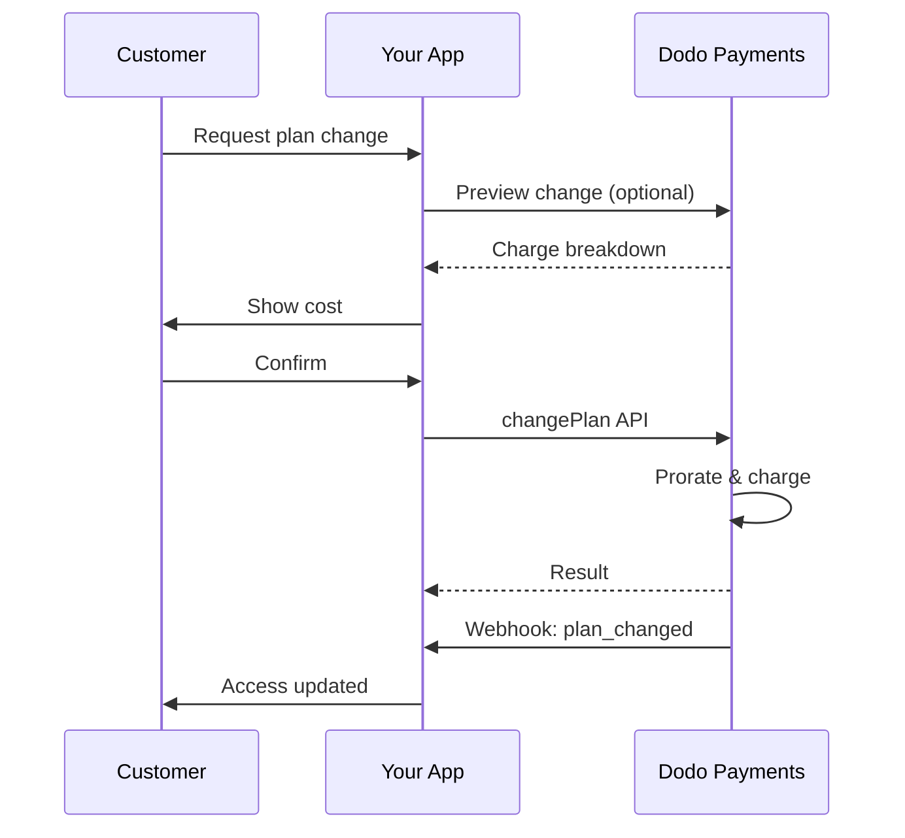
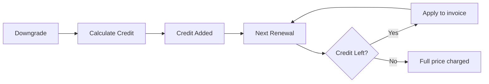
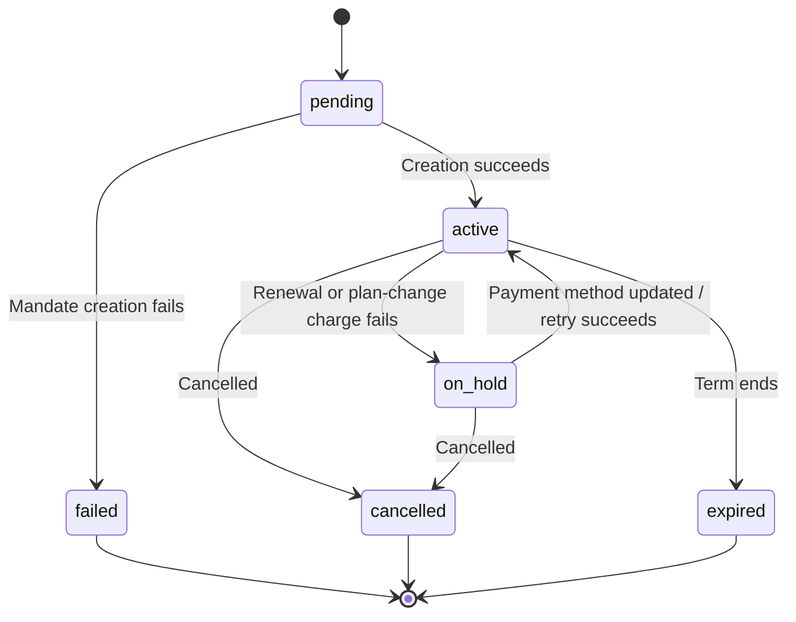

<Info>
Subscriptions let you sell ongoing access with automated renewals. Use flexible billing cycles, free trials, plan changes, and add‑ons to tailor pricing for each customer.
</Info>

<CardGroup cols={2}>
<Card title="Upgrade & Downgrade" icon="repeat" href="/developer-resources/subscription-upgrade-downgrade">
Control plan changes with proration and quantity updates.
</Card>

<Card title="On‑Demand Subscriptions" icon="bolt" href="/developer-resources/ondemand-subscriptions">
Authorize a mandate now and charge later with custom amounts.
</Card>

<Card title="Customer Portal" icon="id-card" href="/features/customer-portal">
Let customers manage plans, billing, and cancellations.
</Card>

<Card title="Subscription Webhooks" icon="code" href="/developer-resources/webhooks/intents/subscription">
React to lifecycle events like created, renewed, and canceled.
</Card>
</CardGroup>

## What Are Subscriptions?

Subscriptions are recurring products customers purchase on a schedule. They’re ideal for:

- **SaaS licenses**: Apps, APIs, or platform access
- **Memberships**: Communities, programs, or clubs
- **Digital content**: Courses, media, or premium content
- **Support plans**: SLAs, success packages, or maintenance

## Key Benefits

- **Predictable revenue**: Recurring billing with automated renewals
- **Flexible cycles**: Monthly, annual, custom intervals, and trials
- **Plan agility**: Proration for upgrades and downgrades
- **Add‑ons and seats**: Attach optional, quantifiable upgrades
- **Seamless checkout**: Hosted checkout and customer portal
- **Developer-first**: Clear APIs for creation, changes, and usage tracking

## Creating Subscriptions

Create subscription products in your Dodo Payments dashboard, then sell them through checkout or your API. Separating products from active subscriptions lets you version pricing, attach add‑ons, and track performance independently.

### Subscription product creation

Configure the fields in the dashboard to define how your subscription sells, renews, and bills. The sections below map directly to what you see in the creation form.

#### Product details

- **Product Name** (required): The display name shown in checkout, customer portal, and invoices.
- **Product Description** (required): A clear value statement that appears in checkout and invoices.
- **Product Image** (required): PNG/JPG/WebP up to 3 MB. Used on checkout and invoices.
- **Brand**: Associate the product with a specific brand for theming and emails.
- **Tax Category** (required): Choose the category (for example, SaaS) to determine tax rules.

<Tip>
Pick the most accurate tax category to ensure correct tax collection per region.
</Tip>

#### Pricing

- **Tipo de preço**: Escolha <b>Subscription</b> (este guia). As alternativas são Pagamento único e Cobrança baseada em uso.
- **Preço** (obrigatório): Preço recorrente base com moeda. O preço deve ser de pelo menos **$1** (ou o equivalente na moeda escolhida). Valores abaixo desse mínimo não são compatíveis e a assinatura não funcionará.
- **Desconto aplicável (%)**: Desconto percentual opcional aplicado ao preço base; refletido no checkout e nas faturas.
- **Repetir pagamento a cada** (obrigatório): Intervalo para renovações, por exemplo, a cada 1 mês. Selecione a periodicidade (meses ou anos) e a quantidade.
- **Período da assinatura** (obrigatório): Prazo total durante o qual a assinatura permanece ativa (por exemplo, 10 anos). Após o término desse período, as renovações param, a menos que sejam estendidas.
- **Dias do período de teste** (obrigatório): Defina a duração do teste em dias. Use 0 para desativar os testes. A primeira cobrança ocorre automaticamente quando o teste termina.
- **Valor do teste**: Cobrança inicial opcional para um teste pago. Deixe sem definir para um teste gratuito. Consulte [Testes pagos](#paid-trials).
- **Selecionar adicional**: Anexe até 10 adicionais que os clientes podem comprar junto com o plano base.

<Warning>
Changing pricing on an active product affects new purchases. Existing subscriptions follow your plan‑change and proration settings.
</Warning>

<Info>
Add‑ons are ideal for quantifiable extras such as seats or storage. You can control allowed quantities and proration behavior when customers change them.
</Info>

#### Advanced settings

- **Tax Inclusive Pricing**: Display prices inclusive of applicable taxes. Final tax calculation still varies by customer location.
- **Generate license keys**: Issue a unique key to each customer after purchase. See the <a href="/features/license-keys">License Keys</a> guide.
- **Digital Product Delivery**: Deliver files or content automatically after purchase. Learn more in <a href="/features/digital-product-delivery">Digital Product Delivery</a>.
- **Metadata**: Attach custom key–value pairs for internal tagging or client integrations. See <a href="/api-reference/metadata">Metadata</a>.

<Tip>
Use metadata to store identifiers from your system (e.g., accountId) so you can reconcile events and invoices later.
</Tip>

## Subscription Trials

Os testes permitem que os clientes avaliem uma assinatura antes de pagar o preço recorrente integral. Um teste pode ser **gratuito**, quando nada é cobrado até o fim do teste, ou **pago**, quando um valor reduzido é cobrado antecipadamente. Em ambos os casos, o preço integral começa na primeira renovação após o término do teste.

### Configuring Trials

Set **Trial Period Days** in the product pricing section (use `0` to disable). You can override this when creating subscriptions:

```typescript
// Via subscription creation
const subscription = await client.subscriptions.create({
  customer: { customer_id: 'cus_123' },
  billing: { country: 'US' },
  product_id: 'pdt_monthly',
  quantity: 1,
  trial_period_days: 14  // Overrides product's trial period
});

// Via checkout session
const session = await client.checkoutSessions.create({
  product_cart: [{ product_id: 'pdt_monthly', quantity: 1 }],
  subscription_data: { trial_period_days: 14 }
});
```

<Warning>
The `trial_period_days` value must be between 0 and 10,000 days.
</Warning>

### Testes pagos

Os testes não precisam ser gratuitos. Defina um **Valor do teste** no preço recorrente de um produto de assinatura para cobrar uma taxa inicial reduzida durante o período de teste. O preço recorrente integral passa a ser cobrado na primeira renovação.

<Frame>

</Frame>

Os testes pagos são configurados no preço do produto, não por assinatura ou sessão de checkout:

| Campo | Tipo | Descrição |
|-------|------|-------------|
| `trial_amount` | inteiro | Valor cobrado hoje pelo teste, nas unidades menores da moeda do preço (por exemplo, `500` para $5,00). Requer `trial_period_days > 0`. Omita ou defina como `null` para um teste gratuito. |
| `trial_apply_discounts` | booleano | Indica se os códigos de desconto do checkout reduzem a cobrança do teste. O padrão é `false`, portanto o valor do teste é cobrado integralmente mesmo quando um desconto se aplica ao preço recorrente. |

```typescript
const product = await client.products.create({
  name: 'Pro Plan',
  tax_category: 'saas',
  price: {
    type: 'recurring_price',
    price: 2900,                      // $29.00 per month after the trial
    currency: 'USD',
    discount: 0,
    purchasing_power_parity: false,
    payment_frequency_count: 1,
    payment_frequency_interval: 'Month',
    subscription_period_count: 1,
    subscription_period_interval: 'Year',
    trial_period_days: 14,            // A paid trial requires a positive trial period
    trial_amount: 500,                // $5.00 charged today
    trial_apply_discounts: false      // Discounts apply to the recurring price only
  }
});
```

Os testes pagos também passam pelo checkout. O valor do teste é tributado, aparece nos cálculos da sessão de checkout e nos preços do link de pagamento, e o markup do Adaptive Currency é aplicado por moeda. O [endpoint de visualização](/developer-resources/checkout-session) retorna `trial_amount` e `trial_period_days` para que você possa mostrar o valor devido hoje antes de a assinatura ser criada.

<Info>
Os testes gratuitos permanecem inalterados. Deixar o **Valor do teste** sem definir mantém o comportamento existente, no qual a primeira cobrança é `0` e o preço integral é cobrado quando o teste termina.
</Info>

### Evitando o uso indevido de testes

**Evitar uso indevido de testes** impede que os clientes reivindiquem repetidamente testes para a mesma empresa. Quando ativado, um cliente que já resgatou um teste é automaticamente convertido em uma **compra paga sem teste**, em vez de receber um novo teste.

<Frame>

</Frame>

Ative essa opção na aba **Subscriptions** em **Settings**. Depois de ativada:

- Os clientes são associados por **e-mail normalizado**, com os aliases contendo sinal de mais removidos, portanto `user+trial@example.com` e `user@example.com` são considerados a mesma pessoa.
- Os resgates são registrados na **ativação do teste**, portanto um cliente que cancela no mesmo dia ainda consumiu o teste.
- Os clientes existentes são preenchidos retroativamente a partir de seus testes históricos por e-mail, portanto usuários de testes anteriores são reconhecidos imediatamente.

<Info>
A configuração fica **desativada por padrão**. Consulte [Configurações de assinatura](/features/product-collections#subscription-settings) para ver a lista completa de controles de assinatura no nível da empresa.
</Info>

### Detectando o status do teste

<Warning>
Atualmente, não há um campo direto para detectar o status do teste. A solução alternativa a seguir exige consultar pagamentos, o que é ineficiente. Estamos trabalhando em uma solução mais eficiente.
</Warning>

Para determinar se uma assinatura de **teste gratuito** está em período de teste, recupere a lista de pagamentos da assinatura. Se houver exatamente um pagamento com valor 0, a assinatura está no período de teste:

```typescript
const subscription = await client.subscriptions.retrieve('sub_123');
const payments = await client.payments.list({
  subscription_id: subscription.subscription_id
});

// Check if subscription is in trial
const isInTrial = payments.items.length === 1 && 
                  payments.items[0].total_amount === 0;
```

<Warning>
Essa verificação de valor zero funciona apenas para testes gratuitos. Em um [teste pago](#paid-trials), o primeiro pagamento é igual ao valor do teste, não a `0`. Compare o primeiro pagamento com `trial_amount` da assinatura ou verifique se `next_billing_date` ainda está dentro do período de teste.
</Warning>

### Atualizando o período de teste

Estenda o teste atualizando `next_billing_date`:

```typescript
await client.subscriptions.update('sub_123', {
  next_billing_date: '2025-02-15T00:00:00Z'  // New trial end date
});
```

<Warning>
Não é possível definir `next_billing_date` para um horário passado. A data deve estar no futuro.
</Warning>

## Alterações no plano de assinatura

As alterações de plano permitem fazer upgrade ou downgrade de assinaturas, ajustar quantidades ou migrar para produtos diferentes. Dependendo do modo de rateio selecionado, uma alteração pode gerar uma cobrança imediata, criar um crédito ou não aplicar nenhum ajuste de cobrança.

<Tip>
Você pode alterar planos de assinatura e atualizar a próxima data de cobrança diretamente no dashboard do Dodo Payments. Isso oferece uma maneira rápida de ajustar assinaturas para solicitações de suporte ao cliente, upgrades promocionais ou migrações de plano sem fazer chamadas de API.
</Tip>

<Tip>
**Ative as alterações de plano self-service:** Quer que os clientes façam upgrade ou downgrade de suas próprias assinaturas pelo Customer Portal? Adicione seus produtos de assinatura a uma coleção de produtos e ative "Allow Subscription Updates" nas configurações de assinatura.
</Tip>



<Card title="Product Collections" icon="layer-group" href="/features/product-collections">
  Agrupe produtos relacionados em coleções para ativar fluxos contínuos de upgrade/downgrade no Customer Portal.
</Card>

### Modos de rateio

Escolha como os clientes serão cobrados ao alterar planos:

<Info>
**Comparação rápida dos quatro modos de rateio:**

| | `prorated_immediately` | `difference_immediately` | `full_immediately` | `do_not_bill` |
|---|---|---|---|---|
| **Upgrade** | Cobrança rateada pelos dias restantes | Diferença total de preço cobrada | Preço total do novo plano cobrado | Sem cobrança — alteração imediata |
| **Downgrade** | Crédito rateado pelos dias restantes | Diferença total de preço como crédito | Sem crédito, cobrança integral | Sem crédito — alteração imediata |
| **Ciclo de cobrança** | Reinicia hoje | Reinicia hoje | Reinicia hoje | Permanece igual |
| **Ideal para** | Cobrança justa baseada no tempo | Alterações simples de nível | Reinicialização do ciclo de cobrança | Migrações gratuitas ou alterações de cortesia |
</Info>

#### `prorated_immediately`
Cobra um valor rateado com base no tempo restante do ciclo de cobrança atual. Ideal para uma cobrança justa que considera o tempo não utilizado.

```typescript
await client.subscriptions.changePlan('sub_123', {
  product_id: 'prod_pro',
  quantity: 1,
  proration_billing_mode: 'prorated_immediately'
});
```

#### `difference_immediately`
Cobra imediatamente a diferença de preço (upgrade) ou adiciona crédito para renovações futuras (downgrade). Ideal para cenários simples de upgrade/downgrade.

```typescript
// Upgrade: charges $50 (difference between $30 and $80)
// Downgrade: credits remaining value, auto-applied to renewals
await client.subscriptions.changePlan('sub_123', {
  product_id: 'prod_pro',
  quantity: 1,
  proration_billing_mode: 'difference_immediately'
});
```

<Info>
Os créditos de downgrades que usam `difference_immediately` são vinculados à assinatura e aplicados automaticamente a renovações futuras. Eles são diferentes dos benefícios do <a href="/features/credit-based-billing">Credit-Based Billing</a>.
</Info>

Quando um cliente faz downgrade usando `difference_immediately`, o valor não utilizado se torna um crédito vinculado à assinatura, que compensa automaticamente renovações futuras:



#### `full_immediately`
Cobra imediatamente o valor total do novo plano, ignorando o tempo restante. Ideal para reiniciar ciclos de cobrança.

```typescript
await client.subscriptions.changePlan('sub_123', {
  product_id: 'prod_monthly',
  quantity: 1,
  proration_billing_mode: 'full_immediately'
});
```

#### `do_not_bill`
Muda para o novo plano sem nenhum ajuste de cobrança. Não há cobranças de rateio nem créditos — o cliente simplesmente passa para o novo plano. Ideal para migrações de cortesia, alterações gratuitas de plano ou situações em que você deseja absorver a diferença de custo.

```typescript
await client.subscriptions.changePlan('sub_123', {
  product_id: 'prod_new_plan',
  quantity: 1,
  proration_billing_mode: 'do_not_bill'
});
```

<AccordionGroup>
<Accordion title="Example: Prorated upgrade calculation">

**Cenário**: O cliente do plano Basic ($30/mês) faz upgrade para Pro ($80/mês) no dia 16 de um ciclo de 30 dias usando `prorated_immediately`.

```
Unused credit from Basic = $30 × (15 remaining / 30 total) = $15.00
Prorated cost of Pro     = $80 × (15 remaining / 30 total) = $40.00
────────────────────────────────────────────────────────────────────
Immediate charge         = $40.00 − $15.00 = $25.00
```

Próxima renovação em **15 de fevereiro** (16 de janeiro + 30 dias): **$80,00/mês**.

<Tip>
Para exemplos de cálculo e casos extremos mais detalhados, consulte nosso [Guia completo de Upgrade e Downgrade](/developer-resources/subscription-upgrade-downgrade).
</Tip>

</Accordion>
<Accordion title="Example: Downgrade credit calculation">

**Cenário**: O cliente do plano Pro ($80/mês) faz downgrade para Starter ($20/mês) usando `difference_immediately`.

```
Credit = Old plan − New plan = $80 − $20 = $60.00
```

O crédito de $60 é aplicado automaticamente a renovações futuras:
- Renovação 1: $20 − $20 (crédito) = **$0,00** (restam $40 de crédito)
- Renovação 2: $20 − $20 (crédito) = **$0,00** (restam $20 de crédito)  
- Renovação 3: $20 − $20 (crédito) = **$0,00** (crédito esgotado)
- Renovação 4: **$20,00** (preço integral)

<Info>
Saiba mais sobre como os créditos são gerenciados no [Guia de Upgrade e Downgrade](/developer-resources/subscription-upgrade-downgrade).
</Info>

</Accordion>
</AccordionGroup>

### Alterando planos com adicionais

Modifique os adicionais ao alterar planos. Os adicionais são incluídos nos cálculos de rateio:

```typescript
await client.subscriptions.changePlan('sub_123', {
  product_id: 'prod_pro',
  quantity: 1,
  proration_billing_mode: 'difference_immediately',
  addons: [{ addon_id: 'addon_extra_seats', quantity: 2 }]  // Add add-ons
  // addons: []  // Empty array removes all existing add-ons
});
```

<Info>
Por padrão (`effective_at: 'immediately'`), as alterações de plano geram cobranças imediatas. Passe `effective_at: 'next_billing_date'` para agendar a alteração para a próxima data de cobrança; a alteração pendente é retornada na assinatura como `scheduled_change`, e você pode cancelá-la com [Cancelar alteração de plano agendada](/api-reference/subscriptions/cancel-change-plan). Cobranças com falha podem mover a assinatura para o status `on_hold`, a menos que você passe `on_payment_failure: 'prevent_change'`, que mantém a assinatura no plano atual até que o pagamento seja bem-sucedido. Acompanhe as alterações por meio de eventos de webhook `subscription.plan_changed`.
</Info>

### Visualizando alterações de plano

Antes de confirmar uma alteração de plano, visualize a cobrança exata e a assinatura resultante:

```typescript
const preview = await client.subscriptions.previewChangePlan('sub_123', {
  product_id: 'prod_pro',
  quantity: 1,
  proration_billing_mode: 'prorated_immediately'
});

// Show customer the charge before confirming
console.log('You will be charged:', preview.immediate_charge.summary);
```

<Card title="Preview Change Plan API" icon="eye" href="/api-reference/subscriptions/preview-change-plan">
  Visualize as alterações de plano antes de confirmá-las.
</Card>

## Estados da assinatura

Uma assinatura passa por um conjunto definido de status durante sua vida útil. Esta tabela é a referência para cada status, o que o causa e como (ou se) é possível recuperá-lo.

| Status | Significado | Recuperável? | Caminho de recuperação / próxima etapa |
|--------|-------------|--------------|----------------------------------------|
| `pending` | A assinatura está sendo criada ou processada | — | Aguarde `subscription.active` (ou `subscription.failed`) |
| `active` | A assinatura está ativa e será renovada automaticamente | — | Nenhuma ação necessária |
| `on_hold` | Um pagamento de renovação (ou cobrança de alteração de plano) falhou; a assinatura está pausada | **Sim** | Atualize o método de pagamento para reativar — automaticamente por meio de [Payment Retries](/features/recovery/payment-retries) e [Dunning](/features/recovery/subscription-dunning), ou manualmente pela [API de atualização do método de pagamento](/api-reference/subscriptions/update-payment-method) |
| `cancelled` | A assinatura foi cancelada e não será renovada | Somente nova compra | O cliente deve iniciar uma nova assinatura; o [Dunning](/features/recovery/subscription-dunning) pode solicitar uma nova compra |
| `failed` | A **criação** da assinatura falhou (o mandato ou pagamento inicial não foi concluído) | **Não — terminal** | O cliente deve criar uma nova assinatura com um método de pagamento válido |
| `expired` | A assinatura chegou ao fim do prazo | — | O cliente deve iniciar uma nova assinatura, se desejar |

<Warning>
`on_hold` e `failed` são frequentemente confundidos. `on_hold` é um estado **recuperável** de uma assinatura já ativa cuja renovação falhou. `failed` é um estado **terminal** que ocorre somente quando a **criação inicial** da assinatura falha — não é possível reativá-lo.
</Warning>

### Máquina de estados



### Estado em espera

Uma assinatura entra no estado `on_hold` quando:

- Um pagamento de renovação falha (fundos insuficientes, cartão expirado etc.)
- Uma cobrança de alteração de plano falha
- A autorização do método de pagamento falha

<Warning>
Quando uma assinatura está no estado `on_hold`, ela não será renovada automaticamente. Você deve atualizar o método de pagamento para reativar a assinatura.
</Warning>

### Reativando a partir do estado em espera

Para reativar uma assinatura no estado `on_hold`, atualize o método de pagamento. Isso automaticamente:

1. Cria uma cobrança pelos valores pendentes
2. Gera uma fatura
3. Processa o pagamento usando o novo método de pagamento
4. Reativa a assinatura para o estado `active` após o pagamento bem-sucedido

```typescript
// Reactivate subscription from on_hold
const response = await client.subscriptions.updatePaymentMethod('sub_123', {
  payment_method: {
    type: 'new',
    return_url: 'https://example.com/return'
  }
});

// For on_hold subscriptions, a charge is automatically created
if (response.payment_id) {
  console.log('Charge created:', response.payment_id);
  // Redirect customer to response.payment_link to complete payment
  // Monitor webhooks for payment.succeeded and subscription.active
}
```

<Info>
Depois de atualizar com sucesso o método de pagamento de uma assinatura `on_hold`, você receberá eventos de webhook `payment.succeeded` seguidos de `subscription.active`.
</Info>

### Eventos de webhook por transição

Cada transição emite um webhook para que você possa controlar a lógica de benefícios sem polling:

| Transição | Evento |
|------------|--------|
| Assinatura ativada | `subscription.active` |
| Renovação bem-sucedida | `subscription.renewed` |
| Renovação falha → pausada | `subscription.on_hold` |
| Criação falha | `subscription.failed` |
| Plano atualizado/rebaixado | `subscription.plan_changed` |
| Cancelada | `subscription.cancelled` |
| Prazo encerrado | `subscription.expired` |
| Qualquer alteração de campo | `subscription.updated` |

<Card title="Subscription Webhook Payloads" icon="webhook" href="/developer-resources/webhooks/intents/subscription">
Veja o esquema completo do payload para eventos do ciclo de vida da assinatura.
</Card>

## Gerenciamento de API

<AccordionGroup>
<Accordion title="Create subscriptions">
Use `POST /subscriptions` para criar assinaturas programaticamente a partir de produtos, com testes e adicionais opcionais.

<Card title="API Reference" icon="code" href="/api-reference/subscriptions/post-subscriptions">
Veja a API de criação de assinatura.
</Card>
</Accordion>

<Accordion title="Update subscriptions">
Use `PATCH /subscriptions/{id}` para cancelar na próxima data de cobrança, estender o período da assinatura, atualizar os dados de cobrança ou modificar os metadados. Para alterar a quantidade, use a [API de alteração de plano](/api-reference/subscriptions/change-plan); `PATCH` não aceita `quantity`.

<Card title="API Reference" icon="code" href="/api-reference/subscriptions/patch-subscriptions">
Saiba como atualizar os detalhes da assinatura.
</Card>
</Accordion>

<Accordion title="Change plans (proration)">
Altere o produto ativo e as quantidades com controles de rateio.

<Card title="API Reference" icon="code" href="/api-reference/subscriptions/change-plan">
Revise as opções de alteração de plano.
</Card>
</Accordion>

<Accordion title="On‑demand charges">
Para assinaturas sob demanda, cobre valores específicos conforme necessário.

<Card title="API Reference" icon="code" href="/api-reference/subscriptions/create-charge">
Cobre uma assinatura sob demanda.
</Card>
</Accordion>

<Accordion title="List and retrieve">
Use `GET /subscriptions` para listar todas as assinaturas e `GET /subscriptions/{id}` para recuperar uma delas.

<Card title="API Reference" icon="code" href="/api-reference/subscriptions/get-subscriptions">
Consulte as APIs de listagem e recuperação.
</Card>
</Accordion>

<Accordion title="Usage history">
Recupere o uso registrado para modelos de preços medidos ou híbridos.

<Card title="API Reference" icon="code" href="/api-reference/subscriptions/get-usage-history">
Consulte a API de histórico de uso.
</Card>
</Accordion>

<Accordion title="Update payment method">
Atualize o método de pagamento de uma assinatura. Para assinaturas ativas, isso atualiza o método de pagamento das renovações futuras. Para assinaturas no estado `on_hold`, isso reativa a assinatura criando uma cobrança pelos valores pendentes.

Ao gerar um novo link de método de pagamento (o tipo de solicitação `New`), você pode passar `allowed_payment_method_types` para restringir quais métodos de pagamento o cliente verá nessa página. Os clientes nunca verão um método que não esteja na lista, embora incluir um método não garanta que ele aparecerá (a disponibilidade ainda depende de fatores como a localização do cliente e as configurações da sua empresa).

<Card title="API Reference" icon="code" href="/api-reference/subscriptions/update-payment-method">
Saiba como atualizar métodos de pagamento e reativar assinaturas.
</Card>
</Accordion>
</AccordionGroup>

## Casos de uso comuns

- **SaaS e APIs**: Acesso em níveis com adicionais para assentos ou uso
- **Conteúdo e mídia**: Acesso mensal com testes introdutórios
- **Planos de suporte B2B**: Contratos anuais com adicionais de suporte premium
- **Ferramentas e plugins**: Chaves de licença e lançamentos versionados

## Exemplos de integração

### Sessões de checkout (assinaturas)
Ao criar sessões de checkout, inclua seu produto de assinatura e os adicionais opcionais:

```typescript
const session = await client.checkoutSessions.create({
  product_cart: [
    {
      product_id: 'prod_subscription',
      quantity: 1
    }
  ]
});
```

### Alterações de plano com rateio
Faça upgrade ou downgrade de uma assinatura e controle o comportamento do rateio:

```typescript
await client.subscriptions.changePlan('sub_123', {
  product_id: 'prod_new',
  quantity: 1,
  proration_billing_mode: 'difference_immediately'
});
```

### Cancelar na próxima data de cobrança
Agende um cancelamento que entrará em vigor ao final do período de cobrança atual:

```typescript
await client.subscriptions.update('sub_123', {
  cancel_at_next_billing_date: true
});
```

### Estender o período da assinatura
Estenda a duração de uma assinatura passando um novo `subscription_period_count` e `subscription_period_interval` para `PATCH /subscriptions/{id}`. A data de expiração da assinatura é recalculada com base na nova quantidade e no intervalo — por exemplo, para conceder tempo adicional ao cliente no plano atual:

```typescript
await client.subscriptions.update('sub_123', {
  subscription_period_count: 5,
  subscription_period_interval: 'Month'
});
```

<Note>
O período de uma assinatura só pode ser **aumentado**, nunca reduzido.
</Note>

### Assinaturas sob demanda
Crie uma assinatura sob demanda e cobre posteriormente conforme necessário:

```typescript
const onDemand = await client.subscriptions.create({
  customer: { customer_id: 'cus_123' },
  billing: { country: 'US' },
  product_id: 'pdt_on_demand',
  quantity: 1,
  on_demand: { mandate_only: true }
});

await client.subscriptions.charge(onDemand.subscription_id, {
  product_price: 4900,
  product_currency: 'USD',
  product_description: 'Extra usage for September'
});
```

### Atualizar o método de pagamento de uma assinatura ativa
Atualize o método de pagamento de uma assinatura ativa:

```typescript
// Update with new payment method
const response = await client.subscriptions.updatePaymentMethod('sub_123', {
  payment_method: {
    type: 'new',
    return_url: 'https://example.com/return'
  }
});

// Or use existing payment method
await client.subscriptions.updatePaymentMethod('sub_123', {
  payment_method: {
    type: 'existing',
    payment_method_id: 'pm_abc123'
  }
});
```

### Reativar uma assinatura a partir de on_hold
Reative uma assinatura que ficou em espera devido a um pagamento malsucedido:

```typescript
// Update payment method - automatically creates charge for remaining dues
const response = await client.subscriptions.updatePaymentMethod('sub_123', {
  payment_method: {
    type: 'new',
    return_url: 'https://example.com/return'
  }
});

if (response.payment_id) {
  // Charge created for remaining dues
  // Redirect customer to response.payment_link
  // Monitor webhooks: payment.succeeded → subscription.active
}
```

## Assinaturas com mandatos em conformidade com o RBI

  As assinaturas de UPI e cartões indianos operam sob as regulamentações do RBI (Reserve Bank of India), com requisitos específicos de mandato:

  ### Limites de mandato

  O tipo e o valor do mandato dependem da cobrança recorrente da assinatura:

  - **Cobranças abaixo do limite mínimo do mandato (₹15.000 por padrão):** Criamos um mandato sob demanda para o valor mínimo. O valor da assinatura é cobrado periodicamente de acordo com a frequência da assinatura, até o limite do mandato.
  - **Cobranças iguais ou superiores ao limite mínimo do mandato:** Criamos um mandato de assinatura (ou sob demanda) para o valor exato da assinatura.

  O limite mínimo do mandato pode ser configurado por comerciante ou por solicitação usando `mandate_min_amount_inr_paise` (paise de INR). O valor registrado no banco é `max(mandate_floor, billing_amount)` — portanto, o limite se torna efetivamente o teto de autorização exibido ao cliente sempre que a cobrança for menor.

Para obter informações detalhadas sobre mandatos em conformidade com o RBI e o limite mínimo configurável para métodos de pagamento indianos, consulte a página <a href="/features/payment-methods/india#configurable-mandate-floor">Métodos de pagamento da Índia</a>.

  ### Considerações sobre upgrade e downgrade

  **Importante:** Ao fazer upgrade ou downgrade de assinaturas, considere cuidadosamente os limites do mandato:

  - Se um upgrade/downgrade resultar em uma cobrança superior a Rs 15.000 e ultrapassar o limite de pagamento sob demanda existente, a cobrança da transação poderá falhar.
  - Nesses casos, o cliente poderá precisar atualizar o método de pagamento ou alterar novamente a assinatura para estabelecer um novo mandato com o limite correto.

<Tip>
Monitorar webhooks de assinatura para rastrear alterações de status de pagamento e lidar com casos específicos onde mandatos são cancelados durante a janela de 48 horas.
</Tip>

## Melhores Práticas

- **Comece com níveis claros**: 2–3 planos com diferenças óbvias
- **Comunique os preços**: Mostre totais, rateio e próxima renovação
- **Use testes de forma inteligente**: Converta com integração, não apenas com tempo
- **Aproveite os complementos**: Mantenha os planos base simples e ofereça extras
- **Teste alterações**: Valide mudanças de plano e rateio em modo de teste

<Info>
Assinaturas são uma base flexível para receita recorrente. Comece simples, teste minuciosamente e itere com base em métricas de adoção, cancelamento e expansão.
</Info>

  **Cronograma de processamento:** As cobranças recorrentes em cartões indianos e assinaturas UPI seguem um padrão de processamento específico:

  - As cobranças são **iniciadas** na data programada de acordo com a frequência da assinatura.
  - A **dedução** efetiva da conta do cliente ocorre somente **48 horas** após o início do pagamento.
  - Essa janela de 48 horas pode se estender por mais **2 a 3 horas**, dependendo das respostas da API do banco.

  ### Janela de cancelamento do mandato

  Durante a janela de processamento de 48 horas:

  - Os clientes podem cancelar o mandato pelos aplicativos bancários.
  - Se um cliente cancelar o mandato durante esse período, a assinatura permanecerá **ativa** (este é um caso extremo específico de assinaturas Indian card e UPI AutoPay).
  - No entanto, a dedução efetiva poderá falhar e, nesse caso, colocaremos a assinatura **em espera**.

  **Tratamento de casos extremos:** Se você fornecer benefícios, créditos ou uso da assinatura aos clientes imediatamente após o início da cobrança, deverá tratar essa janela de 48 horas adequadamente na sua aplicação. Considere:

  - Adiar a ativação dos benefícios até a confirmação do pagamento
  - Implementar períodos de carência ou acesso temporário
  - Monitorar o status da assinatura para detectar cancelamentos de mandato
  - Tratar estados de assinatura em espera na lógica da aplicação

  <Tip>
  Monitore os webhooks de assinatura para acompanhar alterações no status do pagamento e tratar casos extremos em que os mandatos são cancelados durante a janela de 48 horas.
  </Tip>

## Práticas recomendadas

- **Comece com níveis claros**: 2–3 planos com diferenças evidentes
- **Comunique os preços**: Mostre totais, rateio e a próxima renovação
- **Use testes de forma estratégica**: Converta com integração inicial, não apenas com tempo
- **Aproveite os adicionais**: Mantenha os planos base simples e faça upsell de extras
- **Teste as alterações**: Valide as alterações de plano e o rateio no modo de teste

<Info>
As assinaturas são uma base flexível para receita recorrente. Comece de forma simples, teste completamente e faça iterações com base nas métricas de adoção, churn e expansão.
</Info>