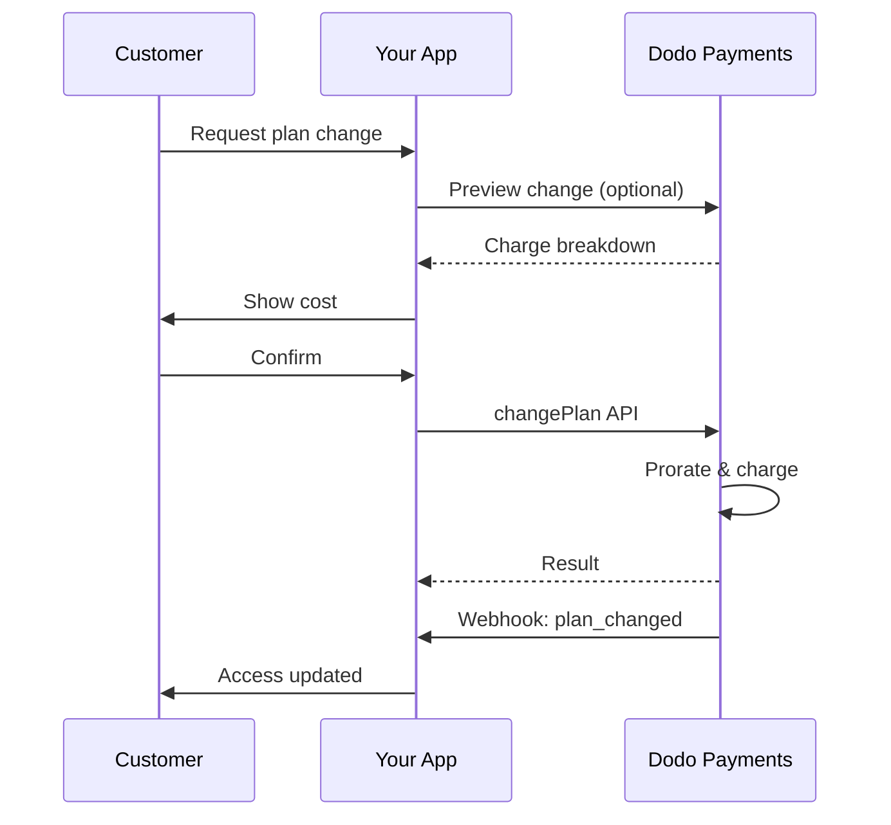
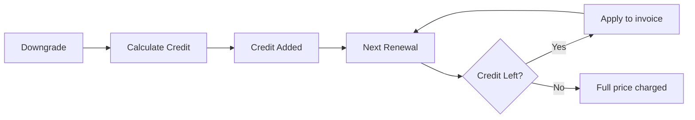
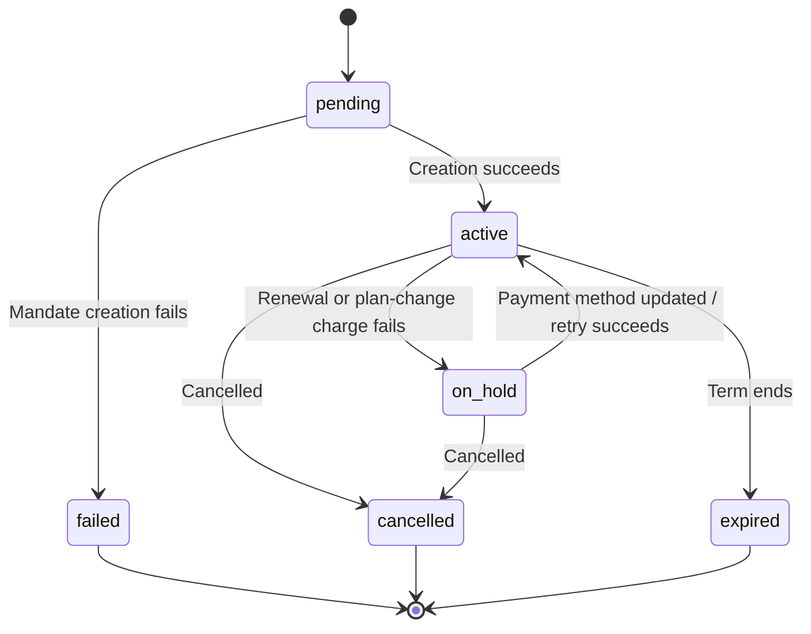

<Info>
Subscriptions let you sell ongoing access with automated renewals. Use flexible billing cycles, free trials, plan changes, and add‑ons to tailor pricing for each customer.
</Info>

<CardGroup cols={2}>
<Card title="Upgrade & Downgrade" icon="repeat" href="/developer-resources/subscription-upgrade-downgrade">
Control plan changes with proration and quantity updates.
</Card>

<Card title="On‑Demand Subscriptions" icon="bolt" href="/developer-resources/ondemand-subscriptions">
Authorize a mandate now and charge later with custom amounts.
</Card>

<Card title="Customer Portal" icon="id-card" href="/features/customer-portal">
Let customers manage plans, billing, and cancellations.
</Card>

<Card title="Subscription Webhooks" icon="code" href="/developer-resources/webhooks/intents/subscription">
React to lifecycle events like created, renewed, and canceled.
</Card>
</CardGroup>

## What Are Subscriptions?

Subscriptions are recurring products customers purchase on a schedule. They’re ideal for:

- **SaaS licenses**: Apps, APIs, or platform access
- **Memberships**: Communities, programs, or clubs
- **Digital content**: Courses, media, or premium content
- **Support plans**: SLAs, success packages, or maintenance

## Key Benefits

- **Predictable revenue**: Recurring billing with automated renewals
- **Flexible cycles**: Monthly, annual, custom intervals, and trials
- **Plan agility**: Proration for upgrades and downgrades
- **Add‑ons and seats**: Attach optional, quantifiable upgrades
- **Seamless checkout**: Hosted checkout and customer portal
- **Developer-first**: Clear APIs for creation, changes, and usage tracking

## Creating Subscriptions

Create subscription products in your Dodo Payments dashboard, then sell them through checkout or your API. Separating products from active subscriptions lets you version pricing, attach add‑ons, and track performance independently.

### Subscription product creation

Configure the fields in the dashboard to define how your subscription sells, renews, and bills. The sections below map directly to what you see in the creation form.

#### Product details

- **Product Name** (required): The display name shown in checkout, customer portal, and invoices.
- **Product Description** (required): A clear value statement that appears in checkout and invoices.
- **Product Image** (required): PNG/JPG/WebP up to 3 MB. Used on checkout and invoices.
- **Brand**: Associate the product with a specific brand for theming and emails.
- **Tax Category** (required): Choose the category (for example, SaaS) to determine tax rules.

<Tip>
Pick the most accurate tax category to ensure correct tax collection per region.
</Tip>

#### Pricing

- **Tipo de Preço**: Escolha <b>Assinatura</b> (este guia). As alternativas são Pagamento Único e Faturamento Baseado em Uso.
- **Preço** (obrigatório): Preço recorrente base com a moeda. O preço deve ser pelo menos **$1** (ou o equivalente na moeda escolhida). Quantias abaixo deste mínimo não são suportadas e a assinatura não funcionará.
- **Desconto Aplicável (%)**: Desconto percentual opcional aplicado ao preço base; refletido no checkout e nas faturas.
- **Repetir pagamento a cada** (obrigatório): Intervalo para renovações, por exemplo, a cada 1 Mês. Selecione a cadência (meses ou anos) e a quantidade.
- **Período de Assinatura** (obrigatório): Prazo total pelo qual a assinatura permanece ativa (por exemplo, 10 Anos). Após este período, as renovações param, a menos que prorrogadas.
- **Dias de Período de Teste** (obrigatório): Defina o comprimento do teste em dias. Use 0 para desativar testes. A primeira cobrança ocorre automaticamente quando o teste termina.
- **Selecionar complemento**: Anexe até 10 complementos que os clientes podem comprar junto com o plano base.

<Warning>
Changing pricing on an active product affects new purchases. Existing subscriptions follow your plan‑change and proration settings.
</Warning>

<Info>
Add‑ons are ideal for quantifiable extras such as seats or storage. You can control allowed quantities and proration behavior when customers change them.
</Info>

#### Advanced settings

- **Tax Inclusive Pricing**: Display prices inclusive of applicable taxes. Final tax calculation still varies by customer location.
- **Generate license keys**: Issue a unique key to each customer after purchase. See the <a href="/features/license-keys">License Keys</a> guide.
- **Digital Product Delivery**: Deliver files or content automatically after purchase. Learn more in <a href="/features/digital-product-delivery">Digital Product Delivery</a>.
- **Metadata**: Attach custom key–value pairs for internal tagging or client integrations. See <a href="/api-reference/metadata">Metadata</a>.

<Tip>
Use metadata to store identifiers from your system (e.g., accountId) so you can reconcile events and invoices later.
</Tip>

## Subscription Trials

Trials let customers access subscriptions without immediate payment. The first charge occurs automatically when the trial ends.

### Configuring Trials

Set **Trial Period Days** in the product pricing section (use `0` to disable). You can override this when creating subscriptions:

```typescript
// Via subscription creation
const subscription = await client.subscriptions.create({
  customer_id: 'cus_123',
  product_id: 'prod_monthly',
  trial_period_days: 14  // Overrides product's trial period
});

// Via checkout session
const session = await client.checkoutSessions.create({
  product_cart: [{ product_id: 'prod_monthly', quantity: 1 }],
  subscription_data: { trial_period_days: 14 }
});
```

<Warning>
The `trial_period_days` value must be between 0 and 10,000 days.
</Warning>

### Detecting Trial Status

<Warning>
Currently, there is no direct field to detect trial status. The following is a workaround that requires querying payments, which is inefficient. We are working on a more efficient solution.
</Warning>

To determine if a subscription is in trial, retrieve the list of payments for the subscription. If there is exactly one payment with amount 0, the subscription is in trial period:

```typescript
const subscription = await client.subscriptions.retrieve('sub_123');
const payments = await client.payments.list({
  subscription_id: subscription.subscription_id
});

// Check if subscription is in trial
const isInTrial = payments.items.length === 1 && 
                  payments.items[0].total_amount === 0;
```

### Updating Trial Period

Extend the trial by updating `next_billing_date`:

```typescript
await client.subscriptions.update('sub_123', {
  next_billing_date: '2025-02-15T00:00:00Z'  // New trial end date
});
```

<Warning>
You cannot set `next_billing_date` to a past time. The date must be in the future.
</Warning>

## Subscription Plan Changes

Plan changes let you upgrade or downgrade subscriptions, adjust quantities, or migrate to different products. Depending on the proration mode you select, a change may trigger an immediate charge, create credit, or apply no billing adjustment.

<Tip>
You can change subscription plans and update the next billing date directly from the Dodo Payments dashboard. This provides a quick way to adjust subscriptions for customer support requests, promotional upgrades, or plan migrations without making API calls.
</Tip>

<Tip>
**Enable self-service plan changes:** Want customers to upgrade or downgrade their own subscriptions via the Customer Portal? Add your subscription products to a Product Collection and enable "Allow Subscription Updates" in your Subscription Settings.
</Tip>



<Card title="Product Collections" icon="layer-group" href="/features/product-collections">
  Group related products into collections to enable seamless upgrade/downgrade paths in the Customer Portal.
</Card>

### Proration Modes

Choose how customers are billed when changing plans:

<Info>
**Quick comparison of the four proration modes:**

| | `prorated_immediately` | `difference_immediately` | `full_immediately` | `do_not_bill` |
|---|---|---|---|---|
| **Upgrade** | Cobrança proporcional pelos dias restantes | Diferença de preço total cobrada | Preço total do novo plano cobrado | Sem cobrança — troca imediata |
| **Downgrade** | Crédito proporcional pelos dias restantes | Diferença de preço total como crédito | Sem crédito, cobrança total | Sem crédito — troca imediata |
| **Ciclo de faturamento** | Reinicia hoje | Reinicia hoje | Reinicia hoje | Permanece o mesmo |
| **Melhor para** | Cobrança justa baseada no tempo | Mudanças simples de nível | Reinicialização do ciclo de faturamento | Migrações gratuitas ou trocas de cortesia |
</Info>

#### `prorated_immediately`
Charges prorated amount based on remaining time in the current billing cycle. Best for fair billing that accounts for unused time.

```typescript
await client.subscriptions.changePlan('sub_123', {
  product_id: 'prod_pro',
  quantity: 1,
  proration_billing_mode: 'prorated_immediately'
});
```

#### `difference_immediately`
Charges the price difference immediately (upgrade) or adds credit for future renewals (downgrade). Best for simple upgrade/downgrade scenarios.

```typescript
// Upgrade: charges $50 (difference between $30 and $80)
// Downgrade: credits remaining value, auto-applied to renewals
await client.subscriptions.changePlan('sub_123', {
  product_id: 'prod_pro',
  quantity: 1,
  proration_billing_mode: 'difference_immediately'
});
```

<Info>
Credits from downgrades using `difference_immediately` are subscription-scoped and auto-applied to future renewals. They're distinct from <a href="/features/credit-based-billing">Credit-Based Billing</a> entitlements.
</Info>

When a customer downgrades with `difference_immediately`, the unused value becomes a subscription-scoped credit that automatically offsets future renewals:



#### `full_immediately`
Charges full new plan amount immediately, ignoring remaining time. Best for resetting billing cycles.

```typescript
await client.subscriptions.changePlan('sub_123', {
  product_id: 'prod_monthly',
  quantity: 1,
  proration_billing_mode: 'full_immediately'
});
```

#### `do_not_bill`
Switches to the new plan without any billing adjustment. No proration charges, no credits — the customer simply moves to the new plan. Best for courtesy migrations, free plan switches, or scenarios where you want to absorb the cost difference.

```typescript
await client.subscriptions.changePlan('sub_123', {
  product_id: 'prod_new_plan',
  quantity: 1,
  proration_billing_mode: 'do_not_bill'
});
```

<AccordionGroup>
<Accordion title="Example: Prorated upgrade calculation">

**Scenario**: Customer on Basic ($30/month) upgrades to Pro ($80/month) on day 16 of a 30-day cycle using `prorated_immediately`.

```
Unused credit from Basic = $30 × (15 remaining / 30 total) = $15.00
Prorated cost of Pro     = $80 × (15 remaining / 30 total) = $40.00
────────────────────────────────────────────────────────────────────
Immediate charge         = $40.00 − $15.00 = $25.00
```

Próxima renovação em **15 de fevereiro** (16 de janeiro + 30 dias): **$80.00/mês**.

<Tip>
For more detailed calculation examples and edge cases, see our full [Upgrade & Downgrade Guide](/developer-resources/subscription-upgrade-downgrade).
</Tip>

</Accordion>
<Accordion title="Example: Downgrade credit calculation">

**Scenario**: Customer on Pro ($80/month) downgrades to Starter ($20/month) using `difference_immediately`.

```
Credit = Old plan − New plan = $80 − $20 = $60.00
```

The $60 credit auto-applies to future renewals:
- Renewal 1: $20 − $20 (credit) = **$0.00** ($40 credit remaining)
- Renewal 2: $20 − $20 (credit) = **$0.00** ($20 credit remaining)  
- Renewal 3: $20 − $20 (credit) = **$0.00** (credit exhausted)
- Renewal 4: **$20.00** (full price)

<Info>
Learn more about how credits are managed in the [Upgrade & Downgrade Guide](/developer-resources/subscription-upgrade-downgrade).
</Info>

</Accordion>
</AccordionGroup>

### Changing Plans with Add-ons

Modify add-ons when changing plans. Add-ons are included in proration calculations:

```typescript
await client.subscriptions.changePlan('sub_123', {
  product_id: 'prod_pro',
  quantity: 1,
  proration_billing_mode: 'difference_immediately',
  addons: [{ addon_id: 'addon_extra_seats', quantity: 2 }]  // Add add-ons
  // addons: []  // Empty array removes all existing add-ons
});
```

<Info>
Plan changes trigger immediate charges. Failed charges may move the subscription to `on_hold` status. Track changes via `subscription.plan_changed` webhook events.
</Info>

### Previewing Plan Changes

Before committing to a plan change, preview the exact charge and resulting subscription:

```typescript
const preview = await client.subscriptions.previewChangePlan('sub_123', {
  product_id: 'prod_pro',
  quantity: 1,
  proration_billing_mode: 'prorated_immediately'
});

// Show customer the charge before confirming
console.log('You will be charged:', preview.immediate_charge.summary);
```

<Card title="Preview Change Plan API" icon="eye" href="/api-reference/subscriptions/preview-change-plan">
  Preview plan changes before committing to them.
</Card>

## Subscription States

Uma assinatura passa por um conjunto definido de status ao longo de seu ciclo de vida. Esta tabela é a referência para cada status, o que o causa e como (ou se) você pode recuperá-lo.

| Status | O que significa | Recuperável? | Caminho de recuperação / próximo passo |
|--------|----------------|--------------|------------------------------------|
| `pending` | A assinatura está sendo criada ou processada | — | Aguardar `subscription.active` (ou `subscription.failed`) |
| `active` | A assinatura está ativa e será renovada automaticamente | — | Nenhuma ação necessária |
| `on_hold` | Um pagamento de renovação (ou cobrança por alteração de plano) falhou; a assinatura está em pausa | **Sim** | Atualizar o método de pagamento para reativar — automaticamente via [Repetições de Pagamento](/features/recovery/payment-retries) e [Cobrança](/features/recovery/subscription-dunning), ou manualmente via a [API de Atualização de Método de Pagamento](/api-reference/subscriptions/update-payment-method) |
| `cancelled` | A assinatura foi cancelada e não será renovada | Somente nova compra | O cliente deve iniciar uma nova assinatura; [Cobrança](/features/recovery/subscription-dunning) pode solicitar uma nova compra |
| `failed` | A **criação** da assinatura falhou (o mandato inicial ou pagamento não obteve sucesso) | **Não — terminal** | O cliente deve criar uma nova assinatura com um método de pagamento funcional |
| `expired` | A assinatura atingiu o fim do seu termo | — | O cliente deve começar uma nova assinatura, se desejar |

<Warning>
`on_hold` e `failed` são frequentemente confundidos. `on_hold` é um estado **recuperável** para uma assinatura já ativa cuja renovação falhou. `failed` é um estado **terminal** que ocorre apenas quando a **criação inicial** da assinatura falha — não pode ser reativado.
</Warning>

### Máquina de Estados



### Estado Em Espera

Uma assinatura entra no estado `on_hold` quando:

- Um pagamento de renovação falha (fundos insuficientes, cartão expirado, etc.)
- Uma cobrança para alteração de plano falha
- A autorização do método de pagamento falha

<Warning>
Quando uma assinatura está no estado `on_hold`, ela não se renovará automaticamente. Você deve atualizar o método de pagamento para reativar a assinatura.
</Warning>

### Reativando do Estado Em Espera

Para reativar uma assinatura do estado `on_hold`, atualize o método de pagamento. Isso automaticamente:

1. Cria uma cobrança para as dívidas restantes
2. Gera uma fatura
3. Processa o pagamento usando o novo método de pagamento
4. Reativa a assinatura para o estado `active` após o pagamento bem-sucedido

```typescript
// Reactivate subscription from on_hold
const response = await client.subscriptions.updatePaymentMethod('sub_123', {
  payment_method: {
    type: 'new',
    return_url: 'https://example.com/return'
  }
});

// For on_hold subscriptions, a charge is automatically created
if (response.payment_id) {
  console.log('Charge created:', response.payment_id);
  // Redirect customer to response.payment_link to complete payment
  // Monitor webhooks for payment.succeeded and subscription.active
}
```

<Info>
Após atualizar com sucesso o método de pagamento para uma assinatura `on_hold`, você receberá eventos de webhook `payment.succeeded` seguidos por `subscription.active`.
</Info>

### Eventos Webhook por Transição

Cada transição emite um webhook para que você possa gerenciar a lógica de direito sem polling:

| Transição | Evento |
|-----------|--------|
| Assinatura ativada | `subscription.active` |
| Renovação bem-sucedida | `subscription.renewed` |
| Renovação falha → pausado | `subscription.on_hold` |
| Criação falha | `subscription.failed` |
| Plano atualizado/degradado | `subscription.plan_changed` |
| Cancelado | `subscription.cancelled` |
| Termo encerrado | `subscription.expired` |
| Quaisquer alterações de campo | `subscription.updated` |

<Card title="Subscription Webhook Payloads" icon="webhook" href="/developer-resources/webhooks/intents/subscription">
Veja o esquema completo de payload para eventos do ciclo de vida de assinaturas.
</Card>

## Gerenciamento de API

<AccordionGroup>
<Accordion title="Create subscriptions">
Use `POST /subscriptions` para criar assinaturas programaticamente a partir de produtos, com testes opcionais e complementos.

<Card title="API Reference" icon="code" href="/api-reference/subscriptions/post-subscriptions">
Veja a API de criação de assinatura.
</Card>
</Accordion>

<Accordion title="Update subscriptions">
Use `PATCH /subscriptions/{id}` para atualizar quantidades, cancelar na próxima data de cobrança ou modificar metadados.

<Card title="API Reference" icon="code" href="/api-reference/subscriptions/patch-subscriptions">
Saiba como atualizar os detalhes da assinatura.
</Card>
</Accordion>

<Accordion title="Change plans (proration)">
Altere o produto ativo e as quantidades com controles de rateio.

<Card title="API Reference" icon="code" href="/api-reference/subscriptions/change-plan">
Revise as opções de alteração de plano.
</Card>
</Accordion>

<Accordion title="On‑demand charges">
Para assinaturas sob demanda, cobre valores específicos sob demanda.

<Card title="API Reference" icon="code" href="/api-reference/subscriptions/create-charge">
Cobre uma assinatura sob demanda.
</Card>
</Accordion>

<Accordion title="List and retrieve">
Use `GET /subscriptions` para listar todas as assinaturas e `GET /subscriptions/{id}` para recuperar uma.

<Card title="API Reference" icon="code" href="/api-reference/subscriptions/get-subscriptions">
Veja as APIs de listagem e recuperação.
</Card>
</Accordion>

<Accordion title="Usage history">
Busque o uso registrado para modelos de preços medidos ou híbridos.

<Card title="API Reference" icon="code" href="/api-reference/subscriptions/get-usage-history">
Veja a API de histórico de uso.
</Card>
</Accordion>

<Accordion title="Update payment method">
Atualize o método de pagamento para uma assinatura. Para assinaturas ativas, isso atualiza o método de pagamento para renovações futuras. Para assinaturas no estado `on_hold`, isso reativa a assinatura ao criar uma cobrança para as dívidas restantes.

Ao gerar um novo link de método de pagamento (o tipo de solicitação `New`), você pode passar `allowed_payment_method_types` para restringir quais métodos de pagamento o cliente vê nessa página. Os clientes nunca verão um método que não esteja na lista, embora incluir um método não garanta que ele apareça (a disponibilidade ainda depende de fatores como localização do cliente e configurações da sua empresa).

<Card title="API Reference" icon="code" href="/api-reference/subscriptions/update-payment-method">
Saiba como atualizar os métodos de pagamento e reativar assinaturas.
</Card>
</Accordion>
</AccordionGroup>

## Casos de Uso Comuns

- **SaaS e APIs**: Acesso em níveis com complementos para assentos ou uso
- **Conteúdo e mídia**: Acesso mensal com testes introdutórios
- **Planos de suporte B2B**: Contratos anuais com complementos de suporte premium
- **Ferramentas e plugins**: Chaves de licença e lançamentos versionados

## Exemplos de Integração

### Sessões de Checkout (assinaturas)
Ao criar sessões de checkout, inclua seu produto de assinatura e complementos opcionais:

```typescript
const session = await client.checkoutSessions.create({
  product_cart: [
    {
      product_id: 'prod_subscription',
      quantity: 1
    }
  ]
});
```

### Alterações de plano com prorrateio
Faça upgrade ou downgrade de uma assinatura e controle o comportamento de prorrateio:

```typescript
await client.subscriptions.changePlan('sub_123', {
  product_id: 'prod_new',
  quantity: 1,
  proration_billing_mode: 'difference_immediately'
});
```

### Cancelar na próxima data de cobrança
Agende um cancelamento que entre em vigor no final do período de cobrança atual:

```typescript
await client.subscriptions.update('sub_123', {
  cancel_at_next_billing_date: true
});
```

### Estender o período de assinatura

Estenda a duração de uma assinatura passando um novo `subscription_period_count` e `subscription_period_interval` para `PATCH /subscriptions/{id}`. O vencimento da assinatura é recalculado a partir da nova contagem e intervalo — por exemplo, para conceder ao cliente tempo extra em seu plano atual:

```typescript
await client.subscriptions.update('sub_123', {
  subscription_period_count: 5,
  subscription_period_interval: 'Month'
});
```

<Note>
O período de uma assinatura pode apenas ser **aumentado**, nunca reduzido.
</Note>

### Assinaturas sob demanda

Crie uma assinatura sob demanda e cobre posteriormente conforme necessário:

```typescript
const onDemand = await client.subscriptions.create({
  customer_id: 'cus_123',
  product_id: 'prod_on_demand',
  on_demand: { mandate_only: true }
});

await client.subscriptions.charge(onDemand.id, {
  product_price: 4900,
  product_currency: 'USD',
  product_description: 'Extra usage for September'
});
```

### Atualizar método de pagamento para assinatura ativa

Atualize o método de pagamento para uma assinatura ativa:

```typescript
// Update with new payment method
const response = await client.subscriptions.updatePaymentMethod('sub_123', {
  payment_method: {
    type: 'new',
    return_url: 'https://example.com/return'
  }
});

// Or use existing payment method
await client.subscriptions.updatePaymentMethod('sub_123', {
  payment_method: {
    type: 'existing',
    payment_method_id: 'pm_abc123'
  }
});
```

### Reativar assinatura suspensa

Reative uma assinatura que foi suspensa devido a falha de pagamento:

```typescript
// Update payment method - automatically creates charge for remaining dues
const response = await client.subscriptions.updatePaymentMethod('sub_123', {
  payment_method: {
    type: 'new',
    return_url: 'https://example.com/return'
  }
});

if (response.payment_id) {
  // Charge created for remaining dues
  // Redirect customer to response.payment_link
  // Monitor webhooks: payment.succeeded → subscription.active
}
```

## Assinaturas com Mandatos em Conformidade com o RBI

UPI e assinaturas de cartões indianos operam sob as regulamentações do RBI (Reserve Bank of India) com requisitos específicos de mandato:

### Limites de Mandato

O tipo e a quantia do mandato dependem da sua cobrança recorrente de assinatura:

- **Cobranças abaixo do piso de mandato (padrão ₹15.000):** Criamos um mandato sob demanda para o valor do piso. O valor da assinatura é cobrado periodicamente de acordo com a frequência da assinatura, até o limite do mandato.
- **Cobranças no piso do mandato ou acima:** Criamos um mandato de assinatura (ou mandato sob demanda) para o valor exato da assinatura.

O piso de mandato é configurável por comerciante ou por solicitação via `mandate_min_amount_inr_paise` (INR paise). O valor registrado no banco é `max(mandate_floor, billing_amount)` — portanto, o piso efetivamente se torna o teto de autorização para o cliente sempre que a cobrança for menor.

Para informações detalhadas sobre mandatos em conformidade com o RBI e o piso de mandato configurável para métodos de pagamento indianos, veja a página <a href="/features/payment-methods/india#configurable-mandate-floor">Métodos de Pagamento na Índia</a>.

### Considerações de Upgrade e Downgrade

**Importante:** Ao fazer upgrade ou downgrade de assinaturas, considere cuidadosamente os limites de mandato:

- Se um upgrade/downgrade resultar em um valor de cobrança que exceda Rs 15.000 e ultrapasse o limite de pagamento sob demanda existente, a cobrança pode falhar.
- Nesses casos, o cliente pode precisar atualizar seu método de pagamento ou alterar a assinatura novamente para estabelecer um novo mandato com o limite correto.

### Autorização para Cobranças de Alto Valor

Para cobranças de assinatura de Rs 15.000 ou mais:

- O banco do cliente solicitará a autorização da transação.
- Se o cliente não autorizar a transação, a mesma falhará e a assinatura será suspensa.

### Atraso de Processamento de 48 Horas

**Linha do Tempo de Processamento:** Cobranças recorrentes em cartões indianos e assinaturas UPI seguem um padrão de processamento único:

- As cobranças são **iniciadas** na data agendada de acordo com a frequência da assinatura.
- A **dedução** real da conta do cliente ocorre apenas após **48 horas** da iniciação do pagamento.
- Esta janela de 48 horas pode se estender até **2-3 horas adicionais** dependendo das respostas da API do banco.

### Janela de Cancelamento de Mandato

Durante a janela de processamento de 48 horas:

- Os clientes podem cancelar o mandato via seus apps bancários.
- Se um cliente cancelar o mandato durante este período, a assinatura permanecerá **ativa** (este é um caso específico para assinaturas de cartão indiano e UPI AutoPay).
- No entanto, a dedução real pode falhar, e, nesse caso, colocaremos a assinatura **em espera**.

**Tratamento de Casos Especiais:** Se você fornecer benefícios, créditos ou uso de assinatura aos clientes imediatamente após a iniciação da cobrança, você precisará gerenciar esta janela de 48 horas adequadamente em sua aplicação. Considere:

- Atrasar a ativação de benefícios até a confirmação do pagamento
- Implementar períodos de carência ou acesso temporário
- Monitorar o status da assinatura para cancelamentos de mandatos
- Gerenciar estados de suspensão de assinatura na lógica da sua aplicação

<Tip>
Monitorar webhooks de assinatura para rastrear alterações de status de pagamento e lidar com casos específicos onde mandatos são cancelados durante a janela de 48 horas.
</Tip>

## Melhores Práticas

- **Comece com níveis claros**: 2–3 planos com diferenças óbvias
- **Comunique os preços**: Mostre totais, rateio e próxima renovação
- **Use testes de forma inteligente**: Converta com integração, não apenas com tempo
- **Aproveite os complementos**: Mantenha os planos base simples e ofereça extras
- **Teste alterações**: Valide mudanças de plano e rateio em modo de teste

<Info>
Assinaturas são uma base flexível para receita recorrente. Comece simples, teste minuciosamente e itere com base em métricas de adoção, cancelamento e expansão.
</Info>