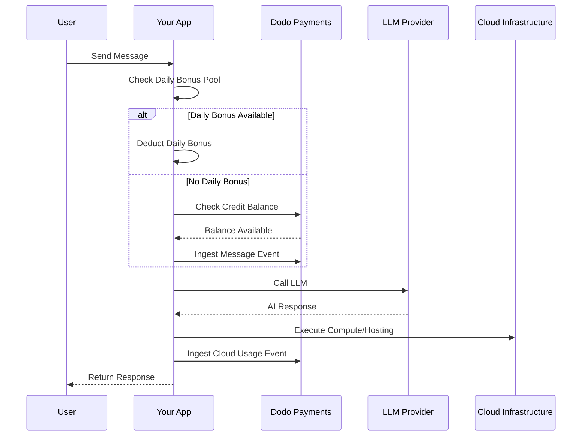

Lovable (lovable.dev) är en AI-webbappbyggare som använder en kreditbaserad abonnemangsmodell. Till skillnad från tokenbaserade system förenklar Lovable användarupplevelsen genom att ta ut en kredit per meddelande. Denna modell kombinerar en månatlig kreditpool med ett dagligt bonusflöde för att uppmuntra konsekvent engagemang medan den tillåter större användningstoppar.

## Lovables faktureringsmodell

Lovables prissättning bygger på meddelandekrediter och separat mätad fakturering för molninfrastruktur.

| Plan | Pris | Månatliga Krediter | Daglig Bonus | Nyckelfunktioner |
| :--- | :--- | :--- | :--- | :--- |
| Gratis | \$0/månad | 0 | 5/dag (upp till 30/månad) | Endast offentliga projekt |
| Pro | \$25/månad | 100 | 5/dag (upp till 150/månad totalt) | On-demand topp-ups, användningsbaserad Cloud + AI, anpassade domäner |
| Business | \$50/månad | 100 | 5/dag | SSO, teamarbetsyta, designtemplates, säkerhetscenter |
| Enterprise | Anpassad | Anpassad | Anpassad | SCIM, dedikerat stöd, revisionsloggar |

- **Kreditbaserat abonnemang**: 1 kredit = 1 meddelande/fråga till AI.
- **Krediter delas över obegränsade användare**: Team-gemensam pool, inte per-säte.
- **Krediter återställs varje faktureringscykel**: Månatliga krediter förnyas vid ny period.
- **On-demand kreditpåfyllningar**: Användare kan köpa fler krediter om de tar slut.
- **Separat användningsbaserad Cloud + AI-fakturering**: Mätt fakturering för hosting och beräkning.
- **Dagliga bonuskrediter återställs varje dag**: En daglig använd-det-eller-förlora-det flöde av 5 krediter.

## Vad gör det unikt

- **Meddelandebaserad enkelhet**: 1 kredit = 1 meddelande oavsett komplexitet. Ingen tokenräkning eller modellviktning.
- **Dagligt flöde + månatlig pool hybrid**: De 5 dagliga bonuskrediterna skapar ett dagligt engagemangsincentive, medan de 100 månatliga krediterna tillåter större användningstoppar.
- **Team-gemensam pool**: Krediter delas över obegränsade användare för ett fast teampris, inte per-säte.
- **Tvålagers fakturering**: Krediter för AI-interaktioner + separat mätt fakturering för molninfrastruktur.

## Bygg detta med Dodo Payments

Du kan återskapa Lovables hybridmodell med Dodo Payments kreditberättiganden och användningsbaserade mätare.

<Steps>
  <Step title="Create a Custom Unit Credit Entitlement">
    Definiera meddelandekreditsystemet i ditt Dodo Payments-instrumentpanel. Detta berättigande hanterar den månatliga kreditpoolen.

    - **Kredittype**: Anpassad enhet
    - **Enhetsnamn**: "Meddelanden"
    - **Precision**: 0
    - **Kreditutgång**: 30 dagar
    - **Överskott**: Inaktiverat (hård gräns när krediter når 0)
  </Step>

  <Step title="Create Subscription Products">
    Skapa dina planer och bifoga kreditberättigandet. För Gratis-planen hanterar du den dagliga bonusen via applikationslogik.

    - **Gratis**: \$0/månad, 0 krediter (daglig bonus hanteras av app-logik)
    - **Pro**: \$25/månad, 100 krediter/cykel, bifoga kreditberättigande
    - **Business**: \$50/månad, 100 krediter/cykel, bifoga kreditberättigande

    ```typescript
    import DodoPayments from 'dodopayments';

    const client = new DodoPayments({
      bearerToken: process.env.DODO_PAYMENTS_API_KEY,
    });

    const session = await client.checkoutSessions.create({
      product_cart: [
        { product_id: 'pdt_lovable_pro', quantity: 1 }
      ],
      customer: { email: 'user@example.com' },
      return_url: 'https://lovable.dev/dashboard'
    });
    ```

  </Step>

  <Step title="Create a Usage Meter for Cloud + AI">
    Lovable fakturerar separat för molninfrastruktur. Skapa en mätare för att spåra dessa kostnader.

    - **Mätarens namn**: `cloud.compute_seconds`
    - **Aggregation**: Summa på `compute_seconds` egenskap

    Bifoga denna mätare till dina prenumerationsprodukter med prissättning per enhet. När du matar in användning beräknar Dodo kostnaden baserat på dina priser.

    ```typescript
    await client.usageEvents.ingest({
      events: [{
        event_id: `compute_${Date.now()}`,
        customer_id: 'cust_123',
        event_name: 'cloud.compute_seconds',
        timestamp: new Date().toISOString(),
        metadata: {
          compute_seconds: 3600,
          project_id: 'proj_abc'
        }
      }]
    });
    ```

  </Step>

  <Step title="Implement Daily Bonus Credits (Application Logic)">
    Det dagliga bonusflödet hanteras på applikationsnivån. Du kan använda ett cron-jobb för att ge dessa krediter eller spåra dem separat i din databas.

    För att spåra användningen av dessa bonuskrediter i Dodo utan att omedelbart tömma huvudberättigandebalansen kan du använda ett separat händelsenamn eller hantera logiken i din app för att först kontrollera bonuspoolen.

    ```typescript
    // Example cron job logic (pseudo-code)
    // Every day at midnight UTC:
    // 1. Reset 'daily_bonus_used' to 0 for all users in your DB
    
    // When a user sends a message:
    async function handleMessage(userId: string) {
      const user = await db.users.findUnique({ where: { id: userId } });
      
      if (user.daily_bonus_used < 5) {
        // Use daily bonus
        await db.users.update({
          where: { id: userId },
          data: { daily_bonus_used: { increment: 1 } }
        });
        // Track for analytics but don't deduct from Dodo credits yet
        await client.usageEvents.ingest({
          events: [{
            event_id: `msg_bonus_${Date.now()}`,
            customer_id: userId,
            event_name: 'ai.message.bonus',
            timestamp: new Date().toISOString(),
            metadata: { type: 'daily_bonus' }
          }]
        });
      } else {
        // Deduct from Dodo credit entitlement
        await client.usageEvents.ingest({
          events: [{
            event_id: `msg_${Date.now()}`,
            customer_id: userId,
            event_name: 'ai.message',
            timestamp: new Date().toISOString(),
            metadata: { type: 'subscription_credit' }
          }]
        });
      }
    }
    ```

  </Step>

  <Step title="Send Usage Events for Messages">
    Spåra varje AI-meddelande som en användningshändelse. Länka till `ai.message` händelse till ditt "Meddelanden" kreditberättigande i Dodo-instrumentpanelen.

    ```typescript
    await client.usageEvents.ingest({
      events: [{
        event_id: `msg_${Date.now()}`,
        customer_id: 'cust_123',
        event_name: 'ai.message',
        timestamp: new Date().toISOString(),
        metadata: {
          content_length: 450,
          project_id: 'proj_abc',
          feature_type: 'editor'
        }
      }]
    });
    ```

  </Step>

  <Step title="Handle Webhooks for Low Balance">
    Meddela användare när de har låga krediter så att de kan fylla på eller uppgradera.

    ```typescript
    import DodoPayments from 'dodopayments';
    import express from 'express';

    const app = express();
    app.use(express.raw({ type: 'application/json' }));

    const client = new DodoPayments({
      bearerToken: process.env.DODO_PAYMENTS_API_KEY,
      webhookKey: process.env.DODO_PAYMENTS_WEBHOOK_KEY,
    });

    app.post('/webhooks/dodo', async (req, res) => {
      try {
        const event = client.webhooks.unwrap(req.body.toString(), {
          headers: {
            'webhook-id': req.headers['webhook-id'] as string,
            'webhook-signature': req.headers['webhook-signature'] as string,
            'webhook-timestamp': req.headers['webhook-timestamp'] as string,
          },
        });

        if (event.type === 'credit.balance_low') {
          const { customer_id, available_balance } = event.data;
          await notifyUser(customer_id, `Your balance is low: ${available_balance} messages left.`);
        }

        res.json({ received: true });
      } catch (error) {
        res.status(401).json({ error: 'Invalid signature' });
      }
    });
    ```

  </Step>
</Steps>

## Accelerera med LLM Ingestion Blueprint

[LLM Ingestion Blueprint](/developer-resources/ingestion-blueprints/llm) förenklar spårning genom att integrera din AI-klient.

```typescript
import { createLLMTracker } from '@dodopayments/ingestion-blueprints';
import OpenAI from 'openai';

const tracker = createLLMTracker({
  apiKey: process.env.DODO_PAYMENTS_API_KEY,
  environment: 'live_mode',
  eventName: 'ai.message',
});

const trackedClient = tracker.wrap({
  client: new OpenAI(),
  customerId: 'cust_123',
});

// Automatically tracks the message and deducts 1 credit (if configured)
await trackedClient.chat.completions.create({
  model: 'gpt-4o',
  messages: [{ role: 'user', content: 'Build a landing page' }],
});
```

<Tip>
  Kolla in den [fullständiga dokumentationen för ritning](/developer-resources/ingestion-blueprints/llm) för mer information om automatisk spårning.
</Tip>

## Arkitekturoversikt



## Nyckelfunktioner från Dodo som används

Utforska de funktioner som gör denna implementation möjlig.

<CardGroup cols={2}>
  <Card title="Credit-Based Billing" icon="coins" href="/features/credit-based-billing">
    Hantera meddelandekrediter och delade teampools.
  </Card>
  <Card title="Subscriptions" icon="calendar" href="/features/subscription">
    Ställ in återkommande planer för Pro- och Business-nivåer.
  </Card>
  <Card title="Usage-Based Billing" icon="chart-line" href="/features/usage-based-billing/introduction">
    Mät molninfrastrukturens användning separat från AI-krediter.
  </Card>
  <Card title="Event Ingestion" icon="bolt" href="/features/usage-based-billing/event-ingestion">
    Skicka högvolymmeddelande- och beräkningshändelser till Dodo.
  </Card>
  <Card title="Webhooks" icon="webhook" href="/developer-resources/webhooks/intents/credit">
    Automatisera notifikationer för låga kreditbalanser.
  </Card>
  <Card title="LLM Ingestion Blueprint" icon="brain-circuit" href="/developer-resources/ingestion-blueprints/llm">
    Förenkla AI-användningsspårningen med färdigbyggda integrationer.
  </Card>
</CardGroup>
