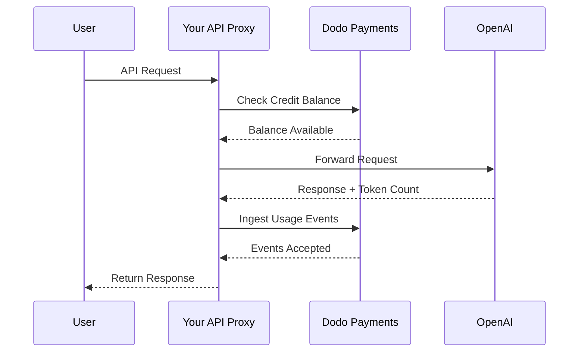
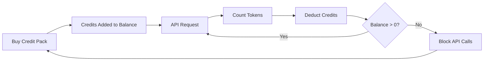

OpenAI:s faktureringsmodell är branschens riktmärke för AI-företag. Den kombinerar förbetalda fiatkrediter för API-användning med abonnemang till fast pris för konsumentprodukter. Det här hybridupplägget säkerställer förutsägbara intäkter och låter samtidigt utvecklare skala sin användning utan friktion.

## Varför OpenAI:s modell är standarden

AI-branschen står inför unika utmaningar som traditionell SaaS-fakturering inte alltid hanterar. OpenAI:s modell löser flera av dessa problem samtidigt.

1. **Förutsägbara intäkter och låg risk**: Genom att kräva förbetalda krediter för API-användning eliminerar OpenAI risken att användare bygger upp enorma räkningar som de inte kan betala. Du får pengarna i förväg och användaren får tillgång till tjänsten efter hand.
2. **Skalbarhet för utvecklare**: En påfyllning på \$5 är en låg tröskel för att komma igång. När applikationen växer kan utvecklare automatisera påfyllningar eller köpa större paket. Friktionen för att börja är nästan obefintlig, medan tillväxtpotentialen är obegränsad.
3. **Användarpsykologi**: Att ange krediter i fiatvaluta (USD) i stället för abstrakta "tokens" eller "poäng" gör värdet tydligt. Det känns som ett bankkonto för AI-tjänster, vilket bygger förtroende och gör det enklare för företag att planera sin budget.

## Så fakturerar OpenAI

OpenAI använder två separata faktureringsmodeller som tillgodoser olika användarbehov.

1. **API (betala efter användning)**: API:et använder förbetalda krediter angivna i fiatvaluta. Användare fyller på sina konton med \$5, \$10, \$50 eller mer. Krediterna visar ett dollarvärde men har inget penningvärde utanför OpenAI. OpenAI fakturerar per token med olika priser för input- och outputtokens. Krediter löper aldrig ut, och när en användares saldo når \$0 misslyckas deras API-anrop omedelbart.
2. **ChatGPT Plus, Team och Enterprise**: Det här är abonnemang till fast pris. ChatGPT Plus kostar \$20 per månad, medan Team-planen kostar \$25 per användare och månad. Dessa planer har mjuka användningsgränser där användare i stället nedgraderas till en mindre modell än blockeras.
3. **Förbrukningsbaserade prisnivåer**: När du över tid spenderar mer pengar totalt låser du upp högre API-hastighetsgränser. Det här är ett förtroendebaserat system för åtkomstskalning som är direkt kopplat till din faktureringshistorik.

| Modell | Prissättning | Inputtokens | Outputtokens |
| :--- | :--- | :--- | :--- |
| GPT-4o | Användningsbaserad | \$2.50 / 1M | \$10.00 / 1M |
| GPT-4o-mini | Användningsbaserad | \$0.15 / 1M | \$0.60 / 1M |
| o1 | Användningsbaserad | \$15.00 / 1M | \$60.00 / 1M |

| Plan | Pris | Typ |
| :--- | :--- | :--- |
| Free | \$0 | Begränsad åtkomst |
| Plus | \$20 / mo | Abonnemang med mjuka gränser |
| Team | \$25 / user / mo | Abonnemang per plats |
| Enterprise | Anpassat | Fakturering via faktura |
## Vad gör den unik

OpenAI:s faktureringsstrategi har flera viktiga egenskaper som gör den effektiv för AI-tjänster.

- **Fiatbaserade krediter**: Krediter känns som pengar eftersom de anges i USD. Det gör prissättningen transparent och enkel för utvecklare att förstå.
- **Ingen förfallotid**: Saldon som aldrig förfaller minskar pressen att "använda eller förlora" värdet. Användare känner sig bekväma med att fylla på större belopp eftersom de vet att värdet inte försvinner.
- **Flerdimensionell mätning**: Input- och outputtokens spåras separat men dras från samma kreditsaldo. Det gör att OpenAI kan prissätta dyrare outputtokens annorlunda än billigare inputtokens.
- **Förtroendenivåer**: Genom att koppla hastighetsgränser till den totala förbrukningen uppmuntras användare att stanna på plattformen, samtidigt som långvariga kunder belönas med bättre prestanda.
## Strategiska fördelar

Den här modellen skapar ett kraftfullt kretslopp. Låga startkostnader lockar utvecklare. Förbetalda krediter ger omedelbart kassaflöde. Användningsbaserad skalning säkerställer att OpenAI lyckas när utvecklarna lyckas. Abonnemangsdelen ger en stabil och förutsägbar basintäkt från icke-utvecklare.

## Bygg detta med Dodo Payments

Du kan återskapa OpenAI:s faktureringsmodell med Dodo Payments. Vi använder Credit-Based Billing för API:et och standardabonnemang för ChatGPT Plus-delen.

<Steps>
  <Step title="Create a Fiat Credit Entitlement">
    Börja med att skapa en kredittilldelning i din Dodo Payments-dashboard. Den fungerar som det centrala saldot för dina användare.

    * **Kredittyp:** Fiat Credits (USD)
    * **Krediternas giltighet:** Aldrig
    * **Överföring:** Behövs inte (eftersom de aldrig förfaller)
    * **Överförbrukning:** Inaktiverad

    Om du inaktiverar överförbrukning misslyckas API-anrop när saldot når \$0, precis som hos OpenAI.
  </Step>

  <Step title="Create Top-Up Products">
    Skapa engångsprodukter för olika kreditpaket. Du kan erbjuda alternativen \$5, \$10, \$50 och \$100. Koppla din fiatkredittilldelning till varje produkt.

    Ange hur många krediter som utfärdas per produkt i cent. För ett paket på \$50 utfärdar du 5000 krediter.

    ```typescript
    import DodoPayments from 'dodopayments';

    const client = new DodoPayments({
      bearerToken: process.env.DODO_PAYMENTS_API_KEY,
    });

    const session = await client.checkoutSessions.create({
      product_cart: [
        { product_id: 'prod_credit_pack_50', quantity: 1 }
      ],
      customer: { email: 'developer@example.com' },
      return_url: 'https://yourapp.com/dashboard'
    });
    ```

  </Step>

  <Step title="Create Usage Meters">
    Skapa två separata mätare för att spåra tokenanvändning.

    * `llm.input_tokens`: Sumaggregation på egenskapen `tokens`.
    * `llm.output_tokens`: Sumaggregation på egenskapen `tokens`.

    Koppla båda mätarna till din fiatkredittilldelning. Du måste konfigurera "Mätarenheter per kredit" för varje mätare.

    ### Beräkna mätarenheter per kredit

    För att matcha GPT-4o:s prissättning hos OpenAI (\$2.50 per 1M inputtokens) måste du beräkna hur många tokens som motsvarar \$1 (100 cent).

    * **Inputtokens:** 1 000 000 tokens / \$2.50 = 400 000 tokens per \$1.
    * **Outputtokens:** 1 000 000 tokens / \$10.00 = 100 000 tokens per \$1.

    I Dodo-dashboarden anger du "Mätarenheter per kredit" till 400 000 för input och 100 000 för output.
  </Step>

  <Step title="Send Usage Events">
    Efter varje LLM-begäran skickar du användningsdata till Dodo Payments. Du kan skicka både input- och outputhändelser i samma begäran.

    ```typescript
    await client.usageEvents.ingest({
      events: [{
        event_id: `req_${requestId}`,
        customer_id: customerId,
        event_name: 'llm.input_tokens',
        timestamp: new Date().toISOString(),
        metadata: {
          model: 'gpt-4o',
          tokens: 1500
        }
      }, {
        event_id: `req_${requestId}_out`,
        customer_id: customerId,
        event_name: 'llm.output_tokens',
        timestamp: new Date().toISOString(),
        metadata: {
          model: 'gpt-4o',
          tokens: 800
        }
      }]
    });
    ```

  </Step>

  <Step title="Handle Balance Depletion">
    Du bör kontrollera användarens saldo innan du behandlar en API-begäran. Om saldot är noll eller negativt returnerar du ett 402-fel.

    ```typescript
    async function checkCreditsBeforeRequest(customerId: string) {
      const balance = await client.creditEntitlements.balances.retrieve(customerId, {
        credit_entitlement_id: 'credit_entitlement_id',
      });

      if (Number(balance.balance) <= 0) {
        throw new Error('Insufficient credits. Please top up your account.');
      }
    }
    ```

    ### Hantera webhooks för lågt saldo

    Vänta inte tills användaren når \$0 med att meddela dem. Använd webhooks för att utlösa ett e-postmeddelande eller en avisering i appen när saldot sjunker under en viss tröskel.

    ```typescript
    import DodoPayments from 'dodopayments';
    import express from 'express';

    const app = express();
    app.use(express.raw({ type: 'application/json' }));

    const client = new DodoPayments({
      bearerToken: process.env.DODO_PAYMENTS_API_KEY,
      webhookKey: process.env.DODO_PAYMENTS_WEBHOOK_KEY,
    });

    app.post('/webhooks/dodo', async (req, res) => {
      try {
        const event = client.webhooks.unwrap(req.body.toString(), {
          headers: {
            'webhook-id': req.headers['webhook-id'] as string,
            'webhook-signature': req.headers['webhook-signature'] as string,
            'webhook-timestamp': req.headers['webhook-timestamp'] as string,
          },
        });

        if (event.type === 'credit.balance_low') {
          const { customer_id, available_balance } = event.data;
          await sendLowBalanceEmail(customer_id, available_balance);
        }

        res.json({ received: true });
      } catch (error) {
        res.status(401).json({ error: 'Invalid signature' });
      }
    });
    ```

    <Tip>
      OpenAI skickar dessa e-postmeddelanden när en användares saldo nästan är förbrukat, vilket ger dem tid att fylla på utan avbrott i tjänsten.
    </Tip>
  </Step>

  <Step title="Build the ChatGPT Subscription Side (Optional)">
    Om du vill erbjuda en abonnemangsplan som ChatGPT Plus skapar du en separat abonnemangsprodukt i Dodo Payments. Dessa behöver inga kredittilldelningar.

    För en Team-plan använder du platsbaserad fakturering genom att lägga till tillägg för varje ytterligare användare.

    ```typescript
    const session = await client.checkoutSessions.create({
      product_cart: [
        { product_id: 'prod_plus_subscription', quantity: 1 }
      ],
      customer: { email: 'user@example.com' },
      return_url: 'https://yourapp.com/billing'
    });
    ```

    ### Implementera mjuka gränser

    För att återskapa OpenAI:s mjuka gränser kan du spåra användningen för dina abonnemangsanvändare med samma mätare, men utan att koppla dem till en kredittilldelning. Kontrollera användningen för den aktuella faktureringsperioden i applikationslogiken.

    ```typescript
    async function checkSubscriptionUsage(customerId: string) {
      const usage = await getUsageForCurrentPeriod(customerId);
      
      if (usage > SOFT_CAP_THRESHOLD) {
        // Route to a smaller model instead of blocking
        return 'gpt-4o-mini';
      }
      
      return 'gpt-4o';
    }
    ```

  </Step>
</Steps>

## Snabba upp med LLM Ingestion Blueprint

Stegen ovan visar hur du manuellt konstruerar och skickar användningshändelser. För produktionsdistributioner erbjuder [LLM Ingestion Blueprint](/developer-resources/ingestion-blueprints/llm) automatisk tokenspårning som direkt omsluter din OpenAI-klient.

```bash
npm install @dodopayments/ingestion-blueprints
```

```typescript
import { createLLMTracker } from '@dodopayments/ingestion-blueprints';
import OpenAI from 'openai';

const openai = new OpenAI({ apiKey: process.env.OPENAI_API_KEY });

const tracker = createLLMTracker({
  apiKey: process.env.DODO_PAYMENTS_API_KEY,
  environment: 'live_mode',
  eventName: 'llm.chat_completion',
});

const trackedClient = tracker.wrap({
  client: openai,
  customerId: customerId,
});

// Every API call now automatically tracks token usage
const response = await trackedClient.chat.completions.create({
  model: 'gpt-4o',
  messages: [{ role: 'user', content: prompt }],
});

// inputTokens, outputTokens, and totalTokens are sent automatically
console.log('Tokens used:', response.usage);
```

Blueprinten samlar in `inputTokens`, `outputTokens` och `totalTokens` från varje API-svar och skickar dem som händelsemetadata. Konfigurera din mätare så att den aggregerar på rätt tokenegenskap.

<Tip>
LLM Blueprint har stöd för OpenAI, Anthropic, Groq, Google Gemini, OpenRouter och Vercel AI SDK. Se [den fullständiga dokumentationen för blueprinten](/developer-resources/ingestion-blueprints/llm) för leverantörsspecifika exempel och avancerad konfiguration.
</Tip>

## Implementera förbrukningsbaserade prisnivåer

OpenAI:s prisnivåer är ett kraftfullt sätt att hantera kapacitet. Du kan implementera detta genom att spåra en kunds totala förbrukning under hela kundens livstid.

1. **Spåra total förbrukning:** Lyssna efter `payment.succeeded`-webhooks och uppdatera ett `total_spend`-fält i databasen för kunden.
2. **Definiera nivåer:** Skapa en mappning mellan förbrukningsbelopp och hastighetsgränser.
   * Nivå 1: \$0–\$50 i förbrukning -> 3 RPM
   * Nivå 2: \$50–\$250 i förbrukning -> 10 RPM
   * Nivå 3: \$250+ i förbrukning -> 50 RPM
3. **Tillämpa gränser:** Kontrollera kundens nivå i API-mellanlagret och tillämpa motsvarande hastighetsgräns.

```typescript
async function getRateLimitForCustomer(customerId: string) {
  const customer = await db.customers.findUnique({ where: { id: customerId } });
  const totalSpend = customer.total_spend;

  if (totalSpend >= 25000) return TIER_3_LIMITS; // $250.00
  if (totalSpend >= 5000) return TIER_2_LIMITS;  // $50.00
  return TIER_1_LIMITS;
}
```

## Fullständigt implementeringsexempel: API-proxyn

I ett verkligt scenario har du sannolikt en API-proxy mellan dina användare och LLM-leverantören. Den här proxyn hanterar autentisering, kreditkontroller och användningsrapportering.



```typescript
import DodoPayments from 'dodopayments';
import OpenAI from 'openai';

const client = new DodoPayments({
  bearerToken: process.env.DODO_PAYMENTS_API_KEY,
});
const openai = new OpenAI({ apiKey: process.env.OPENAI_API_KEY });

export async function handleApiRequest(req, res) {
  const { customerId, prompt, model } = req.body;

  try {
    // 1. Check credit balance
    const balance = await client.creditEntitlements.balances.retrieve(customerId, {
      credit_entitlement_id: 'credit_entitlement_id',
    });

    if (Number(balance.balance) <= 0) {
      return res.status(402).json({ error: 'Insufficient credits. Please top up.' });
    }

    // 2. Call OpenAI
    const completion = await openai.chat.completions.create({
      model: model,
      messages: [{ role: 'user', content: prompt }],
    });

    const { prompt_tokens, completion_tokens } = completion.usage;

    // 3. Ingest usage events to Dodo
    await client.usageEvents.ingest({
      events: [
        {
          event_id: `req_${completion.id}_in`,
          customer_id: customerId,
          event_name: 'llm.input_tokens',
          timestamp: new Date().toISOString(),
          metadata: { model, tokens: prompt_tokens }
        },
        {
          event_id: `req_${completion.id}_out`,
          customer_id: customerId,
          event_name: 'llm.output_tokens',
          timestamp: new Date().toISOString(),
          metadata: { model, tokens: completion_tokens }
        }
      ]
    });

    // 4. Return response to user
    res.json(completion);

  } catch (error) {
    console.error('API Error:', error);
    res.status(500).json({ error: 'Internal server error' });
  }
}
```

## Hantera specialfall

När du bygger ett lika komplext faktureringssystem som OpenAI:s kommer du att stöta på flera specialfall som kräver noggrann hantering.

### Race conditions

Om en användare har ett mycket lågt saldo och skickar flera begäranden samtidigt kan de överskrida sin kreditgräns innan den första händelsen har behandlats. För att förhindra detta kan du implementera en liten "buffert" eller använda ett distribuerat lås på kundens saldo under begäran.

### Fördröjning vid händelseintag

Dodo Payments behandlar händelser asynkront. Det innebär att det kan uppstå en kort fördröjning mellan ett API-anrop och kreditavdraget. För de flesta användningsfall är detta acceptabelt. Om du behöver strikt realtidstillämpning kan du underhålla en lokal cache av användarens saldo och uppdatera den optimistiskt.

### Hantera återbetalningar

Om du återbetalar ett köp av ett kreditpaket hanterar Dodo Payments automatiskt kredittilldelningen om den är konfigurerad. Du bör dock se till att applikationslogiken återspeglar ändringen omedelbart för att förhindra att användare använder krediter som de inte längre har.

### Stöd för flera modeller

Om du stöder flera modeller med olika prissättning har du två alternativ:
1. **Separata mätare:** Skapa separata mätare för varje modell (t.ex. `gpt-4o.input_tokens`, `gpt-4o-mini.input_tokens`).
2. **Viktade händelser:** Använd en enda mätare men multiplicera värdet i `tokens` med en vikt innan du skickar det till Dodo. Om GPT-4o exempelvis är 10 gånger dyrare än GPT-4o-mini kan du skicka 10 gånger så många tokens för GPT-4o-begäranden.

OpenAI använder internt metoden med separata mätare för att upprätthålla tydliga användningsregister per modell.

## Arkitekturöversikt



Mätarna spårar tokens och drar av motsvarande värde från användarens kreditsaldo baserat på de konfigurerade priserna.

## Slutsats

Genom att återskapa OpenAI:s faktureringsmodell med Dodo Payments får du det bästa av två världar: flexibiliteten hos användningsbaserad fakturering och förutsägbarheten hos förbetalda krediter. Genom att följa den här guiden kan du bygga ett faktureringssystem som skalar med dina användare och samtidigt skyddar dina marginaler.

Oavsett om du bygger nästa stora LLM eller ett nischat AI-verktyg hjälper dessa mönster dig att skapa en professionell och utvecklarvänlig upplevelse. Det här tillvägagångssättet säkerställer att din faktureringsinfrastruktur är lika skalbar och tillförlitlig som de AI-modeller du levererar till dina kunder.

## Viktiga funktioner i Dodo som används

Utforska funktionerna som gör den här implementeringen möjlig.

<CardGroup cols={2}>
  <Card title="Credit-Based Billing" icon="coins" href="/features/credit-based-billing">
    Hantera förbetalda fiatkrediter och kredittilldelningar för dina användare.
  </Card>
  <Card title="Usage-Based Billing" icon="chart-line" href="/features/usage-based-billing/introduction">
    Spåra detaljerad användning som tokens och fakturera för den i realtid.
  </Card>
  <Card title="One-Time Payments" icon="credit-card" href="/features/one-time-payment-products">
    Sälj kreditpaket och påfyllningar med ett enkelt checkout-flöde.
  </Card>
  <Card title="Event Ingestion" icon="bolt" href="/features/usage-based-billing/event-ingestion">
    Skicka användningsdata i hög volym till Dodo Payments utan problem.
  </Card>
  <Card title="Webhooks" icon="webhook" href="/developer-resources/webhooks/intents/credit">
    Håll dig uppdaterad om ändringar i kreditsaldot och aviseringar om lågt saldo.
  </Card>
  <Card title="LLM Ingestion Blueprint" icon="brain-circuit" href="/developer-resources/ingestion-blueprints/llm">
    Automatisk tokenspårning för OpenAI och andra LLM-leverantörer.
  </Card>
</CardGroup>
