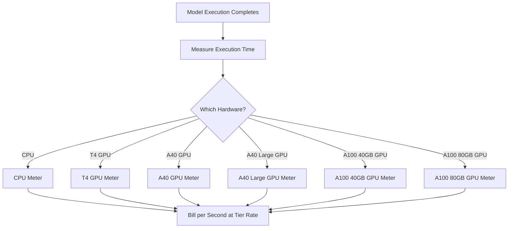

Replikate är en plattform för att köra open-source maskininlärningsmodeller i molnet. Deras faktureringsmodell är ett av de renaste exemplen på användningsbaserad prissättning inom AI-industrin. Det finns ingen månadsprenumeration och ingen fast avgift per modellkörning. Istället debiterar de för den exakta mängden datorkraft som förbrukas, ned till sekunden, med priser som varierar beroende på underliggande hårdvara.

Denna metod fungerar bra för AI-arbetsbelastningar eftersom exekveringstider är oförutsägbara. En enda användare kan köra en lätt modell i några sekunder eller en massiv generativ modell i flera minuter. Genom att koppla kostnaden till datorkraft istället för själva modellen håller Replikate prissättningen transparent och skalbar.

## Hur Replikate fakturerar

Replikates prissättning är frikopplad från den specifika modell som körs. Oavsett om du genererar en bild med SDXL eller kör Llama 3 bestäms faktureringen av hårdvarunivån och verkställningens varaktighet. Detta låter dem vara värd för tusentals open-source modeller utan att behöva en separat prissättningsplan för varje.

| Hårdvara | Pris per sekund | Pris per timme |
| :--- | :--- | :--- |
| NVIDIA CPU | \$0.000100 | \$0.36 |
| NVIDIA T4 GPU | \$0.000225 | \$0.81 |
| NVIDIA A40 GPU | \$0.000575 | \$2.07 |
| NVIDIA A40 (Large) GPU | \$0.000725 | \$2.61 |
| NVIDIA A100 (40GB) GPU | \$0.001150 | \$4.14 |
| NVIDIA A100 (80GB) GPU | \$0.001400 | \$5.04 |



1. **Hårdvaruspecifika priser**: Kostnaden per sekund varierar beroende på de datorkraftresurser som krävs. Varje hårdvarunivå har en annan prisnivå.
2. **Rena användningsbaserade modell**: Det finns inga månatliga avgifter, inga överbelastningar och inga begränsningar. Användare debiteras för exakt beräkningstid (t.ex. "12.4 sekunder på en A100") istället för per-generation.
3. **Sekund-granularitet**: Traditionella molnleverantörer fakturerar per timme eller minut, vilket leder till slöseri på kortlivade uppgifter. Fakturering per sekund eliminerar denna ineffektivitet för både små experiment och stora produktionsarbetsbelastningar.

<Info>
Kalla startar är också fakturerbara. Den första begäran till en modell tar ofta 10-30 sekunder att ladda modellen i minnet. Denna laddningstid faktureras till samma pris som exekveringstiden.
</Info>
## Vad som gör den unik

* **Hårdvaruspecifik mätning:** Samma modell kostar mer på bättre hårdvara. Användare väljer mellan hastighet och kostnad. En T4 GPU fungerar för icke-tidssensitiva uppgifter, medan en A100 hanterar realtidsapplikationer.
* **Sekund-granularitet:** Fakturering beräknas per sekund, så användare överbelastas aldrig för korta uppgifter.
* **Ingen prenumeration:** Noll åtagande att starta. Den skalar oändligt med användning, vilket gör den idealisk för startups och utvecklare som experimenterar med olika modeller.
* **Modell-agnostisk:** Faktureringslogiken förblir densamma oavsett uppgiftstyp (bildgenerering, textbearbetning, ljudtranskription eller videosyntes). Detta gör att plattformen kan stödja ett stort modelekosystem utan komplexa prislistor.

## Bygga detta med Dodo Payments

Du kan replikera denna faktureringsmodell genom att använda Dodo Payments användningsbaserade faktureringsfunktioner. Nyckeln är att använda flera mätare för att spåra olika hårdvarunivåer och fästa dem på en enda produkt.

<Steps>
  <Step title="Create Usage Meters (One Per Hardware Class)">
    Skapa separata mätare för varje hårdvarunivå. Varje hårdvarutyp har en annan kostnad per sekund, så oberoende mätning låter Dodo prissätta varje nivå annorlunda och ge specificerad fakturering.

    | Mätarnamn | Händelsenamn | Aggregation | Egenskap |
    | :--- | :--- | :--- | :--- |
    | CPU Compute | `compute.cpu` | Sum | `execution_seconds` |
    | GPU T4 Compute | `compute.gpu_t4` | Sum | `execution_seconds` |
    | GPU A40 Compute | `compute.gpu_a40` | Sum | `execution_seconds` |
    | GPU A40 Large Compute | `compute.gpu_a40_large` | Sum | `execution_seconds` |
    | GPU A100 40GB Compute | `compute.gpu_a100_40` | Sum | `execution_seconds` |
    | GPU A100 80GB Compute | `compute.gpu_a100_80` | Sum | `execution_seconds` |

    Aggregationen `Sum` på egenskapen `execution_seconds` beräknar den totala beräknings tiden per hårdvarunivå under faktureringsperioden.
  </Step>

  <Step title="Create a Usage-Based Product">
    Skapa en ny produkt i Dodo Payments instrumentpanel:

    * **Pristyp:** Användningsbaserad fakturering
    * **Baspris:** \$0/månad (ingen prenumerationsavgift)
    * **Faktureringsfrekvens:** Månatligen

    Anslut alla mätare med deras enhetsprissättning:

    | Mätare | Pris Per Enhet (per sekund) |
    | :--- | :--- |
    | compute.cpu | \$0.000100 |
    | compute.gpu_t4 | \$0.000225 |
    | compute.gpu_a40 | \$0.000575 |
    | compute.gpu_a40_large | \$0.000725 |
    | compute.gpu_a100_40 | \$0.001150 |
    | compute.gpu_a100_80 | \$0.001400 |

    Sätt **Gratis Tröskel** till 0 för alla mätare. Varje sekund av exekvering är fakturerbar.
  </Step>

  <Step title="Send Usage Events">
    Skicka användningshändelser till Dodo när en modellkörning är klar. Inkludera en unik `event_id` för varje förutsägelse för att säkerställa idempotens.

    ```typescript
    import DodoPayments from 'dodopayments';

    type HardwareTier = 'cpu' | 'gpu_t4' | 'gpu_a40' | 'gpu_a40_large' | 'gpu_a100_40' | 'gpu_a100_80';

    const client = new DodoPayments({
      bearerToken: process.env.DODO_PAYMENTS_API_KEY,
    });

    async function trackModelExecution(
      customerId: string,
      modelId: string,
      hardware: HardwareTier,
      executionSeconds: number,
      predictionId: string
    ) {
      const eventName = `compute.${hardware}`;

      await client.usageEvents.ingest({
        events: [{
          event_id: `pred_${predictionId}`,
          customer_id: customerId,
          event_name: eventName,
          timestamp: new Date().toISOString(),
          metadata: {
            execution_seconds: executionSeconds,
            model_id: modelId,
            hardware: hardware
          }
        }]
      });
    }

    // Example: SDXL image generation on A100
    await trackModelExecution(
      'cus_abc123',
      'stability-ai/sdxl',
      'gpu_a100_80',
      8.3,  // 8.3 seconds of A100 time
      'pred_xyz789'
    );
    ```

  </Step>

  <Step title="Measure Execution Time Precisely">
    Omslut din modellkörning med exakt timing med `performance.now()`. Avrunda till närmaste tiondels sekund för fakturering.

    ```typescript
    async function runModelWithMetering(
      customerId: string,
      modelId: string,
      hardware: HardwareTier,
      input: Record<string, unknown>
    ) {
      const predictionId = `pred_${Date.now()}`;
      const startTime = performance.now();

      try {
        const result = await executeModel(modelId, input, hardware);
        const executionSeconds = (performance.now() - startTime) / 1000;
        const billedSeconds = Math.round(executionSeconds * 10) / 10;

        await trackModelExecution(
          customerId,
          modelId,
          hardware,
          billedSeconds,
          predictionId
        );

        return result;
      } catch (error) {
        // Still bill for compute time even on failure
        const executionSeconds = (performance.now() - startTime) / 1000;
        if (executionSeconds > 1) {
          await trackModelExecution(
            customerId,
            modelId,
            hardware,
            Math.round(executionSeconds * 10) / 10,
            predictionId
          );
        }
        throw error;
      }
    }
    ```

  </Step>

  <Step title="Create Checkout">
    När en användare registrerar sig, skapa en betalningssession för den användningsbaserade produkten. Dodo hanterar automatiskt återkommande fakturering och fakturering.

    ```typescript
    const session = await client.checkoutSessions.create({
      product_cart: [
        { product_id: 'prod_compute_payg', quantity: 1 }
      ],
      customer: { email: 'ml-engineer@company.com' },
      return_url: 'https://yourplatform.com/dashboard'
    });
    ```

  </Step>
</Steps>

## Accelerera med den tidsintervallbaserade Ingestion Blueprint

[Time Range Ingestion Blueprint](/developer-resources/ingestion-blueprints/time-range) förenklar sekundbästa datorspårning. Skapa en ingestion-instans per hårdvarunivå och använd `trackTimeRange` för förenklad händelseinlämning.

```bash
npm install @dodopayments/ingestion-blueprints
```

```typescript
import { Ingestion, trackTimeRange } from '@dodopayments/ingestion-blueprints';

// Create one ingestion instance per hardware tier
function createHardwareIngestion(hardware: string) {
  return new Ingestion({
    apiKey: process.env.DODO_PAYMENTS_API_KEY,
    environment: 'live_mode',
    eventName: `compute.${hardware}`,
  });
}

const ingestions: Record<string, Ingestion> = {
  cpu: createHardwareIngestion('cpu'),
  gpu_t4: createHardwareIngestion('gpu_t4'),
  gpu_a40: createHardwareIngestion('gpu_a40'),
  gpu_a40_large: createHardwareIngestion('gpu_a40_large'),
  gpu_a100_40: createHardwareIngestion('gpu_a100_40'),
  gpu_a100_80: createHardwareIngestion('gpu_a100_80'),
};

// Track execution after a model run completes
const startTime = performance.now();
const result = await executeModel(modelId, input, hardware);
const durationMs = performance.now() - startTime;

await trackTimeRange(ingestions[hardware], {
  customerId: customerId,
  durationMs: durationMs,
  metadata: {
    model_id: modelId,
    hardware: hardware,
  },
});
```

Blueprint hanterar varaktighetsformatering och händelsekonstruktion. Kombinerat med per-hårdvara ingestion-instanser, mappar detta mönster snyggt till Replikates flernivå mätning.

<Tip>
För långvariga jobb, kombinera Time Range Blueprint med intervallbaserad puls spårning. Se [fullständig blueprintdokumentation](/developer-resources/ingestion-blueprints/time-range) för avancerade mönster.
</Tip>

## Kostnadsestimering för användare

Eftersom användningsbaserad fakturering kan vara oförutsägbar, ge användarna kostnadssammanställningar innan de kör en modell. Detta minskar överraskningsräkningar och bygger förtroende.

### Exempel på kostnadsberäkningar

| Modell | Hårdvara | Genomsnittlig tid | Kostnad per körning |
| :--- | :--- | :--- | :--- |
| SDXL (bild) | A100 80GB | ~8 sek | ~\$0.0112 |
| Llama 3 (text) | A100 40GB | ~3 sek | ~\$0.0035 |
| Whisper (ljud) | GPU T4 | ~15 sek | ~\$0.0034 |

### Bygga en kostnadskalkylator

CODE_PLACEHOLDER_ebff9d93a66fbf_END

## Företag: Reserverad kapacitet

För företagskunder som behöver garanterad tillgänglighet och inga kalla starter, erbjuder Replikate "Privata Instanser" till en fast timkostnad.

Med Dodo Payments modellerar du detta som en prenumerationsprodukt:

* **Produkttyp:** Prenumeration
* **Pris:** Fast månadspris (t.ex. "Reserverad A100 Instans - \$500/månad")
* **Faktureringscykel:** Månatligen

Du kan fortfarande skicka användningshändelser för övervakning och analys, men prenumerationen täcker kostnaden. När en användares volym växer, blir det ofta mer kostnadseffektivt att byta från pay-as-you-go till reserverad kapacitet.

## Avancerat: Hjärtklappningsmätning

För uppgifter som tar flera minuter eller timmar är det riskabelt att skicka en enda händelse i slutet. Om processen kraschar förlorar du användningsdata. Ett bättre tillvägagångssätt är att skicka användningshändelser var 30-60 sekunder under exekvering.

```typescript
async function runLongTaskWithHeartbeat(
  customerId: string,
  modelId: string,
  hardware: HardwareTier
) {
  const predictionId = `pred_${Date.now()}`;
  let totalSeconds = 0;

  const heartbeatInterval = setInterval(async () => {
    try {
      await trackModelExecution(
        customerId,
        modelId,
        hardware,
        30,
        `${predictionId}_${totalSeconds}`
      );
      totalSeconds += 30;
    } catch (error) {
      console.error('Heartbeat tracking failed:', error, { predictionId, totalSeconds });
    }
  }, 30000);

  try {
    await executeLongTask();
  } finally {
    clearInterval(heartbeatInterval);
  }
}
```

## Viktiga Dodo-funktioner som används

<CardGroup cols={2}>
  <Card title="Usage-Based Billing" icon="chart-line" href="/features/usage-based-billing/introduction">
    Ställ in produkter som fakturerar baserat på konsumtion.
  </Card>
  <Card title="Meters" icon="gauge" href="/features/usage-based-billing/meters">
    Definiera de mätvärden du vill följa upp och fakturera för.
  </Card>
  <Card title="Event Ingestion" icon="bolt" href="/features/usage-based-billing/event-ingestion">
    Skicka användningsdata till Dodo i realtid.
  </Card>
  <Card title="Subscriptions" icon="calendar" href="/features/subscription">
    Hantera återkommande fakturering för reserverad kapacitet och företagsplaner.
  </Card>
  <Card title="Time Range Blueprint" icon="clock" href="/developer-resources/ingestion-blueprints/time-range">
    Sekundbaserad dator spårning med tidslängdshjälpmedel.
  </Card>
</CardGroup>
