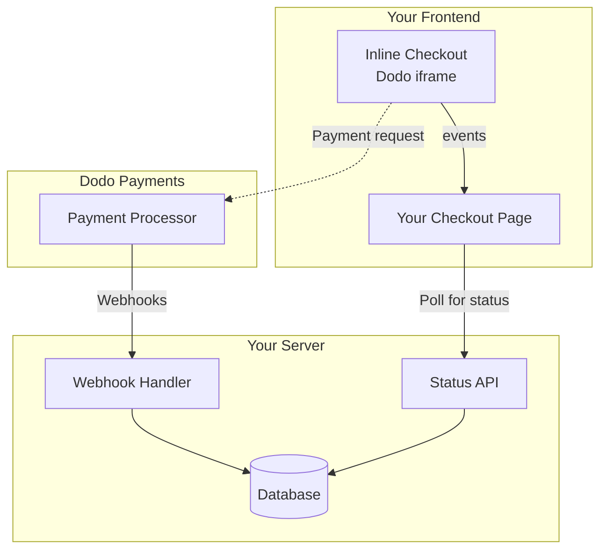

## Översikt

Inline checkout låter dig skapa fullt integrerade checkout-upplevelser som smälter samman med din webbplats eller applikation. Till skillnad från [overlay checkout](/developer-resources/overlay-checkout), som öppnas som en modal ovanpå din sida, integrerar inline checkout betalningsformuläret direkt i din sidlayout.

Med inline checkout kan du:

- Skapa checkout-upplevelser som är helt integrerade med din app eller webbplats
- Låta Dodo Payments säkert fånga kund- och betalningsinformation i en optimerad checkout-ram
- Visa artiklar, totalsummor och annan information från Dodo Payments på din sida
- Använda SDK-metoder och händelser för att bygga avancerade checkout-upplevelser

<Frame>
    
</Frame>

## Hur Det Fungerar

Inline checkout fungerar genom att integrera en säker Dodo Payments-ram i din webbplats eller app.

Checkout-ramen hanterar insamling av kundinformation och fångar betalningsdetaljer. Din sida visar artikellistan, totalsummor och alternativ för att ändra vad som finns i checkout. SDK:n låter din sida och checkout-ramen interagera med varandra.

Dodo Payments skapar automatiskt en prenumeration när en checkout är klar, redo för dig att tillhandahålla.

<Note>
Inline checkout-ramen hanterar säkert all känslig betalningsinformation och säkerställer PCI-efterlevnad utan ytterligare certifiering från din sida.
</Note>

## Vad Gör En Bra Inline Checkout?

Det är viktigt att kunderna vet vem de köper från, vad de köper och hur mycket de betalar.

För att bygga en inline checkout som är efterlevande och optimerad för konvertering måste din implementation inkludera:

<Frame caption="Example inline checkout layout showing required elements">
    
</Frame>

1. **Återkommande information**: Om det är återkommande, hur ofta det återkommer och den totala summan att betala vid förnyelse. Om det är en provperiod, hur länge provperioden varar.
2. **Artikelbeskrivningar**: En beskrivning av vad som köps.
3. **Transaktionstotalsummor**: Transaktionstotalsummor, inklusive delsumma, total skatt och grand total. Se till att inkludera valutan också.
4. **Dodo Payments-fotnot**: Den fullständiga inline checkout-ramen, inklusive checkout-fotnoten som har information om Dodo Payments, våra försäljningsvillkor och vår integritetspolicy.
5. **Återbetalningspolicy**: En länk till din återbetalningspolicy, om den skiljer sig från Dodo Payments standardåterbetalningspolicy.

<Warning>
Visa alltid den kompletta inline checkout-ramen, inklusive sidfoten. Att ta bort eller dölja juridisk information bryter mot efterlevnadskrav.
</Warning>

## Kundresa

Checkout-flödet bestäms av din checkout-sessionkonfiguration. Beroende på hur du konfigurerar checkout-sessionen kommer kunderna att uppleva en checkout som kan presentera all information på en enda sida eller över flera steg.

<Steps>
<Step title="Customer opens checkout">

Du kan öppna inline utcheckning genom att skicka artiklar eller en befintlig transaktion. Använd SDK för att visa och uppdatera information på sidan, och SDK-metoder för att uppdatera artiklar baserat på kundinteraktion.
    

</Step>

<Step title="Customer enters their details">

Inline checkout ber först kunderna att ange sin e-postadress, välja sitt land och (där det krävs) ange sitt postnummer. Detta steg samlar all nödvändig information för att bestämma skatter och tillgängliga betalningsalternativ.

Du kan förfylla kunduppgifter och presentera sparade adresser för att effektivisera upplevelsen.

</Step>

<Step title="Customer selects payment method">

Efter att ha angett sina uppgifter presenteras kunderna med tillgängliga betalningsmetoder och betalningsformuläret. Alternativ kan inkludera kredit- eller betalkort, PayPal, Apple Pay, Google Pay och andra lokala betalningsmetoder baserat på deras plats.

Visa sparade betalningsmetoder om de finns tillgängliga för att snabba upp checkout.


</Step>

<Step title="Checkout completed">

Dodo Payments dirigerar varje betalning till den bästa förvärvaren för den försäljningen för att få bästa möjliga chans till framgång. Kunderna går in i ett framgångsflöde som du kan bygga.


</Step>

<Step title="Dodo Payments creates subscription">

Dodo Payments skapar automatiskt en prenumeration för kunden, redo för dig att tillhandahålla. Betalningsmetoden som kunden använde hålls på fil för förnyelser eller ändringar av prenumerationen.


</Step>
</Steps>

## Snabbstart

Kom igång med Dodo Payments Inline Checkout på bara några rader kod:

```typescript
import { DodoPayments } from "dodopayments-checkout";

// Initialize the SDK for inline mode
DodoPayments.Initialize({
  mode: "test",
  displayType: "inline",
  onEvent: (event) => {
    console.log("Checkout event:", event);
  },
});

// Open checkout in a specific container
DodoPayments.Checkout.open({
  checkoutUrl: "https://test.dodopayments.com/session/cks_123",
  elementId: "dodo-inline-checkout" // ID of the container element
});
```

<Tip>
Se till att du har ett container-element med motsvarande `id` på din sida: `<div id="dodo-inline-checkout"></div>`.
</Tip>

## Steg-för-steg Integrationsguide

<Steps>
<Step title="Install the SDK">

Installera Dodo Payments Checkout SDK:

<CodeGroup>

```bash npm
npm install dodopayments-checkout
```

```bash yarn
yarn add dodopayments-checkout
```

```bash pnpm
pnpm add dodopayments-checkout
```

</CodeGroup>

</Step>

<Step title="Initialize the SDK for Inline Display">

Initiera SDK:n och ange `displayType: 'inline'`. Du bör också lyssna på `checkout.breakdown`-händelsen för att uppdatera ditt användargränssnitt med realtidsberäkningar av skatt och totalsumma.

```typescript
import { DodoPayments } from "dodopayments-checkout";

DodoPayments.Initialize({
  mode: "test",
  displayType: "inline",
  onEvent: (event) => {
    if (event.event_type === "checkout.breakdown") {
      const breakdown = event.data?.message;
      // Update your UI with breakdown.subTotal, breakdown.tax, breakdown.total, etc.
    }
  },
});
```

</Step>

<Step title="Create a Container Element">

Lägg till ett element i din HTML där checkout-ramen kommer att injiceras:

```html
<div id="dodo-inline-checkout"></div>
```

</Step>

<Step title="Open the Checkout">

Anropa `DodoPayments.Checkout.open()` med `checkoutUrl` och `elementId` från din container:

```typescript
DodoPayments.Checkout.open({
  checkoutUrl: "https://test.dodopayments.com/session/cks_123",
  elementId: "dodo-inline-checkout"
});
```

</Step>

<Step title="Test Your Integration">

1. Starta din utvecklingsserver:

```bash
npm run dev
```

2. Testa checkout-flödet:
   - Ange din e-post och adressuppgifter i inline-ramen.
   - Verifiera att din anpassade ordersammanfattning uppdateras i realtid.
   - Testa betalningsflödet med testuppgifter.
   - Bekräfta att omdirigeringar fungerar korrekt.

<Check>
Du bör se `checkout.breakdown`-händelser loggas i din webbläsarkonsol om du lade till en console.log i `onEvent`-callbacken.
</Check>

</Step>

<Step title="Go Live">

När du är redo för produktion:

1. Ändra läget till `'live'`:

```typescript
DodoPayments.Initialize({
  mode: "live",
  displayType: "inline",
  onEvent: (event) => {
    // Handle events
  }
});
```

2. Uppdatera dina checkout-URL:er för att använda live checkout-sessioner från din backend.
3. Testa hela flödet i produktion.

</Step>
</Steps>

## Komplett React Exempel

Detta exempel visar hur du implementerar en anpassad orderöversikt bredvid inline checkout och håller dem synkade med hjälp av `checkout.breakdown`-händelsen.

```tsx
"use client";

import { useEffect, useState } from 'react';
import { DodoPayments, CheckoutBreakdownData } from 'dodopayments-checkout';

export default function CheckoutPage() {
  const [breakdown, setBreakdown] = useState<Partial<CheckoutBreakdownData>>({});

  useEffect(() => {
    // 1. Initialize the SDK
    DodoPayments.Initialize({
      mode: 'test',
      displayType: 'inline',
      onEvent: (event) => {
        // 2. Listen for the 'checkout.breakdown' event
        if (event.event_type === "checkout.breakdown") {
          const message = event.data?.message as CheckoutBreakdownData;
          if (message) setBreakdown(message);
        }
      }
    });

    // 3. Open the checkout in the specified container
    DodoPayments.Checkout.open({
      checkoutUrl: 'https://test.dodopayments.com/session/cks_123',
      elementId: 'dodo-inline-checkout'
    });

    return () => DodoPayments.Checkout.close();
  }, []);

  const format = (amt: number | null | undefined, curr: string | null | undefined) => 
    amt != null && curr ? `${curr} ${(amt/100).toFixed(2)}` : '0.00';

  const currency = breakdown.currency ?? breakdown.finalTotalCurrency ?? '';

  return (
    <div className="flex flex-col md:flex-row min-h-screen">
      {/* Left Side - Checkout Form */}
      <div className="w-full md:w-1/2 flex items-center">
        <div id="dodo-inline-checkout" className='w-full' />
      </div>

      {/* Right Side - Custom Order Summary */}
      <div className="w-full md:w-1/2 p-8 bg-gray-50">
        <h2 className="text-2xl font-bold mb-4">Order Summary</h2>
        <div className="space-y-2">
          {breakdown.subTotal && (
            <div className="flex justify-between">
              <span>Subtotal</span>
              <span>{format(breakdown.subTotal, currency)}</span>
            </div>
          )}
          {breakdown.discount && (
            <div className="flex justify-between">
              <span>Discount</span>
              <span>{format(breakdown.discount, currency)}</span>
            </div>
          )}
          {breakdown.tax != null && (
            <div className="flex justify-between">
              <span>Tax</span>
              <span>{format(breakdown.tax, currency)}</span>
            </div>
          )}
          <hr />
          {(breakdown.finalTotal ?? breakdown.total) && (
            <div className="flex justify-between font-bold text-xl">
              <span>Total</span>
              <span>{format(breakdown.finalTotal ?? breakdown.total, breakdown.finalTotalCurrency ?? currency)}</span>
            </div>
          )}
        </div>
      </div>
    </div>
  );
}

```

## API Referens

### Konfiguration

#### Initieringsalternativ

```typescript
interface InitializeOptions {
  mode: "test" | "live";
  displayType: "inline"; // Required for inline checkout
  onEvent: (event: CheckoutEvent) => void;
}
```

| Alternativ | Typ | Obligatoriskt | Beskrivning |
|--------|------|----------|-------------|
| `mode` | `"test" \| "live"` | Ja | Miljöläge. |
| `displayType` | `"inline" \| "overlay"` | Ja | Måste vara inställt på `"inline"` för att bädda in kassan. |
| `onEvent` | `function` | Ja | Callbackfunktion för att hantera kassa-händelser. |

#### Checkoutalternativ

```typescript
export type FontSize = "xs" | "sm" | "md" | "lg" | "xl" | "2xl";
export type FontWeight = "normal" | "medium" | "bold" | "extraBold";

interface CheckoutOptions {
  checkoutUrl: string;
  elementId: string; // Required for inline checkout
  options?: {
    showTimer?: boolean;
    showSecurityBadge?: boolean;
    payButtonText?: string;
    fontSize?: FontSize;
    fontWeight?: FontWeight;
  };
}
```

| Option | Type | Required | Description |
|--------|------|----------|-------------|
| `checkoutUrl` | `string` | Yes | URL för utcheckningssessionen. |
| `elementId` | `string` | Yes | `id` av DOM-elementet där utcheckningen ska renderas. |
| `options.showTimer` | `boolean` | No | Visa eller dölj utcheckningstimern. Standard är `true`. När den är inaktiverad kommer du att få händelsen `checkout.link_expired` när sessionen går ut. |
| `options.showSecurityBadge` | `boolean` | No | Visa eller dölja säkerhetsmärket. Standard är `true`. |
| `options.payButtonText` | `string` | No | Användardefinierad text för betalknappen. |
| `options.fontSize` | `FontSize` | No | Global teckenstorlek för utcheckningen. |
| `options.fontWeight` | `FontWeight` | No | Global teckensnittsvikt för utcheckningen. |

### Metoder

#### Öppna Checkout

Öppnar checkout-ramen i den angivna behållaren.

```typescript
DodoPayments.Checkout.open({
  checkoutUrl: "https://test.dodopayments.com/session/cks_123",
  elementId: "dodo-inline-checkout"
});
```

Du kan också skicka ytterligare alternativ för att anpassa kassabeteendet:

```typescript
DodoPayments.Checkout.open({
  checkoutUrl: "https://test.dodopayments.com/session/cks_123",
  elementId: "dodo-inline-checkout",
  options: {
    showTimer: false,
    showSecurityBadge: false,
    payButtonText: "Pay Now",
  },
});
```

#### Stäng Utcheckning

Avlägsnar programmatiskt utcheckningsramen och rensar upp händelselyssnare.

```typescript
DodoPayments.Checkout.close();
```

#### Kontrollera Status

Returnerar om utcheckningsramen för närvarande är injicerad.

```typescript
const isOpen = DodoPayments.Checkout.isOpen();
// Returns: boolean
```

### Händelser

SDK:n tillhandahåller realtidshändelser genom `onEvent`-återkallningsfunktionen. För inline checkout är `checkout.breakdown` särskilt användbar för att synkronisera din UI.

| Händelsetyp | Beskrivning |
|------------|-------------|
| `checkout.opened` | Utcheckningsramen har laddats. |
| `checkout.form_ready` | Utcheckningsformuläret är redo att mottaga användarinmatning. Användbart för att dölja laddningstillstånd och visa utchecknings-UI:en. |
| `checkout.breakdown` | Skickas när priser, skatter eller rabatter uppdateras. |
| `checkout.customer_details_submitted` | Kunduppgifter har skickats in. |
| `checkout.pay_button_clicked` | Skickas när kunden klickar på betalknappen. Användbart för analys och spårning av konverteringstrattar. |
| `checkout.redirect` | Utcheckningen kommer att utföra en omdirigering (t.ex. till en banksida). |
| `checkout.error` | Ett fel uppstod under utcheckningen. |
| `checkout.link_expired` | Skickas när utcheckningssessionen löper ut. Endast mottaget när `showTimer` är inställd på `false`. |

#### Utcheckningens Detaljer Data

`checkout.breakdown`-händelsen tillhandahåller följande data:

```typescript
interface CheckoutBreakdownData {
  subTotal?: number;          // Amount in cents
  discount?: number;         // Amount in cents
  tax?: number;              // Amount in cents
  total?: number;            // Amount in cents
  currency?: string;         // e.g., "USD"
  finalTotal?: number;       // Final amount including adjustments
  finalTotalCurrency?: string; // Currency for the final total
}
```

#### Förstå Händelsen Detaljer

`checkout.breakdown`-händelsen är det primära sättet att hålla din applikations UI synkroniserad med Dodo Payments utcheckningsstatus.

**När den skickas:**
- **Vid initialisering**: Omedelbart efter att utcheckningsramen har laddats och är redo.
- **Vid adressändring**: När kunden väljer ett land eller anger ett postnummer som leder till en skatteomräkning.

**Fältdetaljer:**

| Fält | Beskrivning |
|-------|-------------|
| `subTotal` | Summan av alla radartiklar i sessionen innan några rabatter eller skatter tillämpas. |
| `discount` | Det totala värdet av alla tillämpade rabatter. |
| `tax` | Den beräknade skattesumman. I `inline`-läge uppdateras detta dynamiskt när användaren interagerar med adressfälten. |
| `total` | Det matematiska resultatet av `subTotal - discount + tax` i sessionens basvaluta. |
| `currency` | ISO-valutakoden (t.ex. `"USD"`) för standard subtotal, rabatt och skattevärden. |
| `finalTotal` | Det faktiska beloppet kunden debiteras. Detta kan inkludera ytterligare valutajusteringar eller lokala betalningsmetodsavgifter som inte är en del av den grundläggande prisuppdelningen. |
| `finalTotalCurrency` | Valutan i vilken kunden faktiskt betalar. Detta kan skilja sig från `currency` om köpkraftsparitet eller lokal valutaomvandling är aktiv. |

**Viktiga Integreringstips:**

1.  **Valutaformatering**: Priser returneras alltid som heltal i den minsta valutaenheten (t.ex. cent för USD, yen för JPY). För att visa dem, dela med 100 (eller lämplig tiopotens) eller använd ett formateringsbibliotek som `Intl.NumberFormat`.
2.  **Hantering av initiala tillstånd**: När utcheckningen först laddas kan `tax` och `discount` vara `0` eller `null` tills användaren anger sina faktureringsuppgifter eller tillämpar en kod. Din UI ska hantera dessa tillstånd på ett smidigt sätt (t.ex. visa ett streck `—` eller dölja raden).
3.  **Den "slutliga summan" vs "totalsumman"**: Medan `total` ger dig den standardiserade priskalkylen, är `finalTotal` källan till sanningen för transaktionen. Om `finalTotal` är närvarande återspeglar det exakt vad som debiteras kundens kort, inklusive eventuella dynamiska justeringar.
4.  **Realtidsfeedback**: Använd `tax`-fältet för att visa användare att skatter beräknas i realtid. Detta ger en "live" känsla till din utcheckningssida och minskar friktionen under adressinmatningssteget.

## Implementeringsalternativ

### Paketinstallation via Paket Manager

Installera via npm, yarn eller pnpm som det visas i [Steg-för-steg-integreringsguiden](#step-by-step-integration-guide).

### CDN-implementering

För snabb integration utan ett bygga-steg kan du använda vår CDN:

```html
<!DOCTYPE html>
<html lang="en">
<head>
    <meta charset="UTF-8">
    <meta name="viewport" content="width=device-width, initial-scale=1.0">
    <title>Dodo Payments Inline Checkout</title>
    
    <!-- Load DodoPayments -->
    <script src="https://cdn.jsdelivr.net/npm/dodopayments-checkout@latest/dist/index.js"></script>
    <script>
        // Initialize the SDK
        DodoPaymentsCheckout.DodoPayments.Initialize({
            mode: "test",
            displayType: "inline",
            onEvent: (event) => {
                console.log('Checkout event:', event);
            }
        });
    </script>
</head>
<body>
    <div id="dodo-inline-checkout"></div>

    <script>
        // Open the checkout
        DodoPaymentsCheckout.DodoPayments.Checkout.open({
            checkoutUrl: "https://test.dodopayments.com/session/cks_123",
            elementId: "dodo-inline-checkout"
        });
    </script>
</body>
</html>
```

## Uppdatera Betalningsmetod

Inline utcheckning stödjer **betalningsmetodsuppdateringar** för prenumerationer. När en kund behöver uppdatera sin betalningsmetod - vare sig för en aktiv prenumeration eller för att återaktivera en pausad prenumeration - kan du representera uppdateringsflödet direkt inom din sidlayout.

### Hur det fungerar

1. Anropa [Uppdatera Betalningsmetod API](/features/subscription#update-payment-method-for-active-subscription) för att få en `payment_link`:

```typescript
const response = await client.subscriptions.updatePaymentMethod('sub_123', {
  type: 'new',
  return_url: 'https://example.com/return'
});
```

2. Passera den returnerade `payment_link` som `checkoutUrl` för att öppna inline utcheckning:

```typescript
DodoPayments.Checkout.open({
  checkoutUrl: response.payment_link,
  elementId: "dodo-inline-checkout"
});
```

Inline-ramen renderar endast formuläret för insamling av betalningsmetod. Kunder kan ange nya kortuppgifter eller välja en sparad betalningsmetod utan att lämna din sida.

### För Pausade Prenumerationer

När du uppdaterar betalningsmetoden för en prenumeration i `on_hold` status, skapar Dodo Payments automatiskt en debitering för eventuella återstående belopp. Övervaka `payment.succeeded` och `subscription.active`-webhooks för att bekräfta återaktivering.

```typescript
const response = await client.subscriptions.updatePaymentMethod('sub_123', {
  type: 'new',
  return_url: 'https://example.com/return'
});

if (response.payment_id) {
  // Charge created for remaining dues
  // Open inline checkout for payment collection
  DodoPayments.Checkout.open({
    checkoutUrl: response.payment_link,
    elementId: "dodo-inline-checkout"
  });
}
```

<Tip>
Du kan också använda en redan sparad betalningsmetod istället för att samla in nya uppgifter genom att skicka `type: 'existing'` med en `payment_method_id` till Uppdatera Betalningsmetod API.
</Tip>

## Felhantering

SDK:n tillhandahåller detaljerad felinformation genom händelsesystemet. Implementera alltid korrekt felhantering i din `onEvent`-återkallning:

```typescript
DodoPayments.Initialize({
  mode: "test",
  displayType: "inline",
  onEvent: (event: CheckoutEvent) => {
    if (event.event_type === "checkout.error") {
      console.error("Checkout error:", event.data?.message);
      // Handle error appropriately
    }
  }
});
```

<Warning>
Hantera alltid `checkout.error`-händelsen för att ge en bra användarupplevelse när problem uppstår.
</Warning>

## Bästa Praxis

1. **Responsiv Design**: Se till att ditt konteiner-element har tillräcklig bredd och höjd. Iframe kommer vanligtvis expandera för att fylla sin konteiner.
2. **Synkronisering**: Använd `checkout.breakdown`-händelsen för att hålla din anpassade orderöversikt eller prissättningstabeller synkroniserade med vad användaren ser i utcheckningsramen.
3. **Skelettillstånd**: Visa en laddningsindikator i din konteiner tills `checkout.opened`-händelsen skickas.
4. **Rensning**: Anropa `DodoPayments.Checkout.close()` när din komponent avmonteras för att rensa iframe och händelselyssnare.

<Info>
För mörkertilståndimplementeringar rekommenderas det att använda `#0d0d0d` som bakgrundsfärg för optimal visuell integration med inline utcheckningsram.
</Info>

## Validering av Betalningsstatus

<Warning>
Lita inte enbart på inline utcheckningshändelser för att avgöra betalningsframgång eller fel. Implementera alltid server-sidig validering med användning av webhooks och/eller polling.
</Warning>

### Varför Server-Sidig Validering Är Viktig

Även om inline utcheckningshändelser ger realtidsfeedback, bör de **inte** vara din enda sanningskälla för betalningsstatus. Nätverksproblem, webbläsarkrascher, eller användare som stänger sidan kan orsaka missade händelser. För att säkerställa tillförlitlig betalningsvalidering:

1. **Din server bör lyssna på webhook-händelser** - Dodo Payments skickar webhooks för betalningsstatusändringar
2. **Implementera en polllösning** - Din frontend bör hålla koll på din server för statusuppdateringar
3. **Kombinera båda tillvägagångssätten** - Använd webhooks som den primära källan och polling som en reservlösning

### Rekommenderad Arkitektur



### Implementeringssteg

**1. Lyssna efter utcheckningshändelser** - När användaren klickar på betala, börja förbereda för att verifiera statusen:

```typescript
onEvent: (event) => {
  if (event.event_type === 'checkout.pay_button_clicked') {
    // Start polling your server for confirmed status
    startPolling();
  }
}
```

**2. Poll din server** - Skapa en slutpunkt som kontrollerar din databas för betalningsstatus (uppdaterad av webhooks):

```typescript
// Poll every 2 seconds until status is confirmed
const interval = setInterval(async () => {
  const { status } = await fetch(`/api/payments/${paymentId}/status`).then(r => r.json());
  if (status === 'succeeded' || status === 'failed') {
    clearInterval(interval);
    handlePaymentResult(status);
  }
}, 2000);
```

**3. Hantera server-side webhooks** - Uppdatera din databas när Dodo skickar `payment.succeeded` eller `payment.failed` webhooks. Se vår [Webhook-dokumentation](/developer-resources/webhooks) för detaljer.

## Felsökning

<AccordionGroup>
<Accordion title="Checkout frame is not appearing">
- Verifiera att `elementId` matchar `id` av en `div` som faktiskt finns i DOM.
- Se till att `displayType: 'inline'` överlämnades till `Initialize`.
- Kontrollera att `checkoutUrl` är giltig.
</Accordion>

<Accordion title="Taxes are not updating in my UI">
- Se till att du lyssnar på `checkout.breakdown`-händelsen.
- Skatter beräknas först efter att användaren angett ett giltigt land och postnummer i utcheckningsramen.
</Accordion>
</AccordionGroup>

## Aktivera Digitala Plånböcker

För detaljerad information om inställning av Apple Pay, Google Pay och andra digitala plånböcker, se sidan <a href="/features/payment-methods/digital-wallets">Digitala Plånböcker</a>.

### Snabbinställning för Apple Pay

<Info>
Domänverifiering krävs endast för **inline (inbäddad) checkout**. Overlay checkout, värd checkout och betalningslänkar behöver det inte.
</Info>

Apple Pay verifieras per domän från instrumentpanelen.

<Steps>
<Step title="Open Wallet domains">
Gå till **Inställningar → Betalningsmetoder** och klicka på **Hantera domäner** på raden **Apple Pay**.

<Frame caption="Open Wallet domains from the Apple Pay row">
  
</Frame>
</Step>

<Step title="Download the domain association file">
Från panelen Wallet-domäner, ladda ner associationsfilen.

<Frame caption="Download the Apple Pay domain association file">
  
</Frame>
</Step>

<Step title="Register your domain">
Klicka på **Registrera domän** och ange den domän där du bäddar in inline checkout (t.ex. `shop.example.com`), sedan **Fortsätt**.

<Frame caption="Register the domain where you embed inline checkout">
  
</Frame>
</Step>

<Step title="Host the file on your domain">
Värd den på:

```
https://shop.example.com/.well-known/apple-developer-merchantid-domain-association
```

Den måste betjänas över HTTPS, nås utan omdirigeringar och betjänas med `Content-Type: application/octet-stream` eller `text/plain`.
</Step>

<Step title="Verify the domain">
Klicka på **Verifiera domän**. Dodo Payments bekräftar att filen är aktiv och skickar din domän till Apple.

<Frame caption="Verify the hosted association file">
  
</Frame>
</Step>

<Step title="Confirm it's active">
När statusen visar **Aktiv** är Apple Pay aktiverat för den domänen. Använd **Aktiverad**-vippknappen för att slå på eller av per domän.

<Frame caption="Verified domains show an Active status">
  
</Frame>
</Step>

<Step title="Test the integration">
1. Öppna checkout på en Apple-enhet
2. Kontrollera att Apple Pay-knappen visas
3. Slutför en testtransaktion
</Step>
</Steps>

## Webbläsarstöd

Dodo Payments Checkout SDK stöder följande webbläsare:

- Chrome (senaste)
- Firefox (senaste)
- Safari (senaste)
- Edge (senaste)
- IE11+

## Inline vs Overlay Checkout

Välj rätt checkout-typ för ditt användningsområde:

| Funktion | Inline Checkout | Overlay Checkout |
|---------|-----------------|------------------|
| Integreringsdjup | Helt inbäddad i sidan | Modal ovanpå sidan |
| Layoutkontroll | Full kontroll | Begränsad |
| Branding | Sömlös | Åtskiljd från sidan |
| Implementeringsinsats | Högre | Lägre |
| Bäst för | Anpassade checkout-sidor, hög-konverteringsflöden | Snabb integration, befintliga sidor |

<Tip>
Använd **inline checkout** när du vill ha maximalt kontroll över checkout-upplevelsen och sömlös branding. Använd **overlay checkout** för snabbare integration med minimala ändringar på dina befintliga sidor.
</Tip>

## Relaterade resurser

<CardGroup cols={2}>
<Card title="Overlay Checkout" icon="layer-group" href="/developer-resources/overlay-checkout">
    Använd overlay checkout för snabb integration baserad på modal-fönster.
</Card>

<Card title="Checkout Sessions API" icon="code" href="/api-reference/checkout-sessions/create">
    Skapa checkout-sessioner för att driva dina checkout-upplevelser.
</Card>

<Card title="Webhooks" icon="webhook" href="/developer-resources/webhooks">
    Hantera betalningshändelser server-side med webhooks.
</Card>

<Card title="Integration Guide" icon="book" href="/developer-resources/integration-guide">
    Fullständig guide för integrering av Dodo Payments.
</Card>
</CardGroup>

För mer hjälp, besök vårt [Discord community](https://discord.gg/bYqAp4ayYh) eller kontakta vårt supportteam för utvecklare.
