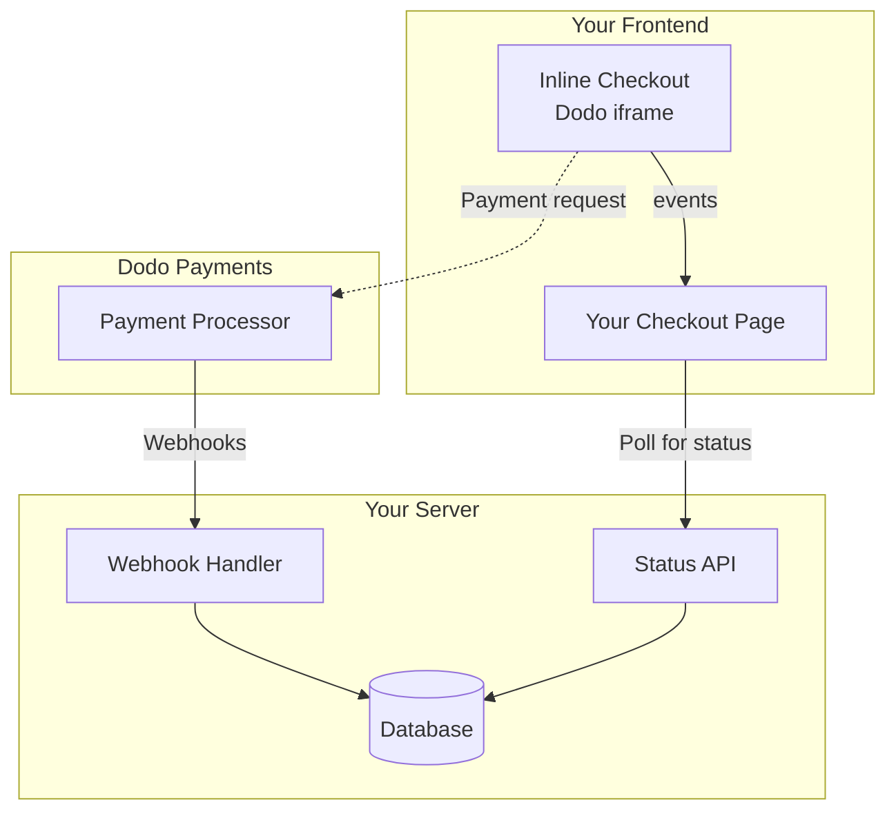

## Översikt

Inline checkout låter dig skapa fullt integrerade checkout-upplevelser som smälter samman med din webbplats eller applikation. Till skillnad från [overlay checkout](/developer-resources/overlay-checkout), som öppnas som en modal ovanpå din sida, integrerar inline checkout betalningsformuläret direkt i din sidlayout.

Med inline checkout kan du:

- Skapa checkout-upplevelser som är helt integrerade med din app eller webbplats
- Låta Dodo Payments säkert fånga kund- och betalningsinformation i en optimerad checkout-ram
- Visa artiklar, totalsummor och annan information från Dodo Payments på din sida
- Använda SDK-metoder och händelser för att bygga avancerade checkout-upplevelser

<Frame>
    
</Frame>

## Hur Det Fungerar

Inline checkout fungerar genom att integrera en säker Dodo Payments-ram i din webbplats eller app.

Checkout-ramen hanterar insamling av kundinformation och fångar betalningsdetaljer. Din sida visar artikellistan, totalsummor och alternativ för att ändra vad som finns i checkout. SDK:n låter din sida och checkout-ramen interagera med varandra.

Dodo Payments skapar automatiskt en prenumeration när en checkout är klar, redo för dig att tillhandahålla.

<Note>
Inline checkout-ramen hanterar säkert all känslig betalningsinformation, vilket säkerställer PCI-efterlevnad utan ytterligare certifiering från din sida.
</Note>

## Vad Gör En Bra Inline Checkout?

Det är viktigt att kunderna vet vem de köper från, vad de köper och hur mycket de betalar.

För att bygga en inline checkout som är efterlevande och optimerad för konvertering måste din implementation inkludera:

<Frame caption="Exempel på inline checkout-layout som visar nödvändiga element">
    
</Frame>

1. **Återkommande information**: Om det är återkommande, hur ofta det återkommer och den totala summan att betala vid förnyelse. Om det är en provperiod, hur länge provperioden varar.
2. **Artikelbeskrivningar**: En beskrivning av vad som köps.
3. **Transaktionstotalsummor**: Transaktionstotalsummor, inklusive delsumma, total skatt och grand total. Se till att inkludera valutan också.
4. **Dodo Payments-fotnot**: Den fullständiga inline checkout-ramen, inklusive checkout-fotnoten som har information om Dodo Payments, våra försäljningsvillkor och vår integritetspolicy.
5. **Återbetalningspolicy**: En länk till din återbetalningspolicy, om den skiljer sig från Dodo Payments standardåterbetalningspolicy.

<Warning>
Visa alltid den kompletta inline checkout-ramen, inklusive fotnoten. Att ta bort eller dölja juridisk information bryter mot efterlevnadskrav.
</Warning>

## Kundresa

Checkout-flödet bestäms av din checkout-sessionkonfiguration. Beroende på hur du konfigurerar checkout-sessionen kommer kunderna att uppleva en checkout som kan presentera all information på en enda sida eller över flera steg.

<Steps>
<Step title="Kund öppnar checkout">

Du kan öppna inline checkout genom att skicka varor eller en befintlig transaktion. Använd SDK:n för att visa och uppdatera information på sidan, och SDK-metoder för att uppdatera varor baserat på kundinteraktion.
    

</Step>

<Step title="Kund anger sina uppgifter">

Inline checkout ber först kunderna att ange sin e-postadress, välja sitt land och (där det krävs) ange sitt postnummer. Detta steg samlar all nödvändig information för att bestämma skatter och tillgängliga betalningsalternativ.

Du kan förfylla kunduppgifter och presentera sparade adresser för att effektivisera upplevelsen.

</Step>

<Step title="Kund väljer betalningsmetod">

Efter att ha angett sina uppgifter presenteras kunderna med tillgängliga betalningsmetoder och betalningsformuläret. Alternativ kan inkludera kredit- eller betalkort, PayPal, Apple Pay, Google Pay och andra lokala betalningsmetoder baserat på deras plats.

Visa sparade betalningsmetoder om de finns tillgängliga för att snabba upp checkout.


</Step>

<Step title="Checkout slutförd">

Dodo Payments dirigerar varje betalning till den bästa förvärvaren för den försäljningen för att få bästa möjliga chans till framgång. Kunderna går in i ett framgångsflöde som du kan bygga.


</Step>

<Step title="Dodo Payments skapar prenumeration">

Dodo Payments skapar automatiskt en prenumeration för kunden, redo för dig att tillhandahålla. Betalningsmetoden som kunden använde hålls på fil för förnyelser eller ändringar av prenumerationen.


</Step>
</Steps>

## Snabbstart

Kom igång med Dodo Payments Inline Checkout på bara några rader kod:

```typescript
import { DodoPayments } from "dodopayments-checkout";

// Initialize the SDK for inline mode
DodoPayments.Initialize({
  mode: "test",
  displayType: "inline",
  onEvent: (event) => {
    console.log("Checkout event:", event);
  },
});

// Open checkout in a specific container
DodoPayments.Checkout.open({
  checkoutUrl: "https://test.dodopayments.com/session/cks_123",
  elementId: "dodo-inline-checkout" // ID of the container element
});
```

<Tip>
Se till att du har ett containerelement med motsvarande `id` på din sida: `<div id="dodo-inline-checkout"></div>`.
</Tip>

## Steg-för-steg Integrationsguide

<Steps>
<Step title="Installera SDK:n">

Installera Dodo Payments Checkout SDK:

<CodeGroup>

```bash npm
npm install dodopayments-checkout
```

```bash yarn
yarn add dodopayments-checkout
```

```bash pnpm
pnpm add dodopayments-checkout
```

</CodeGroup>

</Step>

<Step title="Initiera SDK:n för Inline Display">

Initiera SDK:n och specificera `displayType: 'inline'`. Du bör också lyssna på `checkout.breakdown`-händelsen för att uppdatera din UI med realtidsberäkningar av skatt och totalsummor.

```typescript
import { DodoPayments } from "dodopayments-checkout";

DodoPayments.Initialize({
  mode: "test",
  displayType: "inline",
  onEvent: (event) => {
    if (event.event_type === "checkout.breakdown") {
      const breakdown = event.data?.message;
      // Update your UI with breakdown.subTotal, breakdown.tax, breakdown.total, etc.
    }
  },
});
```

</Step>

<Step title="Skapa ett Behållarelement">

Lägg till ett element i din HTML där checkout-ramen kommer att injiceras:

```html
<div id="dodo-inline-checkout"></div>
```

</Step>

<Step title="Öppna Checkout">

Anropa `DodoPayments.Checkout.open()` med `checkoutUrl` och `elementId` av ditt containerelement:

```typescript
DodoPayments.Checkout.open({
  checkoutUrl: "https://test.dodopayments.com/session/cks_123",
  elementId: "dodo-inline-checkout"
});
```

</Step>

<Step title="Testa Din Integration">

1. Starta din utvecklingsserver:

```bash
npm run dev
```

2. Testa checkout-flödet:
   - Ange din e-post och adressuppgifter i inline-ramen.
   - Verifiera att din anpassade ordersammanfattning uppdateras i realtid.
   - Testa betalningsflödet med testuppgifter.
   - Bekräfta att omdirigeringar fungerar korrekt.

<Check>
Du bör se `checkout.breakdown`-händelser loggade i din webbläsarkonsol om du har lagt till en konsollog i `onEvent`-allbacken.
</Check>

</Step>

<Step title="Gå Live">

När du är redo för produktion:

1. Byt läge till `'live'`:

```typescript
DodoPayments.Initialize({
  mode: "live",
  displayType: "inline",
  onEvent: (event) => {
    // Handle events
  }
});
```

2. Uppdatera dina checkout-URL:er för att använda live checkout-sessioner från din backend.
3. Testa hela flödet i produktion.

</Step>
</Steps>

## Komplett React Exempel

Detta exempel demonstrerar hur man implementerar en anpassad ordersammanfattning vid sidan av den inline kassan, vilket håller dem i synk med hjälp av `checkout.breakdown`-händelsen.

```tsx
"use client";

import { useEffect, useState } from 'react';
import { DodoPayments, CheckoutBreakdownData } from 'dodopayments-checkout';

export default function CheckoutPage() {
  const [breakdown, setBreakdown] = useState<Partial<CheckoutBreakdownData>>({});

  useEffect(() => {
    // 1. Initialize the SDK
    DodoPayments.Initialize({
      mode: 'test',
      displayType: 'inline',
      onEvent: (event) => {
        // 2. Listen for the 'checkout.breakdown' event
        if (event.event_type === "checkout.breakdown") {
          const message = event.data?.message as CheckoutBreakdownData;
          if (message) setBreakdown(message);
        }
      }
    });

    // 3. Open the checkout in the specified container
    DodoPayments.Checkout.open({
      checkoutUrl: 'https://test.dodopayments.com/session/cks_123',
      elementId: 'dodo-inline-checkout'
    });

    return () => DodoPayments.Checkout.close();
  }, []);

  const format = (amt: number | null | undefined, curr: string | null | undefined) => 
    amt != null && curr ? `${curr} ${(amt/100).toFixed(2)}` : '0.00';

  const currency = breakdown.currency ?? breakdown.finalTotalCurrency ?? '';

  return (
    <div className="flex flex-col md:flex-row min-h-screen">
      {/* Left Side - Checkout Form */}
      <div className="w-full md:w-1/2 flex items-center">
        <div id="dodo-inline-checkout" className='w-full' />
      </div>

      {/* Right Side - Custom Order Summary */}
      <div className="w-full md:w-1/2 p-8 bg-gray-50">
        <h2 className="text-2xl font-bold mb-4">Order Summary</h2>
        <div className="space-y-2">
          {breakdown.subTotal && (
            <div className="flex justify-between">
              <span>Subtotal</span>
              <span>{format(breakdown.subTotal, currency)}</span>
            </div>
          )}
          {breakdown.discount && (
            <div className="flex justify-between">
              <span>Discount</span>
              <span>{format(breakdown.discount, currency)}</span>
            </div>
          )}
          {breakdown.tax != null && (
            <div className="flex justify-between">
              <span>Tax</span>
              <span>{format(breakdown.tax, currency)}</span>
            </div>
          )}
          <hr />
          {(breakdown.finalTotal ?? breakdown.total) && (
            <div className="flex justify-between font-bold text-xl">
              <span>Total</span>
              <span>{format(breakdown.finalTotal ?? breakdown.total, breakdown.finalTotalCurrency ?? currency)}</span>
            </div>
          )}
        </div>
      </div>
    </div>
  );
}

```

## API Referens

### Konfiguration

#### Initieringsalternativ

```typescript
interface InitializeOptions {
  mode: "test" | "live";
  displayType: "inline"; // Required for inline checkout
  onEvent: (event: CheckoutEvent) => void;
}
```

| Alternativ | Typ | Obligatorisk | Beskrivning |
|-----------|-----|-------------|-------------|
| `mode` | `"test" \| "live"` | Ja | Miljöläge. |
| `displayType` | `"inline" \| "overlay"` | Ja | Måste ställas in på `"inline"` för att bädda in kassan. |
| `onEvent` | `function` | Ja | Callback-funktion för hantering av kassahändelser. |

#### Checkoutalternativ

```typescript
export type FontSize = "xs" | "sm" | "md" | "lg" | "xl" | "2xl";
export type FontWeight = "normal" | "medium" | "bold" | "extraBold";

interface CheckoutOptions {
  checkoutUrl: string;
  elementId: string; // Required for inline checkout
  options?: {
    showTimer?: boolean;
    showSecurityBadge?: boolean;
    manualRedirect?: boolean;
    themeConfig?: ThemeConfig;
    payButtonText?: string;
    fontSize?: FontSize;
    fontWeight?: FontWeight;
  };
}
```

| Alternativ | Typ | Obligatorisk | Beskrivning |
|-----------|-----|-------------|-------------|
| `checkoutUrl` | `string` | Ja | Kassasessions-URL. |
| `elementId` | `string` | Ja | `id` av DOM-elementet där kassan ska renderas. |
| `options.showTimer` | `boolean` | Nej | Visa eller dölj kassatimer. Standardinställning är `true`. När den är inaktiverad, får du `checkout.link_expired`-händelsen när sessionen går ut. |
| `options.showSecurityBadge` | `boolean` | Nej | Visa eller dölj säkerhetsmärkningen. Standardinställning är `true`. |
| `options.manualRedirect` | `boolean` | Nej | När det är aktiverat, kommer kassan inte att omdirigeras automatiskt efter slutförande. Istället får du `checkout.status` och `checkout.redirect_requested`-händelser för att hantera omdirigeringen själv. |
| `options.themeConfig` | `ThemeConfig` | Nej | Anpassad temakonfiguration. |
| `options.payButtonText` | `string` | Nej | Anpassad text för att visas på betala-knappen. |
| `options.fontSize` | `FontSize` | Nej | Global teckenstorlek för kassan. |
| `options.fontWeight` | `FontWeight` | Nej | Global teckenvikt för kassan. |

### Metoder

#### Öppna Checkout

Öppnar checkout-ramen i den angivna behållaren.

```typescript
DodoPayments.Checkout.open({
  checkoutUrl: "https://test.dodopayments.com/session/cks_123",
  elementId: "dodo-inline-checkout"
});
```

Du kan också skicka ytterligare alternativ för att anpassa kassabeteendet:

```typescript
DodoPayments.Checkout.open({
  checkoutUrl: "https://test.dodopayments.com/session/cks_123",
  elementId: "dodo-inline-checkout",
  options: {
    showTimer: false,
    showSecurityBadge: false,
    manualRedirect: true,
    payButtonText: "Pay Now",
  },
});
```

När du använder `manualRedirect`, hantera kassaavslutningen i din `onEvent` callback:

```typescript
DodoPayments.Initialize({
  mode: "test",
  displayType: "inline",
  onEvent: (event) => {
    if (event.event_type === "checkout.status") {
      const status = event.data?.message?.status;
      // Handle status: "succeeded", "failed", or "processing"
    }
    if (event.event_type === "checkout.redirect_requested") {
      const redirectUrl = event.data?.message?.redirect_to;
      // Redirect the customer manually
      window.location.href = redirectUrl;
    }
    if (event.event_type === "checkout.link_expired") {
      // Handle expired checkout session
    }
  },
});
```

#### Stäng Kassa

Tar bort kassa-ramen programatiskt och städar upp händelselyssnare.

```typescript
DodoPayments.Checkout.close();
```

#### Kontrollera Status

Returnerar om kassa-ramen för närvarande är injicerad.

```typescript
const isOpen = DodoPayments.Checkout.isOpen();
// Returns: boolean
```

### Händelser

SDK:n tillhandahåller realtids-händelser genom `onEvent` callback. För inline kassan är `checkout.breakdown` särskilt användbar för att synka din UI.

| Händelsetyp | Beskrivning |
|-------------|-------------|
| `checkout.opened` | Kassaram har laddats. |
| `checkout.form_ready` | Kassafönstret är redo att ta emot användarinmatning. Användbart för att dölja laddningstillstånd och visa kassainställningen. |
| `checkout.breakdown` | Utlöses när priser, skatter eller rabatter uppdateras. |
| `checkout.customer_details_submitted` | Kundens uppgifter har skickats. |
| `checkout.pay_button_clicked` | Utlöses när kunden klickar på betala-knappen. Användbart för analys och spårning av konverteringsflöden. |
| `checkout.redirect` | Kassan kommer att utföra en omdirigering (t.ex. till en bank-sida). |
| `checkout.error` | Ett fel inträffade under kassan. |
| `checkout.link_expired` | Utlöses när kassasessionen går ut. Endast mottagen när `showTimer` ställs in på `false`. |
| `checkout.status` | Utlöses när `manualRedirect` är aktiverat. Innehåller kassans status (`succeeded`, `failed` eller `processing`). |
| `checkout.redirect_requested` | Utlöses när `manualRedirect` är aktiverat. Innehåller URL:en för att omdirigera kunden till. |

#### Kassa Brytdata

`checkout.breakdown`-händelsen tillhandahåller följande data:

```typescript
interface CheckoutBreakdownData {
  subTotal?: number;          // Amount in cents
  discount?: number;         // Amount in cents
  tax?: number;              // Amount in cents
  total?: number;            // Amount in cents
  currency?: string;         // e.g., "USD"
  finalTotal?: number;       // Final amount including adjustments
  finalTotalCurrency?: string; // Currency for the final total
}
```

#### Kassa Status Händelsedata

När `manualRedirect` är aktiverat, får du `checkout.status`-händelsen med följande data:

```typescript
interface CheckoutStatusEventData {
  message: {
    status?: "succeeded" | "failed" | "processing";
  };
}
```

#### Kassa Omdirigering Begärd Händelsedata

När `manualRedirect` är aktiverat, får du `checkout.redirect_requested`-händelsen med följande data:

```typescript
interface CheckoutRedirectRequestedEventData {
  message: {
    redirect_to?: string;
  };
}
```

#### Förstå Brytdata Händelsen

`checkout.breakdown`-händelsen är det främsta sättet att hålla din applikations UI i synk med Dodo Payments kassa-status.

**När den utlöses:**
- **Vid initialisering**: Omedelbart efter att kassa-ramen har laddats och är redo.
- **Vid adressändring**: När kunden väljer ett land eller anger ett postnummer som resulterar i en skatteberäkning.

**Fältdetaljer:**

| Fält | Beskrivning |
|------|-------------|
| `subTotal` | Summan av alla artikelposter i sessionen innan några rabatter eller skatter tillämpas. |
| `discount` | Det totala värdet av alla tillämpade rabatter. |
| `tax` | Det beräknade skattbeloppet. I `inline`-läge, uppdateras det dynamiskt när användaren interagerar med adressfälten. |
| `total` | Det matematiska resultatet av `subTotal - discount + tax` i sessionens basvaluta. |
| `currency` | ISO-valutekoden (t.ex. `"USD"`) för standard subtotal, rabatt och skatt värden. |
| `finalTotal` | Det faktiska beloppet som kunden debiteras. Detta kan inkludera ytterligare valutajusteringar eller lokala betalningsmetodavgifter som inte ingår i grundprisuppdelningen. |
| `finalTotalCurrency` | Den valuta som kunden faktiskt betalar. Detta kan skilja sig från `currency` om köpkraftsparitet eller lokal valutakonvertering är aktiv. |

**Nyckelintegrationstips:**

1.  **Valutaformatering**: Priser returneras alltid som heltal i den minsta valutaenheten (t.ex. cent för USD, yen för JPY). För att visa dem, dela med 100 (eller den lämpliga tiopoten) eller använd ett formatteringsbibliotek som `Intl.NumberFormat`.
2.  **Hantering av initiala tillstånd**: När kassan först laddas kan `tax` och `discount` vara `0` eller `null` tills användaren anger sin faktureringsinformation eller tillämpar en kod. Din UI bör hantera dessa tillstånd på ett smidigt sätt (t.ex. visa ett streck `—` eller dölja raden).
3.  **"Slutgiltigt belopp" vs "Totalt"**: Medan `total` ger dig standardprisberäkningen, är `finalTotal` den primära källan för transaktionen. Om `finalTotal` är närvarande, återspeglar det exakt vad som kommer att debiteras kundens kort, inklusive eventuella dynamiska justeringar.
4.  **Realtidsåterkoppling**: Använd `tax`-fältet för att visa användare att skatter beräknas i realtid. Detta ger en "live" känsla till din kassa-sida och minskar friktion under adressinmatningssteget.

## Implementeringsalternativ

### Paketmanagerinstallation

Installera via npm, yarn eller pnpm som visas i [Steg-för-steg integrationsguiden](#step-by-step-integration-guide).

### CDN-implementering

För snabb integration utan byggsteg kan du använda vår CDN:

```html
<!DOCTYPE html>
<html lang="en">
<head>
    <meta charset="UTF-8">
    <meta name="viewport" content="width=device-width, initial-scale=1.0">
    <title>Dodo Payments Inline Checkout</title>
    
    <!-- Load DodoPayments -->
    <script src="https://cdn.jsdelivr.net/npm/dodopayments-checkout@latest/dist/index.js"></script>
    <script>
        // Initialize the SDK
        DodoPaymentsCheckout.DodoPayments.Initialize({
            mode: "test",
            displayType: "inline",
            onEvent: (event) => {
                console.log('Checkout event:', event);
            }
        });
    </script>
</head>
<body>
    <div id="dodo-inline-checkout"></div>

    <script>
        // Open the checkout
        DodoPaymentsCheckout.DodoPayments.Checkout.open({
            checkoutUrl: "https://test.dodopayments.com/session/cks_123",
            elementId: "dodo-inline-checkout"
        });
    </script>
</body>
</html>
```

### Temaanpassning

Du kan anpassa kassans utseende genom att skicka ett `themeConfig`-objekt i `options`-parametern när du öppnar kassan. Temakonfigurationen stöder både ljusa och mörka lägen, vilket gör att du kan anpassa färger, kanter, text, knappar och hörnvinkel.

<Info>
Detta avsnitt täcker **klientsides** temakonfiguration med Checkout SDK. Du kan också konfigurera teman **serversides** när du skapar en kassinärsession via API:et med `theme_config`-parametern. Se [Kassatemanpassning](/features/checkout#checkout-theme-customization) för konfiguration på API-nivå.
</Info>

#### Grundläggande Temakonfiguration

```typescript
DodoPayments.Checkout.open({
  checkoutUrl: "https://checkout.dodopayments.com/session/cks_123",
  options: {
    themeConfig: {
      light: {
        bgPrimary: "#FFFFFF",
        textPrimary: "#344054",
        buttonPrimary: "#A6E500",
      },
      dark: {
        bgPrimary: "#0D0D0D",
        textPrimary: "#FFFFFF",
        buttonPrimary: "#A6E500",
      },
      radius: "8px",
    },
  },
});
```

#### Fullständig Temakonfiguration

Alla tillgängliga temaegenskaper:

```typescript
DodoPayments.Checkout.open({
  checkoutUrl: "https://checkout.dodopayments.com/session/cks_123",
  options: {
    themeConfig: {
      light: {
        // Background colors
        bgPrimary: "#FFFFFF",        // Primary background color
        bgSecondary: "#F9FAFB",      // Secondary background color (e.g., tabs)
        
        // Border colors
        borderPrimary: "#D0D5DD",     // Primary border color
        borderSecondary: "#6B7280",  // Secondary border color
        inputFocusBorder: "#D0D5DD", // Input focus border color
        
        // Text colors
        textPrimary: "#344054",       // Primary text color
        textSecondary: "#6B7280",    // Secondary text color
        textPlaceholder: "#667085",  // Placeholder text color
        textError: "#D92D20",        // Error text color
        textSuccess: "#10B981",      // Success text color
        
        // Button colors
        buttonPrimary: "#A6E500",           // Primary button background
        buttonPrimaryHover: "#8CC500",      // Primary button hover state
        buttonTextPrimary: "#0D0D0D",       // Primary button text color
        buttonSecondary: "#F3F4F6",         // Secondary button background
        buttonSecondaryHover: "#E5E7EB",     // Secondary button hover state
        buttonTextSecondary: "#344054",     // Secondary button text color
      },
      dark: {
        // Background colors
        bgPrimary: "#0D0D0D",
        bgSecondary: "#1A1A1A",
        
        // Border colors
        borderPrimary: "#323232",
        borderSecondary: "#D1D5DB",
        inputFocusBorder: "#323232",
        
        // Text colors
        textPrimary: "#FFFFFF",
        textSecondary: "#909090",
        textPlaceholder: "#9CA3AF",
        textError: "#F97066",
        textSuccess: "#34D399",
        
        // Button colors
        buttonPrimary: "#A6E500",
        buttonPrimaryHover: "#8CC500",
        buttonTextPrimary: "#0D0D0D",
        buttonSecondary: "#2A2A2A",
        buttonSecondaryHover: "#3A3A3A",
        buttonTextSecondary: "#FFFFFF",
      },
      radius: "8px", // Border radius for inputs, buttons, and tabs
    },
  },
});
```

#### Endast Läge Ljust

Om du endast vill anpassa det ljusa temat:

```typescript
DodoPayments.Checkout.open({
  checkoutUrl: "https://checkout.dodopayments.com/session/cks_123",
  options: {
    themeConfig: {
      light: {
        bgPrimary: "#FFFFFF",
        textPrimary: "#000000",
        buttonPrimary: "#0070F3",
      },
      radius: "12px",
    },
  },
});
```

#### Endast Mörkt Läge

Om du endast vill anpassa det mörka temat:

```typescript
DodoPayments.Checkout.open({
  checkoutUrl: "https://checkout.dodopayments.com/session/cks_123",
  options: {
    themeConfig: {
      dark: {
        bgPrimary: "#000000",
        textPrimary: "#FFFFFF",
        buttonPrimary: "#0070F3",
      },
      radius: "12px",
    },
  },
});
```

#### Partiell Temaupphävning

Du kan upphäva endast specifika egenskaper. Kassan kommer att använda standardvärden för egenskaper som du inte anger:

```typescript
DodoPayments.Checkout.open({
  checkoutUrl: "https://checkout.dodopayments.com/session/cks_123",
  options: {
    themeConfig: {
      light: {
        buttonPrimary: "#FF6B6B", // Only override primary button color
      },
      radius: "16px", // Override border radius
    },
  },
});
```

#### Temakonfiguration med Andra Alternativ

Du kan kombinera temakonfiguration med andra kassaval:

```typescript
DodoPayments.Checkout.open({
  checkoutUrl: "https://checkout.dodopayments.com/session/cks_123",
  options: {
    showTimer: true,
    showSecurityBadge: true,
    manualRedirect: false,
    themeConfig: {
      light: {
        bgPrimary: "#FFFFFF",
        buttonPrimary: "#A6E500",
      },
      dark: {
        bgPrimary: "#0D0D0D",
        buttonPrimary: "#A6E500",
      },
      radius: "8px",
    },
  },
});
```

#### TypeScript Typer

För TypeScript-användare, alla temaegenskaper exporteras:

```typescript
import { ThemeConfig, ThemeModeConfig } from "dodopayments-checkout";

const themeConfig: ThemeConfig = {
  light: {
    bgPrimary: "#FFFFFF",
    // ... other properties
  },
  dark: {
    bgPrimary: "#0D0D0D",
    // ... other properties
  },
  radius: "8px",
};
```

## Uppdatera Betalningsmetod

Inline-kassan stöder **uppdateringar av betalningsmetod** för prenumerationer. När en kund behöver uppdatera sin betalningsmetod -- oavsett om det är för en aktiv prenumeration eller för att återaktivera en pausad prenumeration -- kan du rendera uppdateringsflödet direkt inom din sidlayout.

### Hur Det Fungerar

1. Anropa [Uppdatera Betalningsmetod API](/features/subscription#update-payment-method-for-active-subscription) för att få en `payment_link`:

```typescript
const response = await client.subscriptions.updatePaymentMethod('sub_123', {
  type: 'new',
  return_url: 'https://example.com/return'
});
```

2. Skicka tillbaka `payment_link` som `checkoutUrl` för att öppna inline-kassan:

```typescript
DodoPayments.Checkout.open({
  checkoutUrl: response.payment_link,
  elementId: "dodo-inline-checkout"
});
```

Inline-ramen renderar endast formuläret för insamling av betalningsmetoder. Kunder kan ange nya kortuppgifter eller välja en sparad betalningsmetod utan att lämna din sida.

### För Pausade Prenumerationer

När du uppdaterar betalningsmetoden för en prenumeration i `on_hold`-status, skapar Dodo Payments automatiskt en avgift för eventuella kvarstående avgifter. Övervaka `payment.succeeded` och `subscription.active`-webhooks för att bekräfta återaktivering.

```typescript
const response = await client.subscriptions.updatePaymentMethod('sub_123', {
  type: 'new',
  return_url: 'https://example.com/return'
});

if (response.payment_id) {
  // Charge created for remaining dues
  // Open inline checkout for payment collection
  DodoPayments.Checkout.open({
    checkoutUrl: response.payment_link,
    elementId: "dodo-inline-checkout"
  });
}
```

<Tip>
Du kan också använda en befintlig sparad betalningsmetod istället för att samla in nya uppgifter genom att skicka `type: 'existing'` med `payment_method_id` till Uppdatera Betalningsmetod API.
</Tip>

## Felhantering

SDK:n tillhandahåller detaljerad felinformation genom händelsessystemet. Implementera alltid korrekt felhantering i din `onEvent` callback:

```typescript
DodoPayments.Initialize({
  mode: "test",
  displayType: "inline",
  onEvent: (event: CheckoutEvent) => {
    if (event.event_type === "checkout.error") {
      console.error("Checkout error:", event.data?.message);
      // Handle error appropriately
    }
  }
});
```

<Warning>
Hantera alltid `checkout.error`-händelsen för att ge en bra användarupplevelse när problem uppstår.
</Warning>

## Bästa Praxiser

1. **Responsiv Design**: Se till att ditt containerelement har tillräcklig bredd och höjd. iframe:en kommer typiskt att expandera för att fylla sin container.
2. **Synkronisering**: Använd `checkout.breakdown`-händelsen för att hålla din anpassade ordersammanfattning eller prisschema i synk med vad användaren ser i kassa-rutan.
3. **Skelett-tillstånd**: Visa en laddningsindikator i din container tills `checkout.opened`-händelsen avfyras.
4. **Rengöring**: Anropa `DodoPayments.Checkout.close()` när din komponent avmonteras för att rensa iframe:en och händelselyssnare.

<Info>
För implementeringar i mörkt läge rekommenderas det att använda `#0d0d0d` som bakgrundsfärg för optimal visuell integration med inline kassa-ramen.
</Info>

## Validering av Betalningsstatus

<Warning>
Lita inte enbart på inline-kassahändelser för att avgöra betalningens framgång eller misslyckande. Implementera alltid validering på serversidan med hjälp av webhooks och/eller polling.
</Warning>

### Varför Serversidavalidering är Nödvändig

Medan inline-kassahändelser som `checkout.status` tillhandahåller realtidsåterkoppling, bör de **inte** vara din enda sanning för betalningsstatus. Nätverksproblem, webbläsarkrascher eller användare som stänger sidan kan orsaka att händelser missas. För att säkerställa pålitlig betalningsvalidering:

1. **Din server bör lyssna på webhook-händelser** - Dodo Payments skickar webhooks för betalningsstatusförändringar
2. **Implementera en pollingmekanism** - Din frontend bör fråga din server om statusuppdateringar
3. **Kombinera båda metoderna** - Använd webhooks som primär källa och polling som fallback

### Rekommenderad Arkitektur



### Implementeringssteg

**1. Lyssna efter kassa-händelser** - När användaren klickar på betala, börja förbereda för att verifiera status:

```typescript
onEvent: (event) => {
  if (event.event_type === 'checkout.status') {
    // Start polling your server for confirmed status
    startPolling();
  }
}
```

**2. Fråga din server** - Skapa ett slutpunkt som kontrollerar din databas för betalningsstatus (uppdaterad av webhooks):

```typescript
// Poll every 2 seconds until status is confirmed
const interval = setInterval(async () => {
  const { status } = await fetch(`/api/payments/${paymentId}/status`).then(r => r.json());
  if (status === 'succeeded' || status === 'failed') {
    clearInterval(interval);
    handlePaymentResult(status);
  }
}, 2000);
```

**3. Hantera webhooks på serversidan** - Uppdatera din databas när Dodo skickar `payment.succeeded` eller `payment.failed`-webhooks. Se vår [Webhook-dokumentation](/developer-resources/webhooks) för detaljer.

### Hantering av Omdirigeringar (3DS, Google Pay, UPI)

När du använder `manualRedirect: true`, kräver vissa betalningsmetoder att användaren omdirigeras bort från din sida för autentisering:

- **3D Secure (3DS)** - Kortautentisering
- **Google Pay** - Plånboksautentisering på vissa flöden
- **UPI** - Indisk betalningsmetod omdirigeringar

När en omdirigering krävs, får du `checkout.redirect_requested`-händelsen. Omdirigera användaren till den angivna URL:en:

```typescript
if (event.event_type === 'checkout.redirect_requested') {
  const redirectUrl = event.data?.message?.redirect_to;
  // Save payment ID before redirect, then redirect
  sessionStorage.setItem('pendingPaymentId', paymentId);
  window.location.href = redirectUrl;
}
```

Efter autentiseringen slutförs (framgång eller misslyckande), återkommer användaren till din sida. **Anta inte framgång bara för att användaren återvände.** Istället:

1. Kontrollera om användaren återvänder från en omdirigering (t.ex. via `sessionStorage`)
2. Börja fråga din server efter den bekräftade betalningsstatusen
3. Visa ett "Verifierar betalning..."-tillstånd under frågningen
4. Visa framgångs-/misslyckande UI baserat på den serverbekräftade statusen

<Tip>
Verifiera alltid betalningsstatusen på serversidan efter omdirigeringar. Användarens återkomst till din sida betyder bara att autentiseringen slutfördes—det indikerar inte om betalningen lyckades eller misslyckades.
</Tip>

## Felsökning

<AccordionGroup>
<Accordion title="Kassarammen visas inte">
- Verifiera att `elementId` matchar `id` av en `div` som faktiskt finns i DOM:en.
- Se till att `displayType: 'inline'` har skickats till `Initialize`.
- Kontrollera att `checkoutUrl` är giltigt.
</Accordion>

<Accordion title="Skatter uppdateras inte i min UI">
- Säkerställ att du lyssnar på `checkout.breakdown`-händelsen.
- Skatter beräknas endast efter att användaren har angett ett giltigt land och postnummer i kassafönstret.
</Accordion>
</AccordionGroup>

## Aktivera Digitala Plånböcker

För detaljerad information om hur man ställer in Apple Pay, Google Pay och andra digitala plånböcker, se sidan <a href="/features/payment-methods/digital-wallets">Digitala Plånböcker</a>.

### Snabbsetup för Apple Pay

<Steps>
<Step title="Ladda ner domänassociationsfil">
Ladda ner [Apple Pay domänassociationsfil](http://checkout.dodopayments.com/.well-known/apple-developer-merchantid-domain-association).
</Step>

<Step title="Begär aktivering">
Maila **support@dodopayments.com** med din produktions domän-URL och begär aktivering av Apple Pay.
</Step>

<Step title="Testa efter bekräftelse">
När det har bekräftats, verifiera att Apple Pay visas i kassan och testa hela flödet.
</Step>
</Steps>

<Warning>
Apple Pay kräver domänverifiering innan det visas i produktion. Kontakta supporten innan du går live om du planerar att erbjuda Apple Pay.
</Warning>

## Webbläsarstöd

Dodo Payments Checkout SDK stöder följande webbläsare:

- Chrome (senaste version)
- Firefox (senaste version)
- Safari (senaste version)
- Edge (senaste version)
- IE11+

## Inline vs Överlagrad Kassa

Välj rätt kassatype för ditt användningsfall:

| Funktion | Inline Kassa | Överlagrad Kassa |
|---------|---------------|------------------|
| Integrationsdjup | Helt inbäddad i sidan | Modal ovanpå sidan |
| Layoutkontroll | Full kontroll | Begränsad |
| Varumärkesanpassning | Sömlös | Separat från sidan |
| Implementeringsinsats | Högre | Lägre |
| Bäst för | Anpassade kassasidor, högkonverteringsflöden | Snabb integration, befintliga sidor |

<Tip>
Använd **inline kassa** när du vill ha maximalt kontroll över kassaupplevelsen och sömlös varumärkesanpassning. Använd **överlagrad kassa** för snabbare integration med minimala förändringar av dina befintliga sidor.
</Tip>

## Relaterade Resurser

<CardGroup cols={2}>
<Card title="Överlagrad Kassa" icon="layer-group" href="/developer-resources/overlay-checkout">
    Använd den överlagrade kassan för snabb modalbaserad integration.
</Card>

<Card title="Kassasessions-API" icon="code" href="/api-reference/checkout-sessions/create">
    Skapa kassasessioner för att driva dina kassaupplevelser.
</Card>

<Card title="Webhooks" icon="webhook" href="/developer-resources/webhooks">
    Hantera betalningsevent på serversidan med webhooks.
</Card>

<Card title="Integreringsguide" icon="book" href="/developer-resources/integration-guide">
    Komplett guide för integration av Dodo Payments.
</Card>
</CardGroup>

För mer hjälp, besök vår [Discord-community](https://discord.gg/bYqAp4ayYh) eller kontakta vårt supportteam för utvecklare.
