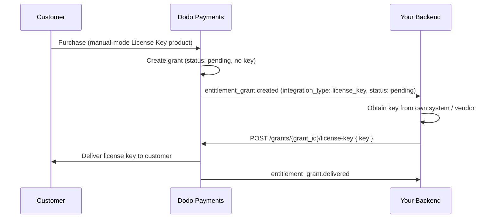

Denna guide går igenom att bygga ett system för **manuell leverans av licensnycklar** från början till slut. Istället för att Dodo Payments auto-genererar en nyckel vid betalning, skapar varje köp ett `pending`-beviljande och väntar på att *du* ska leverera nyckelvärdet från ditt eget system, en tredjepartsleverantör eller en begränsad mängd koder.

När du är klar kommer du att ha:

- En produkt med rättigheter för licensnyckel inställd till `manual` leverans.
- En webhook-lyssnare som detekterar när en kund väntar på en nyckel.
- Ett leveranssamtal som levererar nyckeln och automatiskt meddelar kunden.

<CardGroup cols={2}>
<Card title="License Keys overview" icon="key" href="/features/license-keys">
Den fullständiga livscykeln för licensnyckeln och `fulfillment_mode`-inställningen.
</Card>
<Card title="Fulfill License Key Grant API" icon="code" href="/api-reference/entitlements/fulfill-license-key">
API-referens för slutpunkten du anropar för att leverera en nyckel.
</Card>
</CardGroup>

## Hur det fungerar



Manuell leverans ändrar endast **utgivnings**steget. Aktivering, validering, avaktivering, utgång och återkallande fungerar precis som en auto-genererad nyckel när den väl är levererad.

## Förutsättningar

För att följa denna guide behöver du:

- Ett Dodo Payments handlarkonto.
- Din API-nyckel (`DODO_PAYMENTS_API_KEY`) och hemlig webhook-nyckel från instrumentpanelen. Se [Guiden för API-nyckelgenerering](/api-reference/introduction#api-key-generation).
- En backend-slutpunkt som kan ta emot webhooks.

<Info>
Använd `https://test.dodopayments.com` och testläges-uppgifter under byggandet. Byt till `https://live.dodopayments.com` och live-nycklar när du går till produktion.
</Info>

## Steg 1 — Skapa en rättighet för licensnycklar i manuellt läge

En **rättighet** är en återanvändbar definition av vad du levererar. Skapa en rättighet för licensnyckel och ställ in dess `fulfillment_mode` till `manual`.

<Tabs>
<Tab title="Dashboard">
<Steps>
<Step title="Open Entitlements">
Gå till **Rättigheter** i din instrumentpanel och klicka på **+** för att skapa en ny rättighet.
</Step>
<Step title="Choose License Key">
Välj **Licensnyckel** som integration och ge den ett **Namn**. Formuläret exponerar dessa fält:

- **Leveransläge** — `Automatic` som standard. Detta är inställningen som möjliggör manuell leverans; du ändrar det i nästa steg.
- **Licensens längd** — hur länge varje utfärdad nyckel är giltig, eller **Ingen utgång**.
- **Aktiveringsgräns** — maximalt antal aktiveringar per nyckel, eller **Obegränsat**.
- **Aktiveringsmeddelande** — valfritt kundriktat meddelande som visas när de aktiverar nyckeln.

<Frame>

</Frame>
</Step>
<Step title="Set Fulfillment Mode to Manual">
Öppna dropdown-menyn för **Leveransläge** och ändra från **Automatisk** till **Manuell**. Detta är inställningen som driver hela denna guide — utan den genereras och skickas nycklar automatiskt och inget väntande beviljande skapas. Med **Manuell** valt skapar varje köp ett `pending`-beviljande för dig att fullgöra. Klicka på **Skapa rättighet** för att spara.
</Step>
</Steps>
</Tab>

<Tab title="API">
Skapa rättigheten med `integration_config.fulfillment_mode` inställd till `manual`.
<CodeGroup>

```typescript Node.js theme={null}
import DodoPayments from 'dodopayments';

const client = new DodoPayments({
  bearerToken: process.env.DODO_PAYMENTS_API_KEY,
  environment: 'test_mode', // defaults to 'live_mode'
});

const entitlement = await client.entitlements.create({
  name: 'Pro License (Manual)',
  integration_type: 'license_key',
  integration_config: {
    fulfillment_mode: 'manual',
    activations_limit: 5,
    duration_count: 1,
    duration_interval: 'Year',
  },
});

console.log(entitlement.id); // ent_...
```

```python Python theme={null}
import os
from dodopayments import DodoPayments

client = DodoPayments(
    bearer_token=os.environ.get("DODO_PAYMENTS_API_KEY"),
    environment="test_mode",  # defaults to "live_mode"
)

entitlement = client.entitlements.create(
    name="Pro License (Manual)",
    integration_type="license_key",
    integration_config={
        "fulfillment_mode": "manual",
        "activations_limit": 5,
        "duration_count": 1,
        "duration_interval": "Year",
    },
)

print(entitlement.id)
```

```bash cURL theme={null}
curl -X POST https://test.dodopayments.com/entitlements \
  -H "Authorization: Bearer $DODO_PAYMENTS_API_KEY" \
  -H "Content-Type: application/json" \
  -d '{
    "name": "Pro License (Manual)",
    "integration_type": "license_key",
    "integration_config": {
      "fulfillment_mode": "manual",
      "activations_limit": 5,
      "duration_count": 1,
      "duration_interval": "Year"
    }
  }'
```

</CodeGroup>
</Tab>
</Tabs>

<Note>
`fulfillment_mode` standard är `auto`. Att utelämna det eller lämna en befintlig rättighet oförändrad behåller det automatiska beteendet. Endast rättigheter som explicit är inställda på `manual` skapar väntande beviljanden.
</Note>

## Steg 2 — Fäst rättigheten till en produkt

Öppna produkten du vill sälja, expandera **Avancerade inställningar → Rättigheter & Krediter**, och välj **Licensnyckelrättigheten du satte till Manuell** i Steg 1. En enda produkt kan leverera denna licensnyckel tillsammans med andra rättigheter vid samma köp.

<Frame caption="Selecting the License Key entitlement in the product entitlements panel.">

</Frame>

<Note>
Leveransläge är en egenskap hos **rättigheten**, inte produkten. Eftersom du satte den till **Manuell** i Steg 1 skapar varje produkt denna rättighet är fäst vid `pending` licensnyckel-beviljanden vid köp — det finns inget extra att konfigurera här.
</Note>

<Tip>
Om du inte har en produkt ännu, skapa en först (engångs- eller prenumeration). Se [Guiden för engångsbetalningsintegrationer](/developer-resources/integration-guide) för att sälja produkten via kassan.
</Tip>

## Steg 3 — Detektera väntande beviljanden

När en kund köper produkten skapar Dodo Payments ett beviljande i `pending`-status utan **nyckel bifogad** och skickar en `entitlement_grant.created`-webhook. Detta är din signal att en kund väntar på en nyckel.

### Lyssna efter webhooks

Ställ in en webhook-slutpunkt (Utvecklare → Webhooks i instrumentpanelen) och agera på väntande licensnyckel-beviljanden. Implementationen följer specifikationen [Standard Webhooks](https://standardwebhooks.com/).

```typescript theme={null}
import { Webhook } from 'standardwebhooks';

const webhook = new Webhook(process.env.DODO_WEBHOOK_KEY!);

export async function POST(request: Request) {
  const rawBody = await request.text();
  const headers = {
    'webhook-id': request.headers.get('webhook-id') || '',
    'webhook-signature': request.headers.get('webhook-signature') || '',
    'webhook-timestamp': request.headers.get('webhook-timestamp') || '',
  };

  await webhook.verify(rawBody, headers);
  const event = JSON.parse(rawBody);

  // A customer bought a manual-mode license key and is waiting for it.
  if (
    event.type === 'entitlement_grant.created' &&
    event.data.integration_type === 'license_key' &&
    event.data.status === 'pending'
  ) {
    await queueLicenseKeyFulfillment({
      grantId: event.data.id,
      customerId: event.data.customer_id,
    });
  }

  return new Response('ok');
}
```

Beviljande nyttolasten bär `integration_type: "license_key"`, så att du kan känna igen ett licensnyckel-beviljande utan ett extra uppslag. Se [Referensen för Entitlement Grant-webhook](/developer-resources/webhooks/intents/entitlement-grant) för hela nyttolasten.

### Eller fråga List Grants API

Om du hellre vill undvika webhooks, lista beviljanden för rättigheten och filtrera efter `integration_type` och `status`:

<CodeGroup>

```typescript Node.js theme={null}
const pending = await client.entitlements.grants.list('ent_license_key_id', {
  integration_type: 'license_key',
  status: 'pending',
});

for (const grant of pending.items) {
  console.log(`Grant ${grant.id} for customer ${grant.customer_id} needs a key`);
}
```

```bash cURL theme={null}
curl -G https://test.dodopayments.com/entitlements/ent_license_key_id/grants \
  -H "Authorization: Bearer $DODO_PAYMENTS_API_KEY" \
  --data-urlencode "integration_type=license_key" \
  --data-urlencode "status=pending"
```

</CodeGroup>

## Steg 4 — Leverera nyckeln

Hämta nyckelvärdet från ditt eget system och skicka det med [Fullgör Licensnyckel-beviljande](/api-reference/entitlements/fulfill-license-key) slutpunkten. Detta kräver din hemliga API-nyckel (Redaktörsbehörighet); det är **inte** en av de offentliga licens-slutpunkterna.

<CodeGroup>

```typescript Node.js theme={null}
async function fulfill(grantId: string, key: string) {
  const res = await fetch(
    `https://test.dodopayments.com/grants/${grantId}/license-key`,
    {
      method: 'POST',
      headers: {
        'Content-Type': 'application/json',
        Authorization: `Bearer ${process.env.DODO_PAYMENTS_API_KEY}`,
      },
      body: JSON.stringify({
        key,
        // Optional — fall back to the entitlement config when omitted
        activations_limit: 5,
        expires_at: '2027-05-01T00:00:00Z',
      }),
    },
  );

  if (!res.ok) {
    // See the status code table below for handling
    throw new Error(`Fulfillment failed: ${res.status}`);
  }

  return res.json(); // updated grant, now status: "delivered"
}
```

```bash cURL theme={null}
curl -X POST https://test.dodopayments.com/grants/grant_8VbC6JDZ/license-key \
  -H "Authorization: Bearer $DODO_PAYMENTS_API_KEY" \
  -H "Content-Type: application/json" \
  -d '{
    "key": "PRO-AAAA-BBBB-CCCC-DDDD",
    "activations_limit": 5,
    "expires_at": "2027-05-01T00:00:00Z"
  }'
```

</CodeGroup>

### Begär fält

<ParamField body="key" type="string" required>
Licensnyckelsträngen som ska levereras till kunden. Mellanslag trimmas; ett tomt eller endast mellanslag-värde avvisas.
</ParamField>

<ParamField body="activations_limit" type="integer">
Aktiveringsbegränsning per nyckel. Återgår till rättighetskonfigurationen när den utelämnas.
</ParamField>

<ParamField body="expires_at" type="string">
Förfallodatum per nyckel (ISO 8601). Återgår till rättighetskonfigurationens varaktighet när den utelämnas. För beviljanden utfärdade av prenumerationer förblir giltigheten kopplad till prenumerationen oavsett.
</ParamField>

Vid framgång flyttas beviljandet till `delivered`, kunden skickas automatiskt nyckeln (samma e-post som de skulle ha fått under automatisk leverans), och `entitlement_grant.delivered` utlöses.

Kunden får ett e-postmeddelande med licensnyckeln, produkten, aktiveringsgränsen, utgången och dina aktiveringsinstruktioner:

<Frame caption="The license key email the customer receives once you fulfill the grant.">

</Frame>

<Check>
Du behöver inte skicka nyckeln själv — leverans sker automatiskt när beviljandet fullgörs.
</Check>

## Steg 5 — Hantera fel och omförsökningar

Slutpunkten validerar beviljandet innan något levereras. Hantera dessa svar:

| Status | Betydelse | Vad du ska göra |
|---|---|---|
| `200` | Nyckel levererad, beviljandet är nu `delivered`. | Klart. |
| `400` | Inte ett licensnyckel-beviljande, eller nyckeln är tom/mellanslag. | Korrigera begäran; försök inte igen som det är. |
| `404` | Inget beviljande med det ID för ditt företag. | Verifiera `grant_id`. |
| `409` | Beviljande väntar inte på leverans (redan levererad eller har redan en nyckel), **eller** nyckelvärdet finns redan. | Om redan levererad, behandla som framgång. Om det är en duplikerad nyckel, ange en annan nyckel. |
| `422` | Begär kroppen misslyckades med validering (t.ex. `activations_limit < 1`). | Korrigera fältet och försök igen. |

<Warning>
Leveransen är säker att försöka igen vid tillfälliga fel (tidsgränser, `5xx`). Varje beviljande kan fullgöras endast en gång, så en omförsökning efter ett framgångsrikt-men-okänt anrop returnerar `409` istället för att utfärda en andra nyckel eller skicka en duplikerad e-post. Använd beviljandet `id` som din idempotensnyckel.
</Warning>

## Verifiera flödet

1. Köp produkten i testläge (se [checkout-guiderna](/developer-resources/integration-guide)).
2. Bekräfta att din webhook tog emot `entitlement_grant.created` med `status: "pending"` och `integration_type: "license_key"`, eller att beviljandet dyker upp i List Grants-svaret med dessa filter.
3. Anropa fullgörande slutpunkt med en testnyckel.
4. Bekräfta att svaret visar `status: "delivered"` med ett ifyllt `license_key`, att kunden får nyckel-e-postmeddelandet, och `entitlement_grant.delivered` utlöses.

<Check>
När den väl är levererad kan kunden [aktivera och validera](/features/license-keys#activation-validation-deactivation) nyckeln mot de offentliga licens-slutpunkterna precis som en auto-genererad nyckel.
</Check>

## Relaterad API-referens

<CardGroup cols={2}>
<Card title="Create Entitlement" icon="plus" href="/api-reference/entitlements/create-entitlement">
Skapa licensnyckelrättigheten med `fulfillment_mode: manual`.
</Card>
<Card title="List Grants" icon="users" href="/api-reference/entitlements/list-grants">
Filtrera efter `integration_type` och `status` för att hitta väntande beviljanden.
</Card>
<Card title="Fulfill License Key Grant" icon="code" href="/api-reference/entitlements/fulfill-license-key">
Leverera nyckelvärdet och överför beviljandet till levererat.
</Card>
<Card title="Entitlement Grant Webhooks" icon="webhook" href="/developer-resources/webhooks/intents/entitlement-grant">
`entitlement_grant.*`-händelserna som signalerar väntande och levererade beviljanden.
</Card>
</CardGroup>

<CardGroup cols={2}>
<Card title="Create Entitlement" icon="plus" href="/api-reference/entitlements/create-entitlement">
Create the License Key entitlement with `fulfillment_mode: manual`.
</Card>
<Card title="List Grants" icon="users" href="/api-reference/entitlements/list-grants">
Filter by `integration_type` and `status` to find pending grants.
</Card>
<Card title="Fulfill License Key Grant" icon="code" href="/api-reference/entitlements/fulfill-license-key">
Deliver the key value and transition the grant to delivered.
</Card>
<Card title="Entitlement Grant Webhooks" icon="webhook" href="/developer-resources/webhooks/intents/entitlement-grant">
The `entitlement_grant.*` events that signal pending and delivered grants.
</Card>
</CardGroup>
