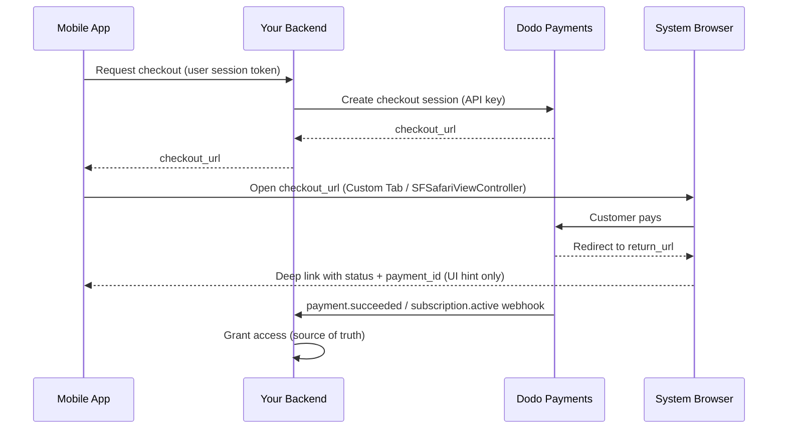

<CardGroup cols={4}>
<Card title="Quick Start" icon="rocket" href="#integration-workflow">
  Få igång din mobila betalningsintegrering i fyra enkla steg
</Card>

<Card title="Platform Examples" icon="code" href="#choose-your-sdk">
  Fullständiga kodexempel för Android, iOS, React Native och Flutter
</Card>

<Card title="Checkout Customization" icon="sliders" href="#checkout-page-customization">
  Konfigurera teman, förifyllning och 14 mobilspecifika parametrar
</Card>

<Card title="Mobile Recipes" icon="flask" href="#mobile-optimized-recipes">
  Konfigurationer för checkout för fem vanliga mobila scenarier – kopiera och klistra in
</Card>
</CardGroup>

<Info>
Dodo Payments tillhandahåller ett officiellt checkout-SDK för **Android, iOS, React Native,
och Flutter**. Var och en kapslar in mönstret som dokumenteras nedan (öppna checkout-
URL:en, fånga returen och tolka resultatet) bakom ett enda typat `start(...)`-anrop,
med återställning av övergivna sessioner inbyggd. Använd endast en manuell WebView om
inget av SDK:erna passar din stack.
</Info>

## Förutsättningar

Innan du integrerar Dodo Payments i din mobilapp ska du se till att du har:

- **Dodo Payments-konto**: Ett aktivt merchant-konto med API-åtkomst
- **API-uppgifter**: API-nyckel och webhook secret key från din dashboard
- **Mobilappsprojekt**: En Android-, iOS-, React Native- eller Flutter-applikation
- **Backend-server**: För säker hantering av skapandet av checkout-sessioner

## Integreringsflöde

Den mobila integreringen följer en säker process i fyra steg där din backend hanterar API-anropen och mobilappen hanterar användarupplevelsen.



<Info>
Deep-linken `status` är endast en **UI-ledtråd** för vad som ska visas för användaren. Ge alltid åtkomst från `payment.succeeded` / `subscription.active`-**webhooken** på din backend – aldrig enbart från mobilresultatet.
</Info>

<Steps>
<Step title="Backend: Create Checkout Session">
<Card title="Checkout Session API Docs" icon="book" href="/developer-resources/checkout-session">
Lär dig skapa en checkout-session i din backend med Node.js, Python och mer. Se fullständiga exempel och parameterreferenser i dokumentationen för <strong>Checkout Sessions API</strong>.
</Card>
<Note>
**Säkerhet**: Checkout-sessioner måste skapas på din backend-server, aldrig i mobilappen. Detta skyddar dina API-nycklar och säkerställer korrekt validering.
</Note>

</Step>

<Step title="Mobile: Get Checkout URL">

Mobilappen anropar din backend för att hämta checkout-URL:en. Autentisera
begäran med den inloggade användarens eget sessionstoken.

<Tabs>
<Tab title="iOS (Swift)">

```swift
func getCheckoutURL(productId: String, customerEmail: String, customerName: String) async throws -> String {
    let url = URL(string: "https://your-backend.com/api/create-checkout-session")!
    var request = URLRequest(url: url)
    request.httpMethod = "POST"
    request.setValue("application/json", forHTTPHeaderField: "Content-Type")
    request.setValue("Bearer \(userSessionToken)", forHTTPHeaderField: "Authorization")
    
    let requestData: [String: Any] = [
        "productId": productId,
        "customerEmail": customerEmail,
        "customerName": customerName
    ]
    request.httpBody = try JSONSerialization.data(withJSONObject: requestData)
    
    let (data, _) = try await URLSession.shared.data(for: request)
    let response = try JSONDecoder().decode(CheckoutResponse.self, from: data)
    return response.checkout_url
}
```

</Tab>
<Tab title="Android (Kotlin)">

```kotlin
suspend fun getCheckoutURL(productId: String, customerEmail: String, customerName: String): String {
    val client = OkHttpClient()
    val requestBody = JSONObject().apply {
        put("productId", productId)
        put("customerEmail", customerEmail)
        put("customerName", customerName)
    }.toString().toRequestBody("application/json".toMediaType())
    
    val request = Request.Builder()
        .url("https://your-backend.com/api/create-checkout-session")
        .header("Authorization", "Bearer $userSessionToken")
        .post(requestBody)
        .build()
    
    val response = client.newCall(request).execute()
    val responseBody = response.body?.string()
    val jsonResponse = JSONObject(responseBody ?: "")
    return jsonResponse.getString("checkout_url")
}
```

</Tab>
<Tab title="React Native (JavaScript)">

```javascript
const getCheckoutURL = async (productId, customerEmail, customerName) => {
  try {
    const response = await fetch('https://your-backend.com/api/create-checkout-session', {
      method: 'POST',
      headers: {
        'Content-Type': 'application/json',
        'Authorization': `Bearer ${userSessionToken}`,
      },
      body: JSON.stringify({
        productId,
        customerEmail,
        customerName
      })
    });
    
    const data = await response.json();
    return data.checkout_url;
  } catch (error) {
    console.error('Failed to get checkout URL:', error);
    throw error;
  }
};
```

</Tab>
<Tab title="Flutter (Dart)">

```dart
import 'dart:convert';
import 'package:http/http.dart' as http;

Future<String> getCheckoutUrl({
  required String productId,
  required String customerEmail,
  required String customerName,
}) async {
  final response = await http.post(
    Uri.parse('https://your-backend.com/api/create-checkout-session'),
    headers: {
      'Content-Type': 'application/json',
      'Authorization': 'Bearer $userSessionToken',
    },
    body: jsonEncode({
      'productId': productId,
      'customerEmail': customerEmail,
      'customerName': customerName,
    }),
  );

  if (response.statusCode != 200) {
    throw Exception('Failed to get checkout URL: ${response.statusCode}');
  }
  return jsonDecode(response.body)['checkout_url'] as String;
}
```

</Tab>
</Tabs>
<Note>
**Säkerhet**: Mobilappar kommunicerar endast med din backend, aldrig direkt med Dodo Payments API.
</Note>
</Step>

<Step title="Mobile: Open Checkout in Browser">
Öppna checkout-URL:en i en säker webbläsare i appen för betalningshantering.
Eller hoppa över hela den manuella konfigurationen med det officiella checkout-SDK:t för
din plattform.

<Card title="Pick your mobile SDK" icon="box" href="#choose-your-sdk">
  Installationssteg och konfigurationsinstruktioner för Android, iOS, React Native och Flutter.
</Card>

</Step>

<Step title="Backend: Handle Payment Completion">
Hantera slutförandet av betalningen via webhooks och redirect-URL:er för att bekräfta betalningsstatus.
</Step>
</Steps>

## Välj ditt SDK

Alla mobila SDK:n exponerar samma kontrakt: ett enda `start(...)`-anrop öppnar Dodos
hostade checkout i plattformens inbyggda webbläsaryta och returnerar en typad
`CheckoutResult` vars `status` är `succeeded`, `failed`, `cancelled`,
`pending` eller `expired`. Inget av dem innehåller en API-nyckel eller anropar Dodo
Payments API, och alla fyra stöder återställning av övergivna sessioner.

<CardGroup cols={2}>
<Card title="Android" icon="android" href="/developer-resources/sdks/android">
  `com.dodopayments.api:checkout-android` öppnar en Chrome Custom Tab. Kräver `minSdk` 23.
</Card>
<Card title="iOS" icon="apple" href="/developer-resources/sdks/ios">
  `dodopayments-mobile-sdk-ios` öppnar `SFSafariViewController`. Kräver iOS 16+.
</Card>
<Card title="React Native" icon="react" href="/developer-resources/sdks/react-native">
  `@dodopayments/react-native-checkout`, en Turbo Module över båda native cores. Kräver React Native 0.76+.
</Card>
<Card title="Flutter" icon="layer-group" href="/developer-resources/sdks/flutter">
  `dodopayments_checkout`, en Pigeon-kanal över båda native cores. Kräver Flutter 3.44+.
</Card>
</CardGroup>

<Warning>
`status` som returneras är en UI-ledtråd, inte ett bevis på betalning. Bekräfta varje
betalning från din backend via `payment.succeeded` / `subscription.active`-
webhooken, eller genom att hämta betalningen med din secret key.
</Warning>

### Registrera ett callback-URL-schema

Alla fyra SDK:n lämnar tillbaka kontrollen till appen via ett anpassat URL-schema som
du väljer, till exempel `myapp://checkout/return`. Registrera det en gång per
plattform:

<Tabs>
<Tab title="Android">

```kotlin android/app/build.gradle
android {
    defaultConfig {
        manifestPlaceholders["dodoCallbackScheme"] = "myapp"
    }
}
```

SDK:ts eget manifest deklarerar redan redirect-aktiviteten, så du behöver inte lägga till någon
manifest-XML.
</Tab>
<Tab title="iOS">

```xml Info.plist
<key>CFBundleURLTypes</key>
<array>
  <dict>
    <key>CFBundleURLName</key>
    <string>myapp</string>
    <key>CFBundleURLSchemes</key>
    <array>
      <string>myapp</string>
    </array>
  </dict>
</array>
```

På iOS måste du även vidarebefordra inkommande URL:er till SDK:t, eftersom
`SFSafariViewController` inte kan fånga sin egen retur-URL. Se sidan för
[iOS](/developer-resources/sdks/ios) eller
[React Native](/developer-resources/sdks/react-native) för den exakta
hanteraren.
</Tab>
<Tab title="Expo">
`@dodopayments/react-native-checkout` levereras med ett config-plugin som registrerar
schemat för båda plattformarna på `prebuild`. Skicka med ett `scheme`-alternativ:

```json app.json
{
  "expo": {
    "scheme": "myapp",
    "plugins": [
      [
        "@dodopayments/react-native-checkout",
        { "scheme": "myappcheckout" }
      ]
    ]
  }
}
```

`scheme` måste matcha `returnUrl` och skilja sig från `expo.scheme`, som Expo
redan registrerar på `MainActivity`. Mer information finns på sidan för
[React Native SDK](/developer-resources/sdks/react-native).

Om `android/app/build.gradle` hanteras manuellt utan ett standardiserat
`defaultConfig { }`-block ställer du in platshållaren manuellt i stället (se
Android-fliken).

Fungerar endast med development builds, inte Expo Go. Kör
`npx expo prebuild --clean` efter att du har redigerat INLINE_CODE_PLACEHOLDER_85b7553c260c0f8_END.
</Tab>
</Tabs>

<Note>
Föredrar du att bygga det själv? Öppna `checkout_url` i plattformens system-
webbläsare (Android Custom Tabs / iOS `SFSafariViewController`) och fånga
navigeringen till din `return_url`. Läs sedan `status` och `payment_id` som query-
parametrar. SDK:erna ovan gör exakt detta åt dig.
</Note>

<Warning>
**Öppna inte checkout i en inbäddad WebView (`WKWebView` / Android
`WebView`).** Detta är det vanligaste problemet vid mobil integrering: en
inbäddad WebView **inaktiverar Apple Pay och Google Pay** och kan även bryta
3-D Secure-utmaningar och automatisk ifyllning av sparade kort – kunderna får då färre
betalningsalternativ och fler misslyckanden. Använd alltid SDK:t eller öppna `checkout_url` i
systemwebbläsaren (Custom Tabs / `SFSafariViewController`). Den inbyggda webbläsarytan
är exakt anledningen till att Apple Pay och Google Pay fortsätter att fungera.
</Warning>

## Anpassa utseendet

Alla SDK:n accepterar en valfri `customization`-parameter på `start(...)` /
`CheckoutParams` som styr den inbyggda webbläsarytans utseende och
beteende – verktygsfält, knappar och presentation. Detta är separat från
checkout-sidans eget tema, som konfigureras server-side via
[`customization.theme_config`](/developer-resources/checkout-session) i
checkout-sessionen.

Alternativen är grupperade per plattform eftersom Androids Custom Tab och iOS:s
`SFSafariViewController` exponerar olika inbyggda kontroller. Alla fält är
valfria; om `customization` utelämnas helt används plattformens standardutseende.

<AccordionGroup>
<Accordion title="Android - Custom Tab">

<ParamField body="toolbarColor" type="Color">
Bakgrundsfärg för verktygsfältet.
</ParamField>

<ParamField body="navigationBarColor" type="Color">
Färg på navigeringsfältet.
</ParamField>

<ParamField body="navigationBarDividerColor" type="Color">
Avdelarfärg ovanför navigeringsfältet.
</ParamField>

<ParamField body="closeButtonStyle" type="'default' | 'back'">
`default` visar systemets "X"-ikon; `back` ritar i stället en bakåtpil.
</ParamField>

<ParamField body="closeButtonPosition" type="'start' | 'end'">
Vilken sida av verktygsfältet stängningsknappen visas på.
</ParamField>

<ParamField body="shareButtonEnabled" type="boolean">
Visar verktygsfältets delningsikon.
</ParamField>

<ParamField body="showTitleEnabled" type="boolean">
Visar sidans titel under URL:en i verktygsfältet.
</ParamField>

<ParamField body="urlBarHidingEnabled" type="boolean">
Låter verktygsfältet döljas automatiskt när sidan rullas.
</ParamField>

<ParamField body="bookmarksButtonEnabled" type="boolean">
Visar "Bokmärk den här sidan" i överflödesmenyn.
</ParamField>

<ParamField body="downloadsButtonEnabled" type="boolean">
Visar "Ladda ned sidan" i överflödesmenyn.
</ParamField>

<ParamField body="colorScheme" type="'system' | 'light' | 'dark'">
Tvingar fram ljust eller mörkt utseende oavsett enhetens systeminställning.
</ParamField>

</Accordion>

<Accordion title="iOS - SFSafariViewController">

<ParamField body="dismissButtonStyle" type="'done' | 'close' | 'cancel'">
Etikett eller ikon för avvisningsknappen.
</ParamField>

<ParamField body="presentationStyle" type="'pageSheet' | 'fullScreen'">
`pageSheet` visas som ett kort som kan svepas bort; `fullScreen` täcker hela skärmen.
</ParamField>

<ParamField body="barCollapsingEnabled" type="boolean">
Låter verktygsfältet fällas ihop vid rullning. Visas endast när `presentationStyle` är `fullScreen` – `pageSheet` håller fälten fast oavsett denna inställning.
</ParamField>

<ParamField body="colorScheme" type="'system' | 'light' | 'dark'">
Tvingar fram ljust eller mörkt utseende oavsett enhetens systeminställning.
</ParamField>

</Accordion>
</AccordionGroup>

<Tabs>
<Tab title="React Native">

```typescript
const result = await DodoCheckout.start({
  checkoutUrl,
  returnUrl: 'myapp://checkout/return',
  customization: {
    android: { toolbarColor: '#6366F1', closeButtonStyle: 'back' },
    ios: { presentationStyle: 'fullScreen', colorScheme: 'dark' },
  },
});
```

</Tab>
<Tab title="Flutter">

```dart
final result = await DodoCheckout.instance.start(
  CheckoutParams(
    checkoutUrl: Uri.parse(checkoutUrl),
    returnUrl: Uri.parse('myapp://checkout/return'),
    customization: BrowserCustomization(
      android: AndroidBrowserOptions(
        toolbarColor: Color(0xFF6366F1),
        closeButtonStyle: CloseButtonStyle.back,
      ),
      ios: IosBrowserOptions(
        presentationStyle: PresentationStyle.fullScreen,
        colorScheme: BrowserColorScheme.dark,
      ),
    ),
  ),
);
```

</Tab>
<Tab title="Android (Kotlin)">

```kotlin
val result = DodoCheckout.start(
    activity,
    CheckoutParams(
        checkoutUrl = checkoutUrl,
        returnUrl = "myapp://checkout/return",
        customization = BrowserCustomization(
            toolbarColor = Color.parseColor("#6366F1"),
            closeButtonStyle = BrowserCustomization.CloseButtonStyle.BACK,
        )
    )
) { event -> }
```

</Tab>
<Tab title="iOS (Swift)">

```swift
let result = try await DodoCheckout.start(
    checkoutUrl: checkoutUrl,
    returnUrl: URL(string: "myapp://checkout/return")!,
    customization: BrowserCustomization(
        presentationStyle: .fullScreen,
        colorScheme: .dark
    )
)
```

</Tab>
</Tabs>

## Anpassa checkout-sidan

Avsnittet [Anpassa utseendet](#appearance-customization) ovan styr den inbyggda webbläsarytan – verktygsfält, knappar och färgschema. Själva checkout-*sidan* – vilka fält som visas, temat och vilka betalningsmetoder som visas – konfigureras server-side när du skapar checkout-sessionen. Dessa parametrar har störst inverkan på mobil konvertering.

Parametrarna nedan finns på tre olika platser i begäran om checkout-sessionen – kolumnen **Var den ska placeras** visar vilket objekt varje parameter hör till. Det vanligaste misstaget är att placera en parameter i fel objekt; då ignoreras den utan meddelande.

| Parameter | Var den ska placeras | Mobil fördel | Standard | Ange när… |
|-----------|----------------------|--------------|---------|-----------|
| `show_order_details` | `customization` | Fäller ihop ordersammanfattningen så att betalningsmetoderna visas högst upp på skärmen | `true` | Ange alltid `false` på mobil – att flytta upp betalningsmetoderna minskar avhopp betydligt |
| `minimal_address` | top-level | Kräver endast postnummer och döljer gatu-, stads- och delstatsfält | `false` | Nästan alltid på mobil – varje extra fält minskar konverteringen |
| `theme` | `customization` | Styr ljust eller mörkt utseende på checkout-sidan | Business-standard | Använd `"system"` för att följa enhetens OS-inställning |
| `theme_config` | `customization` | Fullständig varumärkespalett – färger, typsnitt, kantradie och etikett på betalningsknappen | Ingen | När checkout ska kännas som en del av appen |
| `force_language` | `customization` | Åsidosätter webbläsarens lokaliseringsdetektering | Automatisk detektering | Ange den från appens lokal i stället för att förlita dig på webbläsaren |
| `show_on_demand_tag` | `customization` | Visar eller döljer etiketten "on-demand" på checkout-sidan | `true` | Ange `false` när du använder on-demand-fakturering enbart för korttokenisering |
| `show_saved_payment_methods` | top-level | Visar en återkommande kunds sparade kort för betalning med ett tryck | `false` | Aktivera för inloggade användare som har betalat tidigare |
| `allow_discount_code` | `feature_flags` | Visar fältet för kampanjkod | `true` | Ange `false` för att korta formuläret; användare som lämnar sidan för att hitta en kod återkommer sällan |
| `allow_currency_selection` | `feature_flags` | Låter kunden byta faktureringsvaluta | `true` | Ange `false` när du låser valutan med `billing_currency` |
| `redirect_immediately` | `feature_flags` | Hoppar över bekräftelsesidan och går direkt till `return_url` | `false` | Aktivera för ett sömlöst återlämnande till appen |
| `confirm` | top-level | Slutför betalningen utan ett extra bekräftelsesteg | `false` | Använd tillsammans med `payment_method_id` för checkout med ett klick |
| `short_link` | top-level | Returnerar en kortare checkout-URL | `false` | Användbart när URL:en måste rymmas i en pushnotis eller ett SMS |
| `payment_method_id` | top-level | Förväljer en sparad betalningsmetod | - | Skicka tillsammans med `confirm: true` för checkout med ett klick |
| `allowed_payment_method_types` | top-level | Vitlistar betalningsmetoderna som visas | Alla aktiverade | Begränsa till metoder som fungerar för din produkttyp |

<Warning>
**Skicka alltid `billing_currency` och `billing_address.country` tillsammans.** Om någon av dem utelämnas kan Adaptive Currency i tysthet ändra faktureringsvalutan baserat på kundens IP-adress. En merchant såg en prenumeration i USD byta till EUR när kunden reste till Europa – eftersom faktureringslandet inte hade angetts uttryckligen.
</Warning>

<Tip>
**Den största enskilda konverteringsökningen på mobil:** ange `show_order_details: false` och `minimal_address: true`. Att flytta upp betalningsmetoderna och minska antalet formulärfält är de två förändringar som ger störst effekt.
</Tip>

<Frame caption="show_order_details: false moves the contact and payment fields above the fold, instead of behind the order summary.">
  
</Frame>

Ange `minimal_address: true` för att endast samla in ett postnummer i stället för fullständiga gatu-, stads- och delstatsfält:

<Frame caption="minimal_address: true reduces the billing address to a single postcode field.">
  
</Frame>

Ange `theme: "system"` så att checkout följer enhetens inställning för ljust eller mörkt läge:

<Frame caption="With theme: system, the checkout follows the device's light or dark appearance automatically.">
  
</Frame>

<Info>
**Tillgängligheten för betalningsmetoder varierar beroende på produkttyp.** Apple Pay och Cash App stöds för återkommande prenumerationer med ett belopp som inte är noll. För engångsbetalningar är alla aktiverade metoder tillgängliga.
</Info>

<Card title="Full checkout session parameter reference" icon="book" href="/developer-resources/checkout-session">
  Se alla tillgängliga parametrar, typer och standardvärden i guiden för Checkout Sessions.
</Card>

## Mobiloptimerade recept

Varje recept nedan är en komplett request body för en checkout-session. Kopiera det som matchar ditt scenario, byt ut mot ditt produkt-ID och skicka det till din backends endpoint för att skapa sessioner.

<AccordionGroup>
<Accordion title="Minimal Mobile Checkout - fastest path to payment">

Använd detta när du vill ha ett så kort formulär som möjligt: betalningsmetoderna högst upp, endast postnummer krävs för adressen, inget rabattfält och temat matchar enheten.

<Tabs>
<Tab title="Node.js SDK">

```javascript expandable
import DodoPayments from 'dodopayments';

const client = new DodoPayments({
  bearerToken: process.env.DODO_PAYMENTS_API_KEY,
  environment: 'test_mode',
});

const session = await client.checkoutSessions.create({
  product_cart: [{ product_id: 'pdt_your_product_id', quantity: 1 }],
  customer: { email: 'user@example.com', name: 'Jane Smith' },
  billing_address: { country: 'US' },
  return_url: 'myapp://checkout/success',
  cancel_url: 'myapp://checkout/cancelled',
  billing_currency: 'USD',
  minimal_address: true,
  customization: {
    show_order_details: false,
    theme: 'system',
  },
  feature_flags: {
    allow_discount_code: false,
    allow_currency_selection: false,
  },
});

console.log(session.checkout_url);
```

</Tab>
<Tab title="Python SDK">

```python expandable
import os
import dodopayments

client = dodopayments.DodoPayments(
    bearer_token=os.environ.get("DODO_PAYMENTS_API_KEY"),
    environment="test_mode",
)

session = client.checkout_sessions.create(
    product_cart=[{"product_id": "pdt_your_product_id", "quantity": 1}],
    customer={"email": "user@example.com", "name": "Jane Smith"},
    billing_address={"country": "US"},
    return_url="myapp://checkout/success",
    cancel_url="myapp://checkout/cancelled",
    billing_currency="USD",
    minimal_address=True,
    customization={
        "show_order_details": False,
        "theme": "system",
    },
    feature_flags={
        "allow_discount_code": False,
        "allow_currency_selection": False,
    },
)

print(session.checkout_url)
```

</Tab>
</Tabs>

<Note>
Se [Checkout Sessions](/developer-resources/checkout-session) för alla tillgängliga parametrar och deras standardvärden.
</Note>
</Accordion>

<Accordion title="Branded Mobile Checkout - custom colors, fonts, and button label">

Använd detta när checkout-sidan ska kännas som en del av appen. Ange dina varumärkesfärger, ett anpassat typsnitt och en lokaliserad etikett på betalningsknappen.

<Frame>
  
</Frame>

<Tabs>
<Tab title="Node.js SDK">

```javascript expandable
const session = await client.checkoutSessions.create({
  product_cart: [{ product_id: 'pdt_your_product_id', quantity: 1 }],
  customer: { email: 'user@example.com', name: 'Jane Smith' },
  billing_address: { country: 'US' },
  billing_currency: 'USD',
  return_url: 'myapp://checkout/success',
  minimal_address: true,
  customization: {
    show_order_details: false,
    theme: 'dark',
    theme_config: {
      dark: {
        button_primary: '#7C3AED',
        button_primary_hover: '#6D28D9',
        button_text_primary: '#FFFFFF',
        bg_primary: '#1A1A2E',
        bg_secondary: '#16213E',
        text_primary: '#E2E8F0',
      },
      pay_button_text: 'Complete Purchase',
      radius: '8px',
    },
  },
});
```

</Tab>
<Tab title="Python SDK">

```python expandable
session = client.checkout_sessions.create(
    product_cart=[{"product_id": "pdt_your_product_id", "quantity": 1}],
    customer={"email": "user@example.com", "name": "Jane Smith"},
    billing_address={"country": "US"},
    billing_currency="USD",
    return_url="myapp://checkout/success",
    minimal_address=True,
    customization={
        "show_order_details": False,
        "theme": "dark",
        "theme_config": {
            "dark": {
                "button_primary": "#7C3AED",
                "button_primary_hover": "#6D28D9",
                "button_text_primary": "#FFFFFF",
                "bg_primary": "#1A1A2E",
                "bg_secondary": "#16213E",
                "text_primary": "#E2E8F0",
            },
            "pay_button_text": "Complete Purchase",
            "radius": "8px",
        },
    },
)
```

</Tab>
</Tabs>

<Note>
`theme_config` accepterar separata `dark`- och `light`-objekt så att paletten anpassas efter enhetens aktuella utseende. Se [Checkout Sessions](/developer-resources/checkout-session) för en fullständig referens över färgnycklar.
</Note>
</Accordion>

<Accordion title="One-Click Returning Customer - saved card, instant confirmation">

Använd detta för inloggade användare som har betalat tidigare. Kombinera ett kund-ID, kundens sparade betalningsmetod och `confirm: true` för att hoppa över checkout-formuläret helt.

<Tabs>
<Tab title="Node.js SDK">

```javascript expandable
const session = await client.checkoutSessions.create({
  product_cart: [{ product_id: 'pdt_your_product_id', quantity: 1 }],
  customer: { customer_id: 'cus_returning_customer_id' },
  billing_address: { country: 'US' },
  billing_currency: 'USD',
  return_url: 'myapp://checkout/success',
  payment_method_id: 'pm_saved_payment_method_id',
  confirm: true,
  show_saved_payment_methods: true,           // top-level parameter
  feature_flags: { redirect_immediately: true },
});
```

</Tab>
<Tab title="Python SDK">

```python expandable
session = client.checkout_sessions.create(
    product_cart=[{"product_id": "pdt_your_product_id", "quantity": 1}],
    customer={"customer_id": "cus_returning_customer_id"},
    billing_address={"country": "US"},
    billing_currency="USD",
    return_url="myapp://checkout/success",
    payment_method_id="pm_saved_payment_method_id",
    confirm=True,
    show_saved_payment_methods=True,           # top-level parameter
    feature_flags={"redirect_immediately": True},
)
```

</Tab>
</Tabs>

<Note>
`status` i deep-link-returen är endast en UI-ledtråd. Bekräfta åtkomst genom att lyssna efter `payment.succeeded`-webhooken på din backend.
</Note>
</Accordion>

<Accordion title="Subscription with Free Trial - trial before first charge">

Använd detta för prenumerationsprodukter som erbjuder en kostnadsfri provperiod före den första faktureringscykeln.

<Tabs>
<Tab title="Node.js SDK">

```javascript expandable
const session = await client.checkoutSessions.create({
  product_cart: [{ product_id: 'pdt_your_subscription_product_id', quantity: 1 }],
  customer: { email: 'user@example.com', name: 'Jane Smith' },
  billing_address: { country: 'US' },
  billing_currency: 'USD',
  return_url: 'myapp://subscription/activated',
  cancel_url: 'myapp://subscription/cancelled',
  minimal_address: true,
  customization: {
    show_order_details: false,
    theme: 'system',
  },
  subscription_data: { trial_period_days: 14 },
});
```

</Tab>
<Tab title="Python SDK">

```python expandable
session = client.checkout_sessions.create(
    product_cart=[{"product_id": "pdt_your_subscription_product_id", "quantity": 1}],
    customer={"email": "user@example.com", "name": "Jane Smith"},
    billing_address={"country": "US"},
    billing_currency="USD",
    return_url="myapp://subscription/activated",
    cancel_url="myapp://subscription/cancelled",
    minimal_address=True,
    customization={"show_order_details": False, "theme": "system"},
    subscription_data={"trial_period_days": 14},
)
```

</Tab>
</Tabs>

<Note>
Ge åtkomst till funktionen när din backend tar emot `subscription.active`-webhooken – inte när mobil-SDK:t returnerar. Se [Subscription Integration Guide](/developer-resources/subscription-integration-guide) för det fullständiga webhook-flödet.
</Note>
</Accordion>

<Accordion title="On-Demand Mandate - save a card for future variable charges">

Använd detta för att tokenisera en kunds kort för senare debiteringar (påfyllning av wallet, pay-as-you-go och BNPL) utan att visa etiketten "subscription". Kunden auktoriserar sin betalningsmetod en gång; därefter debiterar du varierande belopp vid behov.

<Info>
Detta mönster används av appar som debiterar baserat på användning – till exempel en astrologiapp som debiterar per session från ett förauktoriserat kort i stället för enligt ett fast schema.
</Info>

<Tabs>
<Tab title="Node.js SDK">

```javascript expandable
// Step 1: Authorize the mandate (no charge yet)
const session = await client.checkoutSessions.create({
  product_cart: [{ product_id: 'pdt_your_subscription_product_id', quantity: 1 }],
  customer: { email: 'user@example.com', name: 'Jane Smith' },
  billing_address: { country: 'US' },
  billing_currency: 'USD',
  return_url: 'myapp://mandate/authorized',
  cancel_url: 'myapp://mandate/cancelled',
  minimal_address: true,
  customization: {
    show_order_details: false,
    show_on_demand_tag: false, // hides the "on-demand" / "subscription" label
    theme: 'system',
  },
  subscription_data: {
    on_demand: { mandate_only: true },
  },
});

// Step 2: Later, charge any amount using the subscription ID
// (received via the subscription.active webhook after mandate authorization)
// await client.subscriptions.charge(subscriptionId, {
//   product_price: 2000,         // $20.00 in cents
//   product_currency: 'USD',
//   product_description: 'Session credits',
// });
```

</Tab>
<Tab title="Python SDK">

```python expandable
# Step 1: Authorize the mandate (no charge yet)
session = client.checkout_sessions.create(
    product_cart=[{"product_id": "pdt_your_subscription_product_id", "quantity": 1}],
    customer={"email": "user@example.com", "name": "Jane Smith"},
    billing_address={"country": "US"},
    billing_currency="USD",
    return_url="myapp://mandate/authorized",
    cancel_url="myapp://mandate/cancelled",
    minimal_address=True,
    customization={
        "show_order_details": False,
        "show_on_demand_tag": False,  # hides the "on-demand" / "subscription" label
        "theme": "system",
    },
    subscription_data={"on_demand": {"mandate_only": True}},
)

# Step 2: Later, charge any amount using the subscription ID
# client.subscriptions.charge(subscription_id, {
#     "product_price": 2000,  # $20.00 in cents
#     "product_currency": "USD",
#     "product_description": "Session credits",
# })
```

</Tab>
</Tabs>

<Warning>
On-demand-debiteringar kräver minst 1 USD (100 cent). Belopp under 1 USD avvisas med `"value out of range"`. För en auktorisering med beloppet noll använder du `mandate_only: true` enligt exemplet ovan och debiterar sedan minst 1 USD i efterföljande anrop.
</Warning>

<Note>
Se [On-Demand Subscriptions](/developer-resources/ondemand-subscriptions) för det fullständiga debiteringsflödet, webhook-händelser och retry-policyer.
</Note>
</Accordion>
</AccordionGroup>

## Prenumerationsflöden från mobil

Prenumerationer skapas genom samma checkout-sessionflöde som används för engångsbetalningar – mobil-SDK:t öppnar den hostade checkouten, kunden prenumererar och appen hanterar deep-link-returen. Prenumerationens livscykel hanteras därefter helt på backend.

### Vanliga återkommande prenumerationer

För fakturering med fasta intervall (månadsvis eller årsvis) skapar du en checkout-session med en prenumerationsprodukt och en deep-link `return_url`. Din backend tar emot `subscription.active` när prenumerationen har bekräftats.

<Info>
**Apple Pay** och **Cash App** stöds för återkommande prenumerationer med ett belopp som inte är noll.
</Info>

Det fullständiga webhook-flödet på backend finns i [Subscription Integration Guide](/developer-resources/subscription-integration-guide).

---

### On-demand-prenumerationer

On-demand-prenumerationer låter dig auktorisera en kunds betalningsmetod en gång och debitera varierande belopp senare – perfekt för påfyllning av wallet, pay-as-you-go och alla situationer där debiteringsbeloppet inte är känt i förväg. Se receptet **On-Demand Mandate** ovan för hela request body.

Viktiga mobila överväganden:

- Ange `show_on_demand_tag: false` så att checkout-sidan inte visar formuleringar om "subscription" eller "on-demand". Vid användningsfall för korttokenisering förväntar sig kunderna inte prenumerationsterminologi.
- När mandatet har auktoriserats tar din backend emot `subscription.active`. Spara `subscription_id` – du kommer att använda det för alla framtida debiteringar.

<Warning>
Minsta debitering är 1 USD (100 cent). On-demand-debiteringar under 1 USD avvisas med `"value out of range"`. Debitera antingen minst 1 USD eller använd `mandate_only: true` för att auktorisera utan debitering och ta ut det första riktiga beloppet senare.
</Warning>

<Warning>
**Undvik upprepade snabba försök.** Om en tidigare debitering fortfarande behandlas misslyckas en ny debitering på samma prenumeration med `"Cannot create new charge as previous payment is not successful yet"`. Detta är särskilt vanligt med indiska betalningsmetoder (UPI och indiska betal- och kreditkort), där RBI:s mandatregler kan hålla en transaktion i behandlingsläge i upp till 48 timmar. Lägg till en cooldown-kontroll i debiteringslogiken innan du försöker igen.
</Warning>

Se [On-Demand Subscriptions](/developer-resources/ondemand-subscriptions) för den fullständiga debiterings-endpointen, webhook-händelser och retry-policyer.

---

### Prenumeration med kostnadsfri provperiod

Skicka `subscription_data.trial_period_days` i checkout-sessionen för att erbjuda en provperiod före den första faktureringscykeln. Kunden auktoriserar sin betalningsmetod när provperioden startar; den första debiteringen sker automatiskt när provperioden löper ut. Se receptet **Subscription with Free Trial** ovan för hela request body.

---

### Uppgraderingar och nedgraderingar

Planändringar görs via API på din backend, inte genom en ny checkout-session. Dodo Payments beräknar pro rata automatiskt. Om du vill ge kunderna ett självbetjäningsalternativ kan du bädda in eller länka till [Customer Portal](/features/customer-portal).

<CardGroup cols={2}>
<Card title="Subscription Integration Guide" icon="repeat" href="/developer-resources/subscription-integration-guide">
  Full backend setup: webhook flow, access provisioning, cancellation
</Card>
<Card title="On-Demand Subscriptions" icon="bolt" href="/developer-resources/ondemand-subscriptions">
  Mandate authorization, variable charges, and retry policies
</Card>
<Card title="Upgrade / Downgrade" icon="arrows-up-down" href="/developer-resources/subscription-upgrade-downgrade">
  Proration strategies, plan changes, and seat adjustments
</Card>
<Card title="Customer Portal" icon="user" href="/features/customer-portal">
  Self-service subscription management for your customers
</Card>
</CardGroup>

## Minska avhopp i checkout

Mobila checkout-flöden har fler avhopp än webben – mindre skärmar, fler distraktioner och längre formulär bidrar alla. De snabbaste förbättringarna kommer från själva konfigurationen av checkout-sessionen.

### Optimera formuläret

| Inställning | Rekommenderat värde | Effekt |
|---------|------------------|--------|
| `show_order_details` | `false` | Fäller ihop ordersammanfattningen; betalningsmetoderna visas högst upp |
| `minimal_address` | `true` | Endast postnummer krävs; gatuadress, stad och delstat tas bort |
| `show_saved_payment_methods` | `true` | Betalning med ett tryck för återkommande kunder |
| `allow_discount_code` | `false` | Tar bort kampanjkodsfältet |
| `theme` | `"system"` | Följer enhetens preferens för ljust eller mörkt läge |
| `force_language` | Appens lokal | Förhindrar att checkout använder webbläsarens språk som standard |

### Förifyll kunduppgifter

Varje fält som kunden slipper skriva in är en anledning mindre att avbryta:

- **Nya kunder** – ange `customer.email` och `customer.name` från din auth-session.
- **Återkommande kunder** – ange `customer.customer_id` för att automatiskt förifylla alla sparade uppgifter.
- **Valuta** – skicka alltid `billing_currency` och `billing_address.country` tillsammans.

### Återställningsverktyg

<CardGroup cols={2}>
<Card title="Abandoned Cart Recovery" icon="cart-shopping" href="/features/recovery/abandoned-cart-recovery">
  Automated email sequences for incomplete checkouts
</Card>
<Card title="Payment Retries" icon="rotate" href="/features/recovery/payment-retries">
  Smart retry logic for failed subscription renewals
</Card>
<Card title="Subscription Dunning" icon="envelope" href="/features/recovery/subscription-dunning">
  Re-engagement emails for lapsed subscriptions
</Card>
<Card title="Recovery Overview" icon="chart-line" href="/features/recovery/overview">
  All recovery tools and their combined revenue impact
</Card>
</CardGroup>

<Tip>
**Testa e-postmeddelanden om övergivna kundvagnar innan du aktiverar dem.** Skapa en checkout-session i live mode och ange ogiltiga kortuppgifter. Den misslyckade betalningen utlöser återställningsflödet via e-post, så att du kan förhandsgranska exakt vad dina kunder får.
</Tip>

## Bästa praxis

- **Säkerhet**: Skicka aldrig en API-nyckel i appen. Skapa checkout-sessioner på din backend och skicka endast den resulterande `checkout_url` till klienten.
- **Auktoritet**: Behandla `CheckoutResult.status` som en UI-ledtråd. Ge åtkomst först när din backend har bekräftat betalningen.
- **Användarupplevelse**: Visa ett laddningstillstånd medan din backend skapar sessionen och hantera `cancelled` som ett normalt resultat, inte som ett fel.
- **Testning**: Använd test mode och testkort, och verifiera rundresan via return-URL på både en riktig enhet och en simulator.
- **Konvertering**: Ange `show_order_details: false` och `minimal_address: true` för bästa slutförandegrad i mobil checkout. Att flytta upp betalningsmetoderna och minska antalet formulärfält är de två förändringar som ger störst effekt.
- **Valuta**: Skicka alltid både `billing_currency` och `billing_address.country` uttryckligen – om någon saknas kan Adaptive Currency ändra faktureringsvalutan baserat på kundens IP-adress.
- **On-demand-fakturering**: Ange `show_on_demand_tag: false` när du använder on-demand-prenumerationer för korttokenisering. Kunder som använder ett flöde för påfyllning av wallet förväntar sig inte att se formuleringar om "subscription".
- **Återställning**: Aktivera återställning av övergivna kundvagnar i din Dodo Payments-dashboard för att automatiskt återengagera kunder som inte slutför checkout.

## Felsökning

### Vanliga problem

- **Callback kommer aldrig fram**: Schemat i `returnUrl` måste matcha det du registrerade. På Android är det manifestets `dodoCallbackScheme`-platshållare; på iOS och React Native är det `Info.plist` URL type.
- **Checkout återgår till webbläsaren i stället för appen (iOS)**: Du har inte vidarebefordrat den inkommande URL:en. Anropa `DodoCheckout.handleOpenURL(url)` från `.onOpenURL`, `scene(_:openURLContexts:)` eller en React Native `Linking`-lyssnare.
- **`PLATFORM_ERROR` på Android**: Oftast beror det på att schemat inte matchar. Det kan även inträffa om din `MainActivity` anger `android:taskAffinity=""` (standardvärdet `flutter create`), vilket gör att vissa OEM-versioner tappar den pågående checkouten.
- **`ALREADY_IN_PROGRESS`**: En checkout är fortfarande öppen. Vänta på eller stäng den föregående innan du startar en ny.
- **Bygget misslyckas med en olöst platshållare**: Du lade till Android SDK men ställde aldrig in `manifestPlaceholders["dodoCallbackScheme"]`.
- **Betalningen lyckades men åtkomst beviljades inte**: Förväntat om du baserar dig på mobilresultatet. Ge i stället åtkomst från `payment.succeeded` / `subscription.active`-webhooken.
- **Apple Pay / Google Pay visas inte på mobil**: Checkout laddas i en inbäddad WebView (`WKWebView` / Android `WebView`), vilket döljer wallets och kan bryta 3-D Secure. Öppna den i stället med SDK:t eller i systemwebbläsaren (Custom Tabs / `SFSafariViewController`).

## Ytterligare resurser
- [Guide för betalningsintegrering](/developer-resources/integration-guide)
- [Webhook-dokumentation](/developer-resources/webhooks/intents/webhook-events-guide)
- [Testprocess](/miscellaneous/testing-process)
- [Tekniska vanliga frågor](/miscellaneous/faq)
- [Anpassning av checkout-session](/developer-resources/checkout-session)
- [On-Demand Subscriptions](/developer-resources/ondemand-subscriptions)
- [Uppgradering/nedgradering av prenumeration](/developer-resources/subscription-upgrade-downgrade)
- [Återställning av övergiven kundvagn](/features/recovery/abandoned-cart-recovery)
- [Customer Portal](/features/customer-portal)

<Check>
Om du har frågor eller behöver support kan du kontakta <a href="mailto:support@dodopayments.com">support@dodopayments.com</a>.
</Check>