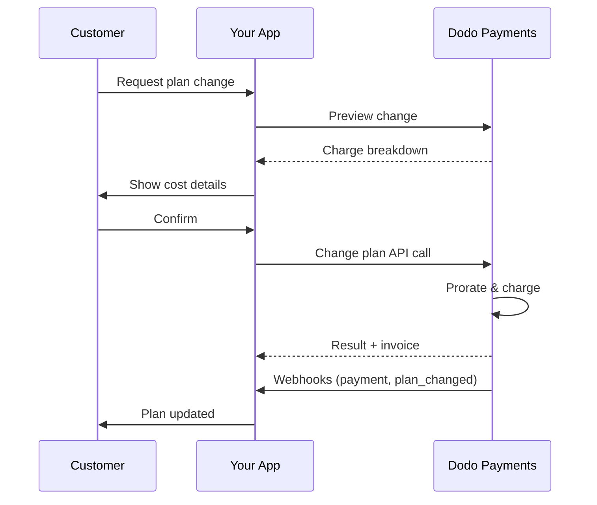
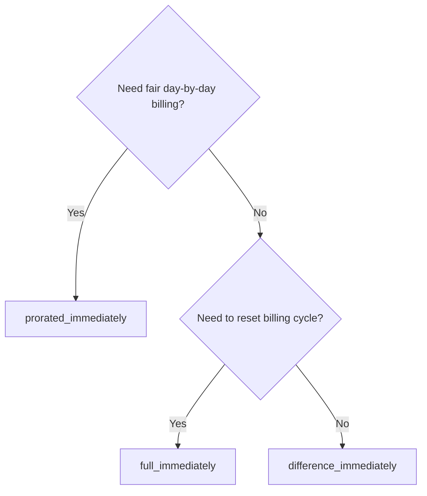
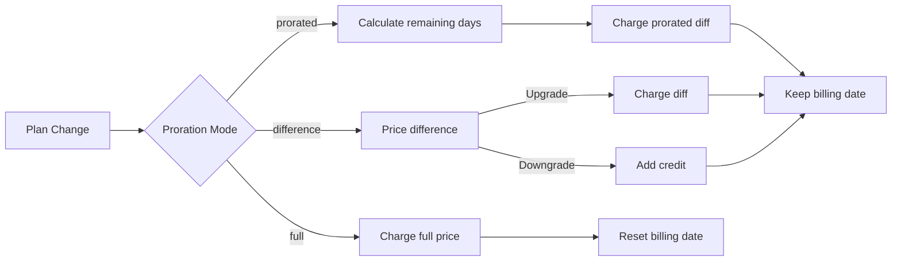

<CardGroup cols={3}>
<Card title="Change Plan API" icon="code" href="/api-reference/subscriptions/change-plan">
  Full API docs for updating subscriptions.
</Card>
<Card title="Plan Change Preview" icon="eye" href="/api-reference/subscriptions/preview-change-plan">
  See charge amounts before changing plans.
</Card>
<Card title="Integration Guide" icon="book" href="/developer-resources/subscription-integration-guide">
  Step-by-step subscription setup.
</Card>
</CardGroup>

## What is a subscription upgrade or downgrade?

Changing plans lets you move a customer between subscription tiers or quantities. Use it to:
- Align pricing with usage or features
- Move from monthly to annual (or vice versa)
- Adjust quantity for seat-based products

<Info>
Plan changes can trigger an immediate charge depending on the proration mode you choose.
</Info>

## When to use plan changes

- Upgrade when a customer needs more features, usage, or seats
- Downgrade when usage decreases
- Migrate users to a new product or price without cancelling their subscription

## Plan Change Flow



## Prerequisites

Before implementing subscription plan changes, ensure you have:

- A Dodo Payments merchant account with active subscription products
- API credentials (API key and webhook secret key) from the dashboard
- An existing active subscription to modify
- Webhook endpoint configured to handle subscription events

<Info>
For detailed setup instructions, see our [Integration Guide](/developer-resources/integration-guide#dashboard-setup).
</Info>

## Step-by-Step Implementation Guide

Follow this comprehensive guide to implement subscription plan changes in your application:

<Steps>
<Step title="Understand Plan Change Requirements">
Before implementing, determine:
- Which subscription products can be changed to which others
- What proration mode fits your business model
- How to handle failed plan changes gracefully
- Which webhook events to track for state management

<Tip>
Test plan changes thoroughly in test mode before implementing in production.
</Tip>
</Step>

<Step title="Choose Your Proration Strategy">
Select the billing approach that aligns with your business needs:

<Tabs>
<Tab title="prorated_immediately">
Best for: SaaS applications wanting to charge fairly for unused time
- Calculates exact prorated amount based on remaining cycle time
- Charges a prorated amount based on unused time remaining in the cycle
- Provides transparent billing to customers
</Tab>

<Tab title="difference_immediately">
Best for: Clear upgrade/downgrade scenarios
- Upgrade: Charge immediate difference (e.g., $30→$80 = charge $50)
- Downgrade: Credit remaining value for future renewals
- Simplifies billing logic and customer communication
</Tab>

<Tab title="full_immediately">
Best for: When you want to reset the billing cycle
- Charges full amount of new plan immediately
- Ignores remaining time from old plan
- Useful for annual to monthly transitions
</Tab>
</Tabs>
</Step>

<Step title="Implement the Change Plan API">
Use the Change Plan API to modify subscription details:

<ParamField path="subscription_id" type="string" required>
The ID of the active subscription to modify.
</ParamField>

<ParamField path="product_id" type="string" required>
The new product ID to change the subscription to.
</ParamField>

<ParamField path="quantity" type="integer" default="1">
Number of units for the new plan (for seat-based products).
</ParamField>

<ParamField path="proration_billing_mode" type="string" required>
How to handle immediate billing: `prorated_immediately`, `full_immediately`, or `difference_immediately`.
</ParamField>

<ParamField path="addons" type="array">
Optional addons for the new plan. Leaving this empty removes any existing addons.
</ParamField>

<ParamField path="on_payment_failure" type="string">
Controls behavior when the plan change payment fails:
- `prevent_change`: Keep subscription on current plan until payment succeeds
- `apply_change` (default): Apply plan change immediately regardless of payment outcome

Om inte specificerat, används affärsnivåns standardinställning.
</ParamField>

<ParamField path="discount_code" type="string">
Valfri rabattkod att tillämpa på den nya planen. Om angiven valideras och tillämpas rabatten på planförändringen. Om inte tillhandahållen och prenumerationen har en befintlig rabatt med `preserve_on_plan_change=true`, kommer den befintliga rabatten att behållas (om tillämpligt på den nya produkten).
</ParamField>
</Step>

<Step title="Handle Webhook Events">
Ställ in webhook-hantering för att spåra resultat av planförändringar:

- `subscription.active`: Planförändring lyckades, prenumeration uppdaterad
- `subscription.plan_changed`: Prenumerationsplanen ändrad (uppgradering/nedgradering/tilläggsuppdatering)
- `subscription.on_hold`: Planförändringsdebitering misslyckades, prenumeration pausad
- `payment.succeeded`: Omedelbar debitering för planförändring lyckades
- `payment.failed`: Omedelbar debitering misslyckades

<Warning>
Verifiera alltid webbhooks signaturer och implementera idempotent händelsebearbetning.
</Warning>
</Step>

<Step title="Update Your Application State">
Baserat på webhook-händelser, uppdatera din applikation:
- Ge/återkalla funktioner baserat på ny plan
- Uppdatera kundens dashboard med nya plandetaljer
- Skicka bekräftelsemail om planförändringar
- Logga faktureringsförändringar för revision
</Step>

<Step title="Test and Monitor">
Testa din implementation noggrant:
- Testa alla prissättningslägen med olika scenarier
- Verifiera att hantering av webhook fungerar korrekt
- Övervaka framgångsfrekvens för planförändring
- Ställ in varningar för misslyckade planförändringar

<Check>
Din implementering av prenumerationsplanförändring är nu redo för produktionsbruk.
</Check>
</Step>
</Steps>

## Förhandsvisa planförändringar

Innan du bekräftar en planförändring, använd Förhandsgranska API:t för att visa kunder exakt vad de kommer att debiteras:

<Tabs>
<Tab title="Node.js SDK">

```javascript
const preview = await client.subscriptions.previewChangePlan('sub_123', {
  product_id: 'prod_pro',
  quantity: 1,
  proration_billing_mode: 'prorated_immediately'
});

// Show customer the charge before confirming
console.log('Immediate charge:', preview.immediate_charge.summary);
console.log('New plan details:', preview.new_plan);
```

</Tab>

<Tab title="Python SDK">

```python
preview = client.subscriptions.preview_change_plan(
    subscription_id="sub_123",
    product_id="prod_pro",
    quantity=1,
    proration_billing_mode="prorated_immediately"
)

# Show customer the charge before confirming
print("Immediate charge:", preview.immediate_charge.summary)
print("New plan details:", preview.new_plan)
```

</Tab>
</Tabs>

<Tip>
Använd förhandsgranska API:t för att bygga bekräftelsedialoger som visar kunder det exakta beloppet de kommer att debiteras innan de bekräftar en planförändring.
</Tip>

## Ändra plan API

Använd Change Plan API för att ändra produkt, kvantitet och prorationbeteende för en aktiv prenumeration.

### Snabbstartsexempel

<Tabs>
  <Tab title="Node.js SDK">

    ```javascript
    import DodoPayments from 'dodopayments';

    const client = new DodoPayments({
      bearerToken: process.env.DODO_PAYMENTS_API_KEY,
      environment: 'test_mode', // defaults to 'live_mode'
    });

    async function changePlan() {
      const result = await client.subscriptions.changePlan('sub_123', {
        product_id: 'prod_new',
        quantity: 3,
        proration_billing_mode: 'prorated_immediately',
        on_payment_failure: 'prevent_change', // Optional: control behavior on payment failure
      });
      console.log(result.status, result.invoice_id, result.payment_id);
    }

    changePlan();
    ```

  </Tab>
  <Tab title="Python SDK">

    ```python
    import os
    from dodopayments import DodoPayments

    client = DodoPayments(
        bearer_token=os.environ.get("DODO_PAYMENTS_API_KEY"),
        environment="test_mode",  # defaults to "live_mode"
    )

    result = client.subscriptions.change_plan(
        subscription_id="sub_123",
        product_id="prod_new",
        quantity=3,
        proration_billing_mode="prorated_immediately",
        on_payment_failure="prevent_change",  # Optional: control behavior on payment failure
    )
    print(result.status, result.get("invoice_id"), result.get("payment_id"))
    ```

  </Tab>
  <Tab title="Go SDK">

    ```go
    package main

    import (
      "context"
      "fmt"
      "github.com/dodopayments/dodopayments-go"
      "github.com/dodopayments/dodopayments-go/option"
    )

    func main() {
      client := dodopayments.NewClient(option.WithBearerToken("YOUR_TOKEN"))
      res, err := client.Subscriptions.ChangePlan(context.TODO(), dodopayments.SubscriptionChangePlanParams{
        SubscriptionID: dodopayments.F("sub_123"),
        ProductID:             dodopayments.F("prod_new"),
        Quantity:              dodopayments.F(int64(3)),
        ProrationBillingMode:  dodopayments.F(dodopayments.SubscriptionChangePlanParamsProrationBillingModeProratedImmediately),
        OnPaymentFailure:      dodopayments.F(dodopayments.OnPaymentFailurePreventChange), // Optional
      })
      if err != nil { panic(err) }
      fmt.Println(res.Status, res.InvoiceID, res.PaymentID)
    }
    ```

  </Tab>
  <Tab title="HTTP">

    ```bash
    curl -X POST "$DODO_API_BASE/subscriptions/sub_123/change-plan" \
      -H "Authorization: Bearer $DODO_PAYMENTS_API_KEY" \
      -H "Content-Type: application/json" \
      -d '{
        "product_id": "prod_new",
        "quantity": 3,
        "proration_billing_mode": "prorated_immediately",
        "on_payment_failure": "prevent_change"
      }'
    ```

  </Tab>
</Tabs>

```json Success
{
  "status": "processing",
  "subscription_id": "sub_123",
  "invoice_id": "inv_789",
  "payment_id": "pay_456",
  "proration_billing_mode": "prorated_immediately"
}
```

<Note>
Fält som <code>invoice_id</code> och <code>payment_id</code> returneras endast när en omedelbar debitering och/eller faktura skapas under planförändringen. Lita alltid på webhook-händelser (t.ex., <code>payment.succeeded</code>, <code>subscription.plan_changed</code>) för att bekräfta resultat.
</Note>

<Warning>
Om den omedelbara debiteringen misslyckas kan prenumerationen flyttas till `subscription.on_hold` tills betalningen lyckas.
</Warning>

## Hantera tillägg

När du ändrar prenumerationsplaner kan du också ändra tillägg:

```javascript
// Add addons to the new plan
await client.subscriptions.changePlan('sub_123', {
  product_id: 'prod_new',
  quantity: 1,
  proration_billing_mode: 'difference_immediately',
  addons: [
    { addon_id: 'addon_123', quantity: 2 }
  ]
});

// Remove all existing addons
await client.subscriptions.changePlan('sub_123', {
  product_id: 'prod_new',
  quantity: 1,
  proration_billing_mode: 'difference_immediately',
  addons: [] // Empty array removes all existing addons
});
```

<Info>
Tillägg ingår i prissättningsberäkningen och debiteras enligt det valda prissättningsläget.
</Info>

## Tillämpa rabattkoder

Du kan använda en rabattkod när du ändrar prenumerationsplaner. Detta är användbart för att erbjuda kampanjprissättning vid uppgraderingar eller migrationer.

<Tabs>
<Tab title="Node.js SDK">

```javascript
// Apply a discount code during plan change
await client.subscriptions.changePlan('sub_123', {
  product_id: 'prod_pro',
  quantity: 1,
  proration_billing_mode: 'prorated_immediately',
  discount_code: 'UPGRADE20'
});
```

</Tab>
<Tab title="Python SDK">

```python
# Apply a discount code during plan change
client.subscriptions.change_plan(
    subscription_id="sub_123",
    product_id="prod_pro",
    quantity=1,
    proration_billing_mode="prorated_immediately",
    discount_code="UPGRADE20"
)
```

</Tab>
<Tab title="HTTP">

```bash
curl -X POST "$DODO_API_BASE/subscriptions/sub_123/change-plan" \
  -H "Authorization: Bearer $DODO_PAYMENTS_API_KEY" \
  -H "Content-Type: application/json" \
  -d '{
    "product_id": "prod_pro",
    "quantity": 1,
    "proration_billing_mode": "prorated_immediately",
    "discount_code": "UPGRADE20"
  }'
```

</Tab>
</Tabs>

### Rabattbeteende vid planförändring

| Scenario | Beteende |
|----------|----------|
| `discount_code` angiven | Validerar och tillämpar rabatten på den nya planen. |
| Inga koder angivna, befintlig rabatt med `preserve_on_plan_change=true` | Befintlig rabatt bevaras automatiskt om tillämpligt på den nya produkten. |
| Ingen kod angiven, ingen bevarbar rabatt | Ingen rabatt tillämpas på den nya planen. |

<Tip>
Använd [Preview Plan Change API](/api-reference/subscriptions/preview-change-plan) med en `discount_code` för att visa kunder exakt hur mycket de sparar innan de bekräftar planförändringen.
</Tip>

## Prissättningslägen

Välj hur du ska fakturera kunden vid ändring av planer:

#### `prorated_immediately`
- Debiterar för skillnaden delvis i den nuvarande cykeln
- Om på prov debiterar och byter omedelbart till den nya planen
- Nedgradering: kan generera en proraterad kredit som tillämpas på framtida förnyelser

#### `full_immediately`
- Debiterar hela beloppet för den nya planen omedelbart
- Ignorerar återstående tid från den gamla planen

<Info>
Krediter som skapats av nedgraderingar med <code>difference_immediately</code> är abonnemangs-specifika och skiljer sig från <a href="/features/credit-based-billing">kreditbaserade faktureringar</a> rättigheter. De tillämpas automatiskt på framtida förnyelser av samma prenumeration och kan inte överföras mellan prenumerationer.
</Info>

#### `difference_immediately`
- Uppgradera: debitera omedelbart prisskillnaden mellan gamla och nya planer
- Nedgradera: lägg till återstående värde som intern kredit till prenumerationen och tillämpa automatiskt vid förnyelser

| Funktion | `prorated_immediately` | `difference_immediately` | `full_immediately` |
|---------|----------------------|------------------------|-------------------|
| **Uppgraderingsdebitering** | Proraterad skillnad för återstående dagar | Full prisskillnad mellan planer | Hela nya plandebreringen |
| **Nedgraderingskredit** | Proraterad kredit för återstående dagar | Full prisskillnad som kredit | Ingen kredit |
| **Faktureringscykel** | Oförändrad | Oförändrad | Återställs till idag |
| **Testbeteende** | Slutar test, debiterar omedelbart | Slutar test, debiterar omedelbart | Slutar test, debiterar hela beloppet |
| **Bäst för** | Rättvis tidsbaserad fakturering | Enkel upp-/nedgraderingsmatematik | Återställning av faktureringscykler |
| **Komplexitet** | Medium (dagsberäkning) | Låg (enkel subtraktion) | Låg (full debitering) |



### Exempelscenarier

Använd dessa kanoniska siffror konsekvent:
- Aktuell plan: **Basic** på **$30/månad**
- Uppgraderingsmål: **Pro** på **$80/månad**
- Nedgraderingsmål (från Pro): **Starter** på **$20/månad**
- Faktureringscykel: **30 dagar**, startade **1 januari**
- Planförändring sker **16 januari** (15 dagar kvar, 15 dagar använda)

<AccordionGroup>
  <Accordion title="Upgrade: Basic ($30) → Pro ($80) with prorated_immediately">

    ```
    Step 1: Calculate unused credit from current plan
      Unused days = 15 out of 30 days
      Credit = $30 × (15/30) = $15.00

    Step 2: Calculate prorated cost of new plan
      Remaining days = 15 out of 30 days
      New plan cost = $80 × (15/30) = $40.00

    Step 3: Calculate immediate charge
      Charge = New plan cost − Credit
      Charge = $40.00 − $15.00 = $25.00

    → Customer pays $25.00 now
    → Next renewal (Feb 1): $80.00/month
    ```

    ```javascript
    await client.subscriptions.changePlan('sub_123', {
      product_id: 'prod_pro',
      quantity: 1,
      proration_billing_mode: 'prorated_immediately'
    })
    ```

  </Accordion>

  <Accordion title="Downgrade: Pro ($80) → Starter ($20) with prorated_immediately">

    ```
    Step 1: Calculate unused credit from current plan
      Unused days = 15 out of 30 days
      Credit = $80 × (15/30) = $40.00

    Step 2: Calculate prorated cost of new plan
      Remaining days = 15 out of 30 days
      New plan cost = $20 × (15/30) = $10.00

    Step 3: Calculate credit balance
      Credit = $40.00 − $10.00 = $30.00

    → No charge — $30.00 credit added to subscription
    → Credit auto-applies to future renewals
    → Next renewal (Feb 1): $20.00 − $30.00 credit = $0.00
    → Following renewal (Mar 1): $20.00 − $10.00 remaining credit = $10.00
    ```

    ```javascript
    await client.subscriptions.changePlan('sub_123', {
      product_id: 'prod_starter',
      quantity: 1,
      proration_billing_mode: 'prorated_immediately'
    })
    ```

  </Accordion>

  <Accordion title="Upgrade: Basic ($30) → Pro ($80) with difference_immediately">

    ```
    Immediate charge = New plan price − Old plan price
                     = $80 − $30
                     = $50.00

    → Customer pays $50.00 now (regardless of cycle position)
    → Next renewal (Feb 1): $80.00/month
    ```

    ```javascript
    await client.subscriptions.changePlan('sub_123', {
      product_id: 'prod_pro',
      quantity: 1,
      proration_billing_mode: 'difference_immediately'
    })
    ```

  </Accordion>

  <Accordion title="Downgrade: Pro ($80) → Starter ($20) with difference_immediately">

    ```
    Credit = Old plan price − New plan price
           = $80 − $20
           = $60.00

    → No charge — $60.00 credit added to subscription
    → Credit auto-applies to future renewals
    → Next renewal: $20.00 − $20.00 (from credit) = $0.00
    → Following renewal: $20.00 − $20.00 (from credit) = $0.00
    → Third renewal: $20.00 − $20.00 (from remaining credit) = $0.00
    ```

    ```javascript
    await client.subscriptions.changePlan('sub_123', {
      product_id: 'prod_starter',
      quantity: 1,
      proration_billing_mode: 'difference_immediately'
    })
    ```

  </Accordion>

  <Accordion title="Upgrade: Basic ($30) → Pro ($80) with full_immediately">

    ```
    Immediate charge = Full new plan price = $80.00

    → Customer pays $80.00 now
    → No credit for unused time on old plan
    → Billing cycle resets to today (January 16)
    → Next renewal: February 16 at $80.00/month
    ```

    ```javascript
    await client.subscriptions.changePlan('sub_123', {
      product_id: 'prod_pro',
      quantity: 1,
      proration_billing_mode: 'full_immediately'
    })
    ```

</Accordion>
</AccordionGroup>
### Så bearbetar varje läge fakturering



<Tip>
Välj `prorated_immediately` för rättvis tidsredovisning; välj `full_immediately` för att starta om fakturering; använd `difference_immediately` för enkla uppgraderingar och automatisk kredit vid nedgraderingar.
</Tip>

## Hantera betalningsfel

Styr vad som händer när en planbyte betalning misslyckas med `on_payment_failure`-parametern.

### Betalningsfel-lägen

<Tabs>
<Tab title="prevent_change (Recommended for critical upgrades)">
**Beteende**: Behåll prenumerationen på dess nuvarande plan tills betalningen lyckas.

- Planförändringen är markerad som "väntande"
- Kunden behåller tillgång till sin nuvarande plan
- Prenumerationen flyttas till `active`-tillstånd endast efter lyckad betalning
- Användbar när du vill säkerställa betalning innan tilldelning av uppgraderade funktioner

```javascript
await client.subscriptions.changePlan('sub_123', {
  product_id: 'prod_pro',
  quantity: 1,
  proration_billing_mode: 'prorated_immediately',
  on_payment_failure: 'prevent_change'
});
```

</Tab>

<Tab title="apply_change (Default)">
**Beteende**: Tillämpa planförändringen omedelbart oavsett betalningsutfall.

- Planförändringen tillämpas även om betalningen misslyckas
- Kunden får omedelbar tillgång till den nya planen
- Prenumerationen kan flyttas till `on_hold` om betalningen misslyckas
- Bra för icke-kritiska uppgraderingar eller när du litar på kunden

```javascript
await client.subscriptions.changePlan('sub_123', {
  product_id: 'prod_pro',
  quantity: 1,
  proration_billing_mode: 'prorated_immediately',
  on_payment_failure: 'apply_change' // This is the default
});
```

</Tab>
</Tabs>

<Info>
Om inte specificerat, använder `on_payment_failure`-parametern din affärsnivås standardinställning konfigurerad i instrumentpanelen.
</Info>

### När ska man använda varje läge

| Scenario | Rekommenderat läge | Orsak |
|----------|------------------|--------|
| Uppgradering till premiumfunktioner | `prevent_change` | Säkerställ betalning innan tillgång beviljas |
| Kvantitetsökning (fler platser) | `prevent_change` | Förhindra användning utan betalning |
| Nedgradering av planer | `apply_change` | Kunden minskar sin utgift |
| Betrodda företagskunder | `apply_change` | Mindre risk för bristande betalning |
| Test till betald konvertering | `prevent_change` | Kritisk betalningstillfälle |

## Hantera webhooks

Spåra prenumerationstillstånd genom webhooks för att bekräfta planförändringar och betalningar.

### Händelsetyper att hantera
- `subscription.active`: prenumeration aktiverad
- `subscription.plan_changed`: prenumerationsplanen ändrad (uppgradering/nedgradering/ändringar av tillägg)
- `subscription.on_hold`: debitering misslyckades, prenumeration pausad
- `subscription.renewed`: förnyelse lyckades
- `payment.succeeded`: betalning för planförändring eller förnyelse lyckades
- `payment.failed`: betalning misslyckades

<Info>
Vi rekommenderar att driva affärslogik från prenumerationsevent och använda betalningsevent för bekräftelse och avstämning.
</Info>

### Verifiera signaturer och hantera avsikter

<Tabs>
  <Tab title="Next.js Route Handler">

    ```javascript
    import { NextRequest, NextResponse } from 'next/server';
    
    export async function POST(req) {
      const webhookId = req.headers.get('webhook-id');
      const webhookSignature = req.headers.get('webhook-signature');
      const webhookTimestamp = req.headers.get('webhook-timestamp');
      const secret = process.env.DODO_WEBHOOK_SECRET;
    
      const payload = await req.text();
      // verifySignature is a placeholder – in production, use a Standard Webhooks library
      const { valid, event } = await verifySignature(
        payload,
        { id: webhookId, signature: webhookSignature, timestamp: webhookTimestamp },
        secret
      );
      if (!valid) return NextResponse.json({ error: 'Invalid signature' }, { status: 400 });
    
      switch (event.type) {
        case 'subscription.active':
          // mark subscription active in your DB
          break;
        case 'subscription.plan_changed':
          // refresh entitlements and reflect the new plan in your UI
          break;
        case 'subscription.on_hold':
          // notify user to update payment method
          break;
        case 'subscription.renewed':
          // extend access window
          break;
        case 'payment.succeeded':
          // reconcile payment for plan change
          break;
        case 'payment.failed':
          // log and alert
          break;
        default:
          // ignore unknown events
          break;
      }
    
      return NextResponse.json({ received: true });
    }
    ```

  </Tab>
  <Tab title="Express.js">

    ```javascript
    import express from 'express';
    
    const app = express();
    app.post('/webhooks/dodo', express.raw({ type: 'application/json' }), async (req, res) => {
      const webhookId = req.header('webhook-id');
      const webhookSignature = req.header('webhook-signature');
      const webhookTimestamp = req.header('webhook-timestamp');
      const secret = process.env.DODO_WEBHOOK_SECRET;
      const payload = req.body.toString('utf8');
    
      const { valid, event } = await verifySignature(
        payload,
        { id: webhookId, signature: webhookSignature, timestamp: webhookTimestamp },
        secret
      );
      if (!valid) return res.status(400).send('Invalid signature');
    
      // handle events like above
      res.json({ received: true });
    });
    
    app.listen(3000);
    ```

  </Tab>
</Tabs>

<Note>
För detaljerade nyttolastscheman, se <a href="/developer-resources/webhooks/intents/subscription">Prenumerationswebhooks nyttolaster</a> och <a href="/developer-resources/webhooks/intents/payment">Betalningswebhooks nyttolaster</a>.
</Note>

## Bästa praxis

Följ dessa rekommendationer för tillförlitliga förändringar av prenumerationsplaner:

### Strategi för planförändringar
- **Testa noggrant**: Alltid testa planförändringar i testläge innan produktion
- **Välj priskalkyl noggrant**: Välj den priskalkyl som överensstämmer med din affärsmodell
- **Hantera fel smidigt**: Implementera korrekt felhantering och återförsökslogik
- **Övervaka framgångsfrekvenser**: Spåra framgångs/fel kvoter för planförändringar och undersök problem

### Webhook-implementering
- **Verifiera signaturer**: Validera alltid webhook-signaturer för att säkerställa äkthet
- **Implementera idempotens**: Hantera duplicerade webhook-händelser smidigt
- **Bearbeta asynkront**: Blockera inte webhook-svar med tunga operationer
- **Logga allt**: Behåll detaljerade loggar för felsökning och revision

### Användarupplevelse
- **Kommunicera tydligt**: Informera kunder om faktureringsförändringar och tidpunkter
- **Tillhandahålla bekräftelser**: Skicka e-postbekräftelser för lyckade planförändringar
- **Hantera undantagsfall**: Överväg provperioder, priskalkyler och misslyckade betalningar
- **Uppdatera UI omedelbart**: Återspegla planändringar i ditt applikationsgränssnitt

## Vanliga problem och lösningar

Lös typiska problem som uppstår under förändringar av prenumerationsplaner:

<AccordionGroup>
<Accordion title="Charge created but subscription not updated">
**Symptom**: API-anropet lyckas men prenumerationen förblir på gammal plan

**Vanliga orsaker**:
- Webhook-bearbetning misslyckades eller försenades
- Applikationstillståndet inte uppdaterat efter att webhook mottagits
- Databastransaktionsproblem under tillståndsuppdatering

**Lösningar**:
- Implementera robust webhook-hantering med återförsökslogik
- Använda idempotenta operationer för tillståndsuppdateringar
- Lägg till övervakning för att upptäcka och varna vid missade webhook-händelser
- Verifiera att webhook-endpoint är åtkomlig och svarar korrekt
</Accordion>

<Accordion title="Credits not applied after downgrade">
**Symptom**: Kunden nedgraderar men ser inte kreditbalans

**Vanliga orsaker**:
- Förväntningar på priskalkyler: nedgraderingar krediterar hela plandifferensen med `difference_immediately`, medan `prorated_immediately` skapar en proraterad kredit baserad på återstående tid i cykeln
- Krediter är abonnemangspecifika och överförs inte mellan abonnemang
- Kreditbalans ej synlig i kundens dashboard

**Lösningar**:
- Använd `difference_immediately` för nedgraderingar när du vill ha automatiska krediter
- Förklara för kunderna att krediter tillämpas på framtida förnyelser av samma prenumeration
- Implementera kundportal för att visa kreditbalanser
- Kontrollera nästa fakturaförhandsvisning för att se tillämpade krediter
</Accordion>

<Accordion title="Webhook signature verification fails">
**Symptom**: Webhook-händelser avvisades på grund av ogiltig signatur

**Vanliga orsaker**:
- Felaktig webhook-hemlig nyckel
- Raw förfrågningskropp modifierad innan signaturverifiering
- Fel signaturverifieringsalgoritm

**Lösningar**:
- Verifiera att du använder rätt `DODO_WEBHOOK_SECRET` från instrumentpanelen
- Läs raw förfrågningskropp före någon JSON parsning mellanprogramvaran
- Använd standard webhook-verifieringsbibliotek för din plattform
- Testa webhook-signaturverifiering i utvecklingsmiljön
</Accordion>

<Accordion title="Plan change fails with 422 error">
**Symptom**: API returnerar 422 Obearbetbar enhet fel

**Vanliga orsaker**:
- Ogiltig prenumerations-ID eller produkt-ID
- Prenumeration ej i aktivt tillstånd
- Saknade obligatoriska parametrar
- Produkt ej tillgänglig för planändringar

**Lösningar**:
- Verifiera att prenumerationen existerar och är aktiv
- Kontrollera att produkt-ID är giltigt och tillgängligt
- Se till att alla obligatoriska parametrar tillhandahålls
- Granska API-dokumentationen för paramaterkrav
</Accordion>

<Accordion title="Immediate charge fails during plan change">
**Symptom**: Planändring initierad men omedelbar debitering misslyckas

**Vanliga orsaker**:
- Otillräckliga medel på kundens betalningsmetod
- Betalningsmetod utgången eller ogiltig
- Banken avslog transaktionen
- Bedrägerikontroll blockerade debiteringen

**Lösningar**:
- Hantera `payment.failed` webhook-händelser på lämpligt sätt
- Meddela kunden att uppdatera betalningsmetod
- Implementera återförsökslogik för tillfälliga misslyckanden
- Överväg att tillåta planändringar med misslyckade omedelbara debiteringar
</Accordion>

<Accordion title="Subscription on hold after plan change">
**Symptom**: Planändring debitering misslyckas och prenumerationen flyttas till `on_hold`-tillstånd

**Vad händer**:
När en planändringsdebitering misslyckas, placeras prenumerationen automatiskt i `on_hold`-tillstånd. Prenumerationen förnyas inte automatiskt förrän betalningsmetoden uppdateras.

**Lösning**: Uppdatera betalningsmetoden för att återaktivera prenumerationen

För att återaktivera en prenumeration från `on_hold`-tillstånd efter en misslyckad planförändring:

1. **Uppdatera betalningsmetoden** med API:t Update Payment Method
2. **Automatisk debitering skapas**: API:t skapar automatiskt en debitering för återstående avgifter
3. **Faktura genereras**: En faktura skapas för debiteringen
4. **Betalning behandlas**: Betalningen behandlas med den nya betalningsmetoden
5. **Återaktivering**: Vid lyckad betalning återaktiveras prenumerationen till `active`

<CodeGroup>

```javascript Node.js
// Reactivate subscription from on_hold after failed plan change
async function reactivateAfterFailedPlanChange(subscriptionId) {
  // Update payment method - automatically creates charge for remaining dues
  const response = await client.subscriptions.updatePaymentMethod(subscriptionId, {
    type: 'new',
    return_url: 'https://example.com/return'
  });
  
  if (response.payment_id) {
    console.log('Charge created for remaining dues:', response.payment_id);
    console.log('Payment link:', response.payment_link);
    
    // Redirect customer to payment_link to complete payment
    // Monitor webhooks for:
    // 1. payment.succeeded - charge succeeded
    // 2. subscription.active - subscription reactivated
  }
  
  return response;
}

// Or use existing payment method if available
async function reactivateWithExistingPaymentMethod(subscriptionId, paymentMethodId) {
  const response = await client.subscriptions.updatePaymentMethod(subscriptionId, {
    type: 'existing',
    payment_method_id: paymentMethodId
  });
  
  // Monitor webhooks for payment.succeeded and subscription.active
  return response;
}
```

```python Python
# Reactivate subscription from on_hold after failed plan change
def reactivate_after_failed_plan_change(subscription_id):
    # Update payment method - automatically creates charge for remaining dues
    response = client.subscriptions.update_payment_method(
        subscription_id=subscription_id,
        type="new",
        return_url="https://example.com/return"
    )
    
    if response.payment_id:
        print("Charge created for remaining dues:", response.payment_id)
        print("Payment link:", response.payment_link)
        
        # Redirect customer to payment_link to complete payment
        # Monitor webhooks for:
        # 1. payment.succeeded - charge succeeded
        # 2. subscription.active - subscription reactivated
    
    return response

# Or use existing payment method if available
def reactivate_with_existing_payment_method(subscription_id, payment_method_id):
    response = client.subscriptions.update_payment_method(
        subscription_id=subscription_id,
        type="existing",
        payment_method_id=payment_method_id
    )
    
    # Monitor webhooks for payment.succeeded and subscription.active
    return response
```

</CodeGroup>

**Webhook-händelser att övervaka**:
- `subscription.on_hold`: prenumeration placerad i vänteläge (mottagen när planförändringsdebitering misslyckas)
- `payment.succeeded`: betalning för återstående skulder lyckades (efter uppdatering av betalningsmetod)
- `subscription.active`: prenumeration återaktiverad efter lyckad betalning

**Bästa praxis**:
- Meddela kunder omedelbart när en planförändringsdebitering misslyckas
- Tillhandahåll klara instruktioner om hur de uppdaterar sin betalningsmetod
- Övervaka webhook-händelser för att spåra återaktiveringsstatus
- Överväg att implementera automatisk återförsökslogik för tillfälliga betalningsfel

<Card title="Update Payment Method API Reference" icon="code" href="/api-reference/subscriptions/update-payment-method">
Visa den kompletta API-dokumentationen för att uppdatera betalningsmetoder och återaktivera prenumerationer.
</Card>
</Accordion>
</AccordionGroup>

## Testa din implementation

Följ dessa steg för att noggrant testa din implementering av prenumerationsplanförändring:

<Steps>
<Step title="Set up test environment">
- Använd test-API-nycklar och testprodukter
- Skapa testprenumerationer med olika plantyper
- Konfigurera test-webhook-endpoint
- Ställ in övervakning och loggning
</Step>

<Step title="Test different proration modes">
- Testa `prorated_immediately` med olika faktureringscykelpositioner
- Testa `difference_immediately` för uppgraderingar och nedgraderingar
- Testa `full_immediately` för att återställa faktureringscykler
- Verifiera att kreditberäkningarna är korrekta
</Step>

<Step title="Test webhook handling">
- Verifiera att alla relevanta webhook-händelser tas emot
- Testa webhook-signaturverifiering
- Hantera duplicerade webhook-händelser smidigt
- Testa webhook-bearbetningsfel-scenarier
</Step>

<Step title="Test error scenarios">
- Testa med ogiltiga prenumerations-ID:n
- Testa med utgångna betalningsmetoder
- Testa nätverksfel och tidsavbrott
- Testa med otillräckliga medel
</Step>

<Step title="Monitor in production">
- Ställ in varningar för misslyckade planförändringar
- Övervaka webhook-bearbetningstider
- Spåra planförändringsframgångsrater
- Granska kundsupportärenden för planförändringsproblem
</Step>
</Steps>

## Felhantering

Hantera vanliga API-fel smidigt i din implementering:

### HTTP-statuskoder

<AccordionGroup>
<Accordion title="200 OK">
Planförändringsförfrågan bearbetad framgångsrikt. Prenumerationen uppdateras och betalningsbearbetningen har påbörjats.
</Accordion>

<Accordion title="400 Bad Request">
Ogiltiga begäransparametrar. Kontrollera att alla obligatoriska fält är ifyllda och korrekt formaterade.
</Accordion>

<Accordion title="401 Unauthorized">
Ogiltig eller saknad API-nyckel. Verifiera att din `DODO_PAYMENTS_API_KEY` är korrekt och har rätt behörigheter.
</Accordion>

<Accordion title="404 Not Found">
Prenumerations-ID hittas inte eller tillhör inte ditt konto.
</Accordion>

<Accordion title="422 Unprocessable Entity">
Prenumerationen kan inte ändras (t.ex., redan avbruten, produkt ej tillgänglig, etc.).
</Accordion>

<Accordion title="500 Internal Server Error">
Ett serverfel inträffade. Försök begäran igen efter en kort fördröjning.
</Accordion>
</AccordionGroup>

### Felresponsformat

```json
{
  "error": {
    "code": "subscription_not_found",
    "message": "The subscription with ID 'sub_123' was not found",
    "details": {
      "subscription_id": "sub_123"
    }
  }
}
```

## Nästa steg

- Granska <a href="/api-reference/subscriptions/change-plan">Change Plan API</a>
- Utforska <a href="/features/credit-based-billing">Kreditbaserad fakturering</a>
- Implementera varningar för `subscription.on_hold`
- Kolla in vår <a href="/developer-resources/webhooks">Webhook Integration Guide</a>
