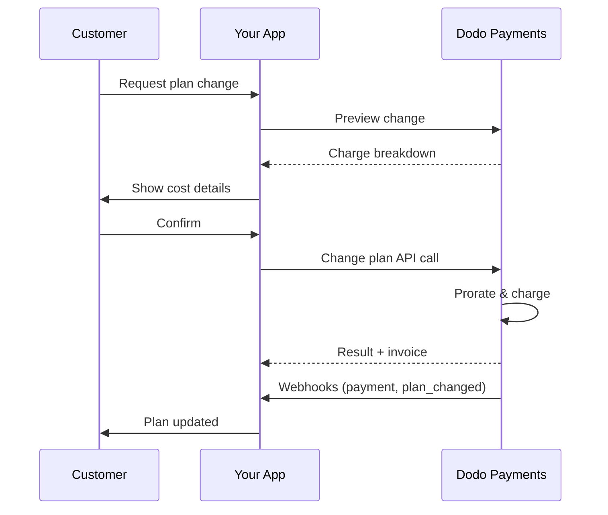
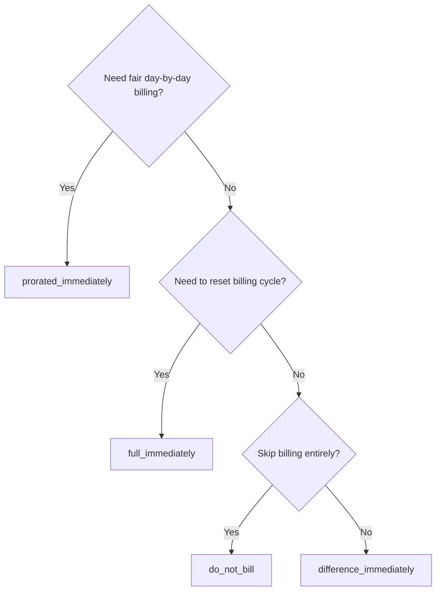
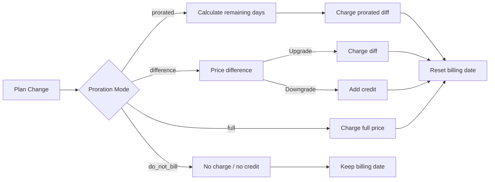

<CardGroup cols={3}>
<Card title="Change Plan API" icon="code" href="/api-reference/subscriptions/change-plan">
  Full API docs for updating subscriptions.
</Card>
<Card title="Plan Change Preview" icon="eye" href="/api-reference/subscriptions/preview-change-plan">
  See charge amounts before changing plans.
</Card>
<Card title="Integration Guide" icon="book" href="/developer-resources/subscription-integration-guide">
  Step-by-step subscription setup.
</Card>
</CardGroup>

## What is a subscription upgrade or downgrade?

Changing plans lets you move a customer between subscription tiers or quantities. Use it to:
- Align pricing with usage or features
- Move from monthly to annual (or vice versa)
- Adjust quantity for seat-based products

<Info>
Plan changes can trigger an immediate charge depending on the proration mode you choose.
</Info>

## When to use plan changes

- Upgrade when a customer needs more features, usage, or seats
- Downgrade when usage decreases
- Migrate users to a new product or price without cancelling their subscription

## Plan Change Flow



## Prerequisites

Before implementing subscription plan changes, ensure you have:

- A Dodo Payments merchant account with active subscription products
- API credentials (API key and webhook secret key) from the dashboard
- An existing active subscription to modify
- Webhook endpoint configured to handle subscription events

<Info>
For detailed setup instructions, see our [Integration Guide](/developer-resources/integration-guide#dashboard-setup).
</Info>

## Step-by-Step Implementation Guide

Follow this comprehensive guide to implement subscription plan changes in your application:

<Steps>
<Step title="Understand Plan Change Requirements">
Before implementing, determine:
- Which subscription products can be changed to which others
- What proration mode fits your business model
- How to handle failed plan changes gracefully
- Which webhook events to track for state management

<Tip>
Test plan changes thoroughly in test mode before implementing in production.
</Tip>
</Step>

<Step title="Choose Your Proration Strategy">
Select the billing approach that aligns with your business needs:

<Tabs>
<Tab title="prorated_immediately">
Best for: SaaS applications wanting to charge fairly for unused time
- Calculates exact prorated amount based on remaining cycle time
- Charges a prorated amount based on unused time remaining in the cycle
- Provides transparent billing to customers
</Tab>

<Tab title="difference_immediately">
Best for: Clear upgrade/downgrade scenarios
- Upgrade: Charge immediate difference (e.g., $30→$80 = charge $50)
- Downgrade: Credit remaining value for future renewals
- Simplifies billing logic and customer communication
</Tab>

<Tab title="full_immediately">
Best for: When you want to reset the billing cycle
- Charges full amount of new plan immediately
- Ignores remaining time from old plan
- Useful for annual to monthly transitions
</Tab>

<Tab title="do_not_bill">
Best for: Free migrations, courtesy switches, or absorbing cost differences
- No charges or credits calculated
- Customer moves to the new plan immediately without any billing adjustment
- Billing cycle remains unchanged
</Tab>
</Tabs>
</Step>

<Step title="Implement the Change Plan API">
Use the Change Plan API to modify subscription details:

<ParamField path="subscription_id" type="string" required>
The ID of the active subscription to modify.
</ParamField>

<ParamField path="product_id" type="string" required>
The new product ID to change the subscription to.
</ParamField>

<ParamField path="quantity" type="integer" required>
Number of units for the new plan (for seat-based products).
</ParamField>

<ParamField path="proration_billing_mode" type="string" required>
How to handle immediate billing: `prorated_immediately`, `full_immediately`, `difference_immediately`, or `do_not_bill`.
</ParamField>

<ParamField path="addons" type="array">
Optional addons for the new plan. Leaving this empty removes any existing addons.
</ParamField>

<ParamField path="on_payment_failure" type="string">
Controls behavior when the plan change payment fails:
- `prevent_change`: Keep subscription on current plan until payment succeeds
- `apply_change` (default): Apply plan change immediately regardless of payment outcome

If not specified, uses the business-level default setting.
</ParamField>

<ParamField path="collect_via_payment_link" type="boolean">
Samla in beloppet för planändringen med en betalningslänk i stället för att debitera prenumerationens sparade betalningsmetod. Kunden betalar på en hostad checkout-sida.

Kräver företagets `allow_plan_change_via_payment_link`-funktion (**Settings → Subscriptions → Collect Plan Change Payments by Payment Link**), `effective_at: immediately` och `on_payment_failure: prevent_change`. Se [Samla in betalning via en checkout-länk](#collecting-payment-via-a-checkout-link).

Ignoreras av preview-routen.
</ParamField>

<ParamField path="discount_codes" type="array">
Valfria **staplade** rabattkoder som ska tillämpas på den nya planen (högst 20, tillämpas i arrayordning). Beteendet beror på vad du skickar:

- **Inte angivet / `null`** — befintliga rabatter med `preserve_on_plan_change=true` bevaras om de gäller för den nya produkten.
- **`[]` (tom array)** — tar bort alla befintliga rabatter från prenumerationen.
- **`["CODE_A", "CODE_B", ...]`** — ersätter alla befintliga rabatter med denna staplade uppsättning.
</ParamField>

<ParamField path="discount_code" type="string" deprecated>
**Föråldrat** — använd `discount_codes` för nya integrationer. Fältet fungerar fortfarande för bakåtkompatibilitet, men kan inte kombineras med `discount_codes` i samma begäran.
</ParamField>

<ParamField path="effective_at" type="string" default="immediately">
När planändringen ska tillämpas:
- `immediately` (standard): Tillämpa planändringen omedelbart
- `next_billing_date`: Schemalägg ändringen till nästa faktureringsdatum. Kunden behåller sin aktuella plan tills faktureringsperioden är slut.

Använd `next_billing_date` för nedgraderingar så att kunderna behåller förmånerna från sin aktuella plan tills faktureringsperioden är slut.
</ParamField>
</Step>

<Step title="Handle Webhook Events">
Konfigurera webhook-hantering för att spåra resultatet av planändringar:

- `subscription.active`: Planändringen lyckades, prenumerationen uppdaterades
- `subscription.plan_changed`: Prenumerationsplanen ändrades (uppgradering/nedgradering/uppdatering av addon)
- `subscription.on_hold`: Debiteringen för planändringen misslyckades, förnyelser stoppades
- `payment.succeeded`: Den omedelbara debiteringen för planändringen lyckades
- `payment.failed`: Den omedelbara debiteringen misslyckades

<Warning>
Verifiera alltid webhook-signaturer och implementera idempotent händelsehantering.
</Warning>
</Step>

<Step title="Update Your Application State">
Uppdatera din applikation baserat på webhook-händelser:
- Ge eller återkalla funktioner baserat på den nya planen
- Uppdatera kundpanelen med information om den nya planen
- Skicka bekräftelsemejl om planändringar
- Logga faktureringsändringar för revisionsändamål
</Step>

<Step title="Test and Monitor">
Testa implementeringen noggrant:
- Testa alla prorationslägen med olika scenarier
- Verifiera att webhook-hanteringen fungerar korrekt
- Övervaka andelen lyckade planändringar
- Konfigurera aviseringar för misslyckade planändringar

<Check>
Implementeringen av prenumerationsplanändringen är nu redo för produktionsanvändning.
</Check>
</Step>
</Steps>

## Förhandsgranska planändringar

Innan du genomför en planändring kan du använda Preview API för att visa kunderna exakt vad de kommer att debiteras:

<Tabs>
<Tab title="Node.js SDK">

```javascript
const preview = await client.subscriptions.previewChangePlan('sub_123', {
  product_id: 'pdt_pro',
  quantity: 1,
  proration_billing_mode: 'prorated_immediately'
});

// Show customer the charge before confirming
console.log('Immediate charge:', preview.immediate_charge.summary);
console.log('New plan details:', preview.new_plan);
```

</Tab>

<Tab title="Python SDK">

```python
preview = client.subscriptions.preview_change_plan(
    subscription_id="sub_123",
    product_id="pdt_pro",
    quantity=1,
    proration_billing_mode="prorated_immediately"
)

# Show customer the charge before confirming
print("Immediate charge:", preview.immediate_charge.summary)
print("New plan details:", preview.new_plan)
```

</Tab>
</Tabs>

<Tip>
Använd preview-API:t för att skapa bekräftelsedialoger som visar kunderna exakt vilket belopp de kommer att debiteras innan de bekräftar en planändring.
</Tip>

## Change Plan API

Använd Change Plan API för att ändra produkt, kvantitet och prorationsbeteende för en aktiv prenumeration.

### Snabba exempel

<Tabs>
  <Tab title="Node.js SDK">

    ```javascript
    import DodoPayments from 'dodopayments';

    const client = new DodoPayments({
      bearerToken: process.env.DODO_PAYMENTS_API_KEY,
      environment: 'test_mode', // defaults to 'live_mode'
    });

    async function changePlan() {
      // change-plan returns 200 with an empty body.
      await client.subscriptions.changePlan('sub_123', {
        product_id: 'pdt_new',
        quantity: 3,
        proration_billing_mode: 'prorated_immediately',
        on_payment_failure: 'prevent_change', // Optional: control behavior on payment failure
      });
      console.log('Plan change accepted; awaiting webhooks');
    }

    changePlan();
    ```

  </Tab>
  <Tab title="Python SDK">

    ```python
    import os
    from dodopayments import DodoPayments

    client = DodoPayments(
        bearer_token=os.environ.get("DODO_PAYMENTS_API_KEY"),
        environment="test_mode",  # defaults to "live_mode"
    )

    # change_plan returns 200 with an empty body.
    client.subscriptions.change_plan(
        subscription_id="sub_123",
        product_id="pdt_new",
        quantity=3,
        proration_billing_mode="prorated_immediately",
        on_payment_failure="prevent_change",  # Optional: control behavior on payment failure
    )
    print("Plan change accepted; awaiting webhooks")
    ```

  </Tab>
  <Tab title="Go SDK">

    ```go
    package main

    import (
      "context"
      "fmt"
      "github.com/dodopayments/dodopayments-go"
      "github.com/dodopayments/dodopayments-go/option"
    )

    func main() {
      client := dodopayments.NewClient(option.WithBearerToken("YOUR_TOKEN"))
      // ChangePlan returns no response body; a nil error means the change succeeded.
      err := client.Subscriptions.ChangePlan(context.TODO(), "sub_123", dodopayments.SubscriptionChangePlanParams{
        UpdateSubscriptionPlanReq: dodopayments.UpdateSubscriptionPlanReqParam{
          ProductID:            dodopayments.F("pdt_new"),
          Quantity:             dodopayments.F(int64(3)),
          ProrationBillingMode: dodopayments.F(dodopayments.UpdateSubscriptionPlanReqProrationBillingModeProratedImmediately),
          OnPaymentFailure:     dodopayments.F(dodopayments.UpdateSubscriptionPlanReqOnPaymentFailurePreventChange), // Optional
        },
      })
      if err != nil { panic(err) }
      fmt.Println("Plan change applied")
    }
    ```

  </Tab>
  <Tab title="HTTP">

    ```bash
    curl -X POST "$DODO_API_BASE/subscriptions/sub_123/change-plan" \
      -H "Authorization: Bearer $DODO_PAYMENTS_API_KEY" \
      -H "Content-Type: application/json" \
      -d '{
        "product_id": "pdt_new",
        "quantity": 3,
        "proration_billing_mode": "prorated_immediately",
        "on_payment_failure": "prevent_change"
      }'
    ```

  </Tab>
</Tabs>

En lyckad planändring returnerar `200 OK` omedelbart — innan någon debitering faktiskt har slutförts. Vad body (`ChangePlanResponse`) innehåller beror på hur ändringen samlades in:

| Fall | `payment_id` / `payment_link` / `client_secret` / `expires_on` |
|------|------------------------------------------------------------|
| Schemalagd ändring (`effective_at: next_billing_date`) | Alla `null` — inget debiteras ännu |
| `proration_billing_mode: do_not_bill` | Alla `null` — inget att debitera |
| Vanlig omedelbar debitering (sparad betalningsmetod) | Alla `null` |
| `collect_via_payment_link: true` (länk utfärdad) | Alla **ifyllda** — checkout-handtag för kunden |

<Note>
I alla fall är detta svar inte ett betalningsresultat — endast en bekräftelse på att själva begäran accepterades. Det säger inget om huruvida en omedelbar debitering faktiskt lyckades.

För en **vanlig omedelbar debitering** fastställs resultatet utanför sessionen, direkt efter anropet.

För en **`collect_via_payment_link`-begäran** fastställs resultatet senare och asynkront — svaret ger dig endast en checkout-länk, prenumerationen ligger kvar på sin aktuella plan och inget är känt om resultatet förrän kunden faktiskt slutför betalningen via länken.

Oavsett vilket ska du inte dra slutsatser om resultatet från detta svar. Bekräfta det via webhook (<code>payment.succeeded</code>, <code>payment.failed</code>, <code>subscription.plan_changed</code>) eller genom att läsa prenumerationen igen med <code>GET /subscriptions/&#123;subscription_id&#125;</code> — se [Vad händer medan länken är obetald](#what-happens-while-the-link-is-unpaid) specifikt för fallet med betalningslänk.
</Note>

<Warning>
Om den omedelbara debiteringen misslyckas kan prenumerationen övergå till tillståndet `subscription.on_hold` tills betalningen lyckas.
</Warning>

## Samla in betalning via en checkout-länk

Som standard debiterar en omedelbar planändring prenumerationens sparade betalningsmetod direkt. Ange `collect_via_payment_link: true` för att i stället skicka kunden till en hostad checkout-sida — användbart när det inte finns någon sparad betalningsmetod som du får debitera utanför sessionen, eller när du vill att kunden aktivt ska bekräfta det nya priset.

<Info>
Detta är också det som driver växlingsalternativet **Collect Plan Change Payments by Payment Link** i **Settings → Subscriptions**, som dirigerar den inbyggda [Customer Portal](/features/customer-portal#collecting-plan-change-payments-by-payment-link):s flöde för planändringar genom checkout i stället för det sparade kortet.
</Info>

### Krav

`collect_via_payment_link: true` lyckas endast när **alla** följande villkor är uppfyllda — annars misslyckas begäran med `422`:

- Företaget har `allow_plan_change_via_payment_link`-funktionen aktiverad (**Settings → Subscriptions → Collect Plan Change Payments by Payment Link**).
- `effective_at` är `immediately` (standardvärdet). En schemalagd ändring (`next_billing_date`) behöver aldrig en checkout-sida, eftersom inget debiteras förrän ändringen tillämpas.
- Den **effektiva** `on_payment_failure` löses till `prevent_change`. Du behöver inte skicka den uttryckligen — om företagets standardvärde (se **Företags- och insamlingsstandarder** nedan) redan är `prevent_change` uppfyller det också detta villkor när fältet utelämnas. Ett uttryckligt `apply_change`, eller ett löst standardvärde på `apply_change`, misslyckas med `422`.

<Info>
`collect_via_payment_link` är inte begränsad till uppgraderingar — den gäller alla omedelbara ändringar som leder till en debitering, inklusive nedgraderingar, så länge kraven ovan är uppfyllda.
</Info>

Om ändringen blir **noll eller en kreditering** — `proration_billing_mode: do_not_bill` eller ett annat läge som råkar ge noll netto den här cykeln — finns det inget att lägga på en checkout-sida. Ingen betalningslänk utfärdas, `payment_link` och liknande returneras som `null`, och ändringen tillämpas omedelbart, precis som den skulle ha gjort utan `collect_via_payment_link`. Detta är inte ett `422`; flaggan träder endast i kraft när det finns ett positivt belopp att samla in. Om du anger `collect_via_payment_link` generellt för planändringar i stället för enbart för tydliga uppgraderingar bör du först anropa [Preview Plan Change](/api-reference/subscriptions/preview-change-plan) och endast begära en länk när det förhandsgranskade beloppet är värt att samla in.

<Tabs>
<Tab title="Node.js SDK">

```javascript
const response = await client.subscriptions.changePlan('sub_123', {
  product_id: 'pdt_pro',
  quantity: 1,
  proration_billing_mode: 'prorated_immediately',
  effective_at: 'immediately',
  on_payment_failure: 'prevent_change',
  collect_via_payment_link: true,
});

// Hand response.payment_link to your frontend and send the customer there
console.log(response.payment_link);
```

</Tab>
<Tab title="Python SDK">

```python
response = client.subscriptions.change_plan(
    subscription_id="sub_123",
    product_id="pdt_pro",
    quantity=1,
    proration_billing_mode="prorated_immediately",
    effective_at="immediately",
    on_payment_failure="prevent_change",
    collect_via_payment_link=True,
)

# Hand response.payment_link to your frontend and send the customer there
print(response.payment_link)
```

</Tab>
<Tab title="HTTP">

```bash
curl -X POST "$DODO_API_BASE/subscriptions/sub_123/change-plan" \
  -H "Authorization: Bearer $DODO_PAYMENTS_API_KEY" \
  -H "Content-Type: application/json" \
  -d '{
    "product_id": "pdt_pro",
    "quantity": 1,
    "proration_billing_mode": "prorated_immediately",
    "effective_at": "immediately",
    "on_payment_failure": "prevent_change",
    "collect_via_payment_link": true
  }'
```

</Tab>
</Tabs>

En lyckad begäran returnerar checkout-handtagen:

```json
{
  "payment_id": "<payment_id>",
  "payment_link": "https://checkout.dodopayments.com/...",
  "client_secret": "<client_secret>",
  "expires_on": "<expires_on>"
}
```

### Vad händer medan länken är obetald

- Prenumerationen ligger kvar på sin **aktuella** plan — `product_id`, `recurring_pre_tax_amount` och `next_billing_date` påverkas inte förrän länken har betalats.
- En ytterligare `change-plan`-begäran för samma prenumeration avvisas med `409 PendingPlanChangeExists` medan länken väntar. Avbryt en *schemalagd* ändring med `DELETE /subscriptions/{subscription_id}/change-plan/scheduled` vid behov, men den endpointen avbryter inte en väntande ändring via betalningslänk — endast en lyckad betalning eller länkens utgång gör det.
- Kunden kan försöka betala med ett kort igen i **samma** checkout-session efter ett avslag; ett nytt `change-plan`-anrop är inte rätt sätt att försöka igen.
- Om länken aldrig betalas slutar den att fungera efter `expires_on` — prenumerationen blir automatiskt tillgänglig för en ny begäran om planändring kort därefter.
- Om en *schemalagd* ändring (`next_billing_date`) redan fanns och du ersätter den med `cancel_scheduled_change_plan: true` ligger det ursprungliga schemat kvar medan länken är obetald och avbryts först när länken har betalats — i samma transaktion som tillämpar den nya planen.

<Warning>
När en omedelbar ändring via betalningslänk har utfärdats blockeras varje ytterligare begäran om planändring för prenumerationen — inklusive den bieffektfria förhandsgranskningen — tills länken har lösts. Utfärda inte en länk som du inte avser att kunden ska betala omedelbart.
</Warning>

## Hantera addons

När du ändrar prenumerationsplaner kan du även ändra addons:

```javascript
// Add addons to the new plan
await client.subscriptions.changePlan('sub_123', {
  product_id: 'pdt_new',
  quantity: 1,
  proration_billing_mode: 'difference_immediately',
  addons: [
    { addon_id: 'addon_123', quantity: 2 }
  ]
});

// Remove all existing addons
await client.subscriptions.changePlan('sub_123', {
  product_id: 'pdt_new',
  quantity: 1,
  proration_billing_mode: 'difference_immediately',
  addons: [] // Empty array removes all existing addons
});
```

<Info>
Addons inkluderas i prorationsberäkningen och debiteras enligt det valda prorationsläget.
</Info>

## Tillämpa rabattkoder

Du kan tillämpa en eller flera **staplade rabattkoder** när du ändrar prenumerationsplaner (högst 20, tillämpas i arrayordning). Detta är användbart när du erbjuder kampanjpriser vid uppgraderingar eller migreringar.

<Tabs>
<Tab title="Node.js SDK">

```javascript
// Apply stacked discount codes during plan change
await client.subscriptions.changePlan('sub_123', {
  product_id: 'pdt_pro',
  quantity: 1,
  proration_billing_mode: 'prorated_immediately',
  discount_codes: ['UPGRADE20']
});
```

</Tab>
<Tab title="Python SDK">

```python
# Apply stacked discount codes during plan change
client.subscriptions.change_plan(
    subscription_id="sub_123",
    product_id="pdt_pro",
    quantity=1,
    proration_billing_mode="prorated_immediately",
    discount_codes=["UPGRADE20"]
)
```

</Tab>
<Tab title="HTTP">

```bash
curl -X POST "$DODO_API_BASE/subscriptions/sub_123/change-plan" \
  -H "Authorization: Bearer $DODO_PAYMENTS_API_KEY" \
  -H "Content-Type: application/json" \
  -d '{
    "product_id": "pdt_pro",
    "quantity": 1,
    "proration_billing_mode": "prorated_immediately",
    "discount_codes": ["UPGRADE20"]
  }'
```

</Tab>
</Tabs>

### Rabattbeteende vid planändring

| Värde för `discount_codes` | Beteende |
|------------------------|----------|
| Inte angivet / `null` | Befintliga rabatter med `preserve_on_plan_change=true` bevaras automatiskt om de gäller för den nya produkten. |
| `[]` (tom array) | **Alla** befintliga rabatter tas bort från prenumerationen. |
| `["CODE_A", "CODE_B", ...]` | Ersätter alla befintliga rabatter med denna staplade uppsättning, som valideras och tillämpas i arrayordning. |

<Info>
Det enskilda fältet `discount_code` för denna endpoint är **föråldrat**, men fungerar fortfarande för bakåtkompatibilitet — befintliga integrationer behöver inte ändras omedelbart. Det kan inte kombineras med `discount_codes` i samma begäran. Migrera till arrayformatet när det passar.
</Info>

<Tip>
Använd [Preview Plan Change API](/api-reference/subscriptions/preview-change-plan) med `discount_codes` för att visa kunderna exakt hur mycket de sparar innan de bekräftar planändringen.
</Tip>

## Prorationslägen

Välj hur kunden ska faktureras när planer ändras:

#### `prorated_immediately`
- Debiterar den proportionella skillnaden för den del av den aktuella cykeln som återstår
- Om kunden är i en provperiod debiteras kunden omedelbart och byter till den nya planen nu
- Nedgradering: kan skapa en proportionell kreditering som tillämpas på framtida förnyelser

#### `full_immediately`
- Debiterar hela beloppet för den nya planen omedelbart
- Tar inte hänsyn till återstående tid i den gamla planen

<Info>
Krediter som skapas av nedgraderingar med <code>difference_immediately</code> är knutna till prenumerationen och skiljer sig från förmåner inom <a href="/features/credit-based-billing">Credit-Based Billing</a>. De tillämpas automatiskt på framtida förnyelser av samma prenumeration och kan inte överföras mellan prenumerationer.
</Info>

#### `difference_immediately`
- Uppgradering: debiterar omedelbart prisskillnaden mellan den gamla och den nya planen
- Nedgradering: lägger till återstående värde som intern kredit på prenumerationen och tillämpar den automatiskt vid förnyelser

#### `do_not_bill`
- Inga debiteringar eller krediter beräknas
- Kunden byter omedelbart till den nya planen utan någon faktureringsjustering
- Faktureringscykeln förblir oförändrad
- Passar bäst för kostnadsfria migreringar, byten till gratisplaner eller när kostnadsskillnader tas bort

| Funktion | `prorated_immediately` | `difference_immediately` | `full_immediately` | `do_not_bill` |
|---------|----------------------|------------------------|-------------------|--------------|
| **Uppgraderingsdebitering** | Proportionell skillnad för återstående dagar | Full prisskillnad mellan planerna | Hela priset för den nya planen | Ingen debitering |
| **Nedgraderingskreditering** | Proportionell kreditering för återstående dagar | Hela prisskillnaden som kreditering | Ingen kreditering | Ingen kreditering |
| **Faktureringscykel** | Återställs till idag | Återställs till idag | Återställs till idag | Oförändrad |
| **Beteende under provperiod** | Avslutar provperioden och debiterar omedelbart | Avslutar provperioden och debiterar hela beloppet | Avslutar provperioden och debiterar hela beloppet | Avslutar provperioden utan debitering |
| **Passar bäst för** | Rättvis tidsbaserad fakturering | Enkel matematik för uppgraderingar/nedgraderingar | Återställning av faktureringscykler | Kostnadsfria migreringar eller byten som goodwill |
| **Komplexitet** | Medel (beräkning per dag) | Låg (enkel subtraktion) | Låg (full debitering) | Ingen |



### Exempelscenarier

Använd dessa kanoniska siffror konsekvent:
- Aktuell plan: **Basic** på **$30/månad**
- Målplan för uppgradering: **Pro** på **$80/månad**
- Målplan för nedgradering (från Pro): **Starter** på **$20/månad**
- Faktureringscykel: **30 dagar**, startade **January 1**
- Planändringen sker **January 16** (15 dagar kvar, 15 dagar använda)

<AccordionGroup>
  <Accordion title="Upgrade: Basic ($30) → Pro ($80) with prorated_immediately">

    ```
    Step 1: Calculate unused credit from current plan
      Unused days = 15 out of 30 days
      Credit = $30 × (15/30) = $15.00

    Step 2: Calculate prorated cost of new plan
      Remaining days = 15 out of 30 days
      New plan cost = $80 × (15/30) = $40.00

    Step 3: Calculate immediate charge
      Charge = New plan cost − Credit
      Charge = $40.00 − $15.00 = $25.00

    → Customer pays $25.00 now
    → Billing cycle resets to today (January 16)
    → Next renewal (Feb 15): $80.00/month
    ```

    ```javascript
    await client.subscriptions.changePlan('sub_123', {
      product_id: 'pdt_pro',
      quantity: 1,
      proration_billing_mode: 'prorated_immediately'
    })
    ```

  </Accordion>

  <Accordion title="Downgrade: Pro ($80) → Starter ($20) with prorated_immediately">

    ```
    Step 1: Calculate unused credit from current plan
      Unused days = 15 out of 30 days
      Credit = $80 × (15/30) = $40.00

    Step 2: Calculate prorated cost of new plan
      Remaining days = 15 out of 30 days
      New plan cost = $20 × (15/30) = $10.00

    Step 3: Calculate credit balance
      Credit = $40.00 − $10.00 = $30.00

    → No charge — $30.00 credit added to subscription
    → Billing cycle resets to today (January 16)
    → Credit auto-applies to future renewals
    → Next renewal (Feb 15): $20.00 − $20.00 (from credit) = $0.00 ($10.00 credit remaining)
    → Following renewal (Mar 15): $20.00 − $10.00 remaining credit = $10.00
    ```

    ```javascript
    await client.subscriptions.changePlan('sub_123', {
      product_id: 'pdt_starter',
      quantity: 1,
      proration_billing_mode: 'prorated_immediately'
    })
    ```

  </Accordion>

  <Accordion title="Upgrade: Basic ($30) → Pro ($80) with difference_immediately">

    ```
    Immediate charge = New plan price − Old plan price
                     = $80 − $30
                     = $50.00

    → Customer pays $50.00 now (regardless of cycle position)
    → Billing cycle resets to today (January 16)
    → Next renewal (Feb 15): $80.00/month
    ```

    ```javascript
    await client.subscriptions.changePlan('sub_123', {
      product_id: 'pdt_pro',
      quantity: 1,
      proration_billing_mode: 'difference_immediately'
    })
    ```

  </Accordion>

  <Accordion title="Downgrade: Pro ($80) → Starter ($20) with difference_immediately">

    ```
    Credit = Old plan price − New plan price
           = $80 − $20
           = $60.00

    → No charge — $60.00 credit added to subscription
    → Credit auto-applies to future renewals
    → Next renewal: $20.00 − $20.00 (from credit) = $0.00
    → Following renewal: $20.00 − $20.00 (from credit) = $0.00
    → Third renewal: $20.00 − $20.00 (from remaining credit) = $0.00
    ```

    ```javascript
    await client.subscriptions.changePlan('sub_123', {
      product_id: 'pdt_starter',
      quantity: 1,
      proration_billing_mode: 'difference_immediately'
    })
    ```

  </Accordion>

  <Accordion title="Upgrade: Basic ($30) → Pro ($80) with full_immediately">

    ```
    Immediate charge = Full new plan price = $80.00

    → Customer pays $80.00 now
    → No credit for unused time on old plan
    → Billing cycle resets to today (January 16)
    → Next renewal: February 16 at $80.00/month
    ```

    ```javascript
    await client.subscriptions.changePlan('sub_123', {
      product_id: 'pdt_pro',
      quantity: 1,
      proration_billing_mode: 'full_immediately'
    })
    ```

  </Accordion>

  <Accordion title="Mid-cycle upgrade with add-ons using prorated_immediately">

    ```
    Current: Basic plan ($30/month), no add-ons
    New: Pro plan ($80/month) + Extra Seats add-on ($10/seat × 3 seats = $30/month)
    Change on day 16 of 30 (15 days remaining)

    Step 1: Credit from current plan
      Credit = $30 × (15/30) = $15.00

    Step 2: Prorated cost of new plan + add-ons
      New plan = $80 × (15/30) = $40.00
      Add-ons = $30 × (15/30) = $15.00
      Total new = $55.00

    Step 3: Immediate charge
      Charge = $55.00 − $15.00 = $40.00

    → Customer pays $40.00 now
    → Next renewal: $80.00 + $30.00 = $110.00/month
    ```

    ```javascript
    await client.subscriptions.changePlan('sub_123', {
      product_id: 'pdt_pro',
      quantity: 1,
      proration_billing_mode: 'prorated_immediately',
      addons: [
        { addon_id: 'addon_seats', quantity: 3 }
      ]
    })
    ```

  </Accordion>
</AccordionGroup>

### Så behandlar varje läge faktureringen



<Tip>
Välj `prorated_immediately` för rättvis tidsbaserad redovisning; välj `full_immediately` för att starta om faktureringen; använd `difference_immediately` för enkla uppgraderingar och automatisk kreditering vid nedgraderingar; eller använd `do_not_bill` för att byta plan utan någon faktureringsjustering.
</Tip>

## Hantera betalningsmisslyckanden

Styr vad som händer när en betalning för en planändring misslyckas med parametern `on_payment_failure`.

### Lägen för betalningsmisslyckanden

<Tabs>
<Tab title="prevent_change (Recommended for critical upgrades)">
**Beteende**: Behåll prenumerationen på dess aktuella plan tills betalningen lyckas.

- Planändringen markeras som "pending"
- Kunden behåller åtkomsten till sin aktuella plan
- Prenumerationen övergår till tillståndet `active` först efter en lyckad betalning
- Användbart när du vill säkerställa betalning innan du ger tillgång till uppgraderade funktioner

```javascript
await client.subscriptions.changePlan('sub_123', {
  product_id: 'pdt_pro',
  quantity: 1,
  proration_billing_mode: 'prorated_immediately',
  on_payment_failure: 'prevent_change'
});
```

</Tab>

<Tab title="apply_change (Default)">
**Beteende**: Tillämpa planändringen omedelbart oavsett betalningsresultat.

- Planändringen tillämpas även om betalningen misslyckas
- Kunden får omedelbar åtkomst till den nya planen
- Prenumerationen kan övergå till tillståndet `on_hold` om betalningen misslyckas
- Passar bra för icke-kritiska uppgraderingar eller när du litar på kunden

```javascript
await client.subscriptions.changePlan('sub_123', {
  product_id: 'pdt_pro',
  quantity: 1,
  proration_billing_mode: 'prorated_immediately',
  on_payment_failure: 'apply_change' // This is the default
});
```

</Tab>
</Tabs>

<Info>
Om den inte anges använder parametern `on_payment_failure` företagets standardinställning som konfigurerats i dashboarden.
</Info>

### När ska varje läge användas?

| Scenario | Rekommenderat läge | Anledning |
|----------|------------------|--------|
| Uppgradering till premiumfunktioner | `prevent_change` | Säkerställ betalning innan åtkomst ges |
| Ökat antal (fler platser) | `prevent_change` | Förhindra användning utan betalning |
| Nedgradering av planer | `apply_change` | Kunden minskar sina utgifter |
| Betrodda företagskunder | `apply_change` | Lägre risk för utebliven betalning |
| Konvertering från provperiod till betalning | `prevent_change` | Kritisk betalningstidpunkt |

## Företags- och insamlingsstandarder

I stället för att skicka prorationsparametrar vid varje planändring kan du ange **standardbeteende för uppgraderingar och nedgraderingar** en gång på företagsnivå. Dessa standardvärden gäller för alla planändringar i kundportalen och kan **åsidosättas per produktkollektion**.

Det finns separata standardvärden för uppgraderingar och nedgraderingar:

| Inställning | Fält (uppgradering / nedgradering) | Standard (uppgradering) | Standard (nedgradering) |
|---------|-----------------------------|-------------------|---------------------|
| När den nya planen börjar | `effective_at_on_upgrade` / `effective_at_on_downgrade` | `immediately` | `next_billing_date` |
| Hur kunden debiteras | `proration_billing_mode_on_upgrade` / `proration_billing_mode_on_downgrade` | `difference_immediately` | `difference_immediately` |
| Om kundens betalning misslyckas | `on_payment_failure` | `apply_change` | `apply_change` |

Konfigurera företagsstandarder under **Settings → Subscriptions** och åsidosättningar för kollektioner på varje produktkollektion. Varje kollektionsfält är fristående — lämna det ej angivet för att **ärva från företagsstandarden**, eller ange ett värde för att endast åsidosätta det för den kollektionen.

### Prioritetsordning

För en viss planändring löses varje inställning i denna ordning:

```
per-request value (Change Plan API) → collection field (if set) → business field → system default
```

<Info>
Ett värde som uttryckligen skickas till [Change Plan API](/api-reference/subscriptions/change-plan) har alltid företräde. Företags- och kollektionsstandarderna börjar endast gälla när inget uttryckligt värde har angetts — vilket gäller för alla planändringar som initieras från kundportalen.
</Info>

<Tip>
En vanlig konfiguration är att behålla uppgraderingar på `immediately` + `difference_immediately` så att kunderna betalar skillnaden och får åtkomst direkt, och att behålla nedgraderingar på `next_billing_date` så att kunderna behåller sin aktuella plan tills cykeln är slut.
</Tip>

## Hantera webhooks

Spåra prenumerationens status via webhooks för att bekräfta planändringar och betalningar.

### Händelsetyper att hantera
- `subscription.active`: prenumerationen aktiverades
- `subscription.plan_changed`: prenumerationsplanen ändrades (uppgradering/nedgradering/ändringar av addon)
- `subscription.on_hold`: debiteringen misslyckades, förnyelser stoppades
- `subscription.renewed`: förnyelsen lyckades
- `payment.succeeded`: betalningen för planändringen eller förnyelsen lyckades
- `payment.failed`: betalningen misslyckades

<Info>
Vi rekommenderar att du baserar affärslogiken på prenumerationshändelser och använder betalningshändelser för bekräftelse och avstämning.
</Info>

### Verifiera signaturer och hantera intents

<Tabs>
  <Tab title="Next.js Route Handler">

    ```javascript
    import { NextRequest, NextResponse } from 'next/server';
    
    export async function POST(req) {
      const webhookId = req.headers.get('webhook-id');
      const webhookSignature = req.headers.get('webhook-signature');
      const webhookTimestamp = req.headers.get('webhook-timestamp');
      const secret = process.env.DODO_WEBHOOK_SECRET;
    
      const payload = await req.text();
      // verifySignature is a placeholder – in production, use a Standard Webhooks library
      const { valid, event } = await verifySignature(
        payload,
        { id: webhookId, signature: webhookSignature, timestamp: webhookTimestamp },
        secret
      );
      if (!valid) return NextResponse.json({ error: 'Invalid signature' }, { status: 400 });
    
      switch (event.type) {
        case 'subscription.active':
          // mark subscription active in your DB
          break;
        case 'subscription.plan_changed':
          // refresh entitlements and reflect the new plan in your UI
          break;
        case 'subscription.on_hold':
          // notify user to update payment method
          break;
        case 'subscription.renewed':
          // extend access window
          break;
        case 'payment.succeeded':
          // reconcile payment for plan change
          break;
        case 'payment.failed':
          // log and alert
          break;
        default:
          // ignore unknown events
          break;
      }
    
      return NextResponse.json({ received: true });
    }
    ```

  </Tab>
  <Tab title="Express.js">

    ```javascript
    import express from 'express';
    
    const app = express();
    app.post('/webhooks/dodo', express.raw({ type: 'application/json' }), async (req, res) => {
      const webhookId = req.header('webhook-id');
      const webhookSignature = req.header('webhook-signature');
      const webhookTimestamp = req.header('webhook-timestamp');
      const secret = process.env.DODO_WEBHOOK_SECRET;
      const payload = req.body.toString('utf8');
    
      const { valid, event } = await verifySignature(
        payload,
        { id: webhookId, signature: webhookSignature, timestamp: webhookTimestamp },
        secret
      );
      if (!valid) return res.status(400).send('Invalid signature');
    
      // handle events like above
      res.json({ received: true });
    });
    
    app.listen(3000);
    ```

  </Tab>
</Tabs>

<Note>
För detaljerade payload-scheman, se <a href="/developer-resources/webhooks/intents/subscription">payloads för prenumerationswebhooks</a> och <a href="/developer-resources/webhooks/intents/payment">payloads för betalningswebhooks</a>.
</Note>

## Bästa praxis

Följ dessa rekommendationer för tillförlitliga planändringar av prenumerationer:

### Strategi för planändringar
- **Testa noggrant**: Testa alltid planändringar i testläge före produktion
- **Välj proration med omsorg**: Välj det prorationsläge som passar din affärsmodell
- **Hantera fel på ett bra sätt**: Implementera korrekt felhantering och logik för nya försök
- **Övervaka lyckade ändringar**: Spåra andelen lyckade och misslyckade planändringar och undersök problem

### Webhook-implementering
- **Verifiera signaturer**: Validera alltid webhook-signaturer för att säkerställa äkthet
- **Implementera idempotens**: Hantera dubbla webhook-händelser på ett bra sätt
- **Bearbeta asynkront**: Blockera inte webhook-svar med tunga operationer
- **Logga allt**: Spara detaljerade loggar för felsökning och revisionsändamål

### Användarupplevelse
- **Kommunicera tydligt**: Informera kunderna om faktureringsändringar och tidpunkter
- **Ge bekräftelser**: Skicka bekräftelsemejl för lyckade planändringar
- **Hantera specialfall**: Ta hänsyn till provperioder, prorering och misslyckade betalningar
- **Uppdatera gränssnittet omedelbart**: Återspegla planändringar i applikationens gränssnitt

## Vanliga problem och lösningar

Lös typiska problem som uppstår vid ändringar av prenumerationsplaner:

<AccordionGroup>
<Accordion title="Charge created but subscription not updated">
**Symptom**: API-anropet lyckas men prenumerationen ligger kvar på den gamla planen

**Vanliga orsaker**:
- Webhook-bearbetningen misslyckades eller fördröjdes
- Applikationens tillstånd uppdaterades inte efter mottagna webhooks
- Problem med databastransaktioner under tillståndsuppdateringen

**Lösningar**:
- Implementera robust webhook-hantering med logik för nya försök
- Använd idempotenta åtgärder för tillståndsuppdateringar
- Lägg till övervakning för att upptäcka och avisera om missade webhook-händelser
- Verifiera att webhook-endpointen är tillgänglig och svarar korrekt
</Accordion>

<Accordion title="Credits not applied after downgrade">
**Symptom**: Kunden nedgraderar men ser inget kreditsaldo

**Vanliga orsaker**:
- Förväntningar på prorationsläget: nedgraderingar krediterar hela prisskillnaden med `difference_immediately`, medan `prorated_immediately` skapar en proportionell kreditering baserat på återstående tid i cykeln
- Krediter är prenumerationsspecifika och överförs inte mellan prenumerationer
- Kreditsaldot visas inte i kundpanelen

**Lösningar**:
- Använd `difference_immediately` för nedgraderingar när du vill ha automatiska krediter
- Förklara för kunderna att krediter tillämpas på framtida förnyelser av samma prenumeration
- Implementera kundportalen så att kreditsaldon visas
- Kontrollera nästa fakturaförhandsgranskning för att se tillämpade krediter
</Accordion>

<Accordion title="Webhook signature verification fails">
**Symptom**: Webhook-händelser avvisas på grund av ogiltig signatur

**Vanliga orsaker**:
- Felaktig webhook-hemlighet
- Rå request body ändrades före signaturverifieringen
- Fel algoritm för signaturverifiering

**Lösningar**:
- Verifiera att du använder rätt `DODO_WEBHOOK_SECRET` från dashboarden
- Läs den råa request body innan någon middleware för JSON-parsning körs
- Använd standardbiblioteket för webhook-verifiering för din plattform
- Testa verifieringen av webhook-signaturer i utvecklingsmiljön
</Accordion>

<Accordion title="Plan change fails with 422 error">
**Symptom**: API returnerar felet 422 Unprocessable Entity

**Vanliga orsaker**:
- Ogiltigt prenumerations-ID eller produkt-ID
- Prenumerationen är inte i aktivt tillstånd
- Obligatoriska parametrar saknas
- Produkten är inte tillgänglig för planändringar

**Lösningar**:
- Verifiera att prenumerationen finns och är aktiv
- Kontrollera att produkt-ID:t är giltigt och tillgängligt
- Säkerställ att alla obligatoriska parametrar har angetts
- Läs API-dokumentationen för information om parameterkrav
</Accordion>

<Accordion title="Immediate charge fails during plan change">
**Symptom**: Planändringen initierades men den omedelbara debiteringen misslyckades

**Vanliga orsaker**:
- Otillräckliga medel på kundens betalningsmetod
- Betalningsmetoden har upphört att gälla eller är ogiltig
- Banken avvisade transaktionen
- Bedrägeridetektering blockerade debiteringen

**Lösningar**:
- Hantera webhook-händelser av typen `payment.failed` korrekt
- Informera kunden om att uppdatera betalningsmetoden
- Implementera logik för nya försök vid tillfälliga fel
- Överväg att tillåta planändringar trots misslyckade omedelbara debiteringar
</Accordion>

<Accordion title="Subscription on hold after plan change">
**Symptom**: Debiteringen för planändringen misslyckas och prenumerationen övergår till tillståndet `on_hold`

**Vad händer**:
När en debitering för en planändring misslyckas placeras prenumerationen automatiskt i tillståndet `on_hold`. Prenumerationen förnyas inte automatiskt förrän betalningsmetoden har uppdaterats.

**Lösning**: Uppdatera betalningsmetoden för att återaktivera prenumerationen

Så här återaktiverar du en prenumeration från tillståndet `on_hold` efter en misslyckad planändring:

1. **Uppdatera betalningsmetoden** med Update Payment Method API
2. **Automatisk skapelse av debitering**: API:t skapar automatiskt en debitering för återstående belopp
3. **Generering av faktura**: En faktura genereras för debiteringen
4. **Betalningshantering**: Betalningen behandlas med den nya betalningsmetoden
5. **Återaktivering**: Efter en lyckad betalning återaktiveras prenumerationen till tillståndet `active`

<CodeGroup>

```javascript Node.js
// Reactivate subscription from on_hold after failed plan change
async function reactivateAfterFailedPlanChange(subscriptionId) {
  // Update payment method - automatically creates charge for remaining dues
  const response = await client.subscriptions.updatePaymentMethod(subscriptionId, {
    payment_method: { type: 'new', return_url: 'https://example.com/return' }
  });
  
  if (response.payment_id) {
    console.log('Charge created for remaining dues:', response.payment_id);
    console.log('Payment link:', response.payment_link);
    
    // Redirect customer to payment_link to complete payment
    // Monitor webhooks for:
    // 1. payment.succeeded - charge succeeded
    // 2. subscription.active - subscription reactivated
  }
  
  return response;
}

// Or use existing payment method if available
async function reactivateWithExistingPaymentMethod(subscriptionId, paymentMethodId) {
  const response = await client.subscriptions.updatePaymentMethod(subscriptionId, {
    payment_method: { type: 'existing', payment_method_id: paymentMethodId }
  });
  
  // Monitor webhooks for payment.succeeded and subscription.active
  return response;
}
```

```python Python
# Reactivate subscription from on_hold after failed plan change
def reactivate_after_failed_plan_change(subscription_id):
    # Update payment method - automatically creates charge for remaining dues
    response = client.subscriptions.update_payment_method(
        subscription_id=subscription_id,
        payment_method={"type": "new", "return_url": "https://example.com/return"},
    )
    
    if response.payment_id:
        print("Charge created for remaining dues:", response.payment_id)
        print("Payment link:", response.payment_link)
        
        # Redirect customer to payment_link to complete payment
        # Monitor webhooks for:
        # 1. payment.succeeded - charge succeeded
        # 2. subscription.active - subscription reactivated
    
    return response

# Or use existing payment method if available
def reactivate_with_existing_payment_method(subscription_id, payment_method_id):
    response = client.subscriptions.update_payment_method(
        subscription_id=subscription_id,
        payment_method={"type": "existing", "payment_method_id": payment_method_id},
    )
    
    # Monitor webhooks for payment.succeeded and subscription.active
    return response
```

</CodeGroup>

**Webhook-händelser att övervaka**:
- `subscription.on_hold`: Prenumerationen sattes på hold (mottas när debiteringen för planändringen misslyckas)
- `payment.succeeded`: Betalningen för återstående belopp lyckades (efter uppdatering av betalningsmetoden)
- `subscription.active`: Prenumerationen återaktiverades efter en lyckad betalning

**Bästa praxis**:
- Informera kunderna omedelbart när en debitering för en planändring misslyckas
- Ge tydliga instruktioner om hur betalningsmetoden uppdateras
- Övervaka webhook-händelser för att spåra återaktiveringsstatus
- Överväg att implementera automatisk logik för nya försök vid tillfälliga betalningsfel

<Card title="Update Payment Method API Reference" icon="code" href="/api-reference/subscriptions/update-payment-method">
Visa den fullständiga API-dokumentationen för uppdatering av betalningsmetoder och återaktivering av prenumerationer.
</Card>
</Accordion>
</AccordionGroup>

## Testa din implementering

Följ dessa steg för att testa implementeringen av planändringar för prenumerationer noggrant:

<Steps>
<Step title="Set up test environment">
- Använd test-API-nycklar och testprodukter
- Skapa testprenumerationer med olika plantyper
- Konfigurera test-endpointen för webhooks
- Konfigurera övervakning och loggning
</Step>

<Step title="Test different proration modes">
- Testa `prorated_immediately` med olika positioner i faktureringscykeln
- Testa `difference_immediately` för uppgraderingar och nedgraderingar
- Testa `full_immediately` för att återställa faktureringscykler
- Testa `do_not_bill` för planbyten utan debitering eller kreditering
- Verifiera att krediterna beräknas korrekt
</Step>

<Step title="Test webhook handling">
- Verifiera att alla relevanta webhook-händelser tas emot
- Testa verifiering av webhook-signaturer
- Hantera dubbla webhook-händelser på ett bra sätt
- Testa scenarier där webhook-bearbetningen misslyckas
</Step>

<Step title="Test error scenarios">
- Testa med ogiltiga prenumerations-ID:n
- Testa med utgångna betalningsmetoder
- Testa nätverksfel och tidsgränser
- Testa med otillräckliga medel
</Step>

<Step title="Monitor in production">
- Konfigurera aviseringar för misslyckade planändringar
- Övervaka webhook-bearbetningstider
- Spåra andelen lyckade planändringar
- Granska kundsupportärenden om problem med planändringar
</Step>
</Steps>

## Felhantering

Hantera vanliga API-fel på ett bra sätt i din implementering:

### HTTP-statuskoder

<AccordionGroup>
<Accordion title="200 OK">
Begäran om planändring behandlades korrekt. Svarskroppen är tom, förutom vid en lyckad `collect_via_payment_link`-begäran, som returnerar checkout-handtag — se [Samla in betalning via en checkout-länk](#collecting-payment-via-a-checkout-link). Om `on_payment_failure=prevent_change` förblir planändringen väntande tills betalningen lyckas.
</Accordion>

<Accordion title="400 Bad Request">
Ogiltiga begärandeparametrar. Kontrollera att alla obligatoriska fält har angetts och formaterats korrekt.
</Accordion>

<Accordion title="401 Unauthorized">
Ogiltig eller saknad API-nyckel. Kontrollera att din `DODO_PAYMENTS_API_KEY` är korrekt och har rätt behörigheter.
</Accordion>

<Accordion title="404 Not Found">
Prenumerations-ID:t hittades inte eller tillhör inte ditt konto.
</Accordion>

<Accordion title="409 Conflict">
Det finns redan en väntande planändring för denna prenumeration (`PendingPlanChangeExists`). För en *schemalagd* ändring ska du avbryta den med `DELETE /subscriptions/{subscription_id}/change-plan/scheduled` innan du skickar en ny. För en väntande ändring via *betalningslänk* finns ingen endpoint för att avbryta den — prenumerationen accepterar en ny begäran om planändring när kunden betalar eller länken löper ut.
</Accordion>

<Accordion title="422 Unprocessable Entity">
Prenumerationen är inaktiv eller on-demand, eller så är begäran inte kvalificerad för `collect_via_payment_link` — företaget har inte funktionen aktiverad, `effective_at` är inte `immediately`, eller `on_payment_failure` är inte `prevent_change`. Se [Krav](#requirements).
</Accordion>

<Accordion title="500 Internal Server Error">
Ett serverfel inträffade. Försök skicka begäran igen efter en kort stund.
</Accordion>
</AccordionGroup>

### Format för felsvar

```json
{
  "error": {
    "code": "subscription_not_found",
    "message": "The subscription with ID 'sub_123' was not found",
    "details": {
      "subscription_id": "sub_123"
    }
  }
}
```

## Nästa steg

- Granska <a href="/api-reference/subscriptions/change-plan">Change Plan API</a>
- Utforska <a href="/features/credit-based-billing">Credit-Based Billing</a>
- Implementera aviseringar för `subscription.on_hold`
- Läs vår <a href="/developer-resources/webhooks">guide för webhook-integration</a>
