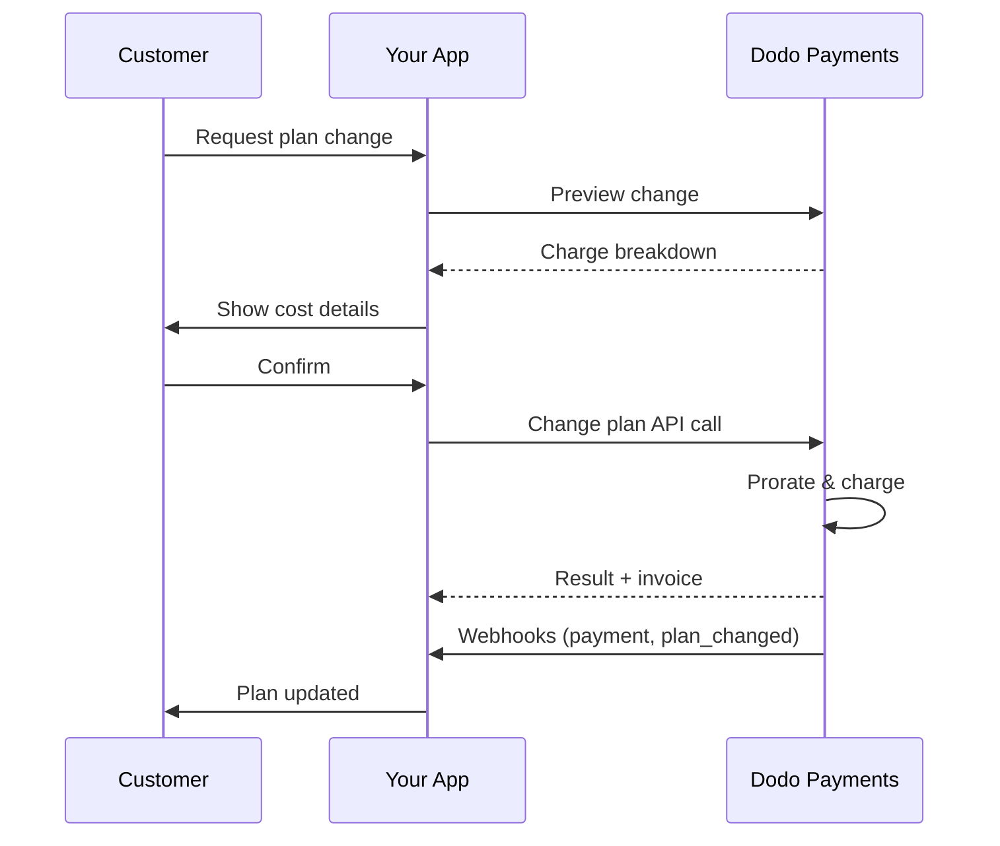

<CardGroup cols={3}>
<Card title="Change Plan API" icon="code" href="/api-reference/subscriptions/change-plan">
  Full API docs for updating subscriptions.
</Card>
<Card title="Plan Change Preview" icon="eye" href="/api-reference/subscriptions/preview-change-plan">
  See charge amounts before changing plans.
</Card>
<Card title="Integration Guide" icon="book" href="/developer-resources/subscription-integration-guide">
  Step-by-step subscription setup.
</Card>
</CardGroup>

## What is a subscription upgrade or downgrade?

Changing plans lets you move a customer between subscription tiers or quantities. Use it to:
- Align pricing with usage or features
- Move from monthly to annual (or vice versa)
- Adjust quantity for seat-based products

<Info>
Plan changes can trigger an immediate charge depending on the proration mode you choose.
</Info>

## When to use plan changes

- Upgrade when a customer needs more features, usage, or seats
- Downgrade when usage decreases
- Migrate users to a new product or price without cancelling their subscription

## Plan Change Flow

## Prerequisites

Before implementing subscription plan changes, ensure you have:

- A Dodo Payments merchant account with active subscription products
- API credentials (API key and webhook secret key) from the dashboard
- An existing active subscription to modify
- Webhook endpoint configured to handle subscription events

<Info>
For detailed setup instructions, see our [Integration Guide](/developer-resources/integration-guide#dashboard-setup).
</Info>

## Step-by-Step Implementation Guide

Follow this comprehensive guide to implement subscription plan changes in your application:

<Steps>
<Step title="Understand Plan Change Requirements">
Before implementing, determine:
- Which subscription products can be changed to which others
- What proration mode fits your business model
- How to handle failed plan changes gracefully
- Which webhook events to track for state management

<Tip>
Test plan changes thoroughly in test mode before implementing in production.
</Tip>
</Step>

<Step title="Choose Your Proration Strategy">
Select the billing approach that aligns with your business needs:

<Tabs>
<Tab title="prorated_immediately">
Best for: SaaS applications wanting to charge fairly for unused time
- Calculates exact prorated amount based on remaining cycle time
- Charges a prorated amount based on unused time remaining in the cycle
- Provides transparent billing to customers
</Tab>

<Tab title="difference_immediately">
Best for: Clear upgrade/downgrade scenarios
- Upgrade: Charge immediate difference (e.g., $30→$80 = charge $50)
- Downgrade: Credit remaining value for future renewals
- Simplifies billing logic and customer communication
</Tab>

<Tab title="full_immediately">
Best for: When you want to reset the billing cycle
- Charges full amount of new plan immediately
- Ignores remaining time from old plan
- Useful for annual to monthly transitions
</Tab>

<Tab title="do_not_bill">
Best for: Free migrations, courtesy switches, or absorbing cost differences
- No charges or credits calculated
- Customer moves to the new plan immediately without any billing adjustment
- Billing cycle remains unchanged
</Tab>
</Tabs>
</Step>

<Step title="Implement the Change Plan API">
Use the Change Plan API to modify subscription details:

<ParamField path="subscription_id" type="string" required>
The ID of the active subscription to modify.
</ParamField>

<ParamField path="product_id" type="string" required>
The new product ID to change the subscription to.
</ParamField>

<ParamField path="quantity" type="integer" default="1">
Number of units for the new plan (for seat-based products).
</ParamField>

<ParamField path="proration_billing_mode" type="string" required>
How to handle immediate billing: `prorated_immediately`, `full_immediately`, `difference_immediately`, or `do_not_bill`.
</ParamField>

<ParamField path="addons" type="array">
Optional addons for the new plan. Leaving this empty removes any existing addons.
</ParamField>

<ParamField path="on_payment_failure" type="string">
Controls behavior when the plan change payment fails:
- `prevent_change`: Keep subscription on current plan until payment succeeds
- `apply_change` (default): Apply plan change immediately regardless of payment outcome

If not specified, uses the business-level default setting.
</ParamField>

Optional rabattkod att tillämpa på den nya planen. Om den anges, validerar och tillämpar rabatten till planändringen. Om den inte anges och abonnemanget har en befintlig rabatt med `preserve_on_plan_change=true`, kommer den befintliga rabatten att behållas (om tillämpligt för den nya produkten).

När man ska tillämpa planändringen:
- `immediately` (standard): Tillämpa planändringen direkt
- `next_billing_date`: Schemalägg ändringen till nästa faktureringsdatum. Kunden behåller sin nuvarande plan tills faktureringsperioden slutar.

Använd `next_billing_date` för nedgraderingar så att kunder behåller de nuvarande planförmånerna tills slutet av faktureringsperioden.

Ställ in hantering av webbhooks för att spåra resultat av planändringar:

- `subscription.active`: Planändring lyckades, abonnemang uppdaterat
- `subscription.plan_changed`: Abonnemangsplan ändrad (uppgradering/nedgradering/tilläggsuppdatering)
- `subscription.on_hold`: Avgift för planändring misslyckades, abonnemang pausat
- `payment.succeeded`: Omedelbar avgift för planändring lyckades
- `payment.failed`: Omedelbar avgift misslyckades

Verifiera alltid webbhooksignaturer och implementera idempotent händelsebearbetning.

Baserat på webbhändelser, uppdatera din applikation:
- Bevilja/upphäv funktioner baserat på ny plan
- Uppdatera kundens instrumentpanel med detaljer om ny plan
- Skicka bekräftelse­mejl om planändringar
- Logga faktureringsändringar för revisionsändamål

Testa noggrant din implementation:
- Testa alla proration-lägen med olika scenarier
- Verifiera att hantering av webbhooks fungerar korrekt
- Övervaka framgångsfrekvenser för planändringar
- Ställ in varningar för misslyckade planändringar

Din implementering av abonnemangsplanändring är nu klar för produktion.

## Förhandsgranska Planändringar

Innan du går vidare med en planändring, använd Preview API för att visa kunder exakt vad de kommer att debiteras:

Använd förhandsvisnings-API:et för att bygga bekräftelsedialogrutor som visar kunder det exakta belopp de kommer att debiteras innan de bekräftar en planändring.

## Ändra Plan API

Använd Ändra Plan API för att ändra produkt, kvantitet och proration-beteende för ett aktivt abonnemang.

### Snabbstartsexempel

Fält som <code>invoice_id</code> och <code>payment_id</code> returneras endast när en omedelbar avgift och/eller faktura skapas under planändringen. Lita alltid på webbhooks för att bekräfta resultat.

Om den omedelbara avgiften misslyckas kan abonnemanget flyttas till `subscription.on_hold` tills betalning lyckas.

## Hantera Tillägg

När du ändrar abonnemangsplaner kan du också ändra tillägg:

Tillägg inkluderas i prorationberäkningen och kommer att debiteras enligt det valda proration-läget.

## Tillämpa Rabattkoder

Du kan tillämpa en rabattkod när du ändrar abonnemangsplaner. Detta är användbart för att erbjuda kampanjpriser på uppgraderingar eller migrationer.

### Rabattbeteende vid planändring

| Scenario | Beteende |
|----------|----------|
| `discount_code` angiven | Validerar och tillämpar rabatten på den nya planen. |
| Ingen kod angiven, befintlig rabatt med `preserve_on_plan_change=true` | Befintlig rabatt bevaras automatiskt om tillämpligt för den nya produkten. |
| Ingen kod angiven, ingen bevarbar rabatt | Ingen rabatt tillämpas på den nya planen. |

Använd [Preview Plan Change API](/api-reference/subscriptions/preview-change-plan) med en `discount_code` för att visa kunder exakt hur mycket de sparar innan de bekräftar planändringen.

## Prorationslägen

Välj hur du ska debitera kunden vid byte av planer:

#### `prorated_immediately`
- Debiterar för den delvisa skillnaden i den aktuella cykeln
- Om i provperiod, debiterar omedelbart och byter till den nya planen nu
- Nedgradering: kan generera en prorated kredit som tillämpas på framtida förnyelser

#### `full_immediately`
- Debiterar full belopp för den nya planen omedelbart
- Ignorerar kvarvarande tid från den gamla planen

Krediter skapade av nedgraderingar med <code>difference_immediately</code> är abonnemangsspecifika och skiljer sig från <a href="/features/credit-based-billing">Credit-Based Billing</a> rättigheter. De tillämpas automatiskt på framtida förnyelser av samma abonnemang och kan inte överföras mellan abonnemang.

#### `difference_immediately`
- Uppgradering: debiterar omedelbart prismellan mellan gamla och nya planer
- Nedgradering: lägger till återstående värde som intern kredit till abonnemanget och tillämpas automatiskt på förnyelser

#### `do_not_bill`
- Inga avgifter eller krediter beräknas
- Kunden byter till den nya planen omedelbart utan någon faktureringsjustering
- Faktureringscykeln förblir oförändrad
- Bäst för artiga migrationer, gratis planskiften, eller att absorbera kostnadsskillnader

| Funktion | `prorated_immediately` | `difference_immediately` | `full_immediately` | `do_not_bill` |
|---------|----------------------|------------------------|-------------------|--------------|
| **Uppgraderingsavgift** | Prorated skillnad för återstående dagar | Fullpris skillnad mellan planer | Fullt nytt planpris | Ingen avgift |
| **Nedgraderingskredit** | Prorated kredit för återstående dagar | Fullpris skillnad som kredit | Ingen kredit | Ingen kredit |
| **Faktureringscykel** | Oförändrad | Oförändrad | Återställs till idag | Oförändrad |
| **Provtidsbeteende** | Avslutar prov, debiterar omedelbart | Avslutar prov, debiterar omedelbart | Avslutar prov, debiterar fullt belopp | Avslutar prov, ingen avgift |
| **Bäst för** | Rättvis tidsbaserad fakturering | Enkla uppgradering/nedgradering avdrag | Återställa faktureringscykler | Gratis migrationer eller artiga skiften |
| **Komplexitet** | Medium (dagberäkning) | Låg (enkel subtraktion) | Låg (full avgift) | Ingen |

### Exempelscenarier

Använd dessa kanoniska nummer konsekvent:
- Nuvarande plan: **Basic** på **$30/månad**
- Uppgraderingsmål: **Pro** på **$80/månad**
- Nedgraderingsmål (från Pro): **Starter** på **$20/månad**
- Faktureringscykel: **30 dagar**, började på **1 januari**
- Planändring sker den **16 januari** (15 dagar kvar, 15 dagar förbrukade)

### Hur varje läge hanterar fakturering

Välj `prorated_immediately` för rättvistidsredovisning; välj `full_immediately` för att starta om faktureringen; använd `difference_immediately` för enkla uppgraderingar och automatisk kredit vid nedgraderingar; eller använd `do_not_bill` för att byta planer utan faktureringsjustering.

## Hantera Betalningsfel

Kontrollera vad som händer när en plan­ändringsbetalning misslyckas med hjälp av `on_payment_failure`-parametern.

### Betalningsfel Lägen

**Beteende**: Behåll abonnemanget på sin nuvarande plan tills betalning lyckas.

- Planändringen markeras som "pågående"
- Kunden behåller tillgång till sin nuvarande plan
- Abonnemanget flyttas till `active` tillstånd först efter framgångsrik betalning
- Användbart när du vill säkerställa betalning innan du beviljar uppgraderade funktioner

**Beteende**: Tillämpa plan­ändringen omedelbart oavsett betalningsresultat.

- Planändringen tillämpas även om betalningen misslyckas
- Kunden får omedelbar tillgång till den nya planen
- Abonnemanget kan flyttas till `on_hold` om betalning misslyckas
- Bra för icke-kritiska uppgraderingar eller när du litar på kunden

Om inte angivet, använder `on_payment_failure`-parametern din verksamhets standardinställning som är konfigurerad i instrumentpanelen.

### När man ska använda varje läge

| Scenario | Rekommenderad Läge | Anledning |
|----------|--------------------|-----------|
| Uppgradering till premiumfunktioner | `prevent_change` | Säkerställ betalning innan du ger tillgång |
| Kvantitetsökning (fler platser) | `prevent_change` | Förhindra användning utan betalning |
| Nedgradering av planer | `apply_change` | Kunden minskar utgifter |
| Betrodda företagskunder | `apply_change` | Lägre risk för obetalning |
| Övergång från prov till betald | `prevent_change` | Kritisk betalningsmoment |

## Hantera webhooks

Spåra abonnemangstillstånd genom webhooks för att bekräfta plan­ändringar och betalningar.

### Händelsetyper att hantera
- `subscription.active`: abonnemang aktiverat
- `subscription.plan_changed`: abonnemangsplan ändrad (uppgradering/nedgradering/tilläggs­ändringar)
- `subscription.on_hold`: avgift misslyckades, abonnemang pausat
- `subscription.renewed`: förnyelse lyckades
- `payment.succeeded`: betalning för planändring eller förnyelse lyckades
- `payment.failed`: betalning misslyckades

Vi rekommenderar att driva affärslogik från abonnemangshändelser och använder betalningshändelser för bekräftelse och avstämning.

### Verifiera signaturer och hantera syften

För detaljerade nyttolastscheman, se <a href="/developer-resources/webhooks/intents/subscription">Abonnemangets webbhooks-nyttolaster</a> och <a href="/developer-resources/webhooks/intents/payment">Betalnings webbhooks-nyttolaster</a>.

## Bästa praxis

Följ dessa rekommendationer för tillförlitliga abonnemangsplanändringar:

### Planändringsstrategi
- **Testa noggrant**: Testa alltid planändringar i testläge innan produktion
- **Välj proration noggrant**: Välj proration-läget som stämmer överens med din affärsmodell
- **Hantera fel graciöst**: Implementera korrekt felhantering och återförsökslogik
- **Övervaka framgångsfrekvenser**: Spåra framgångs-/misslyckandefrekvenser för planändringar och undersök problem

### Implementering av webhooks
- **Verifiera signaturer**: Validera alltid webhooksignaturer för att säkerställa äkthet
- **Implementera idempotens**: Hantera dubbletter av webhooks graciöst
- **Bearbeta asynkront**: Blockera inte webhook-svar med tunga operationer
- **Logga allt**: Upprätthålla detaljerade loggar för felsökning och revisionsändamål

### Användarupplevelse
- **Kommunicera tydligt**: Informera kunder om faktureringsändringar och tidsplaner
- **Ge bekräftelser**: Skicka e-postbekräftelser för lyckade planändringar
- **Hantera kantfall**: Överväg provperioder, prorationer och misslyckade betalningar
- **Uppdatera gränssnittet omedelbart**: Återspegla planändringar i din applikationsgränssnitt

## Vanliga problem och lösningar

Lös typiska problem som uppstår vid abonnemangsplanändringar:

**Symtom**: API-anrop lyckas men abonnemanget kvarstår på den gamla planen

**Vanliga orsaker**:
- Webbhooks-behandling misslyckades eller fördröjdes
- Applikationstillståndet uppdaterades inte efter mottagning av webhooks
- Databastransaktionsproblem under statusuppdatering

**Lösningar**:
- Implementera robust hantering av webhooks med återförsökslogik
- Använd idempotenta operationer för statusuppdateringar
- Lägg till övervakning för att upptäcka och varna vid missade webhook-händelser
- Verifiera att webhook-endpunkten är tillgänglig och svarar korrekt

**Symtom**: Kund nedgraderar men ser inte saldo för kredit

**Vanliga orsaker**:
- Proration läge förväntningar: nedgraderar ger full planprisskillnad med `difference_immediately`, medan `prorated_immediately` skapar en prorated kredit baserad på återstående tid i cykeln
- Kredit är abonnemangsspecifik och överförs inte mellan abonnemang
- Creditsaldo ej synligt på kundens instrumentpanel

**Lösningar**:
- Använd `difference_immediately` vid nedgraderingar om du vill ha automatiska krediter
- Förklara för kunder att krediter tillämpas på framtida förnyelser av samma abonnemang
- Implementera kundportal för att visa kreditsaldon
- Kontrollera nästa fakturaförhandsvisning för att se tillämpade krediter

**Symtom**: Webhooks-händelser avvisades på grund av ogiltig signatur

**Vanliga orsaker**:
- Felaktig webhook hemlig nyckel
- Råbegärande kropp ändrad före signaturverifiering
- Fel signaturverifieringsalgoritm

**Lösningar**:
- Verifiera att du använder korrekt `DODO_WEBHOOK_SECRET` från instrumentpanelen
- Läs råbegärande kroppen före JSON-parsing middleware
- Använd standard webhooks-verifieringsbibliotek för din plattform
- Testa verifiering av webhooksignatur i utvecklingsmiljö

**Symtom**: API returnerar 422 Unprocessable Entity-fel

**Vanliga orsaker**:
- Ogiltig abonnemangs-ID eller produkt-ID
- Abonnemang ej i aktivt tillstånd
- Saknade obligatoriska parametrar
- Produkt ej tillgänglig för planändringar

**Lösningar**:
- Kontrollera att abonnemanget finns och är aktivt
- Kontrollera produkt-ID är giltigt och tillgängligt
- Säkerställ att alla nödvändiga parametrar tillhandahålls
- Granska API-dokumentationen för parameterkrav

**Symtom**: Planändringsinitiativ men omedelbar avgift misslyckas

**Vanliga orsaker**:
- Otillräckliga medel på kundens betalningsmetod
- Betalningsmetod utgången eller ogiltig
- Banken avslog transaktionen
- Bedrägeribekämpning blockerade avgiften

**Lösningar**:
- Hantera `payment.failed` webhook-händelser korrekt
- Informera kunden att uppdatera betalningsmetod
- Implementera återförsökslogik för tillfälliga fel
- Överväg att tillåta planändringar med misslyckade omedelbara avgifter

**Symtom**: Planändringsavgift misslyckas och abonnemang flyttas till `on_hold`-tillstånd

**Vad händer**:
När en planändringsavgift misslyckas placeras abonnemanget automatiskt i `on_hold`-tillstånd. Abonnemanget kommer inte att förnyas automatiskt förrän betalningsmetoden uppdateras.

**Lösning**: Uppdatera betalningsmetoden för att återaktivera abonnemanget

För att återaktivera ett abonnemang från `on_hold`-tillstånd efter en misslyckad planändring:

1. **Uppdatera betalningsmetoden** genom att använda Uppdatera Betalningsmetod API
2. **Automatisk avgiftsskapande**: API:et skapar automatiskt en avgift för utestående skulder
3. **Fakturagenerering**: En faktura genereras för avgiften
4. **Betalningsbearbetning**: Betalningen bearbetas med den nya betalningsmetoden
5. **Återaktivering**: Vid lyckad betalning återaktiveras abonnemanget till `active`-tillstånd

**Webhooks-händelser att övervaka**:
- `subscription.on_hold`: Abonnemang placerat i vänteläge (mottagen när planändringsavgift misslyckas)
- `payment.succeeded`: Betalning för utestående skulder lyckades (efter uppdatering av betalningsmetod)
- `subscription.active`: Abonnemang återaktiverat efter lyckad betalning

**Bästa praxis**:
- Informera kunder direkt när en planändringsavgift misslyckas
- Ge tydliga instruktioner om hur de uppdaterar sin betalningsmetod
- Övervaka webhook-händelser för att spåra återaktiveringsstatus
- Överväg att implementera automatisk återförsökslogik för tillfälliga betalningsfel

Visa den kompletta API-dokumentationen för att uppdatera betalningsmetoder och återaktivera abonnemang.

## Testa din Implementering

Följ dessa steg för att grundligt testa din implementering av abonnemangsplanändringar:

- Använd test-API-nycklar och testprodukter
- Skapa testabonnemang med olika plantyper
- Konfigurera test-webhook-endpunkt
- Ställ in övervakning och loggning

- Testa `prorated_immediately` med olika faktureringscykelpositioner
- Testa `difference_immediately` för uppgraderingar och nedgraderingar
- Testa `full_immediately` för att återställa faktureringscykler
- Testa `do_not_bill` för planskiften utan avgift eller kredit
- Verifiera att kreditberäkningarna är korrekta

- Verifiera att alla relevanta webbhinelsers-meddelanden tas emot
- Testa verifiering av webbhinelserss-signaturer
- Hantera dubbletter av webbhinelsers elegant
- Testa scenario för misslyckande av webbhinelsersbearbetning

- Testa med ogiltiga abonnemangs-ID:n
- Testa med utgångna betalningsmetoder
- Testa nätverksfel och tidsgränser
- Testa med otillräckliga medel

- Ställ in varningar för misslyckade planändringar
- Övervaka behandlingstider för webbhinelser
- Spåra framgångsfrekvenser för planändringar
- Granska kundsupportärenden för planändringsproblem

## Felhantering

Hantera vanliga API-fel graciöst i din implementering:

### HTTP Statuskoder

Planändringsbegäran bearbetades framgångsrikt. Abonnemanget uppdateras och betalningsbearbetning har börjat.

Ogiltiga begärandeparametrar. Kontrollera att alla nödvändiga fält är tillhandahållna och korrekt formaterade.

Ogiltig eller saknad API-nyckel. Verifiera att din `DODO_PAYMENTS_API_KEY` är korrekt och har rätt behörigheter.

Abonnemangs-ID hittades inte eller tillhör inte ditt konto.

Abonnemanget kan inte ändras (t.ex. redan avlyst, produkt ej tillgänglig, etc.).

Serverfel inträffade. Försök begäran igen efter en kort fördröjning.

### Felsvarsformat

## Nästa steg

- Granska <a href="/api-reference/subscriptions/change-plan">Ändra Plan API</a>
- Utforska <a href="/features/credit-based-billing">Kreditbaserad Fakturering</a>
- Implementera varningar för `subscription.on_hold`
- Ta en titt på vår <a href="/developer-resources/webhooks">Guide för Webhooks Integration</a>
