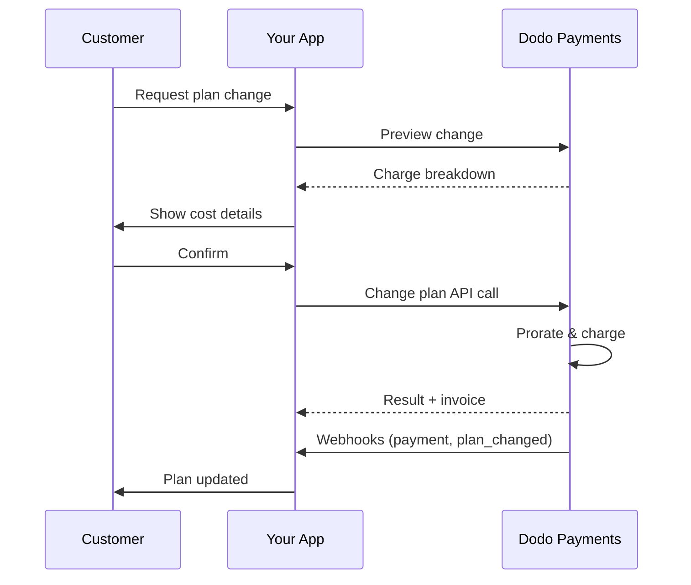
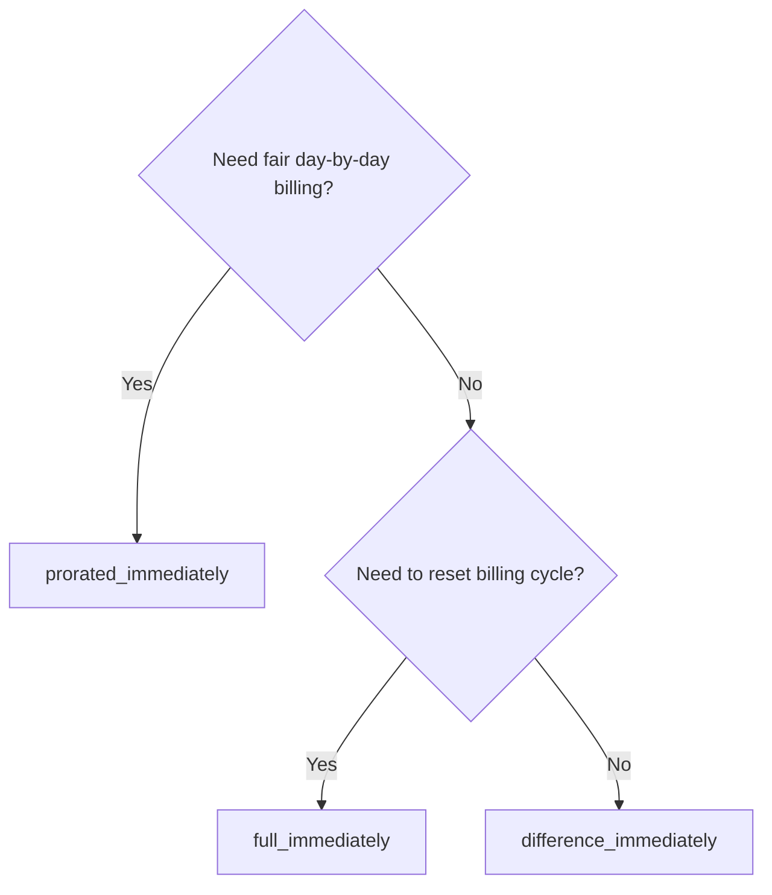
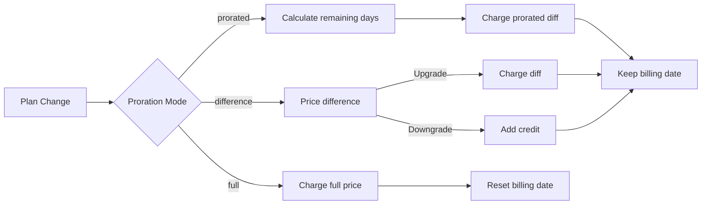

<CardGroup cols={3}>
<Card title="Change Plan API" icon="code" href="/api-reference/subscriptions/change-plan">
  Full API docs for updating subscriptions.
</Card>
<Card title="Plan Change Preview" icon="eye" href="/api-reference/subscriptions/preview-change-plan">
  Se beloppet som debiteras innan du ändrar planer.
</Card>
<Card title="Integration Guide" icon="book" href="/developer-resources/subscription-integration-guide">
  Steg-för-steg-guide för prenumerationsinställningar.
</Card>
</CardGroup>

## Vad är en prenumerationsuppgradering eller nedgradering?

Att ändra planer låter dig flytta en kund mellan prenumerationstrappor eller kvantiteter. Använd det för att:
- Justera priserna i förhållande till användning eller funktioner
- Gå från månadsvis till årlig (eller vice versa)
- Justera kvantitet för produkterna baserade på platser

<Info>
Planändringar kan utlösa en omedelbar debitering beroende på prorationläget du väljer.
</Info>

## När ska man använda planändringar

- Uppgradera när en kund behöver fler funktioner, användning eller platser
- Nedgradera när användningen minskar
- Migrera användare till en ny produkt eller pris utan att avbryta deras prenumeration

## Planändringsflöde



## Förutsättningar

Innan du implementerar ändringar av prenumerationsplaner, se till att du har:

- Ett Dodo Payments-handelskonto med aktiva prenumerationsprodukter
- API-referenser (API-nyckel och webhook-hemlig nyckel) från instrumentpanelen
- En befintlig aktiv prenumeration att modifiera
- Webhook-slutpunkt konfigurerad för att hantera prenumerationsevenemang

<Info>
För detaljerade installationsinstruktioner, se vår [Integrationsguide](/developer-resources/integration-guide#dashboard-setup).
</Info>

## Steg-för-steg-implementeringsguide

Följ denna omfattande guide för att implementera ändringar av prenumerationsplaner i din applikation:

<Steps>
<Step title="Förstå kraven för planändring">
Innan du implementerar, bestäm:
- Vilka prenumerationsprodukter som kan ändras till vilka andra
- Vilken proration som passar din affärsmodell
- Hur man hanterar misslyckade planändringar på ett smidigt sätt
- Vilka webhook-händelser som ska spåras för tillståndshantering

<Tip>
Testa planändringar noggrant i testläge innan du implementerar i produktion.
</Tip>
</Step>

<Step title="Välj din prorationstrategi">
Välj den faktureringsmetod som stämmer överens med dina affärsbehov:

<Tabs>
<Tab title="prorated_immediately">
Bäst för: SaaS-applikationer som vill ta betalt rättvist för oanvänd tid
- Beräknar exakt proraterat belopp baserat på återstående cykeltid
- Debiterar ett proraterat belopp baserat på oanvänd tid som återstår i cykeln
- Ger transparent fakturering till kunder
</Tab>

<Tab title="difference_immediately">
Bäst för: Tydliga uppgraderings-/nedgraderingsscenarier
- Uppgradering: Debiterar omedelbar skillnad (t.ex. $30→$80 = debiterar $50)
- Nedgradering: Kreditera återstående värde för framtida förnyelser
- Förenklar faktureringslogik och kundkommunikation
</Tab>

<Tab title="full_immediately">
Bäst för: När du vill återställa faktureringscykeln
- Debiterar hela beloppet för den nya planen omedelbart
- Ignorerar återstående tid från den gamla planen
- Användbart för övergångar från årlig till månadsvis
</Tab>
</Tabs>
</Step>

<Step title="Implementera Change Plan API">
Använd Change Plan API för att modifiera prenumerationsdetaljer:

<ParamField path="subscription_id" type="string" required>
ID för den aktiva prenumerationen som ska modifieras.
</ParamField>

<ParamField path="product_id" type="string" required>
Det nya produkt-ID:t som prenumerationen ska ändras till.
</ParamField>

<ParamField path="quantity" type="integer" default="1">
Antal enheter för den nya planen (för produktbaserade platser).
</ParamField>

<ParamField path="proration_billing_mode" type="string" required>
Hur man hanterar omedelbar fakturering: `prorated_immediately`, `full_immediately`, eller `difference_immediately`.
</ParamField>

<ParamField path="addons" type="array">
Valfria tillägg för den nya planen. Att lämna detta tomt tar bort alla befintliga tillägg.
</ParamField>

<ParamField path="on_payment_failure" type="string">
Kontrollerar beteendet när betalningen för planändringen misslyckas:
- `prevent_change`: Behåll prenumerationen på den aktuella planen tills betalningen lyckas
- `apply_change` (standard): Tillämpa planändringen omedelbart oavsett betalningsresultat

Om den inte anges används standardinställningen på företagsnivå.
</ParamField>
</Step>

<Step title="Hantering av Webhook-händelser">
Ställ in webhook-hantering för att spåra resultaten av planändringar:

- `subscription.active`: Planändring lyckad, prenumeration uppdaterad
- `subscription.plan_changed`: Prenumerationsplan ändrad (uppgradering/nedgradering/tilläggsuppdatering)
- `subscription.on_hold`: Debitering för planändring misslyckades, prenumeration pausad
- `payment.succeeded`: Omedelbar debitering för planändring lyckad
- `payment.failed`: Omedelbar debitering misslyckades

<Warning>
Verifiera alltid webhook-signaturer och implementera idempotent händelsebehandling.
</Warning>
</Step>

<Step title="Uppdatera din applikationstillstånd">
Baserat på webhook-händelser, uppdatera din applikation:
- Bevilja/återkalla funktioner baserat på ny plan
- Uppdatera kundens instrumentpanel med nya plandetaljer
- Skicka bekräftelse-e-post om planändringar
- Logga fakturaförändringar för revisionsändamål
</Step>

<Step title="Testa och övervaka">
Testa din implementation noggrant:
- Testa alla prorationlägen med olika scenarier
- Verifiera att webhook-hanteringen fungerar korrekt
- Övervaka framgångsfrekvenser för planändringar
- Ställ in varningar för misslyckade planändringar

<Check>
Din implementation av planändringar för prenumerationer är nu redo för produktionsanvändning.
</Check>
</Step>
</Steps>

## Förhandsgranska planändringar

Innan du åtar dig en planändring, använd Förhandsgransknings-API för att visa kunder exakt vad de kommer att debiteras:

<Tabs>
<Tab title="Node.js SDK">

```javascript
const preview = await client.subscriptions.previewChangePlan('sub_123', {
  product_id: 'prod_pro',
  quantity: 1,
  proration_billing_mode: 'prorated_immediately'
});

// Show customer the charge before confirming
console.log('Immediate charge:', preview.immediate_charge.summary);
console.log('New plan details:', preview.new_plan);
```

</Tab>

<Tab title="Python SDK">

```python
preview = client.subscriptions.preview_change_plan(
    subscription_id="sub_123",
    product_id="prod_pro",
    quantity=1,
    proration_billing_mode="prorated_immediately"
)

# Show customer the charge before confirming
print("Immediate charge:", preview.immediate_charge.summary)
print("New plan details:", preview.new_plan)
```

</Tab>
</Tabs>

<Tip>
Använd förhandsgransknings-API för att bygga bekräftelsesdialoger som visar kunder det exakta beloppet de kommer att debiteras innan de bekräftar en planändring.
</Tip>

## Ändra plan API

Använd Ändra plan API för att modifiera produkt, kvantitet och prorationbeteende för en aktiv prenumeration.

### Snabbstartsexempel

<Tabs>
  <Tab title="Node.js SDK">

    ```javascript
    import DodoPayments from 'dodopayments';

    const client = new DodoPayments({
      bearerToken: process.env.DODO_PAYMENTS_API_KEY,
      environment: 'test_mode', // defaults to 'live_mode'
    });

    async function changePlan() {
      const result = await client.subscriptions.changePlan('sub_123', {
        product_id: 'prod_new',
        quantity: 3,
        proration_billing_mode: 'prorated_immediately',
        on_payment_failure: 'prevent_change', // Optional: control behavior on payment failure
      });
      console.log(result.status, result.invoice_id, result.payment_id);
    }

    changePlan();
    ```

  </Tab>
  <Tab title="Python SDK">

    ```python
    import os
    from dodopayments import DodoPayments

    client = DodoPayments(
        bearer_token=os.environ.get("DODO_PAYMENTS_API_KEY"),
        environment="test_mode",  # defaults to "live_mode"
    )

    result = client.subscriptions.change_plan(
        subscription_id="sub_123",
        product_id="prod_new",
        quantity=3,
        proration_billing_mode="prorated_immediately",
        on_payment_failure="prevent_change",  # Optional: control behavior on payment failure
    )
    print(result.status, result.get("invoice_id"), result.get("payment_id"))
    ```

  </Tab>
  <Tab title="Go SDK">

    ```go
    package main

    import (
      "context"
      "fmt"
      "github.com/dodopayments/dodopayments-go"
      "github.com/dodopayments/dodopayments-go/option"
    )

    func main() {
      client := dodopayments.NewClient(option.WithBearerToken("YOUR_TOKEN"))
      res, err := client.Subscriptions.ChangePlan(context.TODO(), dodopayments.SubscriptionChangePlanParams{
        SubscriptionID: dodopayments.F("sub_123"),
        ProductID:             dodopayments.F("prod_new"),
        Quantity:              dodopayments.F(int64(3)),
        ProrationBillingMode:  dodopayments.F(dodopayments.SubscriptionChangePlanParamsProrationBillingModeProratedImmediately),
        OnPaymentFailure:      dodopayments.F(dodopayments.OnPaymentFailurePreventChange), // Optional
      })
      if err != nil { panic(err) }
      fmt.Println(res.Status, res.InvoiceID, res.PaymentID)
    }
    ```

  </Tab>
  <Tab title="HTTP">

    ```bash
    curl -X POST "$DODO_API_BASE/subscriptions/sub_123/change-plan" \
      -H "Authorization: Bearer $DODO_PAYMENTS_API_KEY" \
      -H "Content-Type: application/json" \
      -d '{
        "product_id": "prod_new",
        "quantity": 3,
        "proration_billing_mode": "prorated_immediately",
        "on_payment_failure": "prevent_change"
      }'
    ```

  </Tab>
</Tabs>

```json Success
{
  "status": "processing",
  "subscription_id": "sub_123",
  "invoice_id": "inv_789",
  "payment_id": "pay_456",
  "proration_billing_mode": "prorated_immediately"
}
```

<Note>
Fält som <code>invoice_id</code> och <code>payment_id</code> returneras endast när en omedelbar debitering och/eller faktura skapas under planändringen. Lita alltid på webhook-händelser (t.ex. <code>payment.succeeded</code>, <code>subscription.plan_changed</code>) för att bekräfta resultat.
</Note>

<Warning>
Om den omedelbara debiteringen misslyckas kan prenumerationen flyttas till `subscription.on_hold` tills betalningen lyckas.
</Warning>

## Hantera tillägg

När du ändrar prenumerationer kan du också modifiera tillägg:

```javascript
// Add addons to the new plan
await client.subscriptions.changePlan('sub_123', {
  product_id: 'prod_new',
  quantity: 1,
  proration_billing_mode: 'difference_immediately',
  addons: [
    { addon_id: 'addon_123', quantity: 2 }
  ]
});

// Remove all existing addons
await client.subscriptions.changePlan('sub_123', {
  product_id: 'prod_new',
  quantity: 1,
  proration_billing_mode: 'difference_immediately',
  addons: [] // Empty array removes all existing addons
});
```

<Info>
Tillägg ingår i prorationberäkningen och debiteras enligt det valda prorationläget.
</Info>

## Prorationlägen

Välj hur du debiterar kunden när du ändrar planer:

#### `prorated_immediately`
- Debiterar den delvisa skillnaden i den aktuella cykeln
- Om i provperiod debiterar den omedelbart och växlar till den nya planen nu
- Nedgradering: kan generera en proraterad kredit som tillämpas på framtida förnyelser

#### `full_immediately`
- Debiterar det fulla beloppet för den nya planen omedelbart
- Ignorerar återstående tid från den gamla planen

<Info>
Krediter som skapas genom nedgradering med <code>difference_immediately</code> är prenumerationsspecifika och skilda från <a href="/features/customer-credit">Kundkrediter</a>. De tillämpas automatiskt på framtida förnyelser av samma prenumeration och är inte överförbara mellan prenumerationer.
</Info>

#### `difference_immediately`
- Uppgradering: debiterar omedelbart prisdifferensen mellan gamla och nya planer
- Nedgradering: lägger till återstående värde som intern kredit till prenumerationen och tillämpar automatiskt på förnyelser

| Funktion | `prorated_immediately` | `difference_immediately` | `full_immediately` |
|---------|----------------------|------------------------|-------------------|
| **Uppgraderingsdebitering** | Proraterad skillnad för återstående dagar | Full pricemellan planerna | Full prispå den nya planen |
| **Nedgraderingskredit** | Proraterad kredit för återstående dagar | Full prisskillnad som kredit | Ingen kredit |
| **Faktureringscykel** | Oförändrad | Oförändrad | Nollställs till idag |
| **Provsats** | Avslutar provperiod, debiterar omedelbart | Avslutar provperiod, debiterar omedelbart | Avslutar provperiod, debiterar hela beloppet |
| **Bäst för** | Rättvis tidsbaserad fakturering | Enkel uppgraderings-/nedgraderingsmatematik | Återställning av faktureringscykler |
| **Komplexitet** | Medium (dagberäkning) | Låg (enkel subtraktion) | Låg (full debitering) |



### Exempel på scenarier

Använd dessa kanoniska nummer konsekvent:
- Aktuell plan: **Basis** vid **$30/månad**
- Uppgradering mål: **Pro** vid **$80/månad**
- Nedgradering mål (från Pro): **Starter** vid **$20/månad**
- Faktureringscykel: **30 dagar**, startade den **1 januari**
- Planändringen sker den **16 januari** (15 dagar kvar, 15 dagar använda)

<AccordionGroup>
  <Accordion title="Uppgradering: Basis ($30) → Pro ($80) med prorated_immediately">

    ```
    Step 1: Calculate unused credit from current plan
      Unused days = 15 out of 30 days
      Credit = $30 × (15/30) = $15.00

    Step 2: Calculate prorated cost of new plan
      Remaining days = 15 out of 30 days
      New plan cost = $80 × (15/30) = $40.00

    Step 3: Calculate immediate charge
      Charge = New plan cost − Credit
      Charge = $40.00 − $15.00 = $25.00

    → Customer pays $25.00 now
    → Next renewal (Feb 1): $80.00/month
    ```

    ```javascript
    await client.subscriptions.changePlan('sub_123', {
      product_id: 'prod_pro',
      quantity: 1,
      proration_billing_mode: 'prorated_immediately'
    })
    ```

  </Accordion>

  <Accordion title="Nedgradering: Pro ($80) → Starter ($20) med prorated_immediately">

    ```
    Step 1: Calculate unused credit from current plan
      Unused days = 15 out of 30 days
      Credit = $80 × (15/30) = $40.00

    Step 2: Calculate prorated cost of new plan
      Remaining days = 15 out of 30 days
      New plan cost = $20 × (15/30) = $10.00

    Step 3: Calculate credit balance
      Credit = $40.00 − $10.00 = $30.00

    → No charge — $30.00 credit added to subscription
    → Credit auto-applies to future renewals
    → Next renewal (Feb 1): $20.00 − $30.00 credit = $0.00
    → Following renewal (Mar 1): $20.00 − $10.00 remaining credit = $10.00
    ```

    ```javascript
    await client.subscriptions.changePlan('sub_123', {
      product_id: 'prod_starter',
      quantity: 1,
      proration_billing_mode: 'prorated_immediately'
    })
    ```

  </Accordion>

  <Accordion title="Uppgradering: Basis ($30) → Pro ($80) med difference_immediately">

    ```
    Immediate charge = New plan price − Old plan price
                     = $80 − $30
                     = $50.00

    → Customer pays $50.00 now (regardless of cycle position)
    → Next renewal (Feb 1): $80.00/month
    ```

    ```javascript
    await client.subscriptions.changePlan('sub_123', {
      product_id: 'prod_pro',
      quantity: 1,
      proration_billing_mode: 'difference_immediately'
    })
    ```

  </Accordion>

  <Accordion title="Nedgradering: Pro ($80) → Starter ($20) med difference_immediately">

    ```
    Credit = Old plan price − New plan price
           = $80 − $20
           = $60.00

    → No charge — $60.00 credit added to subscription
    → Credit auto-applies to future renewals
    → Next renewal: $20.00 − $20.00 (from credit) = $0.00
    → Following renewal: $20.00 − $20.00 (from credit) = $0.00
    → Third renewal: $20.00 − $20.00 (from remaining credit) = $0.00
    ```

    ```javascript
    await client.subscriptions.changePlan('sub_123', {
      product_id: 'prod_starter',
      quantity: 1,
      proration_billing_mode: 'difference_immediately'
    })
    ```

  </Accordion>

  <Accordion title="Uppgradering: Basis ($30) → Pro ($80) med full_immediately">

    ```
    Immediate charge = Full new plan price = $80.00

    → Customer pays $80.00 now
    → No credit for unused time on old plan
    → Billing cycle resets to today (January 16)
    → Next renewal: February 16 at $80.00/month
    ```

    ```javascript
    await client.subscriptions.changePlan('sub_123', {
      product_id: 'prod_pro',
      quantity: 1,
      proration_billing_mode: 'full_immediately'
    })
    ```

  </Accordion>

  <Accordion title="Uppgradering mitt cykeln med tillägg som använder prorated_immediately">

    ```
    Current: Basic plan ($30/month), no add-ons
    New: Pro plan ($80/month) + Extra Seats add-on ($10/seat × 3 seats = $30/month)
    Change on day 16 of 30 (15 days remaining)

    Step 1: Credit from current plan
      Credit = $30 × (15/30) = $15.00

    Step 2: Prorated cost of new plan + add-ons
      New plan = $80 × (15/30) = $40.00
      Add-ons = $30 × (15/30) = $15.00
      Total new = $55.00

    Step 3: Immediate charge
      Charge = $55.00 − $15.00 = $40.00

    → Customer pays $40.00 now
    → Next renewal: $80.00 + $30.00 = $110.00/month
    ```

    ```javascript
    await client.subscriptions.changePlan('sub_123', {
      product_id: 'prod_pro',
      quantity: 1,
      proration_billing_mode: 'prorated_immediately',
      addons: [
        { addon_id: 'addon_seats', quantity: 3 }
      ]
    })
    ```

  </Accordion>
</AccordionGroup>

### Hur varje läge behandlar fakturering



<Tip>
Välj `prorated_immediately` för rättvis tidredovisning; välj `full_immediately` för att återstarta faktureringen; använd `difference_immediately` för enkla uppgraderingar och automatiskt kredit på nedgraderingar.
</Tip>

## Hantering av betalningsmisslyckanden

Kontrollera vad som händer när en betalning för planändringen misslyckas med hjälp av parameter `on_payment_failure`.

### Betalningsmisslyckandelägen

<Tabs>
<Tab title="prevent_change (Rekommenderas för kritiska uppgraderingar)">
**Beteende**: Behåll prenumerationen på sin aktuella plan tills betalningen lyckas.

- Planändringen markeras som "pendande"
- Kunden behåller tillgång till sin nuvarande plan
- Prenumerationen flyttas till `active`-tillstånd först efter lyckad betalning
- Användbart när du vill säkerställa betalning innan du beviljar uppgraderade funktioner

```javascript
await client.subscriptions.changePlan('sub_123', {
  product_id: 'prod_pro',
  quantity: 1,
  proration_billing_mode: 'prorated_immediately',
  on_payment_failure: 'prevent_change'
});
```

</Tab>

<Tab title="apply_change (Standard)">
**Beteende**: Tillämpa planändringen omedelbart oavsett betalningsresultat.

- Planändringen tillämpas även om betalningen misslyckas
- Kunden får omedelbar tillgång till den nya planen
- Prenumerationen kan flyttas till `on_hold` om betalningen misslyckas
- Bra för icke-kritiska uppgraderingar eller när du litar på kunden

```javascript
await client.subscriptions.changePlan('sub_123', {
  product_id: 'prod_pro',
  quantity: 1,
  proration_billing_mode: 'prorated_immediately',
  on_payment_failure: 'apply_change' // This is the default
});
```

</Tab>
</Tabs>

<Info>
Om den inte anges använder parametern `on_payment_failure` din företagsnivå standardinställning konfigurerad i dashboarden.
</Info>

### När du ska använda varje läge

| Scenario | Rekommenderat läge | Orsak |
|----------|------------------|--------|
| Uppgradering till premiumfunktioner | `prevent_change` | Säkerställ betalning innan åtkomst beviljas |
| Ökning av kvantitet (fler platser) | `prevent_change` | Förhindra användning utan betalning |
| Nedgradera planer | `apply_change` | Kunden minskar utgifterna |
| Betrodda företagskunder | `apply_change` | Lägre risk för bristande betalning |
| Konvertering från provperiod till betald | `prevent_change` | Kritiskt betalningsmoment |

## Hantering av webhooks

Spåra prenumerationstillstånd genom webhooks för att bekräfta planändringar och betalningar.

### Händelsetyper att hantera
- `subscription.active`: prenumeration aktiverad
- `subscription.plan_changed`: prenumerationsplan ändrad (uppgradering/nedgradering/tilläggsändringar)
- `subscription.on_hold`: debitering misslyckades, prenumeration pausad
- `subscription.renewed`: förnyelse lyckad
- `payment.succeeded`: betalning för planändring eller förnyelse lyckad
- `payment.failed`: betalning misslyckades

<Info>
Vi rekommenderar att köra affärslogik från prenumerationsevenemang och använda betalningsevenemang för bekräftelse och avstämning.
</Info>

### Verifiera signaturer och hantera avsikter

<Tabs>
  <Tab title="Next.js Route Handler">

    ```javascript
    import { NextRequest, NextResponse } from 'next/server';
    
    export async function POST(req) {
      const webhookId = req.headers.get('webhook-id');
      const webhookSignature = req.headers.get('webhook-signature');
      const webhookTimestamp = req.headers.get('webhook-timestamp');
      const secret = process.env.DODO_WEBHOOK_SECRET;
    
      const payload = await req.text();
      // verifySignature is a placeholder – in production, use a Standard Webhooks library
      const { valid, event } = await verifySignature(
        payload,
        { id: webhookId, signature: webhookSignature, timestamp: webhookTimestamp },
        secret
      );
      if (!valid) return NextResponse.json({ error: 'Invalid signature' }, { status: 400 });
    
      switch (event.type) {
        case 'subscription.active':
          // mark subscription active in your DB
          break;
        case 'subscription.plan_changed':
          // refresh entitlements and reflect the new plan in your UI
          break;
        case 'subscription.on_hold':
          // notify user to update payment method
          break;
        case 'subscription.renewed':
          // extend access window
          break;
        case 'payment.succeeded':
          // reconcile payment for plan change
          break;
        case 'payment.failed':
          // log and alert
          break;
        default:
          // ignore unknown events
          break;
      }
    
      return NextResponse.json({ received: true });
    }
    ```

  </Tab>
  <Tab title="Express.js">

    ```javascript
    import express from 'express';
    
    const app = express();
    app.post('/webhooks/dodo', express.raw({ type: 'application/json' }), async (req, res) => {
      const webhookId = req.header('webhook-id');
      const webhookSignature = req.header('webhook-signature');
      const webhookTimestamp = req.header('webhook-timestamp');
      const secret = process.env.DODO_WEBHOOK_SECRET;
      const payload = req.body.toString('utf8');
    
      const { valid, event } = await verifySignature(
        payload,
        { id: webhookId, signature: webhookSignature, timestamp: webhookTimestamp },
        secret
      );
      if (!valid) return res.status(400).send('Invalid signature');
    
      // handle events like above
      res.json({ received: true });
    });
    
    app.listen(3000);
    ```

  </Tab>
</Tabs>

<Note>
För detaljerade payload-scheman, se <a href="/developer-resources/webhooks/intents/subscription">Prenumerations-webhook-payloads</a> och <a href="/developer-resources/webhooks/intents/payment">Betalnings-webhook-payloads</a>.
</Note>

## Bästa praxis

Följ dessa rekommendationer för pålitliga prenumerationsplanändringar:

### Planändringsstrategi
- **Testa grundligt**: Testa alltid planändringar i testläge innan produktion
- **Välj proration noggrant**: Välj det prorationläge som stämmer överens med din affärsmodell
- **Hantering av misslyckanden**: Implementera korrekt felhantering och återförsökslogik
- **Övervaka framgångsfrekvenser**: Spåra framgångs-/misslyckandefrekvenser för planändringar och utred problem

### Webhook-implementering
- **Verifiera signaturer**: Validera alltid webhook-signaturer för att säkerställa äkthet
- **Implementera idempotens**: Hantera dubblettwebhook-händelser på ett smidigt sätt
- **Behandla asynkront**: Blockera inte webhook-responser med tunga operationer
- **Logga allt**: Underhåll detaljerade loggar för felsökning och revisionsändamål

### Användarupplevelse
- **Kommunicera tydligt**: Informera kunder om faktureringsändringar och tidsramar
- **Tillhandahålla bekräftelser**: Skicka mailbekräftelser för lyckade planändringar
- **Hantering av kantfall**: Tänk på provperioder, prorations och misslyckade betalningar
- **Uppdatera UI omedelbart**: Reflektera planändringar i ditt applikationsgränssnitt

## Vanliga problem och lösningar

Lös typiska problem som uppstår under prenumerationsplanändringar:

<AccordionGroup>
<Accordion title="Debitering skapad men prenumeration inte uppdaterad">
**Symptom**: API-anrop lyckas men prenumerationen förblir på den gamla planen

**Vanliga orsaker**:
- Webhook-behandling misslyckades eller fördröjdes
- Applikationstillstånd uppdaterades inte efter att ha mottagit webhooks
- Databastransaktionsproblem vid tillståndsuppdatering

**Lösningar**:
- Implementera robust webhook-hantering med återförsökslogik
- Använd idempotenta operationer för tillståndsuppdatering
- Lägg till övervakning för att upptäcka och varna vid missade webhook-händelser
- Verifiera att webhook-slutpunkten är tillgänglig och svarar korrekt
</Accordion>

<Accordion title="Krediter tillämpades inte efter nedgradering">
**Symptom**: Kunden nedgraderas men ser ingen kreditbalans

**Vanliga orsaker**:
- Prorationsläge förväntningar: nedgradering ger hela planprisskillnaden med `difference_immediately`, medan `prorated_immediately` skapar en proraterad kredit baserat på återstående tid i cykeln
- Krediter är prenumerationsspecifika och överförs inte mellan prenumerationer
- Kreditbalansen syns inte i kundens instrumentpanel

**Lösningar**:
- Använd `difference_immediately` för nedgradering när du vill ha automatiska krediter
- Förklara för kunderna att krediter tillämpas på framtida förnyelser av samma prenumeration
- Implementera kundportal för att visa kreditbalanser
- Kontrollera nästa fakturaförhandsgranskning för att se tillämpade krediter
</Accordion>

<Accordion title="Webhook-signaturverifiering misslyckas">
**Symptom**: Webhook-händelser avvisas på grund av ogiltig signatur

**Vanliga orsaker**:
- Felaktig webhook-hemlig nyckel
- Rå begärningskropp som modifierats före signaturverifiering
- Fel signaturverifieringsalgoritm

**Lösningar**:
- Verifiera att du använder rätt `DODO_WEBHOOK_SECRET` från dashboard
- Läs den råa begärningskroppen innan någon JSON-analys-mjukvara
- Använd det standardiserade biblioteket för webhook-verifiering för din plattform
- Testa webhook-signaturverifieringen i utvecklingsmiljö
</Accordion>

<Accordion title="Planändring misslyckas med 422-fel">
**Symptom**: API returnerar 422 Ogiltig entitet-fel

**Vanliga orsaker**:
- Ogiltigt prenumerations-ID eller produkt-ID
- Prenumerationen är inte aktiv
- Saknas obligatoriska parametrar
- Produkten är inte tillgänglig för planändringar

**Lösningar**:
- Verifiera att prenumerationen finns och är aktiv
- Kontrollera att produkt-ID är giltigt och tillgängligt
- Kontrollera att alla obligatoriska parametrar tillhandahålls
- Gå igenom API-dokumentationen för parameterkrav
</Accordion>

<Accordion title="Omedelbar debitering misslyckas under planändring">
**Symptom**: Planändring initierad men omedelbar debitering misslyckas

**Vanliga orsaker**:
- Otillräckliga medel på kundens betalningsmetod
- Betalningsmetod har löpt ut eller är ogiltig
- Banken avvisade transaktionen
- Bedrägeriförebyggande blockerade debiteringen

**Lösningar**:
- Hantera `payment.failed` webhook-händelser på rätt sätt
- Informera kunden att uppdatera betalningsmetod
- Implementera återförsökslogik för tillfälliga misslyckanden
- Överväg att tillåta planändringar med misslyckade omedelbara debiteringar
</Accordion>

<Accordion title="Prenumeration på paus efter planändring">
**Symptom**: Planändringsdebitering misslyckas och prenumerationen flyttas till `on_hold`-tillstånd

**Vad som händer**:
När en planändringsdebitering misslyckas sätts prenumerationen automatiskt i `on_hold`-tillstånd. Prenumerationen kommer inte att förnyas automatiskt förrän betalningsmetoden uppdateras.

**Lösning**: Uppdatera betalningsmetoden för att återaktivera prenumerationen

För att återaktivera en prenumeration från `on_hold`-tillstånd efter en misslyckad planändring:

1. **Uppdatera betalningsmetoden** med hjälp av uppdatera betalningsmetod API
2. **Automatisk debiteringsskapelse**: API skapar automatiskt en debitering för kvarstående skulder
3. **Fakturogneration**: En faktura genereras för debiteringen
4. **Betalningsbehandling**: Betalningen behandlas med den nya betalningsmetoden
5. **Återaktivering**: Vid lyckad betalning återaktiveras prenumerationen till `active`-tillstånd

<CodeGroup>

```javascript Node.js
// Reactivate subscription from on_hold after failed plan change
async function reactivateAfterFailedPlanChange(subscriptionId) {
  // Update payment method - automatically creates charge for remaining dues
  const response = await client.subscriptions.updatePaymentMethod(subscriptionId, {
    type: 'new',
    return_url: 'https://example.com/return'
  });
  
  if (response.payment_id) {
    console.log('Charge created for remaining dues:', response.payment_id);
    console.log('Payment link:', response.payment_link);
    
    // Redirect customer to payment_link to complete payment
    // Monitor webhooks for:
    // 1. payment.succeeded - charge succeeded
    // 2. subscription.active - subscription reactivated
  }
  
  return response;
}

// Or use existing payment method if available
async function reactivateWithExistingPaymentMethod(subscriptionId, paymentMethodId) {
  const response = await client.subscriptions.updatePaymentMethod(subscriptionId, {
    type: 'existing',
    payment_method_id: paymentMethodId
  });
  
  // Monitor webhooks for payment.succeeded and subscription.active
  return response;
}
```

```python Python
# Reactivate subscription from on_hold after failed plan change
def reactivate_after_failed_plan_change(subscription_id):
    # Update payment method - automatically creates charge for remaining dues
    response = client.subscriptions.update_payment_method(
        subscription_id=subscription_id,
        type="new",
        return_url="https://example.com/return"
    )
    
    if response.payment_id:
        print("Charge created for remaining dues:", response.payment_id)
        print("Payment link:", response.payment_link)
        
        # Redirect customer to payment_link to complete payment
        # Monitor webhooks for:
        # 1. payment.succeeded - charge succeeded
        # 2. subscription.active - subscription reactivated
    
    return response

# Or use existing payment method if available
def reactivate_with_existing_payment_method(subscription_id, payment_method_id):
    response = client.subscriptions.update_payment_method(
        subscription_id=subscription_id,
        type="existing",
        payment_method_id=payment_method_id
    )
    
    # Monitor webhooks for payment.succeeded and subscription.active
    return response
```

</CodeGroup>

**Webhook-händelser att övervaka**:
- `subscription.on_hold`: Prenumeration placerad på paus (mottagits när planändringsdebitering misslyckas)
- `payment.succeeded`: Betalning för kvarstående skulder lyckades (efter att ha uppdaterat betalningsmetoden)
- `subscription.active`: Prenumeration återaktiverad efter lyckad betalning

**Bästa praxis**:
- Informera kunder omedelbart när en planändringsdebitering misslyckas
- Ge tydliga instruktioner om hur de ska uppdatera sin betalningsmetod
- Övervaka webhook-händelser för att spåra återaktiveringsstatus
- Överväg att implementera automatisk återförsökslogik för tillfälliga betalningsmisslyckanden

<Card title="API-referens för att uppdatera betalningsmetod" icon="code" href="/api-reference/subscriptions/update-payment-method">
Visa den kompletta API-dokumentationen för att uppdatera betalningsmetoder och återaktivera prenumerationer.
</Card>
</Accordion>
</AccordionGroup>

## Testa din implementation

Följ dessa steg för att noggrant testa din implementation av prenumerationsplanändringar:

<Steps>
<Step title="Ställ in testmiljö">
- Använd test-API-nycklar och testprodukter
- Skapa testprenumerationer med olika plantyper
- Konfigurera test-webhook-slutpunkt
- Ställ in övervakning och loggning
</Step>

<Step title="Testa olika prorationlägen">
- Testa `prorated_immediately` med olika faktureringscykelpositioner
- Testa `difference_immediately` för uppgraderingar och nedgraderingar
- Testa `full_immediately` för att återställa faktureringscykler
- Verifiera att kreditberäkningarna är korrekta
</Step>

<Step title="Testa webhook-hantering">
- Verifiera att alla relevanta webhook-händelser tas emot
- Testa webhook-signaturverifiering
- Hantera dubblettwebhook-händelser på ett smidigt sätt
- Testa scenarier med misslyckande av webhook-behandling
</Step>

<Step title="Testa felscenarier">
- Testa med ogiltiga prenumerations-ID
- Testa med utgångna betalningsmetoder
- Testa nätverksfel och tidsgränser
- Testa med otillräckliga medel
</Step>

<Step title="Övervaka i produktion">
- Ställ in varningar för misslyckade planändringar
- Övervaka webhook-behandlingstider
- Spåra framgångsfrekvenser för planändringar
- Granska kundsupportärenden för problem med planändringar
</Step>
</Steps>

## Felhantering

Hanterar vanliga API-fel smidigt i din implementation:

### HTTP-statuskoder

<AccordionGroup>
<Accordion title="200 OK">
Planändringsbegäran bearbetades framgångsrikt. Prenumerationen uppdateras och betalningsbearbetning har påbörjats.
</Accordion>

<Accordion title="400 Bad Request">
Ogiltiga begärningsparametrar. Kontrollera att alla obligatoriska fält tillhandahålls och är korrekt formaterade.
</Accordion>

<Accordion title="401 Unauthorized">
Ogiltig eller saknad API-nyckel. Verifiera att din `DODO_PAYMENTS_API_KEY` är korrekt och har rätt behörigheter.
</Accordion>

<Accordion title="404 Not Found">
Prenumerations-ID hittades inte eller tillhör inte ditt konto.
</Accordion>

<Accordion title="422 Unprocessable Entity">
Prenumerationen kan inte ändras (t.ex. redan avbruten, produkt inte tillgänglig, etc.).
</Accordion>

<Accordion title="500 Internal Server Error">
Serverfel inträffade. Försök att göra begärningen efter en kort paus.
</Accordion>
</AccordionGroup>

### Felresponsformat

```json
{
  "error": {
    "code": "subscription_not_found",
    "message": "The subscription with ID 'sub_123' was not found",
    "details": {
      "subscription_id": "sub_123"
    }
  }
}
```

## Nästa steg

- Granska <a href="/api-reference/subscriptions/change-plan">Change Plan API</a>
- Utforska <a href="/features/customer-credit">Kundkrediter</a>
- Implementera varningar för `subscription.on_hold`
- Kolla in vår <a href="/developer-resources/webhooks">Webhook-integrationsguide</a>
