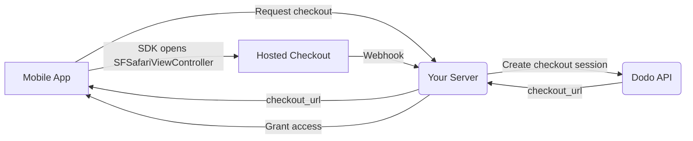

## Introduktion

Dodo Payments ger utvecklare möjlighet att sälja digitala varor och tjänster i iOS-appar, och hanterar komplexa aspekter som skatteöverensstämmelse, valutakonvertering och utbetalningar. Denna omfattande guide beskriver hur du integrerar Dodo Payments i din iOS-app, specifikt för SaaS-verktyg, innehållsprenumerationer och digitala verktyg.

## Översikt

Dodo Payments fungerar som din **Merchant of Record (MoR)** och hanterar viktiga aspekter av din digitala verksamhet:

<Tabs>
<Tab title="What We Handle">
- Skatteuppbörd och inbetalning (moms, GST och andra regionala skatter)
- Globala betalningar enligt riktlinjer och lokala betalningsmetoder
- Valutaväxling och utländsk valuta
- Återbetalningar och bedrägeriförebyggande
- Fakturering och kvitton till slutanvändare
- Efterlevnad av regionala regler
</Tab>

<Tab title="What You Get">
- Ett enhetligt API för webb och mobila plattformar
- Stöd för köp i appen (UPI, kort, plånböcker, BNPL)
- Globalt stöd för utbetalningar (Payoneer, Wise, lokala banköverföringar)
- Analys- och rapporteringspanel
- Säker betalningsbearbetning
</Tab>
</Tabs>

## Användningsfall

<CardGroup cols={2}>
<Card title="Subscriptions" icon="repeat">
- Premiuminnehåll eller funktionsåtkomst
- Återkommande fakturering med flexibla alternativ, gratis provperioder, proportionell debitering eller uppgraderingar och nedgraderingar
</Card>

<Card title="Courses and Learning" icon="graduation-cap">
- Betala per kursåtkomst
- Paketlösningar med sammansatta innehåll
- Livstidslicenser eller förnybara licenser
- Integrering av framstegsspårning
</Card>

<Card title="Digital Downloads" icon="download">
- Engångsköp (PDF:er, musik, verktyg)
- Leverans av digitala tillgångar
- Hantering av licensnycklar
</Card>

<Card title="SaaS Tools" icon="screwdriver-wrench">
- Programvara som en tjänst-prenumerationer
- Användningsbaserad fakturering
- Team- och företagsplaner
</Card>
</CardGroup>

## Integrationsflöde

Din app öppnar Dodos hostade checkout med
[iOS checkout SDK](/developer-resources/sdks/ios), som visar den i
`SFSafariViewController` och returnerar ett typat resultat.

<Warning>
Använd SDK:t i stället för att bädda in checkout i en `WebView`. Apple Pay är endast
tillgängligt i en riktig webbläsarmiljö, så en `WebView` gör att du omärkligt förlorar
wallet-konverteringar — och betalningsflöden inuti en `WebView` är en vanlig orsak till avslag vid
App Store-granskningar.
</Warning>

### Integrationssteg

<Steps>
<Step title="Mobile App to Your Server">
Din app begär en checkout-URL från din egen backend, autentiserad med den
inloggade användarens sessionstoken.
</Step>

<Step title="Your Server to Dodo API">
Din backend skapar en [checkout session](/developer-resources/checkout-session)
med din API key och returnerar `checkout_url` till appen.

<Warning>
Skapa checkout sessions på din server, aldrig i appen. En API key som levereras
inuti en appbinär kan extraheras från paketet.
</Warning>
</Step>

<Step title="Mobile App Opens Checkout">
Skicka `checkout_url` till `DodoCheckout.start(...)`. SDK:t visar den i
`SFSafariViewController` och returnerar ett typat resultat när kunden
slutför eller avfärdar checkout.
</Step>

<Step title="Dodo Payments to Your Server">
Dodo Payments anropar din webhook endpoint när betalningen lyckas eller
prenumerationen aktiveras.
</Step>

<Step title="Your Server Grants Access">
Lås upp det köpta innehållet från den webhooken, inte från resultatet som appen
mottog. SDK-resultatet är en UI-ledtråd, inte ett bevis på betalning.
</Step>
</Steps>

<CardGroup cols={2}>
<Card title="iOS Checkout SDK" icon="apple" href="/developer-resources/sdks/ios">
  Installationssteg och hela `start(...)`-kontraktet för Swift.
</Card>
<Card title="Mobile Integration Guide" icon="mobile" href="/developer-resources/mobile-integration">
  Hela flödet, från början till slut, samt samma kontrakt för Android, React Native och Flutter.
</Card>
</CardGroup>

## Regional tillgänglighet

Dodo Payments möjliggör alternativa köpflöden i appar endast i App Store-regioner där Apple uttryckligen tillåter externa betalningar, eller där en tillsynsmyndighet eller ett domstolsbeslut kräver det.

### Stödda regioner

<AccordionGroup>
<Accordion title="United States">
Stöds i den utsträckning som tillåts av aktuella domstolsbeslut och Apples uppdaterade riktlinjer.

- Tillgängligt enligt specifika domstolsförelägganden
- Beroende av att Apple följer rättsliga krav
- Måste följa Apples implementeringsriktlinjer
</Accordion>

<Accordion title="European Union (EU) App Store">
Stöds via Apples EU Alternative Terms och External Purchase Entitlement.

- Aktiveras genom Apples EU Alternative Terms
- Kräver godkännande för External Purchase Entitlement
- Måste följa kraven i EU:s Digital Markets Act
</Accordion>

<Accordion title="South Korea">
Stöds via StoreKit External Purchase Entitlement för binärer som endast distribueras i Korea.

- Tillgängligt via StoreKit External Purchase Entitlement
- Kräver en appspecifik binär för Korea
- Måste följa koreansk telekommunikationslagstiftning
</Accordion>
</AccordionGroup>

<Warning>
Granska och följ alltid Apples regionsspecifika entitlements och kraven i App Store Connect innan du aktiverar Dodo Payments för någon storefront. Användning av alternativa betalningsflöden i regioner som inte stöds kan leda till att appen avslås eller tas bort.
</Warning>

<Note>
För vissa affärsmodeller — till exempel tjänster eller vissa kategorier av innehåll — kanske Apple inte kräver användning av in-app purchase (IAP) alls. Dodo Payments stöder även dessa modeller. Kontrollera alltid appens klassificering och Apples senaste riktlinjer för att avgöra om IAP är obligatoriskt för ditt användningsfall.
</Note>

### Läs mer

För en detaljerad genomgång av globala policyer, rättsliga prejudikat och strategiska metoder för att kringgå App Store-avgifter, se vår omfattande guide:

<Card title="Bypassing App Store & Play Store Fees: A Strategic and Legal Playbook" icon="shield-check" href="/features/bypassing-app-store-fees">
Lär dig var och hur du lagligen kan implementera alternativa betalningsflöden, med uppdaterad regional vägledning och tips om efterlevnad.
</Card>