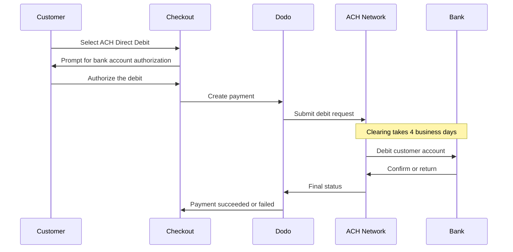

Med ACH Direct Debit kan kunder i USA betala direkt från sitt bankkonto i stället för att använda ett kort. Tjänsten använder Automated Clearing House-nätverket och erbjuds i utcheckningar i USD för engångsbetalningar.

## Varför erbjuda ACH Direct Debit?

<CardGroup cols={3}>
<Card title="Lower Processing Cost" icon="piggy-bank">
Bankdebiteringar kostar vanligtvis mindre att behandla än kortbetalningar, särskilt vid beställningar med högt värde.
</Card>

<Card title="No Card Required" icon="building-columns">
Nå kunder i USA som föredrar att betala från ett bankkonto eller inte vill använda kort för större köp.
</Card>

<Card title="Higher Value Orders" icon="chart-line">
Kostnadsfördelen jämfört med kort ökar med beställningens värde, vilket gör ACH väl lämpat för stora engångsköp.
</Card>
</CardGroup>

## Översikt

| Detalj | Värde |
| :----- | :---- |
| **Faktureringsvaluta** | USD |
| **Länder som stöds** | USA |
| **Prenumerationer** | Nej |
| **Minsta belopp** | $0.50 |
| **Avveckling** | 4 bankdagar |

<Warning>
ACH Direct Debit sker inte omedelbart. Det tar **4 bankdagar** för en betalning att bekräftas, så behandla inte auktorisering som avveckling — fullfölj endast när betalningen har nått statusen succeeded.
</Warning>

## Så fungerar det



## Kundupplevelse

1. Kunden väljer ACH Direct Debit i kassan
2. Kunden auktoriserar debiteringen från sitt amerikanska bankkonto
3. Betalningen skickas till ACH-nätverket och går in i behandling
4. Clearing slutförs under de följande bankdagarna
5. Betalningen övergår till statusen succeeded eller misslyckas om banken returnerar den

<Info>
Eftersom clearing sker asynkront bör du förlita dig på [webhooks](/developer-resources/webhooks) för att få veta det slutliga resultatet, i stället för omdirigeringen från kassan. En lyckad omdirigering betyder endast att kunden auktoriserade debiteringen.

Betalningen skickar `payment.processing` när debiteringen har skickats, och därefter `payment.succeeded` eller `payment.failed` när clearingen är klar. Endast `payment.succeeded` är säker att fullfölja på.
</Info>

## Tillgänglighet

ACH Direct Debit visas i kassan när alla följande villkor är uppfyllda:

- **Faktureringsvalutan** är `USD`
- **Faktureringslandet** är `US`
- Transaktionen är en **engångsbetalning**

<Note>
ACH Direct Debit är inte tillgängligt för prenumerationer. Flerdagarsfönstret för clearing gör metoden olämplig för återkommande faktureringscykler. För återkommande betalningar kan du använda kort eller en annan metod som stöder prenumerationer — se [översikten över betalningsmetoder](/features/payment-methods).
</Note>

## Konfiguration

```javascript
const session = await client.checkoutSessions.create({
  product_cart: [{ product_id: 'pdt_123', quantity: 1 }],
  allowed_payment_method_types: ['ach', 'credit', 'debit'],
  billing_currency: 'USD',
  billing_address: {
    country: 'US',
    zipcode: '94102'
  },
  return_url: 'https://example.com/success'
});
```

<Note>
ACH Direct Debit kräver USD som **faktureringsvaluta** och en **amerikansk faktureringsadress**. Om du anger priserna i en annan valuta kan du aktivera [Adaptive Currency](/features/adaptive-currency), så att kunder i USA faktureras i USD och ACH blir tillgängligt.
</Note>

## API-metodtyp

| Typ | Metod | Land |
| :--- | :----- | :------ |
| `ach` | ACH Direct Debit | USA |

## Återbetalningar och tvister

Återbetalningar och tvister för ACH-betalningar använder samma API:er och dashboard-flöden som alla andra betalningsmetoder — ingen ACH-specifik hantering behöver implementeras.

<Warning>
Eftersom ACH-betalningar kan returneras av kundens bank efter att de verkar ha gått igenom bör du undvika att utfärda återbetalningar innan den ursprungliga betalningen har nått statusen succeeded.
</Warning>

## Testning

<Steps>
<Step title="Enable test mode">
Använd dina test-API-nycklar för Dodo Payments.
</Step>

<Step title="Set currency and billing address">
Ange faktureringsvalutan till `USD` och landet för faktureringsadressen till `US`.
</Step>

<Step title="Include `ach` in allowed methods">
Skicka `ach` i `allowed_payment_method_types`, eller utelämna fältet helt för att visa alla kvalificerade metoder.
</Step>

<Step title="Enter the test bank details">
Ange ett av paren med test-routingnummer och kontonummer nedan och bekräfta sedan att din webhook-handler tar emot den slutliga betalningsstatusen.
</Step>
</Steps>

### Testbankkonton

Kunder anger sitt konto- och routingnummer direkt i kassan. I testläge använder du routingnumret `110000000` tillsammans med något av kontonumren nedan för att tvinga fram ett specifikt resultat.

| Kontonummer | Routingnummer | Beteende |
| :------------- | :------------- | :------- |
| `000123456789` | `110000000` | Betalningen lyckas. |
| `000222222227` | `110000000` | Betalningen misslyckas på grund av otillräckliga medel. |
| `000111111113` | `110000000` | Betalningen misslyckas eftersom kontot är avslutat. |
| `000111111116` | `110000000` | Betalningen misslyckas eftersom inget konto hittas. |
| `000333333335` | `110000000` | Betalningen misslyckas eftersom debiteringar inte är auktoriserade på kontot. |
| `000444444440` | `110000000` | Betalningen misslyckas på grund av en ogiltig valuta. |
| `000555555559` | `110000000` | Betalningen lyckas och utlöser sedan en tvist. |
| `000000000009` | `110000000` | Betalningen förblir under behandling på obestämd tid, vilket är användbart för att testa ett gränssnitt för väntande status. |

<Note>
De flesta testbetalningar når en slutlig status mycket snabbare än den aktiva clearingtiden, så du behöver inte vänta i flera dagar för att verifiera din integration. Undantaget är `000000000009`, som är utformat för att förbli under behandling.
</Note>

## Bästa praxis

<AccordionGroup>
<Accordion title="Don't fulfill on authorization">
ACH-auktorisering är inte en betalning. Vänta tills betalningen når statusen succeeded innan du beviljar åtkomst eller skickar varor — en debitering kan fortfarande returneras av kundens bank.
</Accordion>

<Accordion title="Set customer expectations at checkout">
Informera kunderna om att bankbetalningar inte clearas omedelbart. Det minskar antalet supportärenden om varför en beställning fortfarande väntar.
</Accordion>

<Accordion title="Provide card fallbacks">
Inkludera alltid `credit` och `debit` tillsammans med `ach`, så att kunder som behöver omedelbar åtkomst till din produkt kan välja en snabbare metod.
</Accordion>

<Accordion title="Use ACH for high-value one-time purchases">
Kostnadsfördelen med ACH ökar med beställningens värde, så metoden är mest användbar för stora engångsköp snarare än små köp.
</Accordion>
</AccordionGroup>

## Felsökning

<AccordionGroup>
<Accordion title="ACH not appearing at checkout">
**Kontrollera:**
1. Är faktureringsvalutan inställd på `USD`?
2. Är kundens faktureringsland `US`?
3. Ingår `ach` i `allowed_payment_method_types`?
4. Är detta en engångsbetalning? ACH erbjuds inte för prenumerationer.

**Lösning:** Ta tillfälligt bort `allowed_payment_method_types` för att se alla kvalificerade metoder och kontrollera sedan faktureringsvalutan och adresslandet i din API-begäran.
</Accordion>

<Accordion title="ACH not appearing on a subscription checkout">
**Orsak:** ACH Direct Debit erbjuds endast för engångsbetalningar.

**Lösning:** Använd kort eller en annan metod som stöder prenumerationer för återkommande fakturering.
</Accordion>

<Accordion title="Payment stuck in processing">
**Orsak:** Detta är förväntat. ACH-betalningar förblir under behandling under hela clearingfönstret, betydligt längre än kortbetalningar.

**Lösning:** Vänta på den slutliga webhooken. Försök inte göra om betalningen — ett nytt försök kan debitera kunden två gånger.
</Accordion>

<Accordion title="Payment failed after initially succeeding at checkout">
**Orsak:** Kundens bank returnerade debiteringen — oftast på grund av otillräckliga medel eller ett avslutat konto.

**Lösning:** Behandla betalningen som misslyckad och be kunden försöka igen med en annan betalningsmetod. Säkerställ alltid att fullföljandet baseras på statusen succeeded för att undvika detta.
</Accordion>
</AccordionGroup>

## Relaterade sidor

<CardGroup cols={2}>
<Card title="Payment Methods Overview" icon="credit-card" href="/features/payment-methods">
Se alla betalningsmetoder som stöds.
</Card>

<Card title="Adaptive Currency" icon="globe" href="/features/adaptive-currency">
Valutastöd och automatisk konvertering.
</Card>

<Card title="Checkout Guide" icon="book" href="/developer-resources/checkout-session">
Fullständig implementeringsguide för kassan.
</Card>

<Card title="Webhooks" icon="webhook" href="/developer-resources/webhooks">
Hantera fördröjda betalningsbekräftelser asynkront.
</Card>
</CardGroup>
