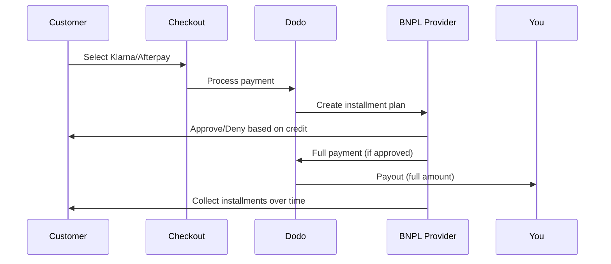

Köp nu betala senare (BNPL) låter kunder dela upp köp i räntefria delbetalningar, vilket ökar genomsnittligt ordervärde med 20–50 % och konverteringsgrader med 10–30 % för berättigade transaktioner.

## Varför erbjuda BNPL?

<CardGroup cols={3}>
<Card title="Higher AOV" icon="chart-line">
Kunder handlar mer när de kan sprida betalningar över tid. Genomsnittligt ordervärde ökar 20–50 %.
</Card>

<Card title="Better Conversion" icon="percent">
Minska betalningsfriktion vid kassan. Konverteringsgrader förbättras med 10–30 % för dyrare artiklar.
</Card>

<Card title="Zero Risk" icon="shield-check">
BNPL-leverantörer hanterar kreditrisk och indrivning. Du får hela betalningen direkt.
</Card>
</CardGroup>

## Stödda leverantörer

### Klarna

| Funktion | Detaljer |
| :------ | :------ |
| **Tillgänglighet** | USA + 19 europeiska länder |
| **Valutor** | USD, EUR, GBP, DKK, NOK, SEK, CZK, RON, PLN, CHF |
| **Minimum** | $50,01 (eller motsvarande) |
| **Prenumerationer** | Ja |

**Stödda länder:** Österrike, Belgien, Tjeckien, Danmark, Finland, Frankrike, Tyskland, Grekland, Irland, Italien, Nederländerna, Norge, Polen, Portugal, Rumänien, Spanien, Sverige, Schweiz, Storbritannien, USA

**Betalningsalternativ:**
- **Betala i 4** — Dela upp i 4 räntefria betalningar
- **Betala om 30 dagar** — Hela beloppet förfaller om 30 dagar
- **Finansiering** — Långsiktiga delbetalningsplaner

### Afterpay (Clearpay)

| Funktion | Detaljer |
| :------ | :------ |
| **Tillgänglighet** | USA, Storbritannien |
| **Valutor** | USD, GBP |
| **Minimum** | $50,01 (eller motsvarande) |
| **Prenumerationer** | Nej |

**Betalningsalternativ:**
- **Betala i 4** — 4 räntefria betalningar varannan vecka

<Note>
I Storbritannien opererar Afterpay som "Clearpay" men använder samma API-typ (`afterpay_clearpay`).
</Note>

### Billie

| Funktion | Detaljer |
| :------ | :------ |
| **Tillgänglighet** | Global |
| **Valutor** | GBP |
| **Minimum** | Ingen |
| **Prenumerationer** | Nej |

**Om Billie:**
Billie är en B2B-lösning för Köp nu betala senare som gör det möjligt för företag att erbjuda flexibla betalningsvillkor till sina kunder. Den är utformad för affärstransaktioner där köpare behöver fakturabaserade betalningsalternativ.

**Betalningsalternativ:**
- **Faktura** — Betala inom avtalade betalningstider
- **Flexibla villkor** — Företagsvänliga betalningsscheman

## Konfiguration

### API-metodtyper

| Typ | Leverantör |
| :--- | :------- |
| `klarna` | Klarna |
| `afterpay_clearpay` | Afterpay / Clearpay |
| `billie` | Billie (B2B) |

### Exempel

```javascript
const session = await client.checkoutSessions.create({
  product_cart: [{ product_id: 'pdt_123', quantity: 1 }],
  allowed_payment_method_types: [
    'klarna',
    'afterpay_clearpay',
    'credit',
    'debit'
  ],
  customer: {
    email: 'customer@example.com',
    name: 'Jane Smith'
  },
  billing_address: {
    country: 'US',
    zipcode: '10001'
  },
  return_url: 'https://example.com/success'
});
```

<Warning>
Inkludera alltid `credit` och `debit` som reservalternativ. Alla kunder är inte berättigade till BNPL, och transaktioner under leverantörens minimi-belopp kvalificerar inte.
</Warning>

## Gränser för transaktionsbelopp

Varje BNPL-leverantör har ett eget minimi-belopp (och ibland ett maxbelopp) för transaktioner:

| Leverantör | Minimum | Maximum |
| :------- | :------ | :------ |
| Klarna | $50.01 | — |
| Afterpay | $50.01 | — |

Transaktioner utanför dessa gränser:
- BNPL-alternativ visas inte i kassan
- Inget fel returneras — alternativen visas helt enkelt inte
- Kortbetalningar är fortfarande tillgängliga

Detta är förväntat beteende. Inkludera inte en BNPL-metod i `allowed_payment_method_types` om det är osannolikt att ditt produktpris hamnar inom leverantörens stödda intervall.

## Så fungerar avbetalningar



**Viktiga punkter:**
- Du får **hela betalningen i förskott** från BNPL-leverantören
- BNPL-leverantören hanterar **kreditrisk och kravhantering**
- Kunden betalar leverantören direkt över **4 avbetalningar** (vanligtvis)
- **Inga chargebacks** vid misslyckade avbetalningar — det är leverantörens risk

## Testning

### Testdata för Klarna

Använd dessa uppgifter i testläge:

| Fält | Godkänd | Nekad |
| :---- | :------- | :----- |
| **Födelsedatum** | 07-10-1970 | 07-10-1970 |
| **Förnamn** | Test | Test |
| **Efternamn** | Person-us | Person-us |
| **E-post** | customer@email.us | customer+denied@email.us |
| **Gatuadress** | Amsterdam Ave | Amsterdam Ave |
| **Husnummer** | 509 | 509 |
| **Ort** | New York | New York |
| **Delstat** | New York | New York |
| **Postnummer** | 10024-3941 | 10024-3941 |
| **Telefon** | +13106683312 | +13106354386 |

<Note>
Transaktionen måste vara minst $50 för att Klarna ska visas som ett alternativ.
</Note>

### Testning av Afterpay

<Steps>
<Step title="Select Afterpay">
Välj Afterpay i kassan och klicka på Pay.
</Step>

<Step title="Successful payment">
Använd valfri giltig e-postadress och leveransadress.
</Step>

<Step title="Failed authentication">
Så testar du ett misslyckande: stäng Afterpay-modalrutan på omdirigeringssidan. Betalningsstatusen övergår till `requires_payment_method`.
</Step>
</Steps>

## Bästa praxis

<AccordionGroup>
<Accordion title="Target high-ticket items">
BNPL fungerar bäst för produkter i prisklassen $100–$1000. Värdeerbjudandet "betala över tid" är mest övertygande inom detta intervall.
</Accordion>

<Accordion title="Show installment amounts">
"4 betalningar på $25" är mer övertygande än "$100 med Klarna". Visa beloppet per betalning när det är möjligt.
</Accordion>

<Accordion title="Don't force BNPL for low-value products">
Under $50 visas BNPL ändå inte. Under $100 föredrar de flesta kunder kort. Fokusera BNPL-marknadsföringen på dyrare produkter.
</Accordion>

<Accordion title="Collect billing address">
BNPL-leverantörer kräver faktureringsinformation för kreditkontroller. Säkerställ att din kassa samlar in fullständiga adressuppgifter.
</Accordion>

<Accordion title="Set clear expectations">
Kunderna bör förstå att de ingår ett kreditavtal med Klarna/Afterpay, inte med dig.
</Accordion>
</AccordionGroup>

## Begränsningar

### Inga prenumerationer
BNPL-betalningsmetoder **stöder inte återkommande betalningar**. För prenumerationsprodukter använder du kort eller andra metoder som stöder återkommande betalningar.

### Kreditbaserat godkännande
BNPL-leverantörer utför omedelbara kreditkontroller. Alla kunder kommer inte att godkännas. Godkännandegraden varierar beroende på:
- Kundens kredithistorik hos leverantören
- Transaktionsbelopp
- Kundens plats

### Valuta- och landsmappning

Varje valuta är begränsad till sin motsvarande region:

| Valuta | Länder som stöds |
| :------- | :------------------ |
| **USD** | Endast USA |
| **EUR** | Alla europeiska länder som stöds (Österrike, Belgien, Tjeckien, Danmark, Finland, Frankrike, Tyskland, Grekland, Irland, Italien, Nederländerna, Norge, Polen, Portugal, Rumänien, Spanien, Sverige, Schweiz) |
| **GBP** | Storbritannien och alla europeiska länder som stöds |

Andra valutor som stöds av Klarna (DKK, NOK, SEK, CZK, RON, PLN, CHF) fungerar i respektive land.

<Info>
En transaktion i USD visar till exempel endast BNPL-alternativ för kunder i USA. En transaktion i EUR visar BNPL-alternativ i alla europeiska länder som stöds. En transaktion i GBP visar BNPL-alternativ för kunder i Storbritannien och alla europeiska länder som stöds.
</Info>

| Leverantör | Valutor som stöds |
| :------- | :------------------- |
| Klarna | USD, EUR, GBP, DKK, NOK, SEK, CZK, RON, PLN, CHF |
| Afterpay | USD (US), GBP (UK) |

## Felsökning

<AccordionGroup>
<Accordion title="BNPL not appearing at checkout">
**Kontrollera:**
1. Ligger transaktionsbeloppet inom leverantörens stödda intervall? (Klarna/Afterpay: min. $50.01)
2. Befinner sig kunden i ett land som stöds?
3. Stöds valutan av BNPL-leverantören?
4. Ingår BNPL-metoden i `allowed_payment_method_types`?

**Lösning:** Oftast ligger transaktionen under minimibeloppet eller över maxbeloppet. Kontrollera att beloppet ligger inom leverantörens stödda intervall.
</Accordion>

<Accordion title="Customer denied by BNPL provider">
**Orsaker:**
- Otillräcklig kredithistorik hos leverantören
- För många aktiva avbetalningsplaner
- Misslyckad identitetsverifiering

**Lösning:** Detta är förväntat för vissa kunder. Säkerställ att reservalternativ med kort är tillgängliga. Visa inte specifika orsaker till nekandet.
</Accordion>

<Accordion title="Payment stuck in pending">
**Orsak:** Kunden slutförde inte autentiseringsflödet hos BNPL-leverantören.

**Lösning:** Betalningen kommer att löpa ut och misslyckas. Kunden kan försöka igen eller använda en annan metod.
</Accordion>
</AccordionGroup>

## Relaterade sidor

<CardGroup cols={2}>
<Card title="Payment Methods Overview" icon="credit-card" href="/features/payment-methods">
Se alla betalningsmetoder som stöds.
</Card>

<Card title="Checkout Guide" icon="book" href="/developer-resources/checkout-session">
Komplett guide för implementering av kassan.
</Card>

<Card title="Testing Process" icon="flask" href="/miscellaneous/testing-process">
All testdata för betalningsmetoder.
</Card>

<Card title="Adaptive Currency" icon="globe" href="/features/adaptive-currency">
Valutastöd och konvertering.
</Card>
</CardGroup>