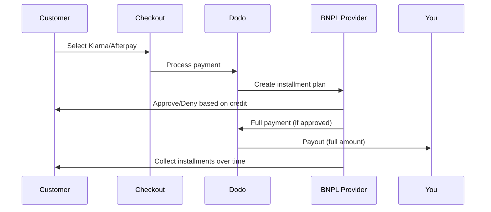

Köp nu betala senare (BNPL) låter kunder dela upp köp i räntefria delbetalningar, vilket ökar genomsnittligt ordervärde med 20–50 % och konverteringsgrader med 10–30 % för berättigade transaktioner.

## Varför erbjuda BNPL?

<CardGroup cols={3}>
<Card title="Higher AOV" icon="chart-line">
Kunder handlar mer när de kan sprida betalningar över tid. Genomsnittligt ordervärde ökar 20–50 %.
</Card>

<Card title="Better Conversion" icon="percent">
Minska betalningsfriktion vid kassan. Konverteringsgrader förbättras med 10–30 % för dyrare artiklar.
</Card>

<Card title="Zero Risk" icon="shield-check">
BNPL-leverantörer hanterar kreditrisk och indrivning. Du får hela betalningen direkt.
</Card>
</CardGroup>

## Stödda leverantörer

### Klarna

| Funktion | Detaljer |
| :------ | :------ |
| **Tillgänglighet** | USA + 19 europeiska länder |
| **Valutor** | USD, EUR, GBP, DKK, NOK, SEK, CZK, RON, PLN, CHF |
| **Minimum** | $50,01 (eller motsvarande) |
| **Prenumerationer** | Nej |

**Stödda länder:** Österrike, Belgien, Tjeckien, Danmark, Finland, Frankrike, Tyskland, Grekland, Irland, Italien, Nederländerna, Norge, Polen, Portugal, Rumänien, Spanien, Sverige, Schweiz, Storbritannien, USA

**Betalningsalternativ:**
- **Betala i 4** — Dela upp i 4 räntefria betalningar
- **Betala om 30 dagar** — Hela beloppet förfaller om 30 dagar
- **Finansiering** — Långsiktiga delbetalningsplaner

### Afterpay (Clearpay)

| Funktion | Detaljer |
| :------ | :------ |
| **Tillgänglighet** | USA, Storbritannien |
| **Valutor** | USD, GBP |
| **Minimum** | $50,01 (eller motsvarande) |
| **Prenumerationer** | Nej |

**Betalningsalternativ:**
- **Betala i 4** — 4 räntefria betalningar varannan vecka

<Note>
I Storbritannien opererar Afterpay som "Clearpay" men använder samma API-typ (`afterpay_clearpay`).
</Note>

### Billie

| Funktion | Detaljer |
| :------ | :------ |
| **Tillgänglighet** | Global |
| **Valutor** | GBP |
| **Minimum** | Ingen |
| **Prenumerationer** | Nej |

**Om Billie:**
Billie är en B2B-lösning för Köp nu betala senare som gör det möjligt för företag att erbjuda flexibla betalningsvillkor till sina kunder. Den är utformad för affärstransaktioner där köpare behöver fakturabaserade betalningsalternativ.

**Betalningsalternativ:**
- **Faktura** — Betala inom avtalade betalningstider
- **Flexibla villkor** — Företagsvänliga betalningsscheman

### Sunbit

| Funktion | Detaljer |
| :------ | :------ |
| **Tillgänglighet** | USA |
| **Valutor** | USD |
| **Minimum** | $60.00 |
| **Maximum** | $19,999.00 |
| **Prenumerationer** | Nej |

**Betalningsalternativ:**
- **Avbetalningsfinansiering** — Dela upp köp i hanterbara månadsbetalningar

## Konfiguration

### API-metodtyper

| Typ | Leverantör |
| :--- | :------- |
| `klarna` | Klarna |
| `afterpay_clearpay` | Afterpay / Clearpay |
| `billie` | Billie (B2B) |
| `sunbit` | Sunbit |

### Exempel

```javascript
const session = await client.checkoutSessions.create({
  product_cart: [{ product_id: 'prod_123', quantity: 1 }],
  allowed_payment_method_types: [
    'klarna',
    'afterpay_clearpay',
    'credit',
    'debit'
  ],
  customer: {
    email: 'customer@example.com',
    name: 'Jane Smith'
  },
  billing_address: {
    country: 'US',
    zipcode: '10001'
  },
  return_url: 'https://example.com/success'
});
```

<Warning>
Inkludera alltid `credit` och `debit` som reservlösningar. Inte alla kunder är berättigade till BNPL, och transaktioner under leverantörens minimum kvalificerar sig inte.
</Warning>

## Transaktionsbeloppsgränser

Varje BNPL-leverantör har sitt eget minimi- (och ibland maximi-) transaktionsbelopp:

| Leverantör | Minimum | Maximum |
| :------- | :------ | :------ |
| Klarna | $50.01 | — |
| Afterpay | $50.01 | — |
| Sunbit | $60.00 | $19,999.00 |

Transaktioner utanför dessa gränser:
- BNPL-alternativet visas inte vid kassan
- Inget fel kastas — alternativen visas helt enkelt inte
- Kortbetalningar är fortfarande tillgängliga

Detta är ett förväntat beteende. Inkludera inte en BNPL-metod i `allowed_payment_method_types` om ditt produktpris inte sannolikt faller inom den leverantörens stödintervall.

## Hur avbetalningar fungerar



**Viktiga punkter:**
- Du får **hela betalningen i förskott** från BNPL-leverantören
- BNPL-leverantören hanterar **kreditrisk och inkasso**
- Kunden betalar leverantören direkt över **4 avbetalningar** (vanligtvis)
- **Inga chargebacks** på grund av avbetalningsmisslyckanden — det är leverantörens risk

## Testning

### Klarna testdata

Använd dessa detaljer i testläge:

| Fält | Godkänd | Nekad |
| :---- | :------- | :----- |
| **Födelsedatum** | 07-10-1970 | 07-10-1970 |
| **Förnamn** | Test | Test |
| **Efternamn** | Person-us | Person-us |
| **E-post** | customer@email.us | customer+denied@email.us |
| **Gata** | Amsterdam Ave | Amsterdam Ave |
| **Husnummer** | 509 | 509 |
| **Stad** | New York | New York |
| **Stat** | New York | New York |
| **Postnummer** | 10024-3941 | 10024-3941 |
| **Telefon** | +13106683312 | +13106354386 |

<Note>
Transaktionen måste vara minst $50 för att Klarna ska visas som ett alternativ.
</Note>

### Afterpay-testning

<Steps>
<Step title="Select Afterpay">
Välj Afterpay i kassan och klicka på Betala.
</Step>

<Step title="Successful payment">
Använd valfri giltig e-postadress och leveransadress.
</Step>

<Step title="Failed authentication">
För att testa ett misslyckande: stäng Afterpay-modalen på omdirigeringssidan. Betalningsstatus övergår till `requires_payment_method`.
</Step>
</Steps>

### Sunbit-testning

<Steps>
<Step title="Set billing country and currency">
Se till att kassasessionen har `billing_address.country` inställd på `US` och `billing_currency` inställd på `USD`.
</Step>

<Step title="Use a qualifying amount">
Ange transaktionsbeloppet mellan **$60.00 och $19,999.00**. Sunbit kommer inte att visas utanför detta intervall.
</Step>

<Step title="Select Sunbit">
Välj Sunbit vid kassan och slutför finansieringsapplikationsflödet i Sunbit-modalen.
</Step>

<Step title="Test failure">
För att simulera en avvisad ansökan, stäng Sunbit-modalen innan flödet är slutfört. Betalningen övergår till `requires_payment_method`.
</Step>
</Steps>

<Note>
Sunbit är bara tillgängligt för amerikanska kunder som betalar i USD med ett transaktionsbelopp mellan $60.00 och $19,999.00.
</Note>

## Bästa praxis

<AccordionGroup>
<Accordion title="Target high-ticket items">
BNPL fungerar bäst för produkter mellan $100–$1000. Värdeerbjudandet att "betala över tid" är mest lockande i detta intervall.
</Accordion>

<Accordion title="Show installment amounts">
"4 betalningar på $25" är mer lockande än "$100 med Klarna". Visa beloppet per betalning när det är möjligt.
</Accordion>

<Accordion title="Don't force BNPL for low-value products">
Under $50 visas inte BNPL ändå. Under $100 föredrar de flesta kunder kort. Fokusera BNPL-främjande på artiklar med högre pris.
</Accordion>

<Accordion title="Collect billing address">
BNPL-leverantörer kräver faktureringsinformation för kreditkontroller. Se till att din kassa samlar in fullständiga adressuppgifter.
</Accordion>

<Accordion title="Set clear expectations">
Kunderna bör förstå att de ingår ett kreditavtal med Klarna/Afterpay, inte med dig.
</Accordion>
</AccordionGroup>

## Begränsningar

### Inga prenumerationer
BNPL-betalningsmetoder **stödjer inte återkommande betalningar**. För prenumerationsprodukter, använd kort eller andra metoder som stödjer återkommande betalningar.

### Kreditbaserat godkännande
BNPL-leverantörer utför omedelbara kreditkontroller. Inte alla kunder kommer att godkännas. Godkännandegraden varierar beroende på:
- Kundens kredithistorik hos leverantören
- Transaktionsbelopp
- Kundens plats

### Valuta- och landbegränsningar

Varje valuta är begränsad till sin tillhörande region:

| Valuta | Stödda länder |
| :------- | :------------------ |
| **USD** | Endast USA |
| **EUR** | Alla stödda europeiska länder (Österrike, Belgien, Tjeckien, Danmark, Finland, Frankrike, Tyskland, Grekland, Irland, Italien, Nederländerna, Norge, Polen, Portugal, Rumänien, Spanien, Sverige, Schweiz) |
| **GBP** | Storbritannien och alla stödda europeiska länder |

Andra Klarna-stödda valutor (DKK, NOK, SEK, CZK, RON, PLN, CHF) fungerar i sina respektive länder.

<Info>
Till exempel, en USD-transaktion kommer endast att visa BNPL-alternativ för kunder i USA. En EUR-transaktion kommer att visa BNPL-alternativ i alla stödda europeiska länder. En GBP-transaktion kommer att visa BNPL-alternativ för kunder i Storbritannien och alla stödda europeiska länder.
</Info>

| Leverantör | Stödda valutor |
| :------- | :------------------- |
| Klarna | USD, EUR, GBP, DKK, NOK, SEK, CZK, RON, PLN, CHF |
| Afterpay | USD (USA), GBP (UK) |
| Sunbit | USD (USA) |

## Felsökning

<AccordionGroup>
<Accordion title="BNPL not appearing at checkout">
**Kontrollera:**
1. Transaktionsbelopp inom leverantörens stödda intervall? (Klarna/Afterpay: min $50.01; Sunbit: $60.00–$19,999.00)
2. Kundens plats i ett stödt land?
3. Valuta som stöds av BNPL-leverantören?
4. BNPL-metod inkluderad i `allowed_payment_method_types`?

**Lösning:** Vanligast är att transaktionen är under miniminivån eller över maximumnivån. Verifiera att beloppet faller inom leverantörens stödda intervall.
</Accordion>

<Accordion title="Customer denied by BNPL provider">
**Orsaker:**
- Otillräcklig kredithistorik med leverantören
- För många aktiva avbetalningsplaner
- Misslyckad identitetsverifiering

**Lösning:** Detta är förväntat för vissa kunder. Se till att kort som reservlösningar är tillgängliga. Utsätt inte specifika nekande orsaker.
</Accordion>

<Accordion title="Payment stuck in pending">
**Orsak:** Kunden slutförde inte autentiseringsflödet med BNPL-leverantören.

**Lösning:** Betalningen kommer att tidsutlösas och misslyckas. Kunden kan prova igen eller använda en annan metod.
</Accordion>
</AccordionGroup>

## Relaterade sidor

<CardGroup cols={2}>
<Card title="Payment Methods Overview" icon="credit-card" href="/features/payment-methods">
Se alla stödda betalningsmetoder.
</Card>

<Card title="Checkout Guide" icon="book" href="/developer-resources/checkout-session">
Gör hela kassagenomförandet guide.
</Card>

<Card title="Testing Process" icon="flask" href="/miscellaneous/testing-process">
All testdata för betalningsmetoder.
</Card>

<Card title="Adaptive Currency" icon="globe" href="/features/adaptive-currency">
Valutastöd och konvertering.
</Card>
</CardGroup>