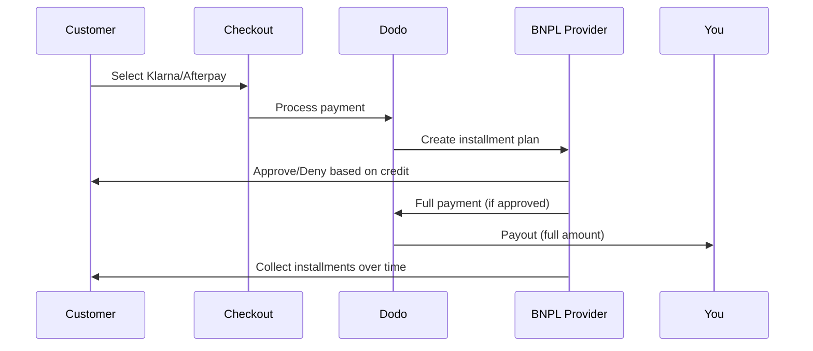

Köpa Nu Betala Senare (BNPL) låter kunder dela upp köp i räntefria delbetalningar, vilket ökar det genomsnittliga ordervärdet med 20-50% och konverteringsgraden med 10-30% för berättigade transaktioner.

## Varför erbjuda BNPL?

<CardGroup cols={3}>
<Card title="Högre AOV" icon="chart-line">
Kunder spenderar mer när de kan sprida betalningarna över tid. Det genomsnittliga ordervärdet ökar med 20-50%.
</Card>

<Card title="Bättre konvertering" icon="percent">
Borttagning av betalningsfriktion vid kassan. Konverteringsgraden förbättras med 10-30% för hög värdefulla artiklar.
</Card>

<Card title="Noll risk" icon="shield-check">
BNPL-leverantörer hanterar kreditrisk och inkassering. Du får full betalning direkt.
</Card>
</CardGroup>

## Stödda leverantörer

### Klarna

| Funktion | Detaljer |
| :------ | :------ |
| **Tillgänglighet** | USA + 19 europeiska länder |
| **Valutor** | USD, EUR, GBP, DKK, NOK, SEK, CZK, RON, PLN, CHF |
| **Minimum** | $50.01 (eller motsvarande) |
| **Prenumerationer** | Nej |

**Stödda länder:** Österrike, Belgien, Tjeckien, Danmark, Finland, Frankrike, Tyskland, Grekland, Irland, Italien, Nederländerna, Norge, Polen, Portugal, Rumänien, Spanien, Sverige, Schweiz, Storbritannien, USA

**Betalningsalternativ:**
- **Betala i 4** — Dela upp i 4 räntefria betalningar
- **Betala om 30 dagar** — Full betalning förfaller om 30 dagar
- **Finansiering** — Längre delbetalningsplaner

### Afterpay (Clearpay)

| Funktion | Detaljer |
| :------ | :------ |
| **Tillgänglighet** | USA, Storbritannien |
| **Valutor** | USD, GBP |
| **Minimum** | $50.01 (eller motsvarande) |
| **Prenumerationer** | Nej |

**Betalningsalternativ:**
- **Betala i 4** — 4 räntefria betalningar varannan vecka

<Note>
I Storbritannien fungerar Afterpay som "Clearpay" men använder samma API-typ (`afterpay_clearpay`).
</Note>

### Billie

| Funktion | Detaljer |
| :------ | :------ |
| **Tillgänglighet** | Global |
| **Valutor** | GBP |
| **Minimum** | Inga |
| **Prenumerationer** | Nej |

**Om Billie:**
Billie är en B2B Köpa Nu Betala Senare-lösning som gör det möjligt för företag att erbjuda flexibla betalningsvillkor till sina kunder. Den är utformad för affär-till-affär-transaktioner där köpare behöver fakturabaserade betalningsalternativ.

**Betalningsalternativ:**
- **Faktura betalning** — Betala inom avtalade betalningsvillkor
- **Flexibla villkor** — Företagsvänliga betalningsscheman

## Konfigurering

### API-metodtyper

| Typ | Leverantör |
| :--- | :------- |
| `klarna` | Klarna |
| `afterpay_clearpay` | Afterpay / Clearpay |
| `billie` | Billie (B2B) |

### Exempel

```javascript
const session = await client.checkoutSessions.create({
  product_cart: [{ product_id: 'prod_123', quantity: 1 }],
  allowed_payment_method_types: [
    'klarna',
    'afterpay_clearpay',
    'credit',
    'debit'
  ],
  customer: {
    email: 'customer@example.com',
    name: 'Jane Smith'
  },
  billing_address: {
    country: 'US',
    zipcode: '10001'
  },
  return_url: 'https://example.com/success'
});
```

<Warning>
Inkludera alltid `credit` och `debit` som fallback. Inte alla kunder är berättigade till BNPL, och transaktioner under $50.01 kvalificerar inte.
</Warning>

## Minimi transaktionsbelopp

**Både Klarna och Afterpay kräver en minimi på $50.01 USD** (eller motsvarande i stödda valutor).

Transaktioner under detta tröskelvärde:
- BNPL-alternativ visas inte vid kassan
- Ingen felrapportering — alternativ visas helt enkelt inte
- Kortbetalningar förblir tillgängliga

Detta är förväntat beteende. Inkludera inte BNPL i `allowed_payment_method_types` för produkter under $50.

## Hur delbetalningar fungerar



**Nyckelpunkter:**
- Du får **full betalning i förskott** från BNPL-leverantören
- BNPL-leverantören hanterar **kreditrisk och inkassering**
- Kunder betalar leverantören direkt över **4 delbetalningar** (vanligtvis)
- **Inga återbetalningar** från delbetalningsmisslyckanden — det är leverantörens risk

## Testning

### Klarna testdata

Använd dessa detaljer i testläge:

| Fält | Godkänd | Nekad |
| :---- | :------- | :----- |
| **Födelsedatum** | 07-10-1970 | 07-10-1970 |
| **Förnamn** | Test | Test |
| **Efternamn** | Person-us | Person-us |
| **E-post** | customer@email.us | customer+denied@email.us |
| **Gata** | Amsterdam Ave | Amsterdam Ave |
| **Husnummer** | 509 | 509 |
| **Stad** | New York | New York |
| **Stat** | New York | New York |
| **Postnummer** | 10024-3941 | 10024-3941 |
| **Telefon** | +13106683312 | +13106354386 |

<Note>
Transaktionen måste vara minst $50 för att Klarna ska visas som alternativ.
</Note>

### Afterpay-testning

<Steps>
<Step title="Välj Afterpay">
Välj Afterpay vid kassan och klicka på Betala.
</Step>

<Step title="Lyckad betalning">
Använd valfri giltig e-post och leveransadress.
</Step>

<Step title="Misslyckad autentisering">
För att testa misslyckande: stäng Afterpay-fönstret på omdirigeringssidan. Betalningsstatus övergår till `requires_payment_method`.
</Step>
</Steps>

## Bästa praxis

<AccordionGroup>
<Accordion title="Mål högvärdiga artiklar">
BNPL fungerar bäst för produkter mellan $100-$1000. Värdeerbjudandet att "betala över tid" är mest övertygande i detta intervall.
</Accordion>

<Accordion title="Visa delbetalningsbelopp">
"4 betalningar av $25" är mer övertygande än "$100 med Klarna". Visa beloppet per betalning när det är möjligt.
</Accordion>

<Accordion title="Tvinga inte BNPL för lågvärdiga produkter">
Under $50 kommer BNPL inte att visas ändå. Under $100 föredrar de flesta kunder kort. Fokusera BNPL-promotion på högre värdefulla artiklar.
</Accordion>

<Accordion title="Samla in faktureringsadress">
BNPL-leverantörer kräver faktureringsinformation för kreditkontroller. Se till att din kassa samlar in fullständiga adressuppgifter.
</Accordion>

<Accordion title="Sätt tydliga förväntningar">
Kunder bör förstå att de ingår ett kreditavtal med Klarna/Afterpay, inte med dig.
</Accordion>
</AccordionGroup>

## Begränsningar

### Inga prenumerationer
BNPL betalningsmetoder **stöder inte återkommande betalningar**. För prenumerationsprodukter, använd kort eller andra metoder som stöder återkommande betalningar.

### Kreditbaserat godkännande
BNPL-leverantörer utför omedelbara kreditkontroller. Inte alla kunder kommer att bli godkända. Godkännandegraden varierar beroende på:
- Kundens kredit historia med leverantören
- Transaktionsbelopp
- Kundens plats

### Valuta & landkartläggning
Varje valuta är begränsad till sin motsvarande region:

| Valuta | Stödda länder |
| :------- | :------------------ |
| **USD** | Endast USA |
| **EUR** | Alla stödda europeiska länder (Österrike, Belgien, Tjeckien, Danmark, Finland, Frankrike, Tyskland, Grekland, Irland, Italien, Nederländerna, Norge, Polen, Portugal, Rumänien, Spanien, Sverige, Schweiz) |
| **GBP** | Storbritannien och alla stödda europeiska länder |

Andra Klarna-stödda valutor (DKK, NOK, SEK, CZK, RON, PLN, CHF) fungerar i sina respektive länder.

<Info>
Till exempel kommer en USD-transaktion endast att visa BNPL-alternativ för kunder i USA. En EUR-transaktion visar BNPL-alternativ i alla stödda europeiska länder. En GBP-transaktion visar BNPL-alternativ för kunder i Storbritannien och alla stödda europeiska länder.
</Info>

| Leverantör | Stödda valutor |
| :------- | :------------------- |
| Klarna | USD, EUR, GBP, DKK, NOK, SEK, CZK, RON, PLN, CHF |
| Afterpay | USD (USA), GBP (Storbritannien) |

## Felsökning

<AccordionGroup>
<Accordion title="BNPL visas inte vid kassan">
**Kontrollera:**
1. Transaktionsbelopp åtminstone $50.01?
2. Kundens plats i stött land?
3. Valuta stödd av BNPL-leverantören?
4. BNPL-metod inkluderad i `allowed_payment_method_types`?

**Lösning:** Vanligtvis är transaktionen under minimikravet. Verifiera att beloppet uppfyller $50.01-tröskeln.
</Accordion>

<Accordion title="Kund nekad av BNPL-leverantör">
**Orsaker:**
- Otillräcklig kredit historia med leverantören
- För många aktiva delbetalningsplaner
- Misslyckad identitetsverifiering

**Lösning:** Detta är förväntat för vissa kunder. Se till att kortalternativ är tillgängliga. Visa inte specifika avvisningsorsaker.
</Accordion>

<Accordion title="Betalning fast i väntande">
**Orsak:** Kunden avslutade inte autentiseringflödet med BNPL-leverantören.

**Lösning:** Betalningen kommer att gå ut och misslyckas. Kunden kan försöka igen eller använda en annan metod.
</Accordion>
</AccordionGroup>

## Relaterade sidor

<CardGroup cols={2}>
<Card title="Översikt över betalningsmetoder" icon="credit-card" href="/features/payment-methods">
Se alla stödda betalningsmetoder.
</Card>

<Card title="Kassaguide" icon="book" href="/developer-resources/checkout-session">
Komplett guide för kassaintegration.
</Card>

<Card title="Testprocess" icon="flask" href="/miscellaneous/testing-process">
All testdata för betalningsmetoder.
</Card>

<Card title="Adaptiv valuta" icon="globe" href="/features/adaptive-currency">
Valusstöd och konvertering.
</Card>
</CardGroup>

<Card title="Adaptive Currency" icon="globe" href="/features/adaptive-currency">
Currency support and conversion.
</Card>
</CardGroup>