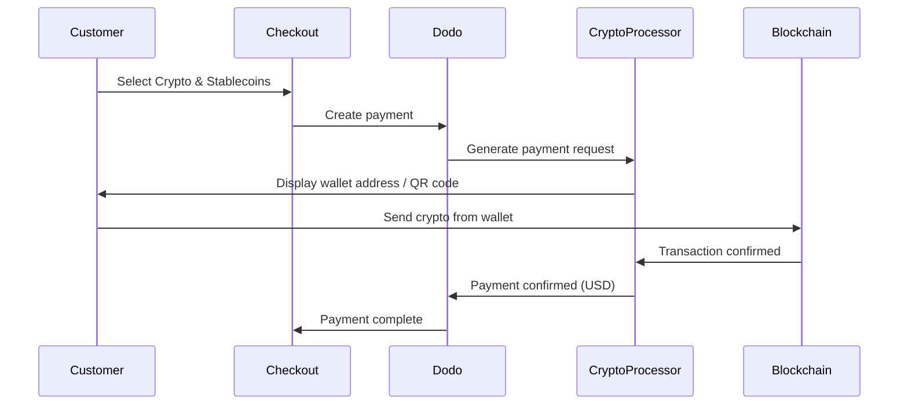

Krypto & Stablecoins-betalningar tillåter kunder att betala med kryptovalutor och stablecoins från hela världen (exklusive Indien). Transaktioner faktureras i USD, så du får fiat-valuta medan kunder betalar med sin föredragna kryptoplånbok.

## Varför erbjuda Krypto & Stablecoins?

<CardGroup cols={3}>
<Card title="Global Reach" icon="globe">
Acceptera betalningar från vilket land som helst — ingen bankinfrastruktur krävs på kundens sida.
</Card>

<Card title="No Chargebacks" icon="shield-check">
Kryptotransaktioner är oåterkalleliga, vilket eliminerar återdebiteringsbedrägerier helt.
</Card>

<Card title="USD Settlement" icon="dollar-sign">
Du får USD — inget behov av att hantera kryptovaluta-volatilitet eller plånböcker.
</Card>
</CardGroup>

## Översikt

| Detalj | Värde |
| :----- | :---- |
| **Fakturavaluta** | USD |
| **Stödda Länder** | Globalt (Exkl. IN) |
| **Prenumerationer** | Nej |
| **Minsta Belopp** | $0.50 |
| **Uppgörelse** | USD |

## Hur det fungerar



## Kundupplevelse

1. Kunden väljer Krypto & Stablecoins vid kassan
2. En plånboksadress och QR-kod visas med beloppet i krypto
3. Kunden skickar exakt belopp från sin kryptoplånbok
4. Transaktionen bekräftas på blockkedjan
5. Kunden omdirigeras till lyckad-sidan

<Info>
Kryptobetalningar faktureras i USD. Kryptobeloppet som visas vid kassan återspeglar växelkursen i realtid vid betalningstillfället.
</Info>

## Stödda Valutor & Nätverk

| Valuta | Nätverk |
| :----- | :------ |
| **USDC** | Ethereum, Solana, Polygon, Base |
| **USDP** | Ethereum, Solana |
| **USDG** | Ethereum |

## Konfiguration

```javascript
const session = await client.checkoutSessions.create({
  product_cart: [{ product_id: 'prod_123', quantity: 1 }],
  allowed_payment_method_types: ['crypto', 'credit', 'debit'],
  return_url: 'https://example.com/success'
});
```

## API Typmetod

| Typ | Metod | Land |
| :-- | :---- | :--- |
| `crypto` | Krypto & Stablecoins | Globalt (Exkl. IN) |

## Testning

<Steps>
<Step title="Enable test mode">
Använd dina Dodo Payments test-API-nycklar.
</Step>

<Step title="Create a test checkout">
Skapa en kassasession med `crypto` i de tillåtna betalningsmetoderna.
</Step>

<Step title="Complete the test flow">
Följ det simulerade kryptobetalmningsflödet i testmiljön.
</Step>
</Steps>

## Bästa Praxis

<AccordionGroup>
<Accordion title="Always include card fallbacks">
Alla kunder har inte kryptoplånböcker. Inkludera alltid `credit` och `debit` som reservbetalningsmetoder.
</Accordion>

<Accordion title="Set clear expectations on confirmation time">
Blockkedjebekräftelser kan ta minuter beroende på nätverket. Säkerställ att din kassas anslutning kommunicerar detta till kunderna.
</Accordion>

<Accordion title="Handle underpayments and overpayments">
Kryptobetalningar kan ibland skilja sig något från exakt belopp på grund av nätavgifter. Övervaka webhooks för att uppdatera betalningsstatus.
</Accordion>
</AccordionGroup>

## Felsökning

<AccordionGroup>
<Accordion title="Crypto not appearing at checkout">
**Kontrollera:**
1. `crypto` inkluderad i `allowed_payment_method_types`?
2. Transaktionsbeloppet uppfyller minimi ($0.50)?

**Lösning:** Verifiera att betalningstypen är korrekt överförd i din API-förfrågan.
</Accordion>

<Accordion title="Payment not confirming">
**Orsak:** Blockkedjebekräftelsetider varierar. Vissa nätverk tar längre tid än andra.

**Lösning:** Vänta på webhookbekräftelse. Behandla inte betalningen som misslyckad förrän bekräftelsetiden har passerat.
</Accordion>

<Accordion title="Amount mismatch">
**Orsak:** Kryptoväxelkurser fluktuerar mellan tiden betalningen initieras och när den skickas.

**Lösning:** Övervaka webhooks för det slutliga bekräftade beloppet. Små avvikningar hanteras automatiskt.
</Accordion>
</AccordionGroup>

## Relaterade Sidor

<CardGroup cols={2}>
<Card title="Payment Methods Overview" icon="credit-card" href="/features/payment-methods">
Se alla stödda betalningsmetoder.
</Card>

<Card title="Checkout Guide" icon="book" href="/developer-resources/checkout-session">
Fullständig guide för kassaimplementering.
</Card>

<Card title="Webhooks" icon="webhook" href="/developer-resources/webhooks">
Hantera betalningsbekräftelser asynkront.
</Card>

<Card title="Testing Process" icon="flask" href="/miscellaneous/testing-process">
Fullständig testguide för alla betalningsmetoder.
</Card>
</CardGroup>
