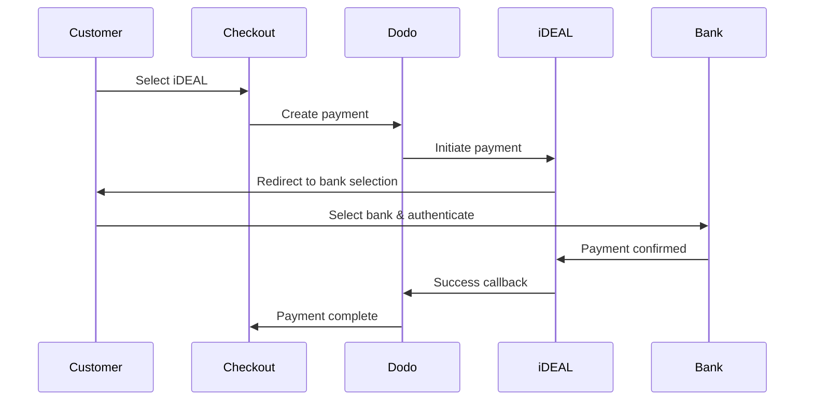

Europeiska kunder föredrar starkt lokala betalningsmetoder som integreras med deras banksystem. Att erbjuda dessa metoder kan öka konverteringsgraden med 20-40% på målmärken.

## Varför lokala europeiska betalningsmetoder?

<CardGroup cols={3}>
<Card title="Högre konvertering" icon="chart-line">
iDEAL fångar ~60% av nederländska onlinebetalningar. Att inte erbjuda det innebär att förlora kunder.
</Card>

<Card title="Lägre bedrägerier" icon="shield-check">
Bank-autentiserade betalningar har nästan noll bedrägerier och inga återkrav.
</Card>

<Card title="Realtidsavveckling" icon="bolt">
De flesta europeiska metoder tillhandahåller omedelbar betalningsbekräftelse.
</Card>
</CardGroup>

## Stödda metoder

| Metod | Land | Marknadsandel | Valuta | Prenumerationer |
| :----- | :------ | :----------- | :------- | :-----------: |
| **iDEAL** | Nederländerna | ~60% | EUR | Nej |
| **Bancontact** | Belgien | ~50% | EUR | Nej |
| **EPS** | Österrike | ~30% | EUR | Nej |
| **Multibanco** | Portugal | ~40% | EUR | Nej |

## iDEAL (Nederländerna)

iDEAL är den dominerande onlinebetalningsmetoden i Nederländerna och ansluter direkt till alla större nederländska banker.

### Så fungerar det



### Stödda banker

Alla större nederländska banker stöds:
- ABN AMRO
- ASN Bank
- Bunq
- ING
- Knab
- Rabobank
- RegioBank
- Revolut
- SNS
- Triodos Bank
- Van Lanschot

### Konfiguration

```javascript
const session = await client.checkoutSessions.create({
  product_cart: [{ product_id: 'prod_123', quantity: 1 }],
  allowed_payment_method_types: ['ideal', 'credit', 'debit'],
  billing_currency: 'EUR',
  billing_address: {
    country: 'NL',
    zipcode: '1012JS'
  },
  return_url: 'https://example.com/success'
});
```

## Bancontact (Belgien)

Bancontact är Belgiens nationella betalningssystem, använt av i stort sett alla belgiska banker för onlinebetalningar.

### Funktioner
- Fungerar med befintliga belgiska bankkort
- Stöd för mobilapp (Payconiq by Bancontact)
- Omedelbar betalningsbekräftelse
- Ingen ytterligare registrering krävs för kunder

### Konfiguration

```javascript
const session = await client.checkoutSessions.create({
  product_cart: [{ product_id: 'prod_123', quantity: 1 }],
  allowed_payment_method_types: ['bancontact_card', 'credit', 'debit'],
  billing_currency: 'EUR',
  billing_address: {
    country: 'BE',
    zipcode: '1000'
  },
  return_url: 'https://example.com/success'
});
```

## EPS (Österrike)

EPS (Electronic Payment Standard) möjliggör direkta onlinebanköverföringar för österrikiska kunder.

### Funktioner
- Direktintegration med österrikiska banker
- Realtidsbetalningsbekräftelse
- Högt förtroende bland österrikiska konsumenter
- Inga återkrav

### Stödda banker

Större österrikiska banker inklusive:
- Erste Bank
- Bank Austria
- Raiffeisen
- BAWAG
- Volksbank

### Konfiguration

```javascript
const session = await client.checkoutSessions.create({
  product_cart: [{ product_id: 'prod_123', quantity: 1 }],
  allowed_payment_method_types: ['eps', 'credit', 'debit'],
  billing_currency: 'EUR',
  billing_address: {
    country: 'AT',
    zipcode: '1010'
  },
  return_url: 'https://example.com/success'
});
```

## Multibanco (Portugal)

Multibanco är Portugals interbanknätverk, som erbjuder både onlinebetalningar och betalningar via bankomater.

### Betalningsalternativ

1. **Onlinebanking** — Direkt banköverföring via internetbank
2. **Bankomatbetalning** — Kunden får en referens för att betala vid någon Multibanco-bankomat
3. **Mobilbanking** — Betalning via bankens mobilappar

### Så fungerar bankomatbetalning

För bankomatbetalningar får kunderna en betalningsreferens:

```
Entity: 12345
Reference: 123 456 789
Amount: €50.00
Expiry: 24 hours
```

Kunden kan betala vid vilken portugisisk bankomat som helst eller via internetbank med denna referens.

### Konfiguration

```javascript
const session = await client.checkoutSessions.create({
  product_cart: [{ product_id: 'prod_123', quantity: 1 }],
  allowed_payment_method_types: ['multibanco', 'credit', 'debit'],
  billing_currency: 'EUR',
  billing_address: {
    country: 'PT',
    zipcode: '1000-001'
  },
  return_url: 'https://example.com/success'
});
```

<Note>
Multibanco bankomatbetalningar kan ha en fördröjning mellan kassan och själva betalningen. Övervaka webhooks för betalningsbekräftelse.
</Note>

## API-metodtyper

| Typ | Metod | Land |
| :--- | :----- | :------ |
| `ideal` | iDEAL | Nederländerna |
| `bancontact_card` | Bancontact | Belgien |
| `eps` | EPS | Österrike |
| `multibanco` | Multibanco | Portugal |

## Multi-land europeisk kassa

För företag som betjänar flera europeiska länder, inkludera alla regionala metoder:

```javascript
const session = await client.checkoutSessions.create({
  product_cart: [{ product_id: 'prod_123', quantity: 1 }],
  allowed_payment_method_types: [
    'ideal',           // Netherlands
    'bancontact_card', // Belgium
    'eps',             // Austria
    'multibanco',      // Portugal
    'credit',          // Fallback
    'debit'            // Fallback
  ],
  billing_currency: 'EUR',
  return_url: 'https://example.com/success'
});
```

Dodo visar automatiskt endast de relevanta metoderna baserat på kundens plats. En nederländsk kund kommer att se iDEAL; en belgisk kund kommer att se Bancontact.

## Testning

Europeiska betalningsmetoder kan testas i sandboxläge. Testflödet simulerar bankautentiseringsprocessen.

<Steps>
<Step title="Aktivera testläge">
Använd dina Dodo Payments test-API-nycklar.
</Step>

<Step title="Ange lämplig faktureringsadress">
Ställ in faktureringsadresslandet för att matcha betalningsmetoden:
- `NL` för iDEAL
- `BE` för Bancontact
- `AT` för EPS
- `PT` för Multibanco
</Step>

<Step title="Slutför testflödet">
Följ det simulerade bankautentiseringsflödet i testmiljön.
</Step>
</Steps>

## Bästa praxis

<AccordionGroup>
<Accordion title="Inkludera alltid regionala metoder för målmarknader">
Om du säljer till nederländska kunder, inkludera iDEAL. Att inte göra det är som att inte acceptera Visa i USA — du kommer att förlora betydande försäljning.
</Accordion>

<Accordion title="Matcha valuta till region">
Europeiska betalningsmetoder kräver EUR. Se till att din prissättning stöder Euro-transaktioner.
</Accordion>

<Accordion title="Hantera omdirigeringar smidigt">
Alla europeiska metoder involverar omdirigeringar till banksajter. Se till att din hantering av retur-URL:er är robust och tar hänsyn till användare som avbryter mitt i flödet.
</Accordion>

<Accordion title="Ge kortalternativ">
Inte alla europeiska kunder har tillgång till dessa regionala metoder (turister, expats, etc.). Inkludera alltid `credit` och `debit` som alternativ.
</Accordion>

<Accordion title="Tänk på Multibanco-timing">
Multibanco bankomatbetalningar kan ta timmar att slutföra. Blockera inte uppfyllandet vid omedelbar betalning — använd webhooks för asynkron bekräftelse.
</Accordion>
</AccordionGroup>

## Felsökning

<AccordionGroup>
<Accordion title="Europeisk metod syns inte">
**Kontrollera:**
1. Matchar kundens faktureringsland metodens land?
2. Valutan är inställd på EUR?
3. Metoden ingår i `allowed_payment_method_types`?

**Lösning:** Europeiska metoder är strikt regionala. En kund med faktureringsland `DE` (Tyskland) ser inte iDEAL, som är exklusiv för Nederländerna.
</Accordion>

<Accordion title="Bankautentisering misslyckades">
**Orsaker:**
- Kunden avbröt under bankautentiseringen
- Bankens autentiseringssystem är tillfälligt otillgängligt
- Kunden angav felaktiga referenser

**Lösning:** Kunden bör försöka igen. Om det kvarstår, föreslå att de försöker en annan betalningsmetod.
</Accordion>

<Accordion title="Omdirigering slutförs inte">
**Orsaker:**
- Kunden stängde webbläsaren under bankomdirigeringen
- Nätverksproblem under autentiseringen
- Retur-URL felkonfigurerad

**Lösning:** Verifiera att retur-URL:en är korrekt och tillgänglig. Se till att den hanterar både framgångs- och felsituationer.
</Accordion>

<Accordion title="Multibanco betalning avvaktande">
**Orsak:** Kunden fick betalningsreferens men har inte betalat ännu.

**Lösning:** Detta förväntas för bankomatbaserade betalningar. Vänta på webhook-bekräftelse. Referensen löper normalt ut inom 24-72 timmar.
</Accordion>
</AccordionGroup>

## PSD2-bestämmelser

Alla europeiska betalningsmetoder följer PSD2 (Payment Services Directive 2) regleringar:

- **Stark kundautentisering (SCA)** — Inbyggd i bankautentiseringsflödet
- **Säker kommunikation** — All data överförs via säkra kanaler
- **Konsumentskydd** — Fullständig efterlevnad av EU:s konsumenträttigheter

## Relaterade sidor

<CardGroup cols={2}>
<Card title="Översikt över betalningsmetoder" icon="credit-card" href="/features/payment-methods">
Se alla stödda betalningsmetoder.
</Card>

<Card title="Adaptiv valuta" icon="globe" href="/features/adaptive-currency">
Valutastöd och automatisk konvertering.
</Card>

<Card title="Kasseguide" icon="book" href="/developer-resources/checkout-session">
Fullständig guide till kasseimplementation.
</Card>

<Card title="Webhooks" icon="webhook" href="/developer-resources/webhooks">
Hanterar betalningsbekräftelser asynkront.
</Card>
</CardGroup>