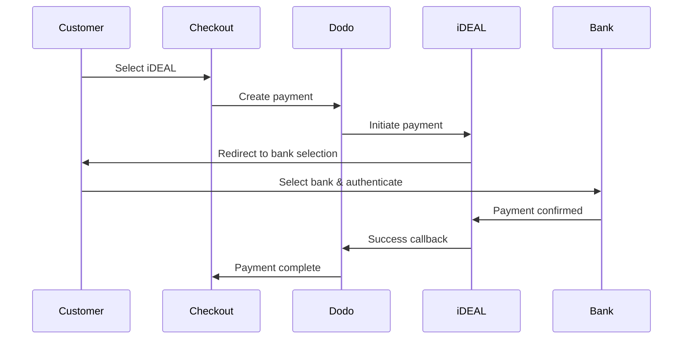
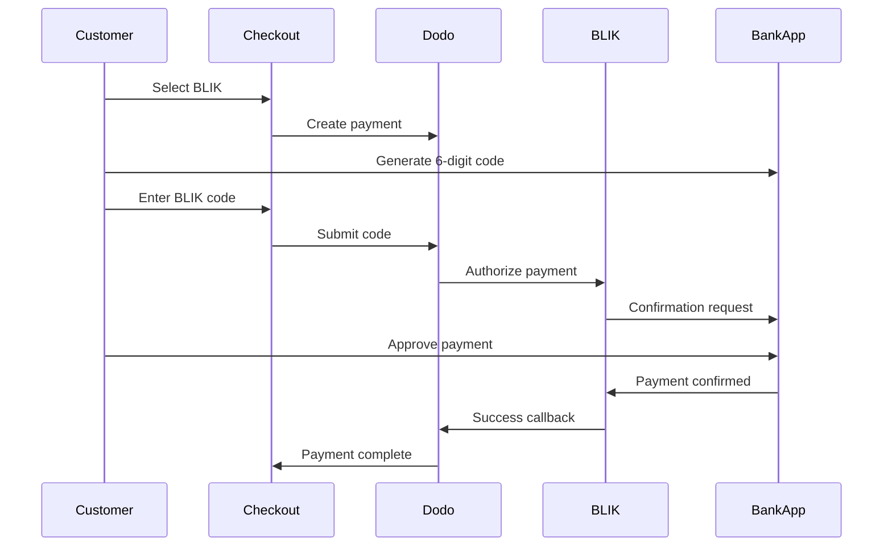
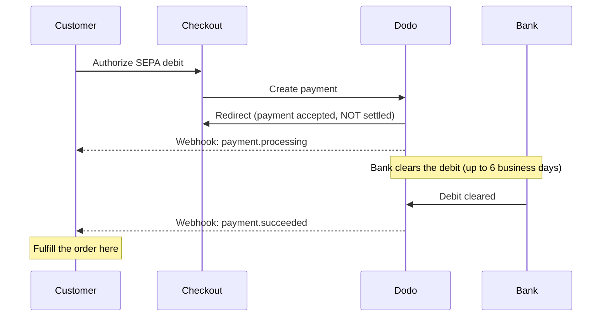

European customers strongly prefer local payment methods that integrate with their banking systems. Offering these methods can increase conversion rates by 20-40% in target markets.

## Why Local European Payment Methods?

<CardGroup cols={3}>
<Card title="Higher Conversion" icon="chart-line">
iDEAL captures ~60% of Dutch online payments. Not offering it means losing customers.
</Card>

<Card title="Lower Fraud" icon="shield-check">
Bank-authenticated payments have near-zero fraud rates and no chargebacks.
</Card>

<Card title="Real-Time Settlement" icon="bolt">
Most European methods provide instant payment confirmation.
</Card>
</CardGroup>

## Supported Methods

| Metod | Land | Marknadsandel | Valuta | Prenumerationer |
| :----- | :------ | :----------- | :------- | :-----------: |
| **iDEAL** | Nederländerna | ~60 % | EUR | Nej |
| **Bancontact** | Belgien | ~50 % | EUR | Nej |
| **EPS** | Österrike | ~30 % | EUR | Nej |
| **Multibanco** | Portugal | ~40 % | EUR | Nej |
| **BLIK** | Polen | ~60 % | PLN | Nej |
| **SEPA Direct Debit** | Euroområdet | Används i stor utsträckning | EUR | Nej |
| **Satispay** | Europa (Italien) | Växande | EUR | Ja |

## iDEAL (Netherlands)

iDEAL is the dominant online payment method in the Netherlands, connecting directly to all major Dutch banks.

### How It Works



### Supported Banks

All major Dutch banks are supported:
- ABN AMRO
- ASN Bank
- Bunq
- ING
- Knab
- Rabobank
- RegioBank
- Revolut
- SNS
- Triodos Bank
- Van Lanschot

### Configuration

```javascript
const session = await client.checkoutSessions.create({
  product_cart: [{ product_id: 'pdt_123', quantity: 1 }],
  allowed_payment_method_types: ['ideal', 'credit', 'debit'],
  billing_currency: 'EUR',
  billing_address: {
    country: 'NL',
    zipcode: '1012JS'
  },
  return_url: 'https://example.com/success'
});
```

## Bancontact (Belgium)

Bancontact is Belgium's national payment scheme, used by virtually all Belgian banks for online payments.

### Features
- Works with existing Belgian debit cards
- Mobile app support (Payconiq by Bancontact)
- Instant payment confirmation
- No additional registration needed for customers

### Configuration

```javascript
const session = await client.checkoutSessions.create({
  product_cart: [{ product_id: 'pdt_123', quantity: 1 }],
  allowed_payment_method_types: ['bancontact_card', 'credit', 'debit'],
  billing_currency: 'EUR',
  billing_address: {
    country: 'BE',
    zipcode: '1000'
  },
  return_url: 'https://example.com/success'
});
```

## EPS (Austria)

EPS (Electronic Payment Standard) enables direct online bank transfers for Austrian customers.

### Features
- Direct integration with Austrian banks
- Real-time payment confirmation
- High trust among Austrian consumers
- No chargebacks

### Supported Banks

Major Austrian banks including:
- Erste Bank
- Bank Austria
- Raiffeisen
- BAWAG
- Volksbank

### Configuration

```javascript
const session = await client.checkoutSessions.create({
  product_cart: [{ product_id: 'pdt_123', quantity: 1 }],
  allowed_payment_method_types: ['eps', 'credit', 'debit'],
  billing_currency: 'EUR',
  billing_address: {
    country: 'AT',
    zipcode: '1010'
  },
  return_url: 'https://example.com/success'
});
```

## Multibanco (Portugal)

Multibanco is Portugal's interbank network, offering both online payments and ATM-based payments.

### Payment Options

1. **Online Banking** — Direct bank transfer via internet banking
2. **ATM Payment** — Customer receives a reference to pay at any Multibanco ATM
3. **Mobile Banking** — Payment via bank mobile apps

### How ATM Payment Works

For ATM payments, customers receive a payment reference:

```
Entity: 12345
Reference: 123 456 789
Amount: €50.00
Expiry: 24 hours
```

Customer can pay at any Portuguese ATM or via online banking using this reference.

### Configuration

```javascript
const session = await client.checkoutSessions.create({
  product_cart: [{ product_id: 'pdt_123', quantity: 1 }],
  allowed_payment_method_types: ['multibanco', 'credit', 'debit'],
  billing_currency: 'EUR',
  billing_address: {
    country: 'PT',
    zipcode: '1000-001'
  },
  return_url: 'https://example.com/success'
});
```

<Note>
Multibanco ATM payments may have a delay between checkout and actual payment. Monitor webhooks for payment confirmation.
</Note>

## BLIK (Polen)

BLIK är Polens populäraste mobila betalningsmetod och låter kunder betala med en engångskod på 6 siffror som genereras i deras bankapp. BLIK avräknas i **PLN** (polska zloty), inte EUR.

### Hur det fungerar



### Tillgänglighet

- **Faktureringsvaluta:** Endast PLN
- **Transaktionstyp:** Endast engångsbetalningar (inte tillgängligt för prenumerationer)
- **Täckning:** Alla större polska banker som stöder BLIK

### Konfiguration

```javascript
const session = await client.checkoutSessions.create({
  product_cart: [{ product_id: 'pdt_123', quantity: 1 }],
  allowed_payment_method_types: ['blik', 'credit', 'debit'],
  billing_currency: 'PLN',
  billing_address: {
    country: 'PL',
    zipcode: '00-001'
  },
  return_url: 'https://example.com/success'
});
```

<Note>
BLIK kräver PLN som **faktureringsvaluta**. Om du anger dina priser i EUR aktiverar du [Adaptive Currency](/features/adaptive-currency) så att polska kunder faktureras i PLN och BLIK blir tillgängligt.
</Note>

## SEPA Direct Debit (Euroområdet)

SEPA Direct Debit låter kunder i hela euroområdet betala direkt från sitt bankkonto i stället för att använda ett kort. Det erbjuds i EUR-kassor för engångsbetalningar.

<Warning>
**SEPA Direct Debit är inte omedelbar — en betalning tar upp till 6 arbetsdagar att bekräfta.** Till skillnad från alla andra metoder på den här sidan innebär det **inte** att pengarna har kommit in när kunden godkänner autogireringen i kassan. Slutför aldrig ordern vid omdirigering från kassan eller vid `payment.processing`; vänta på webhooken `payment.succeeded`.
</Warning>

### Så fungerar det

Kunden godkänner autogireringen i kassan, och Dodo Payments hämtar sedan pengarna från kundens bankkonto. Eftersom banken behandlar autogireringen asynkront går betalningen igenom ett tillstånd av typen `processing` innan den når ett slutgiltigt resultat:



### Betalningens tidslinje

| Steg | När | Betalningsstatus | Vad det innebär |
| :---- | :--- | :------------- | :------------ |
| **Godkännande** | I kassan | `processing` | Kunden godkände autogireringen och omdirigerades tillbaka. Pengarna har **inte** flyttats ännu — slutför inte ordern. |
| **Bekräftelse** | Upp till **6 arbetsdagar** senare | `succeeded` | Banken har genomfört autogireringen. Slutför ordern nu. |
| **Misslyckande** | Upp till **6 arbetsdagar** senare | `failed` | Autogireringen kunde inte genomföras (t.ex. på grund av otillräckliga medel). Slutför inte ordern; meddela kunden. |

Eftersom bekräftelsen kommer flera dagar efter att kunden lämnar din webbplats måste din webhook-hanterare — inte omdirigeringen från kassan — styra när åtkomst beviljas. Se [Hantera fördröjningen för bekräftelse](#handling-the-confirmation-delay) nedan.

### Tillgänglighet

- **Faktureringsvaluta:** EUR
- **Transaktionstyp:** Endast engångsbetalningar (inte tillgängligt för prenumerationer)

### Konfiguration

```javascript
const session = await client.checkoutSessions.create({
  product_cart: [{ product_id: 'pdt_123', quantity: 1 }],
  allowed_payment_method_types: ['sepa', 'credit', 'debit'],
  billing_currency: 'EUR',
  billing_address: {
    country: 'DE',
    zipcode: '10115'
  },
  return_url: 'https://example.com/success'
});
```

### SEPA-test-IBAN

I testläge anger du en av IBAN-numren nedan i kassan för att tvinga fram ett specifikt resultat.

| Test-IBAN | Beteende |
| :-------- | :------- |
| `DE89370400440532013000` | Betalningen lyckas. |
| `DE08370400440532013003` | Betalningen lyckas efter en fördröjning på minst tre minuter. |
| `DE62370400440532013001` | Betalningen misslyckas. |
| `DE78370400440532013004` | Betalningen misslyckas efter en fördröjning på minst tre minuter. |
| `DE35370400440532013002` | Betalningen lyckas och bestrids sedan omedelbart. |
| `DE65370400440002222227` | Betalningen misslyckas på grund av otillräckliga medel. |
| `DE18370400440000066666` | Bankkontot kan inte användas, så betalningsmetoden kan inte skapas. |

Om du vill testa landsspecifikt beteende använder du motsvarande lyckade IBAN för ett annat eurolandsland:

| Land | Lyckad IBAN |
| :------ | :----------- |
| Österrike | `AT611904300234573201` |
| Belgien | `BE62510007547061` |
| Estland | `EE382200221020145685` |
| Finland | `FI2112345600000785` |
| Frankrike | `FR1420041010050500013M02606` |
| Irland | `IE29AIBK93115212345678` |
| Luxemburg | `LU280019400644750000` |

<Note>
De fördröjda test-IBAN-numren är användbara för att bekräfta att det är din webhook-hanterare — och inte omdirigeringen från kassan — som beviljar åtkomst, eftersom SEPA-betalningar bekräftas långt efter att kunden lämnar kassan.
</Note>

### Hantera fördröjningen för bekräftelse

Eftersom SEPA slutförs upp till 6 arbetsdagar efter kassan kan du inte förlita dig på webbläsarens omdirigering för att veta om en betalning har kommit in. Styr i stället orderhanteringen utifrån webhook-händelser. Aktivera `payload.type` och hantera varje steg:

| Händelsetyp | När den utlöses | Vad du ska göra |
| :--------- | :------------ | :--------- |
| `payment.processing` | Kunden godkände autogireringen i kassan och omdirigerades tillbaka. | **Slutför inte ordern.** Markera ordern som väntande och informera vid behov kunden om att betalningen behandlas. |
| `payment.succeeded` | Banken har genomfört autogireringen (upp till 6 arbetsdagar senare). | Slutför ordern — bevilja åtkomst, tillhandahåll produkten och skicka kvittot. |
| `payment.failed` | Autogireringen kunde inte genomföras. | Meddela kunden och be kunden försöka igen; slutför inte ordern. |

```javascript Handling SEPA payment events expandable
app.post('/webhooks/dodo', async (req, res) => {
  const event = req.body;

  switch (event.type) {
    case 'payment.processing': {
      // SEPA debit authorized but NOT settled — this can last up to 6 business days.
      // Record the order as pending; do not grant access yet.
      await markOrderPending(event.data.payment_id);
      break;
    }
    case 'payment.succeeded': {
      // The debit cleared — safe to fulfill now.
      await fulfillOrder(event.data.payment_id);
      break;
    }
    case 'payment.failed': {
      // The debit could not be collected (e.g. insufficient funds).
      await markOrderFailed(event.data.payment_id);
      // Notify the customer and prompt a retry.
      break;
    }
  }

  res.json({ received: true });
});
```

<Tip>
Slutför alltid ordern vid `payment.succeeded` från webhooken, aldrig vid omdirigeringen från kassan eller vid `payment.processing`. Omdirigeringen sker i samma ögonblick som kunden godkänner autogireringen — flera dagar innan pengarna faktiskt kommer in. Verifiera webhook-signaturen innan behandlingen påbörjas; se [Webhooks-guiden](/developer-resources/webhooks) för konfiguration och [Webhook Event Guide](/developer-resources/webhooks/intents/webhook-events-guide) för den fullständiga händelselistan.
</Tip>

<Warning>
Sätt rätt förväntningar hos kunden i kassan. Eftersom åtkomst endast beviljas efter att autogireringen har genomförts ska du informera SEPA-kunder om att deras order behandlas och att de får ett meddelande när betalningen har bekräftats — annars kan de förvänta sig omedelbar åtkomst som vid en kortbetalning.
</Warning>

## Satispay (Europa)

Satispay är ett populärt europeiskt mobilbetalningsnätverk, särskilt i Italien, som låter kunder betala direkt från sin Satispay-app utan att dela kort- eller bankuppgifter. Satispay avräknas i **EUR**.

### Funktioner

- Appbaserade betalningar som inte är beroende av kortnätverk
- Stor användning i Italien och växande användning på andra europeiska marknader
- Stöder både engångsbetalningar och prenumerationer

### Tillgänglighet

- **Faktureringsvaluta:** EUR
- **Transaktionstyp:** Engångsbetalningar och prenumerationer

### Konfiguration

```javascript
const session = await client.checkoutSessions.create({
  product_cart: [{ product_id: 'pdt_123', quantity: 1 }],
  allowed_payment_method_types: ['satispay', 'credit', 'debit'],
  billing_currency: 'EUR',
  billing_address: {
    country: 'IT',
    zipcode: '00100'
  },
  return_url: 'https://example.com/success'
});
```

## API-metodtyper

| Typ | Metod | Land |
| :--- | :----- | :------ |
| `ideal` | iDEAL | Nederländerna |
| `bancontact_card` | Bancontact | Belgien |
| `eps` | EPS | Österrike |
| `multibanco` | Multibanco | Portugal |
| `blik` | BLIK | Polen |
| `sepa` | SEPA Direct Debit | Euroområdet |
| `satispay` | Satispay | Europa (Italien) |

## Europeisk kassa för flera länder

För företag som betjänar flera europeiska länder inkluderar du alla regionala metoder:

```javascript
const session = await client.checkoutSessions.create({
  product_cart: [{ product_id: 'pdt_123', quantity: 1 }],
  allowed_payment_method_types: [
    'ideal',           // Netherlands
    'bancontact_card', // Belgium
    'eps',             // Austria
    'multibanco',      // Portugal
    'blik',            // Poland (requires PLN billing currency)
    'sepa',            // Eurozone (one-time payments only)
    'satispay',        // Europe / Italy
    'credit',          // Fallback
    'debit'            // Fallback
  ],
  billing_currency: 'EUR',
  return_url: 'https://example.com/success'
});
```

Dodo visar automatiskt endast de relevanta metoderna baserat på kundens plats. En nederländsk kund ser iDEAL; en belgisk kund ser Bancontact.

## Testning

Europeiska betalningsmetoder kan testas i Test Mode. Testflödet simulerar bankens autentiseringsprocess.

<Note>
SEPA Direct Debit testas på ett annat sätt — i stället för ett simulerat bankflöde anger du en test-IBAN direkt. Se [SEPA-test-IBAN](#sepa-test-ibans).
</Note>

<Steps>
<Step title="Enable test mode">
Använd dina test-API-nycklar för Dodo Payments.
</Step>

<Step title="Set appropriate billing address">
Ange faktureringsadressens land så att det matchar betalningsmetoden:
- `NL` för iDEAL
- `BE` för Bancontact
- `AT` för EPS
- `PT` för Multibanco
- `PL` för BLIK (med PLN som faktureringsvaluta)
- `IT` för Satispay
</Step>

<Step title="Complete the test flow">
Följ det simulerade autentiseringsflödet hos banken i testmiljön.
</Step>
</Steps>

## Bästa praxis

<AccordionGroup>
<Accordion title="Always include regional methods for target markets">
Om du säljer till nederländska kunder ska du inkludera iDEAL. Att inte göra det är som att inte acceptera Visa i USA — du kommer att förlora betydande försäljning.
</Accordion>

<Accordion title="Match currency to region">
De flesta europeiska betalningsmetoder kräver EUR — se till att din prissättning stöder transaktioner i euro. Det enda undantaget är BLIK, som endast erbjuds med **PLN** (polska zloty) som faktureringsvaluta.
</Accordion>

<Accordion title="Handle redirects gracefully">
Alla europeiska metoder innebär omdirigeringar till bankwebbplatser. Se till att hanteringen av retur-URL:er är robust och tar hänsyn till användare som avbryter mitt i flödet.
</Accordion>

<Accordion title="Provide card fallbacks">
Alla europeiska kunder har inte tillgång till dessa regionala metoder (turister, utlandsboende och så vidare). Inkludera alltid `credit` och `debit` som alternativ.
</Accordion>

<Accordion title="Consider Multibanco timing">
Multibanco ATM-betalningar kan ta flera timmar att slutföra. Blockera inte orderhanteringen i väntan på omedelbar betalning — använd webhooks för asynkron bekräftelse.
</Accordion>

<Accordion title="Account for the SEPA 6-day delay">
SEPA Direct Debit tar upp till **6 arbetsdagar** att bekräfta. Slutför aldrig ordern vid omdirigeringen från kassan eller vid `payment.processing` — bevilja åtkomst endast från webhooken `payment.succeeded` och ange tydliga förväntningar i kassan så att kunderna vet att deras order väntar. Se [Hantera fördröjningen för bekräftelse](#handling-the-confirmation-delay).
</Accordion>
</AccordionGroup>

## Felsökning

<AccordionGroup>
<Accordion title="European method not appearing">
**Kontrollera:**
1. Matchar kundens faktureringsland metodens land?
2. Är valutan inställd på EUR?
3. Ingår metoden i `allowed_payment_method_types`?

**Lösning:** Europeiska metoder är strikt regionala. En kund med faktureringsland `DE` (Tyskland) ser inte iDEAL, som endast finns i Nederländerna.
</Accordion>

<Accordion title="Bank authentication failed">
**Orsaker:**
- Kunden avbröt under bankautentiseringen
- Bankens autentiseringssystem är tillfälligt otillgängligt
- Kunden angav felaktiga inloggningsuppgifter

**Lösning:** Kunden bör försöka igen. Om problemet kvarstår kan du föreslå att kunden testar en annan betalningsmetod.
</Accordion>

<Accordion title="Redirect not completing">
**Orsaker:**
- Kunden stängde webbläsaren under bankens omdirigering
- Nätverksproblem under autentiseringen
- Retur-URL:en är felkonfigurerad

**Lösning:** Kontrollera att retur-URL:en är korrekt och tillgänglig. Se till att den hanterar både lyckade och misslyckade tillstånd.
</Accordion>

<Accordion title="Multibanco payment pending">
**Orsak:** Kunden fick en betalningsreferens men har ännu inte betalat.

**Lösning:** Detta är förväntat för ATM-baserade betalningar. Vänta på webhook-bekräftelsen. Referensen upphör vanligtvis att gälla efter 24–72 timmar.
</Accordion>

<Accordion title="SEPA payment stuck in processing">
**Orsak:** SEPA Direct Debit genomförs asynkront via kundens bank.

**Lösning:** Detta är förväntat. Ett tillstånd av typen `payment.processing` kan vara i upp till **6 arbetsdagar** innan autogireringen genomförs. Vänta på den slutgiltiga webhooken `payment.succeeded` (slutför ordern) eller `payment.failed` (slutför inte ordern) — behandla inte omdirigeringen från kassan som en bekräftelse. Se [Hantera fördröjningen för bekräftelse](#handling-the-confirmation-delay).
</Accordion>
</AccordionGroup>

## PSD2-efterlevnad

Alla europeiska betalningsmetoder följer PSD2-reglerna (Payment Services Directive 2):

- **Strong Customer Authentication (SCA)** — Inbyggd i bankens autentiseringsflöde
- **Säker kommunikation** — Alla data överförs via säkra kanaler
- **Konsumentskydd** — Full efterlevnad av EU:s konsumenträttigheter

## Relaterade sidor

<CardGroup cols={2}>
<Card title="Payment Methods Overview" icon="credit-card" href="/features/payment-methods">
Se alla betalningsmetoder som stöds.
</Card>

<Card title="Adaptive Currency" icon="globe" href="/features/adaptive-currency">
Valutastöd och automatisk konvertering.
</Card>

<Card title="Checkout Guide" icon="book" href="/developer-resources/checkout-session">
Komplett guide till implementering av kassan.
</Card>

<Card title="Webhooks" icon="webhook" href="/developer-resources/webhooks">
Hantera betalningsbekräftelser asynkront.
</Card>
</CardGroup>