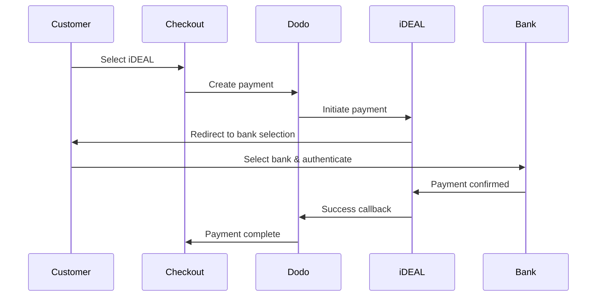
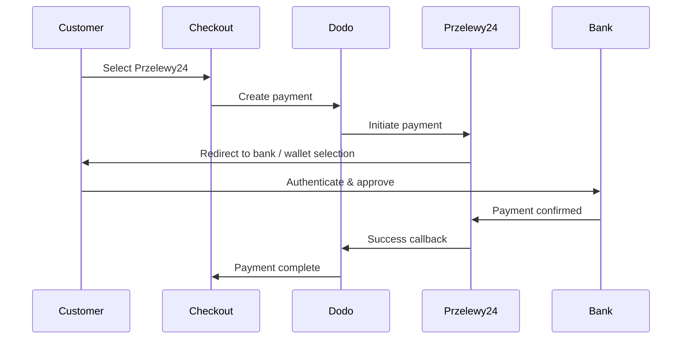
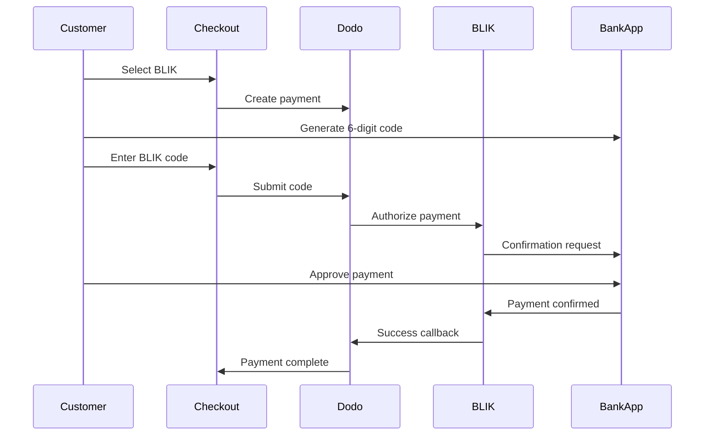

European customers strongly prefer local payment methods that integrate with their banking systems. Offering these methods can increase conversion rates by 20-40% in target markets.

## Why Local European Payment Methods?

<CardGroup cols={3}>
<Card title="Higher Conversion" icon="chart-line">
iDEAL captures ~60% of Dutch online payments. Not offering it means losing customers.
</Card>

<Card title="Lower Fraud" icon="shield-check">
Bank-authenticated payments have near-zero fraud rates and no chargebacks.
</Card>

<Card title="Real-Time Settlement" icon="bolt">
Most European methods provide instant payment confirmation.
</Card>
</CardGroup>

## Supported Methods

| Metod | Land | Marknadsandel | Valuta | Prenumerationer |
| :----- | :------ | :----------- | :------- | :-----------: |
| **iDEAL** | Nederländerna | ~60 % | EUR | Nej |
| **Bancontact** | Belgien | ~50 % | EUR | Nej |
| **EPS** | Österrike | ~30 % | EUR | Nej |
| **Multibanco** | Portugal | ~40 % | EUR | Nej |
| **Przelewy24 (P24)** | Polen | ~30 % | PLN | Nej |
| **BLIK** | Polen | ~60 % | PLN | Nej |
| **SEPA Direct Debit** | Euroområdet | Används i stor utsträckning | EUR | Nej |
| **Satispay** | Europa (Italien) | Växande | EUR | Ja |

## iDEAL (Netherlands)

iDEAL is the dominant online payment method in the Netherlands, connecting directly to all major Dutch banks.

### How It Works



### Supported Banks

All major Dutch banks are supported:
- ABN AMRO
- ASN Bank
- Bunq
- ING
- Knab
- Rabobank
- RegioBank
- Revolut
- SNS
- Triodos Bank
- Van Lanschot

### Configuration

```javascript
const session = await client.checkoutSessions.create({
  product_cart: [{ product_id: 'prod_123', quantity: 1 }],
  allowed_payment_method_types: ['ideal', 'credit', 'debit'],
  billing_currency: 'EUR',
  billing_address: {
    country: 'NL',
    zipcode: '1012JS'
  },
  return_url: 'https://example.com/success'
});
```

## Bancontact (Belgium)

Bancontact is Belgium's national payment scheme, used by virtually all Belgian banks for online payments.

### Features
- Works with existing Belgian debit cards
- Mobile app support (Payconiq by Bancontact)
- Instant payment confirmation
- No additional registration needed for customers

### Configuration

```javascript
const session = await client.checkoutSessions.create({
  product_cart: [{ product_id: 'prod_123', quantity: 1 }],
  allowed_payment_method_types: ['bancontact_card', 'credit', 'debit'],
  billing_currency: 'EUR',
  billing_address: {
    country: 'BE',
    zipcode: '1000'
  },
  return_url: 'https://example.com/success'
});
```

## EPS (Austria)

EPS (Electronic Payment Standard) enables direct online bank transfers for Austrian customers.

### Features
- Direct integration with Austrian banks
- Real-time payment confirmation
- High trust among Austrian consumers
- No chargebacks

### Supported Banks

Major Austrian banks including:
- Erste Bank
- Bank Austria
- Raiffeisen
- BAWAG
- Volksbank

### Configuration

```javascript
const session = await client.checkoutSessions.create({
  product_cart: [{ product_id: 'prod_123', quantity: 1 }],
  allowed_payment_method_types: ['eps', 'credit', 'debit'],
  billing_currency: 'EUR',
  billing_address: {
    country: 'AT',
    zipcode: '1010'
  },
  return_url: 'https://example.com/success'
});
```

## Multibanco (Portugal)

Multibanco is Portugal's interbank network, offering both online payments and ATM-based payments.

### Payment Options

1. **Online Banking** — Direct bank transfer via internet banking
2. **ATM Payment** — Customer receives a reference to pay at any Multibanco ATM
3. **Mobile Banking** — Payment via bank mobile apps

### How ATM Payment Works

For ATM payments, customers receive a payment reference:

```
Entity: 12345
Reference: 123 456 789
Amount: €50.00
Expiry: 24 hours
```

Customer can pay at any Portuguese ATM or via online banking using this reference.

### Configuration

```javascript
const session = await client.checkoutSessions.create({
  product_cart: [{ product_id: 'prod_123', quantity: 1 }],
  allowed_payment_method_types: ['multibanco', 'credit', 'debit'],
  billing_currency: 'EUR',
  billing_address: {
    country: 'PT',
    zipcode: '1000-001'
  },
  return_url: 'https://example.com/success'
});
```

<Note>
Multibanco ATM payments may have a delay between checkout and actual payment. Monitor webhooks for payment confirmation.
</Note>

## Przelewy24 (Polen)

Przelewy24 (P24) är Polens ledande onlinebetalningsmetod, som aggregerar banköverföringar och lokala plånböcker hos alla större polska banker. Till skillnad från de andra europeiska metoderna avräknas Przelewy24 i **PLN** (polska złoty), inte EUR.

### Hur det fungerar



### Tillgänglighet

- **Faktureringsvaluta:** Endast PLN
- **Transaktionstyp:** Endast engångsbetalningar (inte tillgängligt för prenumerationer)
- **Täckning:** Alla större polska banker plus populära lokala plånböcker

### Konfiguration

```javascript
const session = await client.checkoutSessions.create({
  product_cart: [{ product_id: 'prod_123', quantity: 1 }],
  allowed_payment_method_types: ['przelewy24', 'credit', 'debit'],
  billing_currency: 'PLN',
  billing_address: {
    country: 'PL',
    zipcode: '00-001'
  },
  return_url: 'https://example.com/success'
});
```

<Note>
Przelewy24 kräver en faktureringsvaluta i **PLN**. Om du anger priser i EUR, aktivera [Adaptive Currency](/features/adaptive-currency) så att polska kunder faktureras i PLN och Przelewy24 blir tillgänglig.
</Note>

## BLIK (Polen)

BLIK är Polens mest populära mobila betalningsmetod, som tillåter kunder att betala med en engångskod på 6 siffror genererad i sin bankapp. Liksom Przelewy24 avräknas BLIK i **PLN** (Polska Złoty), inte EUR.

### Så fungerar det



### Tillgänglighet

- **Faktureringsvaluta:** Endast PLN
- **Transaktionstyp:** Endast engångsbetalningar (inte tillgängligt för prenumerationer)
- **Täckning:** Alla stora polska banker som stöder BLIK

### Konfiguration

```javascript
const session = await client.checkoutSessions.create({
  product_cart: [{ product_id: 'prod_123', quantity: 1 }],
  allowed_payment_method_types: ['blik', 'credit', 'debit'],
  billing_currency: 'PLN',
  billing_address: {
    country: 'PL',
    zipcode: '00-001'
  },
  return_url: 'https://example.com/success'
});
```

<Note>
BLIK kräver en **PLN** faktureringsvaluta. Om du prissätter i EUR, aktivera [Adaptiv Valuta](/features/adaptive-currency) så att polska kunder faktureras i PLN och BLIK blir tillgängligt.
</Note>

## SEPA Direct Debit (Euroområdet)

SEPA Direct Debit låter kunder i hela euroområdet betala direkt från sitt bankkonto i stället för att använda ett kort. Det erbjuds vid EUR-betalningar för engångsbetalningar.

### Så fungerar det

Kunden godkänner debiteringen under betalningen och betalningen hämtas från kundens bankkonto. Till skillnad från de flesta europeiska metoderna på den här sidan sker bekräftelsen inte omedelbart.

<Warning>
SEPA Direct Debit är inte omedelbart. Det tar **6 bankdagar** innan en betalning bekräftas. Behandla därför inte auktorisering som slutlig betalning — slutför leveransen först när betalningen har statusen succeeded.
</Warning>

### Tillgänglighet

- **Faktureringsvaluta:** EUR
- **Transaktionstyp:** Endast engångsbetalningar (inte tillgängligt för prenumerationer)

### Konfiguration

```javascript
const session = await client.checkoutSessions.create({
  product_cart: [{ product_id: 'prod_123', quantity: 1 }],
  allowed_payment_method_types: ['sepa', 'credit', 'debit'],
  billing_currency: 'EUR',
  billing_address: {
    country: 'DE',
    zipcode: '10115'
  },
  return_url: 'https://example.com/success'
});
```

## Satispay (Europa)

Satispay är ett populärt europeiskt mobilbetalningsnätverk, särskilt i Italien, som låter kunder betala direkt från sin Satispay-app utan att dela kort- eller bankuppgifter. Satispay avräknas i **EUR**.

### Funktioner

- Appbaserade betalningar som är oberoende av kortnätverk
- Stor användning i Italien och växande användning på andra europeiska marknader
- Stöd för både engångsbetalningar och prenumerationer

### Tillgänglighet

- **Faktureringsvaluta:** EUR
- **Transaktionstyp:** Engångsbetalningar och prenumerationer

### Konfiguration

```javascript
const session = await client.checkoutSessions.create({
  product_cart: [{ product_id: 'prod_123', quantity: 1 }],
  allowed_payment_method_types: ['satispay', 'credit', 'debit'],
  billing_currency: 'EUR',
  billing_address: {
    country: 'IT',
    zipcode: '00100'
  },
  return_url: 'https://example.com/success'
});
```

## API-metodtyper

| Typ | Metod | Land |
| :--- | :----- | :------ |
| `ideal` | iDEAL | Nederländerna |
| `bancontact_card` | Bancontact | Belgien |
| `eps` | EPS | Österrike |
| `multibanco` | Multibanco | Portugal |
| `przelewy24` | Przelewy24 (P24) | Polen |
| `blik` | BLIK | Polen |
| `sepa` | SEPA Direct Debit | Euroområdet |
| `satispay` | Satispay | Europa (Italien) |

## Europeisk betalning i flera länder

För företag som betjänar flera europeiska länder bör du inkludera alla regionala metoder:

```javascript
const session = await client.checkoutSessions.create({
  product_cart: [{ product_id: 'prod_123', quantity: 1 }],
  allowed_payment_method_types: [
    'ideal',           // Netherlands
    'bancontact_card', // Belgium
    'eps',             // Austria
    'multibanco',      // Portugal
    'przelewy24',      // Poland (requires PLN billing currency)
    'blik',            // Poland (requires PLN billing currency)
    'sepa',            // Eurozone (one-time payments only)
    'satispay',        // Europe / Italy
    'credit',          // Fallback
    'debit'            // Fallback
  ],
  billing_currency: 'EUR',
  return_url: 'https://example.com/success'
});
```

Dodo visar automatiskt endast de relevanta metoderna baserat på kundens plats. En nederländsk kund ser iDEAL, medan en belgisk kund ser Bancontact.

## Testning

Europeiska betalningsmetoder kan testas i sandbox-läge. Testflödet simulerar bankens autentiseringsprocess.

<Steps>
<Step title="Enable test mode">
Använd dina test-API-nycklar för Dodo Payments.
</Step>

<Step title="Set appropriate billing address">
Ange landet för faktureringsadressen så att det matchar betalningsmetoden:
- `NL` för iDEAL
- `BE` för Bancontact
- `AT` för EPS
- `PT` för Multibanco
- `PL` för Przelewy24 och BLIK (med PLN som faktureringsvaluta)
- `IT` för Satispay
</Step>

<Step title="Complete the test flow">
Följ det simulerade flödet för bankautentisering i testmiljön.
</Step>
</Steps>

## Bästa praxis

<AccordionGroup>
<Accordion title="Always include regional methods for target markets">
Om du säljer till nederländska kunder bör du inkludera iDEAL. Att inte göra det är som att inte acceptera Visa i USA — du kommer att förlora betydande försäljning.
</Accordion>

<Accordion title="Match currency to region">
De flesta europeiska betalningsmetoder kräver EUR — se till att din prissättning stöder transaktioner i euro. Det enda undantaget är Przelewy24, som endast erbjuds med **PLN** (polska zloty) som faktureringsvaluta.
</Accordion>

<Accordion title="Handle redirects gracefully">
Alla europeiska metoder innebär omdirigeringar till banksidor. Se till att hanteringen av din retur-URL är robust och tar hänsyn till användare som avbryter mitt i flödet.
</Accordion>

<Accordion title="Provide card fallbacks">
Alla europeiska kunder har inte tillgång till dessa regionala metoder (turister, utlandsstationerade med flera). Inkludera alltid `credit` och `debit` som reservalternativ.
</Accordion>

<Accordion title="Consider Multibanco timing">
Multibanco ATM-betalningar kan ta flera timmar att slutföra. Blockera inte leveransen i väntan på omedelbar betalning — använd webhooks för asynkron bekräftelse.
</Accordion>
</AccordionGroup>

## Felsökning

<AccordionGroup>
<Accordion title="European method not appearing">
**Kontrollera:**
1. Matchar kundens faktureringsland metodens land?
2. Är valutan inställd på EUR?
3. Ingår metoden i `allowed_payment_method_types`?

**Lösning:** Europeiska metoder är strikt regionala. En kund med faktureringslandet `DE` (Tyskland) ser inte iDEAL, som endast är tillgängligt i Nederländerna.
</Accordion>

<Accordion title="Bank authentication failed">
**Orsaker:**
- Kunden avbröt under bankautentiseringen
- Bankens autentiseringssystem är tillfälligt otillgängligt
- Kunden angav felaktiga inloggningsuppgifter

**Lösning:** Kunden bör försöka igen. Om problemet kvarstår kan du föreslå att kunden provar en annan betalningsmetod.
</Accordion>

<Accordion title="Redirect not completing">
**Orsaker:**
- Kunden stängde webbläsaren under bankomdirigeringen
- Nätverksproblem under autentiseringen
- Retur-URL:en är felkonfigurerad

**Lösning:** Kontrollera att retur-URL:en är korrekt och tillgänglig. Se till att den hanterar både lyckade och misslyckade tillstånd.
</Accordion>

<Accordion title="Multibanco payment pending">
**Orsak:** Kunden fick en betalningsreferens men har ännu inte betalat.

**Lösning:** Detta är förväntat för ATM-baserade betalningar. Vänta på bekräftelse via webhook. Referensen löper vanligtvis ut efter 24–72 timmar.
</Accordion>
</AccordionGroup>

## PSD2-efterlevnad

Alla europeiska betalningsmetoder följer PSD2-reglerna (Payment Services Directive 2):

- **Strong Customer Authentication (SCA)** — Inbyggt i bankautentiseringsflödet
- **Säker kommunikation** — Alla data överförs via säkra kanaler
- **Konsumentskydd** — Full efterlevnad av EU:s konsumenträttigheter

## Relaterade sidor

<CardGroup cols={2}>
<Card title="Payment Methods Overview" icon="credit-card" href="/features/payment-methods">
Se alla betalningsmetoder som stöds.
</Card>

<Card title="Adaptive Currency" icon="globe" href="/features/adaptive-currency">
Valutastöd och automatisk konvertering.
</Card>

<Card title="Checkout Guide" icon="book" href="/developer-resources/checkout-session">
Komplett guide till implementering av betalning.
</Card>

<Card title="Webhooks" icon="webhook" href="/developer-resources/webhooks">
Hantera betalningsbekräftelser asynkront.
</Card>
</CardGroup>