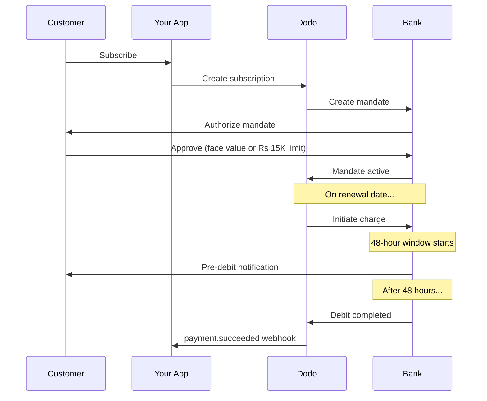

Indien har en unik betalningsinfrastruktur som domineras av UPI (60 % eller mer av de digitala transaktionerna) och kort utfärdade i Indien (Visa, Mastercard, Rupay med flera). Dodo Payments stöder alla dessa med full RBI-efterlevnad för prenumerationsmandat.

## Varför betalningsmetoder i Indien är viktiga

<CardGroup cols={3}>
<Card title="UPI Dominance" icon="mobile">
UPI hanterar över 10 miljarder transaktioner per månad. Många indiska kunder har inte internationella kort.
</Card>

<Card title="Low Transaction Costs" icon="indian-rupee-sign">
UPI har nästan inga transaktionsavgifter. Utmärkt för transaktioner med hög volym och lägre värde.
</Card>

<Card title="Subscription Support" icon="repeat">
Till skillnad från de flesta alternativa betalningsmetoder stöder UPI och alla kort utfärdade i Indien (Visa, Mastercard, Rupay med flera) återkommande betalningar via RBI-mandat.
</Card>
</CardGroup>

## Metoder som stöds

| Metod | Typ | Prenumerationer | Minsta belopp |
| :----- | :--- | :-----------: | :--------- |
| **UPI Collect** | QR-kod / VPA | Ja* | ₹1 |
| **Rupay Credit** | Kort | Ja* | ₹1 |
| **Rupay Debit** | Kort | Ja* | ₹1 |

*Prenumerationer kräver RBI-kompatibla mandat med särskilda behandlingsregler. 48-timmarsfördröjningen för behandling gäller alla kort utfärdade i Indien och UPI.

## Konfiguration

### API-metodtyper

| Typ | Beskrivning |
| :--- | :---------- |
| `upi_collect` | UPI via QR-kod eller VPA-inmatning |
| `credit` | Kreditkort, inklusive Rupay |
| `debit` | Betalkort, inklusive Rupay |

### Exempel: Indienfokuserad checkout

```javascript
const session = await client.checkoutSessions.create({
  product_cart: [{ product_id: 'prod_123', quantity: 1 }],
  allowed_payment_method_types: [
    'upi_collect',
    'credit',
    'debit'
  ],
  billing_currency: 'INR',
  customer: {
    email: 'customer@example.in',
    name: 'Priya Sharma',
    phone_number: '+919876543210'
  },
  billing_address: {
    country: 'IN',
    zipcode: '560001'
  },
  return_url: 'https://example.com/success'
});
```

### Krav för UPI

För att UPI ska visas i checkout:
1. **Faktureringsland** måste vara Indien (`IN`)
2. **Valutan** måste vara INR
3. För icke-indiska merchants: **Adaptive Currency** måste vara aktiverat

<Warning>
Om du är en icke-indisk merchant och Adaptive Currency inte är aktiverat kommer UPI inte att vara tillgängligt för dina kunder.
</Warning>

## Prenumerationer med RBI-mandat

Prenumerationer med indiska betalningsmetoder omfattas av RBI:s (Reserve Bank of India) regler och har särskilda krav.

### Så fungerar RBI-mandat



### Mandattyper

| Prenumerationsbelopp | Mandattyp | Gräns |
| :------------------ | :----------- | :---- |
| **Under mandatgolvet** | On-demand-mandat | Mandatgolv (standard ₹15 000) |
| **Vid eller över mandatgolvet** | Mandat med fast belopp | Exakt prenumerationsbelopp |

Beloppet som registreras hos kundens bank är `max(mandate_floor, billing_amount)`. Golvet är därför i praktiken kundens **auktoriseringstak** när faktureringen är lägre än golvet.

**Viktigt vid plänändringar:** Om en uppgradering leder till en debitering som överstiger det befintliga mandatets gräns kommer debiteringen att misslyckas och kunden måste auktorisera på nytt.

### Konfigurerbart mandatgolv

Mandatgolvet för INR-e-mandat kan konfigureras via fältet `mandate_min_amount_inr_paise` (i **INR paise** — 1 INR = 100 paise). Du kan åsidosätta systemets standardvärde på ₹15 000 på tre nivåer:

| Nivå | Var anges det | Omfattning |
|-------|--------------|-------|
| **Per begäran** | `mandate_min_amount_inr_paise` i en checkout-session, betalning eller prenumeration | En transaktion |
| **Merchant** | Företagsinställningar | Alla dina INR-prenumerationer |
| **System** | — | Standardvärde: ₹15 000 |

Prioritetsordning: åsidosättning per begäran → merchant-inställning → systemstandard.

```typescript
// Per-checkout override
const session = await client.checkoutSessions.create({
  product_cart: [{ product_id: 'prod_inr_monthly', quantity: 1 }],
  mandate_min_amount_inr_paise: 2_000_000, // ₹20,000 ceiling
  return_url: 'https://yoursite.com/return'
});

// Per-subscription override
const subscription = await client.subscriptions.create({
  product_id: 'prod_inr_monthly',
  customer: { email: 'customer@example.in' },
  billing: { country: 'IN', /* ... */ },
  mandate_min_amount_inr_paise: 2_000_000
});
```

| Fält | Typ | Validering | Gäller för |
|-------|------|------------|------------|
| `mandate_min_amount_inr_paise` | `integer` (INR paise) | `>= 1` | INR-prenumerationer med indiska kort på andra connectors än Airwallex |

<Info>
Med ett högre golv kan du senare stödja större engångsdebiteringar (till exempel plänuppgraderingar eller användningsbaserade tillägg) utan att tvinga kunderna att auktorisera på nytt. Ett lägre golv kopplar kundens auktorisering närmare det faktiska faktureringsbeloppet, men begränsar utrymmet för framtida varierande debiteringar.
</Info>

<Warning>
Den här inställningen påverkar endast e-mandat som registrerats för kort utfärdade i Indien (Visa, Mastercard, RuPay) på INR-prenumerationer. UPI-prenumerationer följer sitt eget AutoPay-flöde och påverkas inte.
</Warning>

### 48-timmarsfördröjningen för behandling

Detta är den viktigaste skillnaden jämfört med internationella kortbetalningar:

<Steps>
<Step title="Charge Initiated (Day 0)">
På det schemalagda förnyelsedatumet initierar Dodo debiteringen hos banken.
</Step>

<Step title="Pre-Debit Notification">
Kunden får en avisering från sin bank om den kommande debiteringen.
</Step>

<Step title="48-Hour Window">
Kunden kan avbryta mandatet under denna period via sin bankapp.
</Step>

<Step title="Debit Completed (~48-51 hours)">
Efter 48 timmar (plus upp till ytterligare 3 timmar för bankens behandling) debiteras pengarna.
</Step>

<Step title="Webhook Sent">
En `payment.succeeded`-webhook skickas efter den faktiska debiteringen, inte vid initieringen.
</Step>
</Steps>

<Warning>
**Ge inte förmåner vid initieringen av debiteringen.** Vänta på `payment.succeeded`-webhooken, som kommer cirka 48–51 timmar efter det schemalagda debiteringsdatumet.
</Warning>

### Hantera 48-timmarsfönstret

```javascript
// DON'T do this:
async function handleSubscriptionRenewal(subscription) {
  // ❌ Bad: Granting access immediately when charge is initiated
  grantPremiumAccess(subscription.customer_id);
}

// DO this:
async function handlePaymentWebhook(event) {
  if (event.type === 'payment.succeeded') {
    // ✅ Good: Only grant access after payment is confirmed
    grantPremiumAccess(event.data.customer_id);
  }
  
  if (event.type === 'payment.failed') {
    // Handle failed payment (mandate cancelled, insufficient funds)
    revokePremiumAccess(event.data.customer_id);
  }
}
```

### Webhook-händelser för indiska prenumerationer

| Händelse | När | Åtgärd |
| :---- | :--- | :----- |
| `subscription.active` | Mandat auktoriserat | Registrera prenumerationsstart |
| `payment.succeeded` | cirka 48 timmar efter debiteringsdatumet | Ge/fortsätt ge åtkomst |
| `payment.failed` | Debiteringen misslyckades | Avisera kunden, pausa åtkomst |
| `subscription.on_hold` | Betalningen misslyckades | Be kunden uppdatera betalningsmetoden |
| `subscription.active` | Återaktiverad efter betalning | Återställ åtkomst |

## Testning

### UPI-test-ID:n

| Status | UPI-ID |
| :----- | :----- |
| Lyckades | `success@upi` |
| Misslyckades | `failure@upi` |

### Testnummer för indiska kort

| Varumärke | Scenario | Kortnummer | Giltighet | CVV |
| :---- | :------- | :---------- | :----- | :-- |
| Visa | Lyckades | `4576238912771450` | 06/32 | 123 |
| Visa | Nekades | `4706131211212123` | 06/32 | 123 |
| Mastercard | Lyckades | `5409162669381034` | 06/32 | 123 |
| Mastercard | Nekades | `5105105105105100` | 06/32 | 123 |

## Bästa praxis

<AccordionGroup>
<Accordion title="Plan for the 48-hour delay">
Bygg din applikation så att den hanterar tiden mellan initieringen av debiteringen och den faktiska betalningen. Överväg:
- Grace periods för prenumerationsåtkomst
- Tydlig kommunikation till kunder om behandlingstiden
- Webhook-styrd leverans, inte datumstyrd
</Accordion>

<Accordion title="Handle mandate cancellations">
Kunder kan när som helst avbryta mandat via sina bankappar. Övervaka `subscription.on_hold`-webhooks och uppmana kunder att prenumerera på nytt eller uppdatera betalningsmetoder.
</Accordion>

<Accordion title="Set appropriate mandate amounts">
För varierande prissättning (till exempel användningsbaserad) bör du överväga om ett on-demand-mandat på 15 000 Rs är tillräckligt. Om debiteringarna kan överstiga detta måste kunderna auktorisera på nytt.
</Accordion>

<Accordion title="Offer UPI prominently">
För indiska kunder bör UPI vara det primära betalningsalternativet. Många användare föredrar det framför kort eftersom de är vana vid det och friktionen är lägre.
</Accordion>
</AccordionGroup>

## Felsökning

<AccordionGroup>
<Accordion title="UPI not appearing at checkout">
**Kontrollera:**
1. Är faktureringslandet inställt på `IN`?
2. Är valutan inställd på `INR`?
3. Om merchant inte är indisk: är Adaptive Currency aktiverat?
4. Ingår `upi_collect` i `allowed_payment_method_types`?

**Lösning:** Kontrollera att faktureringsadressen innehåller `country: "IN"` och `billing_currency: "INR"`.
</Accordion>

<Accordion title="Subscription charge failed after upgrade">
**Orsak:** Det nya debiteringsbeloppet överstiger den befintliga mandatgränsen (tröskel på 15 000 Rs).

**Lösning:** Kunden måste uppdatera betalningsmetoden för att skapa ett nytt mandat med rätt gräns.
</Accordion>

<Accordion title="Subscription on hold but customer claims they didn't cancel">
**Orsak:** Kunden kan ha avbrutit mandatet under 48-timmarsfönstret, eller så nekade banken debiteringen.

**Lösning:** Kunden måste auktorisera mandatet på nytt eller uppdatera betalningsmetoden.
</Accordion>

<Accordion title="Payment deduction delayed beyond 48 hours">
**Orsak:** Fördröjningar i bankens API kan förlänga behandlingen med ytterligare 2–3 timmar.

**Lösning:** Detta är förväntat. Bygg systemet så att det hanterar varierande fördröjningar på upp till cirka 51 timmar totalt.
</Accordion>

<Accordion title="Mandate cancelled but subscription still active">
**Orsak:** Ett specialfall i RBI-reglerna — att mandatet avbryts under behandlingsfönstret avslutar inte prenumerationen omedelbart.

**Lösning:** Nästa debitering kommer att misslyckas och prenumerationen flyttas till `on_hold`. Övervaka webhooks efter `payment.failed`.
</Accordion>
</AccordionGroup>

## Relaterade sidor

<CardGroup cols={2}>
<Card title="Payment Methods Overview" icon="credit-card" href="/features/payment-methods">
Se alla betalningsmetoder som stöds.
</Card>

<Card title="Subscriptions" icon="repeat" href="/features/subscription">
Fullständig dokumentation om prenumerationer, inklusive RBI-mandat.
</Card>

<Card title="Webhooks" icon="webhook" href="/developer-resources/webhooks">
Hantering av webhooks för betalningshändelser.
</Card>

<Card title="Testing Process" icon="flask" href="/miscellaneous/testing-process">
Alla testdata, inklusive UPI-ID:n och indiska kort.
</Card>
</CardGroup>