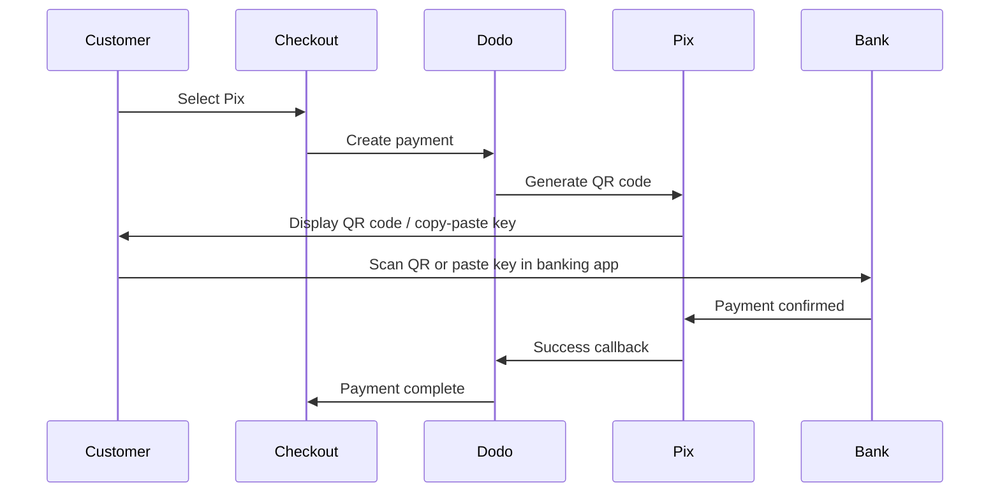

Pix är Brasiliens omedelbara betalningssystem skapat av Brasiliens centralbank (Banco Central do Brasil). Det möjliggör överföringar i realtid dygnet runt, inklusive helger och helgdagar, och har blivit den mest populära betalningsmetoden i Brasilien.

## Varför erbjuda Pix?

Pix är den mest användna betalningsmetoden i Brasilien, och överträffar kreditkort och boleto.

Betalningar bekräftas på några sekunder, 24/7/365 — ingen väntan på bankens bearbetningsfönster.

Kunder betalar via QR-kod eller genom att klistra in nyckeln — inga kortnummer eller bankuppgifter behövs.

## Översikt

| Detalj | Värde |
| :----- | :---- |
| **Faktureringsvaluta** | BRL |
| **Stödda länder** | Brasilien |
| **Abonnemang** | Nej |
| **Minsta belopp** | $0.50 |
| **Avräkning** | Omedelbar |

## Så här fungerar det



## Kundupplevelse

1. Kunden väljer Pix i kassan
2. En QR-kod och nyckel för kopiering visas
3. Kunden öppnar sin bankapp och skannar QR-koden eller klistrar in nyckeln
4. Betalningen bekräftas omedelbart
5. Kunden omdirigeras till framgångssidan

Pix QR-koder löper vanligtvis ut efter en viss tid. Om kunden inte slutför betalningen i tid måste de starta om kassan.

## Konfiguration

```javascript
const session = await client.checkoutSessions.create({
  product_cart: [{ product_id: 'prod_123', quantity: 1 }],
  allowed_payment_method_types: ['pix', 'credit', 'debit'],
  billing_currency: 'BRL',
  return_url: 'https://example.com/success'
});
```

## API-metodtyp

| Typ | Metod | Land |
| :--- | :----- | :------ |
| `pix` | Pix | Brasilien |

## Testning

Använd dina Dodo Payments test-API-nycklar.

Se till att faktureringsvalutan är satt till `BRL` i din kassaförfrågan.

När du ombeds ange en Pix CPF, ange `1234567890`. En test-QR-kod genereras — skanna den med din vanliga telefons kamera (ingen Pix-app behövs). Du kommer att omdirigeras till en Stripe testsida där du kan simulera transaktionen som lyckad eller misslyckad.

## Bästa praxis

Pix fungerar endast med BRL. Se till att din prissättning stödjer transaktioner i brasilianska real för den brasilianska marknaden.

Inte alla brasilianska kunder föredrar Pix. Inkludera alltid `credit` och `debit` som reservalternativ.

Pix QR-koder löper ut efter en viss tid. Se till att din utcheckning hanterar utgången smidigt och låter kunderna generera om koden.

## Felsökning

**Kontrollera:**
1. Är faktureringsvalutan satt till `BRL`?
2. Är `pix` inkluderad i `allowed_payment_method_types`?
3. Är kundens faktureringsland Brasilien?

**Lösning:** Pix är endast tillgänglig för BRL-transaktioner. Verifiera valuta och fakturaadress i din API-förfrågan.

**Orsak:** Kunden slutförde inte betalningen inom utgångsfönstret.

**Lösning:** Kunden måste starta om kassan för att generera en ny QR-kod.

**Orsak:** Pix-betalningar bekräftas omedelbart i de flesta fall, men tillfälliga fördröjningar på bankens sida kan inträffa.

**Lösning:** Övervaka webhooks för betalningsbekräftelse. Om betalningen inte bekräftas inom några minuter, behandla den som misslyckad.

## Relaterade sidor

Se alla stödöverföringsmetoder.

Valutastöd och automatisk konvertering.

Fullständig kassaimplementeringsguide.

Hantera betalningsbekräftelser asynkront.
