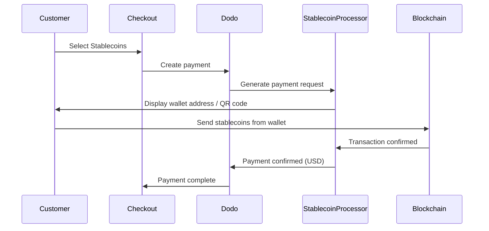

Stablecoin-betalningar tillåter kunder att betala med stablecoins från var som helst i världen (exklusive Indien). Transaktioner faktureras i USD, så du får fiatvaluta medan kunder betalar med sin föredragna stablecoin-plånbok.

## Varför Erbjuda Stablecoins?

<CardGroup cols={3}>
<Card title="Global Reach" icon="globe">
Acceptera betalningar från alla länder — ingen bankinfrastruktur krävs på kundens sida.
</Card>

<Card title="No Chargebacks" icon="shield-check">
Stablecoin-transaktioner är oåterkalleliga, vilket eliminerar bedrägeri med återbetalningar helt.
</Card>

<Card title="USD Settlement" icon="dollar-sign">
Du får USD — ingen behov att hantera volatilitet eller plånböcker.
</Card>
</CardGroup>

## Översikt

| Detalj | Värde |
| :----- | :---- |
| **Faktureringsvaluta** | USD |
| **Stödda Länder** | Globalt (Exkl. IN) |
| **Abonnemang** | Nej |
| **Min Belopp** | $0,50 |
| **Avräkning** | USD |

## Hur det Fungerar



## Kundupplevelse

1. Kunden väljer Stablecoins vid kassan
2. En plånboksadress och QR-kod visas med beloppet i stablecoins
3. Kunden skickar exakt belopp från sin stablecoin-plånbok
4. Transaktionen bekräftas på blockchain
5. Kunden omdirigeras till framgångssidan

<Info>
Stablecoin-betalningar faktureras i USD. Stablecoin-beloppet som visas vid kassan återspeglar realtidskursen vid betalningstillfället.
</Info>

## Stödda Valutor & Nätverk

| Valuta | Nätverk |
| :----- | :------ |
| **USDC** | Ethereum, Solana, Polygon, Base |
| **USDP** | Ethereum, Solana |
| **USDG** | Ethereum |

## Konfiguration

```javascript
const session = await client.checkoutSessions.create({
  product_cart: [{ product_id: 'prod_123', quantity: 1 }],
  allowed_payment_method_types: ['crypto', 'credit', 'debit'],
  return_url: 'https://example.com/success'
});
```

## API Metodtyp

| Typ | Metod | Land |
| :--- | :----- | :---- |
| `crypto` | Stablecoins | Globalt (Exkl. IN) |

## Testning

<Steps>
<Step title="Enable test mode">
Använd dina Dodo Payments test-API-nycklar.
</Step>

<Step title="Create a test checkout">
Skapa en utcheckningssession med `crypto` i de tillåtna betalningsmetoderna.
</Step>

<Step title="Complete the test flow">
Följ det simulerade stablecoin-betalningsflödet i testmiljön.
</Step>
</Steps>

## Bästa Praxis

<AccordionGroup>
<Accordion title="Always include card fallbacks">
Inte alla kunder har stablecoin-plånböcker. Inkludera alltid `credit` och `debit` som reservbetalningsmetoder.
</Accordion>

<Accordion title="Set clear expectations on confirmation time">
Blockchain-bekräftelser kan ta några minuter beroende på nätverket. Se till att din kassa kommunicerar detta till kunder.
</Accordion>

<Accordion title="Handle underpayments and overpayments">
Stablecoin-betalningar kan ibland skilja sig något från det exakta beloppet på grund av nätverksavgifter. Bevaka webbhooks för betalningsstatusuppdateringar.
</Accordion>
</AccordionGroup>

## Felsökning

<AccordionGroup>
<Accordion title="Stablecoins not appearing at checkout">
**Kontrollera:**
1. `crypto` inkluderad i `allowed_payment_method_types`?
2. Transaktionsbeloppet uppfyller minimikravet ($0,50)?

**Lösning:** Verifiera att betalningsmetodtypen är korrekt skickad i din API-förfrågan.
</Accordion>

<Accordion title="Payment not confirming">
**Orsak:** Blockchain-bekräftelsetider varierar. Vissa nätverk tar längre tid än andra.

**Lösning:** Vänta på webhook-bekräftelse. Behandla inte betalningen som misslyckad förrän bekräftelsefönstret har passerat.
</Accordion>

<Accordion title="Amount mismatch">
**Orsak:** Nätverksavgifter kan orsaka att det mottagna beloppet skiljer sig något från det begärda beloppet.

**Lösning:** Bevaka webbhooks för det slutliga bekräftade beloppet. Små avvikelser hanteras automatiskt.
</Accordion>
</AccordionGroup>

## Relaterade Sidor

<CardGroup cols={2}>
<Card title="Payment Methods Overview" icon="credit-card" href="/features/payment-methods">
Se alla stödda betalningsmetoder.
</Card>

<Card title="Checkout Guide" icon="book" href="/developer-resources/checkout-session">
Komplett guide för utcheckningsimplementering.
</Card>

<Card title="Webhooks" icon="webhook" href="/developer-resources/webhooks">
Hantera betalningsbekräftelser asynkront.
</Card>

<Card title="Testing Process" icon="flask" href="/miscellaneous/testing-process">
Komplett testningsguide för alla betalningsmetoder.
</Card>
</CardGroup>
