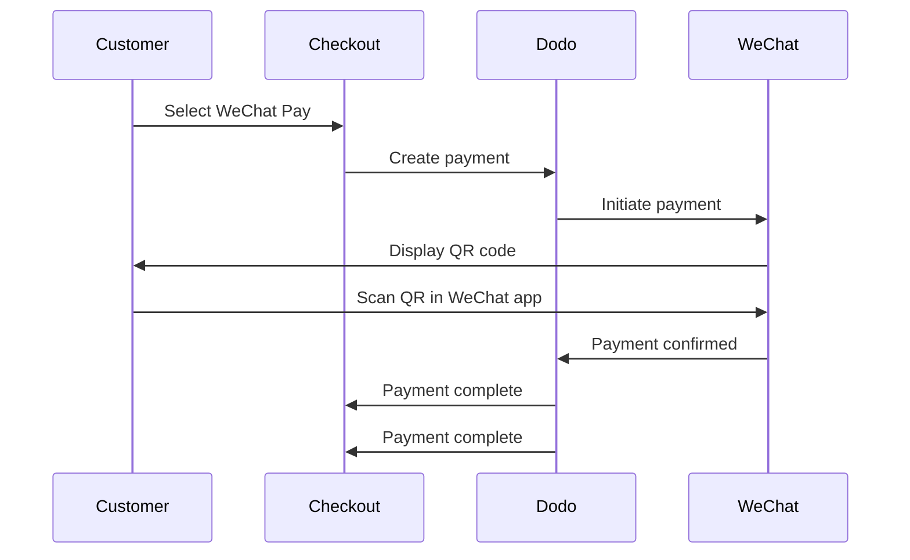

WeChat Pay är en av Kinas två dominerande mobila betalningsplattformar, använd av över en miljard människor. Det möjliggör betalningar via QR-koder inom WeChat-appen, vilket gör det oumbärligt för företag som riktar sig till kinesiska konsumenter.

## Varför erbjuda WeChat Pay?

<CardGroup cols={3}>
<Card title="1B+ Users" icon="users">
WeChat Pay används av över en miljard människor, vilket gör det till en av världens största betalningsplattformar.
</Card>

<Card title="Mobile-First" icon="mobile">
Betalningar slutförs helt inom WeChat-appen — snabbt, bekant och utan friktion för kinesiska kunder.
</Card>

<Card title="Dual Currency" icon="money-bill-transfer">
Acceptera betalningar i både USD och CNY, vilket ger flexibilitet för gränsöverskridande och inhemska transaktioner.
</Card>
</CardGroup>

## Översikt

| Detalj | Värde |
| :----- | :---- |
| **Fakturavaluta** | USD, CNY |
| **Prenumerationer** | Nej |
| **Minsta belopp** | $0.50 / ¥1.00 |
| **Avveckling** | USD |

## Hur det fungerar



## Kundupplevelse

1. Kunden väljer WeChat Pay vid kassan
2. En QR-kod visas på betalningssidan
3. Kunden öppnar WeChat på sin telefon och skannar QR-koden
4. Kunden bekräftar betalningen i WeChat-appen
5. Betalningen bekräftas omedelbart och kunden omdirigeras till succesidan

<Info>
Kunder betalar i USD eller CNY, och du får avveckling i USD.
</Info>

## Konfiguration

```javascript
const session = await client.checkoutSessions.create({
  product_cart: [{ product_id: 'prod_123', quantity: 1 }],
  allowed_payment_method_types: ['wechat_pay', 'credit', 'debit'],
  return_url: 'https://example.com/success'
});
```

## API Metodtyp

| Typ | Metod | Valutor |
| :--- | :----- | :------ |
| `wechat_pay` | WeChat Pay | USD, CNY |

## Testning

<Steps>
<Step title="Enable test mode">
Använd dina Dodo Payments test-API-nycklar.
</Step>

<Step title="Create a test checkout">
Skapa en betalningssession med `wechat_pay` i de tillåtna betalningsmetoderna.
</Step>

<Step title="Scan the QR code">
En test-QR-kod genereras — skanna den med din vanliga telefonkamera (ingen WeChat-app behövs). Du omdirigeras till en testsida där du kan simulera transaktionen som en framgång eller ett misslyckande.
</Step>
</Steps>

## Bästa praxis

<AccordionGroup>
<Accordion title="Target Chinese customers">
WeChat Pay används främst av kinesiska konsumenter. Inkludera det när din kundbas inkluderar kinesiska köpare eller om du riktar dig mot den kinesiska marknaden.
</Accordion>

<Accordion title="Always include card fallbacks">
Alla kunder har inte WeChat. Inkludera alltid `credit` och `debit` som reservbetalningsmetoder.
</Accordion>

<Accordion title="Optimize for mobile">
Många WeChat Pay-användare surfar på mobila enheter. Se till att din betalningssida är responsiv — QR-kodskanning fungerar bäst när betalningssidan visas på en dator eller surfplatta medan kunden skannar med sin telefon.
</Accordion>

<Accordion title="Consider both currencies">
WeChat Pay stöder både USD och CNY. Välj den faktureringsvaluta som bäst passar din målmarknad — USD för gränsöverskridande, CNY för inhemska transaktioner i Kina.
</Accordion>
</AccordionGroup>

## Felsökning

<AccordionGroup>
<Accordion title="WeChat Pay not appearing at checkout">
**Kontrollera:**
1. `wechat_pay` inkluderad i `allowed_payment_method_types`?
2. Faktureringsvalutan inställd på USD eller CNY?
3. Transaktionsbeloppet uppfyller minimikravet?

**Lösning:** Kontrollera att betalningsmetodtypen och valutan är korrekt överförda i din API-förfrågan.
</Accordion>

<Accordion title="QR code not scanning">
**Orsak:** QR-koden kan ha gått ut eller så är kundens WeChat-version föråldrad.

**Lösning:** Uppdatera betalningssidan för att generera en ny QR-kod. Se till att kunden använder en aktuell version av WeChat.
</Accordion>

<Accordion title="Payment not confirming">
**Orsak:** WeChat Pay bekräftar vanligtvis omedelbart, men nätverksfördröjningar kan uppstå.

**Lösning:** Övervaka webhooks för betalningsbekräftelse. Om betalningen inte bekräftas inom några minuter kan kunden behöva försöka igen.
</Accordion>
</AccordionGroup>

## Relaterade sidor

<CardGroup cols={2}>
<Card title="Payment Methods Overview" icon="credit-card" href="/features/payment-methods">
Se alla stödja betalningsmetoder.
</Card>

<Card title="Checkout Guide" icon="book" href="/developer-resources/checkout-session">
Fullständig guide för betalningsimplementation.
</Card>

<Card title="Webhooks" icon="webhook" href="/developer-resources/webhooks">
Hantera betalningsbekräftelser asynkront.
</Card>

<Card title="Testing Process" icon="flask" href="/miscellaneous/testing-process">
Fullständig testguide för alla betalningsmetoder.
</Card>
</CardGroup>
