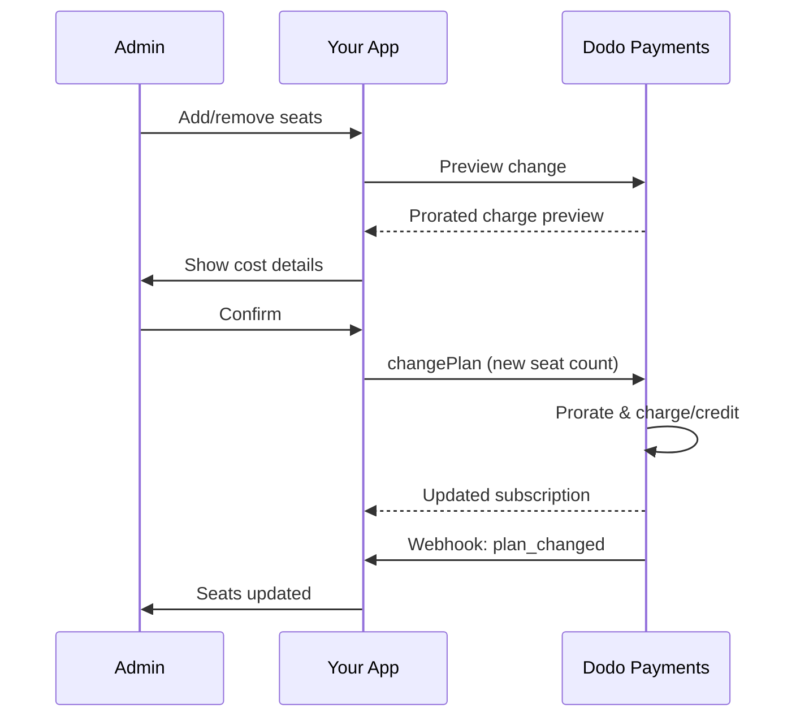

<Info>
Sätebaserad fakturering låter dig ta betalt av kunder baserat på antalet användare, teammedlemmar eller licenser de behöver. Det är den standardiserade prissättningsmodellen för verktyg för teamarbete, företagsprogram och B2B SaaS-produkter.
</Info>

<CardGroup cols={2}>
<Card title="Implementeringshandledning" icon="code" href="/developer-resources/seat-based-pricing">
  Steg-för-steg-guide med kodexempel.
</Card>

<Card title="Dokumentation för tillägg" icon="puzzle" href="/features/addons">
  Lär dig om tilläggssystemet som driver sätebaserad fakturering.
</Card>

<Card title="Prenumerationshantering" icon="repeat" href="/features/subscription">
  Hantera sätebaserade prenumerationer och planändringar.
</Card>

<Card title="Webhooks" icon="bell" href="/developer-resources/webhooks/intents/subscription">
  Spåra sätesändringar med prenumerationswebhooks.
</Card>
</CardGroup>

---

## Vad är Sätebaserad Fakturering?

Sätebaserad fakturering (även kallad prissättning per användare eller per säte) tar betalt av kunder baserat på antalet användare som får tillgång till din produkt. Istället för en fast avgift, justeras priset efter teamets storlek.

### Vanliga Användningsområden

| Bransch | Exempel | Prissättningsmodell |
|----------|---------|---------------|
| Teamarbete | Slack, Notion, Asana | Per aktiv användare/månad |
| Utvecklarverktyg | GitHub, GitLab, Jira | Per säte/månad |
| CRM-program | Salesforce, HubSpot | Per användarlicens |
| Designverktyg | Figma, Canva | Per redigerarsäte |
| Säkerhetsprogram | 1Password, Okta | Per användare/månad |
| Videokonferens | Zoom, Teams | Per värdlicens |

### Fördelar med Sätebaserad Prissättning

**För Ditt Företag:**
- Intäkterna växer naturligt i takt med att kunderna växer
- Förutsägbar prissättning som kunder kan budgetera för
- Tydlig uppgraderingsväg från individuell till team- till företagsnivå
- Högre livstidsvärde när teamen expanderar

**För Dina Kunder:**
- Betala endast för det de använder
- Lätt att förstå och förutsäga kostnader
- Flexibilitet att lägga till/ta bort användare vid behov
- Rättvis prissättning som matchar teamets storlek

---

## Hur Sätebaserad Fakturering Fungerar i Dodo Payments

Dodo Payments implementerar sätebaserad fakturering med hjälp av **Tillägg**-systemet. Så här fungerar det:

### Arkitekturöversikt

En Team Pro-prenumeration kostar $99/månad och inkluderar 5 platser. Om du har fler än 5 användare betalar du $15/månad för varje extra plats.

Till exempel, om ditt team behöver 15 platser:
- Grundplan: $99/månad (inkluderar 5 platser)
- Tillägg: 10 extra platser × $15/månad = $150/månad
- Total månadskostnad: $99 + $150 = $249 för 15 platser

### Nyckelkomponenter

| Komponent | Syfte | Exempel |
|-----------|---------|---------|
| Basprodukt | Kärnprenumeration med inkluderade säten | "Teamplan - $99/månad (5 säten inkluderade)" |
| Sätes-tillägg | Per-säte avgift för ytterligare användare | "Extra säte - $15/månad vardera" |
| Kvantitet | Antal ytterligare säten som köpts | 10 extra säten |

---

## Prissättningsstrategier

Välj den sätebaserade prissättningsstrategi som passar ditt företag:

### Strategi 1: Bas + Per-Säte Tillägg

Inkludera ett visst antal säten i basplanen, ta betalt för ytterligare säten.

**Exempel:**

```
Starter Plan: $49/month
├── Includes: 3 seats
├── Extra seats: $10/month each
└── 8 total seats = $49 + (5 × $10) = $99/month
```

**Bäst för:** Produkter där små team kan fungera med basutbudet.

### Strategi 2: Ren Per-Säte Prissättning

Ta ut en fast avgift per säte utan basavgift.

**Exempel:**

```
Per User: $12/month
├── 5 users = $60/month
├── 20 users = $240/month
└── 100 users = $1,200/month
```

**Implementering:** Sätt basplanens pris till $0, använd endast sätes-tillägget.

**Bäst för:** Enkel, transparent prissättning; användningsbaserade modeller.

### Strategi 3: Trappad Sätesprissättning

Olika basplaner med olika per-säte priser.

**Exempel:**

```
Starter: $0/month base + $15/seat
├── Lower features, higher per-seat cost

Professional: $99/month base + $10/seat
├── More features, lower per-seat cost

Enterprise: $499/month base + $7/seat
└── All features, volume discount on seats
```

**Implementering:** Skapa separata produkter för varje nivå med olika tilläggspriser.

**Bäst för:** Uppmuntra uppgraderingar till högre nivåer; företagsförsäljning.

### Strategi 4: Sätespaket

Sälj säten i paket istället för individuellt.

**Exempel:**

```
5-Seat Pack: $50/month ($10/seat)
10-Seat Pack: $80/month ($8/seat)
25-Seat Pack: $175/month ($7/seat)
```

**Implementering:** Skapa flera tillägg för olika paketstorlekar.

**Bäst för:** Förenkla köpbeslut; uppmuntra större åtaganden.

---

## Ställa in Sätebaserad Fakturering

### Steg 1: Planera Din Prissättning

Innan implementeringen, definiera din prissättningsstruktur:

<Steps>
<Step title="Definiera Basplan">
Bestäm vad som ingår i basprenumerationen:
- Baspris (kan vara $0 för ren per-säte)
- Antal inkluderade säten
- Funktioner som är tillgängliga på denna nivå
</Step>

<Step title="Sätt Sätespriser">
Bestäm kostnaden för per-säte tillägg:
- Pris per ytterligare säte
- Eventuella volymrabatter (via flera tillägg)
- Maximalt antal säten tillåtna (om tillämpligt)
</Step>

<Step title="Överväg Faktureringsfrekvens">
Anpassa sätespriserna till din faktureringscykel:
- Månatliga prenumerationer → månatliga sätesavgifter
- Årliga prenumerationer → årliga sätesavgifter (ofta rabatterade)
</Step>
</Steps>

### Steg 2: Skapa Sätes-Tillägget

I din Dodo Payments-instrumentpanel:

1. Navigera till **Produkter** → **Tillägg**
2. Klicka på **Skapa Tillägg**
3. Konfigurera tillägget:

| Fält | Värde | Anteckningar |
|-------|-------|-------|
| Namn | "Ytterligare Säte" eller "Teammedlem" | Tydligt, användarvänligt namn |
| Beskrivning | "Lägg till en annan teammedlem i din arbetsyta" | Förklara vad kunderna får |
| Pris | Ditt per-säte pris | t.ex. $10.00 |
| Valuta | Matcha din basprodukt | Måste vara samma valuta |
| Skattekategori | Samma som basprodukt | Säkerställer konsekvent skattehantering |

<Tip>
Skapa beskrivande tilläggsnamn som är meningsfulla på fakturor. "Ytterligare Team Säte" är tydligare än "Säte Tillägg" för kunder som granskar sina räkningar.
</Tip>

### Steg 3: Skapa Basprenumerationen

Skapa din prenumerationsprodukt:

1. Navigera till **Produkter** → **Skapa Produkt**
2. Välj **Prenumeration**
3. Konfigurera prissättning och detaljer
4. I avsnittet **Tillägg**, koppla ditt sätes-tillägg

### Steg 4: Koppla Tillägg till Produkt

Länka sätes-tillägget till din prenumeration:

1. Redigera din prenumerationsprodukt
2. Bläddra till avsnittet **Tillägg**
3. Klicka på **Lägg till Tillägg**
4. Välj ditt sätes-tillägg
5. Spara ändringar

<Check>
Din prenumerationsprodukt stöder nu sätebaserad prissättning. Kunder kan köpa valfritt antal ytterligare säten under kassan.
</Check>

---

## Hantera Säten

### Lägga till Säten till Nya Prenumerationer

När du skapar en kassa-session, specificera säteskvantiteten:

```typescript
const session = await client.checkoutSessions.create({
  product_cart: [{
    product_id: 'prod_team_plan',
    quantity: 1,
    addons: [{
      addon_id: 'addon_seat',
      quantity: 10  // 10 additional seats
    }]
  }],
  customer: { email: 'admin@company.com' },
  return_url: 'https://yourapp.com/success'
});
```

### Ändra Antal Säten på Befintliga Prenumerationer

Använd Change Plan API för att justera säten:

```typescript
// Add 5 more seats to existing subscription
await client.subscriptions.changePlan('sub_123', {
  product_id: 'prod_team_plan',
  quantity: 1,
  proration_billing_mode: 'prorated_immediately',
  addons: [{
    addon_id: 'addon_seat',
    quantity: 15  // New total: 15 additional seats
  }]
});
```

### Ta Bort Säten

För att minska antalet säten, specificera den lägre kvantiteten:

```typescript
// Reduce from 15 to 8 additional seats
await client.subscriptions.changePlan('sub_123', {
  product_id: 'prod_team_plan',
  quantity: 1,
  proration_billing_mode: 'difference_immediately',
  addons: [{
    addon_id: 'addon_seat',
    quantity: 8  // Reduced to 8 additional seats
  }]
});
```

### Ta Bort Alla Ytterligare Säten

Skicka en tom tilläggsarray för att ta bort alla tillägg:

```typescript
// Remove all additional seats, keep only base plan seats
await client.subscriptions.changePlan('sub_123', {
  product_id: 'prod_team_plan',
  quantity: 1,
  proration_billing_mode: 'difference_immediately',
  addons: []  // Removes all add-ons
});
```

---

## Proportionering för Sätesändringar

När kunder lägger till eller tar bort säten mitt under cykeln, avgör proportionering hur de faktureras.



### Avräkningslägen

| Läge | Lägga till platser | Ta bort platser |
|------|----------------|----------------|
| `prorated_immediately` | Avgift för återstående dagar i cykeln | Kredit för oanvända dagar |
| `difference_immediately` | Avgift för full platspris | Kredit som tillämpas på framtida förnyelser |
| `full_immediately` | Avgift för full platspris, återställ faktureringscykel | Ingen kredit |

### Exempel på avräkning

**Scenario: 15-dagars faktureringscykel kvar, lägga till 5 platser för $10/plats**

<Tabs>
<Tab title="prorated_immediately">

```
Prorated charge = ($10 × 5 seats) × (15 days / 30 days)
                = $50 × 0.5
                = $25 immediate charge
```

Kunden betalar $25 nu, sedan $50/månad vid förnyelse.
</Tab>

<Tab title="difference_immediately">

```
Immediate charge = $10 × 5 seats = $50
```

Kunden betalar fulla $50 nu, oavsett cykelns position.
</Tab>

<Tab title="full_immediately">

```
Immediate charge = Full subscription + add-ons
Billing cycle resets to today
```

Kunden betalar full summa, ny faktureringscykel börjar.
</Tab>
</Tabs>

**Scenario: Ta bort 3 platser mitt i cykeln med prorated_immediately**

```
Current: Team Plan ($99/month) + 10 extra seats × $10/seat = $199/month
Change: Remove 3 seats (10 → 7 extra seats) on day 20 of 30-day cycle
Remaining: 10 days

Credit for removed seats:
  = ($10 × 3 seats) × (10 days / 30 days)
  = $30 × 0.333
  = $10.00 credit

→ $10.00 credit added to subscription
→ Next renewal: $99 + (7 × $10) = $169.00/month
→ Credit auto-applies: $169.00 − $10.00 = $159.00 on next invoice
```

<Tip>
**Välja ett avräkningsläge för platsändringar**: Använd `prorated_immediately` för rättvis dagbaserad fakturering när team ofta justerar platser. Använd `difference_immediately` för enklare matematik som tar ut eller kredit av fulla platspriser. Se [Avräkningsguide](/developer-resources/subscription-upgrade-downgrade#proration-modes) för detaljerade jämförelser.
</Tip>

### Förhandsgranska innan ändringar

Förhandsvisa alltid avräkningen innan du gör ändringar:

```typescript
const preview = await client.subscriptions.previewChangePlan('sub_123', {
  product_id: 'prod_team_plan',
  quantity: 1,
  proration_billing_mode: 'prorated_immediately',
  addons: [{ addon_id: 'addon_seat', quantity: 20 }]
});

console.log('Immediate charge:', preview.immediate_charge.summary);
// Show customer: "Adding 5 seats will cost $25 today"
```

---

## Spåra platser med Webhooks

Övervaka platsändringar genom att lyssna på prenumerationswebhooks:

### Relevanta händelser

| Händelse | När den utlöses | Användningsfall |
|-------|----------------|----------|
| `subscription.active` | Ny prenumeration aktiverad | Tillhandahålla initiala platser |
| `subscription.plan_changed` | Platser tillagda/ytagna | Uppdatera platsantal i din app |
| `subscription.renewed` | Prenumeration förnyad | Bekräfta att platsantalet är oförändrat |
| `subscription.cancelled` | Prenumeration avbruten | Ta bort alla platser |

### Exempel på Webhook-handler

```typescript
app.post('/webhooks/dodo', async (req, res) => {
  const event = req.body;

  switch (event.type) {
    case 'subscription.active':
      // New subscription - provision seats
      const seats = calculateTotalSeats(event.data);
      await provisionSeats(event.data.customer_id, seats);
      break;

    case 'subscription.plan_changed':
      // Seats changed - update access
      const newSeats = calculateTotalSeats(event.data);
      await updateSeatCount(event.data.subscription_id, newSeats);
      break;

    case 'subscription.cancelled':
      // Subscription cancelled - deprovision
      await deprovisionAllSeats(event.data.subscription_id);
      break;
  }

  res.json({ received: true });
});

function calculateTotalSeats(subscriptionData) {
  const baseSeats = 5;  // Included in plan
  const addonSeats = subscriptionData.addons?.reduce(
    (total, addon) => total + addon.quantity, 0
  ) || 0;
  return baseSeats + addonSeats;
}
```

---

## Genomdriva platsgränser

Din applikation måste genomdriva platsgränser. Dodo Payments spårar faktureringen, men du kontrollerar åtkomsten.

### Strategier för genomdrivande

<Tabs>
<Tab title="Hård gräns">
Förhindra strikt att lägga till användare utöver platsantalet.

```typescript
async function inviteUser(teamId: string, email: string) {
  const team = await getTeam(teamId);
  const subscription = await getSubscription(team.subscriptionId);
  const totalSeats = calculateTotalSeats(subscription);
  const usedSeats = await countTeamMembers(teamId);

  if (usedSeats >= totalSeats) {
    throw new Error('No seats available. Please upgrade your plan.');
  }

  await sendInvitation(teamId, email);
}
```

</Tab>

<Tab title="Mjuk gräns med varning">
Tillåt överskridande med en varning och räntefrist.

```typescript
async function inviteUser(teamId: string, email: string) {
  const team = await getTeam(teamId);
  const { totalSeats, usedSeats } = await getSeatInfo(team);

  if (usedSeats >= totalSeats) {
    // Allow but flag for billing
    await flagOverage(teamId, usedSeats - totalSeats + 1);
    await notifyAdmin(team.adminEmail, 'You have exceeded your seat limit');
  }

  await sendInvitation(teamId, email);
}
```

</Tab>

<Tab title="Automatisk uppgradering">
Lägg automatiskt till platser när gränsen nås.

```typescript
async function inviteUser(teamId: string, email: string) {
  const team = await getTeam(teamId);
  const { totalSeats, usedSeats, subscriptionId } = await getSeatInfo(team);

  if (usedSeats >= totalSeats) {
    // Automatically add a seat
    await client.subscriptions.changePlan(subscriptionId, {
      product_id: team.productId,
      quantity: 1,
      proration_billing_mode: 'prorated_immediately',
      addons: [{ addon_id: 'addon_seat', quantity: totalSeats - baseSeats + 1 }]
    });

    await notifyAdmin(team.adminEmail, 'A new seat was added to your plan');
  }

  await sendInvitation(teamId, email);
}
```

</Tab>
</Tabs>

---

## Avancerade mönster

### Olika platstyper

Erbjud olika platstyper med olika prissättning:

```
Full Seats: $20/month - Full access to all features
View-Only Seats: $5/month - Read-only access
Guest Seats: $0/month - Limited external collaborator access
```

**Implementering:** Skapa separata tillägg för varje platstyp.

```typescript
const session = await client.checkoutSessions.create({
  product_cart: [{
    product_id: 'prod_team_plan',
    quantity: 1,
    addons: [
      { addon_id: 'addon_full_seat', quantity: 10 },
      { addon_id: 'addon_viewer_seat', quantity: 25 },
      { addon_id: 'addon_guest_seat', quantity: 50 }
    ]
  }]
});
```

### Årliga rabatter på platser

Erbjud rabatterad årlig platsprissättning:

```
Monthly: $15/seat/month
Annual: $12/seat/month (20% savings)
```

**Implementering:** Skapa separata produkter för månatliga och årliga planer med olika tilläggspriser.

### Minimiantal platser

Kräv ett minimiantal platser för vissa planer:

```typescript
async function validateSeatCount(planId: string, seatCount: number) {
  const minimums = {
    'prod_starter': 1,
    'prod_team': 5,
    'prod_enterprise': 25
  };

  if (seatCount < minimums[planId]) {
    throw new Error(`${planId} requires at least ${minimums[planId]} seats`);
  }
}
```

---

## Bästa metoder

### Prissättnings bästa metoder

- **Tydlig kommunikation**: Visa per-platspriser tydligt på din prissättningssida
- **Inkluderade platser**: Överväg att inkludera några platser i grundpriset för att minska friktion
- **Volymrabatter**: Erbjud lägre per-platspriser för större team för att vinna företagsavtal
- **Årliga incitament**: Rabattera årliga planer för att förbättra kassaflödet och retention

### Tekniska bästa metoder

- **Cachea platsantal**: Cachea prenumerationsplatsantal lokalt för att undvika API-anrop vid varje begäran
- **Synkronisera regelbundet**: Synkronisera ditt lokala platsantal med Dodo Payments via API periodiskt
- **Hanterar fel**: Om en platsändring misslyckas, visa tydliga felmeddelanden och alternativ för att försöka igen
- **Revisionsspår**: Logga alla platsändringar för faktureringsdispyter och efterlevnad

### Användarupplevelse Bästa metoder

- **Real-tidsåterkoppling**: Visa omedelbar kostnadseffekt när du justerar platser
- **Bekräftelsesteg**: Kräva bekräftelse innan faktureringsändringar
- **Avräkningsöppenhet**: Förklara tydligt avräkningsavgifter innan tillämpning
- **Lätt nedgraderingar**: Gör det inte svårt att minska platser (det bygger förtroende)

---

## Felsökning

<AccordionGroup>
<Accordion title="Oöverensstämmelse med platsantal mellan app och fakturering">
**Symptom**: Din app visar ett annat platsantal än prenumerationen.

**Orsaker**:
- Webhook har inte mottagits eller behandlats
- Tidskonflikt under platsändring
- Cachad data har inte uppdaterats

**Lösningar**:
1. Implementera webhook-handlare för `subscription.plan_changed`
2. Lägg till en "Synkronisera med fakturering"-knapp som hämtar aktuell prenumeration
3. Ställ in cache TTL för att säkerställa regelbundna uppdateringar
</Accordion>

<Accordion title="Avräkningsavgifter oväntade">
**Symptom**: Kunden förvirrad över avgiftsbeloppet mitt i cykeln.

**Orsaker**:
- Avräkningsläge kommunicerades inte tydligt
- Kunden såg inte förhandsvisningen innan bekräftelse

**Lösningar**:
1. Använd alltid `previewChangePlan` innan du gör ändringar
2. Visa tydlig uppdelning: "Lägga till X platser = $Y idag (avräknad för Z dagar)"
3. Dokumentera din avräkningspolicy i hjälpcentret
</Accordion>

<Accordion title="Tillägg syns inte i kassan">
**Symptom**: Platstillägg är inte tillgängligt under kassan.

**Orsaker**:
- Tillägg är inte kopplade till produkten
- Tillägg är arkiverat eller borttaget
- Valutaöverensstämmelse mellan produkt och tillägg

**Lösningar**:
1. Verifiera att tillägget är kopplat i produktinställningarna
2. Kontrollera tilläggets status i Tilläggsdashboard
3. Se till att valutor stämmer exakt
</Accordion>

<Accordion title="Kan inte minska platser under nuvarande användning">
**Symptom**: Kunden vill minska platser men har användare tilldelade.

**Lösningar**:
1. Visa vilka användare som måste tas bort innan platser kan minskas
2. Implementera ett arbetsflöde: Ta bort användare → Minska platser
3. Överväg en räntefrist innan genomdrivande av platsminskning
</Accordion>
</AccordionGroup>

---

## Relaterad dokumentation

<CardGroup cols={2}>
<Card title="Platsbaserad prissättning handledning" icon="code" href="/developer-resources/seat-based-pricing">
  Komplett implementeringsguide med kod.
</Card>

<Card title="Tillägg" icon="puzzle" href="/features/addons">
  Förstå tilläggssystemet på djupet.
</Card>

<Card title="Planändringar & Avräkning" icon="arrows-rotate" href="/developer-resources/subscription-upgrade-downgrade">
  Hantera prenumerationsmodifieringar.
</Card>

<Card title="Prenumerationswebhooks" icon="bell" href="/developer-resources/webhooks/intents/subscription">
  Spåra prenumerationsevent.
</Card>
</CardGroup>
