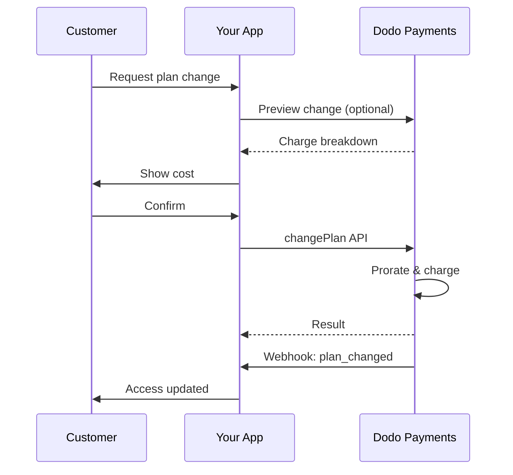
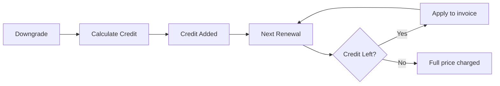

<Info>
Prenumerationer låter dig sälja pågående tillgång med automatiska förnyelser. Använd flexibla faktureringscykler, gratis provperioder, planändringar och tillägg för att skräddarsy prissättningen för varje kund.
</Info>

<CardGroup cols={2}>
<Card title="Uppgradera & Nedgradera" icon="repeat" href="/developer-resources/subscription-upgrade-downgrade">
Kontrollera planändringar med proportionering och kvantitetsuppdateringar.
</Card>

<Card title="On-Demand Prenumerationer" icon="bolt" href="/developer-resources/ondemand-subscriptions">
Auktorisera ett mandat nu och ta betalt senare med anpassade belopp.
</Card>

<Card title="Kundportal" icon="id-card" href="/features/customer-portal">
Låt kunder hantera planer, fakturering och avbokningar.
</Card>

<Card title="Prenumerationswebhooks" icon="code" href="/developer-resources/webhooks/intents/subscription">
Reagera på livscykelhändelser som skapad, förnyad och avbruten.
</Card>
</CardGroup>

## Vad är Prenumerationer?

Prenumerationer är återkommande produkter som kunder köper enligt ett schema. De är idealiska för:

- **SaaS-licenser**: Appar, API:er eller plattformsåtkomst
- **Medlemskap**: Gemenskaper, program eller klubbar
- **Digitalt innehåll**: Kurser, media eller premiuminnehåll
- **Supportplaner**: SLA:er, framgångspaket eller underhåll

## Nyckelfördelar

- **Förutsägbar intäkt**: Återkommande fakturering med automatiska förnyelser
- **Flexibla cykler**: Månatliga, årliga, anpassade intervall och provperioder
- **Planagilitet**: Proportionering för uppgraderingar och nedgraderingar
- **Tillägg och platser**: Koppla valfria, kvantifierbara uppgraderingar
- **Smidig kassa**: Hostad kassa och kundportal
- **Utvecklarvänlig**: Tydliga API:er för skapande, ändringar och användningsspårning

## Skapa Prenumerationer

Skapa prenumerationsprodukter i din Dodo Payments-instrumentpanel, och sälj dem sedan genom kassan eller ditt API. Att separera produkter från aktiva prenumerationer låter dig versionera prissättning, koppla tillägg och spåra prestanda oberoende.

### Skapande av prenumerationsprodukter

Konfigurera fälten i instrumentpanelen för att definiera hur din prenumeration säljs, förnyas och faktureras. Avsnitten nedan motsvarar direkt vad du ser i skapelseformuläret.

#### Produktinformation

- **Produktnamn** (obligatoriskt): Det visade namnet som visas i kassan, kundportalen och fakturor.
- **Produktbeskrivning** (obligatoriskt): Ett tydligt värdeuttalande som visas i kassan och fakturor.
- **Produktbild** (obligatoriskt): PNG/JPG/WebP upp till 3 MB. Används på kassan och fakturor.
- **Varumärke**: Koppla produkten till ett specifikt varumärke för temat och e-post.
- **Skattekategori** (obligatoriskt): Välj kategori (till exempel, SaaS) för att bestämma skatteregler.

<Tip>
Välj den mest exakta skatte kategorin för att säkerställa korrekt skatteinsamling per region.
</Tip>

#### Prissättning

- **Prissättningstyp**: Välj <b>Prenumeration</b> (denna guide). Alternativ är Engångsbetalning och Användningsbaserad fakturering.
- **Pris** (obligatoriskt): Grundläggande återkommande pris med valuta.
- **Rabatt som gäller (%)**: Valfri procentuell rabatt som tillämpas på grundpriset; återspeglas i kassan och fakturor.
- **Upprepa betalning varje** (obligatoriskt): Intervall för förnyelser, t.ex. varje 1 Månad. Välj takten (månader eller år) och mängd.
- **Prenumerationsperiod** (obligatoriskt): Total period under vilken prenumerationen förblir aktiv (t.ex. 10 År). Efter denna period slutar förnyelser om de inte förlängs.
- **Prova på period dagar** (obligatoriskt): Ställ in provlängd i dagar. Använd 0 för att inaktivera provperioder. Den första avgiften sker automatiskt när provperioden slutar.
- **Välj tillägg**: Bifoga upp till 10 tillägg som kunder kan köpa tillsammans med grundplanen.

<Warning>
Ändring av prissättning på en aktiv produkt påverkar nya köp. Befintliga prenumerationer följer dina planändrings- och proportioneringsinställningar.
</Warning>

<Info>
Tillägg är idealiska för kvantifierbara extrafunktioner som platser eller lagring. Du kan kontrollera tillåtna kvantiteter och proportioneringsbeteende när kunder ändrar dem.
</Info>

#### Avancerade inställningar

- **Skatteinkluderande prissättning**: Visa priser inklusive tillämpliga skatter. Slutlig skatteberäkning varierar fortfarande beroende på kundens plats.
- **Generera licensnycklar**: Utfärda en unik nyckel till varje kund efter köp. Se <a href="/features/license-keys">Licensnycklar</a>-guiden.
- **Leverans av digitala produkter**: Leverera filer eller innehåll automatiskt efter köp. Läs mer i <a href="/features/digital-product-delivery">Leverans av digitala produkter</a>.
- **Metadata**: Koppla anpassade nyckel-värde-par för intern taggning eller klientintegrationer. Se <a href="/api-reference/metadata">Metadata</a>.

<Tip>
Använd metadata för att lagra identifierare från ditt system (t.ex. accountId) så att du kan avstämma händelser och fakturor senare.
</Tip>

## Prenumerationsprov

Prov låter kunder få tillgång till prenumerationer utan omedelbar betalning. Den första avgiften sker automatiskt när provperioden slutar.

### Konfigurera Prov

Ställ in **Testperiodens dagar** i produktprissättningsavsnittet (använd `0` för att inaktivera). Du kan åsidosätta detta vid skapande av abonnemang:

```typescript
// Via subscription creation
const subscription = await client.subscriptions.create({
  customer_id: 'cus_123',
  product_id: 'prod_monthly',
  trial_period_days: 14  // Overrides product's trial period
});

// Via checkout session
const session = await client.checkoutSessions.create({
  product_cart: [{ product_id: 'prod_monthly', quantity: 1 }],
  subscription_data: { trial_period_days: 14 }
});
```

<Warning>
Värdet för `trial_period_days` måste ligga mellan 0 och 10 000 dagar.
</Warning>

### Upptäck Provstatus

<Warning>
För närvarande finns det inget direkt fält för att upptäcka provstatus. Följande är en workaround som kräver att man frågar betalningar, vilket är ineffektivt. Vi arbetar på en mer effektiv lösning.
</Warning>

För att avgöra om en prenumeration är i prov, hämta listan över betalningar för prenumerationen. Om det finns exakt en betalning med belopp 0, är prenumerationen i provperiod:

```typescript
const subscription = await client.subscriptions.retrieve('sub_123');
const payments = await client.payments.list({
  subscription_id: subscription.subscription_id
});

// Check if subscription is in trial
const isInTrial = payments.items.length === 1 && 
                  payments.items[0].total_amount === 0;
```

### Uppdatera Provperiod

Förläng testperioden genom att uppdatera `next_billing_date`:

```typescript
await client.subscriptions.update('sub_123', {
  next_billing_date: '2025-02-15T00:00:00Z'  // New trial end date
});
```

<Warning>
Du kan inte ställa in `next_billing_date` till en tidigare tidpunkt. Datumet måste vara i framtiden.
</Warning>

## Ändringar av Prenumerationsplaner

Ändringar av planer låter dig uppgradera eller nedgradera prenumerationer, justera kvantiteter eller migrera till olika produkter. Varje ändring utlöser en omedelbar avgift baserat på den proportioneringsmetod du väljer.

<Tip>
Du kan ändra prenumerationsplaner och uppdatera nästa faktureringsdatum direkt från Dodo Payments-instrumentpanelen. Detta ger ett snabbt sätt att justera prenumerationer för kundsupportförfrågningar, kampanjuppgraderingar eller planövergångar utan att göra API-anrop.
</Tip>

<Tip>
**Aktivera självgående ändringar av planer:** Vill du att kunder ska kunna uppgradera eller nedgradera sina egna abonnemang via kundportalen? Lägg till dina abonnemangsprodukter i en produktkollektion och aktivera "Tillåt abonnemangsuppdateringar" i dina abonnemangsinställningar.
</Tip>



<Card title="Produktkollektioner" icon="layer-group" href="/features/product-collections">
  Gruppera relaterade produkter i kollektioner för att möjliggöra smidiga uppgraderings-/nedgraderingsvägar i kundportalen.
</Card>

### Prorationslägen

Välj hur kunder debiteras vid planändringar:

<Info>
**Snabb jämförelse av de tre prorrateringslägena:**

| | `prorated_immediately` | `difference_immediately` | `full_immediately` |
|---|---|---|---|
| **Uppgradera** | Proraterad avgift för kvarvarande dagar | Full prisskillnad debiteras | Full ny planpris debiteras |
| **Nedgradera** | Proraterad kredit för kvarvarande dagar | Full prisskillnad som kredit | Ingen kredit, full avgift |
| **Faktureringscykel** | Förblir densamma | Förblir densamma | Återställs till idag |
| **Bäst för** | Rättvis tidsbaserad fakturering | Enkla nivåändringar | Återställning av faktureringscykler |
</Info>

#### `prorated_immediately`
Debiterar proraterat belopp baserat på kvarvarande tid i den aktuella faktureringscykeln. Bäst för rättvis fakturering som tar hänsyn till outnyttjad tid.

```typescript
await client.subscriptions.changePlan('sub_123', {
  product_id: 'prod_pro',
  quantity: 1,
  proration_billing_mode: 'prorated_immediately'
});
```

#### `difference_immediately`
Debiterar prisskillnaden omedelbart (uppgradering) eller lägger till kredit för framtida förnyelser (nedgradering). Bäst för enkla uppgraderings-/nedgraderingsscenarier.

```typescript
// Upgrade: charges $50 (difference between $30 and $80)
// Downgrade: credits remaining value, auto-applied to renewals
await client.subscriptions.changePlan('sub_123', {
  product_id: 'prod_pro',
  quantity: 1,
  proration_billing_mode: 'difference_immediately'
});
```

<Info>
Krediter från nedgraderingar som använder `difference_immediately` är abonnemangsomfångade och tillämpas automatiskt på framtida förnyelser. De är skilda från <a href="/features/customer-credit">kundkrediter</a>.
</Info>

När en kund nedgraderar med `difference_immediately`, blir det outnyttjade värdet en abonnemangsomfångad kredit som automatiskt kompenserar framtida förnyelser:



#### `full_immediately`
Debiterar hela beloppet för den nya planen omedelbart, utan att ta hänsyn till kvarvarande tid. Bäst för att återställa faktureringscykler.

```typescript
await client.subscriptions.changePlan('sub_123', {
  product_id: 'prod_monthly',
  quantity: 1,
  proration_billing_mode: 'full_immediately'
});
```

<AccordionGroup>
<Accordion title="Exempel: Proraterad uppgraderingsberäkning">

**Scenario**: Kund på Basic ($30/månad) uppgraderas till Pro ($80/månad) på dag 16 av en 30-dagars cykel med `prorated_immediately`.

```
Unused credit from Basic = $30 × (15 remaining / 30 total) = $15.00
Prorated cost of Pro     = $80 × (15 remaining / 30 total) = $40.00
────────────────────────────────────────────────────────────────────
Immediate charge         = $40.00 − $15.00 = $25.00
```

Nästa förnyelse på det ursprungliga faktureringsdatumet: **$80.00/månad**.

<Tip>
För mer detaljerade exempel på beräkningar och gränsfall, se vår fullständiga [Uppgraderings- och nedgraderingsguide](/developer-resources/subscription-upgrade-downgrade).
</Tip>

</Accordion>
<Accordion title="Exempel: Nedgraderingskreditberäkning">

**Scenario**: Kund på Pro ($80/månad) nedgraderas till Starter ($20/månad) med `difference_immediately`.

```
Credit = Old plan − New plan = $80 − $20 = $60.00
```

Kreditbeloppet på $60 appliceras automatiskt på framtida förnyelser:
- Förnyelse 1: $20 − $20 (kredit) = **$0.00** ($40 kredit kvar)
- Förnyelse 2: $20 − $20 (kredit) = **$0.00** ($20 kredit kvar)  
- Förnyelse 3: $20 − $20 (kredit) = **$0.00** (kredit uttömd)
- Förnyelse 4: **$20.00** (fullt pris)

<Info>
Lär dig mer om hur krediter hanteras i [Uppgraderings- och nedgraderingsguiden](/developer-resources/subscription-upgrade-downgrade).
</Info>

</Accordion>
</AccordionGroup>

### Ändra planer med tillägg

Modifiera tillägg när du ändrar planer. Tillägg ingår i prorrateringsberäkningarna:

```typescript
await client.subscriptions.changePlan('sub_123', {
  product_id: 'prod_pro',
  quantity: 1,
  proration_billing_mode: 'difference_immediately',
  addons: [{ addon_id: 'addon_extra_seats', quantity: 2 }]  // Add add-ons
  // addons: []  // Empty array removes all existing add-ons
});
```

<Info>
Ändringar av planer utlöser omedelbara avgifter. Misslyckade avgifter kan flytta abonnemanget till `on_hold`-status. Spåra ändringar via `subscription.plan_changed` webhook-händelser.
</Info>

### Förhandsgranskning av planändringar

Innan du åtar dig en planändring, förhandsgranska den exakta avgiften och det resulterande abonnemanget:

```typescript
const preview = await client.subscriptions.previewChangePlan('sub_123', {
  product_id: 'prod_pro',
  quantity: 1,
  proration_billing_mode: 'prorated_immediately'
});

// Show customer the charge before confirming
console.log('You will be charged:', preview.immediate_charge.summary);
```

<Card title="Förhandsgranska ändringsplan API" icon="eye" href="/api-reference/subscriptions/preview-change-plan">
  Förhandsgranska planändringar innan du åtar dig dem.
</Card>

## Abonnemangets tillstånd

Abonnemang kan befinna sig i olika tillstånd under sin livscykel:

- **`active`**: Abonnemanget är aktivt och kommer att förnyas automatiskt
- **`on_hold`**: Abonnemanget är pausat på grund av misslyckad betalning. Uppdatering av betalningsmetod krävs för att återaktivera
- **`cancelled`**: Abonnemanget är avbrutet och kommer inte att förnyas
- **`expired`**: Abonnemanget har nått sitt slutdatum
- **`pending`**: Abonnemanget håller på att skapas eller behandlas

### På-hållt tillstånd

Ett abonnemang går in i `on_hold`-tillståndet när:

- En förnyelsebetalning misslyckas (otillräckliga medel, utgången kort, etc.)
- En avgift för planändring misslyckas
- Auktorisering av betalningsmetoden misslyckas

<Warning>
När ett abonnemang är i `on_hold`-tillståndet, kommer det inte att förnyas automatiskt. Du måste uppdatera betalningsmetoden för att återaktivera abonnemanget.
</Warning>

### Återaktivering från På-hållt

För att återaktivera ett abonnemang från `on_hold`-tillståndet, uppdatera betalningsmetoden. Detta automatiskt:

1. Skapar en avgift för kvarvarande skulder
2. Genererar en faktura
3. Behandlar betalningen med den nya betalningsmetoden
4. Återaktiverar abonnemanget till `active`-tillståndet vid framgångsrik betalning

```typescript
// Reactivate subscription from on_hold
const response = await client.subscriptions.updatePaymentMethod('sub_123', {
  type: 'new',
  return_url: 'https://example.com/return'
});

// For on_hold subscriptions, a charge is automatically created
if (response.payment_id) {
  console.log('Charge created:', response.payment_id);
  // Redirect customer to response.payment_link to complete payment
  // Monitor webhooks for payment.succeeded and subscription.active
}
```

<Info>
Efter att ha uppdaterat betalningsmetoden för ett `on_hold`-abonnemang framgångsrikt kommer du att få `payment.succeeded` följt av `subscription.active` webhook-händelser.
</Info>

## API-hantering

<AccordionGroup>
<Accordion title="Skapa abonnemang">
Använd `POST /subscriptions` för att skapa abonnemang programmässigt från produkter, med valfria tester och tillägg.

<Card title="API-referens" icon="code" href="/api-reference/subscriptions/post-subscriptions">
Visa skapa abonnemang API.
</Card>
</Accordion>

<Accordion title="Uppdatera abonnemang">
Använd `PATCH /subscriptions/{id}` för att uppdatera kvantiteter, avbryta vid nästa faktureringsdatum, eller ändra metadata.

<Card title="API-referens" icon="code" href="/api-reference/subscriptions/patch-subscriptions">
Lär dig hur man uppdaterar abonnemangsdetaljer.
</Card>
</Accordion>

<Accordion title="Ändra planer (prorering)">
Ändra den aktiva produkten och kvantiteter med prorrateringskontroller.

<Card title="API-referens" icon="code" href="/api-reference/subscriptions/change-plan">
Granska alternativ för planändringar.
</Card>
</Accordion>

<Accordion title="On-demand avgifter">
För on-demand-abonnemang, debiterar specifika belopp på begäran.

<Card title="API-referens" icon="code" href="/api-reference/subscriptions/create-charge">
Debiterar ett on-demand abonnemang.
</Card>
</Accordion>

<Accordion title="Lista och hämta">
Använd `GET /subscriptions` för att lista alla abonnemang och `GET /subscriptions/{id}` för att hämta ett.

<Card title="API-referens" icon="code" href="/api-reference/subscriptions/get-subscriptions">
Bläddra bland listor och hämtning API:er.
</Card>
</Accordion>

<Accordion title="Användningshistorik">
Hämta registrerad användning för mätade eller hybridprismodeller.

<Card title="API-referens" icon="code" href="/api-reference/subscriptions/get-usage-history">
Se API för användningshistorik.
</Card>
</Accordion>

<Accordion title="Uppdatera betalningsmetod">
Uppdatera betalningsmetoden för ett abonnemang. För aktiva abonnemang uppdaterar detta betalningsmetoden för framtida förnyelser. För abonnemang i `on_hold`-tillståndet, återaktiverar detta abonnemanget genom att skapa en avgift för kvarvarande skulder.

<Card title="API-referens" icon="code" href="/api-reference/subscriptions/update-payment-method">
Lär dig hur man uppdaterar betalningsmetoder och återaktiverar abonnemang.
</Card>
</Accordion>
</AccordionGroup>

## Vanliga användningsfall

- **SaaS och API:er**: Tierad åtkomst med tillägg för platser eller användning
- **Innehåll och media**: Månatlig åtkomst med introduktionstester
- **B2B-supportplaner**: Årliga kontrakt med premium-supporttillägg
- **Verktyg och plugins**: Licensnycklar och versionsbestämda utgåvor

## Integreringsexempel

### Utcheckningssessioner (abonnemang)
När du skapar utcheckningssessioner, inkludera din abonnemangsprodukt och valfria tillägg:

```typescript
const session = await client.checkoutSessions.create({
  product_cart: [
    {
      product_id: 'prod_subscription',
      quantity: 1
    }
  ]
});
```

### Planändringar med prorratering
Uppgradera eller nedgradera ett abonnemang och kontrollera prorrateringsbeteendet:

```typescript
await client.subscriptions.changePlan('sub_123', {
  product_id: 'prod_new',
  quantity: 1,
  proration_billing_mode: 'difference_immediately'
});
```

### Avbryt vid nästa faktureringsdatum
Schemalägg en avbokning som träder i kraft i slutet av den nuvarande faktureringsperioden:

```typescript
await client.subscriptions.update('sub_123', {
  cancel_at_next_billing_date: true
});
```

### On-demand abonnemang
Skapa ett on-demand abonnemang och debitera senare vid behov:

```typescript
const onDemand = await client.subscriptions.create({
  customer_id: 'cus_123',
  product_id: 'prod_on_demand',
  on_demand: true
});

await client.subscriptions.createCharge(onDemand.id, {
  amount: 4900,
  currency: 'USD',
  description: 'Extra usage for September'
});
```

### Uppdatera betalningsmetoden för aktivt abonnemang
Uppdatera betalningsmetoden för ett aktivt abonnemang:

```typescript
// Update with new payment method
const response = await client.subscriptions.updatePaymentMethod('sub_123', {
  type: 'new',
  return_url: 'https://example.com/return'
});

// Or use existing payment method
await client.subscriptions.updatePaymentMethod('sub_123', {
  type: 'existing',
  payment_method_id: 'pm_abc123'
});
```

### Återaktivera abonnemang från på-håll
Återaktivera ett abonnemang som satts på håll på grund av misslyckad betalning:

```typescript
// Update payment method - automatically creates charge for remaining dues
const response = await client.subscriptions.updatePaymentMethod('sub_123', {
  type: 'new',
  return_url: 'https://example.com/return'
});

if (response.payment_id) {
  // Charge created for remaining dues
  // Redirect customer to response.payment_link
  // Monitor webhooks: payment.succeeded → subscription.active
}
```

## Abonnemang med RBI-kompatibla mandat

  UPI och indiska kortabonnemang fungerar under RBI (Reserve Bank of India) reglering med specifika mandatkrav:

  ### Mandatgränser

  Typen och beloppet för mandat beror på ditt abonnemangs återkommande avgift:

  - **Avgifter under Rs 15,000:** Vi skapar ett on-demand mandat för Rs 15,000 INR. Abonnemangsbeloppet debiteras periodiskt enligt din abonnemangsfrekwens, upp till mandatgränsen.
  - **Avgifter Rs 15,000 eller mer:** Vi skapar ett abonnemangsmandat (eller on-demand mandat) för det exakta abonnemangsbeloppet.

För detaljerad information om RBI-kompatibla mandat för indiska betalningsmetoder, se sidan <a href="/features/payment-methods/india">Indiska betalningsmetoder</a>.

  ### Uppgraderings- och nedgraderingsöverväganden

  **Viktigt:** När du uppgraderar eller nedgraderar abonnemang, överväg noggrant mandatgränserna:

  - Om en uppgradering/nedgradering resulterar i ett belopp för debitering som överstiger Rs 15,000 och går bortom den befintliga on-demand betalningsgränsen kan transaktionsavgiften misslyckas.
  - I sådana fall kan kunden behöva uppdatera sin betalningsmetod eller ändra abonnemanget igen för att etablera ett nytt mandat med den korrekta gränsen.

  ### Auktorisering för högvärdesavgifter

  För abonnemangsavgifter på Rs 15,000 eller mer:

  - Kunden kommer att uppmanas av sin bank att auktorisera transaktionen.
  - Om kunden misslyckas med att auktorisera transaktionen kommer transaktionen att misslyckas och abonnemanget kommer att sättas på håll.

  ### 48-timmars bearbetningsfördröjning

  **Bearbetningsschema:** Återkommande avgifter på indiska kort och UPI-abonnemang följer ett unikt bearbetningsmönster:

  - Avgifter **initieras** på det schemalagda datumet enligt din abonnemangsfrekwens.
  - Den faktiska **avdragningen** från kundens konto sker först efter **48 timmar** från betalningsinitiering.
  - Denna 48-timmars fönster kan sträcka sig upp till **2-3 ytterligare timmar** beroende på bankens API-svar.

  ### Mandatavbokningsfönster

  Under det 48-timmars bearbetningsfönstret:

  - Kunder kan avboka mandat via sina bankappar.
  - Om en kund avbokar mandatet under denna period, förblir abonnemanget **aktivt** (detta är ett gränsfall specifikt för indiska kort och UPI AutoPay-abonnemang).
  - Men den faktiska avdragningen kan misslyckas, och i så fall kommer vi att sätta abonnemanget **på håll**.

  **Gränsfallshantering:** Om du erbjuder fördelar, krediter eller abonnemangsanvändning till kunder omedelbart efter att avgiften har initierats, måste du hantera detta 48-timmars fönster på ett lämpligt sätt i din applikation. Överväg:

  - Att fördröja aktiveringen av fördelar tills betalningen bekräftas
  - Implementera nådperioder eller tillfällig åtkomst
  - Övervaka abonnemangsstatus för mandatsavbokningar
  - Hantera abonnemangs på-håll tillstånd i din applikationslogik

  <Tip>
  Övervaka abonnemangswebhooks för att spåra förändringar i betalningsstatus och hantera gränsfall där mandat avbryts under det 48-timmars fönstret.
  </Tip>

## Bästa metoder

- **Börja med tydliga nivåer**: 2–3 planer med uppenbara skillnader
- **Kommunicera prissättning**: Visa totalsummor, prorratering och nästa förnyelse
- **Använd tester genomtänkt**: Konvertera med onboarding, inte bara tid
- **Utnyttja tillägg**: Håll basplaner enkla och upsälj extra
- **Testa ändringar**: Validera planändringar och prorratering i testläge

<Info>
Abonnemang är en flexibel grund för återkommande intäkter. Börja enkelt, testa grundligt och iterera baserat på antagande, churn och expansionsmetoder.
</Info>