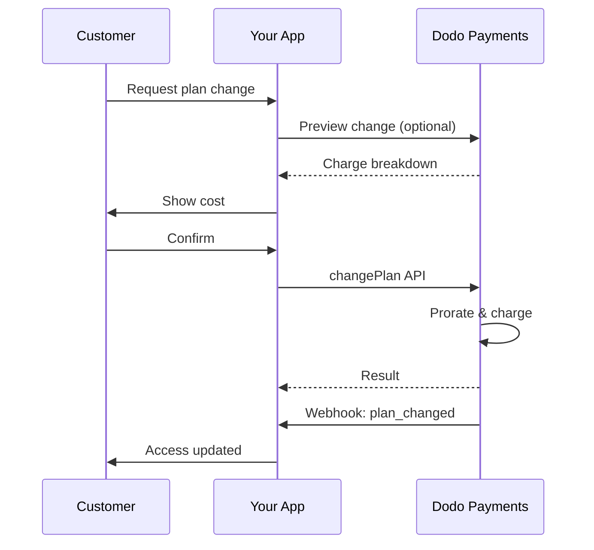
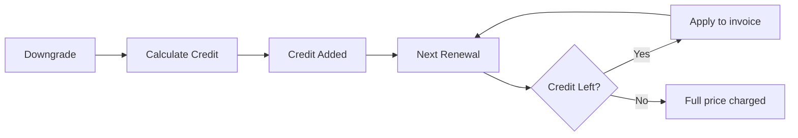
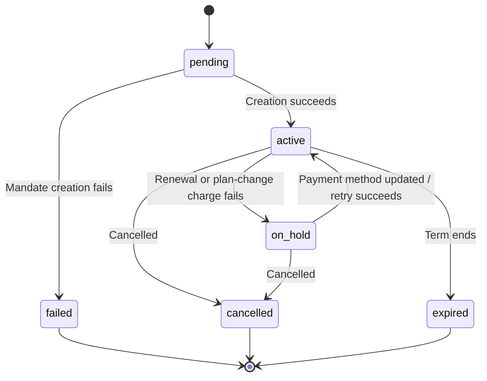

<Info>
Subscriptions let you sell ongoing access with automated renewals. Use flexible billing cycles, free trials, plan changes, and add‑ons to tailor pricing for each customer.
</Info>

<CardGroup cols={2}>
<Card title="Upgrade & Downgrade" icon="repeat" href="/developer-resources/subscription-upgrade-downgrade">
Control plan changes with proration and quantity updates.
</Card>

<Card title="On‑Demand Subscriptions" icon="bolt" href="/developer-resources/ondemand-subscriptions">
Authorize a mandate now and charge later with custom amounts.
</Card>

<Card title="Customer Portal" icon="id-card" href="/features/customer-portal">
Let customers manage plans, billing, and cancellations.
</Card>

<Card title="Subscription Webhooks" icon="code" href="/developer-resources/webhooks/intents/subscription">
React to lifecycle events like created, renewed, and canceled.
</Card>
</CardGroup>

## What Are Subscriptions?

Subscriptions are recurring products customers purchase on a schedule. They’re ideal for:

- **SaaS licenses**: Apps, APIs, or platform access
- **Memberships**: Communities, programs, or clubs
- **Digital content**: Courses, media, or premium content
- **Support plans**: SLAs, success packages, or maintenance

## Key Benefits

- **Predictable revenue**: Recurring billing with automated renewals
- **Flexible cycles**: Monthly, annual, custom intervals, and trials
- **Plan agility**: Proration for upgrades and downgrades
- **Add‑ons and seats**: Attach optional, quantifiable upgrades
- **Seamless checkout**: Hosted checkout and customer portal
- **Developer-first**: Clear APIs for creation, changes, and usage tracking

## Creating Subscriptions

Create subscription products in your Dodo Payments dashboard, then sell them through checkout or your API. Separating products from active subscriptions lets you version pricing, attach add‑ons, and track performance independently.

### Subscription product creation

Configure the fields in the dashboard to define how your subscription sells, renews, and bills. The sections below map directly to what you see in the creation form.

#### Product details

- **Product Name** (required): The display name shown in checkout, customer portal, and invoices.
- **Product Description** (required): A clear value statement that appears in checkout and invoices.
- **Product Image** (required): PNG/JPG/WebP up to 3 MB. Used on checkout and invoices.
- **Brand**: Associate the product with a specific brand for theming and emails.
- **Tax Category** (required): Choose the category (for example, SaaS) to determine tax rules.

<Tip>
Pick the most accurate tax category to ensure correct tax collection per region.
</Tip>

#### Pricing

- **Pristyp**: Välj <b>Abonnemang</b> (denna guide). Alternativ är Enskild betalning och Användningsbaserad fakturering.
- **Pris** (obligatoriskt): Återkommande baspris med valuta. Priset måste vara minst **$1** (eller motsvarande i den valda valutan). Belopp under detta minimum stöds inte och abonnemanget kommer inte att fungera.
- **Gällande rabatt (%)**: Valfri procentsats för rabatt som tillämpas på baspriset; återspeglas i kassan och fakturor.
- **Upprepa betalning varje** (obligatoriskt): Intervall för förnyelser, t.ex. varje 1 månad. Välj frekvens (månader eller år) och kvantitet.
- **Abonnemangsperiod** (obligatoriskt): Total period för vilken abonnemanget förblir aktivt (t.ex. 10 år). Efter denna period upphör förnyelser om inte den förlängs.
- **Prova period dagar** (obligatoriskt): Ställ in prövotidens längd i dagar. Använd 0 för att inaktivera provperioder. Den första debiteringen sker automatiskt när provperioden avslutas.
- **Välj tillägg**: Bifoga upp till 10 tillägg som kunder kan köpa tillsammans med basplanen.

<Warning>
Changing pricing on an active product affects new purchases. Existing subscriptions follow your plan‑change and proration settings.
</Warning>

<Info>
Add‑ons are ideal for quantifiable extras such as seats or storage. You can control allowed quantities and proration behavior when customers change them.
</Info>

#### Advanced settings

- **Tax Inclusive Pricing**: Display prices inclusive of applicable taxes. Final tax calculation still varies by customer location.
- **Generate license keys**: Issue a unique key to each customer after purchase. See the <a href="/features/license-keys">License Keys</a> guide.
- **Digital Product Delivery**: Deliver files or content automatically after purchase. Learn more in <a href="/features/digital-product-delivery">Digital Product Delivery</a>.
- **Metadata**: Attach custom key–value pairs for internal tagging or client integrations. See <a href="/api-reference/metadata">Metadata</a>.

<Tip>
Use metadata to store identifiers from your system (e.g., accountId) so you can reconcile events and invoices later.
</Tip>

## Subscription Trials

Trials let customers access subscriptions without immediate payment. The first charge occurs automatically when the trial ends.

### Configuring Trials

Set **Trial Period Days** in the product pricing section (use `0` to disable). You can override this when creating subscriptions:

```typescript
// Via subscription creation
const subscription = await client.subscriptions.create({
  customer_id: 'cus_123',
  product_id: 'prod_monthly',
  trial_period_days: 14  // Overrides product's trial period
});

// Via checkout session
const session = await client.checkoutSessions.create({
  product_cart: [{ product_id: 'prod_monthly', quantity: 1 }],
  subscription_data: { trial_period_days: 14 }
});
```

<Warning>
The `trial_period_days` value must be between 0 and 10,000 days.
</Warning>

### Detecting Trial Status

<Warning>
Currently, there is no direct field to detect trial status. The following is a workaround that requires querying payments, which is inefficient. We are working on a more efficient solution.
</Warning>

To determine if a subscription is in trial, retrieve the list of payments for the subscription. If there is exactly one payment with amount 0, the subscription is in trial period:

```typescript
const subscription = await client.subscriptions.retrieve('sub_123');
const payments = await client.payments.list({
  subscription_id: subscription.subscription_id
});

// Check if subscription is in trial
const isInTrial = payments.items.length === 1 && 
                  payments.items[0].total_amount === 0;
```

### Updating Trial Period

Extend the trial by updating `next_billing_date`:

```typescript
await client.subscriptions.update('sub_123', {
  next_billing_date: '2025-02-15T00:00:00Z'  // New trial end date
});
```

<Warning>
You cannot set `next_billing_date` to a past time. The date must be in the future.
</Warning>

## Subscription Plan Changes

Plan changes let you upgrade or downgrade subscriptions, adjust quantities, or migrate to different products. Depending on the proration mode you select, a change may trigger an immediate charge, create credit, or apply no billing adjustment.

<Tip>
You can change subscription plans and update the next billing date directly from the Dodo Payments dashboard. This provides a quick way to adjust subscriptions for customer support requests, promotional upgrades, or plan migrations without making API calls.
</Tip>

<Tip>
**Enable self-service plan changes:** Want customers to upgrade or downgrade their own subscriptions via the Customer Portal? Add your subscription products to a Product Collection and enable "Allow Subscription Updates" in your Subscription Settings.
</Tip>



<Card title="Product Collections" icon="layer-group" href="/features/product-collections">
  Group related products into collections to enable seamless upgrade/downgrade paths in the Customer Portal.
</Card>

### Proration Modes

Choose how customers are billed when changing plans:

<Info>
**Quick comparison of the four proration modes:**

| | `prorated_immediately` | `difference_immediately` | `full_immediately` | `do_not_bill` |
|---|---|---|---|---|
| **Uppgradering** | Proraterad avgift för återstående dagar | Fulla prisskillnaden debiteras | Fullt nytt planpris debiteras | Ingen avgift — byt omedelbart |
| **Nedgradering** | Proraterad kredit för återstående dagar | Fulla prisskillnaden som kredit | Ingen kredit, fullt pris debiteras | Ingen kredit — byt omedelbart |
| **Faktureringscykel** | Börjar om från idag | Börjar om från idag | Börjar om från idag | Förblir densamma |
| **Bäst för** | Rättvis tidsbaserad fakturering | Enkla nivåändringar | Återställning av faktureringscykel | Kostnadsfria migreringar eller kostnadsfria byten |
</Info>

#### `prorated_immediately`
Charges prorated amount based on remaining time in the current billing cycle. Best for fair billing that accounts for unused time.

```typescript
await client.subscriptions.changePlan('sub_123', {
  product_id: 'prod_pro',
  quantity: 1,
  proration_billing_mode: 'prorated_immediately'
});
```

#### `difference_immediately`
Charges the price difference immediately (upgrade) or adds credit for future renewals (downgrade). Best for simple upgrade/downgrade scenarios.

```typescript
// Upgrade: charges $50 (difference between $30 and $80)
// Downgrade: credits remaining value, auto-applied to renewals
await client.subscriptions.changePlan('sub_123', {
  product_id: 'prod_pro',
  quantity: 1,
  proration_billing_mode: 'difference_immediately'
});
```

<Info>
Credits from downgrades using `difference_immediately` are subscription-scoped and auto-applied to future renewals. They're distinct from <a href="/features/credit-based-billing">Credit-Based Billing</a> entitlements.
</Info>

When a customer downgrades with `difference_immediately`, the unused value becomes a subscription-scoped credit that automatically offsets future renewals:



#### `full_immediately`
Charges full new plan amount immediately, ignoring remaining time. Best for resetting billing cycles.

```typescript
await client.subscriptions.changePlan('sub_123', {
  product_id: 'prod_monthly',
  quantity: 1,
  proration_billing_mode: 'full_immediately'
});
```

#### `do_not_bill`
Switches to the new plan without any billing adjustment. No proration charges, no credits — the customer simply moves to the new plan. Best for courtesy migrations, free plan switches, or scenarios where you want to absorb the cost difference.

```typescript
await client.subscriptions.changePlan('sub_123', {
  product_id: 'prod_new_plan',
  quantity: 1,
  proration_billing_mode: 'do_not_bill'
});
```

<AccordionGroup>
<Accordion title="Example: Prorated upgrade calculation">

**Scenario**: Customer on Basic ($30/month) upgrades to Pro ($80/month) on day 16 of a 30-day cycle using `prorated_immediately`.

```
Unused credit from Basic = $30 × (15 remaining / 30 total) = $15.00
Prorated cost of Pro     = $80 × (15 remaining / 30 total) = $40.00
────────────────────────────────────────────────────────────────────
Immediate charge         = $40.00 − $15.00 = $25.00
```

Nästa förnyelse den **15 februari** (16 januari + 30 dagar): **$80,00/månad**.

<Tip>
For more detailed calculation examples and edge cases, see our full [Upgrade & Downgrade Guide](/developer-resources/subscription-upgrade-downgrade).
</Tip>

</Accordion>
<Accordion title="Example: Downgrade credit calculation">

**Scenario**: Customer on Pro ($80/month) downgrades to Starter ($20/month) using `difference_immediately`.

```
Credit = Old plan − New plan = $80 − $20 = $60.00
```

The $60 credit auto-applies to future renewals:
- Renewal 1: $20 − $20 (credit) = **$0.00** ($40 credit remaining)
- Renewal 2: $20 − $20 (credit) = **$0.00** ($20 credit remaining)  
- Renewal 3: $20 − $20 (credit) = **$0.00** (credit exhausted)
- Renewal 4: **$20.00** (full price)

<Info>
Learn more about how credits are managed in the [Upgrade & Downgrade Guide](/developer-resources/subscription-upgrade-downgrade).
</Info>

</Accordion>
</AccordionGroup>

### Changing Plans with Add-ons

Modify add-ons when changing plans. Add-ons are included in proration calculations:

```typescript
await client.subscriptions.changePlan('sub_123', {
  product_id: 'prod_pro',
  quantity: 1,
  proration_billing_mode: 'difference_immediately',
  addons: [{ addon_id: 'addon_extra_seats', quantity: 2 }]  // Add add-ons
  // addons: []  // Empty array removes all existing add-ons
});
```

<Info>
Plan changes trigger immediate charges. Failed charges may move the subscription to `on_hold` status. Track changes via `subscription.plan_changed` webhook events.
</Info>

### Previewing Plan Changes

Before committing to a plan change, preview the exact charge and resulting subscription:

```typescript
const preview = await client.subscriptions.previewChangePlan('sub_123', {
  product_id: 'prod_pro',
  quantity: 1,
  proration_billing_mode: 'prorated_immediately'
});

// Show customer the charge before confirming
console.log('You will be charged:', preview.immediate_charge.summary);
```

<Card title="Preview Change Plan API" icon="eye" href="/api-reference/subscriptions/preview-change-plan">
  Preview plan changes before committing to them.
</Card>

## Subscription States

Ett abonnemang går igenom en definierad uppsättning statusar under dess livslängd. Den här tabellen är referensen för varje status, vad som orsakar den och hur (eller om) du kan återställa den.

| Status | Vad det betyder | Återställningsbart? | Återställningsväg / nästa steg |
|--------|----------------|----------------------|-------------------------------|
| `pending` | Abonnemanget skapas eller behandlas | — | Vänta på `subscription.active` (eller `subscription.failed`) |
| `active` | Abonnemanget är aktivt och kommer att förnyas automatiskt | — | Ingen åtgärd behövs |
| `on_hold` | En förnyelsebetalning (eller avgift för planändring) misslyckades; abonnemanget är pausat | **Ja** | Uppdatera betalningsmetoden för att återaktivera — automatiskt via [Betalningsförsök](/features/recovery/payment-retries) och [Dunning](/features/recovery/subscription-dunning), eller manuellt via [Uppdatera betalningsmetod API](/api-reference/subscriptions/update-payment-method) |
| `cancelled` | Abonnemanget avbröts och kommer inte att förnyas | Endast återköp | Kunden måste starta ett nytt abonnemang; [Dunning](/features/recovery/subscription-dunning) kan uppmana till ett återköp |
| `failed` | Abonnemangsskapandet **misslyckades** (den initiala fullmakten eller betalningen lyckades inte) | **Nej — terminal** | Kunden måste skapa ett nytt abonnemang med en fungerande betalningsmetod |
| `expired` | Abonnemanget nådde slutet av sin period | — | Kunden måste starta ett nytt abonnemang om så önskas |

<Warning>
`on_hold` och `failed` förväxlas ofta. `on_hold` är ett **återställningsbart** tillstånd för ett redan aktivt abonnemang vars förnyelse misslyckades. `failed` är ett **terminalt** tillstånd som endast inträffar när den **initiala** skapandet av abonnemanget misslyckas — det kan inte återaktiveras.
</Warning>

### Tillståndsmaskin



### Pausat tillstånd

Ett abonnemang går in i `on_hold` tillstånd när:

- En förnyelsebetalning misslyckas (otillräckliga medel, utgången kort, etc.)
- En avgift för planändring misslyckas
- Betalningsmetodsautorisering misslyckas

<Warning>
När ett abonnemang är i `on_hold` tillstånd, kommer det inte att förnyas automatiskt. Du måste uppdatera betalningsmetoden för att återaktivera abonnemanget.
</Warning>

### Återaktivera från pausat läge

För att återaktivera ett abonnemang från `on_hold` tillstånd, uppdatera betalningsmetoden. Detta gör automatiskt:

1. Skapar en avgift för återstående fordringar
2. Genererar en faktura
3. Bearbetar betalningen med den nya betalningsmetoden
4. Återaktiverar abonnemanget till `active` tillstånd vid lyckad betalning

```typescript
// Reactivate subscription from on_hold
const response = await client.subscriptions.updatePaymentMethod('sub_123', {
  type: 'new',
  return_url: 'https://example.com/return'
});

// For on_hold subscriptions, a charge is automatically created
if (response.payment_id) {
  console.log('Charge created:', response.payment_id);
  // Redirect customer to response.payment_link to complete payment
  // Monitor webhooks for payment.succeeded and subscription.active
}
```

<Info>
Efter att framgångsrikt ha uppdaterat betalningsmetoden för ett `on_hold` abonnemang, får du `payment.succeeded` följt av `subscription.active` webhookhändelser.
</Info>

### Webhookhändelser efter övergång

Varje övergång utlöser en webhook så att du kan styra rättighetslogik utan att behöva genomföra polling:

| Övergång | Händelse |
|------------|---------|
| Abonnemang aktiverat | `subscription.active` |
| Förnyelse lyckas | `subscription.renewed` |
| Förnyelse misslyckas → pausad | `subscription.on_hold` |
| Skapelse misslyckas | `subscription.failed` |
| Plan uppgraderad/nedgraderad | `subscription.plan_changed` |
| Avbruten | `subscription.cancelled` |
| Period avslutad | `subscription.expired` |
| Ändringar i något fält | `subscription.updated` |

<Card title="Subscription Webhook Payloads" icon="webhook" href="/developer-resources/webhooks/intents/subscription">
Visa det fullständiga nyttolastschemat för abonnemangslivscykelhändelser.
</Card>

## API-hantering

<AccordionGroup>
<Accordion title="Create subscriptions">
Använd `POST /subscriptions` för att skapa abonnemang programmatiskt från produkter, med valfria provperioder och tillägg.

<Card title="API Reference" icon="code" href="/api-reference/subscriptions/post-subscriptions">
Visa skapa abonnemangs-API.
</Card>
</Accordion>

<Accordion title="Update subscriptions">
Använd `PATCH /subscriptions/{id}` för att uppdatera mängder, avbryta vid nästkommande fakturadatum eller ändra metadata.

<Card title="API Reference" icon="code" href="/api-reference/subscriptions/patch-subscriptions">
Lär dig hur du uppdaterar abonnemangsdetaljer.
</Card>
</Accordion>

<Accordion title="Change plans (proration)">
Ändra den aktiva produkten och mängder med pro-rata kontroller.

<Card title="API Reference" icon="code" href="/api-reference/subscriptions/change-plan">
Granska alternativ för planändringar.
</Card>
</Accordion>

<Accordion title="On‑demand charges">
För abonnemang på begäran, ta ut specifika belopp på begäran.

<Card title="API Reference" icon="code" href="/api-reference/subscriptions/create-charge">
Ta betalt för ett abonnemang på begäran.
</Card>
</Accordion>

<Accordion title="List and retrieve">
Använd `GET /subscriptions` för att lista alla abonnemang och `GET /subscriptions/{id}` för att hämta ett.

<Card title="API Reference" icon="code" href="/api-reference/subscriptions/get-subscriptions">
Bläddra i listnings- och hämt-API:er.
</Card>
</Accordion>

<Accordion title="Usage history">
Hämta registrerad användning för mätad eller hybrid prissättning.

<Card title="API Reference" icon="code" href="/api-reference/subscriptions/get-usage-history">
Se API för användningshistorik.
</Card>
</Accordion>

<Accordion title="Update payment method">
Uppdatera betalningsmetoden för ett abonnemang. För aktiva abonnemang, uppdaterar detta betalningsmetoden för framtida förnyelser. För abonnemang i `on_hold` tillstånd, återaktiveras abonnemanget genom att skapa en avgift för återstående fordringar.

När du genererar en ny betalningsmetodlänk (typen `New` begäran), kan du skicka `allowed_payment_method_types` för att begränsa vilka betalningsmetoder kunden ser på den sidan. Kunder kommer aldrig att se en metod som inte finns med på listan, även om inkludering av en metod inte garanterar att den visas (tillgängligheten beror fortfarande på faktorer som kundens plats och dina företagspreferenser).

<Card title="API Reference" icon="code" href="/api-reference/subscriptions/update-payment-method">
Lär dig hur du uppdaterar betalningsmetoder och återaktiverar abonnemang.
</Card>
</Accordion>
</AccordionGroup>

## Vanliga användningsfall

- **SaaS och API:er**: Skiktad åtkomst med tillägg för platser eller användning
- **Innehåll och media**: Månatlig åtkomst med introduktionsprövningar
- **B2B-supportplaner**: Årliga kontrakt med premiumsupporttillägg
- **Verktyg och plugins**: Licensnycklar och versionerade utgåvor

## Integrations-exempel

### Utcheckningssessioner (abonnemang)
När du skapar utcheckningssessioner, inkludera din abonnemangsprodukt och eventuella tillägg:

```typescript
const session = await client.checkoutSessions.create({
  product_cart: [
    {
      product_id: 'prod_subscription',
      quantity: 1
    }
  ]
});
```

### Planändringar med pro-rata
Uppgradera eller nedgradera ett abonnemang och kontrollera pro-ratabeteende:

```typescript
await client.subscriptions.changePlan('sub_123', {
  product_id: 'prod_new',
  quantity: 1,
  proration_billing_mode: 'difference_immediately'
});
```

### Avbryt vid nästa fakturadatum
Schemalägg en avbokning som träder i kraft i slutet av den aktuella faktureringsperioden:

```typescript
await client.subscriptions.update('sub_123', {
  cancel_at_next_billing_date: true
});
```

### Abonnemang på begäran
Skapa ett abonnemang på begäran och debitera senare vid behov:

```typescript
const onDemand = await client.subscriptions.create({
  customer_id: 'cus_123',
  product_id: 'prod_on_demand',
  on_demand: true
});

await client.subscriptions.charge(onDemand.id, {
  amount: 4900,
  currency: 'USD',
  description: 'Extra usage for September'
});
```

### Uppdatera betalningsmetod för aktivt abonnemang
Uppdatera betalningsmetoden för ett aktivt abonnemang:

```typescript
// Update with new payment method
const response = await client.subscriptions.updatePaymentMethod('sub_123', {
  type: 'new',
  return_url: 'https://example.com/return'
});

// Or use existing payment method
await client.subscriptions.updatePaymentMethod('sub_123', {
  type: 'existing',
  payment_method_id: 'pm_abc123'
});
```

### Återaktivera abonnemang från on_hold
Återaktivera ett abonnemang som pausades på grund av misslyckad betalning:

```typescript
// Update payment method - automatically creates charge for remaining dues
const response = await client.subscriptions.updatePaymentMethod('sub_123', {
  type: 'new',
  return_url: 'https://example.com/return'
});

if (response.payment_id) {
  // Charge created for remaining dues
  // Redirect customer to response.payment_link
  // Monitor webhooks: payment.succeeded → subscription.active
}
```

## Abonnemang med RBI-kompatibla mandat

  UPI och indiska kortabonnemang fungerar under RBI (Reserve Bank of India) regler med specifika mandatkrav:

  ### Mandatgränser

  Mandattyp och belopp beror på ditt abonnemangs återkommande avgift:

  - **Avgifter under mandatgränsen (standard ₹15,000):** Vi skapar ett on-demand-mandat för gränsbeloppet. Abonnemangsbeloppet debiteras periodiskt enligt din abonnemangsfrekvens, upp till mandatgränsen.
  - **Avgifter vid eller över mandatgränsen:** Vi skapar ett abonnemangsmandat (eller on-demand-mandat) för det exakta abonnemangsbeloppet.

  Mandatgränsen är konfigurerbar per handlare eller per begäran via `mandate_min_amount_inr_paise` (INR paise). Beloppet som registreras hos banken är `max(mandate_floor, billing_amount)` — så gränsen blir i praktiken den kundsynliga auktorisationsgränsen när faktureringen är lägre.

För detaljerad information om RBI-kompatibla mandat och den konfigurerbara mandatgränsen för indiska betalningsmetoder, se sidan <a href="/features/payment-methods/india#configurable-mandate-floor">Indien Betalningsmetoder</a>.

  ### Överväganden vid upp- och nedgradering

  **Viktigt:** Vid uppgradering eller nedgradering av abonnemang, överväg noggrant mandatgränserna:

  - Om en uppgradering/nedgradering resulterar i ett belopp som överstiger ₹15,000 och går förbi det befintliga on-demand-betalningsgränsen, kan transaktionsavgiften misslyckas.
  - I sådana fall kan kunden behöva uppdatera sin betalningsmetod eller ändra abonnemanget igen för att upprätta ett nytt mandat med rätt gräns.

  ### Auktorisering för högvärdesavgifter

  För abonnemangsavgifter på ₹15,000 eller mer:

  - Kunden kommer att uppmanas av sin bank att auktorisera transaktionen.
  - Om kunden misslyckas med att auktorisera transaktionen, kommer transaktionen att misslyckas och abonnemanget sätts på paus.

  ### 48-timmars bearbetningsfördröjning

  **Bearbetningstidplan:** Återkommande avgifter på indiska kort och UPI-abonnemang följer ett unikt bearbetningsmönster:

  - Avgifter **initieras** på schemalagt datum enligt din abonnemangsfrekvens.
  - Den faktiska **avdrag** från kundens konto sker endast efter **48 timmar** från betalningsinitiering.
  - Detta 48-timmarfönster kan förlängas med **2-3 ytterligare timmar** beroende på bank-API-svar.

  ### Mandat avbokningsfönster

  Under 48-timmars bearbetningsfönster:

  - Kunder kan avbryta mandatet via sina bankappar.
  - Om en kund avbryter mandatet under denna period, kommer abonnemanget att förbli **aktivt** (detta är ett specialfall specifikt för indiska kort och UPI AutoPay-abonnemang).
  - Dock kan det faktiska avdraget misslyckas, och i så fall sätter vi abonnemanget **på paus**.

  **Hantering av specialfall:** Om du tillhandahåller förmåner, krediter eller abonnemangsanvändning till kunder omedelbart vid betalinitering, måste du hantera detta 48-timmarfönster på ett lämpligt sätt i din applikation. Överväg:

  - Försena förmånsaktivering tills betalningsbekräftelse
  - Implementera nådeperioder eller tillfällig åtkomst
  - Övervaka abonnemangsstatus för mandatavbokningar
  - Hantera abonnemangspauslägen i din applikationslogik

  <Tip>
  Övervaka abonnemangswebhooks för att spåra betalningsstatusändringar och hantera specialfall där mandaten avbokas under 48-timmarsfönstret.
  </Tip>

## Bästa praxis

- **Börja med tydliga nivåer**: 2–3 planer med uppenbara skillnader
- **Kommunicera prissättning**: Visa totalsummor, pro-rata och nästa förnyelse
- **Använd prova på ett klokt sätt**: Konvertera med onboarding, inte bara tid
- **Utnyttja tillägg**: Håll grundplanerna enkla och sälj extratillbehör
- **Testa ändringar**: Validera planändringar och pro-rata i testläge

<Info>
Abonnemang är en flexibel grund för återkommande intäkter. Börja enkelt, testa noggrant och iterera baserat på antagande, avhopp och expansionsmetrik.
</Info>