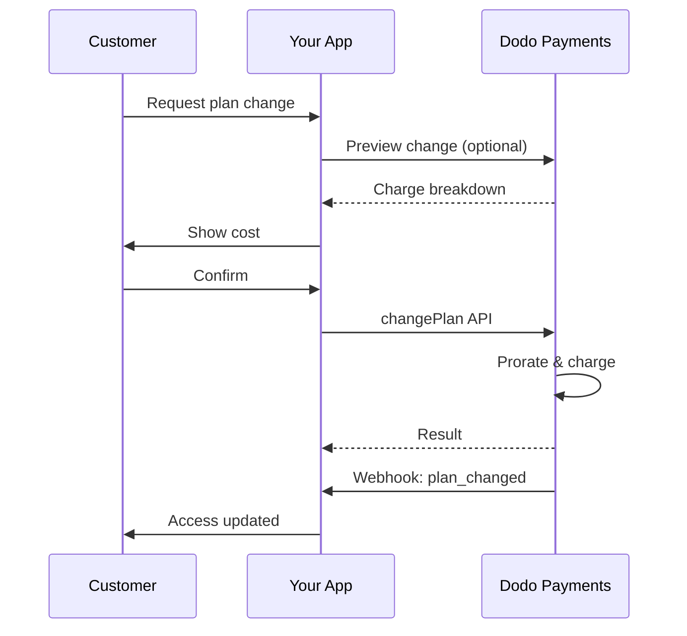
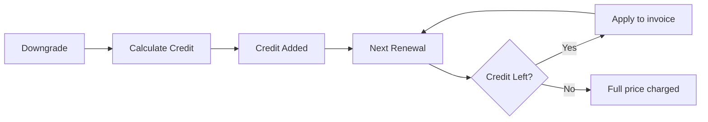
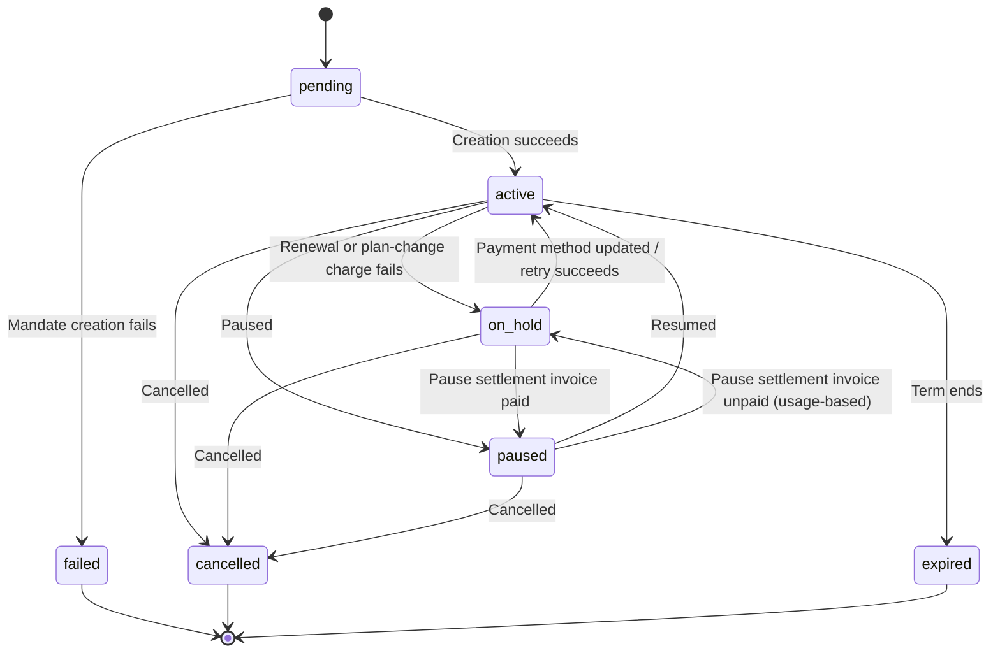

<Info>
Subscriptions let you sell ongoing access with automated renewals. Use flexible billing cycles, free trials, plan changes, and add‑ons to tailor pricing for each customer.
</Info>

<CardGroup cols={2}>
<Card title="Upgrade & Downgrade" icon="repeat" href="/developer-resources/subscription-upgrade-downgrade">
Control plan changes with proration and quantity updates.
</Card>

<Card title="On‑Demand Subscriptions" icon="bolt" href="/developer-resources/ondemand-subscriptions">
Authorize a mandate now and charge later with custom amounts.
</Card>

<Card title="Customer Portal" icon="id-card" href="/features/customer-portal">
Let customers manage plans, billing, and cancellations.
</Card>

<Card title="Subscription Webhooks" icon="code" href="/developer-resources/webhooks/intents/subscription">
React to lifecycle events like created, renewed, and canceled.
</Card>
</CardGroup>

## What Are Subscriptions?

Subscriptions are recurring products customers purchase on a schedule. They’re ideal for:

- **SaaS licenses**: Apps, APIs, or platform access
- **Memberships**: Communities, programs, or clubs
- **Digital content**: Courses, media, or premium content
- **Support plans**: SLAs, success packages, or maintenance

## Key Benefits

- **Predictable revenue**: Recurring billing with automated renewals
- **Flexible cycles**: Monthly, annual, custom intervals, and trials
- **Plan agility**: Proration for upgrades and downgrades
- **Add‑ons and seats**: Attach optional, quantifiable upgrades
- **Seamless checkout**: Hosted checkout and customer portal
- **Developer-first**: Clear APIs for creation, changes, and usage tracking

## Creating Subscriptions

Create subscription products in your Dodo Payments dashboard, then sell them through checkout or your API. Separating products from active subscriptions lets you version pricing, attach add‑ons, and track performance independently.

### Subscription product creation

Configure the fields in the dashboard to define how your subscription sells, renews, and bills. The sections below map directly to what you see in the creation form.

#### Product details

- **Product Name** (required): The display name shown in checkout, customer portal, and invoices.
- **Product Description** (required): A clear value statement that appears in checkout and invoices.
- **Product Image** (required): PNG/JPG/WebP up to 3 MB. Used on checkout and invoices.
- **Brand**: Associate the product with a specific brand for theming and emails.
- **Tax Category** (required): Choose the category (for example, SaaS) to determine tax rules.

<Tip>
Pick the most accurate tax category to ensure correct tax collection per region.
</Tip>

#### Pricing

- **Pricing Type**: Välj <b>Subscription</b> (den här guiden). Alternativen är Single Payment och Usage Based Billing.
- **Price** (obligatoriskt): Baspris för återkommande betalningar med valuta. Priset måste vara minst **$1** (eller motsvarande i den valda valutan). Belopp under detta minimum stöds inte och prenumerationen kommer inte att fungera.
- **Discount Applicable (%)**: Valfri procentuell rabatt som tillämpas på baspriset och visas i checkout och fakturor.
- **Repeat payment every** (obligatoriskt): Intervall för förnyelser, till exempel varje månad. Välj periodicitet (månader eller år) och antal.
- **Subscription Period** (obligatoriskt): Den totala period som prenumerationen förblir aktiv (till exempel 10 år). När perioden löper ut stoppas förnyelserna om den inte förlängs.
- **Trial Period Days** (obligatoriskt): Ange provperiodens längd i dagar. Använd 0 för att inaktivera provperioder. Den första debiteringen sker automatiskt när provperioden löper ut.
- **Trial Amount**: Valfri förskottsdebitering för en betald provperiod. Lämna fältet tomt för en kostnadsfri provperiod. Se [Betalda provperioder](#paid-trials).
- **Select add‑on**: Lägg till upp till 10 tillägg som kunder kan köpa tillsammans med basplanen.

<Warning>
Changing pricing on an active product affects new purchases. Existing subscriptions follow your plan‑change and proration settings.
</Warning>

<Info>
Add‑ons are ideal for quantifiable extras such as seats or storage. You can control allowed quantities and proration behavior when customers change them.
</Info>

#### Advanced settings

- **Tax Inclusive Pricing**: Display prices inclusive of applicable taxes. Final tax calculation still varies by customer location.
- **Generate license keys**: Issue a unique key to each customer after purchase. See the <a href="/features/license-keys">License Keys</a> guide.
- **Digital Product Delivery**: Deliver files or content automatically after purchase. Learn more in <a href="/features/digital-product-delivery">Digital Product Delivery</a>.
- **Metadata**: Attach custom key–value pairs for internal tagging or client integrations. See <a href="/api-reference/metadata">Metadata</a>.

<Tip>
Use metadata to store identifiers from your system (e.g., accountId) so you can reconcile events and invoices later.
</Tip>

## Subscription Trials

Provperioder låter kunder utvärdera en prenumeration innan de betalar hela det återkommande priset. En provperiod kan vara **kostnadsfri**, vilket innebär att inget debiteras förrän provperioden löper ut, eller **betald**, vilket innebär att ett reducerat belopp debiteras i förskott. I båda fallen börjar fullprisdebiteringen vid den första förnyelsen efter att provperioden löpt ut.

### Configuring Trials

Set **Trial Period Days** in the product pricing section (use `0` to disable). You can override this when creating subscriptions:

```typescript
// Via subscription creation
const subscription = await client.subscriptions.create({
  customer: { customer_id: 'cus_123' },
  billing: { country: 'US' },
  product_id: 'pdt_monthly',
  quantity: 1,
  trial_period_days: 14  // Overrides product's trial period
});

// Via checkout session
const session = await client.checkoutSessions.create({
  product_cart: [{ product_id: 'pdt_monthly', quantity: 1 }],
  subscription_data: { trial_period_days: 14 }
});
```

<Warning>
The `trial_period_days` value must be between 0 and 10,000 days.
</Warning>

### Betalda provperioder

Provperioder behöver inte vara kostnadsfria. Ange ett **Trial Amount** på den återkommande prisnivån för en prenumerationsprodukt för att debitera en reducerad förskottsavgift under provperioden. Därefter tar det fullständiga återkommande priset över vid den första förnyelsen.

<Frame>

</Frame>

Betalda provperioder konfigureras på produktens pris, inte per prenumeration eller checkout-session:

| Fält | Typ | Beskrivning |
|-------|------|-------------|
| `trial_amount` | integer | Beloppet som debiteras idag för provperioden, i prisvalutans minsta enheter (till exempel `500` för $5.00). Kräver `trial_period_days > 0`. Utelämna eller ange `null` för en kostnadsfri provperiod. |
| `trial_apply_discounts` | boolean | Anger om rabattkoder i checkout minskar provperiodens debitering. Standardvärdet är `false`, så hela provbeloppet debiteras även när en rabatt tillämpas på det återkommande priset. |

```typescript
const product = await client.products.create({
  name: 'Pro Plan',
  tax_category: 'saas',
  price: {
    type: 'recurring_price',
    price: 2900,                      // $29.00 per month after the trial
    currency: 'USD',
    discount: 0,
    purchasing_power_parity: false,
    payment_frequency_count: 1,
    payment_frequency_interval: 'Month',
    subscription_period_count: 1,
    subscription_period_interval: 'Year',
    trial_period_days: 14,            // A paid trial requires a positive trial period
    trial_amount: 500,                // $5.00 charged today
    trial_apply_discounts: false      // Discounts apply to the recurring price only
  }
});
```

Betalda provperioder går också genom checkout. Provbeloppet beskattas, visas i beräkningarna för checkout-sessionen och i betalningslänkens prissättning, och Adaptive Currency-påslaget tillämpas per valuta. [Förhandsgransknings-endpointen](/developer-resources/checkout-session) returnerar `trial_amount` och `trial_period_days` så att du kan visa beloppet som ska betalas idag innan prenumerationen skapas.

<Info>
Kostnadsfria provperioder fungerar som tidigare. Om du lämnar **Trial Amount** tomt behålls det befintliga beteendet, där den första debiteringen är `0` och hela priset debiteras när provperioden löper ut.
</Info>

### Förhindra missbruk av provperioder

**Prevent Trial Misuse** hindrar kunder från att upprepade gånger göra anspråk på provperioder för samma företag. När funktionen är aktiverad omvandlas en kund som redan har löst in en provperiod automatiskt till ett **betalt köp utan provperiod**, i stället för att få en ny provperiod.

<Frame>

</Frame>

Aktivera funktionen från fliken **Subscriptions** i **Settings**. När den är aktiverad gäller följande:

- Kunder matchas med **normaliserad e-postadress**, där plusalias tas bort, så `user+trial@example.com` och `user@example.com` räknas som samma person.
- Inlösen registreras när **provperioden aktiveras**, så en kund som säger upp samma dag har ändå förbrukat sin provperiod.
- Befintliga kunder fylls i retroaktivt från sina historiska provperioder via e-post, så tidigare provperiodsanvändare identifieras omedelbart.

<Info>
Inställningen är **inaktiverad som standard**. Se [Subscription Settings](/features/product-collections#subscription-settings) för en fullständig lista över prenumerationskontroller på företagsnivå.
</Info>

### Identifiera provperiodens status

<Warning>
Det finns för närvarande inget direkt fält för att identifiera provperiodens status. Följande är en tillfällig lösning som kräver att betalningar hämtas, vilket är ineffektivt. Vi arbetar på en effektivare lösning.
</Warning>

För att avgöra om en prenumeration med **kostnadsfri provperiod** befinner sig i provperioden hämtar du listan över prenumerationens betalningar. Om det finns exakt en betalning med beloppet 0 befinner sig prenumerationen i provperioden:

```typescript
const subscription = await client.subscriptions.retrieve('sub_123');
const payments = await client.payments.list({
  subscription_id: subscription.subscription_id
});

// Check if subscription is in trial
const isInTrial = payments.items.length === 1 && 
                  payments.items[0].total_amount === 0;
```

<Warning>
Denna kontroll av ett nollbelopp fungerar endast för kostnadsfria provperioder. För en [betald provperiod](#paid-trials) motsvarar den första betalningen provbeloppet, inte `0`. Jämför i stället den första betalningen med prenumerationens `trial_amount`, eller kontrollera om `next_billing_date` fortfarande ligger inom provperioden.
</Warning>

### Uppdatera provperioden

Förläng provperioden genom att uppdatera `next_billing_date`:

```typescript
await client.subscriptions.update('sub_123', {
  next_billing_date: '2025-02-15T00:00:00Z'  // New trial end date
});
```

<Warning>
Du kan inte ange `next_billing_date` till en tidpunkt i det förflutna. Datumet måste ligga i framtiden.
</Warning>

## Ändringar av prenumerationsplaner

Med planändringar kan du uppgradera eller nedgradera prenumerationer, justera antal eller migrera till andra produkter. Beroende på vilket prorateringsläge du väljer kan en ändring utlösa en omedelbar debitering, skapa en kreditering eller inte medföra någon faktureringsjustering.

<Tip>
Du kan ändra prenumerationsplaner och uppdatera nästa faktureringsdatum direkt från Dodo Payments-dashboarden. Det ger ett snabbt sätt att justera prenumerationer för kundsupportärenden, kampanjuppgraderingar eller planmigreringar utan att göra API-anrop.
</Tip>

<Tip>
**Aktivera planändringar via självbetjäning:** Vill du att kunder ska kunna uppgradera eller nedgradera sina egna prenumerationer via Customer Portal? Lägg till dina prenumerationsprodukter i en Product Collection och aktivera "Allow Subscription Updates" i Subscription Settings.
</Tip>



<Card title="Product Collections" icon="layer-group" href="/features/product-collections">
  Gruppera relaterade produkter i samlingar för att aktivera smidiga uppgraderings- och nedgraderingsflöden i Customer Portal.
</Card>

### Prorateringslägen

Välj hur kunder debiteras när de ändrar plan:

<Info>
**Snabb jämförelse av de fyra prorateringslägena:**

| | `prorated_immediately` | `difference_immediately` | `full_immediately` | `do_not_bill` |
|---|---|---|---|---|
| **Uppgradering** | Proraterad debitering för återstående dagar | Hela prisskillnaden debiteras | Hela priset för den nya planen debiteras | Ingen debitering — byt omedelbart |
| **Nedgradering** | Proraterad kreditering för återstående dagar | Hela prisskillnaden som kreditering | Ingen kreditering, full debitering | Ingen kreditering — byt omedelbart |
| **Faktureringscykel** | Återställs till idag | Återställs till idag | Återställs till idag | Förblir densamma |
| **Bäst för** | Rättvis tidsbaserad debitering | Enkla nivåändringar | Återställning av faktureringscykeln | Kostnadsfria migreringar eller byten som goodwill |
</Info>

#### `prorated_immediately`
Debiterar ett proraterat belopp baserat på återstående tid i den aktuella faktureringscykeln. Passar bäst för rättvis debitering som tar hänsyn till oanvänd tid.

```typescript
await client.subscriptions.changePlan('sub_123', {
  product_id: 'pdt_pro',
  quantity: 1,
  proration_billing_mode: 'prorated_immediately'
});
```

#### `difference_immediately`
Debiterar prisskillnaden omedelbart (vid uppgradering) eller lägger till en kreditering för framtida förnyelser (vid nedgradering). Passar bäst för enkla uppgraderings- och nedgraderingsscenarier.

```typescript
// Upgrade: charges $50 (difference between $30 and $80)
// Downgrade: credits remaining value, auto-applied to renewals
await client.subscriptions.changePlan('sub_123', {
  product_id: 'pdt_pro',
  quantity: 1,
  proration_billing_mode: 'difference_immediately'
});
```

<Info>
Krediteringar från nedgraderingar med `difference_immediately` är kopplade till prenumerationen och tillämpas automatiskt på framtida förnyelser. De skiljer sig från rättigheter i <a href="/features/credit-based-billing">Credit-Based Billing</a>.
</Info>

När en kund nedgraderar med `difference_immediately` blir det oanvända värdet en prenumerationsbunden kreditering som automatiskt kvittas mot framtida förnyelser:



#### `full_immediately`
Debiterar hela beloppet för den nya planen omedelbart och bortser från återstående tid. Passar bäst för att återställa faktureringscykler.

```typescript
await client.subscriptions.changePlan('sub_123', {
  product_id: 'pdt_monthly',
  quantity: 1,
  proration_billing_mode: 'full_immediately'
});
```

#### `do_not_bill`
Byter till den nya planen utan någon faktureringsjustering. Inga prorateringsdebiteringar och inga krediteringar — kunden går helt enkelt över till den nya planen. Passar bäst för byten som goodwill, kostnadsfria planbyten eller scenarier där du vill absorbera kostnadsskillnaden.

```typescript
await client.subscriptions.changePlan('sub_123', {
  product_id: 'pdt_new_plan',
  quantity: 1,
  proration_billing_mode: 'do_not_bill'
});
```

<AccordionGroup>
<Accordion title="Example: Prorated upgrade calculation">

**Scenario**: En kund med Basic ($30/månad) uppgraderar till Pro ($80/månad) dag 16 i en 30-dagarscykel med `prorated_immediately`.

```
Unused credit from Basic = $30 × (15 remaining / 30 total) = $15.00
Prorated cost of Pro     = $80 × (15 remaining / 30 total) = $40.00
────────────────────────────────────────────────────────────────────
Immediate charge         = $40.00 − $15.00 = $25.00
```

Nästa förnyelse sker **15 februari** (16 januari + 30 dagar): **$80.00/månad**.

<Tip>
För mer detaljerade beräkningsexempel och specialfall, se vår fullständiga [guide för uppgraderingar och nedgraderingar](/developer-resources/subscription-upgrade-downgrade).
</Tip>

</Accordion>
<Accordion title="Example: Downgrade credit calculation">

**Scenario**: En kund med Pro ($80/månad) nedgraderar till Starter ($20/månad) med `difference_immediately`.

```
Credit = Old plan − New plan = $80 − $20 = $60.00
```

Krediteringen på $60 tillämpas automatiskt på framtida förnyelser:
- Förnyelse 1: $20 − $20 (kreditering) = **$0.00** ($40 återstår i kreditering)
- Förnyelse 2: $20 − $20 (kreditering) = **$0.00** ($20 återstår i kreditering)  
- Förnyelse 3: $20 − $20 (kreditering) = **$0.00** (krediteringen är förbrukad)
- Förnyelse 4: **$20.00** (fullpris)

<Info>
Läs mer om hur krediteringar hanteras i [guiden för uppgraderingar och nedgraderingar](/developer-resources/subscription-upgrade-downgrade).
</Info>

</Accordion>
</AccordionGroup>

### Ändra planer med tillägg

Ändra tillägg när du byter plan. Tillägg inkluderas i prorateringsberäkningarna:

```typescript
await client.subscriptions.changePlan('sub_123', {
  product_id: 'pdt_pro',
  quantity: 1,
  proration_billing_mode: 'difference_immediately',
  addons: [{ addon_id: 'addon_extra_seats', quantity: 2 }]  // Add add-ons
  // addons: []  // Empty array removes all existing add-ons
});
```

<Info>
Som standard medför planändringar omedelbara debiteringar (`effective_at: 'immediately'`). Skicka `effective_at: 'next_billing_date'` för att schemalägga ändringen till nästa debiteringsdatum i stället — den väntande ändringen returneras på prenumerationen som `scheduled_change`, och du kan avbryta den med [Avbryt schemalagd planändring](/api-reference/subscriptions/cancel-change-plan). Misslyckade debiteringar kan flytta prenumerationen till statusen `on_hold`, om du inte skickar `on_payment_failure: 'prevent_change'`, vilket behåller prenumerationen på dess nuvarande plan tills betalningen lyckas. Spåra ändringar via webhookhändelserna `subscription.plan_changed`.
</Info>

### Förhandsgranska planändringar

Förhandsgranska den exakta debiteringen och den resulterande prenumerationen innan du genomför en planändring:

```typescript
const preview = await client.subscriptions.previewChangePlan('sub_123', {
  product_id: 'pdt_pro',
  quantity: 1,
  proration_billing_mode: 'prorated_immediately'
});

// Show customer the charge before confirming
console.log('You will be charged:', preview.immediate_charge.summary);
```

<Card title="Preview Change Plan API" icon="eye" href="/api-reference/subscriptions/preview-change-plan">
  Förhandsgranska planändringar innan du genomför dem.
</Card>

## Pausa och återuppta prenumerationer

Att pausa fryser en prenumeration i stället för att avsluta den. Debiteringen stoppas, åtkomsten återkallas och prenumerationen behåller sin plan och historik så att kunden kan fortsätta exakt där den slutade. Använd detta som ett alternativ till uppsägning för att behålla kunder.

Öppna en aktiv prenumeration under **Sales → Subscriptions** och klicka på **Pause subscription**. Statusen ändras till `paused` och förnyelserna stoppas tills prenumerationen återupptas.

<Frame>
    
</Frame>

### Vad händer när du pausar

- **Förnyelser stoppas.** Ingen faktura skapas och ingen förnyelseavgift debiteras medan prenumerationen är pausad.
- **Åtkomsten återkallas omedelbart.** När du pausar återkallas alla levererade och väntande [entitlement grants](/features/entitlements/introduction) på prenumerationen. Det inaktiverar dess [license keys](/features/license-keys) och stoppar utfärdandet av nya nedladdnings-URL:er för [digital products](/features/digital-product-delivery). När prenumerationen återupptas tilldelas de igen, på samma sätt som när man återställer från `on_hold`.
- **Debiteringsklockan fryses.** `next_billing_date` och `expires_at` flyttas båda fram med exakt lika lång tid som pausen, så kunden behåller den tid som redan betalats.
- **Det finns ingen gräns för pausens längd.** En pausad prenumeration förblir pausad tills någon återupptar den. Du behöver inte ange pausens längd i förväg.

<Warning>
När du pausar återkallas åtkomsten direkt, inte vid slutet av debiteringsperioden. Om en prenumeration styr åtkomsten till din produkt bör du tydliggöra detta för kunden innan hen bekräftar.
</Warning>

När prenumerationen återupptas återgår den till `active` och dess rättigheter återställs. Eftersom klockan var fryst infaller nästa förnyelse den pausade tiden senare än ursprungligen planerat — en prenumeration som pausats i 12 dagar förnyas 12 dagar senare.

### Pausa prenumerationer med användningsbaserad debitering

En [usage-based](/features/usage-based-billing/introduction)-prenumeration kan ha användning som har registrerats men ännu inte debiterats när den pausas. **Bill Usage at Pause** under **Settings → Subscriptions** avgör vad som händer med den:

| Inställning | Beteende |
|---------|----------|
| **On** (standard) | Dodo Payments skapar en faktura för användningen sedan det senaste debiteringsdatumet och tar betalt direkt. |
| **Off** | Den utestående användningen förs vidare och debiteras på prenumerationens nästa vanliga faktura. |

På detta sätt regleras endast mätbar användning — den återkommande grundavgiften debiteras aldrig när prenumerationen pausas. Standardprenumerationer och on-demand-prenumerationer har inget att reglera, så denna inställning påverkar dem inte.

<Info>
**Bill Usage at Pause** registreras per debiteringscykel. Om du ändrar inställningen mitt i en cykel påverkas inte regleringen av den redan pågående cykeln; det nya värdet gäller från och med nästa cykel.
</Info>

<Warning>
Regleringsfakturan debiteras som vilken annan faktura som helst och kan därför misslyckas. Om den förblir obetald efter [dunning](/features/recovery/subscription-dunning)-perioden flyttas prenumerationen till `on_hold`, samtidigt som den fortfarande markeras som pausad.
</Warning>

En prenumeration i det tillståndet kan lämna det på två sätt, och de skiljer sig åt genom vem som står för den utestående användningen:

| Utgång | Resultat |
|------|--------|
| Regleringsfakturan betalas | Prenumerationen återgår till `paused`, inte `active`. Återuppta den uttryckligen när kunden är redo. |
| Du återupptar den direkt | Prenumerationen går direkt till `active` och den obetalda regleringsfakturan **makuleras**, tillsammans med väntande omförsök. Den utestående användningen skrivs av. |

<Info>
Att återuppta prenumerationen är en giltig väg ut ur detta stopp — du behöver inte först driva in regleringsfakturan. Tänk bara på att ett återupptagande efterskänker den utestående användningen i stället för att skjuta upp den.
</Info>

### Låt kunder pausa sina egna prenumerationer

**Allow Subscription Pause** under **Settings → Subscriptions** styr om kunder kan pausa och återuppta prenumerationer från Customer Portal. Funktionen är **avstängd som standard**, så självbetjäningspaus måste aktiveras.

<Frame>
    
</Frame>

Den här inställningen gäller endast Customer Portal. Du kan alltid pausa och återuppta prenumerationer från instrumentpanelen eller API:et, oavsett hur reglaget är inställt.

Om du stänger av funktionen stoppas nya kundinitierade pauser, men en kund som redan har pausat sin prenumeration låses inte ute — hen kan fortfarande återuppta en paus som hen själv startat. Pauser som du har startat förblir under din kontroll.

<Card title="Pausing from the Customer Portal" icon="id-card" href="/features/customer-portal#pausing-a-subscription">
Se vad kunden ser, inklusive bekräftelsedialogen.
</Card>

### Pausa via API

Pausa och återuppta hanteras av ett enda `pause`-fält på endpointen för att uppdatera prenumerationen. Det finns ingen separat pause-endpoint.

```typescript
// Pause
await client.subscriptions.update('sub_123', { pause: true });

// Resume
await client.subscriptions.update('sub_123', { pause: false });
```

<Warning>
`pause` är exklusivt och kan inte kombineras med något annat fält — om du skickar det tillsammans med något annat avvisas begäran med `422`. Att sätta `status` till `paused` pausar **inte** en prenumeration; använd i stället fältet `pause`.
</Warning>

När en prenumeration pausas skickas `subscription.paused` och när den återupptas skickas `subscription.unpaused`. Båda innehåller hela prenumerationsobjektet, med `paused_at` inställt under pausen och `null` efter återupptagandet.

### Paus och andra prenumerationsåtgärder

- **Uppsägning fungerar fortfarande.** Du kan säga upp en pausad prenumeration på samma sätt som en aktiv. Alla öppna regleringsfakturor från pausen makuleras då.
- **Schemalagda planändringar fördröjs, inte tas bort.** En [planändring](#subscription-plan-changes) som schemalagts till nästa debiteringsdatum ligger orörd medan prenumerationen är pausad och tillämpas sedan vid det förskjutna debiteringsdatumet när den återupptas. Dess `scheduled_change.effective_at` är en ögonblicksbild från när den schemalades och justeras inte för pausen, så den kan visa ett datum i det förflutna — tolka det som ”var schemalagd till”, inte som ett garanterat datum. Om du vill ta bort ändringen i stället för att låta den fortsätta, använder du [Cancel Scheduled Plan Change](/api-reference/subscriptions/cancel-change-plan).

## Prenumerationsstatusar

En prenumeration går igenom en definierad uppsättning statusar under sin livstid. Den här tabellen beskriver varje status, vad som orsakar den och hur (eller om) den kan återställas.

| Status | Innebörd | Kan återställas? | Återställningsväg / nästa steg |
|--------|---------------|--------------|---------------------------|
| `pending` | Prenumerationen skapas eller behandlas | — | Vänta på `subscription.active` (eller `subscription.failed`) |
| `active` | Prenumerationen är aktiv och förnyas automatiskt | — | Ingen åtgärd krävs |
| `on_hold` | En förnyelsebetalning (eller avgift för en planändring) misslyckades; förnyelserna har stoppats | **Ja** | Uppdatera betalningsmetoden för att återaktivera — automatiskt via [Payment Retries](/features/recovery/payment-retries) och [Dunning](/features/recovery/subscription-dunning), eller manuellt via [Update Payment Method API](/api-reference/subscriptions/update-payment-method) |
| `paused` | Prenumerationen pausades medvetet av dig eller kunden; debiteringen är fryst och åtkomsten återkallad | **Ja** | Återuppta den med `pause: false` eller från Customer Portal när självbetjäningspaus är aktiverad — se [Pausa och återuppta prenumerationer](#pausing-and-resuming-subscriptions) |
| `cancelled` | Prenumerationen sades upp och kommer inte att förnyas | Endast återköp | Kunden måste starta en ny prenumeration; [Dunning](/features/recovery/subscription-dunning) kan uppmana till ett återköp |
| `failed` | **Skapandet** av prenumerationen misslyckades (det initiala medgivandet eller betalningen lyckades inte) | **Nej — slutgiltigt** | Kunden måste skapa en ny prenumeration med en fungerande betalningsmetod |
| `expired` | Prenumerationen nådde slutet av sin löptid | — | Kunden måste starta en ny prenumeration om så önskas |

<Warning>
`on_hold` och `failed` blandas ofta ihop. `on_hold` är ett **återställningsbart** tillstånd för en redan aktiv prenumeration vars förnyelse misslyckades. `failed` är ett **slutgiltigt** tillstånd som endast uppstår när det **initiala** skapandet av prenumerationen misslyckas — det kan inte återaktiveras.
</Warning>

<Info>
`on_hold` och `paused` är också olika. `on_hold` är ofrivilligt — en betalning misslyckades. `paused` är avsiktligt — du eller kunden valde att frysa prenumerationen, och ingen förnyelse försöks medan den förblir pausad. En användningsbaserad prenumeration kan fortfarande ha en engångsfaktura för reglering vid tidpunkten då den pausas; se [Pausa prenumerationer med användningsbaserad debitering](#pausing-usage-based-subscriptions).
</Info>

### Tillståndsmaskin



### Tillståndet väntande

En prenumeration övergår till tillståndet `on_hold` när:

- En förnyelsebetalning misslyckas (otillräckliga medel, utgånget kort osv.)
- En avgift för en planändring misslyckas
- Auktorisering av betalningsmetoden misslyckas
- En [regleringsfaktura vid paus](#pausing-usage-based-subscriptions) för en användningsbaserad prenumeration förblir obetald

<Warning>
När en prenumeration befinner sig i tillståndet `on_hold` förnyas den inte automatiskt. Du måste uppdatera betalningsmetoden för att återaktivera prenumerationen.
</Warning>

### Återaktivera från väntande

För att återaktivera en prenumeration från tillståndet `on_hold` uppdaterar du betalningsmetoden. Detta gör automatiskt följande:

1. Skapar en debitering för återstående belopp
2. Skapar en faktura
3. Behandlar betalningen med den nya betalningsmetoden
4. Återaktiverar prenumerationen till tillståndet `active` när betalningen lyckas

<Note>
Det enda undantaget är ett väntande tillstånd som orsakats av en obetald regleringsfaktura vid paus. När fakturan betalas återgår prenumerationen till `paused`, inte `active`, eftersom den var pausad innan betalningen misslyckades. Återuppta den uttryckligen när fakturan har reglerats.
</Note>

```typescript
// Reactivate subscription from on_hold
const response = await client.subscriptions.updatePaymentMethod('sub_123', {
  payment_method: {
    type: 'new',
    return_url: 'https://example.com/return'
  }
});

// For on_hold subscriptions, a charge is automatically created
if (response.payment_id) {
  console.log('Charge created:', response.payment_id);
  // Redirect customer to response.payment_link to complete payment
  // Monitor webhooks for payment.succeeded and subscription.active
}
```

<Info>
När betalningsmetoden för en prenumeration i tillståndet `on_hold` har uppdaterats får du webhook-händelsen `payment.succeeded` följd av `subscription.active`.
</Info>

### Webhook-händelser per övergång

Varje övergång skickar en webhook så att du kan styra logiken för rättigheter utan polling:

| Övergång | Händelse |
|------------|-------|
| Prenumeration aktiverad | `subscription.active` |
| Förnyelsen lyckas | `subscription.renewed` |
| Förnyelsen misslyckas → väntande | `subscription.on_hold` |
| Prenumerationen pausad | `subscription.paused` |
| Pausad prenumeration återupptagen | `subscription.unpaused` |
| Skapandet misslyckas | `subscription.failed` |
| Planen uppgraderad/nedgraderad | `subscription.plan_changed` |
| Uppsagd | `subscription.cancelled` |
| Löptiden avslutad | `subscription.expired` |
| Alla fältändringar | `subscription.updated` |

<Card title="Subscription Webhook Payloads" icon="webhook" href="/developer-resources/webhooks/intents/subscription">
Visa hela payload-schemat för prenumerationens livscykelhändelser.
</Card>

## API-hantering

<AccordionGroup>
<Accordion title="Create subscriptions">
Använd `POST /checkouts` för att programmatiskt skapa prenumerationer från produkter, med valfria provperioder (`subscription_data.trial_period_days`) och tillägg (`product_cart[].addons`).

<Warning>
`POST /subscriptions` är föråldrad. Befintliga integrationer fortsätter att fungera, men nya integrationer bör använda [Checkout Sessions](/api-reference/checkout-sessions/create).
</Warning>

<Card title="API Reference" icon="code" href="/api-reference/checkout-sessions/create">
Visa API:et för att skapa en checkout-session.
</Card>
</Accordion>

<Accordion title="Update subscriptions">
Använd `PATCH /subscriptions/{subscription_id}` för att säga upp vid nästa debiteringsdatum, förlänga prenumerationsperioden, uppdatera debiteringsuppgifter eller ändra metadata. Om du vill ändra kvantiteten använder du i stället [Change Plan API](/api-reference/subscriptions/change-plan) — `PATCH` accepterar inte `quantity`.

<Card title="API Reference" icon="code" href="/api-reference/subscriptions/patch-subscriptions">
Läs mer om hur du uppdaterar prenumerationsuppgifter.
</Card>
</Accordion>

<Accordion title="Pause and resume subscriptions">
Pausning och återupptagning hanteras via samma endpoint `PATCH /subscriptions/{subscription_id}` med fältet `pause`: `pause: true` pausar en aktiv prenumeration och `pause: false` återupptar den. Fältet kan inte kombineras med något annat fält i samma begäran. För fullständig information om beteende, debiteringseffekter och relaterade affärsinställningar, se [Pausa och återuppta prenumerationer](#pausing-and-resuming-subscriptions).

<Card title="API Reference" icon="code" href="/api-reference/subscriptions/patch-subscriptions">
Visa API:et för att uppdatera prenumerationer, inklusive fältet `pause`.
</Card>
</Accordion>

<Accordion title="Change plans (proration)">
Ändra den aktiva produkten och kvantiteterna med prorationskontroller.

<Card title="API Reference" icon="code" href="/api-reference/subscriptions/change-plan">
Granska alternativ för planändringar.
</Card>
</Accordion>

<Accordion title="On‑demand charges">
För on-demand-prenumerationer debiterar du specifika belopp vid behov.

<Card title="API Reference" icon="code" href="/api-reference/subscriptions/create-charge">
Debiterar en on-demand-prenumeration.
</Card>
</Accordion>

<Accordion title="List and retrieve">
Använd `GET /subscriptions` för att lista alla prenumerationer och `GET /subscriptions/{id}` för att hämta en enskild prenumeration.

<Card title="API Reference" icon="code" href="/api-reference/subscriptions/get-subscriptions">
Bläddra bland API:er för listning och hämtning.
</Card>
</Accordion>

<Accordion title="Usage history">
Hämta registrerad användning för modeller med mätbaserad eller hybridprissättning.

<Card title="API Reference" icon="code" href="/api-reference/subscriptions/get-usage-history">
Se API:et för användningshistorik.
</Card>
</Accordion>

<Accordion title="Update payment method">
Uppdatera betalningsmetoden för en prenumeration. För aktiva prenumerationer uppdateras betalningsmetoden för framtida förnyelser. För prenumerationer i tillståndet `on_hold` återaktiveras prenumerationen genom att en debitering skapas för återstående belopp.

När du skapar en ny länk för betalningsmetod (begärandetypen `New`) kan du skicka `allowed_payment_method_types` för att begränsa vilka betalningsmetoder kunden ser på sidan. Kunden ser aldrig en metod som inte finns i listan, men att inkludera en metod garanterar inte att den visas (tillgängligheten beror fortfarande på faktorer som kundens plats och dina affärsinställningar).

<Card title="API Reference" icon="code" href="/api-reference/subscriptions/update-payment-method">
Läs mer om hur du uppdaterar betalningsmetoder och återaktiverar prenumerationer.
</Card>
</Accordion>
</AccordionGroup>

## Vanliga användningsfall

- **SaaS och API:er**: Nivåindelad åtkomst med tillägg för platser eller användning
- **Innehåll och media**: Månatlig åtkomst med introduktionsprovperioder
- **B2B-supportplaner**: Årsavtal med tillägg för premiumsupport
- **Verktyg och plugins**: Licensnycklar och versionshanterade utgåvor

## Integrationsexempel

### Checkout Sessions (prenumerationer)
När du skapar checkout-sessioner inkluderar du din prenumerationsprodukt och valfria tillägg:

```typescript
const session = await client.checkoutSessions.create({
  product_cart: [
    {
      product_id: 'pdt_subscription',
      quantity: 1
    }
  ]
});
```

### Planändringar med proration
Uppgradera eller nedgradera en prenumeration och styr prorationsbeteendet:

```typescript
await client.subscriptions.changePlan('sub_123', {
  product_id: 'pdt_new',
  quantity: 1,
  proration_billing_mode: 'difference_immediately'
});
```

### Säg upp vid nästa debiteringsdatum
Schemalägg en uppsägning som träder i kraft i slutet av den aktuella debiteringsperioden:

```typescript
await client.subscriptions.update('sub_123', {
  cancel_at_next_billing_date: true
});
```

### Förläng prenumerationsperioden
Förläng prenumerationens löptid genom att skicka ett nytt `subscription_period_count` och `subscription_period_interval` till `PATCH /subscriptions/{subscription_id}`. Prenumerationens utgångsdatum räknas om utifrån det nya antalet och intervallet — till exempel för att ge en kund extra tid på sin nuvarande plan:

```typescript
await client.subscriptions.update('sub_123', {
  subscription_period_count: 5,
  subscription_period_interval: 'Month'
});
```

<Note>
En prenumerationsperiod kan endast **förlängas**, aldrig förkortas.
</Note>

### On-demand-prenumerationer
Skapa en on-demand-prenumeration och debitera senare vid behov:

```typescript
const onDemand = await client.subscriptions.create({
  customer: { customer_id: 'cus_123' },
  billing: { country: 'US' },
  product_id: 'pdt_on_demand',
  quantity: 1,
  on_demand: { mandate_only: true }
});

await client.subscriptions.charge(onDemand.subscription_id, {
  product_price: 4900,
  product_currency: 'USD',
  product_description: 'Extra usage for September'
});
```

### Uppdatera betalningsmetod för aktiv prenumeration
Uppdatera betalningsmetoden för en aktiv prenumeration:

```typescript
// Update with new payment method
const response = await client.subscriptions.updatePaymentMethod('sub_123', {
  payment_method: {
    type: 'new',
    return_url: 'https://example.com/return'
  }
});

// Or use existing payment method
await client.subscriptions.updatePaymentMethod('sub_123', {
  payment_method: {
    type: 'existing',
    payment_method_id: 'pm_abc123'
  }
});
```

### Återaktivera prenumeration från on_hold
Återaktivera en prenumeration som hamnat i väntande tillstånd på grund av en misslyckad betalning:

```typescript
// Update payment method - automatically creates charge for remaining dues
const response = await client.subscriptions.updatePaymentMethod('sub_123', {
  payment_method: {
    type: 'new',
    return_url: 'https://example.com/return'
  }
});

if (response.payment_id) {
  // Charge created for remaining dues
  // Redirect customer to response.payment_link
  // Monitor webhooks: payment.succeeded → subscription.active
}
```

## Prenumerationer med RBI-kompatibla medgivanden

  UPI- och indiska kortprenumerationer omfattas av RBI:s (Reserve Bank of India) regler med särskilda krav på medgivanden:

  ### Medgivandegränser

  Typen och beloppet för medgivandet beror på prenumerationens återkommande debitering:

  - **Debiteringar under medgivandets golv (standard ₹15,000):** Vi skapar ett on-demand-medgivande för golvbeloppet. Prenumerationsbeloppet debiteras periodvis enligt prenumerationens frekvens, upp till medgivandegränsen.
  - **Debiteringar vid eller över medgivandets golv:** Vi skapar ett prenumerationsmedgivande (eller on-demand-medgivande) för det exakta prenumerationsbeloppet.

  Medgivandets golv kan konfigureras per merchant eller per begäran via `mandate_min_amount_inr_paise` (INR paisa). Beloppet som registreras hos banken är `max(mandate_floor, billing_amount)` — golvet blir därför i praktiken kundens auktoriseringstak när debiteringen är lägre.

För detaljerad information om RBI-kompatibla medgivanden och det konfigurerbara medgivandegolvet för indiska betalningsmetoder, se sidan <a href="/features/payment-methods/india#configurable-mandate-floor">India Payment Methods</a>.

  ### Överväganden vid upp- och nedgradering

  **Viktigt:** Ta noggrant hänsyn till medgivandegränserna när du uppgraderar eller nedgraderar prenumerationer:

  - Om en upp- eller nedgradering leder till ett debiteringsbelopp som överstiger Rs 15,000 och går utöver den befintliga on-demand-betalningsgränsen kan transaktionsdebiteringen misslyckas.
  - I sådana fall kan kunden behöva uppdatera sin betalningsmetod eller ändra prenumerationen igen för att skapa ett nytt medgivande med rätt gräns.

  ### Auktorisering för debiteringar med högt värde

  För prenumerationsdebiteringar på Rs 15,000 eller mer:

  - Kunden uppmanas av sin bank att auktorisera transaktionen.
  - Om kunden inte auktoriserar transaktionen misslyckas den och prenumerationen försätts i väntande tillstånd.

  ### 48 timmars behandlingsfördröjning

  **Behandlingstidslinje:** Återkommande debiteringar på indiska kort och UPI-prenumerationer följer ett särskilt behandlingsmönster:

  - Debiteringar **initieras** på det schemalagda datumet enligt prenumerationens frekvens.
  - Det faktiska **avdraget** från kundens konto sker först **48 timmar** efter att betalningen initierats.
  - Detta 48-timmarsfönster kan förlängas med upp till **ytterligare 2–3 timmar** beroende på svar från bankens API.

  ### Fönster för makulering av medgivande

  Under det 48 timmar långa behandlingsfönstret:

  - Kunder kan makulera medgivandet via sina bankappar.
  - Om en kund makulerar medgivandet under denna period förblir prenumerationen **aktiv** (detta är ett specialfall som gäller indiska kort- och UPI AutoPay-prenumerationer).
  - Det faktiska avdraget kan dock misslyckas och i så fall försätter vi prenumerationen i **väntande tillstånd**.

  **Hantering av specialfall:** Om du ger kunder förmåner, krediter eller prenumerationsanvändning direkt när debiteringen initieras måste du hantera detta 48-timmarsfönster på rätt sätt i din applikation. Överväg att:

  - Fördröja aktiveringen av förmåner tills betalningen har bekräftats
  - Införa respitperioder eller tillfällig åtkomst
  - Övervaka prenumerationsstatus för makulerade medgivanden
  - Hantera prenumerationer i väntande tillstånd i applikationens logik

  <Tip>
  Övervaka prenumerationens webhookar för att spåra ändringar i betalningsstatus och hantera specialfall där medgivanden makuleras under 48-timmarsfönstret.
  </Tip>

## Bästa praxis

- **Börja med tydliga nivåer**: 2–3 planer med uppenbara skillnader
- **Kommunicera prissättningen**: Visa totalsummor, proration och nästa förnyelse
- **Använd provperioder genomtänkt**: Konvertera med onboarding, inte bara med tid
- **Utnyttja tillägg**: Håll grundplanerna enkla och sälj extra funktioner
- **Testa ändringar**: Validera planändringar och proration i testläge

<Info>
Prenumerationer är en flexibel grund för återkommande intäkter. Börja enkelt, testa noggrant och iterera utifrån mätvärden för användning, churn och expansion.
</Info>