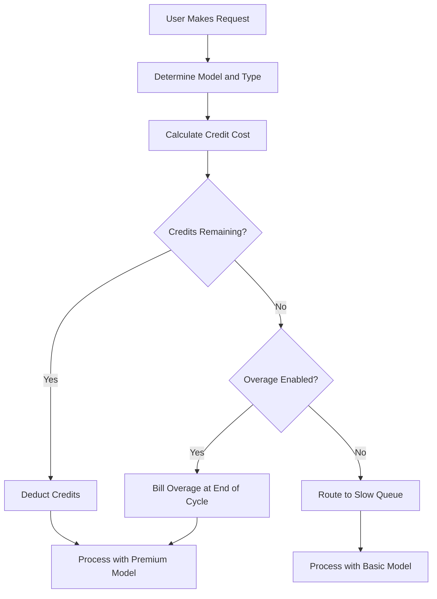

## Cách Cursor tính phí

Cursor sử dụng mô hình kết hợp subscription hàng tháng với một pool credit giảm dần. Cách tiếp cận này mang lại mức giá dễ dự đoán cho người dùng, đồng thời quản lý chi phí biến đổi của các model AI khác nhau.

**Các gói giá**: Cursor cung cấp các gói từ Hobby đến Ultra, cân bằng quyền truy cập premium và tiêu chuẩn để phù hợp với nhiều quy trình làm việc khác nhau.

| Gói | Giá | Premium Requests | Slow Requests |
| :--- | :--- | :--- | :--- |
| Hobby | Miễn phí | 50/tháng | Không giới hạn |
| Pro | \$20/tháng | 500/tháng | Không giới hạn |
| Pro+ | \$60/tháng | Premium không giới hạn | - |
| Ultra | \$200/tháng | Premium không giới hạn | - |

**Khấu trừ theo trọng số model**: Các request khác nhau tiêu thụ lượng credit khác nhau dựa trên chi phí của model nền tảng. Điều này cho phép Cursor cung cấp một subscription duy nhất bao phủ nhiều provider, đồng thời đảm bảo các thao tác đắt đỏ được tính đến.

| Loại request | Model | Chi phí credit |
| :--- | :--- | :--- |
| Tab Completion | Default | 0 |
| Chat | GPT-4o Mini | 1 |
| Chat | Claude 3.5 Sonnet | 1 |
| Composer | GPT-4o | 5 |
| Agent | Claude 3.5 Sonnet | 10 |
| Agent | o1-preview | 25 |

**Hết credit và overage**: Khi credit cạn, người dùng được chuyển sang hàng đợi "Slow" với các model rẻ hơn thay vì bị ngừng truy cập. Ngoài ra, họ có thể bật overage dựa trên mức sử dụng để duy trì quyền truy cập premium với chi phí cố định cho mỗi request.



4. **Enterprise và Business**: Các team sử dụng mức dùng chung, trong đó toàn bộ tổ chức chia sẻ một bucket credit duy nhất. Điều này đơn giản hóa việc quản lý và đảm bảo người dùng có mức sử dụng cao không chạm giới hạn cá nhân trong khi những người khác vẫn còn dung lượng chưa dùng.

## Điều gì làm nên sự độc đáo

Mô hình của Cursor cân bằng trải nghiệm người dùng với chi phí hạ tầng bằng cách giải quyết những vấn đề mà các mô hình tính phí SaaS truyền thống thường gặp khó khăn.
- **Trừu tượng hóa provider**: Một subscription duy nhất bao bọc nhiều provider LLM như OpenAI và Anthropic, xử lý việc định giá phức tạp và API key ở phía sau.
- **Khấu trừ có trọng số**: Chi phí phù hợp với giá trị bằng cách tính nhiều hơn cho các model mạnh hơn, khiến việc định giá trở nên công bằng và minh bạch với mọi người dùng.
- **Suy giảm linh hoạt**: Hàng đợi "Slow" ngăn việc ngắt truy cập đột ngột, giữ người dùng trong sản phẩm và khuyến khích nâng cấp mà không mang tính trừng phạt.
- **Credit dùng chung**: Các bucket cấp team giảm trở ngại cho khách hàng enterprise bằng cách cho phép chia sẻ tài nguyên hiệu quả trong toàn tổ chức.

## Xây dựng mô hình này với Dodo Payments

Bạn có thể tái tạo chính xác mô hình này bằng cách sử dụng các credit entitlement và tính phí dựa trên mức sử dụng của Dodo Payments. Các bước sau sẽ hướng dẫn bạn triển khai.

<Steps>
  <Step title="Create a Custom Unit Credit Entitlement">
    Trước tiên, hãy định nghĩa hệ thống credit trong dashboard Dodo. Entitlement này sẽ đại diện cho "Premium Requests" mà người dùng nhận được cùng subscription.

    *   **Loại credit:** Custom Unit
    *   **Tên unit:** "Premium Requests"
    *   **Độ chính xác:** 0 (vì không thể sử dụng nửa request)
    *   **Hạn sử dụng credit:** 30 ngày (đảm bảo credit được đặt lại sau mỗi chu kỳ tính phí)
    *   **Chuyển số dư:** Đã tắt (các request chưa dùng không được chuyển sang tháng tiếp theo)
    *   **Overage:** Đã bật
    *   **Giá mỗi unit:** \$0.04 (chi phí cho mỗi request sau khi pool ban đầu đã cạn)
    *   **Cách xử lý overage:** Tính overage vào kỳ tính phí (chi phí overage được cộng vào hóa đơn tiếp theo)

    Cấu hình này đảm bảo người dùng có một pool request cố định mỗi tháng, đồng thời có tùy chọn trả thêm nếu cần. Đây là nền tảng của mô hình tính phí kết hợp.
  </Step>

  <Step title="Create Subscription Products">
    Tạo các product riêng cho từng gói. Gắn cùng một credit entitlement vào mỗi product nhưng với số lượng khác nhau. Điều này cho phép bạn quản lý mọi gói bằng một hệ thống credit duy nhất, giúp dễ dàng nâng cấp hoặc hạ cấp người dùng.

    *   **Hobby:** \$0/tháng, 50 credit/chu kỳ
    *   **Pro:** \$20/tháng, 500 credit/chu kỳ
    *   **Pro+:** \$60/tháng, 5000 credit/chu kỳ (về cơ bản là không giới hạn với hầu hết người dùng)
    *   **Ultra:** \$200/tháng, 50000 credit/chu kỳ (về cơ bản là không giới hạn)

    Khi người dùng đăng ký một trong các product này, Dodo sẽ tự động phân bổ số credit tương ứng vào tài khoản của họ. Việc này diễn ra ngay lập tức, mang lại trải nghiệm onboarding liền mạch.
  </Step>

  <Step title="Create a Usage Meter Linked to Credits">
    Tạo một meter có tên `ai.request` với phép tổng hợp **Sum** trên thuộc tính `credit_cost`. Liên kết meter này với credit entitlement bằng cách bật tùy chọn "Bill usage in Credits". Đặt số unit của meter cho mỗi credit là 1.

    Để xử lý việc khấu trừ theo trọng số model, bạn sẽ quản lý chi phí credit ở cấp ứng dụng. Khi người dùng gửi request, ứng dụng sẽ xác định chi phí dựa trên model hoặc loại hành động.

    ```typescript
    import DodoPayments from 'dodopayments';
    
    /**
     * Determines the credit cost for a given request type and model.
     * This logic lives in your application and can be updated without
     * changing your billing configuration.
     */
    function getCreditCost(requestType: string, model: string): number {
      const costs: Record<string, Record<string, number>> = {
        'tab_completion': { 'default': 0 },
        'chat': { 'gpt-4o-mini': 1, 'gpt-4o': 1, 'claude-sonnet': 1 },
        'composer': { 'gpt-4o-mini': 2, 'gpt-4o': 5, 'claude-sonnet': 5 },
        'agent': { 'gpt-4o': 10, 'claude-sonnet': 10, 'o1': 25 }
      };
      
      // Default to 1 credit if the combination isn't found
      return costs[requestType]?.[model] ?? 1;
    }
    
    /**
     * Ingests usage events into Dodo Payments.
     * For weighted requests, we send multiple events or use a sum aggregation.
     */
    async function trackRequest(customerId: string, requestType: string, model: string) {
      const creditCost = getCreditCost(requestType, model);
      
      // Tab completions are free, so we don't need to track them for billing
      if (creditCost === 0) return;
      
      const client = new DodoPayments({
        bearerToken: process.env.DODO_PAYMENTS_API_KEY,
      });
      
      await client.usageEvents.ingest({
        events: [{
          event_id: `req_${Date.now()}_${Math.random().toString(36).slice(2)}`,
          customer_id: customerId,
          event_name: 'ai.request',
          timestamp: new Date().toISOString(),
          metadata: {
            request_type: requestType,
            model: model,
            credit_cost: creditCost
          }
        }]
      });
    }
    ```

    <Tip>
      Nếu muốn sử dụng một event duy nhất cho các request có trọng số, hãy đặt phép tổng hợp của meter là **Sum** và sử dụng một thuộc tính như `credit_cost` làm giá trị cần tính tổng. Cách này thường hiệu quả hơn khi ingestion khối lượng lớn và đơn giản hóa logic ứng dụng.
    </Tip>
  </Step>

  <Step title="Handle Credit Exhaustion (Slow Queue)">
    Lắng nghe webhook `credit.balance_low` từ Dodo. Khi credit của người dùng gần bằng 0, bạn có thể chuyển họ sang hàng đợi chậm trong ứng dụng. Đây là nơi bạn triển khai logic "suy giảm linh hoạt".

    ```typescript
    import DodoPayments from 'dodopayments';
    import express from 'express';
    
    const app = express();
    app.use(express.raw({ type: 'application/json' }));
    
    const client = new DodoPayments({
      bearerToken: process.env.DODO_PAYMENTS_API_KEY,
      webhookKey: process.env.DODO_PAYMENTS_WEBHOOK_KEY,
    });
    
    app.post('/webhooks/dodo', async (req, res) => {
      try {
        const event = client.webhooks.unwrap(req.body.toString(), {
          headers: {
            'webhook-id': req.headers['webhook-id'] as string,
            'webhook-signature': req.headers['webhook-signature'] as string,
            'webhook-timestamp': req.headers['webhook-timestamp'] as string,
          },
        });
        
        if (event.type === 'credit.balance_low') {
          const customerId = event.data.customer_id;
          await updateUserTier(customerId, 'slow');
          await notifyUser(customerId, 'You have used most of your premium requests. Switching to standard models.');
        }
        
        res.json({ received: true });
      } catch (error) {
        res.status(401).json({ error: 'Invalid signature' });
      }
    });
    
    /**
     * Routes a request based on the user's current tier.
     * This function is called before every AI request to determine the model and queue.
     */
    async function routeRequest(customerId: string, requestType: string) {
      const tier = await getUserTier(customerId);
      
      if (tier === 'slow') {
        // Route to a cheaper model and a lower priority queue
        // This saves costs while keeping the user active in the product
        return { model: 'gpt-4o-mini', queue: 'standard' };
      }
      
      // Premium routing for users with remaining credits
      // This provides the best possible performance and model quality
      return { model: 'claude-sonnet', queue: 'priority' };
    }
    ```

  </Step>

  <Step title="Create Checkout">
    Cuối cùng, tạo một checkout session để người dùng đăng ký gói. Dodo tự động xử lý thanh toán, tuân thủ thuế và phân bổ credit.

    ```typescript
    import DodoPayments from 'dodopayments';
    
    const client = new DodoPayments({
      bearerToken: process.env.DODO_PAYMENTS_API_KEY,
    });
    
    /**
     * Creates a checkout session for a new subscription.
     * This is typically called when a user clicks an "Upgrade" button.
     */
    const session = await client.checkoutSessions.create({
      product_cart: [
        { product_id: 'pdt_cursor_pro', quantity: 1 }
      ],
      customer: { email: 'developer@example.com' },
      return_url: 'https://yourapp.com/dashboard'
    });
    ```

  </Step>
</Steps>

## Tăng tốc với LLM Ingestion Blueprint

Tính phí theo credit ở trên xử lý việc monetization cốt lõi của bạn. Để phân tích sâu hơn về lượng token thực tế được tiêu thụ qua các provider, [LLM Ingestion Blueprint](/developer-resources/ingestion-blueprints/llm) có thể chạy song song với hệ thống credit.

```bash
npm install @dodopayments/ingestion-blueprints
```

```typescript
import { createLLMTracker } from '@dodopayments/ingestion-blueprints';
import OpenAI from 'openai';
import Anthropic from '@anthropic-ai/sdk';

// Track raw token usage for analytics alongside credit-weighted billing
const openaiTracker = createLLMTracker({
  apiKey: process.env.DODO_PAYMENTS_API_KEY,
  environment: 'live_mode',
  eventName: 'analytics.openai_tokens',
});

const anthropicTracker = createLLMTracker({
  apiKey: process.env.DODO_PAYMENTS_API_KEY,
  environment: 'live_mode',
  eventName: 'analytics.anthropic_tokens',
});

const openai = new OpenAI({ apiKey: process.env.OPENAI_API_KEY });
const anthropic = new Anthropic({ apiKey: process.env.ANTHROPIC_API_KEY });

// Wrap each provider separately
const trackedOpenAI = openaiTracker.wrap({ client: openai, customerId: 'customer_123' });
const trackedAnthropic = anthropicTracker.wrap({ client: anthropic, customerId: 'customer_123' });

// Token tracking is automatic, credit deduction still uses your weighted system
const response = await trackedOpenAI.chat.completions.create({
  model: 'gpt-4o',
  messages: [{ role: 'user', content: 'Hello!' }],
});
```

Điều này cung cấp cho bạn hai lớp dữ liệu: tính phí theo credit để monetization và số token thô để phân tích chi phí cũng như theo dõi margin.

<Tip>
LLM Blueprint hỗ trợ OpenAI, Anthropic, Groq, Google Gemini và nhiều provider khác. Xem [tài liệu blueprint đầy đủ](/developer-resources/ingestion-blueprints/llm) để biết tất cả provider được hỗ trợ.
</Tip>

## Credit dùng chung cho team (Enterprise)

Các gói Business và Enterprise của Cursor chia sẻ credit trong toàn team. Bạn có thể triển khai cách này với Dodo bằng cách tạo một subscription duy nhất cho tổ chức thay vì cho từng người dùng. Điều này đảm bảo mức sử dụng của team được hợp nhất và quản lý như một thực thể duy nhất, đây là yêu cầu quan trọng đối với các khách hàng lớn.

### Chiến lược triển khai

1.  **Customer cấp tổ chức:** Tạo một `customer_id` duy nhất trong Dodo cho toàn bộ tổ chức. Customer này đại diện cho thực thể thanh toán của team và nắm giữ pool credit dùng chung. Tất cả hóa đơn và phân bổ credit đều gắn với ID này.
2.  **Tính phí theo seat:** Sử dụng add-on của Dodo để tính phí platform theo từng người dùng. Khi team thêm thành viên mới, bạn cập nhật số lượng add-on "Seat". Điều này đảm bảo doanh thu tăng theo số người dùng trong khi pool credit được tách riêng. Đây là cách rõ ràng để xử lý tính phí đa chiều.
3.  **Theo dõi mức sử dụng dùng chung:** Request của tất cả thành viên team được ingestion bằng `customer_id` của tổ chức. Điều này đảm bảo mọi request từ bất kỳ thành viên nào đều khấu trừ từ cùng một pool credit trung tâm. Bạn vẫn có thể theo dõi mức sử dụng của từng người dùng bằng cách thêm `user_id` vào metadata của event để báo cáo và phân tích nội bộ.

Cách tiếp cận này mang lại lợi ích tốt nhất từ cả hai phía: phí platform theo từng người dùng dễ dự đoán và pool credit dùng chung cho các tài nguyên AI đắt đỏ. Cách này cũng đơn giản hóa trải nghiệm của thành viên team, vì họ không phải tự quản lý giới hạn cá nhân.

## So sánh với tính phí SaaS truyền thống

Tính phí SaaS truyền thống thường sử dụng các gói giá cố định (ví dụ: \$10/tháng cho 100 unit). Nếu người dùng cần 101 unit, họ thường phải chuyển lên gói \$50/tháng. Điều này tạo ra hiệu ứng "vách đá", có thể khiến người dùng thất vọng và rời bỏ dịch vụ. Cách này cũng không tính đến chi phí biến đổi của các loại mức sử dụng khác nhau, vốn rất quan trọng trong lĩnh vực AI.

Mô hình của Cursor, được vận hành bởi Dodo, linh hoạt và công bằng hơn nhiều:

*   **Không có hiệu ứng "vách đá":** Người dùng không phải nâng cấp chỉ vì chạm giới hạn. Họ có thể trả phí overage hoặc chấp nhận hiệu suất chậm hơn. Điều này giữ họ trong sản phẩm và giảm trở ngại, dẫn đến mức độ hài lòng cao hơn và tỷ lệ rời bỏ thấp hơn.
*   **Căn chỉnh chi phí:** Doanh thu của bạn tăng trực tiếp theo chi phí hạ tầng. Nếu người dùng sử dụng các model đắt đỏ, họ sẽ trả nhiều hơn (thông qua credit hoặc overage). Điều này bảo vệ margin và cho phép bạn cung cấp các tính năng chi phí cao một cách bền vững mà không gây rủi ro cho mô hình kinh doanh.
*   **Duy trì người dùng tốt hơn:** Bằng cách không ngắt truy cập, bạn giữ người dùng tương tác với sản phẩm ngay cả khi họ đã đạt giới hạn. Họ vẫn có thể tiếp tục làm việc, từ đó xây dựng lòng trung thành lâu dài và tăng giá trị vòng đời của khách hàng. Đây là lợi ích cho cả người dùng và provider.

## Xử lý cập nhật và thay đổi model

Một trong những thách thức của tính phí AI là các model liên tục được cập nhật hoặc thay thế. Model mới có thể có cấu trúc chi phí hoặc đặc tính hiệu suất khác nhau. Với hệ thống credit của Dodo, bạn có thể xử lý việc này linh hoạt ở cấp ứng dụng mà không cần migrate dữ liệu tính phí.

Nếu giới thiệu một model mới đắt hơn, bạn chỉ cần cập nhật function `getCreditCost` để gán chi phí cao hơn cho model đó. Bạn không cần thay đổi cấu hình tính phí hoặc cập nhật các subscription hiện có. Việc tách biệt billing và logic ứng dụng là một lợi thế lớn, cho phép bạn cải tiến sản phẩm với tốc độ của AI mà không bị hệ thống tính phí cản trở.

## Thông báo và tính minh bạch với người dùng

Để mang lại trải nghiệm người dùng tốt, việc thông báo cho người dùng về mức sử dụng credit là rất quan trọng. Tính minh bạch xây dựng niềm tin và giúp người dùng quản lý chi phí hiệu quả. Bạn có thể sử dụng webhook của Dodo để kích hoạt thông báo tại nhiều ngưỡng khác nhau (ví dụ: 50%, 80% và 100% mức sử dụng).

Các thông báo này có thể được gửi qua email, cảnh báo trong ứng dụng hoặc tin nhắn Slack. Bằng cách cung cấp phản hồi theo thời gian thực về mức sử dụng, bạn khuyến khích người dùng quản lý mức tiêu thụ hoặc nâng cấp gói trước khi chuyển sang "hàng đợi chậm". Cách tiếp cận chủ động này làm giảm số ticket hỗ trợ và cải thiện trải nghiệm tổng thể, khiến sản phẩm trở nên chuyên nghiệp và lấy người dùng làm trung tâm hơn.

## Bảo mật và phòng chống gian lận

Khi triển khai hệ thống dựa trên credit, bạn cần cân nhắc vấn đề bảo mật và phòng chống gian lận. Vì credit có giá trị tiền tệ trực tiếp, chúng có thể trở thành mục tiêu bị lạm dụng.

*   **Idempotency:** Luôn sử dụng các `event_id` duy nhất khi ingestion event mức sử dụng để tránh tính trùng. API ingestion của Dodo tự động xử lý idempotency nếu bạn cung cấp ID duy nhất, đảm bảo việc retry mạng không khiến người dùng bị tính phí hai lần.
*   **Rate Limiting:** Triển khai rate limiting ở cấp ứng dụng để ngăn một người dùng tiêu thụ credit (hoặc ngân sách API của bạn) quá nhanh. Điều này bảo vệ hạ tầng và ví tiền của người dùng.
*   **Giám sát:** Theo dõi các mô hình sử dụng để phát hiện bất thường có thể cho thấy việc chia sẻ tài khoản hoặc lạm dụng tự động. Analytics của Dodo có thể giúp bạn nhận diện các mô hình này và hành động trước khi chúng trở thành vấn đề lớn.

## Best Practices cho hệ thống credit

Khi xây dựng hệ thống tính phí dựa trên credit, hãy ghi nhớ các best practices sau:

1.  **Giữ mọi thứ đơn giản:** Đừng làm hệ thống credit quá phức tạp. Người dùng cần dễ dàng hiểu mỗi request tốn bao nhiêu và họ còn bao nhiêu credit.
2.  **Cung cấp giá trị:** Đảm bảo credit mang lại giá trị thực cho người dùng. Nếu chi phí mỗi request quá cao, người dùng sẽ cảm thấy bị tính từng khoản nhỏ quá mức.
3.  **Minh bạch:** Luôn hiển thị số dư credit hiện tại và lịch sử sử dụng của người dùng. Điều này xây dựng niềm tin và giảm nhầm lẫn.
4.  **Tự động hóa mọi thứ:** Sử dụng webhook và API của Dodo để tự động hóa tối đa quy trình tính phí. Điều này giảm công việc thủ công và đảm bảo việc tính phí luôn chính xác.

## Các tính năng chính của Dodo được sử dụng

<CardGroup cols={2}>
  <Card title="Credit-Based Billing" icon="coins" href="/features/credit-based-billing">
    Quản lý các pool credit giảm dần và overage bằng custom unit.
  </Card>
  <Card title="Subscriptions" icon="calendar" href="/features/subscription">
    Thiết lập tính phí định kỳ cho các gói khác nhau với credit tích hợp.
  </Card>
  <Card title="Usage-Based Billing" icon="chart-line" href="/features/usage-based-billing/introduction">
    Theo dõi event và tính phí dựa trên mức tiêu thụ theo thời gian thực.
  </Card>
  <Card title="Event Ingestion" icon="bolt" href="/features/usage-based-billing/event-ingestion">
    Gửi dữ liệu mức sử dụng khối lượng lớn đến Dodo với độ trễ thấp.
  </Card>
  <Card title="Webhooks" icon="webhook" href="/developer-resources/webhooks/intents/credit">
    Phản hồi các thay đổi về số dư credit và tự động hóa việc phân loại người dùng theo gói.
  </Card>
  <Card title="LLM Ingestion Blueprint" icon="brain-circuit" href="/developer-resources/ingestion-blueprints/llm">
    Tự động theo dõi token qua nhiều provider LLM.
  </Card>
</CardGroup>
