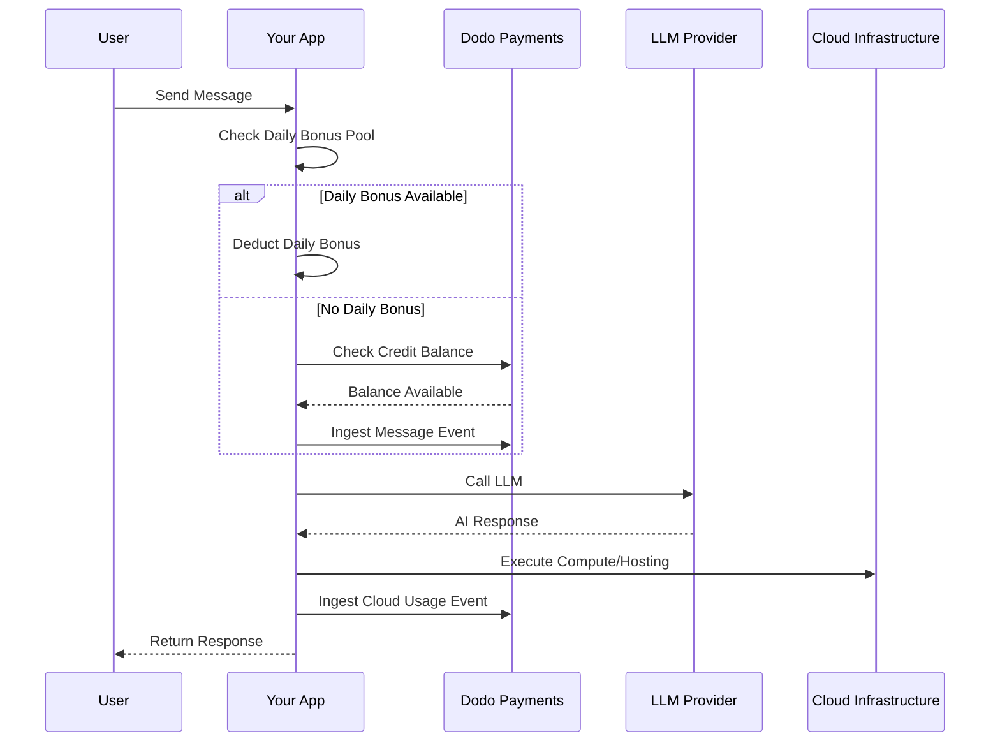

Lovable (lovable.dev) là một ứng dụng web xây dựng AI sử dụng mô hình thuê bao dựa trên tín dụng. Không giống như các hệ thống dựa trên token, Lovable đơn giản hóa trải nghiệm người dùng bằng cách tính một tín dụng cho mỗi thông điệp. Mô hình này kết hợp một hồ tín dụng hàng tháng với phần thưởng nhỏ hàng ngày để khuyến khích tương tác liên tục đồng thời cho phép sử dụng đột ngột.

## Mô Hình Thanh Toán của Lovable

Giá cả của Lovable dựa trên tín dụng thông điệp và đo lường riêng biệt cho cơ sở hạ tầng đám mây.

| Kế hoạch | Giá | Tín dụng hàng tháng | Phần thưởng hàng ngày | Các tính năng chính |
| :--- | :--- | :--- | :--- | :--- |
| Miễn phí | $0/tháng | 0 | 5/ngày (tối đa 30/tháng) | Chỉ dự án công khai |
| Pro | $25/tháng | 100 | 5/ngày (tối đa 150/tháng tổng cộng) | Nạp tiền theo yêu cầu, Đám mây + AI dựa trên sử dụng, tên miền tùy chỉnh |
| Doanh nghiệp | $50/tháng | 100 | 5/ngày | Đăng nhập một lần, không gian làm việc nhóm, mẫu thiết kế, trung tâm bảo mật |
| Doanh nghiệp lớn | Tuỳ chỉnh | Tuỳ chỉnh | Tuỳ chỉnh | SCIM, hỗ trợ đặc biệt, nhật ký kiểm toán |

- **Thuê bao dựa trên tín dụng**: 1 tín dụng = 1 thông điệp/đề xuất cho AI.
- **Tín dụng được chia sẻ giữa vô số người dùng**: Hồ nhóm, không dựa trên từng ghế.
- **Tín dụng được đặt lại mỗi chu kỳ thanh toán**: Tín dụng hàng tháng làm mới khi gia hạn.
- **Nạp thêm tín dụng theo yêu cầu**: Người dùng có thể mua thêm tín dụng nếu hết.
- **Đo lường Đám mây + AI dựa trên sử dụng riêng biệt**: Đo lường cho lưu trữ và tính toán.
- **Phần thưởng tín dụng hàng ngày được đặt lại mỗi ngày**: Một dòng nhỏ hàng ngày 5 tín dụng cần sử dụng kịp thời.

## Điều Gì Làm Nó Độc Đáo

- **Đơn giản dựa trên thông điệp**: 1 tín dụng = 1 thông điệp bất kể độ phức tạp. Không đếm token hoặc ước lượng mô hình.
- **Hỗn hợp dòng nhỏ hàng ngày + hồ hàng tháng**: 5 tín dụng phần thưởng hàng ngày tạo động lực tương tác hàng ngày, trong khi 100 tín dụng hàng tháng cho phép sử dụng đột ngột.
- **Hồ nhóm được chia sẻ xuyên suốt**: Tín dụng được chia sẻ giữa vô số người dùng với giá đội cố định, không dựa trên từng ghế.
- **Hai lớp thanh toán**: Tín dụng cho tương tác AI + đo lường sử dụng riêng biệt cho cơ sở hạ tầng đám mây.

## Xây Dựng Điều Này với Dodo Payments

Bạn có thể sao chép mô hình hỗn hợp của Lovable bằng cách sử dụng quyền tín dụng và bộ đo lường dựa trên sử dụng của Dodo Payments.

<Steps>
  <Step title="Create a Custom Unit Credit Entitlement">
    Định nghĩa hệ thống tín dụng thông điệp trong bảng điều khiển Dodo Payments của bạn. Sự cho phép này xử lý hồ tín dụng hàng tháng.

    - **Loại tín dụng**: Đơn vị Tùy chỉnh
    - **Tên đơn vị**: "Messages"
    - **Độ chính xác**: 0
    - **Hết hạn tín dụng**: 30 ngày
    - **Quá tải**: Vô hiệu hóa (giới hạn cứng khi tín dụng chạm 0)
  </Step>

  <Step title="Create Subscription Products">
    Tạo các kế hoạch của bạn và gắn quyền tín dụng. Đối với kế hoạch Miễn phí, bạn sẽ xử lý phần thưởng hàng ngày qua logic ứng dụng.

    - **Miễn phí**: $0/tháng, 0 tín dụng (phần thưởng hàng ngày được xử lý bởi logic ứng dụng)
    - **Pro**: $25/tháng, 100 tín dụng/chu kỳ, đính kèm quyền tín dụng
    - **Doanh nghiệp**: $50/tháng, 100 tín dụng/chu kỳ, đính kèm quyền tín dụng

    ```typescript
    import DodoPayments from 'dodopayments';

    const client = new DodoPayments({
      bearerToken: process.env.DODO_PAYMENTS_API_KEY,
    });

    const session = await client.checkoutSessions.create({
      product_cart: [
        { product_id: 'pdt_lovable_pro', quantity: 1 }
      ],
      customer: { email: 'user@example.com' },
      return_url: 'https://lovable.dev/dashboard'
    });
    ```

  </Step>

  <Step title="Create a Usage Meter for Cloud + AI">
    Lovable thanh toán riêng biệt cho cơ sở hạ tầng đám mây. Tạo đồng hồ đo để theo dõi những chi phí này.

    - **Tên đồng hồ đo**: `cloud.compute_seconds`
    - **Gộp**: Tổng trên thuộc tính `compute_seconds`

    Đính kèm đồng hồ đo này vào các sản phẩm thuê bao của bạn với giá từng đơn vị. Khi bạn nhập sử dụng, Dodo tính toán chi phí dựa trên tỷ lệ của bạn.

    ```typescript
    await client.usageEvents.ingest({
      events: [{
        event_id: `compute_${Date.now()}`,
        customer_id: 'cust_123',
        event_name: 'cloud.compute_seconds',
        timestamp: new Date().toISOString(),
        metadata: {
          compute_seconds: 3600,
          project_id: 'proj_abc'
        }
      }]
    });
    ```

  </Step>

  <Step title="Implement Daily Bonus Credits (Application Logic)">
    Phần thưởng dòng nhỏ hàng ngày được xử lý ở mức ứng dụng. Bạn có thể sử dụng cron job để cung cấp các tín dụng này hoặc theo dõi chúng riêng biệt trong cơ sở dữ liệu của bạn.

    Để theo dõi việc sử dụng những tín dụng phần thưởng này trong Dodo mà không làm cạn kiệt ngay lập tức hồ cho phép chính, bạn có thể sử dụng tên sự kiện riêng biệt hoặc xử lý logic trong ứng dụng của bạn để kiểm tra hồ phần thưởng trước.

    ```typescript
    // Example cron job logic (pseudo-code)
    // Every day at midnight UTC:
    // 1. Reset 'daily_bonus_used' to 0 for all users in your DB
    
    // When a user sends a message:
    async function handleMessage(userId: string) {
      const user = await db.users.findUnique({ where: { id: userId } });
      
      if (user.daily_bonus_used < 5) {
        // Use daily bonus
        await db.users.update({
          where: { id: userId },
          data: { daily_bonus_used: { increment: 1 } }
        });
        // Track for analytics but don't deduct from Dodo credits yet
        await client.usageEvents.ingest({
          events: [{
            event_id: `msg_bonus_${Date.now()}`,
            customer_id: userId,
            event_name: 'ai.message.bonus',
            timestamp: new Date().toISOString(),
            metadata: { type: 'daily_bonus' }
          }]
        });
      } else {
        // Deduct from Dodo credit entitlement
        await client.usageEvents.ingest({
          events: [{
            event_id: `msg_${Date.now()}`,
            customer_id: userId,
            event_name: 'ai.message',
            timestamp: new Date().toISOString(),
            metadata: { type: 'subscription_credit' }
          }]
        });
      }
    }
    ```

  </Step>

  <Step title="Send Usage Events for Messages">
    Theo dõi mỗi thông điệp AI như một sự kiện sử dụng. Liên kết sự kiện `ai.message` đến quyền tín dụng "Messages" của bạn trong bảng điều khiển Dodo.

    ```typescript
    await client.usageEvents.ingest({
      events: [{
        event_id: `msg_${Date.now()}`,
        customer_id: 'cust_123',
        event_name: 'ai.message',
        timestamp: new Date().toISOString(),
        metadata: {
          content_length: 450,
          project_id: 'proj_abc',
          feature_type: 'editor'
        }
      }]
    });
    ```

  </Step>

  <Step title="Handle Webhooks for Low Balance">
    Thông báo cho người dùng khi họ sắp hết tín dụng để họ có thể nạp thêm hoặc nâng cấp.

    ```typescript
    import DodoPayments from 'dodopayments';
    import express from 'express';

    const app = express();
    app.use(express.raw({ type: 'application/json' }));

    const client = new DodoPayments({
      bearerToken: process.env.DODO_PAYMENTS_API_KEY,
      webhookKey: process.env.DODO_PAYMENTS_WEBHOOK_KEY,
    });

    app.post('/webhooks/dodo', async (req, res) => {
      try {
        const event = client.webhooks.unwrap(req.body.toString(), {
          headers: {
            'webhook-id': req.headers['webhook-id'] as string,
            'webhook-signature': req.headers['webhook-signature'] as string,
            'webhook-timestamp': req.headers['webhook-timestamp'] as string,
          },
        });

        if (event.type === 'credit.balance_low') {
          const { customer_id, available_balance } = event.data;
          await notifyUser(customer_id, `Your balance is low: ${available_balance} messages left.`);
        }

        res.json({ received: true });
      } catch (error) {
        res.status(401).json({ error: 'Invalid signature' });
      }
    });
    ```

  </Step>
</Steps>

## Tăng Tốc với Bản Thiết Kế Ingestion LLM

[Bản Thiết Kế Ingestion LLM](/developer-resources/ingestion-blueprints/llm) đơn giản hóa theo dõi bằng cách bọc khách hàng AI của bạn.

```typescript
import { createLLMTracker } from '@dodopayments/ingestion-blueprints';
import OpenAI from 'openai';

const tracker = createLLMTracker({
  apiKey: process.env.DODO_PAYMENTS_API_KEY,
  environment: 'live_mode',
  eventName: 'ai.message',
});

const trackedClient = tracker.wrap({
  client: new OpenAI(),
  customerId: 'cust_123',
});

// Automatically tracks the message and deducts 1 credit (if configured)
await trackedClient.chat.completions.create({
  model: 'gpt-4o',
  messages: [{ role: 'user', content: 'Build a landing page' }],
});
```

<Tip>
  Khám phá [tài liệu bản thiết kế đầy đủ](/developer-resources/ingestion-blueprints/llm) để biết thêm chi tiết về theo dõi tự động.
</Tip>

## Tổng Quan Kiến Trúc



## Các Tính Năng Chính của Dodo Đã Sử Dụng

Khám phá các tính năng tạo nên việc triển khai này khả thi.

<CardGroup cols={2}>
  <Card title="Credit-Based Billing" icon="coins" href="/features/credit-based-billing">
    Quản lý tín dụng thông điệp và hồ nhóm chia sẻ.
  </Card>
  <Card title="Subscriptions" icon="calendar" href="/features/subscription">
    Thiết lập kế hoạch định kỳ cho các cấp Pro và Doanh nghiệp.
  </Card>
  <Card title="Usage-Based Billing" icon="chart-line" href="/features/usage-based-billing/introduction">
    Đo lường việc sử dụng hạ tầng đám mây riêng biệt với tín dụng AI.
  </Card>
  <Card title="Event Ingestion" icon="bolt" href="/features/usage-based-billing/event-ingestion">
    Gửi thông điệp và sự kiện tính toán có khối lượng lớn tới Dodo.
  </Card>
  <Card title="Webhooks" icon="webhook" href="/developer-resources/webhooks/intents/credit">
    Tự động hóa thông báo cho số dư tín dụng thấp.
  </Card>
  <Card title="LLM Ingestion Blueprint" icon="brain-circuit" href="/developer-resources/ingestion-blueprints/llm">
    Đơn giản hóa theo dõi việc sử dụng AI với tích hợp sẵn.
  </Card>
</CardGroup>
