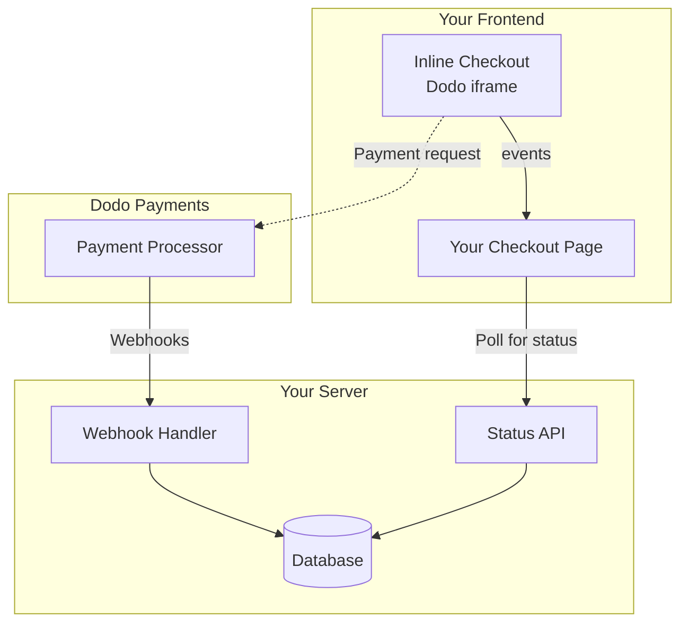

## Tổng Quan

Thanh toán inline cho phép bạn tạo ra những trải nghiệm thanh toán hoàn toàn tích hợp, hòa quyện một cách liền mạch với trang web hoặc ứng dụng của bạn. Khác với [thanh toán overlay](/developer-resources/overlay-checkout), mở dưới dạng modal trên trang của bạn, thanh toán inline nhúng biểu mẫu thanh toán trực tiếp vào bố cục trang của bạn.

Sử dụng thanh toán inline, bạn có thể:

- Tạo ra những trải nghiệm thanh toán hoàn toàn tích hợp với ứng dụng hoặc trang web của bạn
- Để Dodo Payments an toàn thu thập thông tin khách hàng và thông tin thanh toán trong một khung thanh toán tối ưu
- Hiển thị các mặt hàng, tổng số và thông tin khác từ Dodo Payments trên trang của bạn
- Sử dụng các phương thức và sự kiện SDK để xây dựng những trải nghiệm thanh toán nâng cao

<Frame>
    
</Frame>

## Cách Hoạt Động

Thanh toán inline hoạt động bằng cách nhúng một khung Dodo Payments an toàn vào trang web hoặc ứng dụng của bạn.

Khung thanh toán xử lý việc thu thập thông tin khách hàng và ghi lại chi tiết thanh toán. Trang của bạn hiển thị danh sách mặt hàng, tổng số và tùy chọn để thay đổi những gì có trên thanh toán. SDK cho phép trang của bạn và khung thanh toán tương tác với nhau.

Dodo Payments tự động tạo một đăng ký khi một thanh toán hoàn tất, sẵn sàng để bạn cung cấp.

<Note>
Khung thanh toán nội tuyến xử lý an toàn tất cả thông tin thanh toán nhạy cảm, đảm bảo tuân thủ PCI mà bạn không cần thêm chứng nhận nào nữa.
</Note>

## Điều Gì Tạo Nên Một Thanh Toán Inline Tốt?

Điều quan trọng là khách hàng biết họ đang mua từ ai, họ đang mua gì và họ phải trả bao nhiêu.

Để xây dựng một thanh toán inline tuân thủ và tối ưu hóa cho chuyển đổi, việc triển khai của bạn phải bao gồm:

<Frame caption="Example inline checkout layout showing required elements">
    
</Frame>

1. **Thông tin định kỳ**: Nếu là định kỳ, tần suất và tổng số phải trả khi gia hạn. Nếu là dùng thử, thời gian dùng thử kéo dài bao lâu.
2. **Mô tả mặt hàng**: Một mô tả về những gì đang được mua.
3. **Tổng giao dịch**: Tổng giao dịch, bao gồm tổng phụ, thuế tổng và tổng cộng. Đảm bảo bao gồm cả loại tiền tệ.
4. **Chân trang Dodo Payments**: Toàn bộ khung thanh toán inline, bao gồm chân trang thanh toán có thông tin về Dodo Payments, điều khoản bán hàng của chúng tôi và chính sách bảo mật của chúng tôi.
5. **Chính sách hoàn tiền**: Một liên kết đến chính sách hoàn tiền của bạn, nếu nó khác với chính sách hoàn tiền tiêu chuẩn của Dodo Payments.

<Warning>
Luôn hiển thị đầy đủ khung thanh toán nội tuyến, bao gồm cả phần chân trang. Loại bỏ hoặc ẩn thông tin pháp lý sẽ vi phạm yêu cầu tuân thủ.
</Warning>

## Hành Trình Khách Hàng

Luồng thanh toán được xác định bởi cấu hình phiên thanh toán của bạn. Tùy thuộc vào cách bạn cấu hình phiên thanh toán, khách hàng sẽ trải nghiệm một thanh toán có thể trình bày tất cả thông tin trên một trang duy nhất hoặc qua nhiều bước.

<Steps>
<Step title="Customer opens checkout">

Bạn có thể mở thanh toán nhúng bằng cách đưa vào các mục hoặc một giao dịch hiện có. Sử dụng SDK để hiển thị và cập nhật thông tin trên trang, và các phương thức SDK để cập nhật các mục dựa trên sự tương tác của khách hàng.
    

</Step>

<Step title="Customer enters their details">

Thanh toán inline trước tiên yêu cầu khách hàng nhập địa chỉ email của họ, chọn quốc gia của họ và (nếu cần) nhập mã ZIP hoặc mã bưu chính của họ. Bước này thu thập tất cả thông tin cần thiết để xác định thuế và các tùy chọn thanh toán có sẵn.

Bạn có thể tự động điền thông tin khách hàng và trình bày các địa chỉ đã lưu để đơn giản hóa trải nghiệm.

</Step>

<Step title="Customer selects payment method">

Sau khi nhập thông tin của họ, khách hàng sẽ được trình bày các phương thức thanh toán có sẵn và biểu mẫu thanh toán. Các tùy chọn có thể bao gồm thẻ tín dụng hoặc thẻ ghi nợ, PayPal, Apple Pay, Google Pay và các phương thức thanh toán địa phương khác dựa trên vị trí của họ.

Hiển thị các phương thức thanh toán đã lưu nếu có để tăng tốc độ thanh toán.


</Step>

<Step title="Checkout completed">

Dodo Payments định tuyến mọi thanh toán đến nhà cung cấp tốt nhất cho giao dịch đó để có cơ hội thành công tốt nhất. Khách hàng sẽ vào một quy trình thành công mà bạn có thể xây dựng.


</Step>

<Step title="Dodo Payments creates subscription">

Dodo Payments tự động tạo một đăng ký cho khách hàng, sẵn sàng để bạn cung cấp. Phương thức thanh toán mà khách hàng đã sử dụng sẽ được lưu giữ để gia hạn hoặc thay đổi đăng ký.


</Step>
</Steps>

## Bắt đầu nhanh

Bắt đầu với Dodo Payments Inline Checkout chỉ với vài dòng mã:

```typescript
import { DodoPayments } from "dodopayments-checkout";

// Initialize the SDK for inline mode
DodoPayments.Initialize({
  mode: "test",
  displayType: "inline",
  onEvent: (event) => {
    console.log("Checkout event:", event);
  },
});

// Open checkout in a specific container
DodoPayments.Checkout.open({
  checkoutUrl: "https://test.checkout.dodopayments.com/session/cks_123",
  elementId: "dodo-inline-checkout" // ID of the container element
});
```

<Tip>
Đảm bảo bạn có một phần tử chứa với `id` tương ứng trên trang của mình: `<div id="dodo-inline-checkout"></div>`.
</Tip>

## Hướng dẫn tích hợp từng bước

<Steps>
<Step title="Install the SDK">

Cài đặt Dodo Payments Checkout SDK:

<CodeGroup>

```bash npm
npm install dodopayments-checkout
```

```bash yarn
yarn add dodopayments-checkout
```

```bash pnpm
pnpm add dodopayments-checkout
```

</CodeGroup>

</Step>

<Step title="Initialize the SDK for Inline Display">

Khởi tạo SDK và chỉ định `displayType: 'inline'`. Bạn cũng nên lắng nghe sự kiện `checkout.breakdown` để cập nhật giao diện người dùng với các tính toán thuế và tổng tiền theo thời gian thực.

```typescript
import { DodoPayments } from "dodopayments-checkout";

DodoPayments.Initialize({
  mode: "test",
  displayType: "inline",
  onEvent: (event) => {
    if (event.event_type === "checkout.breakdown") {
      const breakdown = event.data?.message;
      // Update your UI with breakdown.subTotal, breakdown.tax, breakdown.total, etc.
    }
  },
});
```

</Step>

<Step title="Create a Container Element">

Thêm một phần tử vào HTML của bạn nơi khung thanh toán sẽ được chèn vào:

```html
<div id="dodo-inline-checkout"></div>
```

</Step>

<Step title="Open the Checkout">

Gọi `DodoPayments.Checkout.open()` với `checkoutUrl` và `elementId` của phần tử chứa của bạn:

```typescript
DodoPayments.Checkout.open({
  checkoutUrl: "https://test.checkout.dodopayments.com/session/cks_123",
  elementId: "dodo-inline-checkout"
});
```

</Step>

<Step title="Test Your Integration">

1. Khởi động máy chủ phát triển của bạn:

```bash
npm run dev
```

2. Kiểm tra quy trình thanh toán:
   - Nhập email và địa chỉ của bạn trong khung inline.
   - Xác minh rằng tóm tắt đơn hàng tùy chỉnh của bạn cập nhật theo thời gian thực.
   - Kiểm tra quy trình thanh toán bằng cách sử dụng thông tin xác thực thử nghiệm.
   - Xác nhận rằng các chuyển hướng hoạt động chính xác.

<Check>
Bạn sẽ thấy sự kiện `checkout.breakdown` được ghi lại trong bảng điều khiển trình duyệt nếu bạn thêm một console log trong callback `onEvent`.
</Check>

</Step>

<Step title="Go Live">

Khi bạn đã sẵn sàng cho sản xuất:

1. Thay đổi chế độ thành `'live'`:

```typescript
DodoPayments.Initialize({
  mode: "live",
  displayType: "inline",
  onEvent: (event) => {
    // Handle events
  }
});
```

2. Cập nhật các URL thanh toán của bạn để sử dụng các phiên thanh toán trực tiếp từ backend của bạn.
3. Kiểm tra quy trình hoàn chỉnh trong sản xuất.

</Step>
</Steps>

## Ví dụ hoàn chỉnh về React

Ví dụ này minh họa cách triển khai một tóm tắt đơn hàng tùy chỉnh bên cạnh thanh toán nội tuyến, giữ chúng đồng bộ bằng cách sử dụng sự kiện `checkout.breakdown`.

```tsx
"use client";

import { useEffect, useState } from 'react';
import { DodoPayments, CheckoutBreakdownData } from 'dodopayments-checkout';

export default function CheckoutPage() {
  const [breakdown, setBreakdown] = useState<Partial<CheckoutBreakdownData>>({});

  useEffect(() => {
    // 1. Initialize the SDK
    DodoPayments.Initialize({
      mode: 'test',
      displayType: 'inline',
      onEvent: (event) => {
        // 2. Listen for the 'checkout.breakdown' event
        if (event.event_type === "checkout.breakdown") {
          const message = event.data?.message as CheckoutBreakdownData;
          if (message) setBreakdown(message);
        }
      }
    });

    // 3. Open the checkout in the specified container
    DodoPayments.Checkout.open({
      checkoutUrl: 'https://test.checkout.dodopayments.com/session/cks_123',
      elementId: 'dodo-inline-checkout'
    });

    return () => DodoPayments.Checkout.close();
  }, []);

  const format = (amt: number | null | undefined, curr: string | null | undefined) => 
    amt != null && curr ? `${curr} ${(amt/100).toFixed(2)}` : '0.00';

  const currency = breakdown.currency ?? breakdown.finalTotalCurrency ?? '';

  return (
    <div className="flex flex-col md:flex-row min-h-screen">
      {/* Left Side - Checkout Form */}
      <div className="w-full md:w-1/2 flex items-center">
        <div id="dodo-inline-checkout" className='w-full' />
      </div>

      {/* Right Side - Custom Order Summary */}
      <div className="w-full md:w-1/2 p-8 bg-gray-50">
        <h2 className="text-2xl font-bold mb-4">Order Summary</h2>
        <div className="space-y-2">
          {breakdown.subTotal && (
            <div className="flex justify-between">
              <span>Subtotal</span>
              <span>{format(breakdown.subTotal, currency)}</span>
            </div>
          )}
          {breakdown.discount && (
            <div className="flex justify-between">
              <span>Discount</span>
              <span>{format(breakdown.discount, currency)}</span>
            </div>
          )}
          {breakdown.tax != null && (
            <div className="flex justify-between">
              <span>Tax</span>
              <span>{format(breakdown.tax, currency)}</span>
            </div>
          )}
          <hr />
          {(breakdown.finalTotal ?? breakdown.total) && (
            <div className="flex justify-between font-bold text-xl">
              <span>Total</span>
              <span>{format(breakdown.finalTotal ?? breakdown.total, breakdown.finalTotalCurrency ?? currency)}</span>
            </div>
          )}
        </div>
      </div>
    </div>
  );
}

```

## Tài liệu API

### Cấu hình

#### Tùy chọn khởi tạo

```typescript
interface InitializeOptions {
  mode: "test" | "live";
  displayType: "inline"; // Required for inline checkout
  onEvent: (event: CheckoutEvent) => void;
}
```

| Tùy chọn | Loại | Bắt buộc | Mô tả |
|--------|------|----------|-------------|
| `mode` | `"test" \| "live"` | Có | Chế độ môi trường. |
| `displayType` | `"inline" \| "overlay"` | Có | Phải được đặt thành `"inline"` để nhúng thanh toán. |
| `onEvent` | `function` | Có | Hàm callback để xử lý sự kiện thanh toán. |

#### Tùy chọn thanh toán

```typescript
export type FontSize = "xs" | "sm" | "md" | "lg" | "xl" | "2xl";
export type FontWeight = "normal" | "medium" | "bold" | "extraBold";

interface CheckoutOptions {
  checkoutUrl: string;
  elementId: string; // Required for inline checkout
  options?: {
    showTimer?: boolean;
    showSecurityBadge?: boolean;
    payButtonText?: string;
    fontSize?: FontSize;
    fontWeight?: FontWeight;
  };
}
```

| Tùy chọn | Kiểu | Bắt buộc | Mô tả |
|--------|------|----------|-------------|
| `checkoutUrl` | `string` | Có | URL phiên thanh toán. |
| `elementId` | `string` | Có | `id` của phần tử DOM nơi thanh toán nên được hiển thị. |
| `options.showTimer` | `boolean` | Không | Hiện hoặc ẩn bộ đếm thời gian thanh toán. Mặc định là `true`. Khi bị vô hiệu, bạn sẽ nhận sự kiện `checkout.link_expired` khi phiên hết hạn. |
| `options.showSecurityBadge` | `boolean` | Không | Hiện hoặc ẩn huy hiệu bảo mật. Mặc định là `true`. |
| `options.payButtonText` | `string` | Không | Văn bản tùy chỉnh để hiển thị trên nút thanh toán. |
| `options.fontSize` | `FontSize` | Không | Kích cỡ phông chữ toàn cầu cho thanh toán. |
| `options.fontWeight` | `FontWeight` | Không | Trọng lượng phông chữ toàn cầu cho thanh toán. |

### Phương thức

#### Mở thanh toán

Mở khung thanh toán trong phần tử được chỉ định.

```typescript
DodoPayments.Checkout.open({
  checkoutUrl: "https://test.checkout.dodopayments.com/session/cks_123",
  elementId: "dodo-inline-checkout"
});
```

Bạn cũng có thể truyền thêm tùy chọn để tùy chỉnh hành vi thanh toán:

```typescript
DodoPayments.Checkout.open({
  checkoutUrl: "https://test.checkout.dodopayments.com/session/cks_123",
  elementId: "dodo-inline-checkout",
  options: {
    showTimer: false,
    showSecurityBadge: false,
    payButtonText: "Pay Now",
  },
});
```

#### Đóng Thanh toán

Xóa khung thanh toán bằng mã và làm sạch các trình lắng nghe sự kiện.

```typescript
DodoPayments.Checkout.close();
```

#### Kiểm tra Trạng thái

Trả về liệu khung thanh toán hiện có được tiêm hay không.

```typescript
const isOpen = DodoPayments.Checkout.isOpen();
// Returns: boolean
```

### Sự kiện

SDK cung cấp sự kiện thời gian thực thông qua hàm gọi lại `onEvent`. Đối với thanh toán nhúng, `checkout.breakdown` đặc biệt hữu ích để đồng bộ giao diện người dùng của bạn.

| Loại sự kiện | Mô tả |
|------------|-------------|
| `checkout.opened` | Khung thanh toán đã được tải. |
| `checkout.form_ready` | Biểu mẫu thanh toán sẵn sàng nhận đầu vào của người dùng. Hữu ích để ẩn trạng thái tải và hiển thị giao diện thanh toán. |
| `checkout.breakdown` | Được kích hoạt khi giá cả, thuế, hoặc chiết khấu được cập nhật. |
| `checkout.customer_details_submitted` | Thông tin khách hàng đã được gửi. |
| `checkout.pay_button_clicked` | Được kích hoạt khi khách hàng bấm nút thanh toán. Hữu ích cho việc phân tích và theo dõi phễu chuyển đổi. |
| `checkout.redirect` | Thanh toán sẽ chuyển hướng (ví dụ: đến trang ngân hàng). |
| `checkout.error` | Đã xảy ra lỗi trong quá trình thanh toán. |
| `checkout.link_expired` | Được kích hoạt khi phiên thanh toán hết hạn. Chỉ nhận khi `showTimer` được đặt là `false`. |

#### Dữ liệu Phân tích Thanh toán

Sự kiện `checkout.breakdown` cung cấp dữ liệu sau:

```typescript
interface CheckoutBreakdownData {
  subTotal?: number;          // Amount in cents
  discount?: number;         // Amount in cents
  tax?: number;              // Amount in cents
  total?: number;            // Amount in cents
  currency?: string;         // e.g., "USD"
  finalTotal?: number;       // Final amount including adjustments
  finalTotalCurrency?: string; // Currency for the final total
}
```

#### Hiểu về Sự kiện Phân tích

Sự kiện `checkout.breakdown` là cách chính để giữ giao diện của ứng dụng bạn đồng bộ với trạng thái thanh toán Dodo Payments.

**Khi nó được kích hoạt:**
- **Khi khởi tạo**: Ngay sau khi khung thanh toán được tải và sẵn sàng.
- **Khi thay đổi địa chỉ**: Bất cứ khi nào khách hàng chọn một quốc gia hoặc nhập mã bưu điện dẫn đến việc tính toán lại thuế.

**Chi tiết Trường:**

| Trường | Mô tả |
|-------|-------------|
| `subTotal` | Tổng của tất cả các mặt hàng trong phiên trước khi bất kỳ chiết khấu hoặc thuế nào được áp dụng. |
| `discount` | Giá trị tổng của tất cả chiết khấu đã áp dụng. |
| `tax` | Số tiền thuế đã tính. Ở chế độ `inline`, điều này cập nhật động khi người dùng tương tác với các trường địa chỉ. |
| `total` | Kết quả toán học của `subTotal - discount + tax` trong đơn vị tiền tệ cơ bản của phiên. |
| `currency` | Mã tiền tệ ISO (ví dụ: `"USD"`) cho giá trị tiêu chuẩn, chiết khấu và thuế. |
| `finalTotal` | Số tiền thực tế mà khách hàng phải trả. Điều này có thể bao gồm điều chỉnh ngoại hối bổ sung hoặc phí phương thức thanh toán địa phương không phải là một phần của phân tích giá cơ bản. |
| `finalTotalCurrency` | Tiền tệ mà khách hàng thực sự thanh toán. Điều này có thể khác so với `currency` nếu mua hàng dưới chế độ công bằng hoặc chuyển đổi tiền tệ địa phương đang hoạt động. |

**Mẹo Tích hợp Quan trọng:**

1.  **Định dạng Tiền tệ**: Giá luôn được trả về dưới dạng số nguyên trong đơn vị tiền tệ nhỏ nhất (ví dụ: cent cho USD, yen cho JPY). Để hiển thị, chia cho 100 (hoặc số mũ đúng) hoặc sử dụng một thư viện định dạng như `Intl.NumberFormat`.
2.  **Xử lý Trạng thái Khởi đầu**: Khi thanh toán lần đầu tiên tải, `tax` và `discount` có thể là `0` hoặc `null` cho đến khi người dùng cung cấp thông tin thanh toán hoặc áp dụng mã. Giao diện người dùng của bạn nên xử lý các trạng thái này một cách trơn tru (ví dụ: hiển thị một dấu gạch `—` hoặc ẩn hàng).
3.  **"Tổng cuối" so với "Tổng"**: Mặc dù `total` cung cấp cho bạn tính toán giá chuẩn, `finalTotal` là nguồn chân thực cho giao dịch. Nếu `finalTotal` có mặt, nó phản ánh chính xác những gì sẽ được tính trên thẻ của khách hàng, bao gồm bất kỳ điều chỉnh động nào.
4.  **Phản hồi Thời gian thực**: Sử dụng trường `tax` để hiển thị cho người dùng rằng thuế đang được tính toán thời gian thực. Điều này tạo ra một cảm giác "sống" cho trang thanh toán của bạn và giảm rào cản trong bước nhập địa chỉ.

## Tùy chọn Thực hiện

### Cài đặt Trình quản lý Gói

Cài đặt qua npm, yarn, hoặc pnpm như trình bày trong [Hướng dẫn Tích hợp Từng bước](#step-by-step-integration-guide).

### Thực hiện CDN

Để tích hợp nhanh mà không cần bước xây dựng, bạn có thể sử dụng CDN của chúng tôi:

```html
<!DOCTYPE html>
<html lang="en">
<head>
    <meta charset="UTF-8">
    <meta name="viewport" content="width=device-width, initial-scale=1.0">
    <title>Dodo Payments Inline Checkout</title>
    
    <!-- Load DodoPayments -->
    <script src="https://cdn.jsdelivr.net/npm/dodopayments-checkout@latest/dist/index.js"></script>
    <script>
        // Initialize the SDK
        DodoPaymentsCheckout.DodoPayments.Initialize({
            mode: "test",
            displayType: "inline",
            onEvent: (event) => {
                console.log('Checkout event:', event);
            }
        });
    </script>
</head>
<body>
    <div id="dodo-inline-checkout"></div>

    <script>
        // Open the checkout
        DodoPaymentsCheckout.DodoPayments.Checkout.open({
            checkoutUrl: "https://test.checkout.dodopayments.com/session/cks_123",
            elementId: "dodo-inline-checkout"
        });
    </script>
</body>
</html>
```

## Cập nhật Phương thức Thanh toán

Thanh toán nhúng hỗ trợ **cập nhật phương thức thanh toán** cho đăng ký. Khi một khách hàng cần cập nhật phương thức thanh toán -- cho đăng ký đang hoạt động hoặc để kích hoạt lại một đăng ký đang tạm dừng -- bạn có thể hiển thị luồng cập nhật trực tiếp trong bố cục trang của bạn.

### Cách Hoạt động

1. Gọi [API Cập nhật Phương thức Thanh toán](/features/subscription#update-payment-method-for-active-subscription) để lấy `payment_link`:

```typescript
const response = await client.subscriptions.updatePaymentMethod('sub_123', {
  payment_method: { type: 'new', return_url: 'https://example.com/return' }
});
```

2. Chuyển `payment_link` được trả về làm `checkoutUrl` để mở thanh toán nhúng:

```typescript
DodoPayments.Checkout.open({
  checkoutUrl: response.payment_link,
  elementId: "dodo-inline-checkout"
});
```

Khung nhúng chỉ hiển thị biểu mẫu thu thập phương thức thanh toán. Khách hàng có thể nhập chi tiết thẻ mới hoặc chọn phương thức thanh toán đã lưu mà không rời khỏi trang của bạn.

### Đối với Đăng ký Tạm dừng

Khi cập nhật phương thức thanh toán cho một đăng ký trong trạng thái `on_hold`, Dodo Payments tự động tạo một khoản thu cho bất kỳ khoản nợ còn lại. Theo dõi `payment.succeeded` và `subscription.active` webhook để xác nhận kích hoạt lại.

```typescript
const response = await client.subscriptions.updatePaymentMethod('sub_123', {
  payment_method: { type: 'new', return_url: 'https://example.com/return' }
});

if (response.payment_id) {
  // Charge created for remaining dues
  // Open inline checkout for payment collection
  DodoPayments.Checkout.open({
    checkoutUrl: response.payment_link,
    elementId: "dodo-inline-checkout"
  });
}
```

<Tip>
Bạn cũng có thể sử dụng phương thức thanh toán đã lưu hiện có thay vì thu thập thông tin mới bằng cách truyền `type: 'existing'` với `payment_method_id` tới API Cập nhật Phương thức Thanh toán.
</Tip>

## Xử lý Lỗi

SDK cung cấp thông tin chi tiết về lỗi qua hệ thống sự kiện. Luôn thực hiện xử lý lỗi đúng cách trong hàm gọi lại `onEvent` của bạn:

```typescript
DodoPayments.Initialize({
  mode: "test",
  displayType: "inline",
  onEvent: (event: CheckoutEvent) => {
    if (event.event_type === "checkout.error") {
      console.error("Checkout error:", event.data?.message);
      // Handle error appropriately
    }
  }
});
```

<Warning>
Luôn xử lý sự kiện `checkout.error` để cung cấp trải nghiệm người dùng tốt khi sự cố xảy ra.
</Warning>

## Làm thế nào để Tốt nhất

1. **Thiết kế Đáp ứng**: Đảm bảo phần tử container của bạn có đủ chiều rộng và chiều cao. Iframe sẽ thường mở rộng để điền vào container của nó.
2. **Đồng bộ hóa**: Sử dụng sự kiện `checkout.breakdown` để giữ bản tóm tắt đơn hàng tùy chỉnh của bạn hoặc bảng giá đồng bộ với những gì người dùng thấy trong khung thanh toán.
3. **Trạng thái Khung xương**: Hiển thị một chỉ báo tải trong container của bạn cho đến khi sự kiện `checkout.opened` kích hoạt.
4. **Dọn dẹp**: Gọi `DodoPayments.Checkout.close()` khi phần tử của bạn hủy để dọn dẹp iframe và các trình lắng nghe sự kiện.

<Info>
Đối với các triển khai chế độ tối, nên sử dụng `#0d0d0d` làm màu nền để tích hợp thị giác tối ưu với khung thanh toán nhúng.
</Info>

## Xác thực Trạng thái Thanh toán

<Warning>
Không chỉ dựa vào sự kiện thanh toán nhúng để xác định thành công hoặc thất bại thanh toán. Luôn thực hiện xác thực phía máy chủ với webhooks và/hoặc polling.
</Warning>

### Tại sao Xác thực Phía Máy chủ là Cần thiết

Mặc dù các sự kiện thanh toán nhúng cung cấp phản hồi thời gian thực, chúng không nên là nguồn chân thực duy nhất của bạn cho trạng thái thanh toán. Các sự cố mạng, trình duyệt sập, hoặc người dùng đóng trang có thể khiến các sự kiện bị bỏ qua. Để đảm bảo xác thực thanh toán đáng tin cậy:

1. **Máy chủ của bạn nên lắng nghe sự kiện webhook** - Dodo Payments gửi webhooks cho các thay đổi trạng thái thanh toán
2. **Thực hiện một cơ chế polling** - Frontend của bạn nên polling máy chủ của bạn để cập nhật trạng thái
3. **Kết hợp cả hai cách** - Sử dụng webhooks làm nguồn chính và polling làm sụt dự phòng

### Kiến trúc Khuyến cáo



### Các Bước Thực hiện

**1. Lắng nghe sự kiện thanh toán** - Khi người dùng nhấp vào thanh toán, bắt đầu chuẩn bị xác minh trạng thái:

```typescript
onEvent: (event) => {
  if (event.event_type === 'checkout.pay_button_clicked') {
    // Start polling your server for confirmed status
    startPolling();
  }
}
```

**2. Poll máy chủ của bạn** - Tạo một endpoint kiểm tra cơ sở dữ liệu của bạn cho trạng thái thanh toán (được cập nhật bởi webhooks):

```typescript
// Poll every 2 seconds until status is confirmed
const interval = setInterval(async () => {
  const { status } = await fetch(`/api/payments/${paymentId}/status`).then(r => r.json());
  if (status === 'succeeded' || status === 'failed') {
    clearInterval(interval);
    handlePaymentResult(status);
  }
}, 2000);
```

**3. Xử lý webhooks phía máy chủ** - Cập nhật cơ sở dữ liệu của bạn khi Dodo gửi `payment.succeeded` hoặc `payment.failed` webhooks. Xem [tài liệu Webhooks của chúng tôi](/developer-resources/webhooks) để biết chi tiết.

## Xử lý sự cố

<AccordionGroup>
<Accordion title="Checkout frame is not appearing">
- Xác minh rằng `elementId` khớp với `id` của một `div` thực sự tồn tại trong DOM.
- Đảm bảo `displayType: 'inline'` đã được truyền đến `Initialize`.
- Kiểm tra rằng `checkoutUrl` là hợp lệ.
</Accordion>

<Accordion title="Taxes are not updating in my UI">
- Đảm bảo bạn đang lắng nghe sự kiện `checkout.breakdown`.
- Thuế chỉ được tính toán sau khi người dùng nhập một quốc gia và mã bưu điện hợp lệ trong khung thanh toán.
</Accordion>
</AccordionGroup>

## Kích hoạt Ví điện tử

Để biết thông tin chi tiết về việc thiết lập Apple Pay, Google Pay và các ví điện tử khác, hãy xem trang <a href="/features/payment-methods/digital-wallets">Ví điện tử</a>.

### Thiết lập Nhanh cho Apple Pay

<Info>
Chỉ yêu cầu xác minh domain đối với **inline (embedded) checkout**. Không yêu cầu xác minh đối với hosted checkout.
</Info>

<Warning>
Apple Pay không khả dụng cho overlay checkout.
</Warning>

Apple Pay được xác minh theo từng domain từ dashboard.

<Steps>
<Step title="Open Wallet domains">
Đi đến **Settings → Payment Methods** và trên hàng **Apple Pay**, nhấp vào **Manage domains**.

<Frame caption="Open Wallet domains from the Apple Pay row">
  
</Frame>
</Step>

<Step title="Download the domain association file">
Từ bảng Wallet domains, tải xuống association file.

<Frame caption="Download the Apple Pay domain association file">
  
</Frame>
</Step>

<Step title="Register your domain">
Nhấp vào **Register domain** và nhập domain nơi bạn embed inline checkout (ví dụ: `shop.example.com`), sau đó nhấp **Continue**.

<Frame caption="Register the domain where you embed inline checkout">
  
</Frame>
</Step>

<Step title="Host the file on your domain">
Lưu trữ tại:

```
https://shop.example.com/.well-known/apple-developer-merchantid-domain-association
```

Tệp phải được cung cấp qua HTTPS, có thể truy cập mà không cần chuyển hướng và được cung cấp với `Content-Type: application/octet-stream` hoặc `text/plain`.
</Step>

<Step title="Verify the domain">
Nhấp vào **Verify domain**. Dodo Payments xác nhận tệp đang hoạt động và gửi domain của bạn đến Apple.

<Frame caption="Verify the hosted association file">
  
</Frame>
</Step>

<Step title="Confirm it's active">
Khi trạng thái hiển thị **Active**, Apple Pay đã được bật cho domain đó. Sử dụng công tắc **Enabled** để bật hoặc tắt tính năng này cho từng domain.

<Frame caption="Verified domains show an Active status">
  
</Frame>
</Step>

<Step title="Test the integration">
1. Mở checkout trên thiết bị Apple
2. Xác minh nút Apple Pay xuất hiện
3. Hoàn tất giao dịch thử nghiệm
</Step>
</Steps>

## Hỗ trợ trình duyệt

Dodo Payments Checkout SDK hỗ trợ các trình duyệt sau:

- Chrome (mới nhất)
- Firefox (mới nhất)
- Safari (mới nhất)
- Edge (mới nhất)
- IE11+

## Inline và Overlay Checkout

Chọn loại checkout phù hợp với trường hợp sử dụng của bạn:

| Tính năng | Inline Checkout | Overlay Checkout |
|---------|-----------------|------------------|
| Mức độ tích hợp | Được nhúng hoàn toàn vào trang | Modal nằm trên trang |
| Kiểm soát bố cục | Toàn quyền kiểm soát | Hạn chế |
| Branding | Liền mạch | Tách biệt với trang |
| Công sức triển khai | Cao hơn | Thấp hơn |
| Phù hợp nhất cho | Các trang checkout tùy chỉnh, quy trình có tỷ lệ chuyển đổi cao | Tích hợp nhanh, các trang hiện có |

<Tip>
Sử dụng **inline checkout** khi bạn muốn có quyền kiểm soát tối đa đối với trải nghiệm checkout và branding liền mạch. Sử dụng **overlay checkout** để tích hợp nhanh hơn với ít thay đổi nhất đối với các trang hiện có.
</Tip>

## Tài nguyên liên quan

<CardGroup cols={2}>
<Card title="Overlay Checkout" icon="layer-group" href="/developer-resources/overlay-checkout">
    Sử dụng overlay checkout để tích hợp nhanh dựa trên modal.
</Card>

<Card title="Checkout Sessions API" icon="code" href="/api-reference/checkout-sessions/create">
    Tạo các checkout session để cung cấp năng lực cho trải nghiệm checkout của bạn.
</Card>

<Card title="Webhooks" icon="webhook" href="/developer-resources/webhooks">
    Xử lý các payment event ở phía server bằng webhook.
</Card>

<Card title="Integration Guide" icon="book" href="/developer-resources/integration-guide">
    Hướng dẫn đầy đủ về cách tích hợp Dodo Payments.
</Card>
</CardGroup>

Để được trợ giúp thêm, hãy truy cập [cộng đồng Discord](https://discord.gg/bYqAp4ayYh) hoặc liên hệ với đội ngũ hỗ trợ developer của chúng tôi.
