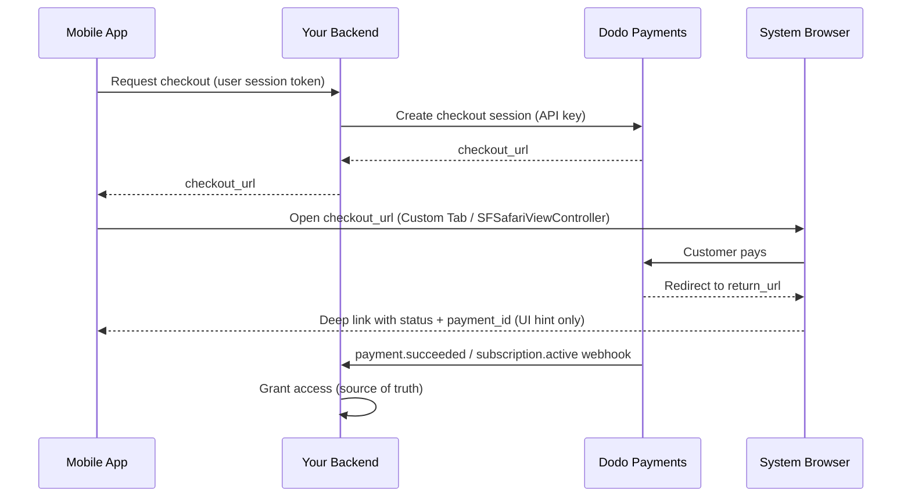

<CardGroup cols={4}>
<Card title="Quick Start" icon="rocket" href="#integration-workflow">
  Triển khai tích hợp thanh toán trên thiết bị di động trong 4 bước đơn giản
</Card>

<Card title="Platform Examples" icon="code" href="#choose-your-sdk">
  Ví dụ mã hoàn chỉnh cho Android, iOS, React Native và Flutter
</Card>

<Card title="Checkout Customization" icon="sliders" href="#checkout-page-customization">
  Cấu hình theme, điền sẵn dữ liệu và 14 tham số dành riêng cho thiết bị di động
</Card>

<Card title="Mobile Recipes" icon="flask" href="#mobile-optimized-recipes">
  Cấu hình checkout có thể sao chép-dán cho 5 tình huống phổ biến trên thiết bị di động
</Card>
</CardGroup>

<Info>
Dodo Payments cung cấp SDK checkout chính thức cho **Android, iOS, React Native,
và Flutter**. Mỗi SDK đóng gói pattern được trình bày bên dưới (mở
URL checkout, nhận kết quả trả về, phân tích kết quả) phía sau một lệnh gọi
`start(...)` có kiểu duy nhất, đồng thời tích hợp sẵn khả năng khôi phục
session bị bỏ dở. Chỉ sử dụng WebView thủ công nếu không SDK nào phù hợp với
stack của bạn.
</Info>

## Điều kiện tiên quyết

Trước khi tích hợp Dodo Payments vào ứng dụng di động, hãy đảm bảo bạn có:

- **Tài khoản Dodo Payments**: Tài khoản merchant đang hoạt động có quyền truy cập API
- **Thông tin xác thực API**: API key và webhook secret key từ dashboard
- **Dự án ứng dụng di động**: Ứng dụng Android, iOS, React Native hoặc Flutter
- **Backend Server**: Để xử lý việc tạo checkout session một cách an toàn

## Quy trình tích hợp

Tích hợp trên thiết bị di động tuân theo quy trình bảo mật gồm 4 bước, trong đó backend xử lý các lệnh gọi API còn ứng dụng di động quản lý trải nghiệm người dùng.



<Info>
Deep-link `status` chỉ là **gợi ý UI** về nội dung hiển thị cho người dùng. Luôn cấp quyền từ **webhook** `payment.succeeded` / `subscription.active` trên backend - không bao giờ chỉ dựa vào kết quả trên thiết bị di động.
</Info>

<Steps>
<Step title="Backend: Create Checkout Session">
<Card title="Checkout Session API Docs" icon="book" href="/developer-resources/checkout-session">
Tìm hiểu cách tạo checkout session trên backend bằng Node.js, Python và nhiều ngôn ngữ khác. Xem các ví dụ hoàn chỉnh và tài liệu tham chiếu tham số trong tài liệu <strong>Checkout Sessions API</strong> chuyên dụng.
</Card>
<Note>
**Bảo mật**: Checkout session phải được tạo trên backend server, không bao giờ trong ứng dụng di động. Điều này bảo vệ API key và đảm bảo quá trình validation chính xác.
</Note>

</Step>

<Step title="Mobile: Get Checkout URL">

Ứng dụng di động gọi backend để nhận URL checkout. Xác thực
request này bằng session token riêng của người dùng đã đăng nhập.

<Tabs>
<Tab title="iOS (Swift)">

```swift
func getCheckoutURL(productId: String, customerEmail: String, customerName: String) async throws -> String {
    let url = URL(string: "https://your-backend.com/api/create-checkout-session")!
    var request = URLRequest(url: url)
    request.httpMethod = "POST"
    request.setValue("application/json", forHTTPHeaderField: "Content-Type")
    request.setValue("Bearer \(userSessionToken)", forHTTPHeaderField: "Authorization")
    
    let requestData: [String: Any] = [
        "productId": productId,
        "customerEmail": customerEmail,
        "customerName": customerName
    ]
    request.httpBody = try JSONSerialization.data(withJSONObject: requestData)
    
    let (data, _) = try await URLSession.shared.data(for: request)
    let response = try JSONDecoder().decode(CheckoutResponse.self, from: data)
    return response.checkout_url
}
```

</Tab>
<Tab title="Android (Kotlin)">

```kotlin
suspend fun getCheckoutURL(productId: String, customerEmail: String, customerName: String): String {
    val client = OkHttpClient()
    val requestBody = JSONObject().apply {
        put("productId", productId)
        put("customerEmail", customerEmail)
        put("customerName", customerName)
    }.toString().toRequestBody("application/json".toMediaType())
    
    val request = Request.Builder()
        .url("https://your-backend.com/api/create-checkout-session")
        .header("Authorization", "Bearer $userSessionToken")
        .post(requestBody)
        .build()
    
    val response = client.newCall(request).execute()
    val responseBody = response.body?.string()
    val jsonResponse = JSONObject(responseBody ?: "")
    return jsonResponse.getString("checkout_url")
}
```

</Tab>
<Tab title="React Native (JavaScript)">

```javascript
const getCheckoutURL = async (productId, customerEmail, customerName) => {
  try {
    const response = await fetch('https://your-backend.com/api/create-checkout-session', {
      method: 'POST',
      headers: {
        'Content-Type': 'application/json',
        'Authorization': `Bearer ${userSessionToken}`,
      },
      body: JSON.stringify({
        productId,
        customerEmail,
        customerName
      })
    });
    
    const data = await response.json();
    return data.checkout_url;
  } catch (error) {
    console.error('Failed to get checkout URL:', error);
    throw error;
  }
};
```

</Tab>
<Tab title="Flutter (Dart)">

```dart
import 'dart:convert';
import 'package:http/http.dart' as http;

Future<String> getCheckoutUrl({
  required String productId,
  required String customerEmail,
  required String customerName,
}) async {
  final response = await http.post(
    Uri.parse('https://your-backend.com/api/create-checkout-session'),
    headers: {
      'Content-Type': 'application/json',
      'Authorization': 'Bearer $userSessionToken',
    },
    body: jsonEncode({
      'productId': productId,
      'customerEmail': customerEmail,
      'customerName': customerName,
    }),
  );

  if (response.statusCode != 200) {
    throw Exception('Failed to get checkout URL: ${response.statusCode}');
  }
  return jsonDecode(response.body)['checkout_url'] as String;
}
```

</Tab>
</Tabs>
<Note>
**Bảo mật**: Ứng dụng di động chỉ giao tiếp với backend của bạn, không bao giờ trực tiếp với Dodo Payments API.
</Note>
</Step>

<Step title="Mobile: Open Checkout in Browser">
Mở URL checkout trong trình duyệt an toàn bên trong ứng dụng để xử lý thanh toán.
Hoặc bỏ qua hoàn toàn phần thiết lập thủ công bằng SDK checkout chính thức dành
cho nền tảng của bạn.

<Card title="Pick your mobile SDK" icon="box" href="#choose-your-sdk">
  Các bước cài đặt và hướng dẫn thiết lập cho Android, iOS, React Native và Flutter.
</Card>

</Step>

<Step title="Backend: Handle Payment Completion">
Xử lý việc hoàn tất thanh toán thông qua webhook và redirect URL để xác nhận trạng thái thanh toán.
</Step>
</Steps>

## Chọn SDK

Mọi SDK di động đều cung cấp cùng một contract: một lệnh gọi `start(...)` mở checkout được host bởi Dodo trong giao diện trình duyệt native của nền tảng và trả về `CheckoutResult` có kiểu, trong đó `status` là `succeeded`, `failed`, `cancelled`, `pending` hoặc `expired`. Không SDK nào chứa API key hoặc gọi Dodo Payments API, và cả bốn SDK đều hỗ trợ khôi phục session bị bỏ dở.

<CardGroup cols={2}>
<Card title="Android" icon="android" href="/developer-resources/sdks/android">
  `com.dodopayments.api:checkout-android` mở Chrome Custom Tab. Yêu cầu `minSdk` 23.
</Card>
<Card title="iOS" icon="apple" href="/developer-resources/sdks/ios">
  `dodopayments-mobile-sdk-ios` mở `SFSafariViewController`. Yêu cầu iOS 16+.
</Card>
<Card title="React Native" icon="react" href="/developer-resources/sdks/react-native">
  `@dodopayments/react-native-checkout`, Turbo Module hoạt động trên cả hai native core. Yêu cầu React Native 0.76+.
</Card>
<Card title="Flutter" icon="layer-group" href="/developer-resources/sdks/flutter">
  `dodopayments_checkout`, kênh Pigeon hoạt động trên cả hai native core. Yêu cầu Flutter 3.44+.
</Card>
</CardGroup>

<Warning>
`status` nhận được chỉ là gợi ý UI, không phải bằng chứng thanh toán. Xác nhận mọi thanh toán từ backend thông qua webhook `payment.succeeded` / `subscription.active`, hoặc truy xuất thanh toán bằng secret key.
</Warning>

### Đăng ký Callback URL Scheme

Cả bốn SDK đều chuyển quyền điều khiển lại cho ứng dụng thông qua custom URL scheme
do bạn chọn, ví dụ `myapp://checkout/return`. Đăng ký scheme này một lần cho
mỗi nền tảng:

<Tabs>
<Tab title="Android">

```kotlin android/app/build.gradle
android {
    defaultConfig {
        manifestPlaceholders["dodoCallbackScheme"] = "myapp"
    }
}
```

Manifest của chính SDK đã khai báo redirect activity, vì vậy bạn không cần
thêm manifest XML.
</Tab>
<Tab title="iOS">

```xml Info.plist
<key>CFBundleURLTypes</key>
<array>
  <dict>
    <key>CFBundleURLName</key>
    <string>myapp</string>
    <key>CFBundleURLSchemes</key>
    <array>
      <string>myapp</string>
    </array>
  </dict>
</array>
```

Trên iOS, bạn cũng phải chuyển các URL đến vào SDK vì
`SFSafariViewController` không thể tự nhận URL trả về. Xem trang
[iOS](/developer-resources/sdks/ios) hoặc
[React Native](/developer-resources/sdks/react-native) để xem
handler chính xác.
</Tab>
<Tab title="Expo">
`@dodopayments/react-native-checkout` cung cấp config plugin để đăng ký
scheme cho cả hai nền tảng tại `prebuild`. Truyền cho plugin tùy chọn
`scheme`:

```json app.json
{
  "expo": {
    "scheme": "myapp",
    "plugins": [
      [
        "@dodopayments/react-native-checkout",
        { "scheme": "myappcheckout" }
      ]
    ]
  }
}
```

`scheme` phải khớp với `returnUrl` và phải khác với `expo.scheme`, scheme mà Expo
đã đăng ký trên `MainActivity`. Xem trang
[React Native SDK](/developer-resources/sdks/react-native) để biết thêm chi tiết.

Nếu `android/app/build.gradle` được tự quản lý mà không có block
`defaultConfig { }` tiêu chuẩn, hãy đặt placeholder thủ công (xem tab
Android).

Chỉ hoạt động với development build, không hoạt động với Expo Go. Chạy
`npx expo prebuild --clean` sau khi chỉnh sửa INLINE_CODE_PLACEHOLDER_85b7553c260c0f8_END.
</Tab>
</Tabs>

<Note>
Bạn muốn tự xây dựng? Mở `checkout_url` trong
trình duyệt hệ thống của nền tảng (Android Custom Tabs / iOS `SFSafariViewController`) và chặn
điều hướng đến `return_url`, sau đó đọc các query parameter `status` và `payment_id`. Các SDK ở trên thực hiện chính xác việc này thay cho bạn.
</Note>

<Warning>
**Không mở checkout bên trong embedded WebView (`WKWebView` / Android
`WebView`).** Đây là vấn đề tích hợp di động phổ biến nhất: embedded WebView
**vô hiệu hóa Apple Pay và Google Pay**, đồng thời có thể làm hỏng challenge
3-D Secure và autofill thẻ đã lưu - khiến khách hàng thấy ít phương thức thanh toán hơn và gặp nhiều lỗi hơn. Luôn sử dụng SDK hoặc mở `checkout_url` trong trình duyệt hệ thống (Custom Tabs / `SFSafariViewController`). Giao diện trình duyệt native này chính là lý do Apple Pay và Google Pay vẫn hoạt động.
</Warning>

## Tùy chỉnh giao diện

Mọi SDK đều chấp nhận tham số tùy chọn `customization` trên `start(...)` /
`CheckoutParams` để kiểm soát giao diện và hành vi của giao diện trình duyệt native - thanh công cụ, nút và cách hiển thị. Phần này tách biệt với theme riêng của trang checkout, được cấu hình phía server thông qua [`customization.theme_config`](/developer-resources/checkout-session) trên checkout session.

Các tùy chọn được nhóm theo nền tảng vì Android Custom Tab và iOS
`SFSafariViewController` cung cấp các control native khác nhau. Tất cả field đều là tùy chọn; nếu bỏ qua hoàn toàn `customization`, giao diện mặc định của từng nền tảng sẽ được sử dụng.

<AccordionGroup>
<Accordion title="Android - Custom Tab">

<ParamField body="toolbarColor" type="Color">
Màu nền thanh công cụ.
</ParamField>

<ParamField body="navigationBarColor" type="Color">
Màu thanh điều hướng.
</ParamField>

<ParamField body="navigationBarDividerColor" type="Color">
Màu đường phân cách phía trên thanh điều hướng.
</ParamField>

<ParamField body="closeButtonStyle" type="'default' | 'back'">
`default` hiển thị biểu tượng "X" của hệ thống; `back` thay vào đó vẽ mũi tên quay lại.
</ParamField>

<ParamField body="closeButtonPosition" type="'start' | 'end'">
Vị trí trên thanh công cụ nơi nút đóng xuất hiện.
</ParamField>

<ParamField body="shareButtonEnabled" type="boolean">
Hiển thị biểu tượng chia sẻ trên thanh công cụ.
</ParamField>

<ParamField body="showTitleEnabled" type="boolean">
Hiển thị tiêu đề trang bên dưới URL trên thanh công cụ.
</ParamField>

<ParamField body="urlBarHidingEnabled" type="boolean">
Cho phép thanh công cụ tự ẩn khi cuộn trang.
</ParamField>

<ParamField body="bookmarksButtonEnabled" type="boolean">
Hiển thị "Bookmark this page" trong menu mở rộng.
</ParamField>

<ParamField body="downloadsButtonEnabled" type="boolean">
Hiển thị "Download page" trong menu mở rộng.
</ParamField>

<ParamField body="colorScheme" type="'system' | 'light' | 'dark'">
Buộc giao diện sáng hoặc tối bất kể cài đặt hệ thống của thiết bị.
</ParamField>

</Accordion>

<Accordion title="iOS - SFSafariViewController">

<ParamField body="dismissButtonStyle" type="'done' | 'close' | 'cancel'">
Nhãn hoặc biểu tượng cho nút dismiss.
</ParamField>

<ParamField body="presentationStyle" type="'pageSheet' | 'fullScreen'">
`pageSheet` hiển thị dưới dạng card có thể vuốt để dismiss; `fullScreen` bao phủ toàn bộ màn hình.
</ParamField>

<ParamField body="barCollapsingEnabled" type="boolean">
Cho phép thanh công cụ thu gọn khi cuộn. Chỉ hiển thị khi `presentationStyle` là `fullScreen` - `pageSheet` giữ các thanh cố định bất kể cài đặt này.
</ParamField>

<ParamField body="colorScheme" type="'system' | 'light' | 'dark'">
Buộc giao diện sáng hoặc tối bất kể cài đặt hệ thống của thiết bị.
</ParamField>

</Accordion>
</AccordionGroup>

<Tabs>
<Tab title="React Native">

```typescript
const result = await DodoCheckout.start({
  checkoutUrl,
  returnUrl: 'myapp://checkout/return',
  customization: {
    android: { toolbarColor: '#6366F1', closeButtonStyle: 'back' },
    ios: { presentationStyle: 'fullScreen', colorScheme: 'dark' },
  },
});
```

</Tab>
<Tab title="Flutter">

```dart
final result = await DodoCheckout.instance.start(
  CheckoutParams(
    checkoutUrl: Uri.parse(checkoutUrl),
    returnUrl: Uri.parse('myapp://checkout/return'),
    customization: BrowserCustomization(
      android: AndroidBrowserOptions(
        toolbarColor: Color(0xFF6366F1),
        closeButtonStyle: CloseButtonStyle.back,
      ),
      ios: IosBrowserOptions(
        presentationStyle: PresentationStyle.fullScreen,
        colorScheme: BrowserColorScheme.dark,
      ),
    ),
  ),
);
```

</Tab>
<Tab title="Android (Kotlin)">

```kotlin
val result = DodoCheckout.start(
    activity,
    CheckoutParams(
        checkoutUrl = checkoutUrl,
        returnUrl = "myapp://checkout/return",
        customization = BrowserCustomization(
            toolbarColor = Color.parseColor("#6366F1"),
            closeButtonStyle = BrowserCustomization.CloseButtonStyle.BACK,
        )
    )
) { event -> }
```

</Tab>
<Tab title="iOS (Swift)">

```swift
let result = try await DodoCheckout.start(
    checkoutUrl: checkoutUrl,
    returnUrl: URL(string: "myapp://checkout/return")!,
    customization: BrowserCustomization(
        presentationStyle: .fullScreen,
        colorScheme: .dark
    )
)
```

</Tab>
</Tabs>

## Tùy chỉnh trang Checkout

Phần [Tùy chỉnh giao diện](#appearance-customization) ở trên kiểm soát giao diện trình duyệt native - thanh công cụ, nút và bảng màu. *Bản thân trang* checkout - các field hiển thị, theme và phương thức thanh toán - được cấu hình phía server khi bạn tạo checkout session. Những tham số này có ảnh hưởng lớn nhất đến chuyển đổi trên thiết bị di động.

Các tham số bên dưới nằm ở ba vị trí khác nhau trong request checkout session - cột **Vị trí** cho biết mỗi tham số thuộc object nào. Đây là lỗi phổ biến nhất: tham số đặt sai object sẽ bị bỏ qua mà không có thông báo.

| Parameter | Vị trí | Lợi ích trên thiết bị di động | Mặc định | Thiết lập khi… |
|-----------|---------------|---------------|---------|-----------|
| `show_order_details` | `customization` | Thu gọn order summary để phương thức thanh toán xuất hiện ở đầu màn hình | `true` | Luôn đặt `false` trên thiết bị di động - đưa phương thức thanh toán lên phần đầu màn hình giúp giảm đáng kể tỷ lệ rời bỏ |
| `minimal_address` | top-level | Chỉ yêu cầu postcode; ẩn các field street, city và state | `false` | Gần như luôn trên thiết bị di động - mỗi field bổ sung đều làm giảm chuyển đổi |
| `theme` | `customization` | Kiểm soát giao diện sáng hoặc tối của trang checkout | Mặc định của doanh nghiệp | Dùng `"system"` để khớp với tùy chọn của hệ điều hành thiết bị |
| `theme_config` | `customization` | Toàn bộ bảng màu thương hiệu - màu sắc, font, border radius và nhãn nút thanh toán | Không có | Khi checkout cần tạo cảm giác như một phần của ứng dụng |
| `force_language` | `customization` | Ghi đè việc phát hiện locale của trình duyệt | Tự động phát hiện | Đặt theo locale của ứng dụng thay vì phụ thuộc vào trình duyệt |
| `show_on_demand_tag` | `customization` | Hiển thị hoặc ẩn nhãn "on-demand" trên trang checkout | `true` | Đặt `false` khi dùng on-demand billing chỉ để tokenise card |
| `show_saved_payment_methods` | top-level | Hiển thị các card đã lưu của khách hàng quay lại để thanh toán một chạm | `false` | Bật cho người dùng đã đăng nhập và từng thanh toán trước đó |
| `allow_discount_code` | `feature_flags` | Hiển thị field nhập promo code | `true` | Đặt `false` để rút ngắn form; người dùng rời đi để tìm code hiếm khi quay lại |
| `allow_currency_selection` | `feature_flags` | Cho phép khách hàng chuyển đổi currency billing | `true` | Đặt `false` khi khóa currency bằng `billing_currency` |
| `redirect_immediately` | `feature_flags` | Bỏ qua success page và chuyển thẳng đến `return_url` | `false` | Bật để chuyển tiếp liền mạch về ứng dụng |
| `confirm` | top-level | Hoàn tất thanh toán mà không cần bước xác nhận bổ sung | `false` | Dùng với `payment_method_id` cho checkout một chạm |
| `short_link` | top-level | Trả về URL checkout ngắn hơn | `false` | Hữu ích khi URL phải vừa trong push notification hoặc SMS |
| `payment_method_id` | top-level | Chọn trước payment method đã lưu | - | Truyền cùng `confirm: true` cho checkout một chạm |
| `allowed_payment_method_types` | top-level | Chỉ cho phép các payment method được hiển thị | Tất cả đã bật | Giới hạn ở các phương thức phù hợp với loại sản phẩm |

<Warning>
**Luôn truyền `billing_currency` và `billing_address.country` cùng nhau.** Nếu thiếu một trong hai, Adaptive Currency có thể âm thầm thay đổi currency billing dựa trên địa chỉ IP của khách hàng. Một merchant từng thấy subscription tại Mỹ chuyển sang EUR khi khách hàng đi du lịch châu Âu - vì quốc gia billing không được đặt rõ ràng.
</Warning>

<Tip>
**Tác động tăng chuyển đổi lớn nhất trên thiết bị di động:** đặt `show_order_details: false` và `minimal_address: true`. Đưa phương thức thanh toán lên phần đầu màn hình và giảm số field trong form là hai thay đổi có tác động lớn nhất bạn có thể thực hiện.
</Tip>

<Frame caption="show_order_details: false moves the contact and payment fields above the fold, instead of behind the order summary.">
  
</Frame>

Đặt `minimal_address: true` để chỉ thu thập postcode thay vì toàn bộ các field street, city và state:

<Frame caption="minimal_address: true reduces the billing address to a single postcode field.">
  
</Frame>

Đặt `theme: "system"` để checkout tuân theo tùy chọn giao diện sáng hoặc tối của thiết bị:

<Frame caption="With theme: system, the checkout follows the device's light or dark appearance automatically.">
  
</Frame>

<Info>
**Tính khả dụng của payment method thay đổi theo loại sản phẩm.** Apple Pay và Cash App được hỗ trợ cho subscription định kỳ có giá trị khác 0. Với thanh toán một lần, tất cả phương thức đã bật đều khả dụng.
</Info>

<Card title="Full checkout session parameter reference" icon="book" href="/developer-resources/checkout-session">
  Xem mọi tham số, kiểu và giá trị mặc định khả dụng trong hướng dẫn Checkout Sessions.
</Card>

## Recipe tối ưu cho thiết bị di động

Mỗi recipe bên dưới là một request body checkout session hoàn chỉnh. Sao chép recipe phù hợp với tình huống của bạn, thay product ID và truyền vào endpoint tạo session của backend.

<AccordionGroup>
<Accordion title="Minimal Mobile Checkout - fastest path to payment">

Dùng recipe này khi bạn muốn form ngắn nhất có thể: phương thức thanh toán ở đầu, chỉ yêu cầu postcode cho địa chỉ, không có field giảm giá và theme khớp với thiết bị.

<Tabs>
<Tab title="Node.js SDK">

```javascript expandable
import DodoPayments from 'dodopayments';

const client = new DodoPayments({
  bearerToken: process.env.DODO_PAYMENTS_API_KEY,
  environment: 'test_mode',
});

const session = await client.checkoutSessions.create({
  product_cart: [{ product_id: 'pdt_your_product_id', quantity: 1 }],
  customer: { email: 'user@example.com', name: 'Jane Smith' },
  billing_address: { country: 'US' },
  return_url: 'myapp://checkout/success',
  cancel_url: 'myapp://checkout/cancelled',
  billing_currency: 'USD',
  minimal_address: true,
  customization: {
    show_order_details: false,
    theme: 'system',
  },
  feature_flags: {
    allow_discount_code: false,
    allow_currency_selection: false,
  },
});

console.log(session.checkout_url);
```

</Tab>
<Tab title="Python SDK">

```python expandable
import os
import dodopayments

client = dodopayments.DodoPayments(
    bearer_token=os.environ.get("DODO_PAYMENTS_API_KEY"),
    environment="test_mode",
)

session = client.checkout_sessions.create(
    product_cart=[{"product_id": "pdt_your_product_id", "quantity": 1}],
    customer={"email": "user@example.com", "name": "Jane Smith"},
    billing_address={"country": "US"},
    return_url="myapp://checkout/success",
    cancel_url="myapp://checkout/cancelled",
    billing_currency="USD",
    minimal_address=True,
    customization={
        "show_order_details": False,
        "theme": "system",
    },
    feature_flags={
        "allow_discount_code": False,
        "allow_currency_selection": False,
    },
)

print(session.checkout_url)
```

</Tab>
</Tabs>

<Note>
Xem [Checkout Sessions](/developer-resources/checkout-session) để biết tất cả tham số khả dụng và giá trị mặc định.
</Note>
</Accordion>

<Accordion title="Branded Mobile Checkout - custom colors, fonts, and button label">

Dùng recipe này khi trang checkout cần tạo cảm giác như một phần của ứng dụng. Đặt màu thương hiệu, font tùy chỉnh và nhãn nút thanh toán được bản địa hóa.

<Frame>
  
</Frame>

<Tabs>
<Tab title="Node.js SDK">

```javascript expandable
const session = await client.checkoutSessions.create({
  product_cart: [{ product_id: 'pdt_your_product_id', quantity: 1 }],
  customer: { email: 'user@example.com', name: 'Jane Smith' },
  billing_address: { country: 'US' },
  billing_currency: 'USD',
  return_url: 'myapp://checkout/success',
  minimal_address: true,
  customization: {
    show_order_details: false,
    theme: 'dark',
    theme_config: {
      dark: {
        button_primary: '#7C3AED',
        button_primary_hover: '#6D28D9',
        button_text_primary: '#FFFFFF',
        bg_primary: '#1A1A2E',
        bg_secondary: '#16213E',
        text_primary: '#E2E8F0',
      },
      pay_button_text: 'Complete Purchase',
      radius: '8px',
    },
  },
});
```

</Tab>
<Tab title="Python SDK">

```python expandable
session = client.checkout_sessions.create(
    product_cart=[{"product_id": "pdt_your_product_id", "quantity": 1}],
    customer={"email": "user@example.com", "name": "Jane Smith"},
    billing_address={"country": "US"},
    billing_currency="USD",
    return_url="myapp://checkout/success",
    minimal_address=True,
    customization={
        "show_order_details": False,
        "theme": "dark",
        "theme_config": {
            "dark": {
                "button_primary": "#7C3AED",
                "button_primary_hover": "#6D28D9",
                "button_text_primary": "#FFFFFF",
                "bg_primary": "#1A1A2E",
                "bg_secondary": "#16213E",
                "text_primary": "#E2E8F0",
            },
            "pay_button_text": "Complete Purchase",
            "radius": "8px",
        },
    },
)
```

</Tab>
</Tabs>

<Note>
`theme_config` chấp nhận các object `dark` và `light` riêng biệt để bảng màu thích ứng với giao diện hiện tại của thiết bị. Xem [Checkout Sessions](/developer-resources/checkout-session) để biết đầy đủ tài liệu tham chiếu về color key.
</Note>
</Accordion>

<Accordion title="One-Click Returning Customer - saved card, instant confirmation">

Dùng recipe này cho người dùng đã đăng nhập và từng thanh toán trước đó. Kết hợp customer ID, payment method đã lưu của họ và `confirm: true` để bỏ qua hoàn toàn form checkout.

<Tabs>
<Tab title="Node.js SDK">

```javascript expandable
const session = await client.checkoutSessions.create({
  product_cart: [{ product_id: 'pdt_your_product_id', quantity: 1 }],
  customer: { customer_id: 'cus_returning_customer_id' },
  billing_address: { country: 'US' },
  billing_currency: 'USD',
  return_url: 'myapp://checkout/success',
  payment_method_id: 'pm_saved_payment_method_id',
  confirm: true,
  show_saved_payment_methods: true,           // top-level parameter
  feature_flags: { redirect_immediately: true },
});
```

</Tab>
<Tab title="Python SDK">

```python expandable
session = client.checkout_sessions.create(
    product_cart=[{"product_id": "pdt_your_product_id", "quantity": 1}],
    customer={"customer_id": "cus_returning_customer_id"},
    billing_address={"country": "US"},
    billing_currency="USD",
    return_url="myapp://checkout/success",
    payment_method_id="pm_saved_payment_method_id",
    confirm=True,
    show_saved_payment_methods=True,           # top-level parameter
    feature_flags={"redirect_immediately": True},
)
```

</Tab>
</Tabs>

<Note>
`status` trong deep-link return chỉ là gợi ý UI. Xác nhận quyền truy cập bằng cách lắng nghe webhook `payment.succeeded` trên backend.
</Note>
</Accordion>

<Accordion title="Subscription with Free Trial - trial before first charge">

Dùng recipe này cho các sản phẩm subscription cung cấp thời gian dùng thử miễn phí trước chu kỳ billing đầu tiên.

<Tabs>
<Tab title="Node.js SDK">

```javascript expandable
const session = await client.checkoutSessions.create({
  product_cart: [{ product_id: 'pdt_your_subscription_product_id', quantity: 1 }],
  customer: { email: 'user@example.com', name: 'Jane Smith' },
  billing_address: { country: 'US' },
  billing_currency: 'USD',
  return_url: 'myapp://subscription/activated',
  cancel_url: 'myapp://subscription/cancelled',
  minimal_address: true,
  customization: {
    show_order_details: false,
    theme: 'system',
  },
  subscription_data: { trial_period_days: 14 },
});
```

</Tab>
<Tab title="Python SDK">

```python expandable
session = client.checkout_sessions.create(
    product_cart=[{"product_id": "pdt_your_subscription_product_id", "quantity": 1}],
    customer={"email": "user@example.com", "name": "Jane Smith"},
    billing_address={"country": "US"},
    billing_currency="USD",
    return_url="myapp://subscription/activated",
    cancel_url="myapp://subscription/cancelled",
    minimal_address=True,
    customization={"show_order_details": False, "theme": "system"},
    subscription_data={"trial_period_days": 14},
)
```

</Tab>
</Tabs>

<Note>
Cấp quyền sử dụng tính năng khi backend nhận webhook `subscription.active` - không phải khi SDK di động trả về. Xem [Subscription Integration Guide](/developer-resources/subscription-integration-guide) để biết toàn bộ quy trình webhook.
</Note>
</Accordion>

<Accordion title="On-Demand Mandate - save a card for future variable charges">

Dùng recipe này để tokenise card của khách hàng cho các khoản charge sau này (nạp ví, pay-as-you-go, BNPL) mà không hiển thị nhãn "subscription". Khách hàng ủy quyền payment method một lần; sau đó bạn charge các khoản biến đổi theo nhu cầu.

<Info>
Đây là pattern được các ứng dụng tính phí dựa trên mức sử dụng sử dụng - ví dụ ứng dụng chiêm tinh tính phí theo từng phiên từ card đã được ủy quyền trước, thay vì theo lịch cố định.
</Info>

<Tabs>
<Tab title="Node.js SDK">

```javascript expandable
// Step 1: Authorize the mandate (no charge yet)
const session = await client.checkoutSessions.create({
  product_cart: [{ product_id: 'pdt_your_subscription_product_id', quantity: 1 }],
  customer: { email: 'user@example.com', name: 'Jane Smith' },
  billing_address: { country: 'US' },
  billing_currency: 'USD',
  return_url: 'myapp://mandate/authorized',
  cancel_url: 'myapp://mandate/cancelled',
  minimal_address: true,
  customization: {
    show_order_details: false,
    show_on_demand_tag: false, // hides the "on-demand" / "subscription" label
    theme: 'system',
  },
  subscription_data: {
    on_demand: { mandate_only: true },
  },
});

// Step 2: Later, charge any amount using the subscription ID
// (received via the subscription.active webhook after mandate authorization)
// await client.subscriptions.charge(subscriptionId, {
//   product_price: 2000,         // $20.00 in cents
//   product_currency: 'USD',
//   product_description: 'Session credits',
// });
```

</Tab>
<Tab title="Python SDK">

```python expandable
# Step 1: Authorize the mandate (no charge yet)
session = client.checkout_sessions.create(
    product_cart=[{"product_id": "pdt_your_subscription_product_id", "quantity": 1}],
    customer={"email": "user@example.com", "name": "Jane Smith"},
    billing_address={"country": "US"},
    billing_currency="USD",
    return_url="myapp://mandate/authorized",
    cancel_url="myapp://mandate/cancelled",
    minimal_address=True,
    customization={
        "show_order_details": False,
        "show_on_demand_tag": False,  # hides the "on-demand" / "subscription" label
        "theme": "system",
    },
    subscription_data={"on_demand": {"mandate_only": True}},
)

# Step 2: Later, charge any amount using the subscription ID
# client.subscriptions.charge(subscription_id, {
#     "product_price": 2000,  # $20.00 in cents
#     "product_currency": "USD",
#     "product_description": "Session credits",
# })
```

</Tab>
</Tabs>

<Warning>
On-demand charge yêu cầu tối thiểu 1 USD (100 cents). Các khoản dưới 1 USD sẽ bị từ chối với `"value out of range"`. Để authorization với số tiền bằng 0, hãy dùng `mandate_only: true` như bên trên, sau đó charge ít nhất 1 USD trong các request tiếp theo.
</Warning>

<Note>
Xem [On-Demand Subscriptions](/developer-resources/ondemand-subscriptions) để biết toàn bộ quy trình charge, sự kiện webhook và chính sách retry.
</Note>
</Accordion>
</AccordionGroup>

## Quy trình Subscription trên thiết bị di động

Subscription được tạo thông qua cùng quy trình checkout session dùng cho thanh toán một lần - SDK di động mở checkout được host, khách hàng đăng ký và ứng dụng xử lý deep-link return. Sau đó, vòng đời subscription được quản lý hoàn toàn trên backend.

### Subscription định kỳ thông thường

Đối với billing theo khoảng thời gian cố định (hàng tháng, hàng năm), hãy tạo checkout session với sản phẩm subscription và deep-link `return_url`. Backend của bạn nhận `subscription.active` khi subscription được xác nhận.

<Info>
**Apple Pay** và **Cash App** được hỗ trợ cho subscription định kỳ có giá trị khác 0.
</Info>

Để xem toàn bộ quy trình webhook trên backend, hãy xem [Subscription Integration Guide](/developer-resources/subscription-integration-guide).

---

### On-Demand Subscription

On-demand subscription cho phép bạn ủy quyền payment method của khách hàng một lần và charge các khoản biến đổi sau đó - phù hợp cho nạp ví, pay-as-you-go và mọi tình huống chưa biết trước số tiền charge. Xem recipe **On-Demand Mandate** ở trên để biết request body đầy đủ.

Các lưu ý chính trên thiết bị di động:

- Đặt `show_on_demand_tag: false` để trang checkout không hiển thị ngôn ngữ "subscription" hoặc "on-demand". Với các trường hợp tokenise card, khách hàng không mong đợi thuật ngữ subscription.
- Sau khi mandate được ủy quyền, backend nhận `subscription.active`. Lưu `subscription_id` - bạn sẽ sử dụng nó cho mọi khoản charge trong tương lai.

<Warning>
Khoản charge tối thiểu là 1 USD (100 cents). On-demand charge dưới 1 USD sẽ bị từ chối với `"value out of range"`. Hãy charge ít nhất 1 USD hoặc dùng `mandate_only: true` để authorization mà không charge, rồi thu khoản tiền thực đầu tiên sau.
</Warning>

<Warning>
**Tránh retry liên tục.** Nếu khoản charge trước đó vẫn đang được xử lý, charge mới trên cùng subscription sẽ thất bại với `"Cannot create new charge as previous payment is not successful yet"`. Điều này đặc biệt phổ biến với payment method tại Ấn Độ (UPI, thẻ debit/credit Ấn Độ), nơi quy tắc mandate của RBI có thể giữ giao dịch ở trạng thái đang xử lý trong tối đa 48 giờ. Thêm kiểm tra thời gian chờ vào logic charge trước khi retry.
</Warning>

Xem [On-Demand Subscriptions](/developer-resources/ondemand-subscriptions) để biết endpoint charge, sự kiện webhook và chính sách retry đầy đủ.

---

### Subscription có Free Trial

Truyền `subscription_data.trial_period_days` trong checkout session để cung cấp thời gian dùng thử trước chu kỳ billing đầu tiên. Khách hàng ủy quyền payment method khi đăng ký dùng thử; khoản charge đầu tiên được thực hiện tự động khi thời gian dùng thử kết thúc. Xem recipe **Subscription with Free Trial** ở trên để biết request body đầy đủ.

---

### Nâng cấp và hạ cấp

Thay đổi plan được thực hiện qua API trên backend, không phải qua checkout session mới. Dodo Payments tự động tính proration. Để cung cấp tùy chọn self-service cho khách hàng, hãy nhúng hoặc liên kết đến [Customer Portal](/features/customer-portal).

<CardGroup cols={2}>
<Card title="Subscription Integration Guide" icon="repeat" href="/developer-resources/subscription-integration-guide">
  Thiết lập backend đầy đủ: quy trình webhook, cấp quyền truy cập, hủy
</Card>
<Card title="On-Demand Subscriptions" icon="bolt" href="/developer-resources/ondemand-subscriptions">
  Ủy quyền mandate, charge biến đổi và chính sách retry
</Card>
<Card title="Upgrade / Downgrade" icon="arrows-up-down" href="/developer-resources/subscription-upgrade-downgrade">
  Chiến lược proration, thay đổi plan và điều chỉnh seat
</Card>
<Card title="Customer Portal" icon="user" href="/features/customer-portal">
  Quản lý subscription self-service cho khách hàng
</Card>
</CardGroup>

## Giảm tỷ lệ rời bỏ Checkout

Checkout trên thiết bị di động có tỷ lệ bỏ dở cao hơn web - màn hình nhỏ hơn, nhiều yếu tố gây xao nhãng hơn và form dài hơn đều góp phần vào điều này. Những cải thiện nhanh nhất đến từ chính cấu hình checkout session.

### Tối ưu Form

| Setting | Giá trị đề xuất | Tác động |
|---------|------------------|--------|
| `show_order_details` | `false` | Thu gọn order summary; phương thức thanh toán xuất hiện ở đầu |
| `minimal_address` | `true` | Chỉ yêu cầu postcode; loại bỏ street, city và state |
| `show_saved_payment_methods` | `true` | Thanh toán một chạm cho khách hàng quay lại |
| `allow_discount_code` | `false` | Loại bỏ field promo code |
| `theme` | `"system"` | Khớp với tùy chọn sáng hoặc tối của thiết bị |
| `force_language` | Locale của ứng dụng | Ngăn checkout mặc định theo ngôn ngữ trình duyệt |

### Điền sẵn dữ liệu khách hàng

Mỗi field mà khách hàng không phải nhập là một lý do giúp họ không rời bỏ:

- **Khách hàng mới** - đặt `customer.email` và `customer.name` từ auth session.
- **Khách hàng quay lại** - đặt `customer.customer_id` để tự động điền sẵn mọi thông tin đã lưu.
- **Currency** - luôn truyền `billing_currency` và `billing_address.country` cùng nhau.

### Công cụ khôi phục

<CardGroup cols={2}>
<Card title="Abandoned Cart Recovery" icon="cart-shopping" href="/features/recovery/abandoned-cart-recovery">
  Chuỗi email tự động cho checkout chưa hoàn tất
</Card>
<Card title="Payment Retries" icon="rotate" href="/features/recovery/payment-retries">
  Logic retry thông minh cho các lần gia hạn subscription thất bại
</Card>
<Card title="Subscription Dunning" icon="envelope" href="/features/recovery/subscription-dunning">
  Email tái tương tác cho subscription đã hết hạn
</Card>
<Card title="Recovery Overview" icon="chart-line" href="/features/recovery/overview">
  Tất cả công cụ khôi phục và tác động tổng hợp đến doanh thu
</Card>
</CardGroup>

<Tip>
**Hãy kiểm thử email nhắc checkout bị bỏ dở trước khi bật.** Tạo checkout session ở live mode và nhập thông tin card không hợp lệ. Thanh toán thất bại sẽ kích hoạt quy trình email khôi phục, cho phép bạn xem trước chính xác nội dung khách hàng sẽ nhận.
</Tip>

## Best Practices

- **Bảo mật**: Không bao giờ đưa API key vào ứng dụng. Tạo checkout session trên backend và chỉ truyền `checkout_url` kết quả đến client.
- **Quyền quyết định**: Xem `CheckoutResult.status` là gợi ý UI. Chỉ cấp quyền sau khi backend xác nhận thanh toán.
- **Trải nghiệm người dùng**: Hiển thị trạng thái loading trong khi backend tạo session và xử lý `cancelled` như một kết quả bình thường thay vì lỗi.
- **Kiểm thử**: Dùng test mode và test card, đồng thời xác minh vòng lặp return-URL trên thiết bị thật cũng như simulator.
- **Chuyển đổi**: Đặt `show_order_details: false` và `minimal_address: true` để đạt tỷ lệ hoàn tất checkout di động tốt nhất. Đưa phương thức thanh toán lên phần đầu màn hình và giảm số field trong form là hai thay đổi có tác động lớn nhất.
- **Currency**: Luôn truyền rõ ràng cả `billing_currency` và `billing_address.country` - nếu thiếu một trong hai, Adaptive Currency có thể thay đổi currency billing dựa trên địa chỉ IP của khách hàng.
- **On-demand billing**: Đặt `show_on_demand_tag: false` khi dùng on-demand subscription để tokenise card. Khách hàng sử dụng quy trình nạp ví không mong đợi thấy ngôn ngữ "subscription".
- **Khôi phục**: Bật khôi phục giỏ hàng bị bỏ dở trong dashboard Dodo Payments để tự động tái tương tác với khách hàng không hoàn tất checkout.

## Khắc phục sự cố

### Các vấn đề thường gặp

- **Không bao giờ nhận được callback**: Scheme trong `returnUrl` phải khớp với scheme bạn đã đăng ký. Trên Android, đó là manifest placeholder `dodoCallbackScheme`; trên iOS và React Native, đó là URL type `Info.plist`.
- **Checkout quay lại trình duyệt thay vì ứng dụng (iOS)**: Bạn chưa chuyển tiếp URL đến. Gọi `DodoCheckout.handleOpenURL(url)` từ `.onOpenURL`, `scene(_:openURLContexts:)` hoặc listener `Linking` của React Native.
- **`PLATFORM_ERROR` trên Android**: Thường là do scheme không khớp. Cũng có thể xảy ra nếu `MainActivity` đặt `android:taskAffinity=""` (giá trị mặc định `flutter create`), khiến một số bản build OEM làm mất checkout đang thực hiện.
- **`ALREADY_IN_PROGRESS`**: Một checkout vẫn đang mở. Hãy chờ hoặc dismiss checkout trước đó rồi mới bắt đầu checkout khác.
- **Build thất bại với placeholder chưa được resolve**: Bạn đã thêm Android SDK nhưng chưa đặt `manifestPlaceholders["dodoCallbackScheme"]`.
- **Thanh toán thành công nhưng chưa cấp quyền**: Đây là điều được dự đoán nếu bạn dựa vào kết quả trên thiết bị di động. Thay vào đó, hãy cấp quyền từ webhook `payment.succeeded` / `subscription.active`.
- **Apple Pay / Google Pay không hiển thị trên thiết bị di động**: Checkout đang được tải bên trong embedded WebView (`WKWebView` / Android `WebView`), làm ẩn các ví và có thể khiến 3-D Secure bị lỗi. Hãy mở bằng SDK hoặc trong trình duyệt hệ thống (Custom Tabs / `SFSafariViewController`).

## Tài nguyên bổ sung
- [Hướng dẫn tích hợp thanh toán](/developer-resources/integration-guide)
- [Tài liệu Webhook](/developer-resources/webhooks/intents/webhook-events-guide)
- [Quy trình kiểm thử](/miscellaneous/testing-process)
- [Câu hỏi thường gặp về kỹ thuật](/miscellaneous/faq)
- [Tùy chỉnh Checkout Session](/developer-resources/checkout-session)
- [On-Demand Subscriptions](/developer-resources/ondemand-subscriptions)
- [Nâng cấp/hạ cấp Subscription](/developer-resources/subscription-upgrade-downgrade)
- [Khôi phục giỏ hàng bị bỏ dở](/features/recovery/abandoned-cart-recovery)
- [Customer Portal](/features/customer-portal)

<Check>
Nếu có câu hỏi hoặc cần hỗ trợ, hãy liên hệ <a href="mailto:support@dodopayments.com">support@dodopayments.com</a>.
</Check>