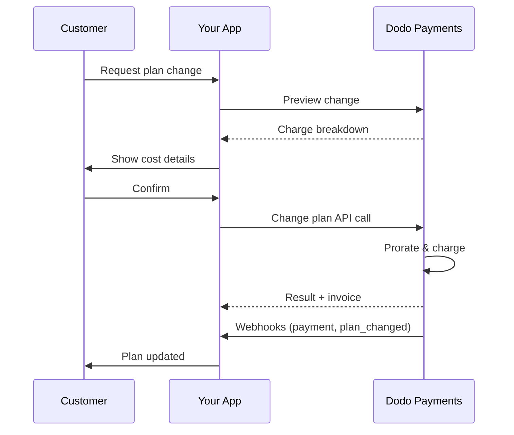
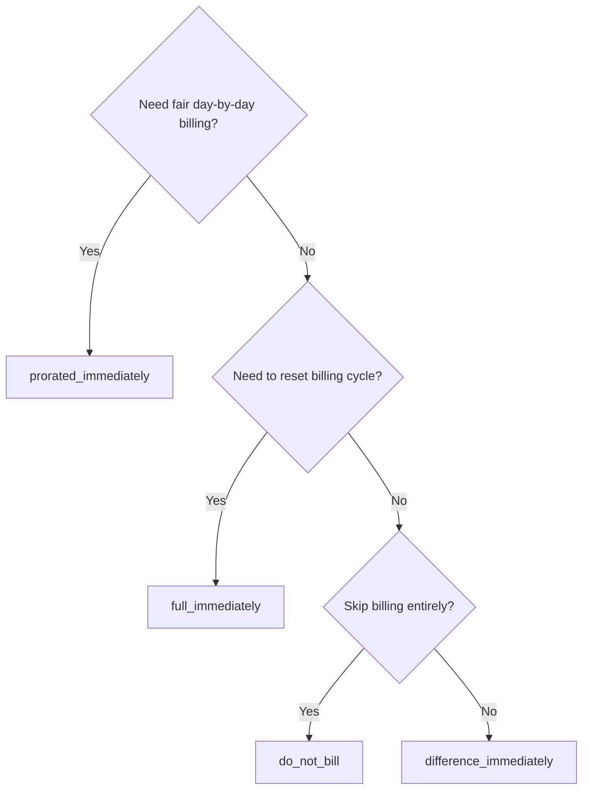
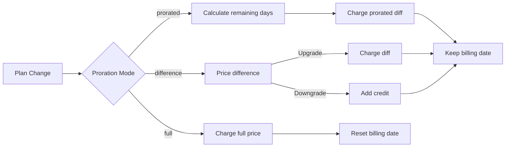

<CardGroup cols={3}>
<Card title="Change Plan API" icon="code" href="/api-reference/subscriptions/change-plan">
  Full API docs for updating subscriptions.
</Card>
<Card title="Plan Change Preview" icon="eye" href="/api-reference/subscriptions/preview-change-plan">
  See charge amounts before changing plans.
</Card>
<Card title="Integration Guide" icon="book" href="/developer-resources/subscription-integration-guide">
  Step-by-step subscription setup.
</Card>
</CardGroup>

## What is a subscription upgrade or downgrade?

Changing plans lets you move a customer between subscription tiers or quantities. Use it to:
- Align pricing with usage or features
- Move from monthly to annual (or vice versa)
- Adjust quantity for seat-based products

<Info>
Plan changes can trigger an immediate charge depending on the proration mode you choose.
</Info>

## When to use plan changes

- Upgrade when a customer needs more features, usage, or seats
- Downgrade when usage decreases
- Migrate users to a new product or price without cancelling their subscription

## Plan Change Flow



## Prerequisites

Before implementing subscription plan changes, ensure you have:

- A Dodo Payments merchant account with active subscription products
- API credentials (API key and webhook secret key) from the dashboard
- An existing active subscription to modify
- Webhook endpoint configured to handle subscription events

<Info>
For detailed setup instructions, see our [Integration Guide](/developer-resources/integration-guide#dashboard-setup).
</Info>

## Step-by-Step Implementation Guide

Follow this comprehensive guide to implement subscription plan changes in your application:

<Steps>
<Step title="Understand Plan Change Requirements">
Before implementing, determine:
- Which subscription products can be changed to which others
- What proration mode fits your business model
- How to handle failed plan changes gracefully
- Which webhook events to track for state management

<Tip>
Test plan changes thoroughly in test mode before implementing in production.
</Tip>
</Step>

<Step title="Choose Your Proration Strategy">
Select the billing approach that aligns with your business needs:

<Tabs>
<Tab title="prorated_immediately">
Best for: SaaS applications wanting to charge fairly for unused time
- Calculates exact prorated amount based on remaining cycle time
- Charges a prorated amount based on unused time remaining in the cycle
- Provides transparent billing to customers
</Tab>

<Tab title="difference_immediately">
Best for: Clear upgrade/downgrade scenarios
- Upgrade: Charge immediate difference (e.g., $30→$80 = charge $50)
- Downgrade: Credit remaining value for future renewals
- Simplifies billing logic and customer communication
</Tab>

<Tab title="full_immediately">
Best for: When you want to reset the billing cycle
- Charges full amount of new plan immediately
- Ignores remaining time from old plan
- Useful for annual to monthly transitions
</Tab>

<Tab title="do_not_bill">
Best for: Free migrations, courtesy switches, or absorbing cost differences
- No charges or credits calculated
- Customer moves to the new plan immediately without any billing adjustment
- Billing cycle remains unchanged
</Tab>
</Tabs>
</Step>

<Step title="Implement the Change Plan API">
Use the Change Plan API to modify subscription details:

<ParamField path="subscription_id" type="string" required>
The ID of the active subscription to modify.
</ParamField>

<ParamField path="product_id" type="string" required>
The new product ID to change the subscription to.
</ParamField>

<ParamField path="quantity" type="integer" default="1">
Number of units for the new plan (for seat-based products).
</ParamField>

<ParamField path="proration_billing_mode" type="string" required>
How to handle immediate billing: `prorated_immediately`, `full_immediately`, `difference_immediately`, or `do_not_bill`.
</ParamField>

<ParamField path="addons" type="array">
Optional addons for the new plan. Leaving this empty removes any existing addons.
</ParamField>

<ParamField path="on_payment_failure" type="string">
Controls behavior when the plan change payment fails:
- `prevent_change`: Keep subscription on current plan until payment succeeds
- `apply_change` (default): Apply plan change immediately regardless of payment outcome

If not specified, uses the business-level default setting.
</ParamField>

<ParamField path="discount_codes" type="array">
Mã giảm giá **chồng lên nhau** tùy chọn để áp dụng cho gói mới (tối đa 20, được áp dụng theo thứ tự mảng). Hành vi phụ thuộc vào những gì bạn chuyển:

- **Không cung cấp / `null`** — các giảm giá hiện có với `preserve_on_plan_change=true` được bảo lưu nếu áp dụng cho sản phẩm mới.
- **`[]` (mảng trống)** — xóa tất cả các giảm giá hiện có khỏi đăng ký.
- **`["CODE_A", "CODE_B", ...]`** — thay thế bất kỳ giảm giá hiện có nào bằng tập hợp chồng lên nhau này.
</ParamField>

<ParamField path="discount_code" type="string" deprecated>
**Không dùng** — ưu tiên `discount_codes` cho các tích hợp mới. Trường này vẫn hoạt động cho sự tương thích ngược, nhưng không thể kết hợp với `discount_codes` trong cùng một yêu cầu.
</ParamField>

<ParamField path="effective_at" type="string" default="immediately">
Khi nào áp dụng thay đổi gói:
- `immediately` (mặc định): Áp dụng thay đổi gói ngay lập tức
- `next_billing_date`: Lên lịch thay đổi cho ngày thanh toán tiếp theo. Khách hàng giữ lại gói hiện tại của họ cho đến khi kết thúc kỳ thanh toán.

Sử dụng `next_billing_date` cho việc hạ cấp để khách hàng giữ lại các lợi ích của gói hiện tại cho đến khi kỳ thanh toán kết thúc.
</ParamField>
</Step>

<Step title="Handle Webhook Events">
Thiết lập xử lý webhook để theo dõi kết quả thay đổi gói:

- `subscription.active`: Thay đổi gói thành công, đăng ký được cập nhật
- `subscription.plan_changed`: Kế hoạch đăng ký thay đổi (nâng cấp/hạ cấp/ cập nhật addon)
- `subscription.on_hold`: Phí thay đổi gói thất bại, đăng ký tạm dừng
- `payment.succeeded`: Phí ngay lập tức cho thay đổi gói thành công
- `payment.failed`: Phí ngay lập tức thất bại

<Warning>
Luôn xác minh chữ ký webhook và thực hiện xử lý sự kiện idempotent.
</Warning>
</Step>

<Step title="Update Your Application State">
Dựa trên sự kiện webhook, cập nhật ứng dụng của bạn:
- Cấp/phục hồi tính năng dựa trên gói mới
- Cập nhật bảng điều khiển khách hàng với chi tiết gói mới
- Gửi email xác nhận về thay đổi gói
- Ghi lại thay đổi thanh toán cho mục đích kiểm tra
</Step>

<Step title="Test and Monitor">
Kiểm tra kỹ lưỡng việc triển khai của bạn:
- Kiểm tra tất cả chế độ phân bổ với các kịch bản khác nhau
- Xác minh xử lý webhook hoạt động chính xác
- Giám sát tỷ lệ thành công thay đổi gói
- Thiết lập cảnh báo cho lỗi thay đổi gói

<Check>
Việc triển khai thay đổi kế hoạch đăng ký của bạn đã sẵn sàng cho việc sử dụng sản phẩm.
</Check>
</Step>
</Steps>

## Xem trước Thay đổi Gói

Trước khi cam kết thay đổi gói, sử dụng API Xem trước để hiển thị cho khách hàng chính xác số tiền họ sẽ phải trả:

<Tabs>
<Tab title="Node.js SDK">

```javascript
const preview = await client.subscriptions.previewChangePlan('sub_123', {
  product_id: 'prod_pro',
  quantity: 1,
  proration_billing_mode: 'prorated_immediately'
});

// Show customer the charge before confirming
console.log('Immediate charge:', preview.immediate_charge.summary);
console.log('New plan details:', preview.new_plan);
```

</Tab>

<Tab title="Python SDK">

```python
preview = client.subscriptions.preview_change_plan(
    subscription_id="sub_123",
    product_id="prod_pro",
    quantity=1,
    proration_billing_mode="prorated_immediately"
)

# Show customer the charge before confirming
print("Immediate charge:", preview.immediate_charge.summary)
print("New plan details:", preview.new_plan)
```

</Tab>
</Tabs>

<Tip>
Sử dụng API xem trước để xây dựng hộp thoại xác nhận hiển thị cho khách hàng số tiền chính xác họ sẽ phải trả trước khi họ xác nhận thay đổi gói.
</Tip>

## API Thay đổi Gói

Sử dụng API Thay đổi Gói để thay đổi sản phẩm, số lượng và hành vi phân bổ cho một đăng ký đang hoạt động.

### Ví dụ khởi đầu nhanh

<Tabs>
  <Tab title="Node.js SDK">

    ```javascript
    import DodoPayments from 'dodopayments';

    const client = new DodoPayments({
      bearerToken: process.env.DODO_PAYMENTS_API_KEY,
      environment: 'test_mode', // defaults to 'live_mode'
    });

    async function changePlan() {
      const result = await client.subscriptions.changePlan('sub_123', {
        product_id: 'prod_new',
        quantity: 3,
        proration_billing_mode: 'prorated_immediately',
        on_payment_failure: 'prevent_change', // Optional: control behavior on payment failure
      });
      console.log(result.status, result.invoice_id, result.payment_id);
    }

    changePlan();
    ```

  </Tab>
  <Tab title="Python SDK">

    ```python
    import os
    from dodopayments import DodoPayments

    client = DodoPayments(
        bearer_token=os.environ.get("DODO_PAYMENTS_API_KEY"),
        environment="test_mode",  # defaults to "live_mode"
    )

    result = client.subscriptions.change_plan(
        subscription_id="sub_123",
        product_id="prod_new",
        quantity=3,
        proration_billing_mode="prorated_immediately",
        on_payment_failure="prevent_change",  # Optional: control behavior on payment failure
    )
    print(result.status, result.get("invoice_id"), result.get("payment_id"))
    ```

  </Tab>
  <Tab title="Go SDK">

    ```go
    package main

    import (
      "context"
      "fmt"
      "github.com/dodopayments/dodopayments-go"
      "github.com/dodopayments/dodopayments-go/option"
    )

    func main() {
      client := dodopayments.NewClient(option.WithBearerToken("YOUR_TOKEN"))
      // ChangePlan returns no response body; a nil error means the change succeeded.
      err := client.Subscriptions.ChangePlan(context.TODO(), "sub_123", dodopayments.SubscriptionChangePlanParams{
        UpdateSubscriptionPlanReq: dodopayments.UpdateSubscriptionPlanReqParam{
          ProductID:            dodopayments.F("prod_new"),
          Quantity:             dodopayments.F(int64(3)),
          ProrationBillingMode: dodopayments.F(dodopayments.UpdateSubscriptionPlanReqProrationBillingModeProratedImmediately),
          OnPaymentFailure:     dodopayments.F(dodopayments.UpdateSubscriptionPlanReqOnPaymentFailurePreventChange), // Optional
        },
      })
      if err != nil { panic(err) }
      fmt.Println("Plan change applied")
    }
    ```

  </Tab>
  <Tab title="HTTP">

    ```bash
    curl -X POST "$DODO_API_BASE/subscriptions/sub_123/change-plan" \
      -H "Authorization: Bearer $DODO_PAYMENTS_API_KEY" \
      -H "Content-Type: application/json" \
      -d '{
        "product_id": "prod_new",
        "quantity": 3,
        "proration_billing_mode": "prorated_immediately",
        "on_payment_failure": "prevent_change"
      }'
    ```

  </Tab>
</Tabs>

```json Success
{
  "status": "processing",
  "subscription_id": "sub_123",
  "invoice_id": "inv_789",
  "payment_id": "pay_456",
  "proration_billing_mode": "prorated_immediately"
}
```

<Note>
Các trường như <code>invoice_id</code> và <code>payment_id</code> chỉ được trả về khi một khoản phí ngay lập tức và/hoặc hóa đơn được tạo ra trong quá trình thay đổi gói. Luôn dựa vào sự kiện webhook (vd., <code>payment.succeeded</code>, <code>subscription.plan_changed</code>) để xác nhận kết quả.
</Note>

<Warning>
Nếu phí ngay lập tức thất bại, đăng ký có thể chuyển đến `subscription.on_hold` cho đến khi thanh toán thành công.
</Warning>

## Quản lý Addons

Khi thay đổi kế hoạch đăng ký, bạn cũng có thể sửa đổi addons:

```javascript
// Add addons to the new plan
await client.subscriptions.changePlan('sub_123', {
  product_id: 'prod_new',
  quantity: 1,
  proration_billing_mode: 'difference_immediately',
  addons: [
    { addon_id: 'addon_123', quantity: 2 }
  ]
});

// Remove all existing addons
await client.subscriptions.changePlan('sub_123', {
  product_id: 'prod_new',
  quantity: 1,
  proration_billing_mode: 'difference_immediately',
  addons: [] // Empty array removes all existing addons
});
```

<Info>
Addons được bao gồm trong tính toán phân bổ và sẽ được tính phí theo chế độ phân bổ đã chọn.
</Info>

## Áp dụng Mã Giảm Giá

Bạn có thể áp dụng một hoặc nhiều **mã giảm giá chồng lên nhau** khi thay đổi đăng ký (tối đa 20, áp dụng theo thứ tự mảng). Điều này hữu ích cho việc cung cấp giá khuyến mại khi nâng cấp hoặc di cư.

<Tabs>
<Tab title="Node.js SDK">

```javascript
// Apply stacked discount codes during plan change
await client.subscriptions.changePlan('sub_123', {
  product_id: 'prod_pro',
  quantity: 1,
  proration_billing_mode: 'prorated_immediately',
  discount_codes: ['UPGRADE20']
});
```

</Tab>
<Tab title="Python SDK">

```python
# Apply stacked discount codes during plan change
client.subscriptions.change_plan(
    subscription_id="sub_123",
    product_id="prod_pro",
    quantity=1,
    proration_billing_mode="prorated_immediately",
    discount_codes=["UPGRADE20"]
)
```

</Tab>
<Tab title="HTTP">

```bash
curl -X POST "$DODO_API_BASE/subscriptions/sub_123/change-plan" \
  -H "Authorization: Bearer $DODO_PAYMENTS_API_KEY" \
  -H "Content-Type: application/json" \
  -d '{
    "product_id": "prod_pro",
    "quantity": 1,
    "proration_billing_mode": "prorated_immediately",
    "discount_codes": ["UPGRADE20"]
  }'
```

</Tab>
</Tabs>

### Hành vi giảm giá khi thay đổi gói

| `discount_codes` value | Hành vi |
|------------------------|----------|
| Không cung cấp / `null` | Các giảm giá hiện có với `preserve_on_plan_change=true` được tự động bảo lưu nếu áp dụng cho sản phẩm mới. |
| `[]` (mảng trống) | **Tất cả** các giảm giá hiện có sẽ bị xóa khỏi đăng ký. |
| `["CODE_A", "CODE_B", ...]` | Thay thế bất kỳ giảm giá hiện có nào bằng tập hợp chồng lên nhau này, được xác nhận và áp dụng theo thứ tự mảng. |

<Info>
Trường đơn `discount_code` trên đầu cuối này là **không dùng** nhưng vẫn hoạt động để tương thích ngược — các tích hợp hiện tại không cần thay đổi ngay lập tức. Nó không thể kết hợp với `discount_codes` trong cùng một yêu cầu. Di chuyển sang dạng mảng khi thuận tiện.
</Info>

<Tip>
Sử dụng [API Xem trước Thay đổi Gói](/api-reference/subscriptions/preview-change-plan) với `discount_codes` để hiển thị cho khách hàng chính xác số tiền họ sẽ tiết kiệm trước khi xác nhận thay đổi gói.
</Tip>

## Các chế độ phân bổ

Chọn cách tính phí cho khách hàng khi thay đổi gói:

#### `prorated_immediately`
- Tính phí cho sự khác biệt tương đương trong chu kỳ hiện tại
- Nếu trong giai đoạn thử nghiệm, tính phí ngay lập tức và chuyển sang gói mới ngay
- Hạ cấp: có thể tạo ra một khoản tín dụng phân bổ được áp dụng cho các gia hạn trong tương lai

#### `full_immediately`
- Tính phí toàn bộ số tiền của gói mới ngay lập tức
- Bỏ qua thời gian còn lại của gói cũ

<Info>
Các khoản tín dụng được tạo ra bằng cách hạ cấp sử dụng <code>difference_immediately</code> là phạm vi đăng ký và khác biệt với các quyền lợi <a href="/features/credit-based-billing">Tính phí Dựa trên Tín dụng</a>. Chúng tự động áp dụng cho các gia hạn trong tương lai của cùng một đăng ký và không thể chuyển nhượng giữa các đăng ký.
</Info>

#### `difference_immediately`
- Nâng cấp: tính ngay sự khác biệt về giá giữa các gói cũ và mới
- Hạ cấp: thêm giá trị còn lại làm tín dụng nội bộ cho đăng ký và tự động áp dụng khi gia hạn

#### `do_not_bill`
- Không tính phí hoặc tính toán tín dụng
- Khách hàng chuyển sang gói mới ngay lập tức mà không có bất kỳ điều chỉnh thanh toán nào
- Chu kỳ thanh toán không thay đổi
- Tốt nhất cho chuyển đổi ân huệ, chuyển đổi gói miễn phí hoặc hấp thụ sự khác biệt chi phí

| Tính năng | `prorated_immediately` | `difference_immediately` | `full_immediately` | `do_not_bill` |
|---------|----------------------|------------------------|-------------------|--------------|
| **Phí nâng cấp** | Khác biệt theo thời gian đã sử dụng | Sự khác biệt toàn bộ giá giữa các gói | Toàn bộ giá của gói mới | Không phí |
| **Tín dụng hạ cấp** | Tín dụng theo thời gian còn lại | Sự khác biệt toàn bộ giá như tín dụng | Không tín dụng | Không tín dụng |
| **Chu kỳ thanh toán** | Không thay đổi | Không thay đổi | Khởi động lại từ hôm nay | Không thay đổi |
| **Hành vi thử nghiệm** | Kết thúc thử nghiệm, tính phí ngay | Kết thúc thử nghiệm, tính phí ngay | Kết thúc thử nghiệm, tính phí toàn bộ | Kết thúc thử nghiệm, không tính phí |
| **Tốt nhất cho** | Tính phí công bằng theo thời gian | Toán học nâng cấp/hạ cấp đơn giản | Khởi động lại các chu kỳ thanh toán | Chuyển đổi miễn phí hoặc ân huệ |
| **Độ phức tạp** | Trung bình (tính toán ngày) | Thấp (trừ đơn giản) | Thấp (tính phí toàn bộ) | Không có |



### Các kịch bản ví dụ

Sử dụng những con số chuẩn này một cách nhất quán:
- Gói hiện tại: **Cơ bản** với **$30/tháng**
- Mục tiêu nâng cấp: **Pro** với **$80/tháng**
- Mục tiêu hạ cấp (từ Pro): **Khởi đầu** với **$20/tháng**
- Chu kỳ thanh toán: **30 ngày**, bắt đầu từ **1 tháng 1**
- Thay đổi kế hoạch xảy ra vào **16 tháng 1** (còn 15 ngày, đã sử dụng 15 ngày)

<AccordionGroup>
  <Accordion title="Upgrade: Basic ($30) → Pro ($80) with prorated_immediately">

    ```
    Step 1: Calculate unused credit from current plan
      Unused days = 15 out of 30 days
      Credit = $30 × (15/30) = $15.00

    Step 2: Calculate prorated cost of new plan
      Remaining days = 15 out of 30 days
      New plan cost = $80 × (15/30) = $40.00

    Step 3: Calculate immediate charge
      Charge = New plan cost − Credit
      Charge = $40.00 − $15.00 = $25.00

    → Customer pays $25.00 now
    → Next renewal (Feb 1): $80.00/month
    ```

    ```javascript
    await client.subscriptions.changePlan('sub_123', {
      product_id: 'prod_pro',
      quantity: 1,
      proration_billing_mode: 'prorated_immediately'
    })
    ```

  </Accordion>

  <Accordion title="Downgrade: Pro ($80) → Starter ($20) with prorated_immediately">

    ```
    Step 1: Calculate unused credit from current plan
      Unused days = 15 out of 30 days
      Credit = $80 × (15/30) = $40.00

    Step 2: Calculate prorated cost of new plan
      Remaining days = 15 out of 30 days
      New plan cost = $20 × (15/30) = $10.00

    Step 3: Calculate credit balance
      Credit = $40.00 − $10.00 = $30.00

    → No charge — $30.00 credit added to subscription
    → Credit auto-applies to future renewals
    → Next renewal (Feb 1): $20.00 − $30.00 credit = $0.00
    → Following renewal (Mar 1): $20.00 − $10.00 remaining credit = $10.00
    ```

    ```javascript
    await client.subscriptions.changePlan('sub_123', {
      product_id: 'prod_starter',
      quantity: 1,
      proration_billing_mode: 'prorated_immediately'
    })
    ```

  </Accordion>

  <Accordion title="Upgrade: Basic ($30) → Pro ($80) with difference_immediately">

    ```
    Immediate charge = New plan price − Old plan price
                     = $80 − $30
                     = $50.00

    → Customer pays $50.00 now (regardless of cycle position)
    → Next renewal (Feb 1): $80.00/month
    ```

    ```javascript
    await client.subscriptions.changePlan('sub_123', {
      product_id: 'prod_pro',
      quantity: 1,
      proration_billing_mode: 'difference_immediately'
    })
    ```

  </Accordion>

  <Accordion title="Downgrade: Pro ($80) → Starter ($20) with difference_immediately">

    ```
    Credit = Old plan price − New plan price
           = $80 − $20
           = $60.00

    → No charge — $60.00 credit added to subscription
    → Credit auto-applies to future renewals
    → Next renewal: $20.00 − $20.00 (from credit) = $0.00
    → Following renewal: $20.00 − $20.00 (from credit) = $0.00
    → Third renewal: $20.00 − $20.00 (from remaining credit) = $0.00
    ```

    ```javascript
    await client.subscriptions.changePlan('sub_123', {
      product_id: 'prod_starter',
      quantity: 1,
      proration_billing_mode: 'difference_immediately'
    })
    ```

  </Accordion>

  <Accordion title="Upgrade: Basic ($30) → Pro ($80) with full_immediately">

    ```
    Immediate charge = Full new plan price = $80.00

    → Customer pays $80.00 now
    → No credit for unused time on old plan
    → Billing cycle resets to today (January 16)
    → Next renewal: February 16 at $80.00/month
    ```

    ```javascript
    await client.subscriptions.changePlan('sub_123', {
      product_id: 'prod_pro',
      quantity: 1,
      proration_billing_mode: 'full_immediately'
    })
    ```

  </Accordion>

  <Accordion title="Mid-cycle upgrade with add-ons using prorated_immediately">

    ```
    Current: Basic plan ($30/month), no add-ons
    New: Pro plan ($80/month) + Extra Seats add-on ($10/seat × 3 seats = $30/month)
    Change on day 16 of 30 (15 days remaining)

    Step 1: Credit from current plan
      Credit = $30 × (15/30) = $15.00

    Step 2: Prorated cost of new plan + add-ons
      New plan = $80 × (15/30) = $40.00
      Add-ons = $30 × (15/30) = $15.00
      Total new = $55.00

    Step 3: Immediate charge
      Charge = $55.00 − $15.00 = $40.00

    → Customer pays $40.00 now
    → Next renewal: $80.00 + $30.00 = $110.00/month
    ```

    ```javascript
    await client.subscriptions.changePlan('sub_123', {
      product_id: 'prod_pro',
      quantity: 1,
      proration_billing_mode: 'prorated_immediately',
      addons: [
        { addon_id: 'addon_seats', quantity: 3 }
      ]
    })
    ```

  </Accordion>
</AccordionGroup>

### Cách mỗi chế độ xử lý việc thanh toán



<Tip>
Chọn `prorated_immediately` cho kế toán công bằng theo thời gian; chọn `full_immediately` để khởi động lại thanh toán; sử dụng `difference_immediately` cho nâng cấp đơn giản và tự động tín dụng khi hạ cấp; hoặc sử dụng `do_not_bill` để chuyển đổi gói mà không có bất kỳ điều chỉnh thanh toán nào.
</Tip>

## Xử lý lỗi Thanh toán

Kiểm soát điều gì xảy ra khi thanh toán cho thay đổi gói thất bại bằng cách sử dụng tham số `on_payment_failure`.

### Chế độ Lỗi Thanh toán

<Tabs>
<Tab title="prevent_change (Recommended for critical upgrades)">
**Hành vi**: Giữ đăng ký trên gói hiện tại của nó cho đến khi thanh toán thành công.

- Thay đổi gói được đánh dấu là "đang chờ xử lý"
- Khách hàng giữ quyền truy cập vào gói hiện tại của họ
- Đăng ký chuyển sang trạng thái `active` chỉ sau khi thanh toán thành công
- Hữu ích khi bạn muốn đảm bảo thanh toán trước khi cung cấp các tính năng nâng cấp

```javascript
await client.subscriptions.changePlan('sub_123', {
  product_id: 'prod_pro',
  quantity: 1,
  proration_billing_mode: 'prorated_immediately',
  on_payment_failure: 'prevent_change'
});
```

</Tab>

<Tab title="apply_change (Default)">
**Hành vi**: Áp dụng thay đổi gói ngay lập tức bất kể kết quả thanh toán.

- Thay đổi gói được áp dụng ngay cả khi thanh toán thất bại
- Khách hàng nhận được quyền truy cập ngay lập tức vào gói mới
- Đăng ký có thể chuyển sang `on_hold` nếu thanh toán thất bại
- Tốt cho nâng cấp không quan trọng hoặc khi bạn tin tưởng khách hàng

```javascript
await client.subscriptions.changePlan('sub_123', {
  product_id: 'prod_pro',
  quantity: 1,
  proration_billing_mode: 'prorated_immediately',
  on_payment_failure: 'apply_change' // This is the default
});
```

</Tab>
</Tabs>

<Info>
Nếu không được chỉ định, tham số `on_payment_failure` sử dụng cài đặt mặc định cấp doanh nghiệp của bạn được cấu hình trong bảng điều khiển.
</Info>

### Khi nào sử dụng mỗi chế độ

| Kịch bản | Chế độ được Khuyến nghị | Lý do |
|----------|------------------|--------|
| Nâng cấp lên các tính năng cao cấp | `prevent_change` | Đảm bảo thanh toán trước khi cung cấp quyền truy cập |
| Tăng số lượng (nhiều chỗ) | `prevent_change` | Ngăn chặn việc sử dụng mà không có thanh toán |
| Hạ cấp kế hoạch | `apply_change` | Khách hàng đang giảm tiêu dùng |
| Khách hàng doanh nghiệp đáng tin cậy | `apply_change` | Rủi ro thấp không thanh toán |
| Chuyển đổi thử nghiệm sang thanh toán | `prevent_change` | Khoảnh khắc thanh toán quan trọng |

## Xử lý webhooks

Theo dõi trạng thái đăng ký thông qua webhooks để xác nhận thay đổi gói và thanh toán.

### Các loại sự kiện cần xử lý
- `subscription.active`: đăng ký được kích hoạt
- `subscription.plan_changed`: gói đăng ký thay đổi (nâng cấp/hạ cấp/thay đổi addon)
- `subscription.on_hold`: phí thất bại, đăng ký tạm dừng
- `subscription.renewed`: gia hạn thành công
- `payment.succeeded`: thanh toán cho thay đổi gói hoặc gia hạn thành công
- `payment.failed`: thanh toán thất bại

<Info>
Chúng tôi khuyến nghị điều khiển logic kinh doanh từ các sự kiện đăng ký và sử dụng các sự kiện thanh toán để xác nhận và đối chiếu.
</Info>

### Xác minh chữ ký và xử lý ý định

<Tabs>
  <Tab title="Next.js Route Handler">

    ```javascript
    import { NextRequest, NextResponse } from 'next/server';
    
    export async function POST(req) {
      const webhookId = req.headers.get('webhook-id');
      const webhookSignature = req.headers.get('webhook-signature');
      const webhookTimestamp = req.headers.get('webhook-timestamp');
      const secret = process.env.DODO_WEBHOOK_SECRET;
    
      const payload = await req.text();
      // verifySignature is a placeholder – in production, use a Standard Webhooks library
      const { valid, event } = await verifySignature(
        payload,
        { id: webhookId, signature: webhookSignature, timestamp: webhookTimestamp },
        secret
      );
      if (!valid) return NextResponse.json({ error: 'Invalid signature' }, { status: 400 });
    
      switch (event.type) {
        case 'subscription.active':
          // mark subscription active in your DB
          break;
        case 'subscription.plan_changed':
          // refresh entitlements and reflect the new plan in your UI
          break;
        case 'subscription.on_hold':
          // notify user to update payment method
          break;
        case 'subscription.renewed':
          // extend access window
          break;
        case 'payment.succeeded':
          // reconcile payment for plan change
          break;
        case 'payment.failed':
          // log and alert
          break;
        default:
          // ignore unknown events
          break;
      }
    
      return NextResponse.json({ received: true });
    }
    ```

  </Tab>
  <Tab title="Express.js">

    ```javascript
    import express from 'express';
    
    const app = express();
    app.post('/webhooks/dodo', express.raw({ type: 'application/json' }), async (req, res) => {
      const webhookId = req.header('webhook-id');
      const webhookSignature = req.header('webhook-signature');
      const webhookTimestamp = req.header('webhook-timestamp');
      const secret = process.env.DODO_WEBHOOK_SECRET;
      const payload = req.body.toString('utf8');
    
      const { valid, event } = await verifySignature(
        payload,
        { id: webhookId, signature: webhookSignature, timestamp: webhookTimestamp },
        secret
      );
      if (!valid) return res.status(400).send('Invalid signature');
    
      // handle events like above
      res.json({ received: true });
    });
    
    app.listen(3000);
    ```

  </Tab>
</Tabs>

<Note>
Để xem chi tiết cấu trúc tải trọng, xem <a href="/developer-resources/webhooks/intents/subscription">Tải trọng webhook Đăng ký</a> và <a href="/developer-resources/webhooks/intents/payment">Tải trọng webhook Thanh toán</a>.
</Note>

## Thực hành Tốt nhất

Tuân thủ các khuyến nghị này để thay đổi gói đăng ký đáng tin cậy:

### Chiến lược Thay đổi Gói
- **Kiểm tra kỹ lưỡng**: Luôn kiểm tra thay đổi gói trong chế độ thử nghiệm trước sản xuất
- **Chọn phân bổ cẩn thận**: Chọn chế độ phân bổ phù hợp với mô hình kinh doanh của bạn
- **Xử lý lỗi một cách tinh tế**: Triển khai xử lý lỗi và logic thử lại thích hợp
- **Giám sát tỷ lệ thành công**: Theo dõi tỷ lệ thành công/thất bại của thay đổi gói và điều tra các vấn đề

### Triển khai Webhook
- **Xác minh chữ ký**: Luôn xác thực chữ ký webhook để đảm bảo tính xác thực
- **Thực hiện idempotency**: Xử lý các sự kiện webhook trùng lặp một cách tinh tế
- **Xử lý không đồng bộ**: Không chặn các phản hồi webhook với các hoạt động nặng
- **Ghi lại mọi thứ**: Duy trì nhật ký chi tiết để gỡ lỗi và kiểm tra

### Trải nghiệm người dùng
- **Thông báo rõ ràng**: Thông báo cho khách hàng về thay đổi thanh toán và thời gian
- **Cung cấp xác nhận**: Gửi email xác nhận cho các thay đổi gói thành công
- **Xử lý các trường hợp đặc biệt**: Xem xét các kỳ thử nghiệm, phân bổ, và thanh toán thất bại
- **Cập nhật giao diện người dùng ngay lập tức**: Phản ánh các thay đổi gói trong giao diện ứng dụng của bạn

## Vấn đề Thông thường và Giải pháp

Giải quyết các vấn đề thường gặp khi thay đổi kế hoạch đăng ký:

<AccordionGroup>
<Accordion title="Charge created but subscription not updated">
**Triệu chứng**: Cuộc gọi API thành công nhưng đăng ký vẫn ở gói cũ

**Nguyên nhân thường gặp**:
- Xử lý webhook thất bại hoặc bị trì hoãn
- Trạng thái ứng dụng không được cập nhật sau khi nhận webhook
- Vấn đề giao dịch cơ sở dữ liệu khi cập nhật trạng thái

**Giải pháp**:
- Triển khai xử lý webhook mạnh mẽ với logic thử lại
- Sử dụng các hoạt động idempotent để cập nhật trạng thái
- Thêm giám sát để phát hiện và cảnh báo về sự kiện webhook bị bỏ lỡ
- Xác minh endpoint webhook có thể truy cập và phản hồi đúng cách
</Accordion>

<Accordion title="Credits not applied after downgrade">
**Triệu chứng**: Khách hàng hạ cấp nhưng không thấy số dư tín dụng

**Nguyên nhân thường gặp**:
- Kỳ vọng chế độ phân bổ: hạ cấp tín dụng sự khác biệt giá toàn bộ với `difference_immediately`, trong khi `prorated_immediately` tạo tín dụng phân bổ dựa trên thời gian còn lại trong chu kỳ
- Tín dụng cụ thể cho đăng ký và không chuyển nhượng giữa các đăng ký
- Số dư tín dụng không hiển thị trong bảng điều khiển khách hàng

**Giải pháp**:
- Sử dụng `difference_immediately` cho các hạ cấp khi bạn muốn tự động tín dụng
- Giải thích cho khách hàng rằng các khoản tín dụng áp dụng cho các gia hạn trong tương lai của cùng một đăng ký
- Triển khai cổng thông tin khách hàng để hiển thị số dư tín dụng
- Kiểm tra xem trước hóa đơn tiếp theo để thấy các tín dụng đã áp dụng
</Accordion>

<Accordion title="Webhook signature verification fails">
**Triệu chứng**: Sự kiện webhook bị từ chối do chữ ký không hợp lệ

**Nguyên nhân thường gặp**:
- Key bí mật webhook không chính xác
- Dữ liệu yêu cầu thô bị thay đổi trước khi xác minh chữ ký
- Sai thuật toán xác minh chữ ký

**Giải pháp**:
- Xác minh bạn đang sử dụng đúng `DODO_WEBHOOK_SECRET` từ bảng điều khiển
- Đọc dữ liệu yêu cầu thô trước bất kỳ middleware phân giải JSON nào
- Sử dụng thư viện xác minh webhook tiêu chuẩn cho nền tảng của bạn
- Kiểm tra xác minh chữ ký webhook trong môi trường phát triển
</Accordion>

<Accordion title="Plan change fails with 422 error">
**Triệu chứng**: API trả về lỗi 422 Đối tượng không thể xử lý

**Nguyên nhân thường gặp**:
- ID đăng ký hoặc ID sản phẩm không hợp lệ
- Đăng ký không ở trạng thái hoạt động
- Thiếu các tham số cần thiết
- Sản phẩm không có sẵn để thay đổi kế hoạch

**Giải pháp**:
- Xác minh đăng ký tồn tại và đang hoạt động
- Kiểm tra ID sản phẩm hợp lệ và có sẵn
- Đảm bảo tất cả tham số cần thiết được cung cấp
- Xem lại tài liệu API để biết các yêu cầu về tham số
</Accordion>

<Accordion title="Immediate charge fails during plan change">
**Triệu chứng**: Khởi tạo thay đổi gói nhưng phí ngay lập tức thất bại

**Nguyên nhân thường gặp**:
- Không đủ tiền trên phương thức thanh toán của khách hàng
- Phương thức thanh toán đã hết hạn hoặc không hợp lệ
- Ngân hàng từ chối giao dịch
- Phát hiện gian lận đã chặn khoản phí

**Giải pháp**:
- Xử lý các sự kiện webhook `payment.failed` một cách thích hợp
- Thông báo khách hàng để cập nhật phương thức thanh toán
- Triển khai logic thử lại cho các lỗi tạm thời
- Xem xét cho phép thay đổi gói với các khoản phí ngay lập tức thất bại
</Accordion>

<Accordion title="Subscription on hold after plan change">
**Triệu chứng**: Phí thay đổi gói thất bại và đăng ký chuyển sang trạng thái `on_hold`

**Điều gì xảy ra**:
Khi phí thay đổi gói thất bại, đăng ký sẽ tự động được đặt ở trạng thái `on_hold`. Đăng ký sẽ không được gia hạn tự động cho đến khi phương thức thanh toán được cập nhật.

**Giải pháp**: Cập nhật phương thức thanh toán để tái kích hoạt đăng ký

Để tái kích hoạt đăng ký từ trạng thái `on_hold` sau khi thay đổi gói thất bại:
1. **Cập nhật phương thức thanh toán** sử dụng API Cập nhật Phương thức Thanh toán
2. **Tạo khoản phí tự động**: API tự động tạo khoản phí cho các khoản còn nợ
3. **Tạo hóa đơn**: Hóa đơn được tạo cho khoản phí
4. **Xử lý thanh toán**: Thanh toán được xử lý bằng phương thức thanh toán mới
5. **Tái kích hoạt**: Khi thanh toán thành công, đăng ký được tái kích hoạt về trạng thái `active`

<CodeGroup>

```javascript Node.js
// Reactivate subscription from on_hold after failed plan change
async function reactivateAfterFailedPlanChange(subscriptionId) {
  // Update payment method - automatically creates charge for remaining dues
  const response = await client.subscriptions.updatePaymentMethod(subscriptionId, {
    type: 'new',
    return_url: 'https://example.com/return'
  });
  
  if (response.payment_id) {
    console.log('Charge created for remaining dues:', response.payment_id);
    console.log('Payment link:', response.payment_link);
    
    // Redirect customer to payment_link to complete payment
    // Monitor webhooks for:
    // 1. payment.succeeded - charge succeeded
    // 2. subscription.active - subscription reactivated
  }
  
  return response;
}

// Or use existing payment method if available
async function reactivateWithExistingPaymentMethod(subscriptionId, paymentMethodId) {
  const response = await client.subscriptions.updatePaymentMethod(subscriptionId, {
    type: 'existing',
    payment_method_id: paymentMethodId
  });
  
  // Monitor webhooks for payment.succeeded and subscription.active
  return response;
}
```

```python Python
# Reactivate subscription from on_hold after failed plan change
def reactivate_after_failed_plan_change(subscription_id):
    # Update payment method - automatically creates charge for remaining dues
    response = client.subscriptions.update_payment_method(
        subscription_id=subscription_id,
        type="new",
        return_url="https://example.com/return"
    )
    
    if response.payment_id:
        print("Charge created for remaining dues:", response.payment_id)
        print("Payment link:", response.payment_link)
        
        # Redirect customer to payment_link to complete payment
        # Monitor webhooks for:
        # 1. payment.succeeded - charge succeeded
        # 2. subscription.active - subscription reactivated
    
    return response

# Or use existing payment method if available
def reactivate_with_existing_payment_method(subscription_id, payment_method_id):
    response = client.subscriptions.update_payment_method(
        subscription_id=subscription_id,
        type="existing",
        payment_method_id=payment_method_id
    )
    
    # Monitor webhooks for payment.succeeded and subscription.active
    return response
```

</CodeGroup>

**Sự kiện webhook để giám sát**:
- `subscription.on_hold`: Đăng ký bị tạm ngưng (nhận được khi phí thay đổi gói thất bại)
- `payment.succeeded`: Thanh toán cho các khoản còn lại thành công (sau khi cập nhật phương thức thanh toán)
- `subscription.active`: Đăng ký được tái kích hoạt sau khi thanh toán thành công

**Thực hành tốt nhất**:
2
- Thông báo ngay lập tức cho khách hàng khi phí thay đổi gói thất bại
- Cung cấp hướng dẫn rõ ràng về cách cập nhật phương thức thanh toán
- Giám sát sự kiện webhook để theo dõi trạng thái tái kích hoạt
- Xem xét triển khai logic thử lại tự động cho các lỗi thanh toán tạm thời
<Card title="Update Payment Method API Reference" icon="code" href="/api-reference/subscriptions/update-payment-method">
Xem toàn bộ tài liệu API để cập nhật phương thức thanh toán và tái kích hoạt đăng ký.
</Card>
</Accordion>
</AccordionGroup>

## Kiểm tra Triển khai của Bạn

Thực hiện các bước sau để kiểm tra kỹ lưỡng việc triển khai thay đổi kế hoạch đăng ký của bạn:

<Steps>
<Step title="Set up test environment">
- Sử dụng khóa API kiểm tra và sản phẩm kiểm tra
- Tạo đăng ký kiểm tra với các loại gói khác nhau
- Cấu hình endpoint webhook kiểm tra
- Thiết lập giám sát và ghi nhật ký
</Step>

<Step title="Test different proration modes">
- Kiểm tra `prorated_immediately` với các vị trí chu kỳ thanh toán khác nhau
- Kiểm tra `difference_immediately` cho nâng cấp và hạ cấp
- Kiểm tra `full_immediately` để khởi động lại chu kỳ thanh toán
- Kiểm tra `do_not_bill` cho chuyển đổi gói không tính phí/không tín dụng
- Xác minh tính toán tín dụng là chính xác
</Step>

<Step title="Test webhook handling">
- Xác minh tất cả các sự kiện webhook liên quan được nhận
- Kiểm tra xác minh chữ ký webhook
- Xử lý các sự kiện webhook trùng lặp một cách tinh tế
- Kiểm tra các kịch bản thất bại xử lý webhook
</Step>

<Step title="Test error scenarios">
- Kiểm tra với các ID đăng ký không hợp lệ
- Kiểm tra với phương thức thanh toán hết hạn
- Kiểm tra các lỗi mạng và hết thời gian
- Kiểm tra với tiền không đủ
</Step>

<Step title="Monitor in production">
- Thiết lập cảnh báo cho các lỗi thay đổi gói thất bại
- Giám sát thời gian xử lý webhook
- Theo dõi tỷ lệ thành công thay đổi gói
- Xem lại các yêu cầu hỗ trợ khách hàng cho các vấn đề thay đổi gói
</Step>
</Steps>

## Xử lý lỗi

Xử lý các lỗi API phổ biến một cách tinh tế trong triển khai của bạn:

### Mã Trạng thái HTTP

<AccordionGroup>
<Accordion title="200 OK">
Yêu cầu thay đổi kế hoạch đã được xử lý thành công. Đăng ký đang được cập nhật và xử lý thanh toán đã bắt đầu.
</Accordion>

<Accordion title="400 Bad Request">
Các thông số yêu cầu không hợp lệ. Kiểm tra rằng tất cả các trường cần thiết được cung cấp và định dạng đúng.
</Accordion>

<Accordion title="401 Unauthorized">
API key không hợp lệ hoặc thiếu. Xác minh `DODO_PAYMENTS_API_KEY` của bạn là chính xác và có quyền phù hợp.
</Accordion>

<Accordion title="404 Not Found">
ID đăng ký không được tìm thấy hoặc không thuộc về tài khoản của bạn.
</Accordion>

<Accordion title="422 Unprocessable Entity">
Đăng ký không thể thay đổi (ví dụ: đã hủy, sản phẩm không có sẵn, v.v.).
</Accordion>

<Accordion title="500 Internal Server Error">
Có lỗi máy chủ xảy ra. Thử lại yêu cầu sau một thời gian ngắn.
</Accordion>
</AccordionGroup>

### Định dạng Phản hồi Lỗi

```json
{
  "error": {
    "code": "subscription_not_found",
    "message": "The subscription with ID 'sub_123' was not found",
    "details": {
      "subscription_id": "sub_123"
    }
  }
}
```

## Bước tiếp theo

- Xem lại <a href="/api-reference/subscriptions/change-plan">API Thay đổi Gói</a>
- Khám phá <a href="/features/credit-based-billing">Tính phí Dựa trên Tín dụng</a>
- Triển khai cảnh báo cho `subscription.on_hold`
- Xem hướng dẫn <a href="/developer-resources/webhooks">Tích hợp Webhook</a>

## Next steps

- Review the <a href="/api-reference/subscriptions/change-plan">Change Plan API</a>
- Explore <a href="/features/credit-based-billing">Credit-Based Billing</a>
- Implement alerts for `subscription.on_hold`
- Check out our <a href="/developer-resources/webhooks">Webhook Integration Guide</a>

<AccordionGroup>
<Accordion title="200 OK">
Yêu cầu thay đổi gói đã được xử lý thành công. Đăng ký đang được cập nhật và quá trình xử lý thanh toán đã bắt đầu.
</Accordion>

<Accordion title="400 Bad Request">
Tham số yêu cầu không hợp lệ. Kiểm tra xem tất cả các trường bắt buộc đã được cung cấp và định dạng đúng chưa.
</Accordion>

<Accordion title="401 Unauthorized">
API key không hợp lệ hoặc bị thiếu. Xác minh xem `DODO_PAYMENTS_API_KEY` của bạn có chính xác và có đủ quyền không.
</Accordion>

<Accordion title="404 Not Found">
Không tìm thấy ID đăng ký hoặc không thuộc tài khoản của bạn.
</Accordion>

<Accordion title="422 Unprocessable Entity">
Không thể thay đổi đăng ký (vd: đã hủy, sản phẩm không có sẵn, v.v.).
</Accordion>

<Accordion title="500 Internal Server Error">
Đã xảy ra lỗi máy chủ. Thử lại yêu cầu sau một thời gian ngắn.
</Accordion>
</AccordionGroup>

### Định dạng Phản hồi Lỗi

```json
{
  "error": {
    "code": "subscription_not_found",
    "message": "The subscription with ID 'sub_123' was not found",
    "details": {
      "subscription_id": "sub_123"
    }
  }
}
```

## Các bước tiếp theo

- Xem xét <a href="/api-reference/subscriptions/change-plan">Change Plan API</a>
- Khám phá <a href="/features/credit-based-billing">Credit-Based Billing</a>
- Triển khai cảnh báo cho `subscription.on_hold`
- Xem hướng dẫn <a href="/developer-resources/webhooks">Webhook Integration Guide</a>
