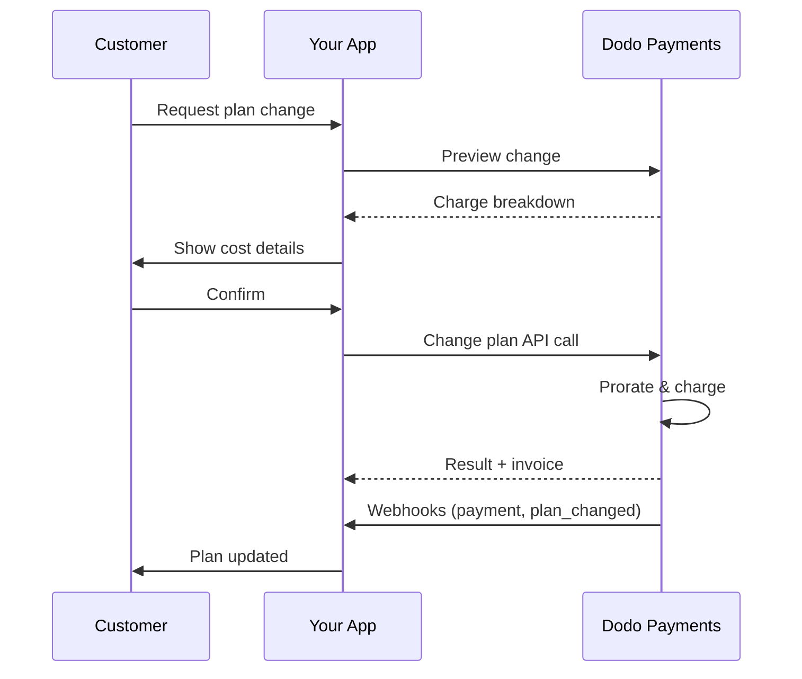
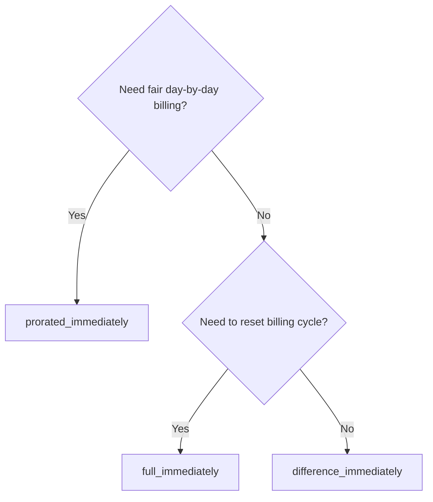
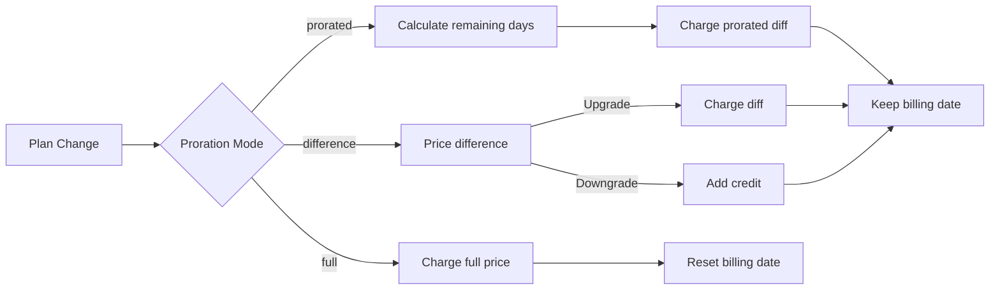

<CardGroup cols={3}>
<Card title="Change Plan API" icon="code" href="/api-reference/subscriptions/change-plan">
  Full API docs for updating subscriptions.
</Card>
<Card title="Plan Change Preview" icon="eye" href="/api-reference/subscriptions/preview-change-plan">
  See charge amounts before changing plans.
</Card>
<Card title="Integration Guide" icon="book" href="/developer-resources/subscription-integration-guide">
  Step-by-step subscription setup.
</Card>
</CardGroup>

## What is a subscription upgrade or downgrade?

Changing plans lets you move a customer between subscription tiers or quantities. Use it to:
- Align pricing with usage or features
- Move from monthly to annual (or vice versa)
- Adjust quantity for seat-based products

<Info>
Plan changes can trigger an immediate charge depending on the proration mode you choose.
</Info>

## When to use plan changes

- Upgrade when a customer needs more features, usage, or seats
- Downgrade when usage decreases
- Migrate users to a new product or price without cancelling their subscription

## Plan Change Flow



## Prerequisites

Before implementing subscription plan changes, ensure you have:

- A Dodo Payments merchant account with active subscription products
- API credentials (API key and webhook secret key) from the dashboard
- An existing active subscription to modify
- Webhook endpoint configured to handle subscription events

<Info>
For detailed setup instructions, see our [Integration Guide](/developer-resources/integration-guide#dashboard-setup).
</Info>

## Step-by-Step Implementation Guide

Follow this comprehensive guide to implement subscription plan changes in your application:

<Steps>
<Step title="Understand Plan Change Requirements">
Before implementing, determine:
- Which subscription products can be changed to which others
- What proration mode fits your business model
- How to handle failed plan changes gracefully
- Which webhook events to track for state management

<Tip>
Test plan changes thoroughly in test mode before implementing in production.
</Tip>
</Step>

<Step title="Choose Your Proration Strategy">
Select the billing approach that aligns with your business needs:

<Tabs>
<Tab title="prorated_immediately">
Best for: SaaS applications wanting to charge fairly for unused time
- Calculates exact prorated amount based on remaining cycle time
- Charges a prorated amount based on unused time remaining in the cycle
- Provides transparent billing to customers
</Tab>

<Tab title="difference_immediately">
Best for: Clear upgrade/downgrade scenarios
- Upgrade: Charge immediate difference (e.g., $30→$80 = charge $50)
- Downgrade: Credit remaining value for future renewals
- Simplifies billing logic and customer communication
</Tab>

<Tab title="full_immediately">
Best for: When you want to reset the billing cycle
- Charges full amount of new plan immediately
- Ignores remaining time from old plan
- Useful for annual to monthly transitions
</Tab>
</Tabs>
</Step>

<Step title="Implement the Change Plan API">
Use the Change Plan API to modify subscription details:

<ParamField path="subscription_id" type="string" required>
The ID of the active subscription to modify.
</ParamField>

<ParamField path="product_id" type="string" required>
The new product ID to change the subscription to.
</ParamField>

<ParamField path="quantity" type="integer" default="1">
Number of units for the new plan (for seat-based products).
</ParamField>

<ParamField path="proration_billing_mode" type="string" required>
How to handle immediate billing: `prorated_immediately`, `full_immediately`, or `difference_immediately`.
</ParamField>

<ParamField path="addons" type="array">
Optional addons for the new plan. Leaving this empty removes any existing addons.
</ParamField>

<ParamField path="on_payment_failure" type="string">
Controls behavior when the plan change payment fails:
- `prevent_change`: Keep subscription on current plan until payment succeeds
- `apply_change` (default): Apply plan change immediately regardless of payment outcome

Nếu không được chỉ định, sử dụng cài đặt mặc định ở mức doanh nghiệp.
</ParamField>

<ParamField path="discount_code" type="string">
Mã giảm giá tùy chọn để áp dụng cho kế hoạch mới. Nếu được cung cấp, xác minh và áp dụng giảm giá cho thay đổi kế hoạch. Nếu không được cung cấp và đăng ký có giảm giá hiện có với `preserve_on_plan_change=true`, giảm giá hiện có sẽ được giữ lại (nếu áp dụng cho sản phẩm mới).
</ParamField>
</Step>

<Step title="Handle Webhook Events">
Thiết lập xử lý webhook để theo dõi kết quả thay đổi kế hoạch:

- `subscription.active`: Thay đổi kế hoạch thành công, đăng ký đã cập nhật
- `subscription.plan_changed`: Kế hoạch đăng ký thay đổi (nâng cấp/hạ cấp/cập nhật addon)
- `subscription.on_hold`: Thay đổi kế hoạch thất bại, đăng ký tạm dừng
- `payment.succeeded`: Thanh toán ngay cho thay đổi kế hoạch thành công
- `payment.failed`: Thanh toán ngay thất bại

<Warning>
Luôn xác minh chữ ký webhook và triển khai xử lý sự kiện idempotent.
</Warning>
</Step>

<Step title="Update Your Application State">
Dựa trên sự kiện webhook, cập nhật ứng dụng của bạn:
- Cấp phát/hủy tính năng dựa trên kế hoạch mới
- Cập nhật bảng điều khiển khách hàng với chi tiết kế hoạch mới
- Gửi email xác nhận về thay đổi kế hoạch
- Ghi lại thay đổi hóa đơn cho mục đích kiểm toán
</Step>

<Step title="Test and Monitor">
Kiểm tra kỹ lưỡng triển khai của bạn:
- Kiểm tra tất cả các chế độ proration với các kịch bản khác nhau
- Xác minh xử lý webhook hoạt động chính xác
- Theo dõi tỷ lệ thành công của thay đổi kế hoạch
- Thiết lập cảnh báo cho thay đổi kế hoạch thất bại

<Check>
Triển khai thay đổi kế hoạch đăng ký của bạn giờ đây đã sẵn sàng để sử dụng trong sản xuất.
</Check>
</Step>
</Steps>

## Xem trước Thay đổi Kế hoạch

Trước khi cam kết thay đổi kế hoạch, sử dụng Preview API để cho khách hàng thấy chính xác những gì họ sẽ bị tính phí:

<Tabs>
<Tab title="Node.js SDK">

```javascript
const preview = await client.subscriptions.previewChangePlan('sub_123', {
  product_id: 'prod_pro',
  quantity: 1,
  proration_billing_mode: 'prorated_immediately'
});

// Show customer the charge before confirming
console.log('Immediate charge:', preview.immediate_charge.summary);
console.log('New plan details:', preview.new_plan);
```

</Tab>

<Tab title="Python SDK">

```python
preview = client.subscriptions.preview_change_plan(
    subscription_id="sub_123",
    product_id="prod_pro",
    quantity=1,
    proration_billing_mode="prorated_immediately"
)

# Show customer the charge before confirming
print("Immediate charge:", preview.immediate_charge.summary)
print("New plan details:", preview.new_plan)
```

</Tab>
</Tabs>

<Tip>
Sử dụng preview API để xây dựng hộp thoại xác nhận cho khách hàng biết chính xác số tiền họ sẽ bị tính trước khi xác nhận thay đổi kế hoạch.
</Tip>

## Change Plan API

Sử dụng Change Plan API để sửa đổi sản phẩm, số lượng và hành vi proration cho một đăng ký đang hoạt động.

### Ví dụ bắt đầu nhanh

<Tabs>
  <Tab title="Node.js SDK">

    ```javascript
    import DodoPayments from 'dodopayments';

    const client = new DodoPayments({
      bearerToken: process.env.DODO_PAYMENTS_API_KEY,
      environment: 'test_mode', // defaults to 'live_mode'
    });

    async function changePlan() {
      const result = await client.subscriptions.changePlan('sub_123', {
        product_id: 'prod_new',
        quantity: 3,
        proration_billing_mode: 'prorated_immediately',
        on_payment_failure: 'prevent_change', // Optional: control behavior on payment failure
      });
      console.log(result.status, result.invoice_id, result.payment_id);
    }

    changePlan();
    ```

  </Tab>
  <Tab title="Python SDK">

    ```python
    import os
    from dodopayments import DodoPayments

    client = DodoPayments(
        bearer_token=os.environ.get("DODO_PAYMENTS_API_KEY"),
        environment="test_mode",  # defaults to "live_mode"
    )

    result = client.subscriptions.change_plan(
        subscription_id="sub_123",
        product_id="prod_new",
        quantity=3,
        proration_billing_mode="prorated_immediately",
        on_payment_failure="prevent_change",  # Optional: control behavior on payment failure
    )
    print(result.status, result.get("invoice_id"), result.get("payment_id"))
    ```

  </Tab>
  <Tab title="Go SDK">

    ```go
    package main

    import (
      "context"
      "fmt"
      "github.com/dodopayments/dodopayments-go"
      "github.com/dodopayments/dodopayments-go/option"
    )

    func main() {
      client := dodopayments.NewClient(option.WithBearerToken("YOUR_TOKEN"))
      res, err := client.Subscriptions.ChangePlan(context.TODO(), dodopayments.SubscriptionChangePlanParams{
        SubscriptionID: dodopayments.F("sub_123"),
        ProductID:             dodopayments.F("prod_new"),
        Quantity:              dodopayments.F(int64(3)),
        ProrationBillingMode:  dodopayments.F(dodopayments.SubscriptionChangePlanParamsProrationBillingModeProratedImmediately),
        OnPaymentFailure:      dodopayments.F(dodopayments.OnPaymentFailurePreventChange), // Optional
      })
      if err != nil { panic(err) }
      fmt.Println(res.Status, res.InvoiceID, res.PaymentID)
    }
    ```

  </Tab>
  <Tab title="HTTP">

    ```bash
    curl -X POST "$DODO_API_BASE/subscriptions/sub_123/change-plan" \
      -H "Authorization: Bearer $DODO_PAYMENTS_API_KEY" \
      -H "Content-Type: application/json" \
      -d '{
        "product_id": "prod_new",
        "quantity": 3,
        "proration_billing_mode": "prorated_immediately",
        "on_payment_failure": "prevent_change"
      }'
    ```

  </Tab>
</Tabs>

```json Success
{
  "status": "processing",
  "subscription_id": "sub_123",
  "invoice_id": "inv_789",
  "payment_id": "pay_456",
  "proration_billing_mode": "prorated_immediately"
}
```

<Note>
Các trường như <code>invoice_id</code> và <code>payment_id</code> chỉ được trả về khi một khoản phí ngay lập tức và/hoặc hóa đơn được tạo ra trong quá trình thay đổi kế hoạch. Luôn dựa vào sự kiện webhook (ví dụ: <code>payment.succeeded</code>, <code>subscription.plan_changed</code>) để xác nhận kết quả.
</Note>

<Warning>
Nếu thanh toán ngay lập tức thất bại, đăng ký có thể chuyển sang `subscription.on_hold` cho đến khi thanh toán thành công.
</Warning>

## Quản lý Addon

Khi thay đổi kế hoạch đăng ký, bạn cũng có thể thay đổi addon:

```javascript
// Add addons to the new plan
await client.subscriptions.changePlan('sub_123', {
  product_id: 'prod_new',
  quantity: 1,
  proration_billing_mode: 'difference_immediately',
  addons: [
    { addon_id: 'addon_123', quantity: 2 }
  ]
});

// Remove all existing addons
await client.subscriptions.changePlan('sub_123', {
  product_id: 'prod_new',
  quantity: 1,
  proration_billing_mode: 'difference_immediately',
  addons: [] // Empty array removes all existing addons
});
```

<Info>
Addon được bao gồm trong tính toán proration và sẽ được tính phí theo chế độ proration đã chọn.
</Info>

## Áp dụng Mã Giảm Giá

Bạn có thể áp dụng mã giảm giá khi thay đổi kế hoạch đăng ký. Điều này hữu ích cho việc cung cấp giá khuyến mại khi nâng cấp hoặc di chuyển.

<Tabs>
<Tab title="Node.js SDK">

```javascript
// Apply a discount code during plan change
await client.subscriptions.changePlan('sub_123', {
  product_id: 'prod_pro',
  quantity: 1,
  proration_billing_mode: 'prorated_immediately',
  discount_code: 'UPGRADE20'
});
```

</Tab>
<Tab title="Python SDK">

```python
# Apply a discount code during plan change
client.subscriptions.change_plan(
    subscription_id="sub_123",
    product_id="prod_pro",
    quantity=1,
    proration_billing_mode="prorated_immediately",
    discount_code="UPGRADE20"
)
```

</Tab>
<Tab title="HTTP">

```bash
curl -X POST "$DODO_API_BASE/subscriptions/sub_123/change-plan" \
  -H "Authorization: Bearer $DODO_PAYMENTS_API_KEY" \
  -H "Content-Type: application/json" \
  -d '{
    "product_id": "prod_pro",
    "quantity": 1,
    "proration_billing_mode": "prorated_immediately",
    "discount_code": "UPGRADE20"
  }'
```

</Tab>
</Tabs>

### Hành vi Giảm Giá khi Thay Đổi Kế Hoạch

| Kịch bản | Hành vi |
|----------|----------|
| `discount_code` được cung cấp | Xác minh và áp dụng giảm giá cho kế hoạch mới. |
| Không có mã, giảm giá hiện có với `preserve_on_plan_change=true` | Giảm giá hiện có được tự động giữ lại nếu áp dụng cho sản phẩm mới. |
| Không có mã, không có giảm giá giữ lại | Không áp dụng giảm giá cho kế hoạch mới. |

<Tip>
Sử dụng [Preview Plan Change API](/api-reference/subscriptions/preview-change-plan) với `discount_code` để cho khách hàng thấy chính xác họ sẽ tiết kiệm bao nhiêu trước khi xác nhận thay đổi kế hoạch.
</Tip>

## Chế độ Proration

Chọn cách tính phí khách hàng khi thay đổi kế hoạch:

#### `prorated_immediately`
- Tính phí cho phần chênh lệch trong chu kỳ hiện tại
- Nếu đang thử, tính phí ngay lập tức và chuyển sang kế hoạch mới bây giờ
- Hạ cấp: có thể tạo ra một khoản tín dụng tỷ lệ áp dụng cho các lần gia hạn trong tương lai

#### `full_immediately`
- Tính toàn bộ số tiền của kế hoạch mới ngay lập tức
- Bỏ qua thời gian còn lại từ kế hoạch cũ

<Info>
Tín dụng được tạo ra bởi việc hạ cấp sử dụng <code>difference_immediately</code> được xác định theo đăng ký và khác biệt so với quyền lợi <a href="/features/credit-based-billing">Credit-Based Billing</a>. Chúng tự động áp dụng cho các lần gia hạn trong tương lai của cùng một đăng ký và không được chuyển nhượng giữa các đăng ký.
</Info>

#### `difference_immediately`
- Nâng cấp: tính ngay phần chênh lệch giá giữa kế hoạch cũ và mới
- Hạ cấp: thêm giá trị còn lại làm tín dụng nội bộ cho đăng ký và tự động áp dụng khi gia hạn

| Tính năng | `prorated_immediately` | `difference_immediately` | `full_immediately` |
|---------|-------------------------|------------------------|-----------------|
| **Phí nâng cấp** | Chênh lệch tỷ lệ cho ngày còn lại | Chênh lệch giá đầy đủ giữa các kế hoạch | Giá kế hoạch mới đầy đủ |
| **Tín dụng hạ cấp** | Tín dụng tỷ lệ cho ngày còn lại | Chênh lệch giá đầy đủ làm tín dụng | Không có tín dụng |
| **Chu kỳ thanh toán** | Không thay đổi | Không thay đổi | Thiết lập lại sang hôm nay |
| **Hành vi thử nghiệm** | Kết thúc thử, tính phí ngay | Kết thúc thử, tính phí ngay | Kết thúc thử, tính toàn bộ số tiền |
| **Tốt nhất cho** | Thanh toán công bằng theo thời gian | Toán học nâng cấp/hạ cấp đơn giản | Thiết lập lại chu kỳ thanh toán |
| **Độ phức tạp** | Trung bình (tính toán ngày) | Thấp (trừ đơn giản) | Thấp (tính toàn bộ phí) |



### Kịch bản ví dụ

Sử dụng các con số tiêu chuẩn này nhất quán:
- Kế hoạch hiện tại: **Cơ bản** với **30$/tháng**
- Mục tiêu nâng cấp: **Pro** với **80$/tháng**
- Mục tiêu hạ cấp (từ Pro): **Khởi đầu** với **20$/tháng**
- Chu kỳ thanh toán: **30 ngày**, bắt đầu vào **ngày 1 tháng 1**
- Thay đổi kế hoạch xảy ra vào **ngày 16 tháng 1** (15 ngày còn lại, 15 ngày đã sử dụng)

<AccordionGroup>
  <Accordion title="Upgrade: Basic ($30) → Pro ($80) with prorated_immediately">

    ```
    Step 1: Calculate unused credit from current plan
      Unused days = 15 out of 30 days
      Credit = $30 × (15/30) = $15.00

    Step 2: Calculate prorated cost of new plan
      Remaining days = 15 out of 30 days
      New plan cost = $80 × (15/30) = $40.00

    Step 3: Calculate immediate charge
      Charge = New plan cost − Credit
      Charge = $40.00 − $15.00 = $25.00

    → Customer pays $25.00 now
    → Next renewal (Feb 1): $80.00/month
    ```

    ```javascript
    await client.subscriptions.changePlan('sub_123', {
      product_id: 'prod_pro',
      quantity: 1,
      proration_billing_mode: 'prorated_immediately'
    })
    ```

  </Accordion>

  <Accordion title="Downgrade: Pro ($80) → Starter ($20) with prorated_immediately">

    ```
    Step 1: Calculate unused credit from current plan
      Unused days = 15 out of 30 days
      Credit = $80 × (15/30) = $40.00

    Step 2: Calculate prorated cost of new plan
      Remaining days = 15 out of 30 days
      New plan cost = $20 × (15/30) = $10.00

    Step 3: Calculate credit balance
      Credit = $40.00 − $10.00 = $30.00

    → No charge — $30.00 credit added to subscription
    → Credit auto-applies to future renewals
    → Next renewal (Feb 1): $20.00 − $30.00 credit = $0.00
    → Following renewal (Mar 1): $20.00 − $10.00 remaining credit = $10.00
    ```

    ```javascript
    await client.subscriptions.changePlan('sub_123', {
      product_id: 'prod_starter',
      quantity: 1,
      proration_billing_mode: 'prorated_immediately'
    })
    ```

  </Accordion>

  <Accordion title="Upgrade: Basic ($30) → Pro ($80) with difference_immediately">

    ```
    Immediate charge = New plan price − Old plan price
                     = $80 − $30
                     = $50.00

    → Customer pays $50.00 now (regardless of cycle position)
    → Next renewal (Feb 1): $80.00/month
    ```

    ```javascript
    await client.subscriptions.changePlan('sub_123', {
      product_id: 'prod_pro',
      quantity: 1,
      proration_billing_mode: 'difference_immediately'
    })
    ```

  </Accordion>

  <Accordion title="Downgrade: Pro ($80) → Starter ($20) with difference_immediately">

    ```
    Credit = Old plan price − New plan price
           = $80 − $20
           = $60.00

    → No charge — $60.00 credit added to subscription
    → Credit auto-applies to future renewals
    → Next renewal: $20.00 − $20.00 (from credit) = $0.00
    → Following renewal: $20.00 − $20.00 (from credit) = $0.00
    → Third renewal: $20.00 − $20.00 (from remaining credit) = $0.00
    ```

    ```javascript
    await client.subscriptions.changePlan('sub_123', {
      product_id: 'prod_starter',
      quantity: 1,
      proration_billing_mode: 'difference_immediately'
    })
    ```

  </Accordion>

  <Accordion title="Upgrade: Basic ($30) → Pro ($80) with full_immediately">

    ```
    Immediate charge = Full new plan price = $80.00

    → Customer pays $80.00 now
    → No credit for unused time on old plan
    → Billing cycle resets to today (January 16)
    → Next renewal: February 16 at $80.00/month
    ```

    ```javascript
    await client.subscriptions.changePlan('sub_123', {
      product_id: 'prod_pro',
      quantity: 1,
      proration_billing_mode: 'full_immediately'
    })
    ```

  </Accordion>

  <Accordion title="Mid-cycle upgrade with add-ons using prorated_immediately">

    ```
    Current: Basic plan ($30/month), no add-ons
    New: Pro plan ($80/month) + Extra Seats add-on ($10/seat × 3 seats = $30/month)
    Change on day 16 of 30 (15 days remaining)

    Step 1: Credit from current plan
      Credit = $30 × (15/30) = $15.00

    Step 2: Prorated cost of new plan + add-ons
      New plan = $80 × (15/30) = $40.00
      Add-ons = $30 × (15/30) = $15.00
      Total new = $55.00

    Step 3: Immediate charge
      Charge = $55.00 − $15.00 = $40.00

    → Customer pays $40.00 now
    → Next renewal: $80.00 + $30.00 = $110.00/month
    ```

    ```javascript
    await client.subscriptions.changePlan('sub_123', {
      product_id: 'prod_pro',
      quantity: 1,
      proration_billing_mode: 'prorated_immediately',
      addons: [
        { addon_id: 'addon_seats', quantity: 3 }
      ]
    })
    ```

  </Accordion>
</AccordionGroup>

### Cách mỗi chế độ xử lý thanh toán



<Tip>
Chọn `prorated_immediately` cho kế toán công bằng theo thời gian; chọn `full_immediately` để khởi động lại thanh toán; sử dụng `difference_immediately` cho nâng cấp đơn giản và tín dụng tự động khi hạ cấp.
</Tip>

## Xử lý sự cố thanh toán

Kiểm soát những gì xảy ra khi thanh toán thay đổi kế hoạch thất bại bằng cách sử dụng tham số `on_payment_failure`.

### Chế độ thiếu số thanh toán

<Tabs>
<Tab title="prevent_change (Recommended for critical upgrades)">
**Hành vi**: Giữ đăng ký ở trên kế hoạch hiện tại cho đến khi thanh toán thành công.

- Thay đổi kế hoạch được đánh dấu là "pending"
- Khách hàng giữ quyền truy cập vào kế hoạch hiện tại của họ
- Đăng ký di chuyển sang trạng thái `active` chỉ sau thanh toán thành công
- Hữu ích khi bạn muốn đảm bảo thanh toán trước khi cấp quyền truy cập vào các tính năng nâng cấp

```javascript
await client.subscriptions.changePlan('sub_123', {
  product_id: 'prod_pro',
  quantity: 1,
  proration_billing_mode: 'prorated_immediately',
  on_payment_failure: 'prevent_change'
});
```

</Tab>

<Tab title="apply_change (Default)">
**Hành vi**: Áp dụng thay đổi kế hoạch ngay lập tức mặc cho kết quả thanh toán.

- Thay đổi kế hoạch được áp dụng ngay cả khi thanh toán thất bại
- Khách hàng có quyền truy cập ngay lập tức vào kế hoạch mới
- Đăng ký có thể chuyển sang trạng thái `on_hold` nếu thanh toán thất bại
- Tốt cho nâng cấp không quan trọng hoặc khi bạn tin tưởng khách hàng

```javascript
await client.subscriptions.changePlan('sub_123', {
  product_id: 'prod_pro',
  quantity: 1,
  proration_billing_mode: 'prorated_immediately',
  on_payment_failure: 'apply_change' // This is the default
});
```

</Tab>
</Tabs>

<Info>
Nếu không được chỉ định, tham số `on_payment_failure` sử dụng cài đặt mặc định ở mức doanh nghiệp được cấu hình trong bảng điều khiển.
</Info>

### Khi nào nên dùng mỗi chế độ

| Kịch bản | Chế độ đề xuất | Lý do |
|----------|------------------|--------|
| Nâng cấp lên các tính năng cao cấp | `prevent_change` | Đảm bảo thanh toán trước khi cấp quyền truy cập |
| Tăng số lượng (nhiều chỗ ngồi hơn) | `prevent_change` | Ngăn ngừa sử dụng mà không cần thanh toán |
| Hạ cấp kế hoạch | `apply_change` | Khách hàng đang giảm chi tiêu |
| Khách hàng doanh nghiệp đáng tin cậy | `apply_change` | Rủi ro không thanh toán thấp hơn |
| Chuyển đổi từ thử sang thanh toán | `prevent_change` | Thời điểm thanh toán quan trọng |

## Xử lý webhook

Theo dõi trạng thái đăng ký thông qua webhook để xác nhận thay đổi kế hoạch và thanh toán.

### Các loại sự kiện cần xử lý
- `subscription.active`: đăng ký được kích hoạt
- `subscription.plan_changed`: kế hoạch đăng ký thay đổi (nâng cấp/hạ cấp/thay đổi addon)
- `subscription.on_hold`: thanh toán thất bại, đăng ký tạm dừng
- `subscription.renewed`: gia hạn thành công
- `payment.succeeded`: thanh toán cho thay đổi kế hoạch hoặc gia hạn thành công
- `payment.failed`: thanh toán thất bại

<Info>
Chúng tôi khuyến nghị điều hành logic kinh doanh từ các sự kiện đăng ký và sử dụng sự kiện thanh toán để xác nhận và hòa giải.
</Info>

### Xác minh chữ ký và xử lý intent

<Tabs>
  <Tab title="Next.js Route Handler">

    ```javascript
    import { NextRequest, NextResponse } from 'next/server';
    
    export async function POST(req) {
      const webhookId = req.headers.get('webhook-id');
      const webhookSignature = req.headers.get('webhook-signature');
      const webhookTimestamp = req.headers.get('webhook-timestamp');
      const secret = process.env.DODO_WEBHOOK_SECRET;
    
      const payload = await req.text();
      // verifySignature is a placeholder – in production, use a Standard Webhooks library
      const { valid, event } = await verifySignature(
        payload,
        { id: webhookId, signature: webhookSignature, timestamp: webhookTimestamp },
        secret
      );
      if (!valid) return NextResponse.json({ error: 'Invalid signature' }, { status: 400 });
    
      switch (event.type) {
        case 'subscription.active':
          // mark subscription active in your DB
          break;
        case 'subscription.plan_changed':
          // refresh entitlements and reflect the new plan in your UI
          break;
        case 'subscription.on_hold':
          // notify user to update payment method
          break;
        case 'subscription.renewed':
          // extend access window
          break;
        case 'payment.succeeded':
          // reconcile payment for plan change
          break;
        case 'payment.failed':
          // log and alert
          break;
        default:
          // ignore unknown events
          break;
      }
    
      return NextResponse.json({ received: true });
    }
    ```

  </Tab>
  <Tab title="Express.js">

    ```javascript
    import express from 'express';
    
    const app = express();
    app.post('/webhooks/dodo', express.raw({ type: 'application/json' }), async (req, res) => {
      const webhookId = req.header('webhook-id');
      const webhookSignature = req.header('webhook-signature');
      const webhookTimestamp = req.header('webhook-timestamp');
      const secret = process.env.DODO_WEBHOOK_SECRET;
      const payload = req.body.toString('utf8');
    
      const { valid, event } = await verifySignature(
        payload,
        { id: webhookId, signature: webhookSignature, timestamp: webhookTimestamp },
        secret
      );
      if (!valid) return res.status(400).send('Invalid signature');
    
      // handle events like above
      res.json({ received: true });
    });
    
    app.listen(3000);
    ```

  </Tab>
</Tabs>

<Note>
Để biết chi tiết về payload, xem <a href="/developer-resources/webhooks/intents/subscription">Subscription webhook payloads</a> và <a href="/developer-resources/webhooks/intents/payment">Payment webhook payloads</a>.
</Note>

## Thực hành tốt nhất

Tuân thủ các khuyến nghị sau để thay đổi kế hoạch đăng ký đáng tin cậy:

### Chiến lược Thay đổi Kế hoạch
- **Kiểm tra kỹ lưỡng**: Luôn kiểm tra thay đổi kế hoạch trong chế độ kiểm tra trước khi sử dụng thực tế
- **Chọn proration một cách cẩn thận**: Chọn chế độ proration phù hợp với mô hình kinh doanh của bạn
- **Xử lý lỗi một cách khéo léo**: Triển khai xử lý lỗi phù hợp và logic thử lại
- **Theo dõi tỷ lệ thành công**: Theo dõi tỷ lệ thành công/thất bại của thay đổi kế hoạch và điều tra vấn đề

### Triển khai Webhook
- **Xác minh chữ ký**: Luôn xác thực chữ ký webhook để đảm bảo tính xác thực
- **Triển khai idempotency**: Xử lý sự kiện webhook trùng lặp một cách khéo léo
- **Xử lý không đồng bộ**: Không chặn trả lời webhook bằng các hoạt động nặng
- **Ghi lại mọi thứ**: Duy trì chi tiết nhật ký để gỡ lỗi và kiểm toán

### Trải nghiệm Người dùng
- **Thông báo rõ ràng**: Thông báo cho khách hàng về thay đổi hóa đơn và thời gian
- **Cung cấp xác nhận**: Gửi xác nhận qua email cho thay đổi kế hoạch thành công
- **Xử lý các trường hợp cạnh**: Cân nhắc các giai đoạn thử nghiệm, prorations và thanh toán thất bại
- **Cập nhật UI ngay lập tức**: Phản ánh thay đổi kế hoạch trong giao diện ứng dụng của bạn

## Vấn đề phổ biến và giải pháp

Giải quyết các vấn đề điển hình gặp phải trong quá trình thay đổi kế hoạch đăng ký:

<AccordionGroup>
<Accordion title="Charge created but subscription not updated">
**Triệu chứng**: API gọi thành công nhưng đăng ký vẫn ở trên kế hoạch cũ

**Nguyên nhân thường gặp**:
- Xử lý webhook thất bại hoặc bị trì hoãn
- Trạng thái ứng dụng không được cập nhật sau khi nhận webhook
- Vấn đề giao dịch cơ sở dữ liệu trong quá trình cập nhật trạng thái

**Giải pháp**:
- Triển khai xử lý webhook mạnh mẽ với logic thử lại
- Sử dụng các hoạt động idempotent cho cập nhật trạng thái
- Thêm giám sát để phát hiện và cảnh báo về sự kiện webhook bị bỏ lỡ
- Xác minh endpoint webhook có thể truy cập và phản hồi chính xác
</Accordion>

<Accordion title="Credits not applied after downgrade">
**Triệu chứng**: Khách hàng hạ cấp nhưng không thấy số dư tín dụng

**Nguyên nhân thường gặp**:
- Kỳ vọng chế độ proration: hạ cấp tạo ra chênh lệch giá kế hoạch đầy đủ với `difference_immediately`, trong khi `prorated_immediately` tạo ra tín dụng tính toán theo thời gian còn lại trong chu kỳ
- Tín dụng được xác định theo đăng ký và không chuyển nhượng giữa các đăng ký
- Số dư tín dụng không hiển thị trên bảng điều khiển khách hàng

**Giải pháp**:
- Sử dụng `difference_immediately` cho hạ cấp khi bạn muốn tín dụng tự động
- Giải thích cho khách hàng rằng tín dụng áp dụng cho các lần gia hạn trong tương lai của cùng một đăng ký
- Triển khai cổng thông tin khách hàng để hiển thị số dư tín dụng
- Kiểm tra bản xem trước hóa đơn tiếp theo để xem tín dụng đã áp dụng
</Accordion>

<Accordion title="Webhook signature verification fails">
**Triệu chứng**: Sự kiện webhook bị từ chối do chữ ký không hợp lệ

**Nguyên nhân thường gặp**:
- Khóa bí mật webhook không đúng
- Dữ liệu yêu cầu thô bị sửa trước khi xác minh chữ ký
- Thuật toán xác minh chữ ký sai

**Giải pháp**:
- Xác minh bạn đang dùng `DODO_WEBHOOK_SECRET` từ bảng điều khiển
- Đọc yêu cầu thô trước bất kỳ middleware phân tích JSON nào
- Sử dụng thư viện xác minh webhook tiêu chuẩn cho nền tảng của bạn
- Kiểm tra xác minh chữ ký webhook trong môi trường phát triển
</Accordion>

<Accordion title="Plan change fails with 422 error">
**Triệu chứng**: API trả về lỗi 422 Unprocessable Entity

**Nguyên nhân thường gặp**:
- ID đăng ký hoặc ID sản phẩm không hợp lệ
- Đăng ký không ở trạng thái hoạt động
- Thiếu các tham số yêu cầu
- Sản phẩm không khả dụng cho thay đổi kế hoạch

**Giải pháp**:
- Xác minh đăng ký tồn tại và đang hoạt động
- Kiểm tra ID sản phẩm là hợp lệ và khả dụng
- Đảm bảo tất cả các tham số yêu cầu được cung cấp
- Xem lại tài liệu API về yêu cầu tham số
</Accordion>

<Accordion title="Immediate charge fails during plan change">
**Triệu chứng**: Khởi tạo thay đổi kế hoạch nhưng thanh toán ngay thất bại

**Nguyên nhân thường gặp**:
- Không đủ tiền trên phương thức thanh toán của khách hàng
- Phương thức thanh toán đã hết hạn hoặc không hợp lệ
- Ngân hàng từ chối giao dịch
- Phát hiện gian lận chặn thanh toán

**Giải pháp**:
- Xử lý sự kiện webhook `payment.failed` một cách phù hợp
- Thông báo cho khách hàng để cập nhật phương thức thanh toán
- Triển khai logic thử lại cho thất bại tạm thời
- Xem xét cho phép thay đổi kế hoạch với các khoản phí ngay lập tức thất bại
</Accordion>

<Accordion title="Subscription on hold after plan change">
**Triệu chứng**: Thay đổi kế hoạch thất bại và đăng ký chuyển sang trạng thái `on_hold`

**Điều gì xảy ra**:
Khi thanh toán thay đổi kế hoạch thất bại, đăng ký được đặt tự động vào trạng thái `on_hold`. Đăng ký sẽ không tự động gia hạn cho đến khi phương thức thanh toán được cập nhật.

**Giải pháp**: Cập nhật phương thức thanh toán để kích hoạt lại đăng ký

Để kích hoạt lại đăng ký từ trạng thái `on_hold` sau khi thay đổi kế hoạch thất bại:

1. **Cập nhật phương thức thanh toán** sử dụng Update Payment Method API
2. **Tạo thanh toán tự động**: API tự động tạo một khoản phí cho các khoản nợ còn lại
3. **Tạo hóa đơn**: Một hóa đơn được tạo cho khoản phí
4. **Xử lý thanh toán**: Thanh toán được xử lý sử dụng phương thức thanh toán mới
5. **Kích hoạt lại**: Sau khi thanh toán thành công, đăng ký được kích hoạt lại sang trạng thái `active`

<CodeGroup>

```javascript Node.js
// Reactivate subscription from on_hold after failed plan change
async function reactivateAfterFailedPlanChange(subscriptionId) {
  // Update payment method - automatically creates charge for remaining dues
  const response = await client.subscriptions.updatePaymentMethod(subscriptionId, {
    type: 'new',
    return_url: 'https://example.com/return'
  });
  
  if (response.payment_id) {
    console.log('Charge created for remaining dues:', response.payment_id);
    console.log('Payment link:', response.payment_link);
    
    // Redirect customer to payment_link to complete payment
    // Monitor webhooks for:
    // 1. payment.succeeded - charge succeeded
    // 2. subscription.active - subscription reactivated
  }
  
  return response;
}

// Or use existing payment method if available
async function reactivateWithExistingPaymentMethod(subscriptionId, paymentMethodId) {
  const response = await client.subscriptions.updatePaymentMethod(subscriptionId, {
    type: 'existing',
    payment_method_id: paymentMethodId
  });
  
  // Monitor webhooks for payment.succeeded and subscription.active
  return response;
}
```

```python Python
# Reactivate subscription from on_hold after failed plan change
def reactivate_after_failed_plan_change(subscription_id):
    # Update payment method - automatically creates charge for remaining dues
    response = client.subscriptions.update_payment_method(
        subscription_id=subscription_id,
        type="new",
        return_url="https://example.com/return"
    )
    
    if response.payment_id:
        print("Charge created for remaining dues:", response.payment_id)
        print("Payment link:", response.payment_link)
        
        # Redirect customer to payment_link to complete payment
        # Monitor webhooks for:
        # 1. payment.succeeded - charge succeeded
        # 2. subscription.active - subscription reactivated
    
    return response

# Or use existing payment method if available
def reactivate_with_existing_payment_method(subscription_id, payment_method_id):
    response = client.subscriptions.update_payment_method(
        subscription_id=subscription_id,
        type="existing",
        payment_method_id=payment_method_id
    )
    
    # Monitor webhooks for payment.succeeded and subscription.active
    return response
```

</CodeGroup>

**Sự kiện webhook cần theo dõi**:
- `subscription.on_hold`: Đăng ký tạm dừng (nhận được khi thanh toán thay đổi kế hoạch thất bại)
- `payment.succeeded`: Thanh toán cho các khoản nợ còn lại thành công (sau khi cập nhật phương thức thanh toán)
- `subscription.active`: Đăng ký kích hoạt lại sau khi thanh toán thành công

**Thực hành tốt nhất**:
- Thông báo cho khách hàng ngay lập tức khi thanh toán thay đổi kế hoạch thất bại
- Cung cấp hướng dẫn rõ ràng về cách cập nhật phương thức thanh toán của họ
- Theo dõi sự kiện webhook để theo dõi trạng thái kích hoạt lại
- Xem xét triển khai logic thử lại tự động cho các sự cố thanh toán tạm thời

<Card title="Update Payment Method API Reference" icon="code" href="/api-reference/subscriptions/update-payment-method">
Xem tài liệu API hoàn chỉnh để cập nhật phương thức thanh toán và kích hoạt lại đăng ký.
</Card>
</Accordion>
</AccordionGroup>

## Kiểm tra việc triển khai của bạn

Làm theo các bước sau để kiểm tra kỹ lưỡng việc triển khai thay đổi kế hoạch đăng ký của bạn:

<Steps>
<Step title="Set up test environment">
- Sử dụng khóa API kiểm tra và sản phẩm kiểm tra
- Tạo đăng ký thử nghiệm với các kiểu kế hoạch khác nhau
- Cấu hình endpoint webhook kiểm tra
- Thiết lập giám sát và ghi chép
</Step>

<Step title="Test different proration modes">
- Kiểm tra `prorated_immediately` với các vị trí chu kỳ thanh toán khác nhau
- Kiểm tra `difference_immediately` cho nâng cấp và hạ cấp
- Kiểm tra `full_immediately` để thiết lập lại chu kỳ thanh toán
- Xác minh rằng tính toán tín dụng là chính xác
</Step>

<Step title="Test webhook handling">
- Xác minh tất cả các sự kiện webhook phù hợp được nhận
- Kiểm tra xác minh chữ ký webhook
- Xử lý sự kiện webhook trùng lặp một cách khéo léo
- Kiểm tra các kịch bản xử lý sự cố webhook
</Step>

<Step title="Test error scenarios">
- Kiểm tra với ID đăng ký không hợp lệ
- Kiểm tra với phương thức thanh toán hết hạn
- Kiểm tra sự cố mạng và thời gian chờ
- Kiểm tra với không đủ tiền
</Step>

<Step title="Monitor in production">
- Thiết lập cảnh báo cho thay đổi kế hoạch thất bại
- Theo dõi thời gian xử lý webhook
- Theo dõi tỷ lệ thành công thay đổi kế hoạch
- Xem xét các phiếu hỗ trợ khách hàng cho các vấn đề thay đổi kế hoạch
</Step>
</Steps>

## Xử lý Lỗi

Xử lý các lỗi API phổ biến một cách thông minh trong triển khai của bạn:

### Mã Trạng thái HTTP

<AccordionGroup>
<Accordion title="200 OK">
Yêu cầu thay đổi kế hoạch đã được xử lý thành công. Đăng ký đang được cập nhật và quá trình xử lý thanh toán đã bắt đầu.
</Accordion>

<Accordion title="400 Bad Request">
Tham số yêu cầu không hợp lệ. Kiểm tra rằng tất cả các trường bắt buộc đã được cung cấp và định dạng chính xác.
</Accordion>

<Accordion title="401 Unauthorized">
API key không hợp lệ hoặc bị thiếu. Xác minh `DODO_PAYMENTS_API_KEY` của bạn là đúng và có quyền phù hợp.
</Accordion>

<Accordion title="404 Not Found">
ID đăng ký không được tìm thấy hoặc không thuộc về tài khoản của bạn.
</Accordion>

<Accordion title="422 Unprocessable Entity">
Không thể thay đổi đăng ký (ví dụ: đã bị hủy, sản phẩm không khả dụng, v.v.).
</Accordion>

<Accordion title="500 Internal Server Error">
Đã xảy ra lỗi máy chủ. Thử lại yêu cầu sau một thời gian ngắn.
</Accordion>
</AccordionGroup>

### Định dạng Phản hồi Lỗi

```json
{
  "error": {
    "code": "subscription_not_found",
    "message": "The subscription with ID 'sub_123' was not found",
    "details": {
      "subscription_id": "sub_123"
    }
  }
}
```

## Các bước tiếp theo

- Xem lại <a href="/api-reference/subscriptions/change-plan">Change Plan API</a>
- Khám phá <a href="/features/credit-based-billing">Credit-Based Billing</a>
- Triển khai cảnh báo cho `subscription.on_hold`
- Xem Hướng dẫn Tích hợp Webhook của chúng tôi <a href="/developer-resources/webhooks">Webhook Integration Guide</a>
