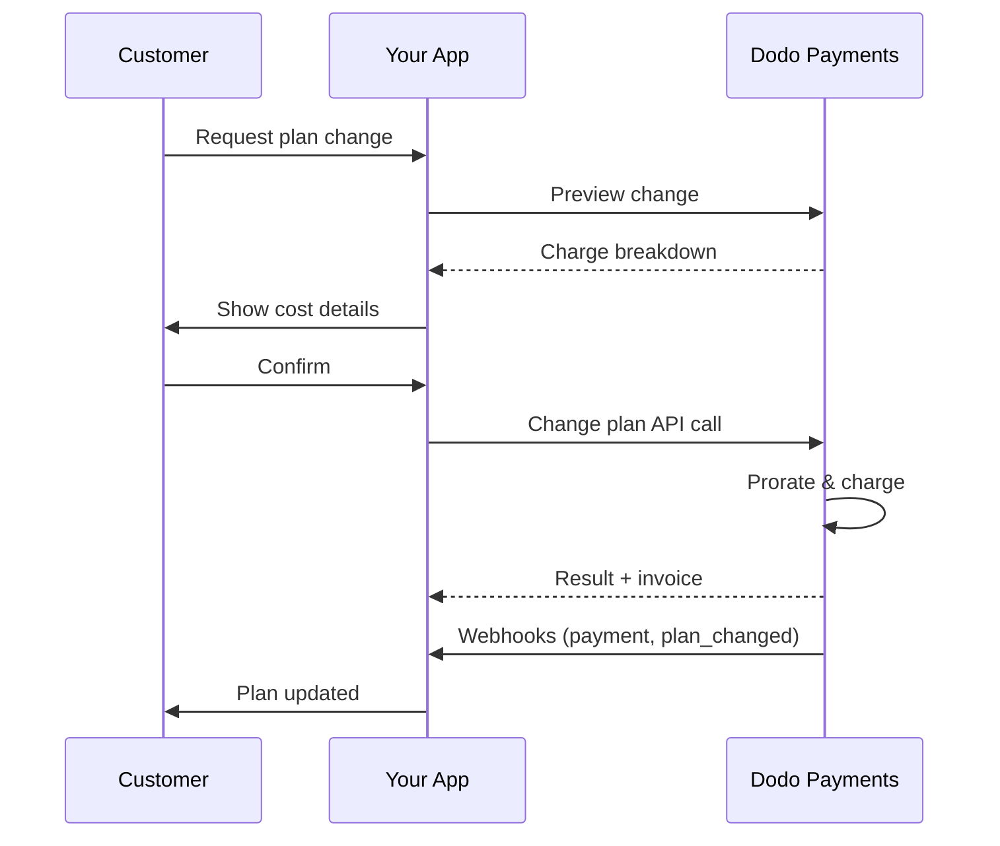
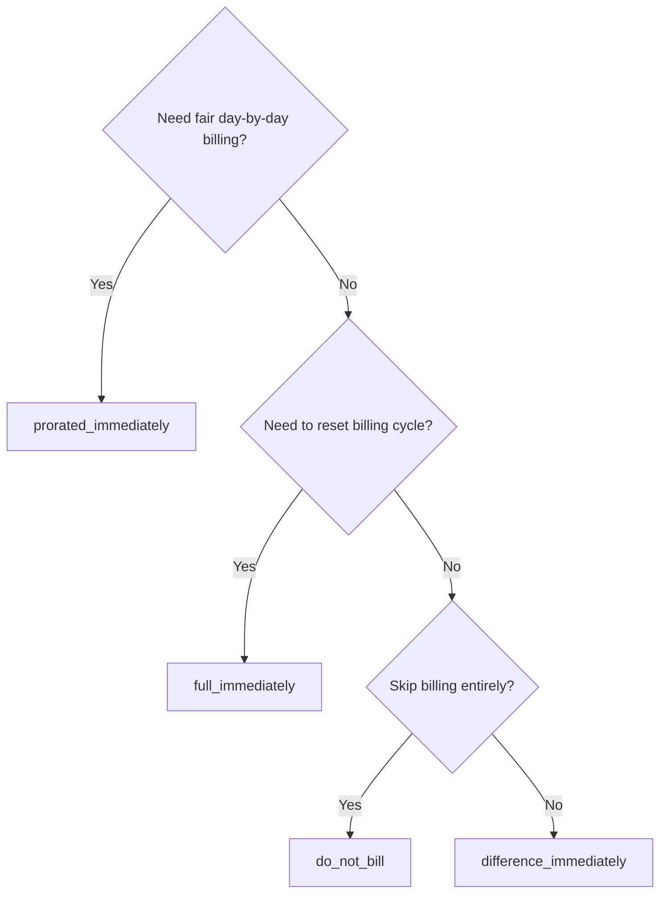
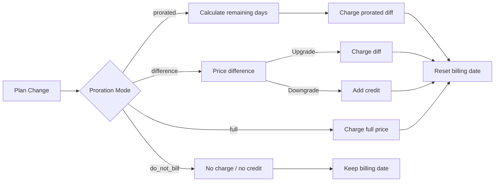

<CardGroup cols={3}>
<Card title="Change Plan API" icon="code" href="/api-reference/subscriptions/change-plan">
  Full API docs for updating subscriptions.
</Card>
<Card title="Plan Change Preview" icon="eye" href="/api-reference/subscriptions/preview-change-plan">
  See charge amounts before changing plans.
</Card>
<Card title="Integration Guide" icon="book" href="/developer-resources/subscription-integration-guide">
  Step-by-step subscription setup.
</Card>
</CardGroup>

## What is a subscription upgrade or downgrade?

Changing plans lets you move a customer between subscription tiers or quantities. Use it to:
- Align pricing with usage or features
- Move from monthly to annual (or vice versa)
- Adjust quantity for seat-based products

<Info>
Plan changes can trigger an immediate charge depending on the proration mode you choose.
</Info>

## When to use plan changes

- Upgrade when a customer needs more features, usage, or seats
- Downgrade when usage decreases
- Migrate users to a new product or price without cancelling their subscription

## Plan Change Flow



## Prerequisites

Before implementing subscription plan changes, ensure you have:

- A Dodo Payments merchant account with active subscription products
- API credentials (API key and webhook secret key) from the dashboard
- An existing active subscription to modify
- Webhook endpoint configured to handle subscription events

<Info>
For detailed setup instructions, see our [Integration Guide](/developer-resources/integration-guide#dashboard-setup).
</Info>

## Step-by-Step Implementation Guide

Follow this comprehensive guide to implement subscription plan changes in your application:

<Steps>
<Step title="Understand Plan Change Requirements">
Before implementing, determine:
- Which subscription products can be changed to which others
- What proration mode fits your business model
- How to handle failed plan changes gracefully
- Which webhook events to track for state management

<Tip>
Test plan changes thoroughly in test mode before implementing in production.
</Tip>
</Step>

<Step title="Choose Your Proration Strategy">
Select the billing approach that aligns with your business needs:

<Tabs>
<Tab title="prorated_immediately">
Best for: SaaS applications wanting to charge fairly for unused time
- Calculates exact prorated amount based on remaining cycle time
- Charges a prorated amount based on unused time remaining in the cycle
- Provides transparent billing to customers
</Tab>

<Tab title="difference_immediately">
Best for: Clear upgrade/downgrade scenarios
- Upgrade: Charge immediate difference (e.g., $30→$80 = charge $50)
- Downgrade: Credit remaining value for future renewals
- Simplifies billing logic and customer communication
</Tab>

<Tab title="full_immediately">
Best for: When you want to reset the billing cycle
- Charges full amount of new plan immediately
- Ignores remaining time from old plan
- Useful for annual to monthly transitions
</Tab>

<Tab title="do_not_bill">
Best for: Free migrations, courtesy switches, or absorbing cost differences
- No charges or credits calculated
- Customer moves to the new plan immediately without any billing adjustment
- Billing cycle remains unchanged
</Tab>
</Tabs>
</Step>

<Step title="Implement the Change Plan API">
Use the Change Plan API to modify subscription details:

<ParamField path="subscription_id" type="string" required>
The ID of the active subscription to modify.
</ParamField>

<ParamField path="product_id" type="string" required>
The new product ID to change the subscription to.
</ParamField>

<ParamField path="quantity" type="integer" required>
Number of units for the new plan (for seat-based products).
</ParamField>

<ParamField path="proration_billing_mode" type="string" required>
How to handle immediate billing: `prorated_immediately`, `full_immediately`, `difference_immediately`, or `do_not_bill`.
</ParamField>

<ParamField path="addons" type="array">
Optional addons for the new plan. Leaving this empty removes any existing addons.
</ParamField>

<ParamField path="on_payment_failure" type="string">
Controls behavior when the plan change payment fails:
- `prevent_change`: Keep subscription on current plan until payment succeeds
- `apply_change` (default): Apply plan change immediately regardless of payment outcome

If not specified, uses the business-level default setting.
</ParamField>

<ParamField path="collect_via_payment_link" type="boolean">
Thu khoản tiền thay đổi gói bằng payment link thay vì tính phí vào phương thức thanh toán đã lưu của subscription. Khách hàng thanh toán trên trang checkout được lưu trữ.


Yêu cầu capability `allow_plan_change_via_payment_link` của doanh nghiệp (**Settings → Subscriptions → Collect Plan Change Payments by Payment Link**), `effective_at: immediately` và `on_payment_failure: prevent_change`. Xem [Thu tiền qua Checkout Link](#collecting-payment-via-a-checkout-link).

Bị bỏ qua bởi preview route.
</ParamField>

<ParamField path="discount_codes" type="array">
Các mã giảm giá **stacked** tùy chọn để áp dụng cho gói mới (tối đa 20 mã, được áp dụng theo thứ tự trong array). Hành vi phụ thuộc vào giá trị bạn truyền:

- **Không được cung cấp / `null`** — các khoản giảm giá hiện có với `preserve_on_plan_change=true` được giữ lại nếu áp dụng cho product mới.
- **`[]` (array rỗng)** — xóa tất cả khoản giảm giá hiện có khỏi subscription.
- **`["CODE_A", "CODE_B", ...]`** — thay thế mọi khoản giảm giá hiện có bằng tập mã stacked này.
</ParamField>

<ParamField path="discount_code" type="string" deprecated>
**Đã ngừng sử dụng** — ưu tiên `discount_codes` cho các tích hợp mới. Field này vẫn hoạt động để đảm bảo khả năng tương thích ngược, nhưng không thể kết hợp với `discount_codes` trong cùng request.
</ParamField>

<ParamField path="effective_at" type="string" default="immediately">
Thời điểm áp dụng thay đổi gói:
- `immediately` (mặc định): Áp dụng thay đổi gói ngay lập tức
- `next_billing_date`: Lên lịch thay đổi vào ngày thanh toán tiếp theo. Khách hàng giữ gói hiện tại cho đến khi kỳ thanh toán kết thúc.

Sử dụng `next_billing_date` cho các lần hạ cấp để khách hàng giữ được quyền lợi của gói hiện tại cho đến hết kỳ thanh toán.
</ParamField>
</Step>

<Step title="Handle Webhook Events">
Thiết lập việc xử lý webhook để theo dõi kết quả thay đổi gói:

- `subscription.active`: Thay đổi gói thành công, subscription đã được cập nhật
- `subscription.plan_changed`: Gói của subscription đã thay đổi (nâng cấp/hạ cấp/cập nhật addon)
- `subscription.on_hold`: Tính phí thay đổi gói thất bại, các lần gia hạn bị dừng
- `payment.succeeded`: Tính phí ngay cho thay đổi gói thành công
- `payment.failed`: Tính phí ngay thất bại

<Warning>
Luôn xác minh chữ ký webhook và triển khai việc xử lý event theo cơ chế idempotent.
</Warning>
</Step>

<Step title="Update Your Application State">
Dựa trên các event webhook, hãy cập nhật application của bạn:
- Cấp/thu hồi các tính năng dựa trên gói mới
- Cập nhật dashboard của khách hàng với thông tin gói mới
- Gửi email xác nhận về thay đổi gói
- Ghi log các thay đổi billing cho mục đích kiểm toán
</Step>

<Step title="Test and Monitor">
Kiểm thử kỹ implementation của bạn:
- Kiểm thử tất cả proration mode với nhiều tình huống khác nhau
- Xác minh việc xử lý webhook hoạt động chính xác
- Theo dõi tỷ lệ thay đổi gói thành công
- Thiết lập cảnh báo cho các lần thay đổi gói thất bại

<Check>
Implementation thay đổi gói subscription của bạn hiện đã sẵn sàng để sử dụng trong production.
</Check>
</Step>
</Steps>

## Preview thay đổi gói

Trước khi xác nhận thay đổi gói, hãy sử dụng Preview API để hiển thị chính xác khoản phí khách hàng sẽ phải trả:

<Tabs>
<Tab title="Node.js SDK">

```javascript
const preview = await client.subscriptions.previewChangePlan('sub_123', {
  product_id: 'pdt_pro',
  quantity: 1,
  proration_billing_mode: 'prorated_immediately'
});

// Show customer the charge before confirming
console.log('Immediate charge:', preview.immediate_charge.summary);
console.log('New plan details:', preview.new_plan);
```

</Tab>

<Tab title="Python SDK">

```python
preview = client.subscriptions.preview_change_plan(
    subscription_id="sub_123",
    product_id="pdt_pro",
    quantity=1,
    proration_billing_mode="prorated_immediately"
)

# Show customer the charge before confirming
print("Immediate charge:", preview.immediate_charge.summary)
print("New plan details:", preview.new_plan)
```

</Tab>
</Tabs>

<Tip>
Sử dụng preview API để xây dựng các hộp thoại xác nhận hiển thị chính xác khoản phí khách hàng sẽ phải trả trước khi xác nhận thay đổi gói.
</Tip>

## Change Plan API

Sử dụng Change Plan API để sửa đổi product, quantity và proration behavior cho một subscription đang active.

### Ví dụ bắt đầu nhanh

<Tabs>
  <Tab title="Node.js SDK">

    ```javascript
    import DodoPayments from 'dodopayments';

    const client = new DodoPayments({
      bearerToken: process.env.DODO_PAYMENTS_API_KEY,
      environment: 'test_mode', // defaults to 'live_mode'
    });

    async function changePlan() {
      // change-plan returns 200 with an empty body.
      await client.subscriptions.changePlan('sub_123', {
        product_id: 'pdt_new',
        quantity: 3,
        proration_billing_mode: 'prorated_immediately',
        on_payment_failure: 'prevent_change', // Optional: control behavior on payment failure
      });
      console.log('Plan change accepted; awaiting webhooks');
    }

    changePlan();
    ```

  </Tab>
  <Tab title="Python SDK">

    ```python
    import os
    from dodopayments import DodoPayments

    client = DodoPayments(
        bearer_token=os.environ.get("DODO_PAYMENTS_API_KEY"),
        environment="test_mode",  # defaults to "live_mode"
    )

    # change_plan returns 200 with an empty body.
    client.subscriptions.change_plan(
        subscription_id="sub_123",
        product_id="pdt_new",
        quantity=3,
        proration_billing_mode="prorated_immediately",
        on_payment_failure="prevent_change",  # Optional: control behavior on payment failure
    )
    print("Plan change accepted; awaiting webhooks")
    ```

  </Tab>
  <Tab title="Go SDK">

    ```go
    package main

    import (
      "context"
      "fmt"
      "github.com/dodopayments/dodopayments-go"
      "github.com/dodopayments/dodopayments-go/option"
    )

    func main() {
      client := dodopayments.NewClient(option.WithBearerToken("YOUR_TOKEN"))
      // ChangePlan returns no response body; a nil error means the change succeeded.
      err := client.Subscriptions.ChangePlan(context.TODO(), "sub_123", dodopayments.SubscriptionChangePlanParams{
        UpdateSubscriptionPlanReq: dodopayments.UpdateSubscriptionPlanReqParam{
          ProductID:            dodopayments.F("pdt_new"),
          Quantity:             dodopayments.F(int64(3)),
          ProrationBillingMode: dodopayments.F(dodopayments.UpdateSubscriptionPlanReqProrationBillingModeProratedImmediately),
          OnPaymentFailure:     dodopayments.F(dodopayments.UpdateSubscriptionPlanReqOnPaymentFailurePreventChange), // Optional
        },
      })
      if err != nil { panic(err) }
      fmt.Println("Plan change applied")
    }
    ```

  </Tab>
  <Tab title="HTTP">

    ```bash
    curl -X POST "$DODO_API_BASE/subscriptions/sub_123/change-plan" \
      -H "Authorization: Bearer $DODO_PAYMENTS_API_KEY" \
      -H "Content-Type: application/json" \
      -d '{
        "product_id": "pdt_new",
        "quantity": 3,
        "proration_billing_mode": "prorated_immediately",
        "on_payment_failure": "prevent_change"
      }'
    ```

  </Tab>
</Tabs>

Thay đổi gói thành công trả về `200 OK` ngay lập tức — trước khi bất kỳ khoản phí nào thực sự được thanh toán. Nội dung body (`ChangePlanResponse`) phụ thuộc vào cách thu tiền cho thay đổi:

| Trường hợp | `payment_id` / `payment_link` / `client_secret` / `expires_on` |
|------|------------------------------------------------------------|
| Thay đổi theo lịch (`effective_at: next_billing_date`) | Tất cả `null` — chưa có khoản nào được tính phí |
| `proration_billing_mode: do_not_bill` | Tất cả `null` — không có khoản nào cần tính phí |
| Tính phí ngay thông thường (phương thức thanh toán đã lưu) | Tất cả `null` |
| `collect_via_payment_link: true` (đã phát hành link) | Tất cả đều **được điền** — các handle checkout dành cho khách hàng |

<Note>
Trong mọi trường hợp, response này không phải là kết quả thanh toán — nó chỉ cho biết request đã được chấp nhận. Response không cho biết khoản phí ngay lập tức có thực sự thành công hay không.

Với **tính phí ngay thông thường**, kết quả được xử lý off-session ngay sau khi gọi.

Với **request `collect_via_payment_link`**, kết quả được xử lý sau đó theo cơ chế bất đồng bộ — response chỉ cung cấp checkout link, subscription vẫn giữ gói hiện tại và không thể biết kết quả cho đến khi khách hàng thực sự hoàn tất thanh toán qua link đó.

Trong cả hai trường hợp, không suy luận kết quả từ response này. Hãy xác nhận qua webhook (<code>payment.succeeded</code>, <code>payment.failed</code>, <code>subscription.plan_changed</code>) hoặc đọc lại subscription bằng <code>GET /subscriptions/&#123;subscription_id&#125;</code> — xem [Điều gì xảy ra khi link chưa được thanh toán](#what-happens-while-the-link-is-unpaid) để biết riêng về trường hợp payment-link.
</Note>

<Warning>
Nếu khoản phí ngay lập tức thất bại, subscription có thể chuyển sang trạng thái `subscription.on_hold` cho đến khi thanh toán thành công.
</Warning>

## Thu tiền qua Checkout Link

Theo mặc định, thay đổi gói ngay lập tức sẽ tính phí trực tiếp vào phương thức thanh toán đã lưu của subscription. Đặt `collect_via_payment_link: true` để chuyển khách hàng đến trang checkout được lưu trữ thay thế — hữu ích khi không có phương thức thanh toán đã lưu được phép tính phí off-session, hoặc khi bạn muốn khách hàng chủ động xác nhận mức giá mới.

<Info>
Đây cũng là cơ chế vận hành toggle **Collect Plan Change Payments by Payment Link** trong **Settings → Subscriptions**, định tuyến quy trình thay đổi gói của [Customer Portal](/features/customer-portal#collecting-plan-change-payments-by-payment-link) tích hợp sẵn qua checkout thay vì thẻ đã lưu.
</Info>

### Yêu cầu

`collect_via_payment_link: true` chỉ thành công khi **tất cả** điều kiện sau đều được đáp ứng — nếu không, request sẽ thất bại với `422`:

- Doanh nghiệp đã bật capability `allow_plan_change_via_payment_link` (**Settings → Subscriptions → Collect Plan Change Payments by Payment Link**).
- `effective_at` là `immediately` (mặc định). Thay đổi theo lịch (`next_billing_date`) không cần trang checkout vì chỉ tính phí khi thay đổi được áp dụng.
- `on_payment_failure` **hiệu lực** phân giải thành `prevent_change`. Bạn không cần gửi rõ field này — nếu giá trị mặc định cấp doanh nghiệp (xem **Business & Collection Defaults** bên dưới) đã là `prevent_change` thì việc bỏ qua field cũng đáp ứng điều kiện. `apply_change` rõ ràng hoặc giá trị mặc định được phân giải thành `apply_change` sẽ thất bại với `422`.

<Info>
`collect_via_payment_link` không chỉ áp dụng cho nâng cấp — nó áp dụng cho mọi thay đổi ngay lập tức dẫn đến khoản phí, bao gồm cả hạ cấp, miễn là đáp ứng các yêu cầu trên.
</Info>

Nếu thay đổi có giá trị **bằng 0 hoặc là một khoản credit** — `proration_billing_mode: do_not_bill` hoặc một mode khác vô tình có tổng giá trị bằng 0 trong chu kỳ này — thì không có gì để đưa lên checkout page. Không phát hành payment link, `payment_link` và các field liên quan trả về `null`, đồng thời thay đổi được áp dụng ngay lập tức, giống như khi không dùng `collect_via_payment_link`. Đây không phải `422`; flag chỉ có hiệu lực khi có một khoản tiền dương cần thu. Nếu đặt `collect_via_payment_link` cho các thay đổi gói nói chung thay vì chỉ cho các lần nâng cấp rõ ràng, hãy gọi [Preview Plan Change](/api-reference/subscriptions/preview-change-plan) trước và chỉ yêu cầu link khi khoản tiền trong preview đáng để thu.

<Tabs>
<Tab title="Node.js SDK">

```javascript
const response = await client.subscriptions.changePlan('sub_123', {
  product_id: 'pdt_pro',
  quantity: 1,
  proration_billing_mode: 'prorated_immediately',
  effective_at: 'immediately',
  on_payment_failure: 'prevent_change',
  collect_via_payment_link: true,
});

// Hand response.payment_link to your frontend and send the customer there
console.log(response.payment_link);
```

</Tab>
<Tab title="Python SDK">

```python
response = client.subscriptions.change_plan(
    subscription_id="sub_123",
    product_id="pdt_pro",
    quantity=1,
    proration_billing_mode="prorated_immediately",
    effective_at="immediately",
    on_payment_failure="prevent_change",
    collect_via_payment_link=True,
)

# Hand response.payment_link to your frontend and send the customer there
print(response.payment_link)
```

</Tab>
<Tab title="HTTP">

```bash
curl -X POST "$DODO_API_BASE/subscriptions/sub_123/change-plan" \
  -H "Authorization: Bearer $DODO_PAYMENTS_API_KEY" \
  -H "Content-Type: application/json" \
  -d '{
    "product_id": "pdt_pro",
    "quantity": 1,
    "proration_billing_mode": "prorated_immediately",
    "effective_at": "immediately",
    "on_payment_failure": "prevent_change",
    "collect_via_payment_link": true
  }'
```

</Tab>
</Tabs>

Request thành công trả về các checkout handle:

```json
{
  "payment_id": "<payment_id>",
  "payment_link": "https://checkout.dodopayments.com/...",
  "client_secret": "<client_secret>",
  "expires_on": "<expires_on>"
}
```

### Điều gì xảy ra khi link chưa được thanh toán

- Subscription vẫn giữ gói **hiện tại** — `product_id`, `recurring_pre_tax_amount` và `next_billing_date` đều không thay đổi cho đến khi link được thanh toán.
- Một request `change-plan` tiếp theo trên cùng subscription sẽ bị từ chối với `409 PendingPlanChangeExists` trong khi link đang chờ xử lý. Nếu cần, hãy hủy thay đổi *theo lịch* bằng `DELETE /subscriptions/{subscription_id}/change-plan/scheduled`, nhưng endpoint đó không hủy thay đổi payment-link đang chờ — chỉ thanh toán thành công hoặc hết hạn mới thực hiện việc này.
- Khách hàng có thể thử lại thẻ trong **cùng** checkout session sau khi bị từ chối; gọi `change-plan` mới không phải cách retry.
- Nếu link không bao giờ được thanh toán, link sẽ ngừng hoạt động sau `expires_on` — subscription tự động có thể nhận request thay đổi gói mới sau đó không lâu.
- Nếu đã có thay đổi *theo lịch* (`next_billing_date`) và bạn thay thế bằng `cancel_scheduled_change_plan: true`, lịch ban đầu vẫn được giữ trong khi link chưa được thanh toán và chỉ bị hủy sau khi link được thanh toán — trong cùng transaction áp dụng gói mới.

<Warning>
Sau khi phát hành thay đổi qua payment-link ngay lập tức, mọi request thay đổi gói tiếp theo trên subscription đó — bao gồm cả preview không gây side effect — đều bị chặn cho đến khi link được xử lý. Đừng phát hành một link mà bạn không định để khách hàng thanh toán ngay.
</Warning>

## Quản lý Addon

Khi thay đổi gói subscription, bạn cũng có thể sửa đổi addon:

```javascript
// Add addons to the new plan
await client.subscriptions.changePlan('sub_123', {
  product_id: 'pdt_new',
  quantity: 1,
  proration_billing_mode: 'difference_immediately',
  addons: [
    { addon_id: 'addon_123', quantity: 2 }
  ]
});

// Remove all existing addons
await client.subscriptions.changePlan('sub_123', {
  product_id: 'pdt_new',
  quantity: 1,
  proration_billing_mode: 'difference_immediately',
  addons: [] // Empty array removes all existing addons
});
```

<Info>
Addon được tính vào phép tính proration và sẽ được tính phí theo proration mode đã chọn.
</Info>

## Áp dụng mã giảm giá

Bạn có thể áp dụng một hoặc nhiều **mã giảm giá stacked** khi thay đổi gói subscription (tối đa 20 mã, áp dụng theo thứ tự trong array). Điều này hữu ích khi cung cấp mức giá khuyến mãi cho các lần nâng cấp hoặc migration.

<Tabs>
<Tab title="Node.js SDK">

```javascript
// Apply stacked discount codes during plan change
await client.subscriptions.changePlan('sub_123', {
  product_id: 'pdt_pro',
  quantity: 1,
  proration_billing_mode: 'prorated_immediately',
  discount_codes: ['UPGRADE20']
});
```

</Tab>
<Tab title="Python SDK">

```python
# Apply stacked discount codes during plan change
client.subscriptions.change_plan(
    subscription_id="sub_123",
    product_id="pdt_pro",
    quantity=1,
    proration_billing_mode="prorated_immediately",
    discount_codes=["UPGRADE20"]
)
```

</Tab>
<Tab title="HTTP">

```bash
curl -X POST "$DODO_API_BASE/subscriptions/sub_123/change-plan" \
  -H "Authorization: Bearer $DODO_PAYMENTS_API_KEY" \
  -H "Content-Type: application/json" \
  -d '{
    "product_id": "pdt_pro",
    "quantity": 1,
    "proration_billing_mode": "prorated_immediately",
    "discount_codes": ["UPGRADE20"]
  }'
```

</Tab>
</Tabs>

### Hành vi của discount khi thay đổi gói

| Giá trị `discount_codes` | Hành vi |
|------------------------|----------|
| Không được cung cấp / `null` | Các khoản giảm giá hiện có với `preserve_on_plan_change=true` được tự động giữ lại nếu áp dụng cho product mới. |
| `[]` (array rỗng) | **Tất cả** khoản giảm giá hiện có bị xóa khỏi subscription. |
| `["CODE_A", "CODE_B", ...]` | Thay thế mọi khoản giảm giá hiện có bằng tập mã stacked này, được xác thực và áp dụng theo thứ tự trong array. |

<Info>
Field `discount_code` dạng singular trên endpoint này đã **ngừng sử dụng** nhưng vẫn hoạt động để đảm bảo khả năng tương thích ngược — các integration hiện có không cần thay đổi ngay. Field này không thể kết hợp với `discount_codes` trong cùng request. Hãy chuyển sang dạng array khi thuận tiện.
</Info>

<Tip>
Sử dụng [Preview Plan Change API](/api-reference/subscriptions/preview-change-plan) với `discount_codes` để hiển thị chính xác khoản tiền khách hàng sẽ tiết kiệm trước khi xác nhận thay đổi gói.
</Tip>

## Các proration mode

Chọn cách tính phí khách hàng khi thay đổi gói:

#### `prorated_immediately`
- Tính phí phần chênh lệch theo tỷ lệ trong chu kỳ hiện tại
- Nếu đang trial, tính phí ngay và chuyển sang gói mới ngay
- Hạ cấp: có thể tạo credit theo tỷ lệ, áp dụng cho các lần gia hạn sau

#### `full_immediately`
- Tính toàn bộ giá của gói mới ngay lập tức
- Bỏ qua thời gian còn lại của gói cũ

<Info>
Các credit được tạo bởi việc hạ cấp sử dụng <code>difference_immediately</code> thuộc phạm vi subscription và khác với các entitlement của <a href="/features/credit-based-billing">Credit-Based Billing</a>. Chúng tự động được áp dụng cho các lần gia hạn sau của cùng subscription và không thể chuyển giữa các subscription.
</Info>

#### `difference_immediately`
- Nâng cấp: tính ngay khoản chênh lệch giá giữa gói cũ và gói mới
- Hạ cấp: cộng giá trị còn lại thành credit nội bộ cho subscription và tự động áp dụng khi gia hạn

#### `do_not_bill`
- Không tính toán khoản phí hoặc credit nào
- Khách hàng chuyển sang gói mới ngay lập tức mà không điều chỉnh billing
- Chu kỳ billing không thay đổi
- Phù hợp nhất cho migration hỗ trợ, chuyển sang gói miễn phí hoặc hấp thụ phần chênh lệch chi phí

| Tính năng | `prorated_immediately` | `difference_immediately` | `full_immediately` | `do_not_bill` |
|---------|----------------------|------------------------|-------------------|--------------|
| **Phí nâng cấp** | Chênh lệch theo tỷ lệ cho số ngày còn lại | Toàn bộ chênh lệch giá giữa các gói | Toàn bộ giá gói mới | Không tính phí |
| **Credit khi hạ cấp** | Credit theo tỷ lệ cho số ngày còn lại | Toàn bộ chênh lệch giá dưới dạng credit | Không có credit | Không có credit |
| **Chu kỳ billing** | Đặt lại về hôm nay | Đặt lại về hôm nay | Đặt lại về hôm nay | Không thay đổi |
| **Hành vi khi trial** | Kết thúc trial, tính phí ngay | Kết thúc trial, tính phí ngay | Kết thúc trial, tính toàn bộ khoản phí | Kết thúc trial, không tính phí |
| **Phù hợp nhất cho** | Tính phí công bằng theo thời gian | Tính toán nâng cấp/hạ cấp đơn giản | Đặt lại chu kỳ billing | Migration miễn phí hoặc chuyển gói hỗ trợ |
| **Độ phức tạp** | Trung bình (tính theo ngày) | Thấp (phép trừ đơn giản) | Thấp (tính toàn bộ phí) | Không có |



### Các tình huống ví dụ

Sử dụng nhất quán các số liệu chuẩn sau:
- Gói hiện tại: **Basic** ở mức **$30/tháng**
- Gói mục tiêu khi nâng cấp: **Pro** ở mức **$80/tháng**
- Gói mục tiêu khi hạ cấp (từ Pro): **Starter** ở mức **$20/tháng**
- Chu kỳ billing: **30 ngày**, bắt đầu từ **January 1**
- Thay đổi gói diễn ra vào **January 16** (còn 15 ngày, đã sử dụng 15 ngày)

<AccordionGroup>
  <Accordion title="Upgrade: Basic ($30) → Pro ($80) with prorated_immediately">

    ```
    Step 1: Calculate unused credit from current plan
      Unused days = 15 out of 30 days
      Credit = $30 × (15/30) = $15.00

    Step 2: Calculate prorated cost of new plan
      Remaining days = 15 out of 30 days
      New plan cost = $80 × (15/30) = $40.00

    Step 3: Calculate immediate charge
      Charge = New plan cost − Credit
      Charge = $40.00 − $15.00 = $25.00

    → Customer pays $25.00 now
    → Billing cycle resets to today (January 16)
    → Next renewal (Feb 15): $80.00/month
    ```

    ```javascript
    await client.subscriptions.changePlan('sub_123', {
      product_id: 'pdt_pro',
      quantity: 1,
      proration_billing_mode: 'prorated_immediately'
    })
    ```

  </Accordion>

  <Accordion title="Downgrade: Pro ($80) → Starter ($20) with prorated_immediately">

    ```
    Step 1: Calculate unused credit from current plan
      Unused days = 15 out of 30 days
      Credit = $80 × (15/30) = $40.00

    Step 2: Calculate prorated cost of new plan
      Remaining days = 15 out of 30 days
      New plan cost = $20 × (15/30) = $10.00

    Step 3: Calculate credit balance
      Credit = $40.00 − $10.00 = $30.00

    → No charge — $30.00 credit added to subscription
    → Billing cycle resets to today (January 16)
    → Credit auto-applies to future renewals
    → Next renewal (Feb 15): $20.00 − $20.00 (from credit) = $0.00 ($10.00 credit remaining)
    → Following renewal (Mar 15): $20.00 − $10.00 remaining credit = $10.00
    ```

    ```javascript
    await client.subscriptions.changePlan('sub_123', {
      product_id: 'pdt_starter',
      quantity: 1,
      proration_billing_mode: 'prorated_immediately'
    })
    ```

  </Accordion>

  <Accordion title="Upgrade: Basic ($30) → Pro ($80) with difference_immediately">

    ```
    Immediate charge = New plan price − Old plan price
                     = $80 − $30
                     = $50.00

    → Customer pays $50.00 now (regardless of cycle position)
    → Billing cycle resets to today (January 16)
    → Next renewal (Feb 15): $80.00/month
    ```

    ```javascript
    await client.subscriptions.changePlan('sub_123', {
      product_id: 'pdt_pro',
      quantity: 1,
      proration_billing_mode: 'difference_immediately'
    })
    ```

  </Accordion>

  <Accordion title="Downgrade: Pro ($80) → Starter ($20) with difference_immediately">

    ```
    Credit = Old plan price − New plan price
           = $80 − $20
           = $60.00

    → No charge — $60.00 credit added to subscription
    → Credit auto-applies to future renewals
    → Next renewal: $20.00 − $20.00 (from credit) = $0.00
    → Following renewal: $20.00 − $20.00 (from credit) = $0.00
    → Third renewal: $20.00 − $20.00 (from remaining credit) = $0.00
    ```

    ```javascript
    await client.subscriptions.changePlan('sub_123', {
      product_id: 'pdt_starter',
      quantity: 1,
      proration_billing_mode: 'difference_immediately'
    })
    ```

  </Accordion>

  <Accordion title="Upgrade: Basic ($30) → Pro ($80) with full_immediately">

    ```
    Immediate charge = Full new plan price = $80.00

    → Customer pays $80.00 now
    → No credit for unused time on old plan
    → Billing cycle resets to today (January 16)
    → Next renewal: February 16 at $80.00/month
    ```

    ```javascript
    await client.subscriptions.changePlan('sub_123', {
      product_id: 'pdt_pro',
      quantity: 1,
      proration_billing_mode: 'full_immediately'
    })
    ```

  </Accordion>

  <Accordion title="Mid-cycle upgrade with add-ons using prorated_immediately">

    ```
    Current: Basic plan ($30/month), no add-ons
    New: Pro plan ($80/month) + Extra Seats add-on ($10/seat × 3 seats = $30/month)
    Change on day 16 of 30 (15 days remaining)

    Step 1: Credit from current plan
      Credit = $30 × (15/30) = $15.00

    Step 2: Prorated cost of new plan + add-ons
      New plan = $80 × (15/30) = $40.00
      Add-ons = $30 × (15/30) = $15.00
      Total new = $55.00

    Step 3: Immediate charge
      Charge = $55.00 − $15.00 = $40.00

    → Customer pays $40.00 now
    → Next renewal: $80.00 + $30.00 = $110.00/month
    ```

    ```javascript
    await client.subscriptions.changePlan('sub_123', {
      product_id: 'pdt_pro',
      quantity: 1,
      proration_billing_mode: 'prorated_immediately',
      addons: [
        { addon_id: 'addon_seats', quantity: 3 }
      ]
    })
    ```

  </Accordion>
</AccordionGroup>

### Cách mỗi mode xử lý billing



<Tip>
Chọn `prorated_immediately` để tính phí công bằng theo thời gian; chọn `full_immediately` để khởi động lại billing; sử dụng `difference_immediately` cho các lần nâng cấp đơn giản và tự động tạo credit khi hạ cấp; hoặc sử dụng `do_not_bill` để chuyển gói mà không điều chỉnh billing.
</Tip>

## Xử lý lỗi thanh toán

Kiểm soát điều gì xảy ra khi thanh toán cho thay đổi gói thất bại bằng parameter `on_payment_failure`.

### Các chế độ lỗi thanh toán

<Tabs>
<Tab title="prevent_change (Recommended for critical upgrades)">
**Hành vi**: Giữ subscription ở gói hiện tại cho đến khi thanh toán thành công.

- Thay đổi gói được đánh dấu là "pending"
- Khách hàng vẫn có quyền truy cập gói hiện tại
- Subscription chỉ chuyển sang trạng thái `active` sau khi thanh toán thành công
- Hữu ích khi bạn muốn đảm bảo thanh toán trước khi cấp các tính năng nâng cấp

```javascript
await client.subscriptions.changePlan('sub_123', {
  product_id: 'pdt_pro',
  quantity: 1,
  proration_billing_mode: 'prorated_immediately',
  on_payment_failure: 'prevent_change'
});
```

</Tab>

<Tab title="apply_change (Default)">
**Hành vi**: Áp dụng thay đổi gói ngay lập tức bất kể kết quả thanh toán.

- Thay đổi gói được áp dụng ngay cả khi thanh toán thất bại
- Khách hàng có quyền truy cập gói mới ngay lập tức
- Subscription có thể chuyển sang trạng thái `on_hold` nếu thanh toán thất bại
- Phù hợp với các lần nâng cấp không quan trọng hoặc khi bạn tin tưởng khách hàng

```javascript
await client.subscriptions.changePlan('sub_123', {
  product_id: 'pdt_pro',
  quantity: 1,
  proration_billing_mode: 'prorated_immediately',
  on_payment_failure: 'apply_change' // This is the default
});
```

</Tab>
</Tabs>

<Info>
Nếu không được chỉ định, parameter `on_payment_failure` sẽ sử dụng thiết lập mặc định cấp doanh nghiệp được cấu hình trong dashboard.
</Info>

### Khi nào nên dùng từng mode

| Tình huống | Mode được đề xuất | Lý do |
|----------|------------------|--------|
| Nâng cấp lên các tính năng cao cấp | `prevent_change` | Đảm bảo thanh toán trước khi cấp quyền truy cập |
| Tăng quantity (thêm seat) | `prevent_change` | Ngăn việc sử dụng mà chưa thanh toán |
| Hạ cấp gói | `apply_change` | Khách hàng đang giảm chi tiêu |
| Khách hàng doanh nghiệp đáng tin cậy | `apply_change` | Rủi ro không thanh toán thấp hơn |
| Chuyển đổi từ trial sang trả phí | `prevent_change` | Thời điểm thanh toán quan trọng |

## Mặc định cấp doanh nghiệp & thu tiền

Thay vì truyền parameter proration trong mỗi lần thay đổi gói, bạn có thể thiết lập **hành vi nâng cấp & hạ cấp mặc định** một lần ở cấp doanh nghiệp. Các giá trị mặc định này áp dụng cho mọi thay đổi gói từ customer portal và có thể được **ghi đè theo từng product collection**.

Có các giá trị mặc định riêng cho nâng cấp và hạ cấp:

| Thiết lập | Field (nâng cấp / hạ cấp) | Mặc định (nâng cấp) | Mặc định (hạ cấp) |
|---------|-----------------------------|-------------------|---------------------|
| Khi gói mới bắt đầu | `effective_at_on_upgrade` / `effective_at_on_downgrade` | `immediately` | `next_billing_date` |
| Cách tính phí khách hàng | `proration_billing_mode_on_upgrade` / `proration_billing_mode_on_downgrade` | `difference_immediately` | `difference_immediately` |
| Nếu thanh toán của khách hàng thất bại | `on_payment_failure` | `apply_change` | `apply_change` |

Cấu hình các giá trị mặc định cấp doanh nghiệp trong **Settings → Subscriptions**, và các giá trị ghi đè của collection trong từng product collection. Mỗi field của collection độc lập — để trống để **kế thừa từ giá trị mặc định cấp doanh nghiệp**, hoặc đặt giá trị để ghi đè chỉ cho collection đó.

### Thứ tự phân giải

Với mỗi thay đổi gói cụ thể, từng thiết lập được phân giải theo thứ tự sau:

```
per-request value (Change Plan API) → collection field (if set) → business field → system default
```

<Info>
Giá trị được truyền rõ ràng vào [Change Plan API](/api-reference/subscriptions/change-plan) luôn được ưu tiên. Các giá trị mặc định cấp doanh nghiệp và collection chỉ có hiệu lực khi không có giá trị rõ ràng — đây là trường hợp của mọi thay đổi gói được khởi tạo từ customer portal.
</Info>

<Tip>
Một thiết lập phổ biến: giữ các lần nâng cấp ở `immediately` + `difference_immediately` để khách hàng thanh toán phần chênh lệch và có quyền truy cập ngay, đồng thời giữ các lần hạ cấp ở `next_billing_date` để khách hàng giữ gói hiện tại cho đến hết chu kỳ.
</Tip>

## Xử lý webhook

Theo dõi trạng thái subscription qua webhook để xác nhận thay đổi gói và các khoản thanh toán.

### Các loại event cần xử lý
- `subscription.active`: subscription đã được kích hoạt
- `subscription.plan_changed`: gói subscription đã thay đổi (nâng cấp/hạ cấp/thay đổi addon)
- `subscription.on_hold`: tính phí thất bại, các lần gia hạn bị dừng
- `subscription.renewed`: gia hạn thành công
- `payment.succeeded`: thanh toán cho thay đổi gói hoặc gia hạn thành công
- `payment.failed`: thanh toán thất bại

<Info>
Chúng tôi khuyến nghị điều khiển business logic từ các event subscription và sử dụng event payment để xác nhận và đối soát.
</Info>

### Xác minh chữ ký và xử lý intent

<Tabs>
  <Tab title="Next.js Route Handler">

    ```javascript
    import { NextRequest, NextResponse } from 'next/server';
    
    export async function POST(req) {
      const webhookId = req.headers.get('webhook-id');
      const webhookSignature = req.headers.get('webhook-signature');
      const webhookTimestamp = req.headers.get('webhook-timestamp');
      const secret = process.env.DODO_WEBHOOK_SECRET;
    
      const payload = await req.text();
      // verifySignature is a placeholder – in production, use a Standard Webhooks library
      const { valid, event } = await verifySignature(
        payload,
        { id: webhookId, signature: webhookSignature, timestamp: webhookTimestamp },
        secret
      );
      if (!valid) return NextResponse.json({ error: 'Invalid signature' }, { status: 400 });
    
      switch (event.type) {
        case 'subscription.active':
          // mark subscription active in your DB
          break;
        case 'subscription.plan_changed':
          // refresh entitlements and reflect the new plan in your UI
          break;
        case 'subscription.on_hold':
          // notify user to update payment method
          break;
        case 'subscription.renewed':
          // extend access window
          break;
        case 'payment.succeeded':
          // reconcile payment for plan change
          break;
        case 'payment.failed':
          // log and alert
          break;
        default:
          // ignore unknown events
          break;
      }
    
      return NextResponse.json({ received: true });
    }
    ```

  </Tab>
  <Tab title="Express.js">

    ```javascript
    import express from 'express';
    
    const app = express();
    app.post('/webhooks/dodo', express.raw({ type: 'application/json' }), async (req, res) => {
      const webhookId = req.header('webhook-id');
      const webhookSignature = req.header('webhook-signature');
      const webhookTimestamp = req.header('webhook-timestamp');
      const secret = process.env.DODO_WEBHOOK_SECRET;
      const payload = req.body.toString('utf8');
    
      const { valid, event } = await verifySignature(
        payload,
        { id: webhookId, signature: webhookSignature, timestamp: webhookTimestamp },
        secret
      );
      if (!valid) return res.status(400).send('Invalid signature');
    
      // handle events like above
      res.json({ received: true });
    });
    
    app.listen(3000);
    ```

  </Tab>
</Tabs>

<Note>
Để biết schema payload chi tiết, xem <a href="/developer-resources/webhooks/intents/subscription">Subscription webhook payloads</a> và <a href="/developer-resources/webhooks/intents/payment">Payment webhook payloads</a>.
</Note>

## Các phương pháp hay nhất

Hãy làm theo các khuyến nghị sau để thay đổi gói subscription đáng tin cậy:

### Chiến lược thay đổi gói
- **Kiểm thử kỹ lưỡng**: Luôn kiểm thử thay đổi gói ở test mode trước khi đưa lên production
- **Lựa chọn proration cẩn thận**: Chọn proration mode phù hợp với mô hình kinh doanh
- **Xử lý lỗi phù hợp**: Triển khai error handling và retry logic thích hợp
- **Theo dõi tỷ lệ thành công**: Theo dõi tỷ lệ thay đổi gói thành công/thất bại và điều tra vấn đề

### Triển khai webhook
- **Xác minh chữ ký**: Luôn xác thực chữ ký webhook để đảm bảo tính xác thực
- **Triển khai idempotency**: Xử lý phù hợp các event webhook trùng lặp
- **Xử lý bất đồng bộ**: Không chặn response webhook bằng các thao tác nặng
- **Ghi log mọi thứ**: Duy trì log chi tiết để debug và kiểm toán

### Trải nghiệm người dùng
- **Trao đổi rõ ràng**: Thông báo cho khách hàng về các thay đổi billing và thời điểm áp dụng
- **Cung cấp xác nhận**: Gửi email xác nhận khi thay đổi gói thành công
- **Xử lý trường hợp đặc biệt**: Cân nhắc thời gian trial, proration và các khoản thanh toán thất bại
- **Cập nhật UI ngay lập tức**: Phản ánh thay đổi gói trong giao diện application

## Các vấn đề thường gặp và giải pháp

Giải quyết các vấn đề điển hình gặp phải trong quá trình thay đổi gói subscription:

<AccordionGroup>
<Accordion title="Charge created but subscription not updated">
**Triệu chứng**: API call thành công nhưng subscription vẫn ở gói cũ

**Nguyên nhân thường gặp**:
- Xử lý webhook thất bại hoặc bị trì hoãn
- State của application không được cập nhật sau khi nhận webhook
- Vấn đề transaction cơ sở dữ liệu trong quá trình cập nhật state

**Giải pháp**:
- Triển khai xử lý webhook mạnh mẽ với retry logic
- Sử dụng các thao tác idempotent để cập nhật state
- Thêm monitoring để phát hiện và cảnh báo các event webhook bị bỏ lỡ
- Xác minh webhook endpoint có thể truy cập và phản hồi chính xác
</Accordion>

<Accordion title="Credits not applied after downgrade">
**Triệu chứng**: Khách hàng hạ cấp nhưng không thấy số dư credit

**Nguyên nhân thường gặp**:
- Kỳ vọng về proration mode: với `difference_immediately`, hạ cấp tạo credit bằng toàn bộ chênh lệch giá của gói, trong khi `prorated_immediately` tạo credit theo tỷ lệ dựa trên thời gian còn lại trong chu kỳ
- Credit gắn với subscription cụ thể và không thể chuyển giữa các subscription
- Số dư credit không hiển thị trong dashboard khách hàng

**Giải pháp**:
- Sử dụng `difference_immediately` cho các lần hạ cấp khi muốn tự động tạo credit
- Giải thích cho khách hàng rằng credit được áp dụng cho các lần gia hạn sau của cùng subscription
- Triển khai customer portal để hiển thị số dư credit
- Kiểm tra preview invoice tiếp theo để xem các credit đã áp dụng
</Accordion>

<Accordion title="Webhook signature verification fails">
**Triệu chứng**: Event webhook bị từ chối do chữ ký không hợp lệ

**Nguyên nhân thường gặp**:
- Webhook secret key không chính xác
- Raw request body bị thay đổi trước khi xác minh chữ ký
- Thuật toán xác minh chữ ký không đúng

**Giải pháp**:
- Xác minh bạn đang sử dụng `DODO_WEBHOOK_SECRET` chính xác từ dashboard
- Đọc raw request body trước bất kỳ JSON parsing middleware nào
- Sử dụng thư viện xác minh webhook tiêu chuẩn cho platform của bạn
- Kiểm thử việc xác minh chữ ký webhook trong môi trường development
</Accordion>

<Accordion title="Plan change fails with 422 error">
**Triệu chứng**: API trả về lỗi 422 Unprocessable Entity

**Nguyên nhân thường gặp**:
- Subscription ID hoặc product ID không hợp lệ
- Subscription không ở trạng thái active
- Thiếu parameter bắt buộc
- Product không khả dụng cho thay đổi gói

**Giải pháp**:
- Xác minh subscription tồn tại và đang active
- Kiểm tra product ID hợp lệ và khả dụng
- Đảm bảo đã cung cấp tất cả parameter bắt buộc
- Xem tài liệu API để biết yêu cầu về parameter
</Accordion>

<Accordion title="Immediate charge fails during plan change">
**Triệu chứng**: Đã khởi tạo thay đổi gói nhưng tính phí ngay lập tức thất bại

**Nguyên nhân thường gặp**:
- Không đủ tiền trong phương thức thanh toán của khách hàng
- Phương thức thanh toán hết hạn hoặc không hợp lệ
- Ngân hàng từ chối giao dịch
- Hệ thống phát hiện gian lận đã chặn khoản phí

**Giải pháp**:
- Xử lý phù hợp các event webhook `payment.failed`
- Thông báo khách hàng cập nhật phương thức thanh toán
- Triển khai retry logic cho các lỗi tạm thời
- Cân nhắc cho phép thay đổi gói dù khoản phí ngay lập tức thất bại
</Accordion>

<Accordion title="Subscription on hold after plan change">
**Triệu chứng**: Tính phí thay đổi gói thất bại và subscription chuyển sang trạng thái `on_hold`

**Điều gì xảy ra**:
Khi tính phí thay đổi gói thất bại, subscription tự động được chuyển sang trạng thái `on_hold`. Subscription sẽ không tự động gia hạn cho đến khi phương thức thanh toán được cập nhật.

**Giải pháp**: Cập nhật phương thức thanh toán để kích hoạt lại subscription

Để kích hoạt lại subscription từ trạng thái `on_hold` sau khi thay đổi gói thất bại:

1. **Cập nhật phương thức thanh toán** bằng Update Payment Method API
2. **Tự động tạo charge**: API tự động tạo charge cho các khoản còn phải trả
3. **Tạo invoice**: Một invoice được tạo cho charge
4. **Xử lý thanh toán**: Khoản thanh toán được xử lý bằng phương thức thanh toán mới
5. **Kích hoạt lại**: Sau khi thanh toán thành công, subscription được kích hoạt lại về trạng thái `active`

<CodeGroup>

```javascript Node.js
// Reactivate subscription from on_hold after failed plan change
async function reactivateAfterFailedPlanChange(subscriptionId) {
  // Update payment method - automatically creates charge for remaining dues
  const response = await client.subscriptions.updatePaymentMethod(subscriptionId, {
    payment_method: { type: 'new', return_url: 'https://example.com/return' }
  });
  
  if (response.payment_id) {
    console.log('Charge created for remaining dues:', response.payment_id);
    console.log('Payment link:', response.payment_link);
    
    // Redirect customer to payment_link to complete payment
    // Monitor webhooks for:
    // 1. payment.succeeded - charge succeeded
    // 2. subscription.active - subscription reactivated
  }
  
  return response;
}

// Or use existing payment method if available
async function reactivateWithExistingPaymentMethod(subscriptionId, paymentMethodId) {
  const response = await client.subscriptions.updatePaymentMethod(subscriptionId, {
    payment_method: { type: 'existing', payment_method_id: paymentMethodId }
  });
  
  // Monitor webhooks for payment.succeeded and subscription.active
  return response;
}
```

```python Python
# Reactivate subscription from on_hold after failed plan change
def reactivate_after_failed_plan_change(subscription_id):
    # Update payment method - automatically creates charge for remaining dues
    response = client.subscriptions.update_payment_method(
        subscription_id=subscription_id,
        payment_method={"type": "new", "return_url": "https://example.com/return"},
    )
    
    if response.payment_id:
        print("Charge created for remaining dues:", response.payment_id)
        print("Payment link:", response.payment_link)
        
        # Redirect customer to payment_link to complete payment
        # Monitor webhooks for:
        # 1. payment.succeeded - charge succeeded
        # 2. subscription.active - subscription reactivated
    
    return response

# Or use existing payment method if available
def reactivate_with_existing_payment_method(subscription_id, payment_method_id):
    response = client.subscriptions.update_payment_method(
        subscription_id=subscription_id,
        payment_method={"type": "existing", "payment_method_id": payment_method_id},
    )
    
    # Monitor webhooks for payment.succeeded and subscription.active
    return response
```

</CodeGroup>

**Các event webhook cần theo dõi**:
- `subscription.on_hold`: Subscription bị tạm dừng (nhận được khi tính phí thay đổi gói thất bại)
- `payment.succeeded`: Thanh toán các khoản còn phải trả thành công (sau khi cập nhật phương thức thanh toán)
- `subscription.active`: Subscription được kích hoạt lại sau khi thanh toán thành công

**Phương pháp hay nhất**:
- Thông báo ngay cho khách hàng khi tính phí thay đổi gói thất bại
- Cung cấp hướng dẫn rõ ràng về cách cập nhật phương thức thanh toán
- Theo dõi event webhook để kiểm tra trạng thái kích hoạt lại
- Cân nhắc triển khai retry logic tự động cho các lỗi thanh toán tạm thời

<Card title="Update Payment Method API Reference" icon="code" href="/api-reference/subscriptions/update-payment-method">
Xem tài liệu API đầy đủ về cách cập nhật phương thức thanh toán và kích hoạt lại subscription.
</Card>
</Accordion>
</AccordionGroup>

## Kiểm thử implementation

Hãy làm theo các bước sau để kiểm thử kỹ implementation thay đổi gói subscription:

<Steps>
<Step title="Set up test environment">
- Sử dụng API key test và product test
- Tạo subscription test với các loại gói khác nhau
- Cấu hình webhook endpoint test
- Thiết lập monitoring và logging
</Step>

<Step title="Test different proration modes">
- Kiểm thử `prorated_immediately` với nhiều thời điểm khác nhau trong chu kỳ billing
- Kiểm thử `difference_immediately` cho nâng cấp và hạ cấp
- Kiểm thử `full_immediately` để đặt lại chu kỳ billing
- Kiểm thử `do_not_bill` cho việc chuyển gói không tính phí/không credit
- Xác minh phép tính credit chính xác
</Step>

<Step title="Test webhook handling">
- Xác minh đã nhận tất cả event webhook liên quan
- Kiểm thử xác minh chữ ký webhook
- Xử lý phù hợp các event webhook trùng lặp
- Kiểm thử các tình huống xử lý webhook thất bại
</Step>

<Step title="Test error scenarios">
- Kiểm thử với subscription ID không hợp lệ
- Kiểm thử với phương thức thanh toán hết hạn
- Kiểm thử lỗi mạng và timeout
- Kiểm thử khi không đủ tiền
</Step>

<Step title="Monitor in production">
- Thiết lập cảnh báo cho các lần thay đổi gói thất bại
- Theo dõi thời gian xử lý webhook
- Theo dõi tỷ lệ thay đổi gói thành công
- Xem lại ticket hỗ trợ khách hàng về các vấn đề thay đổi gói
</Step>
</Steps>

## Xử lý lỗi

Xử lý phù hợp các lỗi API thường gặp trong implementation của bạn:

### HTTP Status Codes

<AccordionGroup>
<Accordion title="200 OK">
Request thay đổi gói đã được xử lý thành công. Response body trống, ngoại trừ request `collect_via_payment_link` thành công, request này trả về checkout handle — xem [Thu tiền qua Checkout Link](#collecting-payment-via-a-checkout-link). Nếu `on_payment_failure=prevent_change`, thay đổi gói vẫn ở trạng thái pending cho đến khi thanh toán thành công.
</Accordion>

<Accordion title="400 Bad Request">
Parameter request không hợp lệ. Kiểm tra tất cả field bắt buộc đã được cung cấp và có đúng định dạng.
</Accordion>

<Accordion title="401 Unauthorized">
API key không hợp lệ hoặc bị thiếu. Xác minh `DODO_PAYMENTS_API_KEY` chính xác và có quyền phù hợp.
</Accordion>

<Accordion title="404 Not Found">
Không tìm thấy Subscription ID hoặc subscription không thuộc account của bạn.
</Accordion>

<Accordion title="409 Conflict">
Subscription đã có thay đổi gói đang chờ xử lý (`PendingPlanChangeExists`). Với thay đổi *theo lịch*, hãy hủy bằng `DELETE /subscriptions/{subscription_id}/change-plan/scheduled` trước khi gửi thay đổi mới. Với thay đổi *payment-link* đang chờ xử lý, không có endpoint hủy — subscription sẽ chấp nhận request thay đổi gói mới khi khách hàng thanh toán hoặc link hết hạn.
</Accordion>

<Accordion title="422 Unprocessable Entity">
Subscription không active hoặc là on-demand, hoặc request không đủ điều kiện sử dụng `collect_via_payment_link` — doanh nghiệp chưa bật capability, `effective_at` không phải `immediately` hoặc `on_payment_failure` không phải `prevent_change`. Xem [Yêu cầu](#requirements).
</Accordion>

<Accordion title="500 Internal Server Error">
Đã xảy ra lỗi server. Hãy thử lại request sau một khoảng trễ ngắn.
</Accordion>
</AccordionGroup>

### Định dạng error response

```json
{
  "error": {
    "code": "subscription_not_found",
    "message": "The subscription with ID 'sub_123' was not found",
    "details": {
      "subscription_id": "sub_123"
    }
  }
}
```

## Bước tiếp theo

- Xem lại <a href="/api-reference/subscriptions/change-plan">Change Plan API</a>
- Tìm hiểu <a href="/features/credit-based-billing">Credit-Based Billing</a>
- Triển khai cảnh báo cho `subscription.on_hold`
- Xem <a href="/developer-resources/webhooks">Webhook Integration Guide</a>
