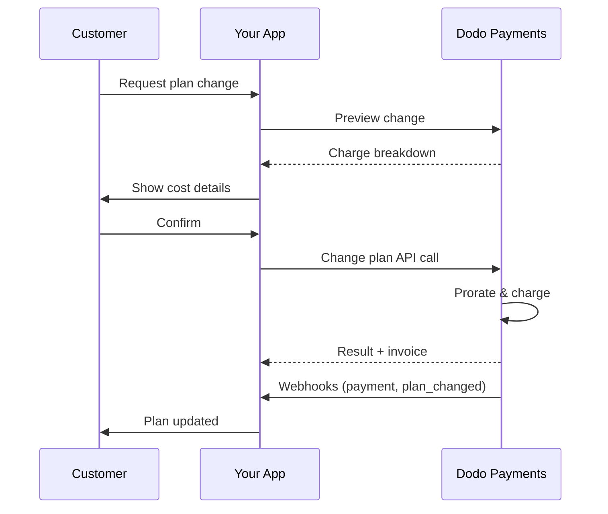
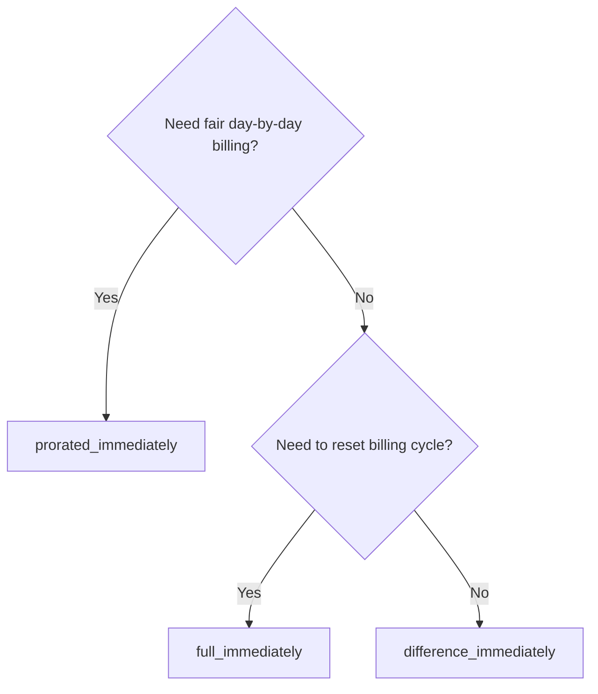
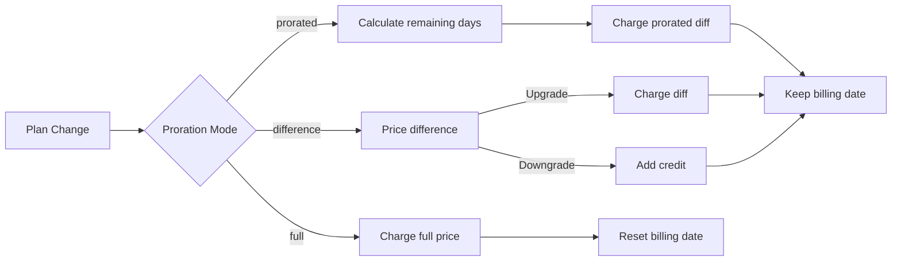

<CardGroup cols={3}>
<Card title="Thay đổi Kế hoạch API" icon="code" href="/api-reference/subscriptions/change-plan">
  Tài liệu API đầy đủ cho việc cập nhật đăng ký.
</Card>
<Card title="Xem trước thay đổi kế hoạch" icon="eye" href="/api-reference/subscriptions/preview-change-plan">
  Xem các khoản phí trước khi thay đổi kế hoạch.
</Card>
<Card title="Hướng dẫn tích hợp" icon="book" href="/developer-resources/subscription-integration-guide">
  Thiết lập đăng ký từng bước.
</Card>
</CardGroup>

## Thay đổi nâng cấp hoặc hạ cấp đăng ký là gì?

Thay đổi kế hoạch cho phép bạn di chuyển một khách hàng giữa các cấp độ hoặc số lượng đăng ký. Sử dụng nó để:
- Điều chỉnh giá cả theo mức sử dụng hoặc tính năng
- Chuyển từ hàng tháng sang hàng năm (hoặc ngược lại)
- Điều chỉnh số lượng cho các sản phẩm theo ghế

<Info>
Thay đổi kế hoạch có thể kích hoạt khoản phí ngay lập tức tùy thuộc vào chế độ phân bổ bạn chọn.
</Info>

## Khi nào sử dụng thay đổi kế hoạch

- Nâng cấp khi khách hàng cần nhiều tính năng, mức sử dụng hoặc ghế hơn
- Hạ cấp khi mức sử dụng giảm
- Di chuyển người dùng đến sản phẩm hoặc giá mới mà không hủy đăng ký của họ

## Quy trình thay đổi kế hoạch



## Điều kiện tiên quyết

Trước khi thực hiện thay đổi kế hoạch đăng ký, hãy đảm bảo bạn có:

- Một tài khoản thương nhân Dodo Payments với các sản phẩm đăng ký đang hoạt động
- Thông tin xác thực API (khóa API và khóa bí mật webhook) từ bảng điều khiển
- Một đăng ký đang hoạt động hiện có để sửa đổi
- Điểm cuối webhook được cấu hình để xử lý các sự kiện đăng ký

<Info>
Để biết hướng dẫn thiết lập chi tiết, hãy xem [Hướng dẫn Tích hợp](/developer-resources/integration-guide#dashboard-setup).
</Info>

## Hướng dẫn Triển khai Từng Bước

Theo dõi hướng dẫn toàn diện này để thực hiện các thay đổi kế hoạch đăng ký trong ứng dụng của bạn:

<Steps>
<Step title="Hiểu yêu cầu thay đổi kế hoạch">
Trước khi thực hiện, xác định:
- Các sản phẩm đăng ký nào có thể thay đổi sang các sản phẩm nào khác
- Chế độ proration nào phù hợp với mô hình kinh doanh của bạn
- Cách xử lý các thay đổi kế hoạch không thành công một cách nhẹ nhàng
- Các sự kiện webhook nào cần theo dõi để quản lý trạng thái

<Tip>
Thử nghiệm các thay đổi kế hoạch một cách kỹ lưỡng trong chế độ thử nghiệm trước khi triển khai trong môi trường sản xuất.
</Tip>
</Step>

<Step title="Chọn Chiến lược Proration của Bạn">
Chọn cách tính phí phù hợp với nhu cầu kinh doanh của bạn:

<Tabs>
<Tab title="prorated_immediately">
Tốt nhất cho: Các ứng dụng SaaS muốn tính phí công bằng cho thời gian không sử dụng
- Tính toán số tiền proration chính xác dựa trên thời gian chu kỳ còn lại
- Tính phí một khoản tiền proration dựa trên thời gian không sử dụng còn lại trong chu kỳ
- Cung cấp hóa đơn minh bạch cho khách hàng
</Tab>

<Tab title="difference_immediately">
Tốt nhất cho: Các tình huống nâng cấp/hạ cấp rõ ràng
- Nâng cấp: Tính phí sự khác biệt ngay lập tức (ví dụ: $30→$80 = tính phí $50)
- Hạ cấp: Tín dụng giá trị còn lại cho các lần gia hạn trong tương lai
- Đơn giản hóa logic tính phí và giao tiếp với khách hàng
</Tab>

<Tab title="full_immediately">
Tốt nhất cho: Khi bạn muốn đặt lại chu kỳ thanh toán
- Tính phí toàn bộ số tiền của kế hoạch mới ngay lập tức
- Bỏ qua thời gian còn lại từ kế hoạch cũ
- Hữu ích cho các chuyển đổi từ hàng năm sang hàng tháng
</Tab>
</Tabs>
</Step>

<Step title="Thực hiện API Thay đổi Kế hoạch">
Sử dụng API Thay đổi Kế hoạch để sửa đổi chi tiết đăng ký:

<ParamField path="subscription_id" type="string" required>
ID của đăng ký đang hoạt động để sửa đổi.
</ParamField>

<ParamField path="product_id" type="string" required>
ID sản phẩm mới để thay đổi đăng ký sang.
</ParamField>

<ParamField path="quantity" type="integer" default="1">
Số lượng đơn vị cho kế hoạch mới (đối với các sản phẩm dựa trên ghế).
</ParamField>

<ParamField path="proration_billing_mode" type="string" required>
Cách xử lý việc thanh toán ngay lập tức: `prorated_immediately`, `full_immediately`, hoặc `difference_immediately`.
</ParamField>

<ParamField path="addons" type="array">
Các tiện ích bổ sung tùy chọn cho kế hoạch mới. Để trống mục này sẽ xóa bất kỳ tiện ích bổ sung nào hiện có.
</ParamField>

<ParamField path="on_payment_failure" type="string">
Điều khiển hành vi khi thanh toán thay đổi kế hoạch bị thất bại:
- `prevent_change`: Giữ đăng ký trên kế hoạch hiện tại cho đến khi thanh toán thành công
- `apply_change` (mặc định): Áp dụng thay đổi kế hoạch ngay lập tức bất kể kết quả thanh toán như thế nào

Nếu không được chỉ định, sử dụng cài đặt mặc định ở cấp độ doanh nghiệp.
</ParamField>
</Step>

<Step title="Xử lý sự kiện Webhook">
Thiết lập xử lý webhook để theo dõi kết quả thay đổi kế hoạch:

- `subscription.active`: Thay đổi kế hoạch thành công, đăng ký đã được cập nhật
- `subscription.plan_changed`: Kế hoạch đăng ký đã thay đổi (nâng cấp/hạ cấp/cập nhật tiện ích bổ sung)
- `subscription.on_hold`: Khoản phí thay đổi kế hoạch thất bại, đăng ký bị tạm ngưng
- `payment.succeeded`: Khoản phí ngay lập tức cho thay đổi kế hoạch thành công
- `payment.failed`: Khoản phí ngay lập tức thất bại

<Warning>
Luôn xác minh các chữ ký webhook và triển khai xử lý sự kiện idempotent.
</Warning>
</Step>

<Step title="Cập nhật Trạng thái Ứng dụng của Bạn">
Dựa trên các sự kiện webhook, cập nhật ứng dụng của bạn:
- Cấp phát/gỡ bỏ tính năng dựa trên kế hoạch mới
- Cập nhật bảng điều khiển khách hàng với thông tin chi tiết về kế hoạch mới
- Gửi email xác nhận về các thay đổi kế hoạch
- Ghi lại các thay đổi thanh toán để phục vụ cho mục đích kiểm toán
</Step>

<Step title="Kiểm tra và Giám sát">
Thực hiện kiểm tra toàn diện việc triển khai của bạn:
- Kiểm tra tất cả các chế độ phân bổ với các kịch bản khác nhau
- Xác minh xử lý webhook hoạt động chính xác
- Giám sát tỷ lệ thành công của thay đổi kế hoạch
- Thiết lập cảnh báo cho các thay đổi kế hoạch thất bại

<Check>
Việc triển khai thay đổi kế hoạch đăng ký của bạn hiện đã sẵn sàng cho việc sử dụng trong sản xuất.
</Check>
</Step>
</Steps>

## Xem trước Thay đổi Kế hoạch

Trước khi cam kết thay đổi kế hoạch, sử dụng API Xem trước để cho khách hàng thấy chính xác những gì họ sẽ bị tính phí:

<Tabs>
<Tab title="Node.js SDK">

```javascript
const preview = await client.subscriptions.previewChangePlan('sub_123', {
  product_id: 'prod_pro',
  quantity: 1,
  proration_billing_mode: 'prorated_immediately'
});

// Show customer the charge before confirming
console.log('Immediate charge:', preview.immediate_charge.summary);
console.log('New plan details:', preview.new_plan);
```

</Tab>

<Tab title="Python SDK">

```python
preview = client.subscriptions.preview_change_plan(
    subscription_id="sub_123",
    product_id="prod_pro",
    quantity=1,
    proration_billing_mode="prorated_immediately"
)

# Show customer the charge before confirming
print("Immediate charge:", preview.immediate_charge.summary)
print("New plan details:", preview.new_plan)
```

</Tab>
</Tabs>

<Tip>
Sử dụng API xem trước để xây dựng các hộp thoại xác nhận cho thấy các khách hàng số tiền chính xác họ sẽ bị tính phí trước khi họ xác nhận thay đổi kế hoạch.
</Tip>

## Thay đổi Kế hoạch API

Sử dụng Thay đổi Kế hoạch API để sửa đổi sản phẩm, số lượng và hành vi phân bổ cho một đăng ký đang hoạt động.

### Ví dụ khởi đầu nhanh

<Tabs>
  <Tab title="Node.js SDK">

    ```javascript
    import DodoPayments from 'dodopayments';

    const client = new DodoPayments({
      bearerToken: process.env.DODO_PAYMENTS_API_KEY,
      environment: 'test_mode', // defaults to 'live_mode'
    });

    async function changePlan() {
      const result = await client.subscriptions.changePlan('sub_123', {
        product_id: 'prod_new',
        quantity: 3,
        proration_billing_mode: 'prorated_immediately',
        on_payment_failure: 'prevent_change', // Optional: control behavior on payment failure
      });
      console.log(result.status, result.invoice_id, result.payment_id);
    }

    changePlan();
    ```

  </Tab>
  <Tab title="Python SDK">

    ```python
    import os
    from dodopayments import DodoPayments

    client = DodoPayments(
        bearer_token=os.environ.get("DODO_PAYMENTS_API_KEY"),
        environment="test_mode",  # defaults to "live_mode"
    )

    result = client.subscriptions.change_plan(
        subscription_id="sub_123",
        product_id="prod_new",
        quantity=3,
        proration_billing_mode="prorated_immediately",
        on_payment_failure="prevent_change",  # Optional: control behavior on payment failure
    )
    print(result.status, result.get("invoice_id"), result.get("payment_id"))
    ```

  </Tab>
  <Tab title="Go SDK">

    ```go
    package main

    import (
      "context"
      "fmt"
      "github.com/dodopayments/dodopayments-go"
      "github.com/dodopayments/dodopayments-go/option"
    )

    func main() {
      client := dodopayments.NewClient(option.WithBearerToken("YOUR_TOKEN"))
      res, err := client.Subscriptions.ChangePlan(context.TODO(), dodopayments.SubscriptionChangePlanParams{
        SubscriptionID: dodopayments.F("sub_123"),
        ProductID:             dodopayments.F("prod_new"),
        Quantity:              dodopayments.F(int64(3)),
        ProrationBillingMode:  dodopayments.F(dodopayments.SubscriptionChangePlanParamsProrationBillingModeProratedImmediately),
        OnPaymentFailure:      dodopayments.F(dodopayments.OnPaymentFailurePreventChange), // Optional
      })
      if err != nil { panic(err) }
      fmt.Println(res.Status, res.InvoiceID, res.PaymentID)
    }
    ```

  </Tab>
  <Tab title="HTTP">

    ```bash
    curl -X POST "$DODO_API_BASE/subscriptions/sub_123/change-plan" \
      -H "Authorization: Bearer $DODO_PAYMENTS_API_KEY" \
      -H "Content-Type: application/json" \
      -d '{
        "product_id": "prod_new",
        "quantity": 3,
        "proration_billing_mode": "prorated_immediately",
        "on_payment_failure": "prevent_change"
      }'
    ```

  </Tab>
</Tabs>

```json Success
{
  "status": "processing",
  "subscription_id": "sub_123",
  "invoice_id": "inv_789",
  "payment_id": "pay_456",
  "proration_billing_mode": "prorated_immediately"
}
```

<Note>
Các trường như <code>invoice_id</code> và <code>payment_id</code> chỉ được trả về khi một khoản phí và/hoặc hóa đơn ngay lập tức được tạo ra trong quá trình thay đổi kế hoạch. Luôn dựa vào các sự kiện webhook (ví dụ: <code>payment.succeeded</code>, <code>subscription.plan_changed</code>) để xác nhận kết quả.
</Note>

<Warning>
Nếu khoản phí ngay lập tức thất bại, thì đăng ký có thể chuyển sang `subscription.on_hold` cho đến khi thanh toán thành công.
</Warning>

## Quản lý Tiện ích bổ sung

Khi thay đổi các kế hoạch đăng ký, bạn cũng có thể sửa đổi các tiện ích bổ sung:

```javascript
// Add addons to the new plan
await client.subscriptions.changePlan('sub_123', {
  product_id: 'prod_new',
  quantity: 1,
  proration_billing_mode: 'difference_immediately',
  addons: [
    { addon_id: 'addon_123', quantity: 2 }
  ]
});

// Remove all existing addons
await client.subscriptions.changePlan('sub_123', {
  product_id: 'prod_new',
  quantity: 1,
  proration_billing_mode: 'difference_immediately',
  addons: [] // Empty array removes all existing addons
});
```

<Info>
Các tiện ích bổ sung được bao gồm trong việc tính toán phân bổ và sẽ được tính phí theo chế độ phân bổ được chọn.
</Info>

## Chế độ phân bổ

Chọn cách tính phí khách hàng khi thay đổi kế hoạch:

#### `prorated_immediately`
- Tính phí cho chênh lệch từng phần trong chu kỳ hiện tại
- Nếu trong thời gian dùng thử, tính phí ngay lập tức và chuyển sang kế hoạch mới ngay bây giờ
- Hạ cấp: có thể tạo ra một khoản tín dụng phân bổ được áp dụng cho các khoản gia hạn sau này

#### `full_immediately`
- Tính phí toàn bộ số tiền của kế hoạch mới ngay lập tức
- Bỏ qua thời gian còn lại từ kế hoạch cũ

<Info>
Các khoản tín dụng được tạo ra bởi việc hạ cấp sử dụng <code>difference_immediately</code> là có phạm vi theo đăng ký và khác với <a href="/features/customer-credit">Tín dụng Khách hàng</a>. Chúng tự động áp dụng cho các lần gia hạn trong tương lai của cùng một đăng ký và không thể chuyển nhượng giữa các đăng ký.
</Info>

#### `difference_immediately`
- Nâng cấp: tính phí ngay lập tức cho chênh lệch giá giữa kế hoạch cũ và mới
- Hạ cấp: thêm giá trị còn lại như một khoản tín dụng nội bộ cho đăng ký và tự động áp dụng trong các lần gia hạn

| Tính năng | `prorated_immediately` | `difference_immediately` | `full_immediately` |
|---------|----------------------|------------------------|-------------------|
| **Phí nâng cấp** | Chênh lệch phân bổ cho các ngày còn lại | Chênh lệch giá đầy đủ giữa các kế hoạch | Giá đầy đủ của kế hoạch mới |
| **Tín dụng hạ cấp** | Tín dụng phân bổ cho các ngày còn lại | Chênh lệch giá đầy đủ như tín dụng | Không có tín dụng |
| **Chu kỳ thanh toán** | Không thay đổi | Không thay đổi | Đặt lại về hôm nay |
| **Hành vi dùng thử** | Kết thúc dùng thử, tính phí ngay lập tức | Kết thúc dùng thử, tính phí ngay lập tức | Kết thúc dùng thử, tính phí toàn bộ số tiền |
| **Tốt nhất cho** | Tính phí công bằng theo thời gian | Toán học đơn giản cho nâng cấp/hạ cấp | Đặt lại chu kỳ thanh toán |
| **Độ phức tạp** | Trung bình (tính toán số ngày) | Thấp (trừ đơn giản) | Thấp (tính phí toàn bộ) |



### Kịch bản ví dụ

Sử dụng các số liệu chuẩn sau một cách đồng nhất:
- Kế hoạch hiện tại: **Cơ bản** với **$30/tháng**
- Mục tiêu nâng cấp: **Chuyên nghiệp** với **$80/tháng**
- Mục tiêu hạ cấp (từ Chuyên nghiệp): **Khởi đầu** với **$20/tháng**
- Chu kỳ thanh toán: **30 ngày**, bắt đầu vào **ngày 1 tháng 1**
- Thay đổi kế hoạch diễn ra vào **ngày 16 tháng 1** (15 ngày còn lại, 15 ngày đã sử dụng)

<AccordionGroup>
  <Accordion title="Nâng cấp: Cơ bản ($30) → Chuyên nghiệp ($80) với prorated_immediately">

    ```
    Step 1: Calculate unused credit from current plan
      Unused days = 15 out of 30 days
      Credit = $30 × (15/30) = $15.00

    Step 2: Calculate prorated cost of new plan
      Remaining days = 15 out of 30 days
      New plan cost = $80 × (15/30) = $40.00

    Step 3: Calculate immediate charge
      Charge = New plan cost − Credit
      Charge = $40.00 − $15.00 = $25.00

    → Customer pays $25.00 now
    → Next renewal (Feb 1): $80.00/month
    ```

    ```javascript
    await client.subscriptions.changePlan('sub_123', {
      product_id: 'prod_pro',
      quantity: 1,
      proration_billing_mode: 'prorated_immediately'
    })
    ```

  </Accordion>

  <Accordion title="Hạ cấp: Chuyên nghiệp ($80) → Khởi đầu ($20) với prorated_immediately">

    ```
    Step 1: Calculate unused credit from current plan
      Unused days = 15 out of 30 days
      Credit = $80 × (15/30) = $40.00

    Step 2: Calculate prorated cost of new plan
      Remaining days = 15 out of 30 days
      New plan cost = $20 × (15/30) = $10.00

    Step 3: Calculate credit balance
      Credit = $40.00 − $10.00 = $30.00

    → No charge — $30.00 credit added to subscription
    → Credit auto-applies to future renewals
    → Next renewal (Feb 1): $20.00 − $30.00 credit = $0.00
    → Following renewal (Mar 1): $20.00 − $10.00 remaining credit = $10.00
    ```

    ```javascript
    await client.subscriptions.changePlan('sub_123', {
      product_id: 'prod_starter',
      quantity: 1,
      proration_billing_mode: 'prorated_immediately'
    })
    ```

  </Accordion>

  <Accordion title="Nâng cấp: Cơ bản ($30) → Chuyên nghiệp ($80) với difference_immediately">

    ```
    Immediate charge = New plan price − Old plan price
                     = $80 − $30
                     = $50.00

    → Customer pays $50.00 now (regardless of cycle position)
    → Next renewal (Feb 1): $80.00/month
    ```

    ```javascript
    await client.subscriptions.changePlan('sub_123', {
      product_id: 'prod_pro',
      quantity: 1,
      proration_billing_mode: 'difference_immediately'
    })
    ```

  </Accordion>

  <Accordion title="Hạ cấp: Chuyên nghiệp ($80) → Khởi đầu ($20) với difference_immediately">

    ```
    Credit = Old plan price − New plan price
           = $80 − $20
           = $60.00

    → No charge — $60.00 credit added to subscription
    → Credit auto-applies to future renewals
    → Next renewal: $20.00 − $20.00 (from credit) = $0.00
    → Following renewal: $20.00 − $20.00 (from credit) = $0.00
    → Third renewal: $20.00 − $20.00 (from remaining credit) = $0.00
    ```

    ```javascript
    await client.subscriptions.changePlan('sub_123', {
      product_id: 'prod_starter',
      quantity: 1,
      proration_billing_mode: 'difference_immediately'
    })
    ```

  </Accordion>

  <Accordion title="Nâng cấp: Cơ bản ($30) → Chuyên nghiệp ($80) với full_immediately">

    ```
    Immediate charge = Full new plan price = $80.00

    → Customer pays $80.00 now
    → No credit for unused time on old plan
    → Billing cycle resets to today (January 16)
    → Next renewal: February 16 at $80.00/month
    ```

    ```javascript
    await client.subscriptions.changePlan('sub_123', {
      product_id: 'prod_pro',
      quantity: 1,
      proration_billing_mode: 'full_immediately'
    })
    ```

  </Accordion>

  <Accordion title="Nâng cấp giữa chu kỳ với tiện ích bổ sung sử dụng prorated_immediately">

    ```
    Current: Basic plan ($30/month), no add-ons
    New: Pro plan ($80/month) + Extra Seats add-on ($10/seat × 3 seats = $30/month)
    Change on day 16 of 30 (15 days remaining)

    Step 1: Credit from current plan
      Credit = $30 × (15/30) = $15.00

    Step 2: Prorated cost of new plan + add-ons
      New plan = $80 × (15/30) = $40.00
      Add-ons = $30 × (15/30) = $15.00
      Total new = $55.00

    Step 3: Immediate charge
      Charge = $55.00 − $15.00 = $40.00

    → Customer pays $40.00 now
    → Next renewal: $80.00 + $30.00 = $110.00/month
    ```

    ```javascript
    await client.subscriptions.changePlan('sub_123', {
      product_id: 'prod_pro',
      quantity: 1,
      proration_billing_mode: 'prorated_immediately',
      addons: [
        { addon_id: 'addon_seats', quantity: 3 }
      ]
    })
    ```

  </Accordion>
</AccordionGroup>

### Cách mỗi chế độ xử lý việc thanh toán



<Tip>
Chọn `prorated_immediately` cho việc kế toán công bằng theo thời gian; chọn `full_immediately` để đặt lại thanh toán; sử dụng `difference_immediately` cho các nâng cấp đơn giản và tín dụng tự động khi hạ cấp.
</Tip>

## Xử lý Các Trường Hợp Thanh Toán Thất Bại

Kiểm soát những gì xảy ra khi thanh toán thay đổi kế hoạch thất bại bằng cách sử dụng tham số `on_payment_failure`.

### Chế độ Thanh Toán Thất Bại

<Tabs>
<Tab title="prevent_change (Được khuyến nghị cho các nâng cấp quan trọng)">
**Hành vi**: Giữ đăng ký trên kế hoạch hiện tại cho đến khi thanh toán thành công.

- Thay đổi kế hoạch được đánh dấu là "đang chờ"
- Khách hàng giữ quyền truy cập vào kế hoạch hiện tại của họ
- Đăng ký chuyển sang trạng thái `active` chỉ sau khi thanh toán thành công
- Hữu ích khi bạn muốn đảm bảo thanh toán trước khi cung cấp các tính năng nâng cấp

```javascript
await client.subscriptions.changePlan('sub_123', {
  product_id: 'prod_pro',
  quantity: 1,
  proration_billing_mode: 'prorated_immediately',
  on_payment_failure: 'prevent_change'
});
```

</Tab>

<Tab title="apply_change (Mặc định)">
**Hành vi**: Áp dụng thay đổi kế hoạch ngay lập tức bất kể kết quả thanh toán như thế nào.

- Thay đổi kế hoạch được áp dụng ngay cả khi thanh toán thất bại
- Khách hàng có quyền truy cập ngay lập tức vào kế hoạch mới
- Đăng ký có thể chuyển sang `on_hold` nếu thanh toán thất bại
- Tốt cho các nâng cấp không quan trọng hoặc khi bạn tin tưởng khách hàng

```javascript
await client.subscriptions.changePlan('sub_123', {
  product_id: 'prod_pro',
  quantity: 1,
  proration_billing_mode: 'prorated_immediately',
  on_payment_failure: 'apply_change' // This is the default
});
```

</Tab>
</Tabs>

<Info>
Nếu không được chỉ định, tham số `on_payment_failure` sẽ sử dụng cài đặt mặc định cấp độ doanh nghiệp của bạn được cấu hình trong bảng điều khiển.
</Info>

### Khi nào sử dụng mỗi chế độ

| Kịch bản | Chế độ được khuyến nghị | Lý do |
|----------|------------------|--------|
| Nâng cấp lên các tính năng cao cấp | `prevent_change` | Đảm bảo thanh toán trước khi cấp quyền truy cập |
| Tăng số lượng (nhiều ghế hơn) | `prevent_change` | Ngăn chặn việc sử dụng mà không có thanh toán |
| Hạ cấp các kế hoạch | `apply_change` | Khách hàng đang giảm chi tiêu |
| Khách hàng doanh nghiệp đáng tin cậy | `apply_change` | Giảm rủi ro về việc không thanh toán |
| Chuyển từ dùng thử sang trả phí | `prevent_change` | Thời điểm thanh toán quan trọng |

## Xử lý webhooks

Theo dõi trạng thái đăng ký thông qua các webhook để xác nhận các thay đổi kế hoạch và thanh toán.

### Các loại sự kiện cần xử lý
- `subscription.active`: đăng ký được kích hoạt
- `subscription.plan_changed`: kế hoạch đăng ký đã thay đổi (nâng cấp/hạ cấp/các thay đổi tiện ích bổ sung)
- `subscription.on_hold`: khoản phí thất bại, đăng ký bị tạm ngưng
- `subscription.renewed`: gia hạn thành công
- `payment.succeeded`: thanh toán cho thay đổi kế hoạch hoặc gia hạn thành công
- `payment.failed`: thanh toán thất bại

<Info>
Chúng tôi khuyên bạn nên điều khiển logic doanh nghiệp từ các sự kiện đăng ký và sử dụng các sự kiện thanh toán để xác nhận và đối chiếu.
</Info>

### Xác minh chữ ký và xử lý ý định

<Tabs>
  <Tab title="Next.js Route Handler">

    ```javascript
    import { NextRequest, NextResponse } from 'next/server';
    
    export async function POST(req) {
      const webhookId = req.headers.get('webhook-id');
      const webhookSignature = req.headers.get('webhook-signature');
      const webhookTimestamp = req.headers.get('webhook-timestamp');
      const secret = process.env.DODO_WEBHOOK_SECRET;
    
      const payload = await req.text();
      // verifySignature is a placeholder – in production, use a Standard Webhooks library
      const { valid, event } = await verifySignature(
        payload,
        { id: webhookId, signature: webhookSignature, timestamp: webhookTimestamp },
        secret
      );
      if (!valid) return NextResponse.json({ error: 'Invalid signature' }, { status: 400 });
    
      switch (event.type) {
        case 'subscription.active':
          // mark subscription active in your DB
          break;
        case 'subscription.plan_changed':
          // refresh entitlements and reflect the new plan in your UI
          break;
        case 'subscription.on_hold':
          // notify user to update payment method
          break;
        case 'subscription.renewed':
          // extend access window
          break;
        case 'payment.succeeded':
          // reconcile payment for plan change
          break;
        case 'payment.failed':
          // log and alert
          break;
        default:
          // ignore unknown events
          break;
      }
    
      return NextResponse.json({ received: true });
    }
    ```

  </Tab>
  <Tab title="Express.js">

    ```javascript
    import express from 'express';
    
    const app = express();
    app.post('/webhooks/dodo', express.raw({ type: 'application/json' }), async (req, res) => {
      const webhookId = req.header('webhook-id');
      const webhookSignature = req.header('webhook-signature');
      const webhookTimestamp = req.header('webhook-timestamp');
      const secret = process.env.DODO_WEBHOOK_SECRET;
      const payload = req.body.toString('utf8');
    
      const { valid, event } = await verifySignature(
        payload,
        { id: webhookId, signature: webhookSignature, timestamp: webhookTimestamp },
        secret
      );
      if (!valid) return res.status(400).send('Invalid signature');
    
      // handle events like above
      res.json({ received: true });
    });
    
    app.listen(3000);
    ```

  </Tab>
</Tabs>

<Note>
Để biết cấu trúc tải trọng chi tiết, xem <a href="/developer-resources/webhooks/intents/subscription">Tải trọng webhook Đăng ký</a> và <a href="/developer-resources/webhooks/intents/payment">Tải trọng webhook Thanh toán</a>.
</Note>

## Các Thực Hành Tốt Nhất

Thực hiện các khuyến nghị sau để thay đổi kế hoạch đăng ký đáng tin cậy:

### Chiến lược Thay đổi Kế hoạch
- **Kiểm tra kỹ lưỡng**: Luôn kiểm tra thay đổi kế hoạch trong chế độ kiểm tra trước khi đưa vào sản xuất
- **Chọn phân bổ cẩn thận**: Chọn chế độ phân bổ tương thích với mô hình kinh doanh của bạn
- **Xử lý các thất bại một cách duyên dáng**: Triển khai xử lý lỗi phù hợp và logic thử lại
- **Giám sát tỷ lệ thành công**: Theo dõi tỷ lệ thành công/thất bại của thay đổi kế hoạch và điều tra các vấn đề

### Triển khai Webhook
- **Xác minh chữ ký**: Luôn xác minh chữ ký webhook để đảm bảo tính xác thực
- **Triển khai idempotency**: Xử lý các sự kiện webhook trùng lặp một cách duyên dáng
- **Xử lý bất đồng bộ**: Đừng chặn phản hồi webhook bằng các thao tác nặng nề
- **Ghi lại mọi thứ**: Duy trì nhật ký chi tiết để phục vụ cho việc gỡ lỗi và kiểm toán

### Trải nghiệm Người Dùng
- **Giao tiếp rõ ràng**: Thông báo cho khách hàng về các thay đổi thanh toán và thời gian
- **Cung cấp xác nhận**: Gửi email xác nhận cho các thay đổi kế hoạch thành công
- **Xử lý các tình huống đặc biệt**: Cân nhắc thời gian dùng thử, phân bổ và thanh toán thất bại
- **Cập nhật UI ngay lập tức**: Phản ánh các thay đổi kế hoạch trong giao diện ứng dụng của bạn

## Các Vấn Đề Thường Gặp và Giải Pháp

Giải quyết các vấn đề điển hình gặp phải trong quá trình thay đổi kế hoạch đăng ký:

<AccordionGroup>
<Accordion title="Khoản phí được tạo nhưng đăng ký không được cập nhật">
**Triệu chứng**: Lệnh API thành công nhưng đăng ký vẫn giữ kế hoạch cũ

**Nguyên nhân phổ biến**:
- Xử lý webhook thất bại hoặc bị trì hoãn
- Trạng thái ứng dụng không được cập nhật sau khi nhận webhook
- Vấn đề giao dịch cơ sở dữ liệu trong quá trình cập nhật trạng thái

**Giải pháp**:
- Triển khai xử lý webhook vững chắc với logic thử lại
- Sử dụng các thao tác idempotent cho việc cập nhật trạng thái
- Thêm giám sát để phát hiện và cảnh báo về các sự kiện webhook bị bỏ lỡ
- Xác minh điểm cuối webhook có thể truy cập và phản hồi đúng
</Accordion>

<Accordion title="Tín dụng không được áp dụng sau khi hạ cấp">
**Triệu chứng**: Khách hàng hạ cấp nhưng không thấy số dư tín dụng

**Nguyên nhân phổ biến**:
- Mong đợi chế độ phân bổ: việc hạ cấp tín dụng chênh lệch số tiền giữa các kế hoạch với `difference_immediately`, trong khi `prorated_immediately` tạo ra một khoản tín dụng phân bổ dựa trên thời gian còn lại trong chu kỳ
- Tín dụng là cụ thể cho đăng ký và không chuyển nhượng giữa các đăng ký
- Số dư tín dụng không hiển thị trong bảng điều khiển khách hàng

**Giải pháp**:
- Sử dụng `difference_immediately` cho các hạ cấp khi bạn muốn tự động tín dụng
- Giải thích cho khách hàng rằng tín dụng áp dụng cho các lần gia hạn trong tương lai của cùng một đăng ký
- Triển khai cổng thông tin khách hàng để hiển thị số dư tín dụng
- Kiểm tra xem đơn hóa đơn tiếp theo có tín dụng đã áp dụng hay không
</Accordion>

<Accordion title="Xác minh chữ ký webhook không thành công">
**Triệu chứng**: Các sự kiện webhook bị từ chối do chữ ký không hợp lệ

**Nguyên nhân phổ biến**:
- Khóa bí mật webhook không chính xác
- Nội dung yêu cầu gốc đã được sửa đổi trước khi xác minh chữ ký
- Thuật toán xác minh chữ ký sai

**Giải pháp**:
- Xác minh rằng bạn đang sử dụng `DODO_WEBHOOK_SECRET` đúng từ bảng điều khiển
- Đọc nội dung yêu cầu gốc trước bất kỳ middleware phân tích cú pháp JSON nào
- Sử dụng thư viện xác minh webhook tiêu chuẩn cho nền tảng của bạn
- Kiểm tra xác minh chữ ký webhook trong môi trường phát triển
</Accordion>

<Accordion title="Thay đổi kế hoạch thất bại với lỗi 422">
**Triệu chứng**: API trả về lỗi 422 Unprocessable Entity

**Nguyên nhân phổ biến**:
- ID đăng ký không hợp lệ hoặc ID sản phẩm
- Đăng ký không ở trạng thái hoạt động
- Thiếu các tham số bắt buộc
- Sản phẩm không khả dụng cho các thay đổi kế hoạch

**Giải pháp**:
- Xác minh rằng đăng ký tồn tại và đang hoạt động
- Kiểm tra ID sản phẩm có hợp lệ và khả dụng không
- Đảm bảo tất cả các tham số bắt buộc được cung cấp
- Xem xét tài liệu API cho các yêu cầu tham số
</Accordion>

<Accordion title="Khoản phí ngay lập tức thất bại trong quá trình thay đổi kế hoạch">
**Triệu chứng**: Thay đổi kế hoạch đã được khởi tạo nhưng khoản phí ngay lập tức thất bại

**Nguyên nhân phổ biến**:
- Thiếu tiền trong phương thức thanh toán của khách hàng
- Phương thức thanh toán đã hết hạn hoặc không hợp lệ
- Ngân hàng đã từ chối giao dịch
- Phát hiện gian lận đã chặn khoản phí

**Giải pháp**:
- Xử lý các sự kiện webhook `payment.failed` một cách phù hợp
- Thông báo cho khách hàng cập nhật phương thức thanh toán
- Triển khai logic thử lại cho các lỗi tạm thời
- Cân nhắc cho phép thay đổi kế hoạch với các khoản phí ngay lập tức bị thất bại
</Accordion>

<Accordion title="Đăng ký bị tạm hoãn sau khi thay đổi kế hoạch">
**Triệu chứng**: Khoản phí thay đổi kế hoạch thất bại và đăng ký chuyển sang trạng thái `on_hold`

**Điều gì xảy ra**:
Khi một khoản phí thay đổi kế hoạch thất bại, đăng ký sẽ tự động được đặt vào trạng thái `on_hold`. Đăng ký sẽ không tự động gia hạn cho đến khi phương thức thanh toán được cập nhật.

**Giải pháp**: Cập nhật phương thức thanh toán để kích hoạt lại đăng ký

Để kích hoạt lại một đăng ký từ trạng thái `on_hold` sau khi một thay đổi kế hoạch thất bại:

1. **Cập nhật phương thức thanh toán** bằng cách sử dụng API Cập nhật Phương thức Thanh toán
2. **Tạo phí tự động**: API tự động tạo một khoản phí cho các khoản nợ còn lại
3. **Tạo hóa đơn**: Một hóa đơn được tạo cho khoản phí
4. **Xử lý thanh toán**: Thanh toán được xử lý bằng phương thức thanh toán mới
5. **Kích hoạt lại**: Sau khi thanh toán thành công, đăng ký được kích hoạt lại sang trạng thái `active`

<CodeGroup>

```javascript Node.js
// Reactivate subscription from on_hold after failed plan change
async function reactivateAfterFailedPlanChange(subscriptionId) {
  // Update payment method - automatically creates charge for remaining dues
  const response = await client.subscriptions.updatePaymentMethod(subscriptionId, {
    type: 'new',
    return_url: 'https://example.com/return'
  });
  
  if (response.payment_id) {
    console.log('Charge created for remaining dues:', response.payment_id);
    console.log('Payment link:', response.payment_link);
    
    // Redirect customer to payment_link to complete payment
    // Monitor webhooks for:
    // 1. payment.succeeded - charge succeeded
    // 2. subscription.active - subscription reactivated
  }
  
  return response;
}

// Or use existing payment method if available
async function reactivateWithExistingPaymentMethod(subscriptionId, paymentMethodId) {
  const response = await client.subscriptions.updatePaymentMethod(subscriptionId, {
    type: 'existing',
    payment_method_id: paymentMethodId
  });
  
  // Monitor webhooks for payment.succeeded and subscription.active
  return response;
}
```

```python Python
# Reactivate subscription from on_hold after failed plan change
def reactivate_after_failed_plan_change(subscription_id):
    # Update payment method - automatically creates charge for remaining dues
    response = client.subscriptions.update_payment_method(
        subscription_id=subscription_id,
        type="new",
        return_url="https://example.com/return"
    )
    
    if response.payment_id:
        print("Charge created for remaining dues:", response.payment_id)
        print("Payment link:", response.payment_link)
        
        # Redirect customer to payment_link to complete payment
        # Monitor webhooks for:
        # 1. payment.succeeded - charge succeeded
        # 2. subscription.active - subscription reactivated
    
    return response

# Or use existing payment method if available
def reactivate_with_existing_payment_method(subscription_id, payment_method_id):
    response = client.subscriptions.update_payment_method(
        subscription_id=subscription_id,
        type="existing",
        payment_method_id=payment_method_id
    )
    
    # Monitor webhooks for payment.succeeded and subscription.active
    return response
```

</CodeGroup>

**Sự kiện webhook cần theo dõi**:
- `subscription.on_hold`: Đăng ký tạm hoãn (nhận được khi khoản phí thay đổi kế hoạch thất bại)
- `payment.succeeded`: Thanh toán cho các khoản nợ còn lại thành công (sau khi cập nhật phương thức thanh toán)
- `subscription.active`: Đăng ký được kích hoạt lại sau khi thanh toán thành công

**Các thực hành tốt nhất**:
- Thông báo ngay lập tức cho khách hàng khi khoản phí thay đổi kế hoạch thất bại
- Cung cấp hướng dẫn rõ ràng về cách cập nhật phương thức thanh toán của họ
- Giám sát các sự kiện webhook để theo dõi trạng thái kích hoạt lại
- Cân nhắc triển khai logic thử lại tự động cho các lỗi thanh toán tạm thời

<Card title="Tài liệu tham khảo API Cập nhật Phương thức Thanh toán" icon="code" href="/api-reference/subscriptions/update-payment-method">
Xem tài liệu API đầy đủ cho việc cập nhật phương thức thanh toán và kích hoạt lại các đăng ký.
</Card>
</Accordion>
</AccordionGroup>

## Kiểm tra Việc Triển khai của Bạn

Thực hiện theo các bước sau để kiểm tra kỹ lưỡng việc triển khai thay đổi kế hoạch đăng ký của bạn:

<Steps>
<Step title="Thiết lập môi trường kiểm tra">
- Sử dụng khóa API kiểm tra và sản phẩm kiểm tra
- Tạo các đăng ký kiểm tra với các loại kế hoạch khác nhau
- Cấu hình điểm cuối webhook kiểm tra
- Thiết lập giám sát và ghi log
</Step>

<Step title="Kiểm tra các chế độ phân bổ khác nhau">
- Kiểm tra `prorated_immediately` với các vị trí chu kỳ thanh toán khác nhau
- Kiểm tra `difference_immediately` cho việc nâng cấp và hạ cấp
- Kiểm tra `full_immediately` để đặt lại chu kỳ thanh toán
- Xác minh rằng việc tính toán tín dụng là chính xác
</Step>

<Step title="Kiểm tra xử lý webhook">
- Xác minh rằng tất cả các sự kiện webhook liên quan được nhận
- Kiểm tra xác minh chữ ký webhook
- Xử lý các sự kiện webhook trùng lặp một cách duyên dáng
- Kiểm tra các kịch bản thất bại trong xử lý webhook
</Step>

<Step title="Kiểm tra các kịch bản lỗi">
- Kiểm tra với ID đăng ký không hợp lệ
- Kiểm tra với phương thức thanh toán đã hết hạn
- Kiểm tra sự cố mạng và thời gian chờ
- Kiểm tra với số dư không đủ
</Step>

<Step title="Giám sát trong sản xuất">
- Thiết lập cảnh báo cho các thay đổi kế hoạch thất bại
- Giám sát thời gian xử lý webhook
- Theo dõi tỷ lệ thành công của thay đổi kế hoạch
- Xem xét các vé hỗ trợ khách hàng cho các vấn đề liên quan đến thay đổi kế hoạch
</Step>
</Steps>

## Xử lý Lỗi

Xử lý các lỗi API thông thường một cách duyên dáng trong việc triển khai của bạn:

### Mã trạng thái HTTP

<AccordionGroup>
<Accordion title="200 OK">
Yêu cầu thay đổi kế hoạch được xử lý thành công. Đăng ký đang được cập nhật và việc xử lý thanh toán đã bắt đầu.
</Accordion>

<Accordion title="400 Bad Request">
Các tham số yêu cầu không hợp lệ. Kiểm tra tất cả các trường bắt buộc đã được cung cấp và định dạng đúng.
</Accordion>

<Accordion title="401 Unauthorized">
Khóa API không hợp lệ hoặc bị thiếu. Xác minh rằng `DODO_PAYMENTS_API_KEY` của bạn là chính xác và có quyền truy cập đúng.
</Accordion>

<Accordion title="404 Not Found">
ID đăng ký không tìm thấy hoặc không thuộc về tài khoản của bạn.
</Accordion>

<Accordion title="422 Unprocessable Entity">
Không thể thay đổi đăng ký (ví dụ: đã bị hủy, sản phẩm không khả dụng, v.v.).
</Accordion>

<Accordion title="500 Internal Server Error">
Đã xảy ra lỗi máy chủ. Thử lại yêu cầu sau một khoảng thời gian ngắn.
</Accordion>
</AccordionGroup>

### Định dạng Phản hồi Lỗi

```json
{
  "error": {
    "code": "subscription_not_found",
    "message": "The subscription with ID 'sub_123' was not found",
    "details": {
      "subscription_id": "sub_123"
    }
  }
}
```

## Các bước tiếp theo

- Xem <a href="/api-reference/subscriptions/change-plan">Change Plan API</a>
- Khám phá <a href="/features/customer-credit">Tín dụng Khách hàng</a>
- Triển khai các cảnh báo cho `subscription.on_hold`
- Xem hướng dẫn <a href="/developer-resources/webhooks">Tích hợp Webhook</a>
