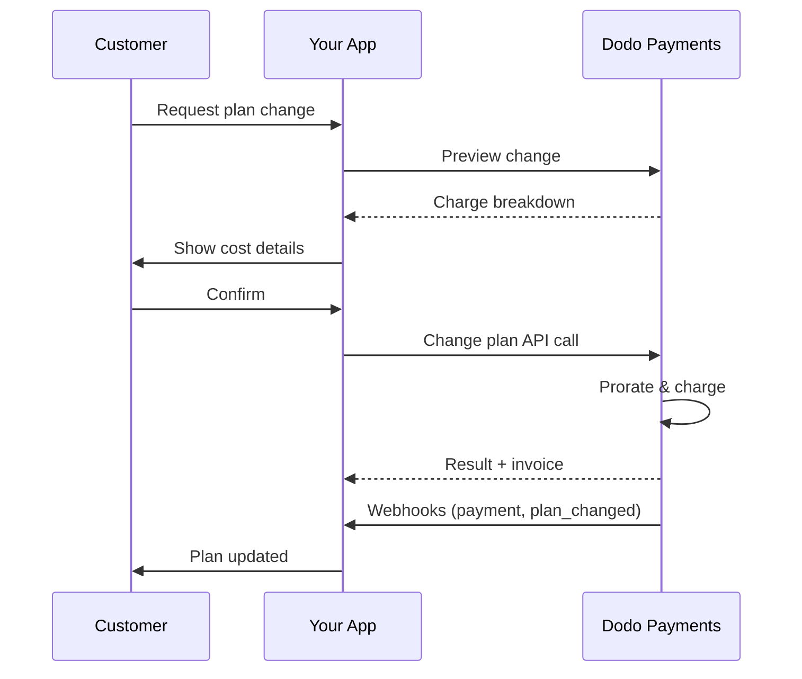
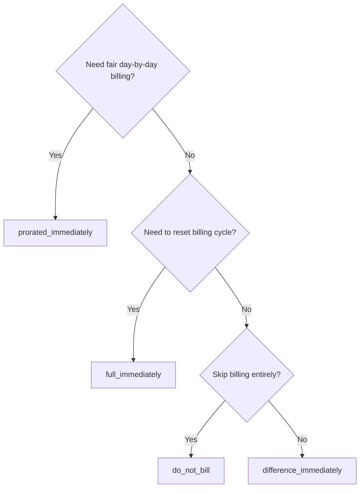
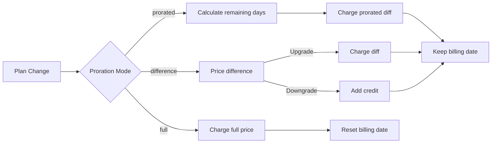

<CardGroup cols={3}>
<Card title="Change Plan API" icon="code" href="/api-reference/subscriptions/change-plan">
  Full API docs for updating subscriptions.
</Card>
<Card title="Plan Change Preview" icon="eye" href="/api-reference/subscriptions/preview-change-plan">
  See charge amounts before changing plans.
</Card>
<Card title="Integration Guide" icon="book" href="/developer-resources/subscription-integration-guide">
  Step-by-step subscription setup.
</Card>
</CardGroup>

## What is a subscription upgrade or downgrade?

Changing plans lets you move a customer between subscription tiers or quantities. Use it to:
- Align pricing with usage or features
- Move from monthly to annual (or vice versa)
- Adjust quantity for seat-based products

<Info>
Plan changes can trigger an immediate charge depending on the proration mode you choose.
</Info>

## When to use plan changes

- Upgrade when a customer needs more features, usage, or seats
- Downgrade when usage decreases
- Migrate users to a new product or price without cancelling their subscription

## Plan Change Flow



## Prerequisites

Before implementing subscription plan changes, ensure you have:

- A Dodo Payments merchant account with active subscription products
- API credentials (API key and webhook secret key) from the dashboard
- An existing active subscription to modify
- Webhook endpoint configured to handle subscription events

<Info>
For detailed setup instructions, see our [Integration Guide](/developer-resources/integration-guide#dashboard-setup).
</Info>

## Step-by-Step Implementation Guide

Follow this comprehensive guide to implement subscription plan changes in your application:

<Steps>
<Step title="Understand Plan Change Requirements">
Before implementing, determine:
- Which subscription products can be changed to which others
- What proration mode fits your business model
- How to handle failed plan changes gracefully
- Which webhook events to track for state management

<Tip>
Test plan changes thoroughly in test mode before implementing in production.
</Tip>
</Step>

<Step title="Choose Your Proration Strategy">
Select the billing approach that aligns with your business needs:

<Tabs>
<Tab title="prorated_immediately">
Best for: SaaS applications wanting to charge fairly for unused time
- Calculates exact prorated amount based on remaining cycle time
- Charges a prorated amount based on unused time remaining in the cycle
- Provides transparent billing to customers
</Tab>

<Tab title="difference_immediately">
Best for: Clear upgrade/downgrade scenarios
- Upgrade: Charge immediate difference (e.g., $30→$80 = charge $50)
- Downgrade: Credit remaining value for future renewals
- Simplifies billing logic and customer communication
</Tab>

<Tab title="full_immediately">
Tốt nhất cho: Khi bạn muốn đặt lại chu kỳ thanh toán
- Tính toàn bộ số tiền của gói mới ngay lập tức
- Bỏ qua thời gian còn lại từ gói cũ
- Hữu ích cho chuyển từ hàng năm sang hàng tháng
</Tab>

{/* LOCKED_PATTERN_7fa7f81fc66b83c441dd56aff76d586c */}
Tốt nhất cho: Di chuyển miễn phí, chuyển đổi miễn phí, hoặc hấp thụ sự khác biệt chi phí
- Không tính phí hoặc tín dụng
- Khách hàng chuyển sang gói mới ngay lập tức mà không cần điều chỉnh hóa đơn
- Chu kỳ thanh toán không thay đổi
</Tab>
</Tabs>
</Step>

<Step title="Implement the Change Plan API">
Sử dụng API Thay đổi Gói để thay đổi chi tiết đăng ký:

<ParamField path="subscription_id" type="string" required>
ID của đăng ký đang hoạt động cần thay đổi.
</ParamField>

<ParamField path="product_id" type="string" required>
ID sản phẩm mới để thay đổi đăng ký.
</ParamField>

<ParamField path="quantity" type="integer" default="1">
Số lượng đơn vị cho gói mới (đối với các sản phẩm tính theo chỗ ngồi).
</ParamField>

<ParamField path="proration_billing_mode" type="string" required>
Cách xử lý thanh toán ngay lập tức: `prorated_immediately`, `full_immediately`, `difference_immediately`, hoặc `do_not_bill`.
</ParamField>

<ParamField path="addons" type="array">
Addons tùy chọn cho gói mới. Để trống để xóa bỏ bất kỳ addons hiện tại.
</ParamField>

<ParamField path="on_payment_failure" type="string">
Kiểm soát hành vi khi thanh toán thay đổi gói thất bại:
- `prevent_change`: Giữ đăng ký trên gói hiện tại cho đến khi thanh toán thành công
- `apply_change` (mặc định): Áp dụng thay đổi gói ngay lập tức bất kể kết quả thanh toán

Nếu không xác định rõ, sử dụng thiết lập mặc định ở mức doanh nghiệp.

<ParamField path="discount_code" type="string">
Mã giảm giá tùy chọn để áp dụng cho gói mới. Nếu được cung cấp, xác nhận và áp dụng giảm giá cho thay đổi gói. Nếu không được cung cấp và đăng ký có mã giảm giá hiện tại với `preserve_on_plan_change=true`, mã giảm giá hiện tại sẽ được giữ lại (nếu áp dụng cho sản phẩm mới).
</ParamField>
</Step>

<Step title="Handle Webhook Events">
Thiết lập xử lý webhook để theo dõi kết quả thay đổi gói:

- `subscription.active`: Thay đổi gói thành công, cập nhật đăng ký
- `subscription.plan_changed`: Đã thay đổi gói đăng ký (nâng cấp/hạ cấp/cập nhật addon)
- `subscription.on_hold`: Thay đổi gói thất bại, đăng ký bị tạm dừng
- `payment.succeeded`: Thay đổi gói ngay lập tức thành công
- `payment.failed`: Thay đổi ngay lập tức thất bại

<Warning>
Luôn luôn xác minh chữ ký webhook và triển khai xử lý sự kiện không lặp lại.
</Warning>
</Step>

<Step title="Update Your Application State">
Dựa trên sự kiện webhook, cập nhật ứng dụng của bạn:
- Cấp quyền/thu hồi tính năng dựa trên gói mới
- Cập nhật bảng điều khiển khách hàng với chi tiết gói mới
- Gửi email xác nhận về thay đổi gói
- Ghi lại thay đổi thanh toán cho mục đích kiểm toán
</Step>

<Step title="Test and Monitor">
Kiểm tra kỹ lưỡng việc triển khai của bạn:
- Kiểm tra tất cả các chế độ điều tiết với các trường hợp khác nhau
- Xác minh xử lý webhook hoạt động đúng cách
- Theo dõi tỷ lệ thành công khi thay đổi gói
- Thiết lập thông báo cho các thay đổi gói thất bại

<Check>
Việc triển khai thay đổi gói đăng ký của bạn hiện đã sẵn sàng cho việc sử dụng thực tế.
</Check>
</Step>
</Steps>

## Xem trước Thay đổi Gói

Trước khi cam kết thay đổi gói, sử dụng API Xem trước để cho khách hàng thấy chính xác những gì họ sẽ phải trả:

<Tabs>
<Tab title="Node.js SDK">

```javascript
const preview = await client.subscriptions.previewChangePlan('sub_123', {
  product_id: 'prod_pro',
  quantity: 1,
  proration_billing_mode: 'prorated_immediately'
});

// Show customer the charge before confirming
console.log('Immediate charge:', preview.immediate_charge.summary);
console.log('New plan details:', preview.new_plan);
```

</Tab>

<Tab title="Python SDK">

```python
preview = client.subscriptions.preview_change_plan(
    subscription_id="sub_123",
    product_id="prod_pro",
    quantity=1,
    proration_billing_mode="prorated_immediately"
)

# Show customer the charge before confirming
print("Immediate charge:", preview.immediate_charge.summary)
print("New plan details:", preview.new_plan)
```

</Tab>
</Tabs>

<Tip>
Sử dụng API xem trước để tạo các hộp thoại xác nhận hiển thị cho khách hàng chính xác số tiền họ sẽ bị tính trước khi xác nhận thay đổi gói.
</Tip>

## Thay đổi API Gói

Sử dụng API Thay đổi Gói để sửa đổi sản phẩm, số lượng và hành vi điều tiết cho một đăng ký đang hoạt động.

### Ví dụ bắt đầu nhanh

<Tabs>
  <Tab title="Node.js SDK">

    ```javascript
    import DodoPayments from 'dodopayments';

    const client = new DodoPayments({
      bearerToken: process.env.DODO_PAYMENTS_API_KEY,
      environment: 'test_mode', // defaults to 'live_mode'
    });

    async function changePlan() {
      const result = await client.subscriptions.changePlan('sub_123', {
        product_id: 'prod_new',
        quantity: 3,
        proration_billing_mode: 'prorated_immediately',
        on_payment_failure: 'prevent_change', // Optional: control behavior on payment failure
      });
      console.log(result.status, result.invoice_id, result.payment_id);
    }

    changePlan();
    ```

  </Tab>
  <Tab title="Python SDK">

    ```python
    import os
    from dodopayments import DodoPayments

    client = DodoPayments(
        bearer_token=os.environ.get("DODO_PAYMENTS_API_KEY"),
        environment="test_mode",  # defaults to "live_mode"
    )

    result = client.subscriptions.change_plan(
        subscription_id="sub_123",
        product_id="prod_new",
        quantity=3,
        proration_billing_mode="prorated_immediately",
        on_payment_failure="prevent_change",  # Optional: control behavior on payment failure
    )
    print(result.status, result.get("invoice_id"), result.get("payment_id"))
    ```

  </Tab>
  <Tab title="Go SDK">

    ```go
    package main

    import (
      "context"
      "fmt"
      "github.com/dodopayments/dodopayments-go"
      "github.com/dodopayments/dodopayments-go/option"
    )

    func main() {
      client := dodopayments.NewClient(option.WithBearerToken("YOUR_TOKEN"))
      res, err := client.Subscriptions.ChangePlan(context.TODO(), dodopayments.SubscriptionChangePlanParams{
        SubscriptionID: dodopayments.F("sub_123"),
        ProductID:             dodopayments.F("prod_new"),
        Quantity:              dodopayments.F(int64(3)),
        ProrationBillingMode:  dodopayments.F(dodopayments.SubscriptionChangePlanParamsProrationBillingModeProratedImmediately),
        OnPaymentFailure:      dodopayments.F(dodopayments.OnPaymentFailurePreventChange), // Optional
      })
      if err != nil { panic(err) }
      fmt.Println(res.Status, res.InvoiceID, res.PaymentID)
    }
    ```

  </Tab>
  <Tab title="HTTP">

    ```bash
    curl -X POST "$DODO_API_BASE/subscriptions/sub_123/change-plan" \
      -H "Authorization: Bearer $DODO_PAYMENTS_API_KEY" \
      -H "Content-Type: application/json" \
      -d '{
        "product_id": "prod_new",
        "quantity": 3,
        "proration_billing_mode": "prorated_immediately",
        "on_payment_failure": "prevent_change"
      }'
    ```

  </Tab>
</Tabs>

```json Success
{
  "status": "processing",
  "subscription_id": "sub_123",
  "invoice_id": "inv_789",
  "payment_id": "pay_456",
  "proration_billing_mode": "prorated_immediately"
}
```

<Note>
Các trường như <code>invoice_id</code> và <code>payment_id</code> chỉ được trả về khi một khoản phí ngay lập tức và/hoặc hóa đơn được tạo ra trong quá trình thay đổi gói. Luôn luôn dựa vào sự kiện webhook (ví dụ: <code>payment.succeeded</code>, <code>subscription.plan_changed</code>) để xác nhận kết quả.
</Note>

<Warning>
Nếu khoản phí ngay lập tức thất bại, đăng ký có thể chuyển sang `subscription.on_hold` cho đến khi thanh toán thành công.
</Warning>

## Quản lý Addons

Khi thay đổi gói đăng ký, bạn cũng có thể sửa đổi addons:

```javascript
// Add addons to the new plan
await client.subscriptions.changePlan('sub_123', {
  product_id: 'prod_new',
  quantity: 1,
  proration_billing_mode: 'difference_immediately',
  addons: [
    { addon_id: 'addon_123', quantity: 2 }
  ]
});

// Remove all existing addons
await client.subscriptions.changePlan('sub_123', {
  product_id: 'prod_new',
  quantity: 1,
  proration_billing_mode: 'difference_immediately',
  addons: [] // Empty array removes all existing addons
});
```

<Info>
Addons được bao gồm trong tính toán điều tiết và sẽ được tính phí theo chế độ điều tiết đã chọn.
</Info>

## Áp dụng Mã Giảm Giá

Bạn có thể áp dụng mã giảm giá khi thay đổi các gói đăng ký. Điều này hữu ích cho việc cung cấp giá khuyến mãi khi nâng cấp hoặc di chuyển.

<Tabs>
<Tab title="Node.js SDK">

```javascript
// Apply a discount code during plan change
await client.subscriptions.changePlan('sub_123', {
  product_id: 'prod_pro',
  quantity: 1,
  proration_billing_mode: 'prorated_immediately',
  discount_code: 'UPGRADE20'
});
```

</Tab>
<Tab title="Python SDK">

```python
# Apply a discount code during plan change
client.subscriptions.change_plan(
    subscription_id="sub_123",
    product_id="prod_pro",
    quantity=1,
    proration_billing_mode="prorated_immediately",
    discount_code="UPGRADE20"
)
```

</Tab>
<Tab title="HTTP">

```bash
curl -X POST "$DODO_API_BASE/subscriptions/sub_123/change-plan" \
  -H "Authorization: Bearer $DODO_PAYMENTS_API_KEY" \
  -H "Content-Type: application/json" \
  -d '{
    "product_id": "prod_pro",
    "quantity": 1,
    "proration_billing_mode": "prorated_immediately",
    "discount_code": "UPGRADE20"
  }'
```

</Tab>
</Tabs>

### Hành vi Giảm giá khi thay đổi gói

| Tình huống | Hành vi |
|----------|----------|
| `discount_code` được cung cấp | Xác thực và áp dụng giảm giá cho gói mới. |
| Không có mã nào, mã giảm giá hiện có với `preserve_on_plan_change=true` | Mã giảm giá hiện tại được giữ nguyên tự động nếu áp dụng cho sản phẩm mới. |
| Không có mã nào, không có giảm giá nào được bảo lưu | Không áp dụng giảm giá cho gói mới. |

<Tip>
Sử dụng [API Xem trước Thay đổi Gói](/api-reference/subscriptions/preview-change-plan) với một `discount_code` để hiển thị cho khách hàng chính xác số tiền họ sẽ tiết kiệm trước khi xác nhận thay đổi gói.
</Tip>

## Các chế độ điều tiết

Chọn cách tính phí cho khách hàng khi thay đổi gói:

#### `prorated_immediately`
- Tính phí cho sự khác biệt theo từng phần trong chu kỳ hiện tại
- Nếu trong thời gian thử nghiệm, tính phí ngay lập tức và chuyển sang gói mới ngay
- Hạ cấp: có thể tạo ra một khoản tín dụng điều chỉnh để áp dụng cho gia hạn trong tương lai

#### `full_immediately`
- Tính toàn bộ số tiền của gói mới ngay lập tức
- Bỏ qua thời gian còn lại từ gói cũ

<Info>
Các tín dụng được tạo bằng cách hạ cấp sử dụng <code>difference_immediately</code> được giới hạn theo phạm vi đăng ký và khác biệt với các quyền <a href="/features/credit-based-billing">Thanh toán dựa trên Tín dụng</a>. Chúng tự động áp dụng cho các lần gia hạn trong tương lai của cùng một đăng ký và không thể chuyển giao giữa các đăng ký.
</Info>

#### `difference_immediately`
- Nâng cấp: tính ngay sự khác biệt giá giữa các gói cũ và mới
- Hạ cấp: thêm giá trị còn lại như tín dụng nội bộ cho đăng ký và tự động áp dụng khi gia hạn

#### `do_not_bill`
- Không tính phí hoặc tín dụng
- Khách hàng chuyển sang gói mới ngay lập tức mà không cần điều chỉnh thanh toán
- Chu kỳ thanh toán không thay đổi
- Tốt nhất cho việc di chuyển miễn phí, chuyển đổi gói miễn phí, hoặc hấp thụ sự khác biệt chi phí

| Tính năng | `prorated_immediately` | `difference_immediately` | `full_immediately` | `do_not_bill` |
|---------|----------------------|------------------------|-------------------|--------------|
| **Phí nâng cấp** | Chênh lệch theo ngày còn lại | Chênh lệch giá đầy đủ giữa các gói | Giá gói mới đầy đủ | Không tính phí |
| **Tín dụng hạ cấp** | Tín dụng theo ngày còn lại | Chênh lệch giá đầy đủ như tín dụng | Không có tín dụng | Không có tín dụng |
| **Chu kỳ thanh toán** | Không thay đổi | Không thay đổi | Đặt lại từ hôm nay | Không thay đổi |
| **Hành vi thử nghiệm** | Kết thúc thử nghiệm, tính phí ngay | Kết thúc thử nghiệm, tính phí ngay | Kết thúc thử nghiệm, tính phí đầy đủ | Kết thúc thử nghiệm, không tính phí |
| **Tốt nhất cho** | Tính phí theo thời gian chính xác | Tính toán nâng cấp/hạ cấp đơn giản | Đặt lại chu kỳ thanh toán | Di chuyển miễn phí hoặc chuyển đổi miễn phí |
| **Độ phức tạp** | Trung bình (tính toán theo ngày) | Thấp (trừ đơn giản) | Thấp (tính phí đầy đủ) | Không có |



### Tình huống ví dụ

Sử dụng những con số chính thức này một cách nhất quán:
- Gói hiện tại: **Cơ bản** với **$30/tháng**
- Mục tiêu nâng cấp: **Pro** với **$80/tháng**
- Mục tiêu hạ cấp (từ Pro): **Khởi đầu** với **$20/tháng**
- Chu kỳ thanh toán: **30 ngày**, bắt đầu từ **1 tháng 1**
- Thay đổi gói xảy ra vào **16 tháng 1** (còn 15 ngày, đã sử dụng 15 ngày)

<AccordionGroup>
  <Accordion title="Upgrade: Basic ($30) → Pro ($80) with prorated_immediately">

    ```
    Step 1: Calculate unused credit from current plan
      Unused days = 15 out of 30 days
      Credit = $30 × (15/30) = $15.00

    Step 2: Calculate prorated cost of new plan
      Remaining days = 15 out of 30 days
      New plan cost = $80 × (15/30) = $40.00

    Step 3: Calculate immediate charge
      Charge = New plan cost − Credit
      Charge = $40.00 − $15.00 = $25.00

    → Customer pays $25.00 now
    → Next renewal (Feb 1): $80.00/month
    ```

    ```javascript
    await client.subscriptions.changePlan('sub_123', {
      product_id: 'prod_pro',
      quantity: 1,
      proration_billing_mode: 'prorated_immediately'
    })
    ```

  </Accordion>

  <Accordion title="Downgrade: Pro ($80) → Starter ($20) with prorated_immediately">

    ```
    Step 1: Calculate unused credit from current plan
      Unused days = 15 out of 30 days
      Credit = $80 × (15/30) = $40.00

    Step 2: Calculate prorated cost of new plan
      Remaining days = 15 out of 30 days
      New plan cost = $20 × (15/30) = $10.00

    Step 3: Calculate credit balance
      Credit = $40.00 − $10.00 = $30.00

    → No charge — $30.00 credit added to subscription
    → Credit auto-applies to future renewals
    → Next renewal (Feb 1): $20.00 − $30.00 credit = $0.00
    → Following renewal (Mar 1): $20.00 − $10.00 remaining credit = $10.00
    ```

    ```javascript
    await client.subscriptions.changePlan('sub_123', {
      product_id: 'prod_starter',
      quantity: 1,
      proration_billing_mode: 'prorated_immediately'
    })
    ```

  </Accordion>

  <Accordion title="Upgrade: Basic ($30) → Pro ($80) with difference_immediately">

    ```
    Immediate charge = New plan price − Old plan price
                     = $80 − $30
                     = $50.00

    → Customer pays $50.00 now (regardless of cycle position)
    → Next renewal (Feb 1): $80.00/month
    ```

    ```javascript
    await client.subscriptions.changePlan('sub_123', {
      product_id: 'prod_pro',
      quantity: 1,
      proration_billing_mode: 'difference_immediately'
    })
    ```

  </Accordion>

  <Accordion title="Downgrade: Pro ($80) → Starter ($20) with difference_immediately">

    ```
    Credit = Old plan price − New plan price
           = $80 − $20
           = $60.00

    → No charge — $60.00 credit added to subscription
    → Credit auto-applies to future renewals
    → Next renewal: $20.00 − $20.00 (from credit) = $0.00
    → Following renewal: $20.00 − $20.00 (from credit) = $0.00
    → Third renewal: $20.00 − $20.00 (from remaining credit) = $0.00
    ```

    ```javascript
    await client.subscriptions.changePlan('sub_123', {
      product_id: 'prod_starter',
      quantity: 1,
      proration_billing_mode: 'difference_immediately'
    })
    ```

  </Accordion>

  <Accordion title="Upgrade: Basic ($30) → Pro ($80) with full_immediately">

    ```
    Immediate charge = Full new plan price = $80.00

    → Customer pays $80.00 now
    → No credit for unused time on old plan
    → Billing cycle resets to today (January 16)
    → Next renewal: February 16 at $80.00/month
    ```

    ```javascript
    await client.subscriptions.changePlan('sub_123', {
      product_id: 'prod_pro',
      quantity: 1,
      proration_billing_mode: 'full_immediately'
    })
    ```

  </Accordion>

  <Accordion title="Mid-cycle upgrade with add-ons using prorated_immediately">

    ```
    Current: Basic plan ($30/month), no add-ons
    New: Pro plan ($80/month) + Extra Seats add-on ($10/seat × 3 seats = $30/month)
    Change on day 16 of 30 (15 days remaining)

    Step 1: Credit from current plan
      Credit = $30 × (15/30) = $15.00

    Step 2: Prorated cost of new plan + add-ons
      New plan = $80 × (15/30) = $40.00
      Add-ons = $30 × (15/30) = $15.00
      Total new = $55.00

    Step 3: Immediate charge
      Charge = $55.00 − $15.00 = $40.00

    → Customer pays $40.00 now
    → Next renewal: $80.00 + $30.00 = $110.00/month
    ```

    ```javascript
    await client.subscriptions.changePlan('sub_123', {
      product_id: 'prod_pro',
      quantity: 1,
      proration_billing_mode: 'prorated_immediately',
      addons: [
        { addon_id: 'addon_seats', quantity: 3 }
      ]
    })
    ```

  </Accordion>
</AccordionGroup>

### Cách mỗi chế độ xử lý thanh toán



<Tip>
Chọn `prorated_immediately` cho việc ghi lại thời gian công bằng; chọn `full_immediately` để khởi động lại thanh toán; sử dụng `difference_immediately` cho các nâng cấp đơn giản và tự động tín dụng khi hạ cấp; hoặc sử dụng `do_not_bill` để chuyển đổi gói mà không cần điều chỉnh thanh toán.
</Tip>

## Xử lý Thất bại Thanh toán

Kiểm soát những gì xảy ra khi một thanh toán thay đổi gói thất bại bằng cách sử dụng tham số `on_payment_failure`.

### Chế độ Thất bại Thanh toán

<Tabs>
<Tab title="prevent_change (Recommended for critical upgrades)">
**Hành vi**: Giữ đăng ký ở gói hiện tại cho đến khi thanh toán thành công.

- Thay đổi gói được đánh dấu là "đang chờ xử lý"
- Khách hàng vẫn giữ quyền truy cập vào gói hiện tại của họ
- Đăng ký chuyển sang trạng thái `active` chỉ sau khi thanh toán thành công
- Hữu ích khi bạn muốn đảm bảo thanh toán trước khi cấp các tính năng nâng cấp

```javascript
await client.subscriptions.changePlan('sub_123', {
  product_id: 'prod_pro',
  quantity: 1,
  proration_billing_mode: 'prorated_immediately',
  on_payment_failure: 'prevent_change'
});
```

</Tab>

<Tab title="apply_change (Default)">
**Hành vi**: Áp dụng thay đổi gói ngay lập tức bất kể kết quả thanh toán.

- Thay đổi gói được áp dụng ngay cả khi thanh toán thất bại
- Khách hàng có quyền truy cập ngay vào gói mới
- Đăng ký có thể chuyển sang `on_hold` nếu thanh toán thất bại
- Tốt cho các nâng cấp không quan trọng hoặc khi bạn tin tưởng khách hàng

```javascript
await client.subscriptions.changePlan('sub_123', {
  product_id: 'prod_pro',
  quantity: 1,
  proration_billing_mode: 'prorated_immediately',
  on_payment_failure: 'apply_change' // This is the default
});
```

</Tab>
</Tabs>

<Info>
Nếu không xác định, tham số `on_payment_failure` sử dụng thiết lập mặc định của bạn được cấu hình trong bảng điều khiển.
</Info>

### Khi nào sử dụng từng chế độ

| Tình huống | Chế độ Khuyến nghị | Lý do |
|----------|------------------|--------|
| Nâng cấp lên tính năng cao cấp | `prevent_change` | Đảm bảo thanh toán trước khi cấp quyền truy cập |
| Tăng số lượng (nhiều chỗ ngồi hơn) | `prevent_change` | Ngăn việc sử dụng mà không thanh toán |
| Hạ cấp gói | `apply_change` | Khách hàng đang giảm chi tiêu |
| Khách hàng doanh nghiệp đáng tin cậy | `apply_change` | Rủi ro không thanh toán thấp hơn |
| Chuyển đổi từ thử nghiệm sang trả phí | `prevent_change` | Thời điểm thanh toán quan trọng |

## Xử lý webhooks

Theo dõi trạng thái đăng ký thông qua webhooks để xác nhận thay đổi gói và thanh toán.

### Các loại sự kiện cần xử lý
- `subscription.active`: đăng ký được kích hoạt
- `subscription.plan_changed`: gói đăng ký đã thay đổi (nâng cấp/hạ cấp/thay đổi addon)
- `subscription.on_hold`: phí thất bại, đăng ký bị tạm dừng
- `subscription.renewed`: gia hạn thành công
- `payment.succeeded`: thanh toán cho thay đổi gói hoặc gia hạn thành công
- `payment.failed`: thất bại thanh toán

<Info>
Chúng tôi khuyến nghị kích hoạt logic kinh doanh từ các sự kiện đăng ký và sử dụng các sự kiện thanh toán để xác nhận và đối chiếu.
</Info>

### Xác minh chữ ký và xử lý ý định

<Tabs>
  <Tab title="Next.js Route Handler">

    ```javascript
    import { NextRequest, NextResponse } from 'next/server';
    
    export async function POST(req) {
      const webhookId = req.headers.get('webhook-id');
      const webhookSignature = req.headers.get('webhook-signature');
      const webhookTimestamp = req.headers.get('webhook-timestamp');
      const secret = process.env.DODO_WEBHOOK_SECRET;
    
      const payload = await req.text();
      // verifySignature is a placeholder – in production, use a Standard Webhooks library
      const { valid, event } = await verifySignature(
        payload,
        { id: webhookId, signature: webhookSignature, timestamp: webhookTimestamp },
        secret
      );
      if (!valid) return NextResponse.json({ error: 'Invalid signature' }, { status: 400 });
    
      switch (event.type) {
        case 'subscription.active':
          // mark subscription active in your DB
          break;
        case 'subscription.plan_changed':
          // refresh entitlements and reflect the new plan in your UI
          break;
        case 'subscription.on_hold':
          // notify user to update payment method
          break;
        case 'subscription.renewed':
          // extend access window
          break;
        case 'payment.succeeded':
          // reconcile payment for plan change
          break;
        case 'payment.failed':
          // log and alert
          break;
        default:
          // ignore unknown events
          break;
      }
    
      return NextResponse.json({ received: true });
    }
    ```

  </Tab>
  <Tab title="Express.js">

    ```javascript
    import express from 'express';
    
    const app = express();
    app.post('/webhooks/dodo', express.raw({ type: 'application/json' }), async (req, res) => {
      const webhookId = req.header('webhook-id');
      const webhookSignature = req.header('webhook-signature');
      const webhookTimestamp = req.header('webhook-timestamp');
      const secret = process.env.DODO_WEBHOOK_SECRET;
      const payload = req.body.toString('utf8');
    
      const { valid, event } = await verifySignature(
        payload,
        { id: webhookId, signature: webhookSignature, timestamp: webhookTimestamp },
        secret
      );
      if (!valid) return res.status(400).send('Invalid signature');
    
      // handle events like above
      res.json({ received: true });
    });
    
    app.listen(3000);
    ```

  </Tab>
</Tabs>

<Note>
Để xem chi tiết các schema tải trọng, xem <a href="/developer-resources/webhooks/intents/subscription">Tải trọng webhook Đăng ký</a> và <a href="/developer-resources/webhooks/intents/payment">Tải trọng webhook Thanh toán</a>.
</Note>

## Thực hành Tốt nhất

Làm theo các khuyến nghị này để thay đổi gói đăng ký đáng tin cậy:

### Chiến lược Thay đổi Gói
- **Kiểm tra kỹ lưỡng**: Luôn kiểm tra thay đổi gói trong chế độ thử nghiệm trước khi đưa vào sản xuất
- **Chọn điều tiết cẩn thận**: Lựa chọn chế độ điều tiết phù hợp với mô hình kinh doanh của bạn
- **Xử lý thất bại một cách tinh tế**: Triển khai xử lý lỗi và logic thử lại hợp lý
- **Giám sát tỷ lệ thành công**: Theo dõi tỷ lệ thành công/thất bại khi thay đổi gói và điều tra sự cố

### Triển khai Webhook
- **Xác minh chữ ký**: Luôn xác nhận chữ ký webhook để đảm bảo tính xác thực
- **Triển khai không lặp lại**: Xử lý các sự kiện webhook trùng lặp một cách tinh tế
- **Xử lý bất đồng bộ**: Không chặn phản hồi webhook bằng các thao tác nặng
- **Ghi lại mọi thứ**: Duy trì nhật ký chi tiết để gỡ lỗi và kiểm toán

### Trải nghiệm Người dùng
- **Giao tiếp rõ ràng**: Thông báo cho khách hàng về các thay đổi và thời gian thanh toán
- **Cung cấp xác nhận**: Gửi email xác nhận cho các thay đổi gói thành công
- **Xử lý các trường hợp ngoại lệ**: Xem xét các kỳ thử nghiệm, điều tiết, và thanh toán thất bại
- **Cập nhật UI ngay lập tức**: Phản ánh các thay đổi gói trong giao diện ứng dụng của bạn

## Các Vấn đề Thông thường và Giải pháp

Giải quyết các vấn đề điển hình gặp phải khi thay đổi gói đăng ký:

<AccordionGroup>
<Accordion title="Charge created but subscription not updated">
**Triệu chứng**: Cuộc gọi API thành công nhưng đăng ký vẫn ở gói cũ

**Nguyên nhân thông thường**:
- Xử lý webhook thất bại hoặc bị trì hoãn
- Trạng thái ứng dụng không được cập nhật sau khi nhận được webhook
- Giao dịch cơ sở dữ liệu gặp sự cố khi cập nhật trạng thái

**Giải pháp**:
- Thực hiện xử lý webhook mạnh mẽ với logic thử lại
- Sử dụng các thao tác không lặp lại cho cập nhật trạng thái
- Thêm giám sát để phát hiện và cảnh báo về sự kiện webhook bị bỏ lỡ
- Xác minh điểm cuối webhook có thể truy cập và phản hồi đúng cách
</Accordion>

<Accordion title="Credits not applied after downgrade">
**Triệu chứng**: Khách hàng hạ cấp nhưng không thấy số dư tín dụng

**Nguyên nhân thông thường**:
- Kỳ vọng về chế độ điều tiết: hạ cấp tín dụng chênh lệch giá đầy đủ với `difference_immediately`, trong khi `prorated_immediately` tạo tín dụng dựa trên thời gian còn lại trong chu kỳ
- Tín dụng là dành riêng cho từng đăng ký và không chuyển được giữa các đăng ký
- Số dư tín dụng không hiển thị trên bảng điều khiển khách hàng

**Giải pháp**:
- Sử dụng `difference_immediately` cho hạ cấp khi bạn muốn tự động tín dụng
- Giải thích cho khách hàng rằng các tín dụng áp dụng cho những lần gia hạn trong tương lai của cùng một đăng ký
- Triển khai cổng khách để hiển thị số dư tín dụng
- Kiểm tra xem trước hoá đơn tiếp theo để thấy tín dụng đã áp dụng
</Accordion>

<Accordion title="Webhook signature verification fails">
**Triệu chứng**: Sự kiện webhook bị từ chối do chữ ký không hợp lệ

**Nguyên nhân thông thường**:
- Nguyên tắc webhook sai
- Thân yêu cầu thô bị sửa đổi trước khi xác minh chữ ký
- Thuật toán xác minh chữ ký sai

**Giải pháp**:
- Xác minh rằng bạn đang sử dụng `DODO_WEBHOOK_SECRET` đúng từ bảng điều khiển
- Đọc thân yêu cầu thô trước bất kỳ middleware phân tích JSON nào
- Sử dụng thư viện xác minh webhook tiêu chuẩn cho nền tảng của bạn
- Kiểm tra xác minh chữ ký webhook trong môi trường phát triển
</Accordion>

<Accordion title="Plan change fails with 422 error">
**Triệu chứng**: API trả về lỗi 422 Đối tượng không thể xử lý

**Nguyên nhân thông thường**:
- ID đăng ký hoặc ID sản phẩm không hợp lệ
- Đăng ký không ở trạng thái hoạt động
- Thiếu các tham số cần thiết
- Sản phẩm không khả dụng để thay đổi gói

**Giải pháp**:
- Xác minh đăng ký tồn tại và đang hoạt động
- Kiểm tra ID sản phẩm là hợp lệ và khả dụng
- Đảm bảo tất cả các tham số cần thiết đã được cung cấp
- Xem lại tài liệu API để biết các yêu cầu tham số
</Accordion>

<Accordion title="Immediate charge fails during plan change">
**Triệu chứng**: Thay đổi gói được khởi tạo nhưng phí ngay lập tức thất bại

**Nguyên nhân thông thường**:
- Không đủ tiền trên phương thức thanh toán của khách hàng
- Phương thức thanh toán đã hết hạn hoặc không hợp lệ
- Ngân hàng từ chối giao dịch
- Phát hiện gian lận đã chặn phí

**Giải pháp**:
- Xử lý sự kiện webhook `payment.failed` một cách thích hợp
- Thông báo cho khách hàng cập nhật phương thức thanh toán
- Thực hiện logic thử lại cho thất bại tạm thời
- Xem xét cho phép thay đổi gói với các khoản phí ngay lập tức thất bại
</Accordion>

<Accordion title="Subscription on hold after plan change">
**Triệu chứng**: Thay đổi gói thất bại và đăng ký chuyển sang trạng thái `on_hold`

**Điều gì xảy ra**:
Khi thay đổi gói thất bại, đăng ký tự động được đặt vào trạng thái `on_hold`. Đăng ký sẽ không tự động gia hạn cho đến khi cập nhật phương thức thanh toán.

**Giải pháp**: Cập nhật phương thức thanh toán để kích hoạt lại đăng ký

Để kích hoạt lại đăng ký từ trạng thái `on_hold` sau một thay đổi gói thất bại:

1. **Cập nhật phương thức thanh toán** sử dụng API Cập nhật Phương thức Thanh toán
2. **Tạo khoản phí tự động**: API tự động tạo một khoản phí cho số tiền còn lại
3. **Tạo hóa đơn**: Một hóa đơn được tạo cho khoản phí
4. **Xử lý thanh toán**: Thanh toán được xử lý bằng phương thức thanh toán mới
5. **Kích hoạt lại**: Sau khi thanh toán thành công, đăng ký được kích hoạt lại sang trạng thái `active`

<CodeGroup>

```javascript Node.js
// Reactivate subscription from on_hold after failed plan change
async function reactivateAfterFailedPlanChange(subscriptionId) {
  // Update payment method - automatically creates charge for remaining dues
  const response = await client.subscriptions.updatePaymentMethod(subscriptionId, {
    type: 'new',
    return_url: 'https://example.com/return'
  });
  
  if (response.payment_id) {
    console.log('Charge created for remaining dues:', response.payment_id);
    console.log('Payment link:', response.payment_link);
    
    // Redirect customer to payment_link to complete payment
    // Monitor webhooks for:
    // 1. payment.succeeded - charge succeeded
    // 2. subscription.active - subscription reactivated
  }
  
  return response;
}

// Or use existing payment method if available
async function reactivateWithExistingPaymentMethod(subscriptionId, paymentMethodId) {
  const response = await client.subscriptions.updatePaymentMethod(subscriptionId, {
    type: 'existing',
    payment_method_id: paymentMethodId
  });
  
  // Monitor webhooks for payment.succeeded and subscription.active
  return response;
}
```

```python Python
# Reactivate subscription from on_hold after failed plan change
def reactivate_after_failed_plan_change(subscription_id):
    # Update payment method - automatically creates charge for remaining dues
    response = client.subscriptions.update_payment_method(
        subscription_id=subscription_id,
        type="new",
        return_url="https://example.com/return"
    )
    
    if response.payment_id:
        print("Charge created for remaining dues:", response.payment_id)
        print("Payment link:", response.payment_link)
        
        # Redirect customer to payment_link to complete payment
        # Monitor webhooks for:
        # 1. payment.succeeded - charge succeeded
        # 2. subscription.active - subscription reactivated
    
    return response

# Or use existing payment method if available
def reactivate_with_existing_payment_method(subscription_id, payment_method_id):
    response = client.subscriptions.update_payment_method(
        subscription_id=subscription_id,
        type="existing",
        payment_method_id=payment_method_id
    )
    
    # Monitor webhooks for payment.succeeded and subscription.active
    return response
```

</CodeGroup>

**Các sự kiện webhook cần theo dõi**:
- `subscription.on_hold`: Đăng ký bị tạm dừng (nhận khi thay đổi gói thất bại)
- `payment.succeeded`: Thanh toán cho số tiền còn lại thành công (sau khi cập nhật phương thức thanh toán)
- `subscription.active`: Đăng ký được kích hoạt lại sau khi thanh toán thành công

**Thực hành tốt nhất**:
- Thông báo ngay lập tức cho khách hàng khi thay đổi gói thất bại
- Cung cấp hướng dẫn rõ ràng về cách cập nhật phương thức thanh toán
- Giám sát sự kiện webhook để theo dõi trạng thái kích hoạt lại
- Xem xét triển khai logic thử lại tự động cho thất bại thanh toán tạm thời

<Card title="Update Payment Method API Reference" icon="code" href="/api-reference/subscriptions/update-payment-method">
Xem tài liệu API đầy đủ để cập nhật phương thức thanh toán và kích hoạt lại đăng ký.
</Card>
</Accordion>
</AccordionGroup>

## Kiểm tra Việc Triển khai của Bạn

Làm theo các bước sau để kiểm tra kỹ lưỡng việc triển khai thay đổi gói đăng ký của bạn:

<Steps>
<Step title="Set up test environment">
- Sử dụng các khóa API thử nghiệm và sản phẩm thử nghiệm
- Tạo các đăng ký thử nghiệm với các loại gói khác nhau
- Cấu hình điểm cuối webhook thử nghiệm
- Thiết lập giám sát và ghi nhật ký
</Step>

<Step title="Test different proration modes">
- Kiểm tra `prorated_immediately` với các vị trí chu kỳ thanh toán khác nhau
- Kiểm tra `difference_immediately` cho việc nâng cấp và hạ cấp
- Kiểm tra `full_immediately` để đặt lại các chu kỳ thanh toán
- Kiểm tra `do_not_bill` cho việc chuyển đổi gói mà không tính phí/tín dụng
- Xác minh các tính toán tín dụng là chính xác
</Step>

<Step title="Test webhook handling">
- Xác minh rằng tất cả các sự kiện webhook liên quan đã được nhận
- Kiểm tra xác minh chữ ký webhook
- Xử lý các sự kiện webhook trùng lặp một cách tinh tế
- Kiểm tra các kịch bản thất bại xử lý webhook
</Step>

<Step title="Test error scenarios">
- Kiểm tra với các ID đăng ký không hợp lệ
- Kiểm tra với các phương thức thanh toán đã hết hạn
- Kiểm tra các lỗi mạng và hết thời gian
- Kiểm tra với số tiền không đủ
</Step>

<Step title="Monitor in production">
- Thiết lập cảnh báo cho các thay đổi gói thất bại
- Giám sát thời gian xử lý webhook
- Theo dõi tỷ lệ thành công khi thay đổi gói
- Xem xét vé hỗ trợ khách hàng cho các vấn đề khi thay đổi gói
</Step>
</Steps>

## Xử lý Lỗi

Xử lý các lỗi API thông thường một cách tinh tế trong việc triển khai của bạn:

### HTTP Status Codes

<AccordionGroup>
<Accordion title="200 OK">
Yêu cầu thay đổi gói đã được xử lý thành công. Đăng ký đang được cập nhật và quá trình xử lý thanh toán đã bắt đầu.
</Accordion>

<Accordion title="400 Bad Request">
Tham số yêu cầu không hợp lệ. Kiểm tra rằng tất cả các trường cần thiết đã được cung cấp và định dạng đúng.
</Accordion>

<Accordion title="401 Unauthorized">
API key không hợp lệ hoặc thiếu. Xác minh `DODO_PAYMENTS_API_KEY` của bạn đúng và có quyền hạn thích hợp.
</Accordion>

<Accordion title="404 Not Found">
ID đăng ký không tìm thấy hoặc không thuộc về tài khoản của bạn.
</Accordion>

<Accordion title="422 Unprocessable Entity">
Đăng ký không thể thay đổi (ví dụ: đã hủy, sản phẩm không khả dụng, v.v.).
</Accordion>

<Accordion title="500 Internal Server Error">
Có lỗi máy chủ. Thử lại yêu cầu sau một khoảng thời gian ngắn.
</Accordion>
</AccordionGroup>

### Định dạng Phản hồi Lỗi

```json
{
  "error": {
    "code": "subscription_not_found",
    "message": "The subscription with ID 'sub_123' was not found",
    "details": {
      "subscription_id": "sub_123"
    }
  }
}
```

## Bước tiếp theo

- Xem lại <a href="/api-reference/subscriptions/change-plan">API Thay đổi Gói</a>
- Khám phá <a href="/features/credit-based-billing">Thanh toán Dựa trên Tín dụng</a>
- Triển khai các cảnh báo cho `subscription.on_hold`
- Xem hướng dẫn Tích hợp Webhook của chúng tôi <a href="/developer-resources/webhooks">Webhook Integration Guide</a>
