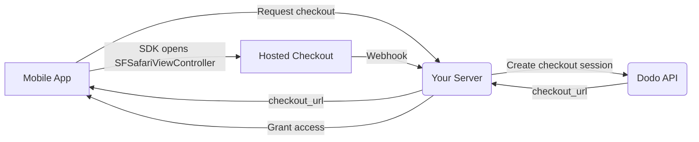

## Giới thiệu

Dodo Payments giúp các nhà phát triển bán hàng hóa và dịch vụ kỹ thuật số trong các ứng dụng iOS, xử lý các khía cạnh phức tạp như tuân thủ thuế, chuyển đổi tiền tệ và thanh toán. Hướng dẫn toàn diện này chi tiết cách tích hợp Dodo Payments vào ứng dụng iOS của bạn, đặc biệt cho các công cụ SaaS, đăng ký nội dung và tiện ích kỹ thuật số.

## Tổng quan

Dodo Payments đóng vai trò là **Merchant of Record (MoR)** của bạn, quản lý các khía cạnh quan trọng của doanh nghiệp kỹ thuật số của bạn:

<Tabs>
<Tab title="What We Handle">
- Thu thập và nộp thuế (VAT, GST và các loại thuế khu vực khác)
- Thanh toán toàn cầu theo chính sách và phương thức thanh toán địa phương
- Chuyển đổi tiền tệ và ngoại hối
- Hoàn tiền và phòng chống gian lận
- Lập hóa đơn và biên lai cho khách hàng cuối
- Tuân thủ quy định khu vực
</Tab>

<Tab title="What You Get">
- Một API thống nhất cho nền tảng web và di động
- Hỗ trợ thanh toán trong ứng dụng (UPI, thẻ, ví điện tử, BNPL)
- Hỗ trợ thanh toán toàn cầu (Payoneer, Wise, chuyển khoản ngân hàng địa phương)
- Bảng phân tích và báo cáo
- Xử lý thanh toán an toàn
</Tab>
</Tabs>

## Trường hợp sử dụng

<CardGroup cols={2}>
<Card title="Subscriptions" icon="repeat">
- Truy cập nội dung hoặc tính năng cao cấp
- Hóa đơn định kỳ với các tùy chọn linh hoạt, dùng thử miễn phí, tính tỷ lệ, hoặc nâng cấp và hạ cấp
</Card>

<Card title="Courses and Learning" icon="graduation-cap">
- Truy cập theo từng khóa học
- Gói nội dung kết hợp
- Giấy phép trọn đời hoặc có thể gia hạn
- Tích hợp theo dõi tiến độ
</Card>

<Card title="Digital Downloads" icon="download">
- Mua một lần (PDF, nhạc, công cụ)
- Cung cấp tài sản kỹ thuật số
- Quản lý khóa giấy phép
</Card>

<Card title="SaaS Tools" icon="screwdriver-wrench">
- Đăng ký phần mềm dạng dịch vụ
- Thanh toán theo mức sử dụng
- Gói cho nhóm và doanh nghiệp
</Card>
</CardGroup>

## Quy trình tích hợp

Ứng dụng của bạn mở checkout được lưu trữ trên Dodo bằng
[iOS checkout SDK](/developer-resources/sdks/ios), SDK này hiển thị checkout trong
`SFSafariViewController` và trả về một kết quả có kiểu.

<Warning>
Sử dụng SDK thay vì nhúng checkout vào một `WebView`. Apple Pay chỉ
khả dụng trong một bề mặt trình duyệt thực, vì vậy `WebView` sẽ âm thầm làm giảm
lượt chuyển đổi từ ví — và các luồng thanh toán bên trong một `WebView` là nguyên nhân phổ biến
khiến ứng dụng bị từ chối trong quá trình xét duyệt trên App
Store.
</Warning>

### Các bước tích hợp

<Steps>
<Step title="Mobile App to Your Server">
Ứng dụng của bạn yêu cầu backend của chính bạn cung cấp URL checkout, được xác thực bằng
session token của người dùng đã đăng nhập.
</Step>

<Step title="Your Server to Dodo API">
Backend của bạn tạo một [checkout session](/developer-resources/checkout-session)
bằng API key của bạn và trả về `checkout_url` cho ứng dụng.

<Warning>
Tạo checkout session trên server của bạn, không bao giờ tạo trong ứng dụng. API key được đóng gói
bên trong binary của ứng dụng có thể bị trích xuất khỏi bundle.
</Warning>
</Step>

<Step title="Mobile App Opens Checkout">
Truyền `checkout_url` cho `DodoCheckout.start(...)`. SDK hiển thị checkout trong
`SFSafariViewController` và trả về kết quả có kiểu khi khách hàng
hoàn tất hoặc đóng checkout.
</Step>

<Step title="Dodo Payments to Your Server">
Dodo Payments gọi webhook endpoint của bạn khi thanh toán thành công hoặc
subscription được kích hoạt.
</Step>

<Step title="Your Server Grants Access">
Mở khóa nội dung đã mua từ webhook đó, không dựa trên kết quả mà ứng dụng
nhận được. Kết quả SDK chỉ là gợi ý cho UI, không phải bằng chứng thanh toán.
</Step>
</Steps>

<CardGroup cols={2}>
<Card title="iOS Checkout SDK" icon="apple" href="/developer-resources/sdks/ios">
  Các bước cài đặt và contract đầy đủ của `start(...)` cho Swift.
</Card>
<Card title="Mobile Integration Guide" icon="mobile" href="/developer-resources/mobile-integration">
  Luồng end-to-end cùng contract tương tự cho Android, React Native và Flutter.
</Card>
</CardGroup>

## Khả năng cung cấp theo khu vực

Dodo Payments cho phép các luồng mua hàng thay thế trong ứng dụng chỉ tại những khu vực App Store mà Apple cho phép rõ ràng thanh toán bên ngoài, hoặc nơi cơ quan quản lý hay lệnh của tòa án bắt buộc điều đó.

### Các khu vực được hỗ trợ

<AccordionGroup>
<Accordion title="United States">
Được hỗ trợ trong phạm vi cho phép của các lệnh hiện hành từ tòa án và các hướng dẫn cập nhật của Apple.

- Khả dụng theo các quy định cụ thể do tòa án yêu cầu
- Phụ thuộc vào việc Apple tuân thủ các yêu cầu pháp lý
- Phải tuân theo các hướng dẫn triển khai của Apple
</Accordion>

<Accordion title="European Union (EU) App Store">
Được hỗ trợ thông qua Apple's EU Alternative Terms và External Purchase Entitlement.

- Được bật thông qua Apple's EU Alternative Terms
- Yêu cầu được phê duyệt External Purchase Entitlement
- Phải tuân thủ các yêu cầu của EU Digital Markets Act
</Accordion>

<Accordion title="South Korea">
Được hỗ trợ thông qua StoreKit External Purchase Entitlement cho các binary chỉ dành cho Hàn Quốc.

- Khả dụng thông qua StoreKit External Purchase Entitlement
- Yêu cầu binary ứng dụng dành riêng cho Hàn Quốc
- Phải tuân thủ luật viễn thông của Hàn Quốc
</Accordion>
</AccordionGroup>

<Warning>
Luôn xem xét và tuân thủ các entitlement theo khu vực của Apple cũng như các yêu cầu của App Store Connect trước khi bật Dodo Payments cho bất kỳ storefront nào. Việc sử dụng các luồng thanh toán thay thế tại những khu vực không được hỗ trợ có thể khiến ứng dụng bị từ chối hoặc gỡ bỏ.
</Warning>

<Note>
Đối với một số mô hình kinh doanh — chẳng hạn như dịch vụ hoặc một số danh mục nội dung nhất định — Apple có thể không yêu cầu sử dụng in-app purchase (IAP). Dodo Payments cũng hỗ trợ các mô hình này. Luôn xác minh phân loại ứng dụng của bạn và các hướng dẫn mới nhất của Apple để xác định IAP có bắt buộc cho trường hợp sử dụng của bạn hay không.
</Note>

### Tìm hiểu thêm

Để xem phân tích chi tiết về các chính sách toàn cầu, tiền lệ pháp lý và những cách tiếp cận chiến lược nhằm tránh phí App Store, hãy xem hướng dẫn toàn diện của chúng tôi:

<Card title="Bypassing App Store & Play Store Fees: A Strategic and Legal Playbook" icon="shield-check" href="/features/bypassing-app-store-fees">
Tìm hiểu nơi và cách bạn có thể triển khai hợp pháp các luồng thanh toán thay thế, cùng hướng dẫn cập nhật theo khu vực và các mẹo tuân thủ.
</Card>